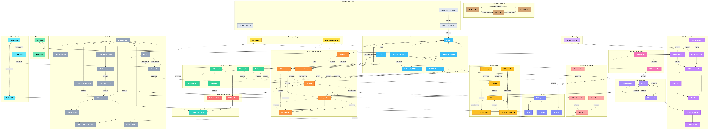
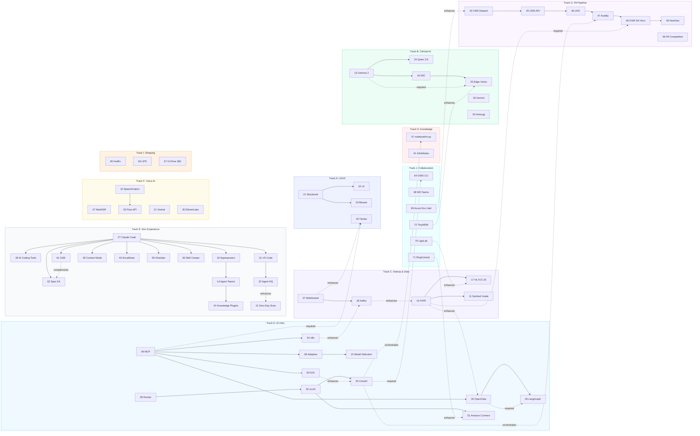
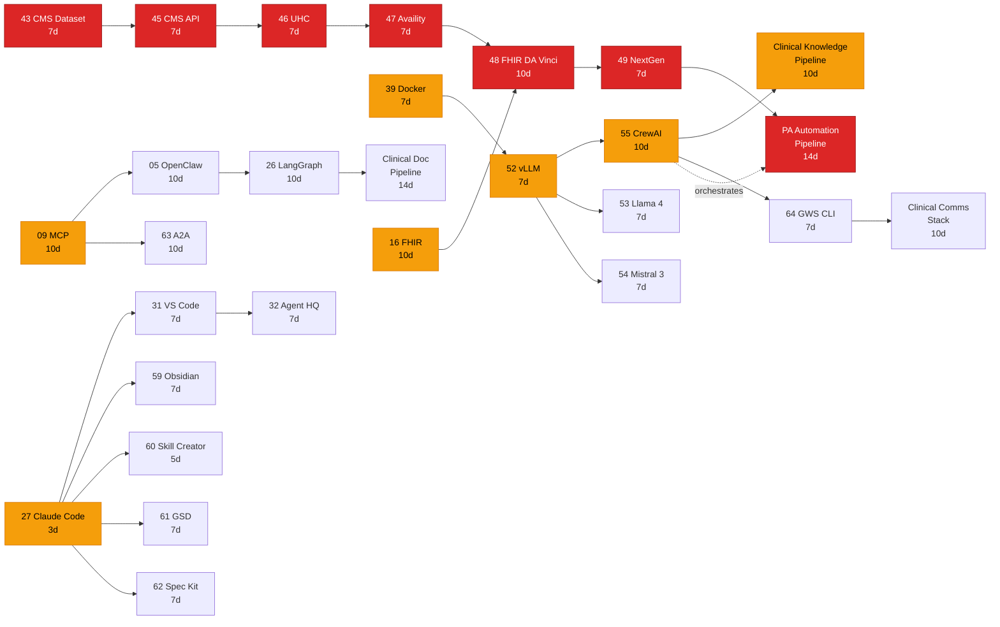

# PMS Experiment Interconnection Roadmap

**Document ID:** PMS-EXP-ROADMAP-001
**Version:** 5.0
**Date:** March 10, 2026
**Author:** Ammar (CEO, MPS Inc.)
**Status:** Living Document

---

## 1. Executive Summary

The PMS project maintains **73 experiments** (numbered 00–72) evaluating technologies across frontend UI tools, clinical AI models, healthcare interoperability standards, edge computing, voice AI, real-time communication, event streaming, workflow automation, prior authorization, content generation, knowledge management, spec-driven development, agent-to-agent communication, developer experience, shipping & logistics, clinical collaboration, document processing, and device management. Each experiment has been documented independently — PRDs, setup guides, and tutorials — but this roadmap serves as the **master navigation guide** mapping how they interconnect.

Since the v4.0 roadmap (covering 00–63), **9 new experiments** (64–72) have been added. These form four major clusters:

1. **Shipping & Logistics** (Exp 65–67) — FedEx national shipping, UPS healthcare logistics with cold-chain compliance, and OnTime 360 local courier dispatch for last-mile specimen/supply delivery
2. **Clinical Collaboration & Communications** (Exp 64, 68, 71) — Google Workspace CLI agent-to-workspace bridge, Microsoft Teams clinical messaging with adaptive cards, and RingCentral unified communications (voice, SMS, fax, video)
3. **Document Processing & Lab Integration** (Exp 69–70) — Azure Document Intelligence for automated intake/insurance card extraction, and LigoLab MS SQL direct LIS connection complementing HL7v2
4. **Mobile Device Management** (Exp 72) — TinyMDM Android MDM for securing PMS mobile devices with zero-touch enrollment and Samsung Knox integration

This roadmap provides:

- A **complete registry** of all 73 experiments with categories, platforms, and documentation inventory
- A **dependency graph** showing which experiments build on or complement others
- **Execution tiers** recommending a foundation-first build order
- **Parallel tracks** for teams that can work on independent streams simultaneously
- A **critical path analysis** identifying bottleneck experiments that gate the most downstream work
- **Quick-start recommendations** for 1-week, 1-month, and 1-quarter execution plans

### How to Use This Document

1. **New to the project?** Start with the [Dependency Chain Overview](#3-dependency-chain-overview-whats-in-it-for-you) diagram for the big picture, then [Section 9: Quick Start Recommendations](#9-quick-start-recommendations)
2. **Planning a sprint?** Check [Section 5: Execution Tiers](#5-recommended-execution-tiers) for prioritization
3. **Looking for related experiments?** Use the [Section 7: Interconnection Matrix](#7-interconnection-matrix)
4. **Assessing risk?** Review [Section 8: Critical Path Analysis](#8-critical-path-analysis) for bottlenecks

### Scope

This roadmap covers experiments 00–72 as documented in `docs/experiments/`. It does not cover core PMS implementation (requirements, ADRs, platform development) — for that, see the [PMS Project Overview](../PMS_Project_Overview.md).

---

## 2. Experiment Registry

| # | Name | Category | Platforms | Dependencies | Doc Types |
|---|------|----------|-----------|-------------|-----------|
| 00 | [Tambo](00-PRD-Tambo-PMS-Integration.md) | Frontend / AI UI | Web | 09-MCP | PRD, Setup, Tutorial |
| 01 | [Storybook](01-Storybook-Getting-Started.md) | Frontend / Dev Tooling | Web | None | Setup, Tutorial |
| 02 | [v0](02-v0-Getting-Started.md) | Frontend / AI UI | Web | 01-Storybook | Setup, Tutorial |
| 03 | [Banani](03-Banani-Getting-Started.md) | Frontend / AI UI | Web | 01-Storybook | Setup, Tutorial |
| 04 | [POC Gap Analysis](04-POC-Gap-Analysis.md) | Analysis | Cross | None | Analysis |
| 05 | [OpenClaw](05-PRD-OpenClaw-PMS-Integration.md) | Backend / AI Agents | Backend, Web | 09-MCP | PRD, Setup, Tutorial |
| 06 | Minimax M25 ADG | AI Models | Backend | None | .docx only |
| 07 | [MedASR](07-PRD-MedASR-PMS-Integration.md) | Backend / AI Models | Backend, Web | None | PRD, Setup, Tutorial |
| 08 | [Adaptive Thinking](08-PRD-AdaptiveThinking-PMS-Integration.md) | Backend / AI Infra | Backend | 09-MCP | PRD, Setup, Tutorial |
| 09 | [MCP](09-PRD-MCP-PMS-Integration.md) | Backend / AI Infra | Backend, Web, Android | None | PRD, Setup, Tutorial |
| 10 | [Speechmatics Medical](10-PRD-SpeechmaticsMedical-PMS-Integration.md) | Backend / External API | Backend, Web | None | PRD, Setup, Tutorial |
| 11 | [Sanford Guide](11-PRD-SanfordGuide-PMS-Integration.md) | Backend / External API | Backend, Web | 16-FHIR | PRD, Setup, Tutorial |
| 12 | [AI Zero-Day Scan](12-PRD-AIZeroDayScan-PMS-Integration.md) | Dev Tooling / Security | CI/CD | None | PRD, Setup, Tutorial, Plan |
| 13 | [Gemma 3](13-PRD-Gemma3-PMS-Integration.md) | Backend / AI Models | Backend | None | PRD, Setup, Tutorial |
| 14 | [Agent Teams](14-agent-teams-claude-whitepaper.md) | Dev Tooling | Dev | 19-Superpowers | Reference, Tutorial |
| 15 | [Claude Model Selection](15-PRD-ClaudeModelSelection-PMS-Integration.md) | Backend / AI Infra | Backend | 09-MCP, 08-Adaptive | PRD, Setup, Tutorial |
| 16 | [FHIR](16-PRD-FHIR-PMS-Integration.md) | Backend / Interop | Backend, Web | None | PRD, Setup, Tutorial |
| 17 | [HL7v2 LIS](17-PRD-HL7v2LIS-PMS-Integration.md) | Backend / Interop | Backend, Web | 16-FHIR | PRD, Setup, Tutorial |
| 18 | [ISIC Archive](18-PRD-ISICArchive-PMS-Integration.md) | Backend / AI Models / Edge | Backend, Web, Edge | 13-Gemma 3 | PRD, Setup, Tutorial |
| 19 | [Superpowers](19-PRD-Superpowers-PMS-Integration.md) | Dev Tooling | Dev | None | PRD, Setup, Tutorial |
| 20 | [Qwen 3.5](20-PRD-Qwen35-PMS-Integration.md) | Backend / AI Models | Backend | 13-Gemma 3 | PRD, Setup, Tutorial |
| 21 | [Voxtral Transcribe 2](21-PRD-VoxtralTranscribe2-PMS-Integration.md) | Backend / AI Models | Backend, Web | None | PRD, Setup, Tutorial |
| 22 | [Patient Safety AI Ref](22-PMS_AI_Extension_Ideas.md) | Reference / Analysis | Cross | None | Reference |
| 23 | [Atlas Agentic AI](23-Atlas-Agentic-AI-Healthcare-Synergies.md) | Reference / Analysis | Cross | None | Reference |
| 24 | [Knowledge Work Plugins](24-PRD-KnowledgeWorkPlugins-PMS-Integration.md) | Dev Tooling | Dev | 19-Superpowers, 14-Agent Teams | PRD, Setup, Tutorial |
| 25 | [Edge Vision Stream](25-PRD-EdgeVisionStream-PMS-Integration.md) | Edge / AI Models | Edge, Android | 18-ISIC, 13-Gemma 3 | PRD, Setup, Tutorial, Build Guide |
| 26 | [LangGraph](26-PRD-LangGraph-PMS-Integration.md) | Backend / AI Agents | Backend, Web | 09-MCP, 05-OpenClaw | PRD, Setup, Tutorial |
| 27 | [Claude Code](27-ClaudeCode-Developer-Tutorial.md) | Dev Tooling | Dev | None | Tutorial |
| 28 | [AI Coding Tools Landscape](28-AI-Coding-Tools-Landscape-2026.md) | Dev Tooling / Strategic | Cross | 27-Claude Code | Research |
| 29 | [Gemini Interactions API](29-PRD-GeminiInteractions-PMS-Integration.md) | Backend / AI Infra | Backend, Web | None | PRD, Setup, Tutorial |
| 30 | [ElevenLabs](30-PRD-ElevenLabs-PMS-Integration.md) | Backend / Voice AI | Backend, Web | None | PRD, Setup, Tutorial |
| 31 | [VS Code Multi-Agent](31-PRD-VSCodeMultiAgent-PMS-Integration.md) | Dev Tooling | Dev | 27-Claude Code | PRD, Setup, Tutorial |
| 32 | [GitHub Agent HQ](32-PRD-GitHubAgentHQ-PMS-Integration.md) | Dev Tooling / Governance | Dev, CI/CD | 31-VS Code | PRD, Setup, Tutorial |
| 33 | [Speechmatics Flow](33-PRD-SpeechmaticsFlow-PMS-Integration.md) | Backend / Voice AI | Backend, Web | 10-Speechmatics | PRD, Setup, Tutorial |
| 34 | [n8n 2.0+](34-PRD-n8nUpdates-PMS-Integration.md) | Backend / Automation | Backend, Web | 09-MCP | PRD, Setup, Tutorial |
| 35 | [Kintsugi Open-Source](35-PRD-KintsugiOpenSource-PMS-Integration.md) | Backend / AI Models | Backend, Web | None | PRD, Setup, Tutorial |
| 36 | [Claude Context Mode](36-PRD-ClaudeContextMode-PMS-Integration.md) | Dev Tooling | Dev | 27-Claude Code | PRD, Setup, Tutorial |
| 37 | [WebSocket](37-PRD-WebSocket-PMS-Integration.md) | Backend / Real-Time | Backend, Web, Android | None | PRD, Setup, Tutorial |
| 38 | [Apache Kafka](38-PRD-Kafka-PMS-Integration.md) | Backend / Event Streaming | Backend | None | PRD, Setup, Tutorial |
| 39 | [Docker](39-PRD-Docker-PMS-Integration.md) | Infrastructure | Backend, Web, CI/CD | None | PRD, Setup, Tutorial |
| 40 | [ExcalidrawSkill](40-PRD-ExcalidrawSkill-PMS-Integration.md) | Dev Tooling / Visualization | Dev | 27-Claude Code | PRD, Setup, Tutorial |
| 41 | [InfraNodus](41-PRD-InfraNodus-PMS-Integration.md) | Analysis / Knowledge | Backend, Web | None | PRD, Setup, Tutorial |
| 42 | [GPT-5.4 Benchmark](42-PRD-GPT54Benchmark-PMS-Integration.md) | AI Models / Evaluation | Backend | 52-vLLM | PRD, Setup, Tutorial |
| 43 | [CMS PA Dataset](43-PRD-CMSPriorAuthDataset-PMS-Integration.md) | PA / Data | Backend | None | PRD, Setup, Tutorial |
| 44 | [Payer Policy Download](44-PRD-PayerPolicyDownload-PMS-Integration.md) | PA / Data | Backend | 39-Docker | PRD |
| 45 | [CMS Coverage API](45-PRD-CMSCoverageAPI-PMS-Integration.md) | PA / Integration | Backend, Web | 43-CMS PA Dataset | PRD, Setup, Tutorial |
| 46 | [UHC API Marketplace](46-PRD-UHCAPIMarketplace-PMS-Integration.md) | PA / Integration | Backend, Web | 45-CMS Coverage | PRD, Setup, Tutorial |
| 47 | [Availity Clearinghouse](47-PRD-AvailityMultiPayer-PMS-Integration.md) | PA / Integration | Backend, Web | 45, 46 | PRD, Setup, Tutorial |
| 48 | [FHIR Da Vinci PA](48-PRD-FHIRDaVinciPA-PMS-Integration.md) | PA / Interop | Backend, Web | 47-Availity, 16-FHIR | PRD, Setup, Tutorial |
| 49 | [NextGen FHIR EHR](49-PRD-NextGenFHIR-PMS-Integration.md) | PA / EHR Import | Backend, Web | 48-FHIR DA Vinci | PRD, Setup, Tutorial |
| 50 | [OWASP LLM Top 10](50-PRD-OWASPLLMTop10-PMS-Integration.md) | Security / Compliance | Backend, CI/CD | None | PRD, Setup, Tutorial |
| 51 | [Amazon Connect Health](51-PRD-AmazonConnectHealth-PMS-Integration.md) | Backend / Contact Center | Backend, Web | 52-vLLM | PRD, Setup, Tutorial |
| 52 | [vLLM](52-PRD-vLLM-PMS-Integration.md) | AI Infra / Inference | Backend | 39-Docker | PRD, Setup, Tutorial |
| 53 | [Llama 4](53-PRD-Llama4-PMS-Integration.md) | AI Models / Inference | Backend | 52-vLLM | PRD, Setup, Tutorial |
| 54 | [Mistral 3](54-PRD-Mistral3-PMS-Integration.md) | AI Models / Inference | Backend | 52-vLLM | PRD, Setup, Tutorial |
| 55 | [CrewAI](55-PRD-CrewAI-PMS-Integration.md) | Backend / AI Agents | Backend, Web | 52-vLLM | PRD, Setup, Tutorial |
| 56 | [PA Competitive Landscape](56-PA-Competitive-Landscape.md) | Strategic / Analysis | Cross | None | Analysis, PDF |
| 57 | [notebooklm-py](57-PRD-NotebookLM-Py-PMS-Integration.md) | Content Generation | Backend, Web | None | PRD, Setup, Tutorial |
| 58 | [Supabase + Claude Code](58-PRD-SupabaseClaudeCode-PMS-Integration.md) | Infrastructure / Database | Backend, Web, Android | 39-Docker | PRD, Setup, Tutorial |
| 59 | [Obsidian + Claude Code](59-PRD-ObsidianClaudeCode-PMS-Integration.md) | Knowledge Management | Dev | 27-Claude Code | PRD, Setup, Tutorial |
| 60 | [Skill Creator](60-PRD-SkillCreator-PMS-Integration.md) | Dev Tooling / Framework | Dev | 27-Claude Code | PRD, Setup, Tutorial |
| 61 | [GSD](61-PRD-GSD-PMS-Integration.md) | Dev Tooling / SDD | Dev | 27-Claude Code | PRD, Setup, Tutorial, Comparative |
| 62 | [Spec Kit](62-PRD-SpecKit-PMS-Integration.md) | Dev Tooling / SDD | Dev | 27-Claude Code | PRD, Setup, Tutorial |
| 63 | [A2A Protocol](63-PRD-A2A-PMS-Integration.md) | Backend / Agent Interop | Backend, Web | 09-MCP | PRD, Setup, Tutorial |
| 64 | [GWS CLI](64-PRD-GWSCLI-PMS-Integration.md) | Backend / Workspace Automation | Backend, Web, Android | 55-CrewAI | PRD, Setup, Tutorial |
| 65 | [FedEx API](65-PRD-FedExAPI-PMS-Integration.md) | Backend / Shipping & Logistics | Backend, Web, Android | None | PRD, Setup, Tutorial |
| 66 | [UPS API](66-PRD-UPSAPI-PMS-Integration.md) | Backend / Shipping & Logistics | Backend, Web, Android | None | PRD, Setup, Tutorial |
| 67 | [OnTime 360](67-PRD-OnTime360API-PMS-Integration.md) | Backend / Shipping & Logistics | Backend, Web, Android | None | PRD, Setup, Tutorial |
| 68 | [MS Teams](68-PRD-MSTeams-PMS-Integration.md) | Backend / Collaboration | Backend, Web, Android | None | PRD, Setup, Tutorial |
| 69 | [Azure Doc Intelligence](69-PRD-AzureDocIntel-PMS-Integration.md) | Backend / Document AI | Backend, Web, Android | None | PRD, Setup, Tutorial |
| 70 | [LigoLab MS SQL](70-PRD-LigoLab-PMS-Integration.md) | Backend / Interop (LIS) | Backend, Web, Android | None | PRD, Setup, Tutorial |
| 71 | [RingCentral API](71-PRD-RingCentralAPI-PMS-Integration.md) | Backend / Communication | Backend, Web, Android | None | PRD, Setup, Tutorial |
| 72 | [TinyMDM](72-PRD-TinyMDM-PMS-Integration.md) | Mobile / Device Management | Android, Backend | None | PRD, Setup, Tutorial |

---

## 3. Dependency Chain Overview (What's In It For You)



_Each green node shows the outcome you get at the end of that dependency chain. Foundations (dark blue) at top, value propositions (green) at bottom. Orange nodes (vLLM, CrewAI) are high-fanout hubs gating the most downstream work._

---

## 4. Master Dependency Graph

```mermaid
flowchart TD
    %% ── Subgraph: UI Tools ──
    subgraph UI["UI Tools"]
        E01["01 Storybook"]
        E02["02 v0"]
        E03["03 Banani"]
        E00["00 Tambo"]
    end

    %% ── Subgraph: AI Infrastructure ──
    subgraph INFRA["AI Infrastructure"]
        E09["09 MCP"]
        E08["08 Adaptive Thinking"]
        E15["15 Claude Model Selection"]
        E29["29 Gemini Interactions"]
        E52["52 vLLM"]
        E42["42 GPT-5.4 Benchmark"]
    end

    %% ── Subgraph: On-Premise Models ──
    subgraph MODELS["On-Premise Models"]
        E06["06 Minimax M25"]
        E13["13 Gemma 3"]
        E20["20 Qwen 3.5"]
        E53["53 Llama 4"]
        E54["54 Mistral 3"]
    end

    %% ── Subgraph: Speech & Voice AI ──
    subgraph SPEECH["Speech & Voice AI"]
        E07["07 MedASR"]
        E10["10 Speechmatics"]
        E21["21 Voxtral Transcribe 2"]
        E30["30 ElevenLabs"]
        E33["33 Speechmatics Flow"]
        E35["35 Kintsugi"]
    end

    %% ── Subgraph: Clinical Decision Support ──
    subgraph CDS["Clinical Decision Support"]
        E11["11 Sanford Guide"]
        E18["18 ISIC Archive"]
    end

    %% ── Subgraph: Interoperability ──
    subgraph INTEROP["Interoperability"]
        E16["16 FHIR"]
        E17["17 HL7v2 LIS"]
        E70["70 LigoLab MS SQL"]
    end

    %% ── Subgraph: Prior Authorization ──
    subgraph PA["Prior Authorization"]
        E43["43 CMS PA Dataset"]
        E44["44 Payer Policies"]
        E45["45 CMS Coverage API"]
        E46["46 UHC API"]
        E47["47 Availity"]
        E48["48 FHIR DA Vinci PA"]
        E49["49 NextGen FHIR"]
        E56["56 PA Competitive"]
    end

    %% ── Subgraph: Agentic AI & Automation ──
    subgraph AGENTS["Agentic AI & Automation"]
        E05["05 OpenClaw"]
        E26["26 LangGraph"]
        E34["34 n8n 2.0+"]
        E55["55 CrewAI"]
        E51["51 Amazon Connect"]
        E63["63 A2A Protocol"]
    end

    %% ── Subgraph: Real-Time & Streaming ──
    subgraph REALTIME["Real-Time & Streaming"]
        E37["37 WebSocket"]
        E38["38 Apache Kafka"]
    end

    %% ── Subgraph: Edge Computing ──
    subgraph EDGE["Edge Computing"]
        E25["25 Edge Vision Stream"]
    end

    %% ── Subgraph: Infrastructure ──
    subgraph PLATFORM["Infrastructure"]
        E39["39 Docker"]
        E58["58 Supabase"]
    end

    %% ── Subgraph: Knowledge & Content ──
    subgraph KNOWLEDGE["Knowledge & Content"]
        E57["57 notebooklm-py"]
        E59["59 Obsidian"]
        E41["41 InfraNodus"]
        E40["40 ExcalidrawSkill"]
    end

    %% ── Subgraph: Dev Tooling ──
    subgraph DEVTOOL["Dev Tooling"]
        E12["12 AI Zero-Day Scan"]
        E14["14 Agent Teams"]
        E19["19 Superpowers"]
        E24["24 Knowledge Work Plugins"]
        E27["27 Claude Code"]
        E28["28 AI Coding Tools"]
        E31["31 VS Code Multi-Agent"]
        E32["32 GitHub Agent HQ"]
        E36["36 Claude Context Mode"]
        E60["60 Skill Creator"]
        E61["61 GSD"]
        E62["62 Spec Kit"]
    end

    %% ── Subgraph: Shipping & Logistics ──
    subgraph SHIPPING["Shipping & Logistics"]
        E65["65 FedEx API"]
        E66["66 UPS API"]
        E67["67 OnTime 360"]
    end

    %% ── Subgraph: Collaboration & Communications ──
    subgraph COMMS["Collaboration & Communications"]
        E64["64 GWS CLI"]
        E68["68 MS Teams"]
        E71["71 RingCentral"]
    end

    %% ── Subgraph: Document Processing ──
    subgraph DOCAI["Document Processing"]
        E69["69 Azure Doc Intel"]
    end

    %% ── Subgraph: Security ──
    subgraph SECURITY["Security & Compliance"]
        E50["50 OWASP LLM Top 10"]
        E72["72 TinyMDM"]
    end

    %% ── Subgraph: Reference & Analysis ──
    subgraph REF["Reference & Analysis"]
        E04["04 POC Gap Analysis"]
        E22["22 Patient Safety AI Ref"]
        E23["23 Atlas Agentic AI"]
    end

    %% ── Hard Dependencies (solid arrows) ── Original 00-38
    E01 --> E02
    E01 --> E03
    E09 --> E00
    E09 --> E05
    E09 --> E08
    E09 --> E26
    E09 --> E34
    E05 --> E26
    E08 --> E15
    E09 --> E15
    E13 --> E20
    E13 --> E18
    E16 --> E17
    E16 --> E11
    E18 --> E25
    E13 --> E25
    E19 --> E14
    E19 --> E24
    E14 --> E24
    E27 --> E19
    E27 --> E14
    E27 --> E28
    E27 --> E31
    E27 --> E36
    E10 --> E33
    E31 --> E32

    %% ── Hard Dependencies (solid arrows) ── New 39-60
    E39 --> E52
    E39 --> E58
    E39 --> E44
    E52 --> E53
    E52 --> E54
    E52 --> E42
    E52 --> E55
    E52 --> E51
    E43 --> E45
    E45 --> E46
    E45 --> E47
    E46 --> E47
    E47 --> E48
    E16 --> E48
    E48 --> E49
    E27 --> E59
    E27 --> E60
    E27 --> E61
    E27 --> E62
    E27 --> E40
    E09 --> E63

    %% ── Hard Dependencies (solid arrows) ── New 64-72
    E55 --> E64

    %% ── Complementary / Enhances (dashed arrows) ── Original
    E07 -.->|enhances| E10
    E07 -.->|enhances| E21
    E10 -.->|complements| E21
    E13 -.->|enhances| E07
    E20 -.->|enhances| E11
    E05 -.->|enhances| E00
    E16 -.->|enhances| E05
    E26 -.->|enhances| E05
    E12 -.->|parallel| E19
    E08 -.->|enhances| E05
    E23 -.->|informs| E05
    E22 -.->|informs| E04
    E04 -.->|informs| E09
    E29 -.->|enhances| E15
    E30 -.->|complements| E07
    E30 -.->|complements| E33
    E33 -.->|enhances| E10
    E34 -.->|enhances| E05
    E34 -.->|enhances| E38
    E35 -.->|enhances| E07
    E37 -.->|enhances| E38
    E38 -.->|enhances| E16
    E38 -.->|enhances| E17
    E37 -.->|enhances| E00
    E32 -.->|enhances| E12
    E36 -.->|enhances| E19

    %% ── Complementary / Enhances (dashed arrows) ── New 39-60
    E55 -.->|orchestrates| E57
    E55 -.->|orchestrates| E26
    E53 -.->|enhances| E55
    E54 -.->|enhances| E55
    E42 -.->|informs| E55
    E44 -.->|enhances| E45
    E56 -.->|informs| E43
    E50 -.->|gates| E52
    E50 -.->|gates| E55
    E41 -.->|enhances| E55
    E59 -.->|enhances| E60
    E57 -.->|enhances| E59
    E40 -.->|enhances| E59
    E51 -.->|complements| E55
    E61 -.->|complements| E62
    E62 -.->|complements| E61
    E61 -.->|enhances| E60
    E62 -.->|enhances| E55
    E63 -.->|enhances| E55
    E63 -.->|enhances| E26
    E63 -.->|enhances| E05
    E63 -.->|complements| E09

    %% ── Complementary / Enhances (dashed arrows) ── New 64-72
    E65 -.->|complements| E66
    E65 -.->|complements| E67
    E66 -.->|complements| E67
    E68 -.->|complements| E71
    E68 -.->|complements| E64
    E69 -.->|enhances| E43
    E69 -.->|enhances| E44
    E70 -.->|enhances| E17
    E71 -.->|enhances| E51
    E72 -.->|enhances| E25

    %% ── Color Classes ──
    classDef ui fill:#818cf8,stroke:#4f46e5,color:#fff
    classDef infra fill:#38bdf8,stroke:#0284c7,color:#fff
    classDef models fill:#34d399,stroke:#059669,color:#fff
    classDef speech fill:#fbbf24,stroke:#d97706,color:#000
    classDef cds fill:#f87171,stroke:#dc2626,color:#fff
    classDef interop fill:#a78bfa,stroke:#7c3aed,color:#fff
    classDef agents fill:#fb923c,stroke:#ea580c,color:#fff
    classDef realtime fill:#f472b6,stroke:#ec4899,color:#fff
    classDef edge fill:#2dd4bf,stroke:#0d9488,color:#fff
    classDef devtool fill:#94a3b8,stroke:#64748b,color:#fff
    classDef ref fill:#e2e8f0,stroke:#94a3b8,color:#334155
    classDef pa fill:#c084fc,stroke:#9333ea,color:#fff
    classDef platform fill:#6ee7b7,stroke:#10b981,color:#000
    classDef knowledge fill:#fca5a5,stroke:#ef4444,color:#000
    classDef security fill:#fde047,stroke:#ca8a04,color:#000
    classDef shipping fill:#d4a574,stroke:#a3866e,color:#000
    classDef comms fill:#67e8f9,stroke:#22d3ee,color:#000
    classDef docai fill:#d8b4fe,stroke:#a78bfa,color:#000

    class E00,E01,E02,E03 ui
    class E09,E08,E15,E29,E52,E42 infra
    class E06,E13,E20,E53,E54 models
    class E07,E10,E21,E30,E33,E35 speech
    class E11,E18 cds
    class E16,E17,E70 interop
    class E05,E26,E34,E55,E51,E63 agents
    class E37,E38 realtime
    class E25 edge
    class E12,E14,E19,E24,E27,E28,E31,E32,E36,E60,E61,E62 devtool
    class E04,E22,E23 ref
    class E43,E44,E45,E46,E47,E48,E49,E56 pa
    class E39,E58 platform
    class E57,E59,E41,E40 knowledge
    class E50,E72 security
    class E65,E66,E67 shipping
    class E64,E68,E71 comms
    class E69 docai
```



**Legend:** Solid arrows = hard dependency (must be implemented first). Dashed arrows = complementary/enhances (benefits from but does not require).

---

## 5. Recommended Execution Tiers

### Tier 0 — Foundation (Weeks 1–2)

Establish infrastructure, standards, and context. These experiments have **zero dependencies** and are prerequisites for most later work.

| # | Experiment | Rationale |
|---|-----------|-----------|
| 04 | POC Gap Analysis | Understand current coverage gaps before building |
| 09 | MCP | Foundation protocol — 7 experiments depend on it |
| 16 | FHIR | Interoperability backbone — gates HL7v2, Sanford Guide, and FHIR DA Vinci PA |
| 01 | Storybook | Component infrastructure — gates v0 and Banani |
| 19 | Superpowers | Dev workflow — gates Agent Teams and Knowledge Work Plugins |
| 22 | Patient Safety AI Ref | Reference — informs prioritization |
| 23 | Atlas Agentic AI | Reference — maps 50 use cases to PMS subsystems |
| 27 | Claude Code | Developer prerequisite — gates 7 experiments (most gated dev tool) |
| 28 | AI Coding Tools Landscape | Strategic — understand vendor landscape and lock-in risks |
| 39 | Docker | Container orchestration — gates vLLM, Supabase, Payer Policies |
| 43 | CMS PA Dataset | PA training data — gates CMS Coverage API and downstream PA pipeline |
| 50 | OWASP LLM Top 10 | Security baseline — gates all AI inference deployments |

### Tier 1 — Core Capabilities (Weeks 3–5)

Build on Tier 0 foundations. These experiments provide core AI, interop, security, real-time, voice, and infrastructure capabilities.

| # | Experiment | Dependencies |
|---|-----------|-------------|
| 08 | Adaptive Thinking | 09-MCP |
| 13 | Gemma 3 | None (but benefits from Tier 0 context) |
| 15 | Claude Model Selection | 09-MCP, 08-Adaptive |
| 17 | HL7v2 LIS | 16-FHIR |
| 07 | MedASR | None (standalone, but position here for clinical pipeline) |
| 12 | AI Zero-Day Scan | None (parallel security track) |
| 29 | Gemini Interactions API | None (cloud AI complement to on-premise models) |
| 30 | ElevenLabs | None (standalone voice AI) |
| 35 | Kintsugi Open-Source | None (standalone voice biomarker screening) |
| 37 | WebSocket | None (foundational real-time transport layer) |
| 52 | vLLM | 39-Docker (high-throughput inference engine) |
| 58 | Supabase + Claude Code | 39-Docker (AI-assisted database tooling) |
| 44 | Payer Policy Download | 39-Docker (policy document extraction) |
| 45 | CMS Coverage API | 43-CMS PA Dataset (real-time coverage determination) |
| 65 | FedEx API | None (national shipping for specimens/supplies) |
| 66 | UPS API | None (healthcare logistics with cold-chain) |
| 67 | OnTime 360 | None (local courier dispatch, last-mile delivery) |
| 68 | MS Teams | None (clinical collaboration with adaptive cards) |
| 69 | Azure Doc Intelligence | None (automated intake document extraction) |
| 70 | LigoLab MS SQL | None (direct LIS database connection) |
| 71 | RingCentral API | None (unified communications — voice, SMS, fax) |
| 72 | TinyMDM | None (Android MDM for PMS mobile devices) |

### Tier 2 — Integration & Expansion (Weeks 6–9)

Combine Tier 1 capabilities into integrated workflows. Multiple experiments can run in parallel.

| # | Experiment | Dependencies |
|---|-----------|-------------|
| 05 | OpenClaw | 09-MCP |
| 10 | Speechmatics Medical | None (compare with 07-MedASR) |
| 20 | Qwen 3.5 | 13-Gemma 3 |
| 11 | Sanford Guide | 16-FHIR |
| 00 | Tambo | 09-MCP |
| 02 | v0 | 01-Storybook |
| 03 | Banani | 01-Storybook |
| 14 | Agent Teams | 19-Superpowers |
| 21 | Voxtral Transcribe 2 | None (compare with 07, 10) |
| 31 | VS Code Multi-Agent | 27-Claude Code |
| 33 | Speechmatics Flow | 10-Speechmatics |
| 34 | n8n 2.0+ | 09-MCP |
| 36 | Claude Context Mode | 27-Claude Code |
| 38 | Apache Kafka | None (complements 37-WebSocket) |
| 53 | Llama 4 | 52-vLLM |
| 54 | Mistral 3 | 52-vLLM |
| 42 | GPT-5.4 Benchmark | 52-vLLM (model evaluation framework) |
| 46 | UHC API Marketplace | 45-CMS Coverage (single-payer deep integration) |
| 47 | Availity Clearinghouse | 45, 46 (unified multi-payer API) |
| 40 | ExcalidrawSkill | 27-Claude Code |
| 59 | Obsidian + Claude Code | 27-Claude Code |
| 60 | Skill Creator | 27-Claude Code |
| 57 | notebooklm-py | None (standalone content generation) |
| 41 | InfraNodus | None (text network analysis) |
| 61 | GSD | 27-Claude Code (spec-driven execution framework) |
| 62 | Spec Kit | 27-Claude Code (specification-layer SDD toolkit) |
| 63 | A2A Protocol | 09-MCP (inter-agent communication protocol) |

### Tier 3 — Advanced Capabilities (Weeks 10–12)

Complex integrations requiring multiple Tier 1–2 foundations.

| # | Experiment | Dependencies |
|---|-----------|-------------|
| 18 | ISIC Archive (DermaCheck) | 13-Gemma 3 |
| 25 | Edge Vision Stream | 18-ISIC, 13-Gemma 3 |
| 26 | LangGraph | 09-MCP, 05-OpenClaw |
| 24 | Knowledge Work Plugins | 19-Superpowers, 14-Agent Teams |
| 32 | GitHub Agent HQ | 31-VS Code Multi-Agent |
| 55 | CrewAI | 52-vLLM (multi-agent orchestration) |
| 51 | Amazon Connect Health | 52-vLLM (contact center automation) |
| 48 | FHIR Da Vinci PA | 47-Availity, 16-FHIR (2027 compliance) |
| 49 | NextGen FHIR EHR | 48-FHIR DA Vinci (EHR data import) |
| 64 | GWS CLI | 55-CrewAI (agent-to-workspace bridge) |

### Tier 4 — Capstone Integrations (Week 13+)

Full end-to-end clinical workflows combining multiple experiments.

| Pipeline | Experiments Combined | Description |
|----------|---------------------|-------------|
| Clinical Documentation Pipeline | 07/10/21 + 13/20 + 05 + 26 + 55 | Transcribe → Structure → Approve → File (CrewAI orchestrated) |
| Full DermaCheck + Edge | 18 + 25 + 13 + 09 + 16 | Capture → Classify → Risk Score → FHIR Export |
| Autonomous Care Coordination | 05 + 26 + 16 + 11 + 15 + 55 + 63 | Multi-step agent with HITL, FHIR interop, model routing, A2A cross-org delegation |
| Real-Time Clinical Event Pipeline | 37 + 38 + 34 + 16 | Stream DB changes → Kafka topics → n8n automation → FHIR exchange |
| Voice AI Full Stack | 07/10/21 + 30 + 33 + 35 | Transcribe → Synthesize readback → Voice agent → Mental health screening |
| Three-Layer Agent Governance | 27 + 31 + 32 + 36 + 12 | CLI agents + IDE agents + Platform governance + context optimization + security scanning |
| **PA Automation Pipeline** | 43 + 44 + 45 + 46 + 47 + 48 + 49 + 55 | Dataset → Policies → Coverage → Payer APIs → FHIR PA → EHR import → CrewAI orchestration |
| **Clinical Knowledge Pipeline** | 55 + 57 + 59 + 41 | CrewAI generates summaries → NotebookLM transforms to audio/quiz → Obsidian stores → InfraNodus maps relationships |
| **AI Model Deployment Stack** | 39 + 52 + 53 + 54 + 42 + 50 | Docker → vLLM → Llama/Mistral → Benchmark → Security gate |
| **Spec-Driven Dev Pipeline** | 27 + 60 + 61 + 62 | Claude Code → Skill Creator → GSD execution + Spec Kit specification → Full SDD lifecycle |
| **Specimen Logistics Pipeline** | 65 + 66 + 67 + 69 | FedEx/UPS national → OnTime 360 local → Azure Doc Intel for shipping docs → End-to-end specimen tracking |
| **Clinical Communications Stack** | 64 + 68 + 71 + 51 | GWS CLI workspace bridge + MS Teams messaging + RingCentral telephony + Amazon Connect contact center |
| **Secure Mobile Clinical Platform** | 72 + 25 + 37 | TinyMDM device policy → Edge Vision Stream capture → WebSocket real-time sync |

### Execution Timeline (Gantt)

```mermaid
gantt
    title Experiment Execution Tiers (v5.0)
    dateFormat YYYY-MM-DD
    axisFormat %b %d

    section Tier 0 — Foundation
    04 POC Gap Analysis        :t04, 2026-03-09, 3d
    09 MCP                     :t09, 2026-03-09, 10d
    16 FHIR                    :t16, 2026-03-09, 10d
    01 Storybook               :t01, 2026-03-09, 5d
    19 Superpowers             :t19, 2026-03-09, 5d
    22 Patient Safety Ref      :t22, 2026-03-09, 2d
    23 Atlas Agentic AI        :t23, 2026-03-09, 2d
    27 Claude Code             :t27, 2026-03-09, 3d
    28 AI Coding Tools         :t28, after t27, 2d
    39 Docker                  :t39, 2026-03-09, 7d
    43 CMS PA Dataset          :t43, 2026-03-09, 7d
    50 OWASP LLM Top 10       :t50, 2026-03-09, 5d

    section Tier 1 — Core
    08 Adaptive Thinking       :t08, after t09, 7d
    13 Gemma 3                 :t13, 2026-03-16, 10d
    15 Claude Model Selection  :t15, after t08, 5d
    17 HL7v2 LIS               :t17, after t16, 7d
    07 MedASR                  :t07, 2026-03-16, 7d
    12 AI Zero-Day Scan        :t12, 2026-03-16, 5d
    29 Gemini Interactions     :t29, 2026-03-16, 7d
    30 ElevenLabs              :t30, 2026-03-16, 5d
    35 Kintsugi                :t35, 2026-03-16, 7d
    37 WebSocket               :t37, 2026-03-16, 7d
    52 vLLM                    :t52, after t39, 7d
    58 Supabase                :t58, after t39, 5d
    44 Payer Policies          :t44, after t39, 5d
    45 CMS Coverage API        :t45, after t43, 7d
    65 FedEx API               :t65, 2026-03-16, 7d
    66 UPS API                 :t66, 2026-03-16, 7d
    67 OnTime 360              :t67, 2026-03-16, 7d
    68 MS Teams                :t68, 2026-03-16, 7d
    69 Azure Doc Intel         :t69, 2026-03-16, 7d
    70 LigoLab MS SQL          :t70, 2026-03-16, 7d
    71 RingCentral API         :t71, 2026-03-16, 7d
    72 TinyMDM                 :t72, 2026-03-16, 5d

    section Tier 2 — Integration
    05 OpenClaw                :t05, after t09, 10d
    10 Speechmatics            :t10, after t07, 5d
    20 Qwen 3.5                :t20, after t13, 7d
    11 Sanford Guide           :t11, after t16, 7d
    00 Tambo                   :t00, after t09, 7d
    02 v0                      :t02, after t01, 5d
    03 Banani                  :t03, after t01, 5d
    14 Agent Teams             :t14, after t19, 5d
    21 Voxtral Transcribe 2    :t21, after t07, 5d
    31 VS Code Multi-Agent     :t31, after t28, 7d
    33 Speechmatics Flow       :t33, after t10, 7d
    34 n8n 2.0+                :t34, after t09, 7d
    36 Claude Context Mode     :t36, after t27, 5d
    38 Apache Kafka            :t38, after t37, 10d
    53 Llama 4                 :t53, after t52, 7d
    54 Mistral 3               :t54, after t52, 7d
    42 GPT-5.4 Benchmark       :t42, after t52, 7d
    46 UHC API                 :t46, after t45, 7d
    47 Availity                :t47, after t46, 7d
    40 ExcalidrawSkill         :t40, after t27, 5d
    59 Obsidian                :t59, after t27, 7d
    60 Skill Creator           :t60, after t27, 5d
    57 notebooklm-py           :t57, 2026-03-23, 7d
    41 InfraNodus              :t41, 2026-03-23, 5d
    61 GSD                     :t61, after t27, 7d
    62 Spec Kit                :t62, after t27, 7d
    63 A2A Protocol             :t63, after t09, 10d

    section Tier 3 — Advanced
    18 ISIC Archive            :t18, after t13, 10d
    25 Edge Vision Stream      :t25, after t18, 10d
    26 LangGraph               :t26, after t05, 10d
    24 Knowledge Work Plugins  :t24, after t14, 7d
    32 GitHub Agent HQ         :t32, after t31, 7d
    55 CrewAI                  :t55, after t52, 10d
    51 Amazon Connect          :t51, after t52, 10d
    48 FHIR DA Vinci PA        :t48, after t47, 10d
    49 NextGen FHIR            :t49, after t48, 7d
    64 GWS CLI                 :t64, after t55, 7d

    section Tier 4 — Capstone
    Clinical Doc Pipeline      :t_cdp, after t55, 14d
    Full DermaCheck + Edge     :t_dce, after t25, 14d
    Real-Time Event Pipeline   :t_rep, after t38, 10d
    Voice AI Full Stack        :t_vfs, after t33, 10d
    Agent Governance Stack     :t_ags, after t32, 7d
    PA Automation Pipeline     :t_pap, after t49, 14d
    Clinical Knowledge Pipeline:t_ckp, after t55, 10d
    AI Model Deploy Stack      :t_ams, after t42, 7d
    Spec-Driven Dev Pipeline   :t_sdp, after t62, 7d
    Specimen Logistics Pipeline:t_slp, after t67, 10d
    Clinical Comms Stack       :t_ccs, after t64, 10d
    Secure Mobile Platform     :t_smp, after t72, 10d
```



---

## 6. Parallel Execution Tracks

Ten independent tracks that can be staffed and executed simultaneously. Cross-track dependencies are minimal and noted explicitly.

### Track A — UI/UX
```
01-Storybook → 02-v0 → 03-Banani → 00-Tambo
                                       ↑
                                  (needs 09-MCP from Track D)
```

### Track B — Clinical AI Models
```
{13-Gemma 3, 20-Qwen 3.5}  →  18-ISIC  →  25-Edge Vision
  (on-premise model stack)       (CDS)       (edge deploy)

29-Gemini Interactions  (cloud complement — parallel)
35-Kintsugi             (voice biomarkers — parallel)
```

### Track C — Interoperability & Data
```
16-FHIR → {17-HL7v2 LIS, 11-Sanford Guide}
37-WebSocket → 38-Kafka
                 ↓
         (Kafka enhances FHIR event exchange, n8n automation)
```

### Track D — AI Infrastructure & Agents
```
09-MCP → {08-Adaptive Thinking, 05-OpenClaw} → {15-Claude Model Selection, 26-LangGraph}
   ↓
34-n8n 2.0+  (visual workflow automation with MCP integration)
   ↓
63-A2A Protocol  (inter-agent communication — complements MCP)

39-Docker → 52-vLLM → {53-Llama 4, 54-Mistral 3, 42-GPT-5.4 Benchmark}
                ↓
         {55-CrewAI, 51-Amazon Connect}
                ↓
         64-GWS CLI  (agent-to-workspace bridge — depends on CrewAI)
```

### Track E — Developer Experience
```
27-Claude Code → {28-AI Coding Tools, 19-Superpowers, 36-Claude Context Mode}
                                          ↓
                               {14-Agent Teams, 31-VS Code Multi-Agent}
                                          ↓
                               {24-Knowledge Work Plugins, 32-GitHub Agent HQ}
                               (+ 12-AI Zero-Day Scan runs in parallel)

27-Claude Code → {40-ExcalidrawSkill, 59-Obsidian, 60-Skill Creator}
27-Claude Code → {61-GSD, 62-Spec Kit}  (spec-driven development — complementary pair)
```

### Track F — Voice AI
```
{07-MedASR, 10-Speechmatics, 21-Voxtral}  →  33-Speechmatics Flow (conversational agents)
     (independent ASR comparisons)
30-ElevenLabs  (cloud TTS/STT/agents — parallel)
35-Kintsugi    (voice biomarker screening — parallel, shared with Track B)
```

### Track G — Prior Authorization Pipeline _(new)_
```
43-CMS PA Dataset → 45-CMS Coverage API → 46-UHC API → 47-Availity
                                                            ↓
44-Payer Policies ─────────────────────────────┘      48-FHIR DA Vinci PA → 49-NextGen FHIR
                                                            ↑
                                                     (needs 16-FHIR from Track C)

56-PA Competitive Landscape (strategic context — parallel)
```

### Track H — Knowledge & Content Generation _(new)_
```
57-notebooklm-py  (standalone content generation — audio, quizzes, study guides)
41-InfraNodus     (text network analysis — standalone)
59-Obsidian       (knowledge vault — needs 27-Claude Code from Track E)
60-Skill Creator  (skill framework — needs 27-Claude Code from Track E)

Integration point: CrewAI (Track D) feeds content → notebooklm-py transforms it
```

### Track I — Shipping & Logistics _(new)_
```
{65-FedEx API, 66-UPS API}  (national shipping — parallel, complementary)
67-OnTime 360               (local courier dispatch — complements 65/66)

Integration point: 69-Azure Doc Intel (Track J) enhances shipping document processing
```

### Track J — Clinical Collaboration & Document Processing _(new)_
```
{68-MS Teams, 71-RingCentral}  (collaboration & communications — parallel)
64-GWS CLI                     (agent workspace bridge — needs 55-CrewAI from Track D)
69-Azure Doc Intelligence      (document extraction — standalone)
70-LigoLab MS SQL              (direct LIS connection — enhances 17-HL7v2 from Track C)
72-TinyMDM                     (Android MDM — standalone, enhances 25-Edge Vision from Track B)
```

### Cross-Track Dependencies



---

## 7. Interconnection Matrix

Relationship types: **D** = Dependency, **C** = Complementary, **S** = Same Domain, **E** = Enhances

### Core Experiments (00–26)

|  | 00 | 01 | 02 | 03 | 05 | 07 | 08 | 09 | 10 | 11 | 13 | 14 | 15 | 16 | 17 | 18 | 19 | 20 | 21 | 24 | 25 | 26 |
|---|---|---|---|---|---|---|---|---|---|---|---|---|---|---|---|---|---|---|---|---|---|---|
| **00 Tambo** | — | | | | E | | | D | | | | | | | | | | | | | | |
| **01 Storybook** | | — | D | D | | | | | | | | | | | | | | | | | | |
| **02 v0** | | D | — | S | | | | | | | | | | | | | | | | | | |
| **03 Banani** | | D | S | — | | | | | | | | | | | | | | | | | | |
| **05 OpenClaw** | E | | | | — | | E | D | | | | | | E | | | | | | | | E |
| **07 MedASR** | | | | | | — | | | S | | E | | | | | | | | S | | | |
| **08 Adaptive** | | | | | E | | — | D | | | | | D | | | | | | | | | |
| **09 MCP** | D | | | | D | | D | — | | | | | D | | | | | | | | | D |
| **10 Speechmatics** | | | | | | S | | | — | | | | | | | | | | C | | | |
| **11 Sanford Guide** | | | | | | | | | | — | | | | D | | | | E | | | | |
| **13 Gemma 3** | | | | | | E | | | | | — | | | | | D | | D | | | D | |
| **14 Agent Teams** | | | | | | | | | | | | — | | | | | D | | | D | | |
| **15 Model Select** | | | | | | | D | D | | | | | — | | | | | | | | | |
| **16 FHIR** | | | | | E | | | | | D | | | | — | D | | | | | | | |
| **17 HL7v2 LIS** | | | | | | | | | | | | | | D | — | | | | | | | |
| **18 ISIC** | | | | | | | | | | | D | | | | | — | | | | | D | |
| **19 Superpowers** | | | | | | | | | | | | D | | | | | — | | | D | | |
| **20 Qwen 3.5** | | | | | | | | | | E | D | | | | | | | — | | | | |
| **21 Voxtral** | | | | | | S | | | C | | | | | | | | | | — | | | |
| **24 Knowledge Plugins** | | | | | | | | | | | | D | | | | | D | | | — | | |
| **25 Edge Vision** | | | | | | | | | | | D | | | | | D | | | | | — | |
| **26 LangGraph** | | | | | D | | | D | | | | | | | | | | | | | | — |

_Sparse matrix — only non-empty cells are shown. Experiments 04, 06, 12, 22, 23 omitted (zero or reference-only relationships)._

### Experiments 29–38 — Relationships to All Others

| Experiment | Hard Dependencies | Complementary / Enhances |
|-----------|------------------|--------------------------|
| **29 Gemini Interactions** | None | Enhances 15-Claude Model Selection (adds Gemini to multi-model routing). Complements 13-Gemma 3, 20-Qwen 3.5 (cloud+on-premise dual strategy) |
| **30 ElevenLabs** | None | Complements 07-MedASR, 10-Speechmatics, 21-Voxtral (cloud voice AI comparison). Enhances 33-Speechmatics Flow (TTS readback for voice agents) |
| **31 VS Code Multi-Agent** | 27-Claude Code | Complements 19-Superpowers (IDE workflow enforcement). Dependency for 32-GitHub Agent HQ (three-layer stack) |
| **32 GitHub Agent HQ** | 31-VS Code Multi-Agent | Enhances 12-AI Zero-Day Scan (agent-powered security audits). Complements 14-Agent Teams (platform-level governance) |
| **33 Speechmatics Flow** | 10-Speechmatics Medical | Enhances 07-MedASR, 21-Voxtral (conversational voice layer). Complements 30-ElevenLabs (vendor comparison). Enhances 35-Kintsugi (voice agent screening flow) |
| **34 n8n 2.0+** | 09-MCP | Enhances 05-OpenClaw, 26-LangGraph (visual automation alternative). Enhances 38-Kafka (n8n Kafka trigger node for event-driven workflows) |
| **35 Kintsugi Open-Source** | None | Enhances 07-MedASR (voice analysis extends to mental health). Complements 33-Speechmatics Flow (voice agent can trigger screening) |
| **36 Claude Context Mode** | 27-Claude Code | Enhances 19-Superpowers, 24-Knowledge Work Plugins (session optimization for dev workflows) |
| **37 WebSocket** | None | Enhances 00-Tambo (real-time UI updates). Enhances 38-Kafka (WebSocket Bridge Consumer for real-time delivery). Core transport for clinical alerts across all frontend experiments |
| **38 Apache Kafka** | None | Enhances 16-FHIR, 17-HL7v2 LIS (event-driven interop). Enhances 34-n8n (Kafka event triggers). Complements 37-WebSocket (durable backbone + real-time delivery). Debezium CDC captures all PostgreSQL changes |

### Experiments 39–63 — Relationships to All Others

| Experiment | Hard Dependencies | Complementary / Enhances |
|-----------|------------------|--------------------------|
| **39 Docker** | None | Foundation for 52-vLLM, 58-Supabase, 44-Payer Policies. Enhances all backend experiments (standardized container deployment) |
| **40 ExcalidrawSkill** | 27-Claude Code | Enhances 59-Obsidian (visual diagrams in knowledge vault). Complements 41-InfraNodus (visual + network analysis). Useful for documenting architecture across all experiments |
| **41 InfraNodus** | None | Enhances 55-CrewAI (knowledge graph reveals hidden connections in clinical notes). Complements 59-Obsidian (semantic mining of knowledge vault). Complements 11-Sanford Guide (drug interaction network analysis) |
| **42 GPT-5.4 Benchmark** | 52-vLLM | Informs 55-CrewAI, 51-Amazon Connect (model routing decisions). Complements 15-Claude Model Selection (expands benchmark to GPT family). Informs 53-Llama 4, 54-Mistral 3 (competitive benchmarking) |
| **43 CMS PA Dataset** | None | Foundation for 45-CMS Coverage API. Informs 56-PA Competitive Landscape (data-driven competitive analysis). Feeds 55-CrewAI (PA training data for agents) |
| **44 Payer Policy Download** | 39-Docker | Enhances 45-CMS Coverage API, 46-UHC (structured policy rules). Feeds 55-CrewAI (policy documents for compliance agents) |
| **45 CMS Coverage API** | 43-CMS PA Dataset | Foundation for 46-UHC, 47-Availity. Enhances 48-FHIR DA Vinci PA (coverage determination feeds FHIR PA). Same domain as 44-Payer Policies |
| **46 UHC API Marketplace** | 45-CMS Coverage | Foundation for 47-Availity (UHC is one of six payers). Enhances 55-CrewAI (real-time PA submission for agents) |
| **47 Availity Clearinghouse** | 45, 46 | Foundation for 48-FHIR DA Vinci PA. Enhances 55-CrewAI (unified payer access for agent workflows). Critical integration point for PA pipeline |
| **48 FHIR Da Vinci PA** | 47-Availity, 16-FHIR | Foundation for 49-NextGen FHIR. Enhances 16-FHIR (adds Da Vinci PA implementation guides). 2027 payer compliance requirement |
| **49 NextGen FHIR EHR** | 48-FHIR DA Vinci | Enhances 55-CrewAI (clinical data import for agent processing). Complements 16-FHIR (real-world EHR integration). Imports referring provider records |
| **50 OWASP LLM Top 10** | None | Security gate for 52-vLLM, 55-CrewAI, and all AI inference experiments. Enhances 12-AI Zero-Day Scan (LLM-specific vulnerability scanning). Parallel security track |
| **51 Amazon Connect Health** | 52-vLLM | Complements 55-CrewAI (ambient documentation feeds agent pipelines). Enhances 07-MedASR (contact center transcription). Same domain as 30-ElevenLabs (voice AI) |
| **52 vLLM** | 39-Docker | Foundation for 53-Llama 4, 54-Mistral 3, 42-GPT-5.4 Benchmark, 55-CrewAI, 51-Amazon Connect. **Most-gated AI infrastructure experiment** |
| **53 Llama 4** | 52-vLLM | Enhances 55-CrewAI (MoE model for complex agent tasks). Complements 54-Mistral 3 (model family comparison). Same domain as 13-Gemma 3, 20-Qwen 3.5 |
| **54 Mistral 3** | 52-vLLM | Enhances 55-CrewAI (Apache 2.0 model for cost-sensitive workflows). Complements 53-Llama 4 (model family comparison). Edge-to-server deployment options |
| **55 CrewAI** | 52-vLLM | Orchestrates 57-notebooklm-py (trigger content generation after documentation). Orchestrates 26-LangGraph (agent graphs). Consumes 43–49 (PA pipeline data). Consumes 51 (ambient docs). **Central orchestration hub** |
| **56 PA Competitive Landscape** | None | Informs 43–49 (PA feature prioritization). Strategic context for MarginLogic positioning. Reference document |
| **57 notebooklm-py** | None | Enhances 59-Obsidian (transform vault content into audio/quizzes). Receives content from 55-CrewAI (agent-generated summaries → podcasts). Complements 41-InfraNodus (different knowledge output — multimodal vs network) |
| **58 Supabase + Claude Code** | 39-Docker | Enhances all backend experiments (AI-assisted schema management). Complements 27-Claude Code (MCP-based database tooling). Same domain as PostgreSQL layer |
| **59 Obsidian + Claude Code** | 27-Claude Code | Enhances 60-Skill Creator (knowledge vault provides context for skill templates). Receives content from 57-notebooklm-py (generated materials stored in vault). Complements 41-InfraNodus (vault as input for text network analysis) |
| **60 Skill Creator** | 27-Claude Code | Enhances all Claude Code experiments (standardized skill development). Enhances 59-Obsidian (skills can query vault). Meta-tool — creates tools for other experiments |
| **61 GSD** | 27-Claude Code | Complements 62-Spec Kit (execution layer vs specification layer — GSD handles parallel wave execution, Spec Kit handles upstream specification). Enhances 60-Skill Creator (GSD can execute skill development tasks in parallel waves). Enhances 55-CrewAI (structured task decomposition for multi-agent workflows). Fresh context isolation benefits all multi-file PMS features |
| **62 Spec Kit** | 27-Claude Code | Complements 61-GSD (specification layer vs execution layer — Spec Kit generates constitutions and specs that GSD can execute). Enhances 55-CrewAI (constitution-driven specification for agent workflows). Enhances 48-FHIR DA Vinci PA (requirement traceability for compliance). Five-phase SDD workflow (Constitution → Specify → Plan → Tasks → Implement) |
| **63 A2A Protocol** | 09-MCP | Complements 09-MCP (MCP = agent-to-tool, A2A = agent-to-agent — complete interoperability stack). Enhances 55-CrewAI (PMS agents can delegate to external agents via A2A). Enhances 26-LangGraph (PA agent graph can communicate with payer agents). Enhances 05-OpenClaw (clinical agents gain cross-org collaboration). Enables PA pipeline (43–49) to interact with payer AI agents, not just REST APIs |

### Experiments 64–72 — Relationships to All Others

| Experiment | Hard Dependencies | Complementary / Enhances |
|-----------|------------------|--------------------------|
| **64 GWS CLI** | 55-CrewAI | Agent-to-workspace bridge for Google Docs, Sheets, Calendar. Complements 68-MS Teams (Google vs Microsoft collaboration). CrewAI agents can auto-generate clinical reports in Google Docs, schedule follow-ups in Calendar |
| **65 FedEx API** | None | Complements 66-UPS (carrier comparison for specimen shipping). Complements 67-OnTime 360 (national + local delivery pair). Enhances clinical workflows with specimen tracking and Clinical Pak cold-chain packaging |
| **66 UPS API** | None | Complements 65-FedEx (multi-carrier shipping strategy). Complements 67-OnTime 360 (national + local). UPS Healthcare cold-chain with UN3373 biological substance compliance |
| **67 OnTime 360** | None | Complements 65-FedEx, 66-UPS (last-mile local courier dispatch). Handles same-day specimen delivery, inter-office supply runs, STAT lab pickups. 500+ API properties for dispatch optimization |
| **68 MS Teams** | None | Complements 64-GWS CLI (Microsoft vs Google workspace). Complements 71-RingCentral (messaging + telephony). Enhances clinical communication with adaptive cards for patient alerts, care coordination channels, Bot Framework integration |
| **69 Azure Doc Intelligence** | None | Enhances 43-CMS PA Dataset (automated extraction of PA forms). Enhances 44-Payer Policies (OCR/classification of payer documents). Enhances intake workflows (insurance card scanning, referral letter extraction). Prebuilt health insurance card model |
| **70 LigoLab MS SQL** | None | Enhances 17-HL7v2 LIS (direct SQL connection bypasses HL7v2 message latency for LigoLab-specific queries). Complements 16-FHIR (raw LIS data can feed FHIR Observation resources). Direct MS SQL connection via pyodbc with TLS 1.2+ |
| **71 RingCentral API** | None | Complements 68-MS Teams (telephony + messaging). Enhances 51-Amazon Connect (RingCentral for outbound calls, Connect for inbound contact center). Unified voice, SMS/MMS, fax, video with HIPAA BAA. Webhook-driven call event integration |
| **72 TinyMDM** | None | Enhances 25-Edge Vision Stream (MDM secures Android devices running clinical camera apps). Enhances 37-WebSocket (MDM policies ensure devices maintain secure WebSocket connections). Zero-touch enrollment, Samsung Knox, kiosk mode for clinical tablets |

---

## 8. Critical Path Analysis

### Longest Dependency Chains

Three critical paths now exist, with the **PA Pipeline** being the longest:

```
Path 1 (PA Pipeline — 77 days):
43-CMS Dataset → 45-CMS API → 46-UHC → 47-Availity → 48-FHIR DA Vinci → 49-NextGen → PA Automation Pipeline
     7d              7d          7d         7d              10d               7d             14d

Path 2 (AI Model Stack — 66 days):
39-Docker → 52-vLLM → 55-CrewAI → 64-GWS CLI → Clinical Communications Stack
    7d         7d         10d          7d              10d

Path 3 (Original — 44 days):
09-MCP → 05-OpenClaw → 26-LangGraph → Clinical Documentation Pipeline
  10d        10d           10d                   14d
```

### Bottleneck Experiments

These experiments **gate the most downstream work** and should be prioritized:

| Experiment | Downstream Count | Blocks |
|-----------|-----------------|--------|
| **27 Claude Code** | 12 | 19-Superpowers, 14-Agent Teams (via 19), 24-Knowledge Plugins (via 14), 28-AI Coding Tools, 31-VS Code, 32-GitHub Agent HQ (via 31), 36-Claude Context Mode, 40-ExcalidrawSkill, 59-Obsidian, 60-Skill Creator, 61-GSD, 62-Spec Kit |
| **09 MCP** | 8 | 00-Tambo, 05-OpenClaw, 08-Adaptive, 15-Model Selection, 26-LangGraph, 34-n8n, 63-A2A Protocol, (+ Tier 4 pipelines) |
| **52 vLLM** | 7 | 53-Llama 4, 54-Mistral 3, 42-GPT-5.4 Benchmark, 55-CrewAI, 51-Amazon Connect, 64-GWS CLI (via 55), (+ Tier 4 pipelines) |
| **39 Docker** | 4 (+transitive) | 52-vLLM, 58-Supabase, 44-Payer Policies, (+ everything downstream of vLLM including 64-GWS CLI) |
| **45 CMS Coverage API** | 4 | 46-UHC, 47-Availity, 48-FHIR DA Vinci (via 47), 49-NextGen (via 48) |
| **16 FHIR** | 4 | 11-Sanford Guide, 17-HL7v2 LIS, 48-FHIR DA Vinci PA, 49-NextGen (via 48) |
| **13 Gemma 3** | 3 | 18-ISIC, 20-Qwen 3.5, 25-Edge Vision |
| **01 Storybook** | 2 | 02-v0, 03-Banani |
| **19 Superpowers** | 2 | 14-Agent Teams, 24-Knowledge Work Plugins |
| **47 Availity** | 2 | 48-FHIR DA Vinci PA, 49-NextGen FHIR |

### Critical Path Diagram



---

## 9. Quick Start Recommendations

### 1-Week Sprint

**Goal:** Establish foundation context and begin core infrastructure.

| Day | Activity |
|-----|----------|
| 1 | Read reference docs: [04-POC Gap Analysis](04-POC-Gap-Analysis.md), [22-Patient Safety AI Ref](22-PMS_AI_Extension_Ideas.md), [23-Atlas Agentic AI](23-Atlas-Agentic-AI-Healthcare-Synergies.md), [56-PA Competitive](56-PA-Competitive-Landscape.md) |
| 2–3 | Begin [09-MCP](09-PRD-MCP-PMS-Integration.md) + [39-Docker](39-PRD-Docker-PMS-Integration.md) (parallel) |
| 4–5 | Begin [16-FHIR](16-PRD-FHIR-PMS-Integration.md) + [43-CMS PA Dataset](43-PRD-CMSPriorAuthDataset-PMS-Integration.md) (parallel) |

### 1-Month Plan

| Week | Focus | Experiments |
|------|-------|-------------|
| 1 | Infrastructure | 09-MCP + 16-FHIR + 37-WebSocket + 39-Docker + 43-CMS Dataset (parallel) |
| 2 | AI Foundation + PA Data | 52-vLLM + 13-Gemma 3 + 08-Adaptive + 45-CMS API + 44-Payer Policies (parallel) |
| 3 | Agents + Models + PA + Shipping | 05-OpenClaw + 53-Llama 4 + 54-Mistral 3 + 46-UHC + 65-FedEx + 66-UPS (parallel) |
| 4 | Dev + UI + Comms + PA | 27-Claude Code + 01-Storybook + 68-MS Teams + 71-RingCentral + 47-Availity + 38-Kafka (parallel) |

### 1-Quarter Plan (16 Weeks)

| Weeks | Tier | Experiments |
|-------|------|-------------|
| 1–2 | 0 — Foundation | 04, 09, 16, 01, 19, 22, 23, 27, 28, 39, 43, 50 |
| 3–5 | 1 — Core | 08, 13, 15, 17, 07, 12, 29, 30, 35, 37, 52, 58, 44, 45, 65, 66, 67, 68, 69, 70, 71, 72 |
| 6–9 | 2 — Integration | 05, 10, 20, 11, 00, 02, 03, 14, 21, 31, 33, 34, 36, 38, 53, 54, 42, 46, 47, 40, 57, 59, 60, 41, 61, 62, 63 |
| 10–13 | 3 — Advanced | 18, 25, 26, 24, 32, 55, 51, 48, 49, 64 |
| 14–16 | 4 — Capstone | PA Automation Pipeline, Clinical Doc Pipeline, Clinical Knowledge Pipeline, DermaCheck+Edge, Real-Time Event Pipeline, Voice AI Full Stack, Agent Governance Stack, AI Model Deploy Stack, Specimen Logistics Pipeline, Clinical Comms Stack, Secure Mobile Platform |

---

## 10. Platform Coverage Matrix

| Experiment | Backend | Web | Android | Database | AI Models | Edge | External APIs | Dev Tooling |
|-----------|---------|-----|---------|----------|-----------|------|---------------|-------------|
| 00 Tambo | | X | | | | | | |
| 01 Storybook | | X | | | | | | X |
| 02 v0 | | X | | | | | | |
| 03 Banani | | X | | | | | | |
| 04 POC Gap Analysis | X | X | X | X | | | | |
| 05 OpenClaw | X | X | | X | | | | |
| 06 Minimax M25 | X | | | | X | | | |
| 07 MedASR | X | X | | | X | | | |
| 08 Adaptive Thinking | X | | | | X | | | |
| 09 MCP | X | X | X | | | | | |
| 10 Speechmatics | X | X | | | | | X | |
| 11 Sanford Guide | X | X | | X | | | X | |
| 12 AI Zero-Day Scan | | | | | X | | | X |
| 13 Gemma 3 | X | X | | | X | | | |
| 14 Agent Teams | | | | | | | | X |
| 15 Claude Model Selection | X | | | X | X | | | |
| 16 FHIR | X | X | | X | | | | |
| 17 HL7v2 LIS | X | X | | X | | | | |
| 18 ISIC Archive | X | X | | X | X | X | | |
| 19 Superpowers | | | | | | | | X |
| 20 Qwen 3.5 | X | | | | X | | | |
| 21 Voxtral Transcribe 2 | X | X | | | X | | | |
| 22 Patient Safety Ref | X | X | X | X | X | | | |
| 23 Atlas Agentic AI | X | X | X | | X | | | |
| 24 Knowledge Work Plugins | | | | | | | | X |
| 25 Edge Vision Stream | | | X | | X | X | | |
| 26 LangGraph | X | X | | X | X | | | |
| 27 Claude Code | | | | | | | | X |
| 28 AI Coding Tools | X | X | X | | X | X | | X |
| 29 Gemini Interactions | X | X | | | X | | X | |
| 30 ElevenLabs | X | X | | | X | | X | |
| 31 VS Code Multi-Agent | | | | | | | | X |
| 32 GitHub Agent HQ | | | | | | | | X |
| 33 Speechmatics Flow | X | X | | | | | X | |
| 34 n8n 2.0+ | X | X | | X | X | | | |
| 35 Kintsugi Open-Source | X | X | | | X | | | |
| 36 Claude Context Mode | | | | | | | | X |
| 37 WebSocket | X | X | X | | | | | |
| 38 Apache Kafka | X | | | X | | | | |
| 39 Docker | X | X | | X | | | | X |
| 40 ExcalidrawSkill | | | | | | | | X |
| 41 InfraNodus | X | X | | | X | | | |
| 42 GPT-5.4 Benchmark | X | | | | X | | X | |
| 43 CMS PA Dataset | X | | | X | | | | |
| 44 Payer Policy Download | X | | | | X | | X | |
| 45 CMS Coverage API | X | X | | X | | | X | |
| 46 UHC API Marketplace | X | X | | | | | X | |
| 47 Availity Clearinghouse | X | X | | | | | X | |
| 48 FHIR Da Vinci PA | X | X | | X | | | X | |
| 49 NextGen FHIR EHR | X | X | | X | | | X | |
| 50 OWASP LLM Top 10 | X | | | | X | | | X |
| 51 Amazon Connect Health | X | X | | | X | | X | |
| 52 vLLM | X | | | | X | | | |
| 53 Llama 4 | X | | | | X | | | |
| 54 Mistral 3 | X | | | | X | | | |
| 55 CrewAI | X | X | | X | X | | | |
| 56 PA Competitive | | | | | | | | |
| 57 notebooklm-py | X | X | | | | | X | |
| 58 Supabase + Claude Code | X | X | X | X | | | | X |
| 59 Obsidian + Claude Code | | | | | | | | X |
| 60 Skill Creator | | | | | | | | X |
| 61 GSD | | | | | | | | X |
| 62 Spec Kit | | | | | | | | X |
| 63 A2A Protocol | X | X | | | | | X | |
| 64 GWS CLI | X | X | X | | | | X | |
| 65 FedEx API | X | X | X | | | | X | |
| 66 UPS API | X | X | X | | | | X | |
| 67 OnTime 360 | X | X | X | | | | X | |
| 68 MS Teams | X | X | X | | | | X | |
| 69 Azure Doc Intel | X | X | X | | X | | X | |
| 70 LigoLab MS SQL | X | X | X | X | | | X | |
| 71 RingCentral API | X | X | X | | | | X | |
| 72 TinyMDM | X | | X | | | | X | |
| **Total** | **49** | **40** | **19** | **20** | **26** | **4** | **24** | **19** |

---

## 11. Category Legend & Color Key

Reference for Mermaid diagram styling in Section 3.

| Category | Color | Hex | Experiments |
|----------|-------|-----|-------------|
| UI Tools | Indigo | `#818cf8` | 00, 01, 02, 03 |
| AI Infrastructure | Sky Blue | `#38bdf8` | 08, 09, 15, 29, 52, 42 |
| On-Premise Models | Emerald | `#34d399` | 06, 13, 20, 53, 54 |
| Speech & Voice AI | Amber | `#fbbf24` | 07, 10, 21, 30, 33, 35 |
| Clinical Decision Support | Red | `#f87171` | 11, 18 |
| Interoperability | Violet | `#a78bfa` | 16, 17, 70 |
| Prior Authorization | Purple | `#c084fc` | 43, 44, 45, 46, 47, 48, 49, 56 |
| Agentic AI & Automation | Orange | `#fb923c` | 05, 26, 34, 55, 51, 63 |
| Real-Time & Streaming | Rose | `#f472b6` | 37, 38 |
| Edge Computing | Teal | `#2dd4bf` | 25 |
| Infrastructure | Mint | `#6ee7b7` | 39, 58 |
| Knowledge & Content | Coral | `#fca5a5` | 40, 41, 57, 59 |
| Security & Compliance | Yellow | `#fde047` | 50, 72 |
| Dev Tooling | Slate | `#94a3b8` | 12, 14, 19, 24, 27, 28, 31, 32, 36, 60, 61, 62 |
| Reference & Analysis | Light Gray | `#e2e8f0` | 04, 22, 23 |
| Shipping & Logistics | Sand | `#d4a574` | 65, 66, 67 |
| Collaboration & Communications | Cyan | `#67e8f9` | 64, 68, 71 |
| Document Processing | Light Purple | `#d8b4fe` | 69 |

---

## 12. Change Log

| Version | Date | Author | Changes |
|---------|------|--------|---------|
| 5.0 | 2026-03-10 | Ammar | Added Experiments 64–72 (GWS CLI workspace automation, FedEx API, UPS API, OnTime 360 local courier, MS Teams collaboration, Azure Document Intelligence, LigoLab MS SQL LIS, RingCentral unified comms, TinyMDM Android MDM). Four new clusters: Shipping & Logistics (65–67), Clinical Collaboration & Communications (64, 68, 71), Document Processing & Lab Integration (69–70), Mobile Device Management (72). New Tracks I (Shipping) and J (Collaboration). Three new Tier 4 capstones: Specimen Logistics Pipeline, Clinical Communications Stack, Secure Mobile Clinical Platform. Updated Path 2 critical path (59→66 days with GWS CLI). Three new color categories (Shipping, Communications, Document AI). Updated bottleneck counts: 52-vLLM (6→7). Experiment count: 64 → 73 |
| 4.0 | 2026-03-09 | Ammar | Added Experiments 61–63 (GSD spec-driven execution, Spec Kit specification-layer SDD, A2A Protocol inter-agent communication). New cluster: Spec-Driven Development (61–62) and Agent Interoperability (63). Updated Track D with A2A, Track E with GSD/Spec Kit. New Tier 4 capstone: Spec-Driven Dev Pipeline. Updated bottleneck counts: 27-Claude Code (10→12), 09-MCP (7→8). Experiment count: 61 → 64 |
| 3.0 | 2026-03-09 | Ammar | Major update: added Experiments 39–60 (Docker, ExcalidrawSkill, InfraNodus, GPT-5.4 Benchmark, CMS PA Dataset, Payer Policies, CMS Coverage API, UHC API, Availity, FHIR DA Vinci PA, NextGen FHIR, OWASP LLM Top 10, Amazon Connect, vLLM, Llama 4, Mistral 3, CrewAI, PA Competitive Landscape, notebooklm-py, Supabase, Obsidian, Skill Creator). New categories: Prior Authorization, Infrastructure, Knowledge & Content, Security & Compliance. New Tracks G (PA Pipeline) and H (Knowledge & Content). Three new Tier 4 capstone pipelines (PA Automation, Clinical Knowledge, AI Model Deploy). PA Pipeline is now the longest critical path (77 days). Updated all dependency graphs, execution tiers, platform coverage, bottleneck analysis, and quick-start recommendations. Experiment count: 39 → 61 |
| 2.0 | 2026-03-03 | Ammar | Major update: added Experiments 29–38 (Gemini Interactions, ElevenLabs, VS Code Multi-Agent, GitHub Agent HQ, Speechmatics Flow, n8n 2.0+, Kintsugi, Claude Context Mode, WebSocket, Apache Kafka). New categories: Real-Time & Streaming, Voice AI expansion. New Track F (Voice AI). New Tier 4 capstone pipelines. Updated all dependency graphs, execution tiers, platform coverage, and bottleneck analysis |
| 1.2 | 2026-03-02 | Ammar | Added Experiment 28 (AI Coding Tools Landscape) |
| 1.1 | 2026-03-02 | Ammar | Added Experiment 27 (Claude Code Mastery) |
| 1.0 | 2026-03-02 | Ammar | Initial roadmap covering experiments 00–26 |
