# Product Requirements Document: ISIC Archive Integration into Patient Management System (PMS)

**Document ID:** PRD-PMS-ISICARCHIVE-001
**Version:** 1.0
**Date:** February 21, 2026
**Author:** Ammar (CEO, MPS Inc.)
**Status:** Draft

---

## 1. Executive Summary

The ISIC Archive (International Skin Imaging Collaboration) is the world's largest open-access repository of dermoscopic skin lesion images, maintained by a global academia-industry partnership with the mission of reducing skin cancer mortality through digital imaging and artificial intelligence. The archive contains over 400,000 expert-annotated dermoscopic images spanning nine diagnostic categories — melanoma, melanocytic nevi, basal cell carcinoma, squamous cell carcinoma, actinic keratosis, benign keratosis, dermatofibroma, vascular lesions, and others — with rich metadata including diagnosis, anatomical site, age, sex, and imaging modality. Data is freely available under Creative Commons licenses via a REST API, the `isic-cli` command-line tool, and an AWS Open Data S3 bucket.

Integrating the ISIC Archive into the PMS enables **AI-assisted skin lesion triage** directly within the clinical encounter workflow. When a clinician captures a dermoscopic image of a patient's skin lesion (via the Android app, a USB dermoscope, or an uploaded photo), the PMS can classify the lesion against ISIC-trained deep learning models, retrieve visually similar reference images from the archive for comparison, and generate a structured risk assessment — all within seconds. This transforms the PMS from a passive record-keeping system into an active clinical decision support tool for dermatology, helping primary care providers identify lesions that warrant specialist referral.

The ISIC dataset's role as the benchmark standard for the annual ISIC Challenge (3,400+ participants in 2024, hosted on Kaggle) means that a rich ecosystem of pre-trained models exists. For the PMS, this means deploying proven classification models (EfficientNet, MobileNet, ConvNeXtV2) locally on the Jetson Thor edge device or as a containerized inference service — keeping patient images on-premises for HIPAA compliance while leveraging the collective research of thousands of AI researchers.

---

## 2. Problem Statement

The current PMS has no dermatology-specific clinical decision support, creating gaps in skin lesion assessment workflows:

- **No image-based CDS for skin lesions:** Primary care clinicians frequently encounter suspicious skin lesions during routine exams but lack the diagnostic confidence of a dermatologist. The PMS captures encounter notes but has no mechanism to analyze a dermoscopic image and provide a risk assessment. Clinicians must rely on visual inspection alone (60% accuracy) or refer every suspicious lesion to a dermatologist, creating bottlenecks.
- **No reference image database:** When evaluating a lesion, clinicians benefit from comparing it to confirmed examples. The PMS has no library of reference dermoscopic images to support visual pattern matching — clinicians must search external resources or rely on memory.
- **Delayed specialist referrals:** Without automated triage, low-risk lesions are unnecessarily referred to dermatology (wasting specialist capacity), while high-risk lesions may be missed or deprioritized. There is no structured risk scoring to guide referral urgency.
- **No lesion tracking over time:** Patients with multiple moles or prior skin cancer history need longitudinal monitoring. The PMS cannot compare a current lesion image against prior images to detect changes in size, shape, or color over time.
- **Disconnected from AI research ecosystem:** The ISIC Challenge produces state-of-the-art classification models annually, but the PMS has no pipeline to deploy and update these models. New research advances in skin cancer detection remain inaccessible to PMS clinicians.

---

## 3. Proposed Solution

Build an **ISIC-Powered Dermatology CDS Module** in the PMS that combines ISIC Archive reference data with on-premises AI inference for skin lesion classification, similarity search, and longitudinal tracking.

### 3.1 Architecture Overview

Mermaid source (click to expand)

### 3.2 Deployment Model

- **Self-hosted inference:** AI classification runs on-premises within the Docker stack as the `pms-derm-cds` service, ensuring no patient images leave the network. Model weights are downloaded once from public repositories and cached locally.
- **Edge inference option:** For the Android app and Jetson Thor edge device, a TensorFlow Lite / ONNX model provides on-device inference without network dependency, enabling offline skin lesion triage.
- **ISIC reference data cached locally:** A curated subset of ISIC reference images (10,000-50,000 representative examples) is cached in the PMS with pre-computed embeddings for similarity search. Full archive access remains available via the ISIC API for extended searches.
- **HIPAA security envelope:** Patient dermoscopic images are stored encrypted in PostgreSQL (AES-256), never transmitted to external services. Only de-identified embeddings are compared against the ISIC reference dataset. Audit logging tracks every image upload and classification request.
- **Docker container:** Single `pms-derm-cds` container with PyTorch/ONNX Runtime, pre-loaded model weights, and ISIC reference cache.

---

## 4. User Journeys

### 4.1 Journey 1: DermaCheck — Skin Lesion Capture, Classification, and Review

The primary end-to-end workflow on Android, from the physician's perspective:

1. **Patient Selection** — Physician opens the patient list, searches or filters by name/ID, and selects a patient.
2. **DermaCheck Entry** — From the patient's record, the physician taps the branded **"DermaCheck"** button to enter the dermatology CDS workflow.
3. **Camera Capture** — The camera opens via `CameraSessionManager` singleton (configured with a dermoscopy `CameraProfile`). The physician photographs the skin lesion.
4. **Notes / Dictation** — Before or after capture, the physician can type or dictate clinical notes — anatomical site, patient concern, visual observations — that are sent alongside the image.
5. **Upload & AI Processing** — The image and notes upload to the PMS Backend (`POST /api/lesions`), which forwards them to the DermCDS Service (:8090) for:
   - **EfficientNet-B4 classification** across the 9 ISIC diagnostic categories (melanoma, melanocytic nevi, BCC, SCC, actinic keratosis, benign keratosis, dermatofibroma, vascular lesions, other)
   - **Gemma 3 enrichment** via the AI Gateway (:8001) — clinical reasoning about the classification in the patient's context
   - **pgvector similarity search** — cosine distance against pre-computed embeddings to retrieve visually similar ISIC reference images
   - **Risk score calculation** — low / medium / high with referral urgency
6. **Results Display** — The Android app presents:
   - Top-3 classification with confidence percentages
   - Gemma 3 clinical narrative (contextual reasoning)
   - Risk level indicator (low / medium / high)
   - Similar ISIC reference images gallery
7. **Clinician Action** — The physician can:
   - **Save** — persist findings to the patient's encounter record
   - **Discard** — delete the image and results
   - **Add Another Photo** — return to the camera for additional lesion capture within the same encounter

> **Note:** On-device results are labeled as **"preliminary triage"** only (per SUB-PR-0013-AND). Full classification results require server-side processing through the DermCDS Service and are not finalized until the backend pipeline completes.

#### Sequence Diagram

Mermaid source (click to expand)

### 4.2 Journey 2: Longitudinal Lesion Monitoring — Change Detection Over Time

**Persona:** Physician (follow-up visit)
**Platform:** Android
**PRD Reference:** Phase 2 (Lesion Timeline component), Phase 3 (lesion change detection via embedding comparison), Section 6.4 Risk Score Calculator (lesion change history input)

The longitudinal monitoring workflow enables physicians to track how a lesion evolves between visits by comparing current and prior dermoscopic images using embedding distance:

1. **Open Patient with Prior History** — Physician opens a patient who has existing DermaCheck records from prior visits.
2. **Navigate to Lesion Timeline** — From the patient record, the physician opens the Lesion Timeline view showing all prior captures with dates, classifications, and risk levels.
3. **Select Prior Lesion & Re-assess** — The physician selects a specific prior lesion record, reviews the previous image and classification, and taps **"Re-assess"** to capture a new image of the same lesion.
4. **Camera Capture (Same Lesion)** — The camera opens via `CameraSessionManager` and the physician photographs the same lesion for comparison.
5. **Upload & Comparison Processing** — The new image uploads to the Backend with a reference to the prior lesion ID. The DermCDS Service runs the current classification in parallel with an embedding comparison against all prior images of that lesion stored in PostgreSQL.
6. **Results Display** — The app presents:
   - Current classification with confidence percentages
   - Change indicators: size delta, shape delta, color delta
   - Trend direction: stable, improving, or worsening
   - Updated risk score incorporating longitudinal context
   - Timeline chart showing classification and risk over time
7. **Save to Encounter** — The physician reviews the longitudinal trend and saves the new assessment linked to the prior record in the encounter.

> **Note:** Embedding distance is computed as cosine distance between the new image's 512-dim feature vector and all prior embeddings for the same lesion. A distance increase above a configurable threshold triggers the "worsening" trend indicator and may elevate the risk score.

#### Sequence Diagram

Mermaid source (click to expand)

### 4.3 Journey 3: Specialist Referral Workflow — High-Risk Lesion to Dermatology

**Persona:** Primary care physician → Dermatologist
**Platform:** Android + PMS Backend
**PRD Reference:** Section 6.4 Risk Score Calculator (referral urgency output), Section 9 Success Metrics (unnecessary referral reduction), Section 10 Risks (patient safety)

When DermaCheck identifies a high-risk lesion, this workflow enables structured specialist referral with full AI-assisted context:

1. **High-Risk DermaCheck Result** — After completing Journey 1, the physician receives a classification with high melanoma suspicion (confidence > 70%). The Risk Score Calculator outputs referral urgency: **urgent**.
2. **Initiate Referral** — The physician taps **"Refer to Dermatology"** from the results screen.
3. **Generate Referral Package** — The system assembles a comprehensive referral package containing:
   - Classification results with confidence scores
   - Risk assessment with contributing factors
   - Gemma 3 clinical narrative (contextual reasoning)
   - Original lesion image
   - Similar ISIC reference images for comparison
   - Patient dermatology history
4. **Referral Confirmation** — The referral is submitted via `/api/encounters` with linked lesion data. The physician receives confirmation with the urgency priority.
5. **Dermatologist Receives Referral** — The dermatologist receives a notification with the full AI-assisted referral package.
6. **Dermatologist Review** — The dermatologist opens the referral, reviews the lesion image alongside the AI classification, clinical narrative, risk assessment, similar reference images, and patient history.
7. **Outcome & Feedback Loop** — The dermatologist records their outcome (confirm or override AI classification). This outcome is stored for model feedback tracking, and the referring physician is notified.

> **Note:** The referral feedback loop (dermatologist confirms/overrides AI) is critical for tracking the Success Metric "unnecessary referral reduction" (Section 9) and for future model improvement. Override rates are surfaced in the Dermatology Dashboard (Journey 8).

#### Sequence Diagram

Mermaid source (click to expand)

```mermaid
sequenceDiagram
    actor PCP as Primary Care<br/>Physician
    participant Android as Android App<br/>(Kotlin)
    participant Backend as PMS Backend<br/>(FastAPI :8000)
    participant DermCDS as DermCDS Service<br/>(:8090)
    participant AIGateway as AI Gateway<br/>(Gemma 3 :8001)
    actor Derm as Dermatologist

    Note over PCP,DermCDS: 1. High-Risk DermaCheck Result (from Journey 1)
    Android->>PCP: Classification result:<br/>melanoma suspicion > 70%
    DermCDS->>DermCDS: Risk Score Calculator →<br/>referral urgency: URGENT

    Note over PCP,Android: 2. Initiate Referral
    PCP->>Android: Tap "Refer to Dermatology"

    Note over Android,AIGateway: 3. Generate Referral Package
    Android->>Backend: POST /api/encounters/{id}/referral
    Backend->>DermCDS: Request referral package assembly

    par Classification Summary
        DermCDS->>DermCDS: Package classification results +<br/>confidence scores + risk assessment
    and Clinical Narrative
        DermCDS->>AIGateway: Generate referral narrative<br/>(classification + patient context)
        AIGateway-->>DermCDS: Gemma 3 clinical narrative
    and Reference Images
        DermCDS->>DermCDS: Include similar ISIC<br/>reference images
    end

    DermCDS-->>Backend: Complete referral package:<br/>classification, narrative, risk,<br/>lesion image, references, history
    Backend->>Backend: Create referral record<br/>linked to encounter + lesion data
    Backend-->>Android: Referral submitted confirmation

    Note over PCP,Android: 4. Referral Confirmation
    Android->>PCP: Referral submitted<br/>(urgent priority)

    Note over Backend,Derm: 5. Dermatologist Receives Referral
    Backend-->>Derm: Referral notification with<br/>full AI-assisted context

    Note over Derm,Backend: 6. Dermatologist Review
    Derm->>Backend: Open referral package
    Backend-->>Derm: Lesion image, classification,<br/>narrative, risk, similar images,<br/>patient history

    Note over Derm,Backend: 7. Outcome & Feedback Loop
    Derm->>Backend: Record outcome:<br/>confirm/override AI classification
    Backend->>Backend: Store dermatologist outcome<br/>for model feedback tracking
    Backend-->>PCP: Notification: dermatologist<br/>outcome available
```

### 4.4 Journey 4: Similar Lesions Comparison — Visual Evidence for Clinical Confidence

**Persona:** Physician (during or after classification)
**Platform:** Android or Next.js
**PRD Reference:** Section 6.3 Similarity Search Engine (pgvector cosine distance, Top-K), Section 6.5 ISIC Reference Cache

This workflow allows physicians to examine visually similar confirmed ISIC reference images to build clinical confidence in the AI classification:

1. **Classification Results Displayed** — After DermaCheck (Journey 1), the physician sees the top-3 classification with confidence scores and risk level.
2. **Request Similar Lesions** — The physician taps/clicks **"View Similar Lesions"** to expand the similar lesions gallery.
3. **Similarity Search** — The system retrieves the Top-K most similar ISIC reference images via pgvector cosine distance search against the lesion's 512-dim embedding vector.
4. **Gallery Display** — The Similar Lesions Gallery shows each reference image with:
   - Confirmed diagnosis from ISIC
   - Similarity score (cosine distance)
   - Metadata: patient age, sex, anatomical site
5. **Detailed Reference View** — The physician taps any reference image to see the full-size image, complete metadata, and diagnostic history.
6. **Clinical Comparison** — The physician visually compares the patient's lesion against confirmed ISIC examples to either confirm or question the AI classification.
7. **Update Clinical Notes (Optional)** — The physician can adjust clinical notes based on the visual comparison.

> **Note:** The similarity search uses the same embedding vector generated during classification (Section 6.2), so there is no additional inference cost. The ISIC Reference Cache (Section 6.5) stores pre-computed embeddings for 50,000 representative images, enabling sub-200ms similarity queries (Section 7.2).

#### Sequence Diagram

Mermaid source (click to expand)

### 4.5 Journey 5: Multi-Lesion Body Map Session — Full Body Region Assessment

**Persona:** Physician (comprehensive skin exam)
**Platform:** Android
**PRD Reference:** Phase 3 (multi-image support, photograph full body region, classify all lesions), Phase 2 (anatomical site body map)

This workflow supports comprehensive skin examinations where a physician needs to capture and classify multiple lesions across different body regions in a single session:

1. **Enter DermaCheck (Comprehensive Exam)** — The physician taps **"DermaCheck"** for the patient to begin a comprehensive skin assessment.
2. **Select Body Map Mode** — From the DermaCheck entry screen, the physician selects **"Body Map"** mode (as opposed to single-lesion mode).
3. **Select Body Region** — An anatomical body map is displayed. The physician taps a body region (e.g., "left forearm").
4. **Camera Capture & Pin** — The camera opens, the physician photographs the first lesion, and the image is pinned to the selected region on the body map.
5. **Next Lesion** — The physician taps **"Next Lesion"**, selects another region on the body map, and photographs the next suspicious lesion.
6. **Repeat** — Steps 3–5 repeat until all suspicious lesions are captured in the batch session.
7. **Batch Upload** — The physician taps **"Submit All"** — all captured images upload to the Backend as a batch request.
8. **Parallel Classification** — The Backend forwards the batch to the DermCDS Service, which processes each image in parallel through the full pipeline (classification + embedding + similarity + risk score).
9. **Results Summary** — The app displays the body map with pins color-coded by risk level (green = low, yellow = medium, red = high). The physician can tap any pin to see individual classification details.
10. **Save Batch to Encounter** — The physician reviews all results and saves the entire batch to the encounter record.

> **Note:** Batch processing leverages parallel inference to maintain acceptable latency. For N lesions, total processing time targets N × 5s with up to 5 concurrent classification requests (Section 7.2). The body map UI component is introduced in Phase 2 with multi-image support in Phase 3.

#### Sequence Diagram

Mermaid source (click to expand)

```mermaid
sequenceDiagram
    actor Physician
    participant Android as Android App<br/>(Kotlin)
    participant Backend as PMS Backend<br/>(FastAPI :8000)
    participant DermCDS as DermCDS Service<br/>(:8090)
    participant PG as PostgreSQL<br/>(pgvector)

    Note over Physician,Android: 1. Enter DermaCheck (Comprehensive Exam)
    Physician->>Android: Tap "DermaCheck" for patient
    Android->>Physician: DermaCheck entry screen

    Note over Physician,Android: 2. Select Body Map Mode
    Physician->>Android: Select "Body Map" mode
    Android->>Physician: Display anatomical body map

    Note over Physician,Android: 3–6. Capture Loop (per lesion)
    loop For each suspicious lesion
        Physician->>Android: Tap body region<br/>(e.g., "left forearm")
        Android->>Android: Open camera<br/>(CameraSessionManager)
        Physician->>Android: Photograph lesion
        Android->>Android: Pin image to<br/>selected body region
        Physician->>Android: Tap "Next Lesion"
    end

    Note over Android,PG: 7. Batch Upload
    Physician->>Android: Tap "Submit All"
    Android->>Backend: POST /api/lesions/batch<br/>{images[], regions[], patient_id,<br/>encounter_id}

    Note over Backend,PG: 8. Parallel Classification
    Backend->>DermCDS: Forward batch for processing

    par Image 1
        DermCDS->>DermCDS: Classification + embedding +<br/>similarity + risk
    and Image 2
        DermCDS->>DermCDS: Classification + embedding +<br/>similarity + risk
    and Image N
        DermCDS->>DermCDS: Classification + embedding +<br/>similarity + risk
    end

    DermCDS-->>Backend: Aggregated results<br/>(all lesions classified)
    Backend->>PG: Persist batch results
    Backend-->>Android: Batch results payload

    Note over Physician,Android: 9. Results Summary
    Android->>Physician: Body map with color-coded pins:<br/>🟢 low risk  🟡 medium risk  🔴 high risk
    Physician->>Android: Tap any pin for details
    Android->>Physician: Individual classification:<br/>top-3, confidence, risk, similar images

    Note over Physician,Android: 10. Save Batch to Encounter
    Physician->>Android: Review all, tap "Save"
    Android->>Backend: POST /api/lesions/batch/{id}/save
    Backend->>PG: Persist all to encounter record
```

### 4.6 Journey 6: Offline Field Triage — On-Device Inference Without Connectivity

**Persona:** Physician (rural clinic / mobile setting)
**Platform:** Android (TFLite)
**PRD Reference:** Section 3.2 (edge inference, TFLite on-device), Section 7.2 Performance (Android on-device inference < 3s), Phase 2 (TFLite on-device inference)

This workflow enables skin lesion triage in environments with no or poor network connectivity, using on-device TFLite inference with deferred server-side processing:

1. **Offline Detection** — The physician opens DermaCheck. The app detects that it has no network connectivity and displays an **"Offline Mode"** indicator.
2. **Camera Capture (Normal)** — Camera capture proceeds normally via `CameraSessionManager`. The physician photographs the skin lesion.
3. **On-Device TFLite Inference** — The app loads the quantized TFLite model (~15 MB, MobileNetV3) and runs local classification on the captured image. Inference completes in < 3s (Section 7.2).
4. **Preliminary Results** — The app displays results labeled as **"Preliminary Triage"** (per SUB-PR-0013-AND):
   - Top-3 classification only
   - No Gemma 3 clinical narrative (requires server)
   - No similarity search (requires pgvector)
   - No full risk score
5. **Save Locally** — The physician saves the preliminary results. The image and results are queued in local storage on the device.
6. **Connectivity Restored — Sync** — When network connectivity is restored, the app automatically syncs all queued images and preliminary results to the Backend.
7. **Full Server-Side Processing** — The Backend runs each queued image through the complete DermCDS pipeline: EfficientNet-B4 classification, Gemma 3 clinical narrative, pgvector similarity search, and full risk score calculation.
8. **Review Updated Assessment** — The physician receives a notification that full results are available and can review the updated assessment with complete classification, narrative, risk score, and similar images gallery.

> **Note:** Preliminary triage results from on-device inference use MobileNetV3 (lighter model), while server-side processing uses EfficientNet-B4 (higher accuracy). Classifications may differ between preliminary and final results. The app clearly labels preliminary results and notifies the physician when full results supersede them.

#### Sequence Diagram

Mermaid source (click to expand)

### 4.7 Journey 7: Web-Based Lesion Review — Desktop Clinical Workflow

**Persona:** Physician (desktop/web)
**Platform:** Next.js frontend (:3000)
**PRD Reference:** Section 3.1 Architecture (Frontend components: Capture Widget, Classification Results Panel, Similar Lesions Gallery, Lesion Change Timeline), Phase 1 (basic classification results panel in Next.js)

This workflow provides the full DermaCheck experience through the web-based PMS interface for physicians working at a desktop:

1. **Login & Navigate to Patient** — The physician logs into the PMS web interface and navigates to the patient record.
2. **Open Dermatology Tab** — The physician clicks the **"Dermatology"** tab, which loads the patient's prior DermaCheck history (if any).
3. **New Lesion Assessment** — The physician clicks **"New Lesion Assessment"** to open the Lesion Image Capture Widget.
4. **Image Upload** — The physician uploads a dermoscopic image from a USB dermoscope, file upload, or connected camera.
5. **Metadata Entry** — The physician selects the anatomical site from a dropdown and adds clinical notes.
6. **Submit for Processing** — The image and metadata submit to `/api/lesions`. The Backend forwards to the DermCDS Service for the full pipeline: classification, Gemma 3 narrative, similarity search, and risk scoring.
7. **Results Display (Three Panels)** — The web interface renders three synchronized panels:
   - **Classification Results Panel:** Top-3 predictions, confidence chart, risk level
   - **Similar Lesions Gallery:** ISIC reference images with metadata
   - **Lesion Change Timeline:** Longitudinal history (if prior assessments exist)
8. **Save or Report** — The physician saves the assessment to the encounter record, or generates a printable PDF report for the patient file.

> **Note:** The web workflow mirrors the Android DermaCheck experience (Journey 1) but uses the browser-based Capture Widget instead of `CameraSessionManager`. Image upload supports JPEG and PNG formats with minimum resolution of 224x224px. The three-panel results layout is a Phase 1 deliverable.

#### Sequence Diagram

Mermaid source (click to expand)

### 4.8 Journey 8: Dermatology Dashboard & Reporting — Clinic-Level Analytics

**Persona:** Clinic administrator / Lead physician
**Platform:** Next.js frontend
**PRD Reference:** Phase 3 (dermatology dashboard in /api/reports with classification statistics), Section 5 PMS Data Sources (/api/reports — aggregate dermatology metrics), Section 9 Success Metrics

This workflow provides clinic-level analytics and reporting on DermaCheck usage, classification outcomes, and referral patterns:

1. **Access Dashboard** — The administrator logs into the PMS and navigates to the **"Dermatology Dashboard"**.
2. **Load Dashboard Metrics** — The dashboard queries aggregate data across `lesion_images`, `classifications`, and `encounters` tables in PostgreSQL.
3. **Overview Metrics Display** — The dashboard shows:
   - Total lesions assessed in the selected period
   - Classification distribution (pie chart by ISIC diagnostic category)
   - Risk level breakdown (low / medium / high)
   - Referral rates
4. **Filter & Drill Down** — The administrator filters by date range, physician, or patient demographic. Charts and metrics refresh with filtered data.
5. **Model Performance Panel** — The administrator reviews:
   - Classification confidence distribution
   - Cases where a clinician overrode the AI recommendation
   - Melanoma sensitivity tracking over time
6. **Referral Analytics** — The administrator reviews:
   - Unnecessary referral rate compared to the pre-deployment baseline
   - Time-to-referral trends
7. **Export Report** — The administrator exports the dashboard as a PDF for clinic quality review meetings.
8. **Audit Log Review (Optional)** — The administrator can review the full audit log of all DermaCheck usage for compliance purposes.

> **Note:** The dashboard is a Phase 3 deliverable. It directly supports the Success Metrics in Section 9: clinician adoption rate (80% target), unnecessary referral reduction (30% target), and melanoma sensitivity (> 95% target). The clinician override rate metric feeds back into model improvement priorities.

#### Sequence Diagram

Mermaid source (click to expand)

### 4.9 Journey 9: Model Update Pipeline — Deploying New ISIC Challenge Models

**Persona:** System administrator / DevOps
**Platform:** Docker / CLI
**PRD Reference:** Phase 3 (model update pipeline), Section 7.1 Security (model provenance), Section 9 Success Metrics (model update cadence — annual), Section 11 Dependencies (EfficientNet-B4, MobileNetV3)

This workflow covers the end-to-end process for deploying an improved classification model from the annual ISIC Challenge into the production PMS:

1. **New Model Available** — New ISIC Challenge results are published (annual cycle). The system administrator identifies an improved model from the competition leaderboard.
2. **Download Model Weights** — The administrator downloads new model weights from the public repository (Kaggle or HuggingFace).
3. **Model Conversion** — The administrator converts the model to ONNX format (if needed) for the DermCDS Service and to TFLite for Android/edge deployment.
4. **Validation Suite** — The administrator runs the validation suite against the ISIC held-out test set, verifying accuracy targets:
   - Top-1 accuracy > 85%
   - Top-3 accuracy > 95%
   - Melanoma sensitivity > 95%
   If validation fails, the pipeline stops and the administrator investigates or tries a different model.
5. **Deploy Updated Container** — If validation passes, the administrator updates the model weights in the `pms-derm-cds` Docker container and deploys via rolling update (zero downtime).
6. **Android OTA Model Push** — The updated TFLite model is pushed to Android app instances via the OTA (over-the-air) model update mechanism.
7. **Register Model Version** — The system logs the new model version with provenance metadata: source, version, accuracy metrics, deployment date, and model hash (Section 7.1 Security).
8. **Post-Deployment Monitoring (30 days)** — The monitoring service tracks classification confidence distributions for 30 days post-deployment, comparing against the baseline distribution to detect drift or regression.

> **Note:** Model provenance tracking (Section 7.1) ensures every classification result can be traced back to the exact model version that produced it. The annual update cadence (Section 9) aligns with the ISIC Challenge publication schedule. If post-deployment monitoring detects regression, the administrator can roll back to the prior model version using the same pipeline.

#### Sequence Diagram

Mermaid source (click to expand)

---

## 5. PMS Data Sources

| PMS API / Data Source | CDS Module Interaction | Direction | Description |
|---|---|---|---|
| `/api/patients` | Patient context for lesion records | Read | Patient demographics, skin cancer history |
| `/api/encounters` | Link lesion assessments to encounters | Read/Write | Associate classification with clinical visit |
| `/api/lesions` (new) | Lesion image upload, classification results, history | Read/Write | Core lesion data: images, classifications, risk scores, timeline |
| `/api/reports` | Aggregate dermatology metrics | Write | Lesion classification statistics, referral rates |
| PostgreSQL `lesion_images` (new) | Encrypted image storage | Write | Raw dermoscopic images, AES-256 encrypted |
| PostgreSQL `lesion_embeddings` (new) | Vector similarity search (pgvector) | Read/Write | 512-dim feature vectors for image similarity |
| ISIC Archive API | Reference image retrieval | Read (external) | Metadata and images for comparison gallery |
| ISIC Archive S3 | Bulk reference dataset | Read (external, one-time) | Initial cache population of reference images |

---

## 6. Component/Module Definitions

### 6.1 AI Inference Engine

**Description:** PyTorch / ONNX Runtime service that classifies dermoscopic images into diagnostic categories using ISIC-trained models (EfficientNet-B4 or MobileNetV3 for edge). Returns probability distribution across 9 ISIC diagnostic classes.

- **Input:** Dermoscopic image (JPEG/PNG, min 224x224px)
- **Output:** Classification probabilities per class, top-3 predictions with confidence scores
- **PMS APIs used:** `/api/lesions` (receive image, store results)

### 6.2 Image Embedding Generator

**Description:** Extracts a 512-dimensional feature vector from the penultimate layer of the classification model. Used for similarity search against ISIC reference images.

- **Input:** Dermoscopic image
- **Output:** 512-dim float32 embedding vector
- **PMS APIs used:** None (internal to CDS service)

### 6.3 Similarity Search Engine

**Description:** Uses pgvector (PostgreSQL vector extension) to find the K most visually similar ISIC reference images to a patient's lesion. Enables "show me confirmed examples that look like this" functionality.

- **Input:** Query embedding vector
- **Output:** Top-K similar ISIC reference images with diagnosis, similarity score, and metadata
- **PMS APIs used:** PostgreSQL `lesion_embeddings` table (pgvector cosine distance)

### 6.4 Risk Score Calculator

**Description:** Converts raw classification probabilities into a structured risk score (low/medium/high) with referral recommendations based on configurable clinical thresholds.

- **Input:** Classification probabilities, patient age, lesion location, lesion change history
- **Output:** Risk level (low/medium/high), referral urgency (routine/expedited/urgent), contributing factors
- **PMS APIs used:** `/api/patients` (age, skin cancer history), `/api/lesions` (prior classifications for trend)

### 6.5 ISIC Reference Cache

**Description:** Locally cached subset of ISIC Archive images and metadata, pre-computed embeddings stored in pgvector. Populated from AWS S3 bucket on initial setup and refreshable via `isic-cli`.

- **Input:** ISIC Archive data (images, metadata CSV, diagnostic labels)
- **Output:** Indexed reference database with embeddings for similarity search
- **PMS APIs used:** None (standalone cache)

### 6.6 Lesion API

**Description:** New FastAPI endpoint (`/api/lesions`) for uploading dermoscopic images, triggering classification, viewing results, and tracking lesion history over time.

- **Input:** Image upload (multipart), patient_id, encounter_id, anatomical_site
- **Output:** Classification results, risk score, similar reference images, longitudinal history
- **PMS APIs used:** `/api/patients`, `/api/encounters`

---

## 7. Non-Functional Requirements

### 7.1 Security and HIPAA Compliance

| Requirement | Implementation |
|---|---|
| Patient image storage | AES-256 encryption at rest; images stored in PostgreSQL large objects or encrypted filesystem |
| No external image transmission | All AI inference runs on-premises; patient images never leave the Docker network |
| De-identified similarity search | Only embedding vectors (not images) are compared against ISIC reference data |
| Audit logging | Every image upload, classification request, and result view logged with user identity and timestamp |
| Access control | Role-based: only clinicians assigned to the patient can view lesion images and results |
| Image retention | Configurable retention policy (default: lifetime of patient record); secure deletion on request |
| ISIC data licensing | ISIC images used under CC-0/CC-BY/CC-BY-NC; no PHI in reference dataset |
| Model provenance | Track which model version produced each classification for reproducibility and liability |

### 7.2 Performance

| Metric | Target |
|---|---|
| Image classification latency | < 2s on CPU, < 500ms on GPU/Jetson |
| Similarity search (pgvector) | < 200ms for top-10 results against 50K reference images |
| Image upload + full pipeline | < 5s total (upload → classify → similarity → risk score) |
| Android on-device inference | < 3s using TFLite quantized model |
| Reference cache size | 50,000 ISIC images with embeddings (~10 GB storage) |
| Concurrent classification requests | 5 simultaneous |

### 7.3 Infrastructure

| Component | Specification |
|---|---|
| CDS Service container | Python 3.12 + PyTorch 2.x + ONNX Runtime + FastAPI |
| GPU (optional) | NVIDIA GPU with CUDA 12+ for accelerated inference; CPU fallback available |
| Memory | 2 GB minimum (CPU mode), 4 GB with GPU |
| Storage | 10 GB for ISIC reference cache + model weights; patient images scale with usage |
| PostgreSQL extension | pgvector 0.7+ for vector similarity search |
| Docker | `pms-derm-cds` service in `docker-compose.yml` |
| Android | TensorFlow Lite model (~15 MB) for on-device inference |

---

## 8. Implementation Phases

### Phase 1: Foundation — Classification + Reference Cache (Sprints 1-3, ~6 weeks)

- Deploy `pms-derm-cds` Docker service with PyTorch/ONNX Runtime
- Download and configure EfficientNet-B4 model pre-trained on ISIC dataset
- Populate ISIC reference cache from AWS S3 (50K representative images)
- Install pgvector and create embedding tables in PostgreSQL
- Create `/api/lesions` endpoint for image upload and classification
- Build basic classification results panel in Next.js frontend
- Implement AES-256 image encryption and audit logging
- Write classification accuracy tests against ISIC test set

### Phase 2: Similarity Search + Risk Scoring (Sprints 4-6, ~6 weeks)

- Implement embedding extraction and pgvector similarity search
- Build Similar Lesions Gallery component in frontend
- Implement Risk Score Calculator with configurable clinical thresholds
- Build Lesion Timeline component for longitudinal tracking
- Add encounter integration (link lesion assessments to visits)
- Add anatomical site body map for lesion location recording
- Build Android camera capture + TFLite on-device inference
- Integration test with clinician feedback on classification quality

### Phase 3: Advanced — Edge Deployment + Model Updates (Sprints 7-9, ~6 weeks)

- Deploy ONNX model on Jetson Thor for edge inference
- Build model update pipeline (download new ISIC Challenge winning models)
- Implement lesion change detection (compare current vs prior embeddings)
- Add FHIR DiagnosticReport output for lesion classifications (bridge to experiment 16)
- Build dermatology dashboard in `/api/reports` with classification statistics
- Add multi-image support (photograph full body region, classify all lesions)
- Performance tuning and clinical validation study
- Staff training on lesion capture and CDS interpretation

---

## 9. Success Metrics

| Metric | Target | Measurement Method |
|---|---|---|
| Classification accuracy (top-1) | > 85% on ISIC test set | Automated evaluation against held-out labeled data |
| Classification accuracy (top-3) | > 95% (correct diagnosis in top 3) | Same as above |
| Triage sensitivity (melanoma) | > 95% (miss rate < 5%) | Clinician-confirmed outcomes vs AI predictions |
| Unnecessary referral reduction | 30% fewer low-risk referrals | Referral count comparison pre/post deployment |
| Time to classification result | < 5s end-to-end | APM latency tracking |
| Clinician adoption rate | 80% of encounters with skin complaints use CDS | Usage analytics |
| Patient images encrypted | 100% | Encryption audit |
| Model update cadence | Annual (post-ISIC Challenge) | Model version tracking |

---

## 10. Risks and Mitigations

| Risk | Impact | Mitigation |
|---|---|---|
| AI classification error leading to missed melanoma | Critical — patient safety | Use AI as **decision support**, not autonomous diagnosis; always require clinician review; set high-sensitivity thresholds that over-refer rather than under-refer |
| Class imbalance in training data (rare cancers underrepresented) | High — poor accuracy on rare lesions | Use ISIC Challenge models that address imbalance (oversampling, focal loss); clearly indicate confidence levels |
| Image quality variation (lighting, focus, camera differences) | Medium — degraded accuracy | Add image quality checks on upload (blur detection, exposure assessment); provide capture guidelines |
| Patient anxiety from AI results | Medium — misinterpretation of risk scores | Never show raw AI output to patients; present results only to clinicians with context and uncertainty estimates |
| Model drift over time as image distribution changes | Low — gradual accuracy decline | Annual model refresh from ISIC Challenge; monitor classification confidence distribution for drift |
| ISIC Archive data licensing changes | Low — reference cache availability | Cache data locally; CC licenses are irrevocable for already-downloaded data |
| GPU unavailability in deployment environment | Medium — slow inference | ONNX Runtime CPU fallback; quantized INT8 models reduce CPU inference time |

---

## 11. Dependencies

| Dependency | Type | Version | Purpose |
|---|---|---|---|
| PyTorch | Python package | 2.x | Deep learning inference engine |
| ONNX Runtime | Python package | 1.17+ | Optimized inference for ONNX models |
| `torchvision` | Python package | 0.18+ | Image transforms, pre-trained model zoo |
| `Pillow` | Python package | 10+ | Image loading and preprocessing |
| `pgvector` | PostgreSQL extension | 0.7+ | Vector similarity search for embeddings |
| `isic-cli` | Python package | 12+ | ISIC Archive data download and management |
| TensorFlow Lite | Android library | 2.16+ | On-device inference for Android app |
| EfficientNet-B4 | Pre-trained model | ISIC 2024 | Primary classification model |
| MobileNetV3 | Pre-trained model | ISIC-trained | Lightweight model for edge/mobile |
| FastAPI | Python framework | 0.110+ | CDS API and lesion endpoints |
| AWS CLI | System tool | 2.x | ISIC S3 bucket data download |

---

## 12. Comparison with Existing Experiments

| Aspect | ISIC Archive (This Experiment) | Gemma 3 (Experiment 13) | Vision Capabilities (Edge) |
|---|---|---|---|
| **Primary purpose** | Skin lesion classification and dermatology CDS | General clinical AI (summarization, extraction, medication intelligence) | Wound assessment, patient ID, document OCR |
| **AI model type** | Specialized CNN (EfficientNet/MobileNet trained on dermoscopy) | General-purpose LLM (multimodal) | Computer vision (object detection, OCR) |
| **Image domain** | Dermoscopic skin lesion images | Clinical notes, medication images | Wound photos, ID cards, documents |
| **Data source** | ISIC Archive (400K+ labeled images, public) | None (model is pre-trained) | Live camera feed |
| **Inference location** | On-premises Docker, Jetson edge, Android on-device | On-premises via Ollama | Jetson Thor edge device |
| **Complementarity** | ISIC handles dermoscopy-specific classification using specialized domain models. Gemma 3 can provide contextual clinical reasoning about ISIC classification results (e.g., "given this patient's history and the ISIC classification, what are the next steps?"). Vision capabilities handle non-dermoscopic imaging. | Gemma 3 provides general medical reasoning but lacks the 400K+ labeled dermoscopy training images that make ISIC models superior for skin lesion classification. | Edge vision handles wound assessment; ISIC handles dermoscopic lesion classification — different image domains and clinical workflows. |

ISIC integration is complementary to both Gemma 3 and Vision capabilities: ISIC provides domain-specific skin lesion expertise that general-purpose models cannot match, while Gemma 3 provides clinical reasoning about the results, and Vision handles non-dermoscopic imaging tasks.

---

## 13. Research Sources

### Official Documentation & Data
- [ISIC Archive](https://www.isic-archive.com/) — Official ISIC repository for skin lesion images
- [ISIC Archive API (Swagger)](https://api.isic-archive.com/api/docs/swagger/) — REST API documentation
- [isic-cli on PyPI](https://pypi.org/project/isic-cli/) — Official CLI tool for programmatic archive access
- [ISIC Archive on AWS Open Data](https://registry.opendata.aws/isic-archive/) — S3 bucket for bulk dataset download

### AI Models & Research
- [ISIC 2024 Challenge (Kaggle)](https://www.kaggle.com/competitions/isic-2024-challenge) — 3,400 participants, 3D TBP skin cancer detection
- [SLICE-3D Dataset (Nature Scientific Data)](https://www.nature.com/articles/s41597-024-03743-w) — 400K lesion images from 3D total body photography
- [Deep Learning for Skin Cancer (Nature Scientific Reports)](https://www.nature.com/articles/s41598-025-15655-9) — Automated early diagnosis framework

### Clinical & Compliance
- [AI in Dermoscopy (PMC)](https://pmc.ncbi.nlm.nih.gov/articles/PMC10959827/) — AI enhancing diagnosis of benign vs malignant lesions
- [Dermoscopy in Telemedicine (NPJ Digital Medicine)](https://www.nature.com/articles/s41746-022-00587-9) — Practice guidelines for tele-dermoscopy

### Ecosystem & Tools
- [isic-cli GitHub](https://github.com/ImageMarkup/isic-cli) — Source code for ISIC CLI tool
- [ISIC Archive GitHub](https://github.com/ImageMarkup/isic-archive) — Archive source code and infrastructure

---

## 14. Appendix: Related Documents

- [ISICArchive Setup Guide](18-ISICArchive-PMS-Developer-Setup-Guide.md) — Step-by-step CDS service deployment and PMS integration
- [ISICArchive Developer Tutorial](18-ISICArchive-Developer-Tutorial.md) — Hands-on onboarding: classify a skin lesion and build a similarity search end-to-end
- [PRD: Gemma 3 PMS Integration](13-PRD-Gemma3-PMS-Integration.md) — Complementary general-purpose clinical AI
- [Vision Capabilities](../features/vision-capabilities.md) — Wound assessment and document OCR on Jetson edge
- [Jetson Deployment Guide](../config/jetson-deployment.md) — Edge device setup for AI inference
- [ISIC Archive Official](https://www.isic-archive.com/) — Public skin lesion image repository
