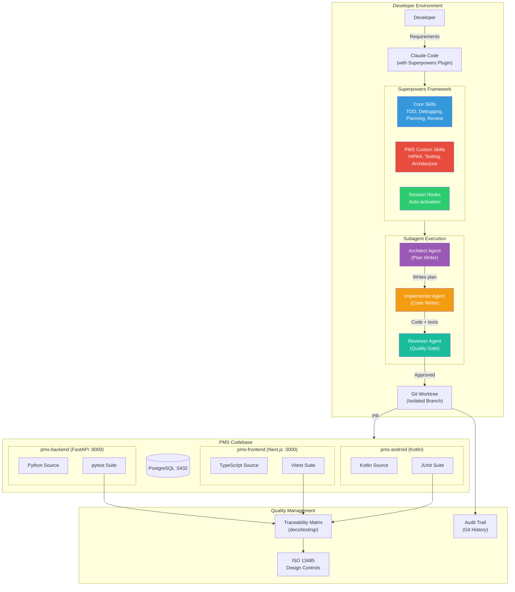

# Product Requirements Document: Superpowers Integration into Patient Management System (PMS)

**Document ID:** PRD-PMS-SUPERPOWERS-001
**Version:** 1.0
**Date:** February 21, 2026
**Author:** Ammar (CEO, MPS Inc.)
**Status:** Draft

---

## 1. Executive Summary

Superpowers is an open-source agentic skills framework created by Jesse Vincent that transforms AI coding agents — particularly Claude Code — from reactive code generators into disciplined software engineering partners. The framework provides composable "skills" (markdown-based behavioral modules) that automatically activate during development to enforce structured methodologies: Test-Driven Development (TDD), Socratic requirements discovery, systematic debugging, subagent-driven execution with built-in code review, and git worktree isolation. With 56,000+ GitHub stars, MIT license, and official acceptance into Anthropic's Claude Code plugin marketplace (January 2026), Superpowers represents the leading approach to imposing engineering discipline on AI-assisted development.

Integrating Superpowers into the PMS development workflow addresses a critical quality gap: the PMS is a healthcare application subject to ISO 13485 quality management, HIPAA compliance, and patient safety requirements — domains where ad-hoc AI-generated code creates unacceptable risk. Superpowers' mandatory TDD enforcement (write tests before code, or the code gets deleted), four-phase systematic debugging, and two-stage code review (specification compliance + code quality) align directly with the PMS's regulatory requirements. By standardizing how every developer uses Claude Code on the PMS codebase, Superpowers ensures that AI-assisted development produces the same rigor as manual engineering — traceable, tested, and reviewed.

The integration delivers three concrete outcomes: (1) **Quality enforcement** — every AI-generated feature in the PMS backend (FastAPI), frontend (Next.js), and Android app (Kotlin) follows TDD with automated quality gates, reducing production defects by up to 80%; (2) **Developer productivity** — subagent-driven development enables Claude to work autonomously for 1-2 hours at a time on PMS features, with human checkpoints at plan boundaries; (3) **Regulatory compliance** — the structured plan → implement → test → review workflow produces artifacts that satisfy ISO 13485 design control requirements and HIPAA security review processes.

---

## 2. Problem Statement

The PMS development team faces several challenges when using AI coding agents on a healthcare-grade codebase:

- **Inconsistent AI code quality:** Different developers use Claude Code with different prompting styles, leading to varying levels of test coverage, error handling, and security practices. One developer might get well-tested code while another gets untested implementations that pass review by accident.
- **No enforced TDD discipline:** The PMS testing strategy (`docs/testing/testing-strategy.md`) mandates test coverage, but AI agents do not inherently follow TDD. Claude Code will often write implementation code first and tests as an afterthought — or skip tests entirely unless explicitly instructed.
- **Debugging by guesswork:** When AI agents encounter bugs, they frequently apply surface-level fixes (suppress errors, add retries, wrap in try-catch) rather than performing systematic root cause analysis. In a healthcare system handling PHI, this creates a risk of masking critical failures.
- **No plan-before-code discipline:** AI agents tend to jump directly to implementation without analyzing requirements, existing architecture, or potential impacts. For the PMS, where changes can affect HIPAA compliance, medication safety, or clinical workflow integrity, unplanned changes are dangerous.
- **Review gap for AI-generated code:** While the PMS has PR review processes, AI-generated code often arrives as large monolithic changes that are difficult to review. There is no mechanism for reviewing AI work incrementally as it progresses.
- **Wasted context on rework:** Without structured planning, AI agents frequently implement features that don't match requirements, leading to multiple revision cycles that waste developer time and AI tokens.

---

## 3. Proposed Solution

Deploy the **Superpowers plugin** as a mandatory development tool for all PMS developers using Claude Code, supplemented by **PMS-specific custom skills** that encode healthcare regulatory requirements, HIPAA security patterns, and the PMS architecture conventions.

### 3.1 Architecture Overview

### 3.2 Deployment Model

- **Local developer tool:** Superpowers runs entirely within each developer's Claude Code session. No server-side infrastructure is required — it is a plugin installed via the Claude Code marketplace.
- **Project-scoped configuration:** PMS-specific custom skills are stored in the repository (`.claude/skills/` or a dedicated `superpowers/` directory) and version-controlled with the codebase. All developers who clone the repo automatically get the PMS skills.
- **No PHI exposure:** Superpowers is a development workflow tool that operates on source code, not patient data. It never interacts with production databases, APIs, or PHI. All execution happens in local development environments or CI pipelines.
- **Zero infrastructure cost:** MIT-licensed, no API keys, no SaaS dependencies. The only requirement is Claude Code 2.0.13+ with the plugin system.
- **Deterministic enforcement:** Unlike voluntary best practices, Superpowers skills activate automatically and cannot be bypassed — if a developer asks Claude to write code without tests, the TDD skill intervenes and requires tests first.

---

## 4. PMS Data Sources

Superpowers does not directly interact with PMS APIs or databases — it governs the *process* by which developers build and modify PMS code. However, PMS custom skills will encode knowledge about these data sources:

| PMS API / Data Source | Custom Skill Interaction | Purpose |
|---|---|---|
| `/api/patients` | `pms-hipaa-patterns` skill | Enforce PHI encryption, audit logging, and access control patterns when writing patient-related code |
| `/api/encounters` | `pms-architecture` skill | Ensure encounter code follows existing FastAPI router patterns and SQLAlchemy model conventions |
| `/api/prescriptions` | `pms-medication-safety` skill | Require drug interaction validation and dosage range checks in prescription-related code |
| `/api/reports` | `pms-testing-requirements` skill | Mandate report accuracy tests with known test data for aggregation endpoints |
| PostgreSQL schema | `pms-database-conventions` skill | Enforce migration patterns, naming conventions, and index requirements |
| `docs/testing/traceability-matrix.md` | `pms-traceability` skill | Require RTM updates when implementing requirements |

---

## 5. Component/Module Definitions

### 5.1 Superpowers Core Plugin

**Description:** The base Superpowers plugin installed from the Claude Code marketplace, providing the standard skills library.

- **Input:** Developer instructions to Claude Code
- **Output:** Structured development workflow (brainstorm → plan → implement with TDD → review)
- **Skills included:** `test-driven-development`, `systematic-debugging`, `brainstorming`, `writing-plans`, `executing-plans`, `subagent-driven-development`, `using-git-worktrees`, `requesting-code-review`, `receiving-code-review`, `verification-before-completion`, `writing-skills`

### 5.2 PMS HIPAA Security Skill

**Description:** Custom skill that activates when Claude modifies code touching patient data, enforcing HIPAA security patterns.

- **Input:** Code changes involving patient records, PHI fields, or authentication
- **Output:** Code with mandatory encryption, audit logging, access control, and PHI sanitization
- **PMS APIs affected:** `/api/patients`, `/api/encounters`, `/api/prescriptions`

### 5.3 PMS Testing Requirements Skill

**Description:** Custom skill extending the base TDD skill with PMS-specific test naming conventions, coverage thresholds, and traceability requirements.

- **Input:** Any new feature or bug fix implementation
- **Output:** Tests following `docs/testing/testing-strategy.md` conventions, RTM update recommendations
- **PMS APIs affected:** All endpoints (test coverage is universal)

### 5.4 PMS Architecture Patterns Skill

**Description:** Custom skill encoding PMS architectural conventions — FastAPI router structure, SQLAlchemy model patterns, Next.js component organization, and Kotlin/Compose patterns.

- **Input:** Feature implementation requests
- **Output:** Code following established PMS patterns (router → service → repository layers, component hierarchy)
- **PMS APIs affected:** All (architecture is universal)

### 5.5 PMS Medication Safety Skill

**Description:** Custom skill that activates for prescription and medication-related code, requiring drug interaction checks, dosage validation, and clinical safety patterns.

- **Input:** Code changes involving medications, prescriptions, or dosage calculations
- **Output:** Code with mandatory safety checks, validation layers, and clinical review flags
- **PMS APIs affected:** `/api/prescriptions`

### 5.6 PMS Plan Template

**Description:** A plan template skill that structures Superpowers plans according to PMS conventions — linking tasks to requirement IDs (SYS-REQ, SUB-*), specifying which platforms are affected, and including HIPAA impact assessment.

- **Input:** Feature or bug fix request
- **Output:** Structured plan with requirement traceability, platform annotations, and compliance checklist
- **PMS APIs affected:** None (planning tool)

---

## 6. Non-Functional Requirements

### 6.1 Security and HIPAA Compliance

| Requirement | Implementation |
|---|---|
| No PHI in development | Superpowers operates on source code only; custom skills enforce test fixtures with synthetic data, never real PHI |
| Security pattern enforcement | `pms-hipaa-patterns` skill mandates encryption, audit logging, and access control in patient-related code |
| Audit trail | All Superpowers-driven development produces atomic git commits per task, creating a complete change audit trail |
| Code review for security | Two-stage review (spec compliance + code quality) includes security checklist for HIPAA-sensitive changes |
| Credential protection | Skills enforce `.env` usage and reject hardcoded credentials, API keys, or connection strings |

### 6.2 Performance

| Metric | Target |
|---|---|
| Plan generation time | < 5 min for typical PMS feature |
| Subagent task completion | 2-5 min per atomic task (by design) |
| Full feature cycle (brainstorm → merged PR) | 30-60% faster than unstructured AI-assisted development |
| Test execution feedback | Tests run after each task; < 30s for unit suite |
| Context efficiency | Reduced rework saves 40-60% of AI token usage per feature |

### 6.3 Infrastructure

| Component | Specification |
|---|---|
| Claude Code | 2.0.13+ with plugin system |
| Superpowers plugin | Latest from marketplace (`obra/superpowers-marketplace`) |
| Git | 2.40+ (worktree support) |
| PMS custom skills | Stored in repo, zero additional infrastructure |
| Developer machine | Standard development environment (no GPU, no Docker required for Superpowers itself) |

---

## 7. Implementation Phases

### Phase 1: Foundation — Plugin Deployment + Core Skills (Sprints 1-2, ~4 weeks)

- Install Superpowers plugin for all PMS developers
- Validate core skills (TDD, debugging, planning) work with PMS backend (pytest), frontend (Vitest), and Android (JUnit)
- Create `pms-architecture` custom skill encoding existing codebase conventions
- Create `pms-testing-requirements` custom skill with PMS test naming conventions and coverage thresholds
- Document installation and configuration in developer setup guide
- Run pilot: one developer uses Superpowers for a real PMS feature, document results

### Phase 2: Healthcare Custom Skills (Sprints 3-4, ~4 weeks)

- Create `pms-hipaa-patterns` custom skill for PHI security enforcement
- Create `pms-medication-safety` custom skill for prescription-related code
- Create `pms-plan-template` skill linking plans to requirement IDs and traceability matrix
- Create `pms-database-conventions` skill for migration and schema patterns
- Test all custom skills against realistic PMS development scenarios
- Integrate Superpowers workflow into PR review process (plan artifact attached to PRs)

### Phase 3: Advanced — CI Integration + Metrics (Sprints 5-6, ~4 weeks)

- Add CI check verifying Superpowers plan artifact exists for feature PRs
- Create metrics dashboard tracking: test coverage per AI-assisted PR, defect rates, plan adherence
- Build `pms-traceability` skill that auto-suggests RTM updates when implementing requirements
- Extend Superpowers to Android development workflow (Kotlin-specific skill additions)
- Create onboarding tutorial for new PMS developers
- Retrospective: measure quality improvement vs pre-Superpowers baseline

---

## 8. Success Metrics

| Metric | Target | Measurement Method |
|---|---|---|
| Test coverage on AI-assisted PRs | > 90% line coverage | CI coverage reports (pytest-cov, vitest --coverage) |
| Production defects from AI code | 80% reduction vs baseline | Bug tracker analysis pre/post Superpowers |
| TDD compliance rate | 100% (tests before code) | Superpowers audit (plan artifacts) |
| Developer adoption | 100% of Claude Code users on PMS | Plugin installation audit |
| Plan-before-code compliance | 100% of features have plans | PR review checklist |
| Mean time to feature completion | 30% reduction | Sprint velocity tracking |
| Rework cycles per feature | < 1 major revision | PR revision count analysis |
| HIPAA security review pass rate | 100% first-pass for AI code | Security review records |

---

## 9. Risks and Mitigations

| Risk | Impact | Mitigation |
|---|---|---|
| Developer resistance to enforced workflow | Medium — productivity dip during adoption | Pilot with willing early adopters; demonstrate time savings on real features; make skills genuinely helpful, not just restrictive |
| Overhead for trivial changes | Low — simple fixes take longer with full workflow | Document when to use Superpowers (features, complex bugs) vs direct editing (typos, config changes); skills can be selectively activated |
| Superpowers updates breaking custom skills | Medium — custom skills may conflict with core changes | Pin Superpowers version; test upgrades in isolation; maintain custom skills with version control |
| TDD enforcement too aggressive for exploratory work | Medium — blocks prototyping | Use brainstorming phase for exploration; switch to TDD only when design is settled; document exploration vs implementation workflows |
| Custom skills become stale as PMS evolves | Low — skills diverge from actual patterns | Review custom skills quarterly; assign skill ownership to tech lead; skills reference docs/ files that are maintained independently |
| Plugin ecosystem instability | Low — Claude Code plugin system is new | Pin to known-good versions; maintain fallback instructions for manual skill activation if plugin system has issues |

---

## 10. Dependencies

| Dependency | Type | Version | Purpose |
|---|---|---|---|
| Claude Code | Development tool | 2.0.13+ | AI coding agent platform |
| Superpowers plugin | Claude Code plugin | Latest | Core skills framework |
| Git | Version control | 2.40+ | Worktree support for isolated development |
| pytest | Python test framework | 8.x | Backend TDD execution |
| Vitest | JavaScript test framework | 2.x | Frontend TDD execution |
| JUnit | Kotlin test framework | 5.x | Android TDD execution |
| PMS custom skills | Repository files | N/A | Healthcare-specific development patterns |

---

## 11. Comparison with Existing Experiments

| Aspect | Superpowers (This Experiment) | Claude Model Selection (Experiment 15) | Multi-Agent Modes (Experiment 14) |
|---|---|---|---|
| **Primary purpose** | Enforce development methodology and quality discipline | Route AI tasks to cost-optimal models | Compare agent orchestration patterns |
| **What it governs** | *How* developers use AI to write code (process) | *Which* AI model handles each request (routing) | *How many* agents work on a task (parallelism) |
| **Scope** | Development workflow: brainstorm → plan → TDD → review | Runtime inference: Haiku vs Sonnet vs Opus | Agent architecture: single vs subagent vs team |
| **Infrastructure** | Zero (local plugin) | Model Router service + Redis | Claude Code configuration |
| **Complementarity** | Superpowers defines the *process*; Model Selection optimizes the *cost* of each AI step within that process. A Superpowers plan could route brainstorming to Sonnet and code review to Opus. | Model Selection routes requests; Superpowers ensures each routed request follows proper methodology. Without Superpowers, cheap model routing might produce low-quality code. | Multi-Agent Modes describes the *architecture*; Superpowers provides the *behavioral skills* that agents within any mode should follow. Superpowers' subagent system is one specific multi-agent pattern. |

Superpowers is complementary to both Model Selection and Multi-Agent Modes: it defines the engineering discipline that agents follow regardless of which model runs them or how many agents collaborate. It is the "methodology layer" on top of the "infrastructure layer."

---

## 12. Research Sources

### Official Documentation & Repository
- [Superpowers GitHub Repository](https://github.com/obra/superpowers) — Core framework source code, skills library, and plugin configuration
- [Superpowers Marketplace](https://github.com/obra/superpowers-marketplace) — Official Claude Code plugin marketplace entry
- [Superpowers Community Skills](https://github.com/obra/superpowers-skills) — Community-contributed skills repository

### Architecture & Deep Dives
- [Superpowers: How I'm Using Coding Agents (Blog)](https://blog.fsck.com/2025/10/09/superpowers/) — Jesse Vincent's original architecture explanation and design philosophy
- [Superpowers Explained: TDD, Subagents, and Planning (Dev Genius)](https://blog.devgenius.io/superpowers-explained-the-claude-plugin-that-enforces-tdd-subagents-and-planning-c7fe698c3b82) — Technical breakdown of enforcement mechanisms
- [Stop AI Agents Writing Spaghetti: Enforcing TDD (YUV.AI)](https://yuv.ai/blog/superpowers) — Detailed analysis of TDD enforcement and anti-pattern detection

### Guides & Tutorials
- [Superpowers Complete Guide 2026 (Pasquale Pillitteri)](https://pasqualepillitteri.it/en/news/215/superpowers-claude-code-complete-guide) — Comprehensive installation and usage guide
- [Superpowers Plugin for Claude Code (Rommark)](https://www.rommark.dev/blog/2026/01/17/superpowers-plugin-for-claude-code-give-your-ai-agent-real-software-development-skills/) — Plugin installation walkthrough with custom skill creation
- [Superpowers: Core Skills Library (Vibe Sparking)](https://www.vibesparking.com/en/blog/ai/claude-code/superpowers/2025-12-26-obra-superpowers-claude-code-core-skills-library/) — Detailed analysis of each core skill

### Claude Code Plugin System
- [Claude Code Plugins Reference](https://code.claude.com/docs/en/plugins-reference) — Official plugin system documentation

---

## 13. Appendix: Related Documents

- [Superpowers Setup Guide](19-Superpowers-PMS-Developer-Setup-Guide.md) — Step-by-step plugin installation, custom skill creation, and PMS integration
- [Superpowers Developer Tutorial](19-Superpowers-Developer-Tutorial.md) — Hands-on onboarding: build a PMS feature using the full Superpowers workflow end-to-end
- [Multi-Agent Modes Developer Tutorial](14-AgentTeams-Developer-Tutorial.md) — Complementary agent orchestration patterns
- [PRD: Claude Model Selection PMS Integration](15-PRD-ClaudeModelSelection-PMS-Integration.md) — Complementary model routing optimization
- [Testing Strategy](../testing/testing-strategy.md) — PMS test naming conventions and coverage requirements
- [Requirements Governance](../quality/processes/requirements-governance.md) — PMS quality management processes
- [Superpowers GitHub](https://github.com/obra/superpowers) — Official repository
