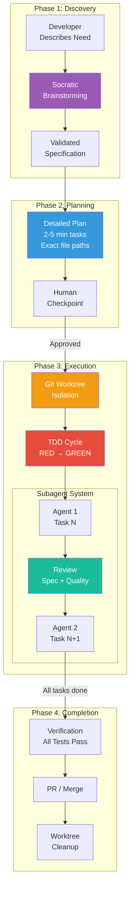
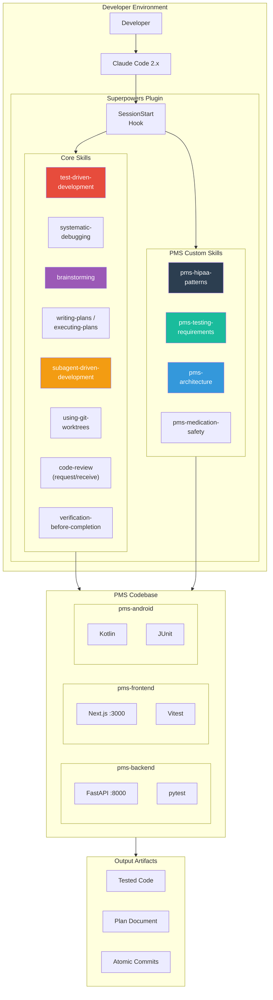

# Superpowers Developer Onboarding Tutorial

**Welcome to the MPS PMS Superpowers Integration Team**

This tutorial will take you from zero to building your first PMS feature using the full Superpowers development workflow. By the end, you will understand how Superpowers enforces engineering discipline, have a running local environment, and have built and tested a feature end-to-end using brainstorming, planning, TDD, subagent execution, and code review.

**Document ID:** PMS-EXP-SUPERPOWERS-002
**Version:** 1.0
**Date:** February 21, 2026
**Applies To:** PMS project (all platforms)
**Prerequisite:** [Superpowers Setup Guide](19-Superpowers-PMS-Developer-Setup-Guide.md)
**Estimated time:** 2-3 hours
**Difficulty:** Beginner-friendly

---

## What You Will Learn

1. What Superpowers is and why it matters for healthcare software development
2. How the seven-phase development workflow operates (discovery through completion)
3. How TDD enforcement prevents untested code from entering the PMS codebase
4. How Socratic brainstorming improves requirements before coding begins
5. How subagent-driven development enables autonomous multi-hour execution
6. How git worktree isolation prevents work-in-progress from corrupting the main branch
7. How to create PMS-specific custom skills that encode HIPAA and architecture patterns
8. How the two-stage code review (specification + quality) catches issues early
9. How to integrate Superpowers with the PMS testing strategy and traceability matrix
10. How to debug and tune the Superpowers workflow for your development style

---

## Part 1: Understanding Superpowers (15 min read)

### 1.1 What Problem Does Superpowers Solve?

When developers use AI coding agents on the PMS, they face a discipline gap: AI agents are eager to write code but reluctant to plan, test, or review. This creates several problems specific to healthcare software:

- **Untested medication logic:** Claude writes a drug interaction checker but skips edge cases (null doses, pediatric adjustments, renal impairment). The code passes review because it *looks* correct, but fails in production with real patient data.
- **HIPAA violations by omission:** Claude builds a patient search endpoint that works perfectly but forgets audit logging, returns unfiltered PHI in error messages, and logs patient names to stdout.
- **Architecture drift:** Different developers get different implementations from Claude. One gets a clean router → service → repository pattern; another gets everything in the router handler. The codebase becomes inconsistent.
- **Rework cycles:** Without upfront planning, Claude builds features that don't match requirements. The developer discovers the mismatch after 30 minutes of generation, discards the work, and starts over.

Superpowers solves this by making engineering discipline **automatic and mandatory**. The AI agent cannot skip tests, cannot avoid planning, and cannot bypass code review — the skills enforce these behaviors structurally.

### 1.2 How Superpowers Works — The Key Pieces



Three key concepts:

1. **Skills** — Markdown files that define behavioral rules. When Claude encounters a situation matching a skill's description, it follows the skill's instructions. Skills cannot be bypassed — they are mandatory.
2. **Subagents** — Fresh AI instances that handle individual tasks. Each subagent starts with clean context, follows the plan for its specific task, and gets reviewed before the next task begins.
3. **Quality gates** — Checkpoints between tasks where work is reviewed against the specification. If a task fails review, it gets reworked before proceeding.

### 1.3 How Superpowers Fits with Other PMS Technologies

| Technology | What It Does | Relationship to Superpowers |
|---|---|---|
| **Claude Model Selection** (Exp. 15) | Routes AI tasks to cost-optimal models | Superpowers defines the workflow; Model Selection optimizes which model runs each step |
| **Multi-Agent Modes** (Exp. 14) | Agent orchestration patterns | Superpowers' subagent system is one specific multi-agent pattern with built-in quality gates |
| **AI Zero-Day Scan** (Exp. 12) | Security vulnerability detection | Superpowers' code review catches security issues during development; Zero-Day Scan catches them in CI |
| **MCP** (Exp. 9) | Universal AI tool integration | Superpowers skills could invoke MCP tools during execution for specialized capabilities |
| **Adaptive Thinking** (Exp. 8) | Effort-routed AI reasoning | Brainstorming could use high-effort reasoning; simple tasks use lower effort |
| **Testing Strategy** (docs/testing/) | Test naming and coverage conventions | Superpowers TDD skill works with PMS-specific testing requirements skill |

### 1.4 Key Vocabulary

| Term | Meaning |
|---|---|
| **Skill** | A markdown file (SKILL.md) that defines behavioral rules Claude must follow when a matching situation is detected |
| **Subagent** | A fresh Claude Code instance launched to handle a single task from the plan, with clean context |
| **Quality gate** | A review checkpoint between tasks where work is verified against the specification before proceeding |
| **Red-green-refactor** | TDD cycle: write a failing test (red), write minimal code to pass (green), then improve (refactor) |
| **Brainstorming** | Socratic dialogue phase where Claude asks clarifying questions instead of assuming requirements |
| **Plan** | A structured document listing atomic tasks (2-5 minutes each) with exact file paths, test specs, and verification steps |
| **Git worktree** | An isolated working copy of the repository on a separate branch, preventing WIP from affecting the main branch |
| **Hook** | An event handler that triggers automatically (e.g., SessionStart) to activate skills without manual invocation |
| **Anti-pattern** | A common bad practice that Superpowers explicitly guards against (e.g., writing code before tests) |
| **Verification** | The requirement to prove that work is correct (running tests, checking output) before declaring a task complete |
| **Skill activation** | The automatic process by which Claude detects a relevant skill and follows its instructions |
| **Plan artifact** | The structured plan document produced during planning, which serves as the specification for execution |

### 1.5 Our Architecture



---

## Part 2: Environment Verification (15 min)

### 2.1 Checklist

1. **Claude Code version:**
   ```bash
   claude --version
   # Expected: 2.0.13 or higher
   ```

2. **Superpowers plugin installed:**
   ```bash
   claude plugin list
   # Expected: superpowers listed
   ```

3. **Skills directory exists:**
   ```bash
   ls ~/.claude/plugins/cache/superpowers/skills/
   # Expected: 12+ skill directories
   ```

4. **PMS custom skills exist:**
   ```bash
   ls .claude/skills/
   # Expected: pms-hipaa-patterns/, pms-testing-requirements/, pms-architecture/
   ```

5. **Backend tests pass:**
   ```bash
   cd pms-backend && pytest --tb=short -q
   # Expected: All tests pass
   ```

6. **Frontend tests pass:**
   ```bash
   cd pms-frontend && npx vitest run
   # Expected: All tests pass
   ```

7. **Git is clean:**
   ```bash
   git status
   # Expected: clean working directory on main branch
   ```

### 2.2 Quick Test

Start a Claude Code session and verify Superpowers activates:

```bash
claude
```

Then type:

```
What skills do you have available from the Superpowers framework?
```

Expected: Claude lists the available Superpowers skills including TDD, brainstorming, planning, subagent execution, debugging, and code review. It should also mention the PMS custom skills if they are in `.claude/skills/`.

---

## Part 3: Build Your First Integration (45 min)

### 3.1 What We Are Building

We will use the **full Superpowers workflow** to add a **Patient Allergy Record** feature to the PMS backend. This is a realistic small feature that touches:

- A new database model (`Allergy`)
- A new API router (`/api/patients/{id}/allergies`)
- A service layer with drug interaction awareness
- Tests following PMS conventions
- HIPAA-compliant audit logging

We will go through every Superpowers phase: brainstorm → plan → execute (TDD) → review.

### 3.2 Step 1: Start the Brainstorming Phase

Open Claude Code in the PMS backend directory:

```bash
cd pms-backend
claude
```

Invoke the brainstorming skill:

```
/superpowers:brainstorm

I need to add patient allergy tracking to the PMS. Clinicians should be able to
record allergies during encounters and see allergy alerts when prescribing medications.
```

**What happens:** Claude enters Socratic dialogue mode. Instead of immediately writing code, it will ask questions like:

- What allergy categories do we need? (drug, food, environmental, other)
- What severity levels? (mild, moderate, severe, life-threatening)
- How should allergies relate to encounters? (recorded during, linked to)
- Should we check allergies against prescriptions automatically?
- What's the UI expectation? (banner, sidebar, inline warning)

Answer Claude's questions. The brainstorming phase typically takes 5-10 minutes and produces a validated specification.

### 3.3 Step 2: Write the Implementation Plan

After brainstorming produces a specification, create the plan:

```
/superpowers:write-plan
```

**What happens:** Claude generates a structured plan. Here's what a good Superpowers plan looks like:

```markdown
# Implementation Plan: Patient Allergy Record

## Specification Summary
[Links back to brainstorming output]

## Tasks

### Task 1: Create Allergy SQLAlchemy Model (3 min)
- File: app/models/allergy.py
- Create Allergy model with fields: id, patient_id, allergen_name, allergy_type,
  severity, reaction_description, onset_date, recorded_by, created_at
- Test: test_allergy_model_creation.py

### Task 2: Create Allergy Pydantic Schemas (2 min)
- File: app/schemas/allergy_schemas.py
- AllergyCreate, AllergyResponse, AllergyList schemas
- Test: test_allergy_schemas.py

### Task 3: Create Allergy Repository (3 min)
- File: app/repositories/allergy_repository.py
- CRUD operations: create, get_by_patient, get_by_id, update, delete
- Test: test_allergy_repository.py

### Task 4: Create Allergy Service (5 min)
- File: app/services/allergy_service.py
- Business logic: create_allergy, check_drug_interaction, get_patient_allergies
- Test: test_allergy_service.py

### Task 5: Create Allergy Router (3 min)
- File: app/routers/allergies.py
- Endpoints: POST, GET (list), GET (single), PUT, DELETE
- Includes audit logging per pms-hipaa-patterns skill
- Test: test_allergy_router.py

### Task 6: Integration Test (3 min)
- File: tests/integration/test_allergy_flow.py
- End-to-end: create patient → add allergy → prescribe conflicting drug → verify alert

## Human Checkpoint
Review the plan before execution begins.
```

Review the plan. If it looks good, approve it.

### 3.4 Step 3: Execute the Plan with TDD

```
/superpowers:execute-plan
```

**What happens:** Superpowers begins executing. For each task:

1. **Creates a git worktree** (isolated branch)
2. **Launches a subagent** for the task
3. The subagent follows TDD:
   - Writes a **failing test** first (RED)
   - Writes **minimal implementation** to pass (GREEN)
   - Refactors if needed
4. **Reviews the work** (spec compliance + code quality)
5. Moves to the next task

You will see Claude working through each task. It may pause for human checkpoints between major sections.

### 3.5 Step 4: Observe TDD in Action

Watch as the subagent implements Task 5 (the router). You should see:

**RED phase — test written first:**

```python
# test_allergy_router.py
import pytest
from httpx import AsyncClient

@pytest.mark.asyncio
async def test_create_allergy(client: AsyncClient, auth_headers: dict):
    """Test creating a patient allergy record.
    Requirement: SUB-PR-010 Patient allergy tracking
    Platform: BE
    """
    response = await client.post(
        "/api/patients/test-uuid/allergies",
        json={
            "allergen_name": "Penicillin",
            "allergy_type": "drug",
            "severity": "severe",
            "reaction_description": "Anaphylaxis",
        },
        headers=auth_headers,
    )
    assert response.status_code == 201
    data = response.json()
    assert data["allergen_name"] == "Penicillin"
    assert data["severity"] == "severe"
```

**Test runs and FAILS** (because the endpoint does not exist yet).

**GREEN phase — minimal implementation:**

```python
# app/routers/allergies.py
from fastapi import APIRouter, Depends
from app.core.security import get_current_user, require_role
from app.core.audit import audit_log
from app.services.allergy_service import AllergyService
from app.schemas.allergy_schemas import AllergyCreate, AllergyResponse

router = APIRouter(prefix="/api/patients/{patient_id}/allergies", tags=["allergies"])

@router.post("/", response_model=AllergyResponse, status_code=201)
async def create_allergy(
    patient_id: str,
    allergy: AllergyCreate,
    user=Depends(require_role(["clinician", "admin"])),
    service: AllergyService = Depends(),
):
    audit_log(
        action="create",
        resource_type="allergy",
        resource_id=patient_id,
        user_id=str(user.id),
    )
    return await service.create_allergy(patient_id, allergy, user)
```

**Test runs and PASSES.** Note how the HIPAA skill ensured audit logging and role-based access control were included automatically.

### 3.6 Step 5: Review the Results

After all tasks complete, Superpowers runs a two-stage review:

1. **Specification compliance:** Does the code match what was planned?
2. **Code quality:** Are there security issues, missing error handling, or architectural violations?

The review may flag issues. For example:

```
REVIEW: Task 5 - Allergy Router
- PASS: Audit logging present
- PASS: Role-based access control
- FLAG: Missing pagination on GET /allergies (list endpoint)
- FLAG: Missing input validation for allergy_type enum
```

Flagged issues are fixed before the branch is finalized.

---

## Part 4: Strengths and Weaknesses (15 min)

### 4.1 Strengths

- **Enforced TDD** — Code without tests gets deleted. This is not a suggestion; it is a structural enforcement that produces consistently tested code.
- **Reduced rework** — The brainstorming phase catches requirement gaps before any code is written, eliminating the most expensive form of waste.
- **Architectural consistency** — Custom skills encode PMS patterns, so every developer's AI-generated code follows the same structure.
- **Autonomous execution** — Subagent-driven development can run for 1-2 hours without intervention, dramatically improving developer throughput.
- **Audit-friendly** — Every feature produces a plan artifact, atomic commits per task, and a review record — ideal for ISO 13485 design control documentation.
- **Zero infrastructure** — No servers, no APIs, no costs beyond Claude Code itself. Pure local development tool.
- **Customizable** — PMS-specific skills extend the framework without forking the core. Skills are version-controlled in the repository.
- **Language agnostic** — Works across Python (backend), TypeScript (frontend), and Kotlin (Android) with the same methodology.

### 4.2 Weaknesses

- **Overhead for trivial tasks** — A one-line config change does not need brainstorming, planning, and review. Superpowers adds friction to simple changes.
- **Learning curve** — Developers accustomed to free-form AI interaction may resist the structured workflow initially.
- **Skill maintenance burden** — Custom skills must be updated as the PMS architecture evolves. Stale skills give incorrect guidance.
- **Context window pressure** — The brainstorm → plan → execute cycle consumes significant context. Long plans may require context compaction.
- **Plugin ecosystem maturity** — The Claude Code plugin system is relatively new (2025-2026). Plugin APIs may change, requiring Superpowers updates.
- **No runtime enforcement** — Superpowers governs development but cannot prevent a developer from pushing code that was written outside the workflow.
- **Subagent cost** — Each subagent is a separate Claude session, consuming API tokens. Complex plans with many tasks can be expensive.

### 4.3 When to Use Superpowers vs Direct Development

| Scenario | Use Superpowers | Use Direct Claude Code |
|---|---|---|
| New feature with multiple files | Full workflow (brainstorm → plan → execute) | - |
| Complex bug with unclear root cause | `systematic-debugging` skill | - |
| Simple typo or config fix | - | Direct edit |
| Refactoring existing code | Plan + execute (skip brainstorm) | - |
| Exploratory prototyping | Brainstorm only (skip TDD) | - |
| Security-sensitive changes (PHI) | Full workflow + HIPAA skill | - |
| Adding a test for existing code | TDD skill (write test → verify pass) | - |
| Documentation updates | - | Direct edit |
| Database migration | Plan + execute with architecture skill | - |

### 4.4 HIPAA / Healthcare Considerations

**What Superpowers enforces for healthcare:**
- **Mandatory audit logging** — The `pms-hipaa-patterns` skill requires audit log calls in every endpoint that touches PHI
- **Synthetic test data** — Skills prohibit using real patient data in tests; synthetic fixtures are mandatory
- **Access control patterns** — Role-based access control is structurally required for patient-facing endpoints
- **No PHI in logs** — Skills explicitly prohibit logging patient names, SSNs, or other identifiers
- **Encryption reminders** — Skills flag when data at rest should be encrypted

**What Superpowers does NOT handle:**
- Runtime security scanning (use AI Zero-Day Scan, Experiment 12)
- Network-level HIPAA compliance (TLS, firewall rules)
- BAA (Business Associate Agreement) management
- PHI data classification beyond code patterns
- Production monitoring for security incidents

**Regulatory alignment:**
- ISO 13485 requires design controls (planning, verification, review). Superpowers' brainstorm → plan → test → review cycle produces artifacts that satisfy these requirements.
- HIPAA Security Rule requires workforce training. Superpowers skills function as embedded training — encoding security best practices into the development workflow itself.

---

## Part 5: Debugging Common Issues (15 min read)

### Issue 1: Subagent Ignores Custom Skills

**Symptoms:** A subagent writes patient-related code without audit logging or access control, as if the `pms-hipaa-patterns` skill does not exist.

**Cause:** Subagents launched by Superpowers may not automatically inherit project-level skills from `.claude/skills/`. The skill discovery depends on the working directory context.

**Fix:** Ensure custom skills are referenced in the plan itself:

```markdown
### Task 5: Create Allergy Router
- File: app/routers/allergies.py
- MUST follow pms-hipaa-patterns skill: audit logging, access control
- MUST follow pms-architecture skill: router → service → repository
```

By explicitly mentioning the skill in the task, the subagent is instructed to follow it.

### Issue 2: TDD Cycle Stuck in RED Phase

**Symptoms:** Claude writes a failing test but cannot make it pass after multiple attempts. The subagent loops on implementation.

**Cause:** The test may be testing behavior that depends on infrastructure not available in the test environment (database, external service, auth).

**Fix:** Check that the test uses proper mocking:

```python
# Use dependency overrides for FastAPI tests
@pytest.fixture
def mock_db():
    return AsyncMock(spec=Database)

@pytest.fixture
def client(mock_db):
    app.dependency_overrides[get_db] = lambda: mock_db
    return AsyncClient(app=app, base_url="http://test")
```

If the test requires real infrastructure, switch to integration tests with proper fixtures.

### Issue 3: Plan Tasks Are Too Large

**Symptoms:** A single task takes 15+ minutes and produces hundreds of lines of code. The review phase cannot effectively assess the changes.

**Cause:** The plan was not decomposed to Superpowers' recommended 2-5 minute granularity.

**Fix:** Regenerate the plan with explicit granularity:

```
/superpowers:write-plan

Break every task into 2-5 minute units. Each task should modify at most 2 files.
No task should produce more than 50 lines of new code.
```

### Issue 4: Git Worktree Branch Conflicts

**Symptoms:** `fatal: branch 'feature/allergies' already exists` when Superpowers tries to create a worktree.

**Cause:** A previous execution created the branch but the worktree was not cleaned up.

**Fix:**

```bash
# List worktrees
git worktree list

# Remove the stale worktree
git worktree remove .claude/worktrees/feature-allergies

# Delete the orphaned branch
git branch -D feature/allergies
```

### Issue 5: Brainstorming Phase Never Ends

**Symptoms:** Claude keeps asking clarifying questions indefinitely, never moving to the planning phase.

**Cause:** The initial request was too vague, giving Claude too many dimensions to explore.

**Fix:** Provide a more constrained initial request:

```
/superpowers:brainstorm

Add a patient allergy table with CRUD endpoints.
Allergies have: name, type (drug/food/environmental), severity (mild/moderate/severe),
reaction description. Link to patient_id. Include audit logging.
```

Specific inputs reduce the brainstorming to targeted questions about edge cases rather than open-ended exploration.

### Issue 6: Custom Skill Syntax Errors

**Symptoms:** Claude does not follow a custom skill, or the skill is not detected.

**Cause:** The SKILL.md file has formatting issues or is missing the required frontmatter.

**Fix:** Verify the skill file structure:

```bash
cat .claude/skills/pms-hipaa-patterns/SKILL.md
```

The file MUST start with YAML frontmatter:

```markdown
---
name: pms-hipaa-patterns
description: Enforces HIPAA security patterns...
version: 1.0.0
---

# Skill content here
```

The `name` and `description` fields are required for skill discovery.

---

## Part 6: Practice Exercise (45 min)

### Option A: Build a Medication Interaction Checker

Use the full Superpowers workflow to add a medication interaction checking feature:

**Requirements:**
- When a clinician prescribes a new medication, check against the patient's existing prescriptions and allergies
- Flag known interactions (drug-drug and drug-allergy)
- Categorize severity: contraindicated, major, moderate, minor
- Require clinician acknowledgment for major+ interactions

**Hints:**
1. Start with `/superpowers:brainstorm` — explore the interaction checking domain
2. The plan should include: interaction data model, checking service, integration with `/api/prescriptions`, alert component
3. TDD: Write tests with known interaction pairs (e.g., warfarin + aspirin = major)
4. The `pms-medication-safety` custom skill should activate during execution

### Option B: Create a Custom Debugging Skill for PMS

Write a new Superpowers skill that specializes the `systematic-debugging` skill for PMS-specific scenarios:

**Requirements:**
- Extends the four-phase debugging methodology
- Adds PMS-specific diagnostic steps: check audit logs, verify encryption state, test auth tokens
- Includes common PMS failure patterns: database migration issues, CORS configuration, async SQLAlchemy session management
- Follows the SKILL.md format

**Hints:**
1. Read the existing `systematic-debugging` skill: `cat ~/.claude/plugins/cache/superpowers/skills/systematic-debugging/SKILL.md`
2. Create `.claude/skills/pms-debugging/SKILL.md`
3. Test by introducing a deliberate bug and using the skill to find it
4. Validate that the skill activates when Claude encounters a PMS-specific error

### Option C: Superpowers-Driven Reporting Dashboard Feature

Use Superpowers to build a new reporting endpoint and frontend component:

**Requirements:**
- `GET /api/reports/patient-volume` returning daily/weekly/monthly patient counts
- `GET /api/reports/encounter-types` returning encounter type distribution
- Next.js dashboard page with charts (use Recharts or Chart.js)
- Tests for data aggregation accuracy

**Hints:**
1. Brainstorm: discuss what metrics are most useful for clinic operations
2. Plan: separate backend aggregation, API endpoint, and frontend chart into distinct tasks
3. TDD: Test aggregation queries with known test data
4. The `pms-architecture` skill should guide the router → service → repository structure

---

## Part 7: Development Workflow and Conventions

### 7.1 File Organization

```
.claude/
├── skills/                           # PMS custom skills (version-controlled)
│   ├── pms-hipaa-patterns/
│   │   └── SKILL.md
│   ├── pms-testing-requirements/
│   │   └── SKILL.md
│   ├── pms-architecture/
│   │   └── SKILL.md
│   ├── pms-medication-safety/
│   │   └── SKILL.md
│   └── pms-frontend-patterns/
│       └── SKILL.md
├── settings.json                     # Project-scoped plugin config
└── worktrees/                        # Git worktree isolation (git-ignored)

~/.claude/
├── plugins/
│   └── cache/
│       └── superpowers/              # Superpowers core plugin
│           ├── skills/               # Core skills library
│           ├── hooks/                # Session hooks
│           ├── commands/             # Slash commands
│           └── .claude-plugin/       # Plugin metadata
└── settings.json                     # User-scoped settings
```

### 7.2 Naming Conventions

| Item | Convention | Example |
|---|---|---|
| Custom skill directory | `pms-{domain}` | `pms-hipaa-patterns` |
| Skill file | `SKILL.md` (always this name) | `.claude/skills/pms-hipaa-patterns/SKILL.md` |
| Skill name (frontmatter) | `pms-{domain}` matching directory | `name: pms-hipaa-patterns` |
| Plan artifact | `plan-{feature}.md` | `plan-patient-allergies.md` |
| Worktree branches | `feature/{short-name}` | `feature/patient-allergies` |
| Test files (backend) | `test_{subsystem}_{req_id}_{desc}.py` | `test_sub_pr_010_allergy_crud.py` |
| Test files (frontend) | `{Component}.test.tsx` | `AllergyBanner.test.tsx` |

### 7.3 PR Checklist

Before submitting a PR developed with Superpowers:

- [ ] Brainstorming phase completed with validated specification
- [ ] Implementation plan reviewed and approved
- [ ] All plan tasks executed via TDD (tests written before code)
- [ ] Two-stage code review passed (spec compliance + quality)
- [ ] All tests pass: `pytest` (backend), `vitest run` (frontend)
- [ ] Custom skills followed (check audit logging, access control, test naming)
- [ ] No PHI in test fixtures — synthetic data only
- [ ] Plan artifact attached to PR description for audit trail
- [ ] Git worktree cleanly merged or PR created
- [ ] Traceability matrix update noted if implementing a tracked requirement

### 7.4 Security Reminders

1. **Custom skills are code** — treat SKILL.md files with the same review rigor as source code. A malicious skill could instruct Claude to bypass security patterns.
2. **Skills cannot access runtime data** — they operate on source code only. They cannot read databases, make API calls, or access PHI.
3. **Audit trail** — Superpowers' atomic commits per task create a git audit trail. Do not squash commits before review — the task-by-task history is valuable for compliance.
4. **Plan artifacts contain no PHI** — plans reference code structures and requirements, not patient data. They are safe to attach to PRs and store in documentation.
5. **Worktree cleanup** — git worktrees are local. Ensure they are removed after merge to prevent stale branches from accumulating.

---

## Part 8: Quick Reference Card

### Key Commands

```bash
# Install Superpowers
/plugin marketplace add obra/superpowers-marketplace
/plugin install superpowers@superpowers-marketplace

# Core workflow
/superpowers:brainstorm       # Socratic requirements discovery
/superpowers:write-plan       # Create implementation plan
/superpowers:execute-plan     # Execute with TDD + subagents

# Check status
/help                         # View available commands
claude plugin list            # List installed plugins
```

### Key Files

| File | Purpose |
|---|---|
| `~/.claude/plugins/cache/superpowers/` | Core plugin installation |
| `.claude/skills/pms-hipaa-patterns/SKILL.md` | HIPAA security enforcement |
| `.claude/skills/pms-testing-requirements/SKILL.md` | PMS test conventions |
| `.claude/skills/pms-architecture/SKILL.md` | Architecture pattern enforcement |
| `.claude/settings.json` | Project plugin configuration |
| `docs/testing/testing-strategy.md` | PMS test naming reference |
| `docs/testing/traceability-matrix.md` | Requirement-to-test mapping |

### Key URLs

| URL | Description |
|---|---|
| `https://github.com/obra/superpowers` | Source repository |
| `https://github.com/obra/superpowers-marketplace` | Plugin marketplace |
| `https://github.com/obra/superpowers-skills` | Community skills |
| `https://code.claude.com/docs/en/plugins-reference` | Plugin docs |
| `https://blog.fsck.com/2025/10/09/superpowers/` | Creator's blog |

### Starter Template: Custom PMS Skill

```markdown
---
name: pms-{your-domain}
description: {One sentence describing when this skill activates}
version: 1.0.0
---

# PMS {Your Domain} Patterns

## When This Skill Activates

This skill MUST be followed when writing or modifying code that:
- {Condition 1}
- {Condition 2}

## Mandatory Patterns

### 1. {Pattern Name}
{Description with code example}

### 2. {Pattern Name}
{Description with code example}

## Anti-Patterns to Reject

- {Bad practice 1}
- {Bad practice 2}
```

---

## Next Steps

1. **Build a real feature** — Pick an item from the PMS backlog and use the full Superpowers workflow to implement it. Start with something medium-complexity (3-5 plan tasks).
2. **Create a medication safety skill** — Write `.claude/skills/pms-medication-safety/SKILL.md` encoding drug interaction checking patterns and dosage validation rules.
3. **Integrate with CI** — Add a CI check that verifies plan artifacts exist for feature PRs, enforcing the plan-before-code discipline at the repository level.
4. **Review Model Selection integration** — Explore how [Claude Model Selection (Exp. 15)](15-PRD-ClaudeModelSelection-PMS-Integration.md) can optimize costs within Superpowers workflows by routing brainstorming to Sonnet and reviews to Opus.
5. **Contribute a community skill** — If you create a PMS skill that would be useful to other healthcare projects, contribute it to the [Superpowers community skills repository](https://github.com/obra/superpowers-skills).
