# Superpowers Setup Guide for PMS Integration

**Document ID:** PMS-EXP-SUPERPOWERS-001
**Version:** 1.0
**Date:** February 21, 2026
**Applies To:** PMS project (all platforms)
**Prerequisites Level:** Beginner

---

## Table of Contents

1. [Overview](#1-overview)
2. [Prerequisites](#2-prerequisites)
3. [Part A: Install and Configure Superpowers](#3-part-a-install-and-configure-superpowers)
4. [Part B: Integrate with PMS Backend](#4-part-b-integrate-with-pms-backend)
5. [Part C: Integrate with PMS Frontend](#5-part-c-integrate-with-pms-frontend)
6. [Part D: Testing and Verification](#6-part-d-testing-and-verification)
7. [Troubleshooting](#7-troubleshooting)
8. [Reference Commands](#8-reference-commands)

---

## 1. Overview

This guide walks you through installing the **Superpowers plugin** for Claude Code and creating PMS-specific custom skills that enforce healthcare development standards. By the end, you will have:

- Superpowers installed and auto-activating in every Claude Code session
- PMS custom skills for HIPAA security, testing conventions, and architecture patterns
- A validated TDD workflow for backend (pytest), frontend (Vitest), and Android (JUnit)
- Git worktree isolation configured for feature development
- A working example of a Superpowers-driven development cycle on PMS code

### Architecture at a Glance

```mermaid
flowchart LR
    subgraph Dev["Developer Machine"]
        CC["Claude Code"]
        SP["Superpowers Plugin"]
        SKILLS["PMS Custom Skills<br/>(.claude/skills/)"]
    end

    subgraph Workflow["Development Workflow"]
        BRAIN["Brainstorm"]
        PLAN["Write Plan"]
        EXEC["Execute<br/>(TDD + Subagents)"]
        REVIEW["Code Review"]
    end

    subgraph PMS["PMS Repos"]
        BE["pms-backend<br/>(pytest)"]
        FE["pms-frontend<br/>(Vitest)"]
        AND["pms-android<br/>(JUnit)"]
    end

    CC --> SP
    SP --> SKILLS
    SKILLS --> BRAIN --> PLAN --> EXEC --> REVIEW
    REVIEW -->|"Git worktree PR"| PMS

    style SP fill:#3498db,color:#fff
    style SKILLS fill:#e74c3c,color:#fff
    style EXEC fill:#f39c12,color:#fff
```



---

## 2. Prerequisites

### 2.1 Required Software

| Software | Minimum Version | Check Command |
|---|---|---|
| Claude Code | 2.0.13+ | `claude --version` |
| Git | 2.40+ | `git --version` |
| Node.js | 20 LTS | `node --version` |
| Python | 3.11+ | `python3 --version` |
| pytest | 8.x | `pytest --version` |
| Vitest | 2.x | `npx vitest --version` |

### 2.2 Installation of Prerequisites

**Claude Code** (if not already installed):

```bash
# Install Claude Code CLI
npm install -g @anthropic-ai/claude-code

# Verify installation
claude --version

# Login to your Anthropic account
claude login
```

**pytest and test dependencies** (for PMS backend):

```bash
cd pms-backend
pip install pytest pytest-cov pytest-asyncio httpx
```

**Vitest** (for PMS frontend):

```bash
cd pms-frontend
npm install -D vitest @testing-library/react @testing-library/jest-dom
```

### 2.3 Verify PMS Services

Confirm you can run the PMS test suites before adding Superpowers:

```bash
# Backend tests
cd pms-backend && pytest --tb=short -q

# Frontend tests
cd pms-frontend && npx vitest run --reporter=verbose

# Verify git is in a clean state
git status
```

**Checkpoint:** Claude Code is installed, PMS test suites run successfully, and git working directory is clean.

---

## 3. Part A: Install and Configure Superpowers

### Step 1: Add the Superpowers Marketplace

Open Claude Code and run the following slash commands:

```
/plugin marketplace add obra/superpowers-marketplace
```

This registers the Superpowers marketplace as a plugin source.

### Step 2: Install the Superpowers Plugin

```
/plugin install superpowers@superpowers-marketplace
```

Claude Code will download the plugin and register its skills, hooks, and commands.

### Step 3: Verify Installation

```
/help
```

You should see the Superpowers commands listed:

- `/superpowers:brainstorm` — Start a Socratic design session
- `/superpowers:write-plan` — Create a detailed implementation plan
- `/superpowers:execute-plan` — Execute a plan with TDD and subagents

### Step 4: Verify Skills Are Loaded

Start a new Claude Code session in the PMS repository:

```bash
cd /path/to/pms-backend
claude
```

On session start, Superpowers' hook will activate and Claude will read the `getting-started` skill. You should see Claude acknowledge the Superpowers framework in its first response.

### Step 5: Configure Project-Scoped Installation (Optional)

To ensure all PMS developers get Superpowers automatically:

```bash
# Install with project scope (writes to .claude/settings.json)
claude plugin install superpowers@superpowers-marketplace --scope project
```

This adds the plugin to the project's `.claude/settings.json`, so anyone who clones the PMS repo and runs Claude Code will have Superpowers enabled.

### Step 6: Explore the Skills Directory

Superpowers skills are installed to:

```bash
ls ~/.claude/plugins/cache/superpowers/skills/
```

You should see directories for each core skill:

```
brainstorming/
executing-plans/
finishing-a-development-branch/
getting-started/
receiving-code-review/
requesting-code-review/
subagent-driven-development/
systematic-debugging/
test-driven-development/
using-git-worktrees/
using-superpowers/
verification-before-completion/
writing-plans/
writing-skills/
```

Each directory contains a `SKILL.md` file defining the skill's behavior.

**Checkpoint:** Superpowers is installed, the `/superpowers:*` commands are available, skills auto-activate on session start, and the skills directory contains all core skills.

---

## 4. Part B: Integrate with PMS Backend

### Step 1: Create PMS Custom Skills Directory

```bash
mkdir -p .claude/skills/pms-hipaa-patterns
mkdir -p .claude/skills/pms-testing-requirements
mkdir -p .claude/skills/pms-architecture
```

### Step 2: Create the HIPAA Security Patterns Skill

Create `.claude/skills/pms-hipaa-patterns/SKILL.md`:

```markdown
---
name: pms-hipaa-patterns
description: Enforces HIPAA security patterns when writing code that handles patient data (PHI) in the PMS
version: 1.0.0
---

# PMS HIPAA Security Patterns

## When This Skill Activates

This skill MUST be followed when writing or modifying code that:
- Reads, writes, or processes patient records (/api/patients)
- Handles encounter data (/api/encounters)
- Processes prescriptions or medications (/api/prescriptions)
- Generates reports containing patient information (/api/reports)
- Touches database tables: patients, encounters, prescriptions, medications, vitals

## Mandatory Security Patterns

### 1. Audit Logging
Every API endpoint that accesses PHI MUST include audit logging:

```python
from app.core.audit import audit_log

@router.get("/api/patients/{patient_id}")
async def get_patient(patient_id: UUID, user=Depends(get_current_user)):
    audit_log(
        action="read",
        resource_type="patient",
        resource_id=str(patient_id),
        user_id=str(user.id),
    )
    # ... implementation
```

### 2. Access Control
All PHI endpoints MUST use role-based access control:

```python
from app.core.security import get_current_user, require_role

@router.get("/api/patients/{patient_id}")
async def get_patient(
    patient_id: UUID,
    user=Depends(require_role(["clinician", "admin"])),
):
    # Only clinicians and admins can access patient records
```

### 3. Data Encryption
Patient data at rest MUST be encrypted. Use the established encryption utilities:

```python
from app.core.encryption import encrypt_field, decrypt_field
```

### 4. No PHI in Logs
NEVER log patient names, SSNs, dates of birth, or medical record numbers. Log only UUIDs:

```python
# CORRECT
logger.info("Accessed patient record: %s", patient_id)

# WRONG - never do this
logger.info("Accessed patient: %s %s", patient.first_name, patient.last_name)
```

### 5. Test Data
Tests MUST use synthetic data, never real PHI:

```python
TEST_PATIENT = {
    "first_name": "Test",
    "last_name": "Patient",
    "date_of_birth": "1990-01-01",
    "mrn": "TEST-000001",
}
```

## Anti-Patterns to Reject

- Returning full patient objects without field filtering
- Storing PHI in environment variables or config files
- Passing PHI as URL query parameters (use request body instead)
- Caching PHI in Redis or in-memory stores without encryption
- Logging request/response bodies that contain PHI
```

### Step 3: Create the PMS Testing Requirements Skill

Create `.claude/skills/pms-testing-requirements/SKILL.md`:

```markdown
---
name: pms-testing-requirements
description: Extends TDD with PMS-specific test naming conventions, coverage thresholds, and traceability requirements
version: 1.0.0
---

# PMS Testing Requirements

## When This Skill Activates

This skill activates IN ADDITION TO the core test-driven-development skill whenever
writing tests for any PMS component. It adds PMS-specific conventions on top of the
standard TDD red-green-refactor cycle.

## Test Naming Conventions

Follow the naming patterns from docs/testing/testing-strategy.md:

### Backend (pytest)
```
test_{subsystem}_{requirement_id}_{description}.py

# Examples:
test_sub_pr_001_create_patient_record.py
test_sub_mm_003_drug_interaction_check.py
test_sub_cw_002_encounter_workflow.py
```

### Frontend (Vitest)
```
{Component}.test.tsx
{feature}.integration.test.ts

# Examples:
PatientForm.test.tsx
medication-search.integration.test.ts
```

### Android (JUnit)
```
{Feature}Test.kt

# Examples:
PatientListTest.kt
MedicationScannerTest.kt
```

## Coverage Thresholds

- Backend: >= 85% line coverage (pytest-cov)
- Frontend: >= 80% line coverage (vitest --coverage)
- Android: >= 75% line coverage (JaCoCo)
- Critical paths (medications, prescriptions): >= 95%

## Traceability

When implementing a feature tied to a requirement ID (SYS-REQ-*, SUB-*):

1. Include the requirement ID in the test file name or docstring
2. After completing the feature, note that docs/testing/traceability-matrix.md
   should be updated with the new test mapping

## Test Structure

Every test file MUST include:

```python
"""
Tests for [feature description].
Requirement: [SUB-XX-NNN] [requirement title]
Platform: [BE/WEB/AND]
"""
```
```

### Step 4: Create the PMS Architecture Patterns Skill

Create `.claude/skills/pms-architecture/SKILL.md`:

```markdown
---
name: pms-architecture
description: Encodes PMS architectural conventions for FastAPI backend, Next.js frontend, and Kotlin Android app
version: 1.0.0
---

# PMS Architecture Patterns

## When This Skill Activates

This skill activates when writing or modifying code in any PMS repository to ensure
consistency with established architectural patterns.

## Backend Architecture (FastAPI)

### Router → Service → Repository Pattern

```
app/
├── routers/          # HTTP layer (request/response, validation)
│   └── patients.py   # @router.get, @router.post
├── services/         # Business logic layer
│   └── patient_service.py
├── repositories/     # Data access layer (SQLAlchemy)
│   └── patient_repository.py
├── models/           # SQLAlchemy ORM models
│   └── patient.py
├── schemas/          # Pydantic request/response schemas
│   └── patient_schemas.py
└── core/             # Shared utilities (security, config, logging)
```

### Conventions

- Routers handle HTTP concerns only (status codes, headers, auth)
- Services contain business logic and call repositories
- Repositories handle database queries via SQLAlchemy
- Use Pydantic schemas for request validation and response serialization
- Use dependency injection (Depends) for database sessions and auth

## Frontend Architecture (Next.js)

### App Router Pattern

```
src/
├── app/                    # Next.js App Router pages
│   ├── patients/
│   │   ├── page.tsx        # Patient list page
│   │   └── [id]/
│   │       └── page.tsx    # Patient detail page
├── components/             # Reusable UI components
│   ├── ui/                 # Primitive components (Button, Input, Card)
│   └── patients/           # Domain components (PatientCard, PatientForm)
├── lib/                    # Utilities, API client, hooks
│   ├── api.ts              # Fetch wrapper for PMS backend
│   └── hooks/              # Custom React hooks
└── types/                  # TypeScript type definitions
```

### Conventions

- Use Server Components by default, "use client" only when needed
- API calls go through lib/api.ts, never direct fetch in components
- Use Tailwind CSS for styling, no CSS modules
- All components must handle loading, error, and empty states

## Android Architecture (Kotlin)

### MVVM + Repository Pattern

```
app/src/main/kotlin/com/mps/pms/
├── ui/                     # Jetpack Compose screens and viewmodels
│   ├── patients/
│   │   ├── PatientListScreen.kt
│   │   └── PatientListViewModel.kt
├── data/                   # Data layer
│   ├── repository/         # Repository implementations
│   ├── remote/             # Retrofit API interfaces
│   └── local/              # Room database
├── domain/                 # Business logic
│   ├── model/              # Domain models
│   └── usecase/            # Use cases
└── di/                     # Hilt dependency injection modules
```
```

### Step 5: Register Custom Skills for Auto-Discovery

Custom skills placed in `.claude/skills/` are automatically discovered by Claude Code. Verify they exist:

```bash
ls -la .claude/skills/
# Should show:
# pms-hipaa-patterns/
# pms-testing-requirements/
# pms-architecture/
```

**Checkpoint:** Three PMS custom skills are created in the repository. They will auto-activate when Claude Code encounters relevant tasks (patient data handling, test writing, or architecture decisions).

---

## 5. Part C: Integrate with PMS Frontend

### Step 1: Configure Vitest for Superpowers TDD

Ensure `pms-frontend/vitest.config.ts` supports the TDD cycle:

```typescript
import { defineConfig } from "vitest/config";
import react from "@vitejs/plugin-react";
import path from "path";

export default defineConfig({
  plugins: [react()],
  test: {
    globals: true,
    environment: "jsdom",
    setupFiles: ["./src/test/setup.ts"],
    coverage: {
      provider: "v8",
      reporter: ["text", "json", "html"],
      thresholds: {
        lines: 80,
        functions: 80,
        branches: 75,
        statements: 80,
      },
    },
    // Watch mode for TDD red-green-refactor cycle
    watch: true,
  },
  resolve: {
    alias: {
      "@": path.resolve(__dirname, "./src"),
    },
  },
});
```

### Step 2: Create Test Setup File

Create `pms-frontend/src/test/setup.ts`:

```typescript
import "@testing-library/jest-dom/vitest";
```

### Step 3: Create a Frontend-Specific Skill (Optional)

Create `.claude/skills/pms-frontend-patterns/SKILL.md`:

```markdown
---
name: pms-frontend-patterns
description: Enforces PMS Next.js frontend conventions including component testing, accessibility, and state management patterns
version: 1.0.0
---

# PMS Frontend Patterns

## When This Skill Activates

This skill activates when writing or modifying code in the pms-frontend repository.

## Component Testing Pattern

Every React component MUST have a co-located test file:

```
src/components/patients/
├── PatientCard.tsx
├── PatientCard.test.tsx      # Required
├── PatientForm.tsx
└── PatientForm.test.tsx      # Required
```

## Test Template

```tsx
import { render, screen } from "@testing-library/react";
import userEvent from "@testing-library/user-event";
import { describe, it, expect } from "vitest";
import { ComponentName } from "./ComponentName";

describe("ComponentName", () => {
  it("renders without crashing", () => {
    render(<ComponentName />);
    expect(screen.getByRole("...")).toBeInTheDocument();
  });

  it("handles user interaction", async () => {
    const user = userEvent.setup();
    render(<ComponentName />);
    await user.click(screen.getByRole("button", { name: /submit/i }));
    expect(screen.getByText(/success/i)).toBeInTheDocument();
  });
});
```

## Accessibility Requirements

- All interactive elements MUST have accessible names (aria-label or visible text)
- Use semantic HTML elements (button, nav, main, aside)
- Test with screen.getByRole() to verify accessibility
- Color contrast MUST meet WCAG 2.1 AA standards

## State Management

- Server state: Use fetch in Server Components or React Query
- Form state: Use React Hook Form
- Global UI state: Use React Context (avoid Redux for this project)
```

### Step 4: Verify Vitest TDD Cycle

Test the red-green cycle manually:

```bash
cd pms-frontend

# Create a failing test (RED)
cat > src/components/Example.test.tsx << 'EOF'
import { render, screen } from "@testing-library/react";
import { describe, it, expect } from "vitest";

describe("Example", () => {
  it("renders a greeting", () => {
    // This will fail - component doesn't exist yet
    const { Example } = require("./Example");
    render(<Example name="PMS" />);
    expect(screen.getByText("Hello, PMS!")).toBeInTheDocument();
  });
});
EOF

# Run test - should FAIL (RED)
npx vitest run src/components/Example.test.tsx

# Create implementation (GREEN)
cat > src/components/Example.tsx << 'EOF'
export function Example({ name }: { name: string }) {
  return <p>Hello, {name}!</p>;
}
EOF

# Run test - should PASS (GREEN)
npx vitest run src/components/Example.test.tsx

# Clean up test files
rm src/components/Example.test.tsx src/components/Example.tsx
```

**Checkpoint:** Vitest is configured with coverage thresholds, test setup is complete, the TDD red-green cycle works, and the PMS frontend patterns skill is available for Claude Code sessions.

---

## 6. Part D: Testing and Verification

### Step 1: Verify Superpowers Plugin Installation

```bash
# Start Claude Code
claude

# In the session, type:
/help
```

Expected: You see `/superpowers:brainstorm`, `/superpowers:write-plan`, and `/superpowers:execute-plan` commands listed.

### Step 2: Verify Session Hook Activation

Start a new Claude Code session and check the first response:

```bash
claude
```

Expected: Claude acknowledges Superpowers and mentions available skills. The getting-started skill should have been read automatically.

### Step 3: Test Brainstorming Skill

```
/superpowers:brainstorm

I want to add a patient allergy field to the patient record.
```

Expected: Claude enters Socratic dialogue mode — asking clarifying questions about requirements before proposing a solution:
- What allergy data to capture (drug, food, environmental)?
- Severity levels?
- How it integrates with prescriptions?
- UI placement?

### Step 4: Test Plan Writing

```
/superpowers:write-plan
```

Expected: Claude generates a structured implementation plan with:
- Numbered tasks (2-5 minutes each)
- Exact file paths and code locations
- Test specifications for each task
- Human checkpoints

### Step 5: Test TDD Enforcement

Ask Claude to implement a simple feature without writing tests first:

```
Add a GET /api/patients/{id}/allergies endpoint to the backend.
Just write the implementation code, skip the tests.
```

Expected: The TDD skill should intervene and require tests first. Claude should refuse to write implementation code before tests exist.

### Step 6: Test Custom Skill Activation

Ask Claude to write code that handles patient data:

```
Write a function that retrieves a patient's full medical history including medications and allergies.
```

Expected: The `pms-hipaa-patterns` skill activates, and Claude includes:
- Audit logging
- Access control (role-based)
- No PHI in logs
- Synthetic test data (not real patient info)

### Step 7: Test Git Worktree Isolation

```
/superpowers:execute-plan
```

Expected: Superpowers creates a git worktree for isolated development:
```
Created worktree at .claude/worktrees/feature-patient-allergies
Switched to branch feature/patient-allergies
```

**Checkpoint:** Superpowers is fully operational: session hooks activate, brainstorming uses Socratic dialogue, plans are structured with file paths, TDD is enforced, custom skills activate for PMS-specific concerns, and git worktrees provide isolation.

---

## 7. Troubleshooting

### Plugin Not Found After Installation

**Symptom:** `/help` does not show Superpowers commands.

**Fix:** Re-add the marketplace and reinstall:

```
/plugin marketplace add obra/superpowers-marketplace
/plugin install superpowers@superpowers-marketplace
```

If the issue persists, check the plugin cache:

```bash
ls ~/.claude/plugins/cache/
# Should contain a superpowers/ directory
```

### Session Hook Not Firing

**Symptom:** Claude starts a session without acknowledging Superpowers.

**Fix:** The SessionStart hook must be configured. Check:

```bash
cat ~/.claude/plugins/cache/superpowers/hooks/hooks.json
```

Ensure it contains a `SessionStart` event handler. If missing, reinstall the plugin.

### Custom Skills Not Detected

**Symptom:** Claude does not follow PMS custom skills (e.g., no audit logging for patient code).

**Fix:** Verify skills are in the correct directory:

```bash
ls .claude/skills/pms-hipaa-patterns/SKILL.md
```

Skills must be in `.claude/skills/` at the repository root (not inside `src/` or another subdirectory). Each skill needs a `SKILL.md` file.

### TDD Skill Too Aggressive for Quick Fixes

**Symptom:** Cannot make a one-line bug fix without writing a full test suite.

**Fix:** For trivial changes (typos, config tweaks), you can work outside the Superpowers workflow by not invoking the planning commands. Superpowers enforces TDD most strictly during `/superpowers:execute-plan`. For quick fixes, use Claude Code normally.

### Git Worktree Conflicts

**Symptom:** `fatal: 'branch-name' is already checked out` when creating a worktree.

**Fix:** Delete the stale worktree:

```bash
git worktree list
git worktree remove .claude/worktrees/<stale-worktree>
```

### Superpowers Slowing Down Simple Tasks

**Symptom:** Asking Claude to rename a variable triggers a full brainstorm-plan-execute cycle.

**Fix:** Superpowers skills activate contextually based on task complexity. Simple renames and edits should not trigger the full workflow. If they do, start a fresh session and make the request directly without using `/superpowers:*` commands.

### Plugin Version Conflicts

**Symptom:** Errors about incompatible plugin versions after Claude Code update.

**Fix:** Update the plugin to the latest version:

```
/plugin update superpowers@superpowers-marketplace
```

---

## 8. Reference Commands

### Daily Development Workflow

```bash
# Start Claude Code with Superpowers
claude

# Brainstorm a feature
/superpowers:brainstorm

# Create an implementation plan
/superpowers:write-plan

# Execute the plan (TDD + subagents + review)
/superpowers:execute-plan

# When done, finish the branch (PR or merge)
# Superpowers handles this via the finishing-a-development-branch skill
```

### Management Commands

```bash
# Check installed plugins
claude plugin list

# Update Superpowers
/plugin update superpowers@superpowers-marketplace

# View installed skills
ls ~/.claude/plugins/cache/superpowers/skills/

# View PMS custom skills
ls .claude/skills/

# Test a specific custom skill
claude --plugin-dir .claude/skills/pms-hipaa-patterns
```

### Git Worktree Commands

```bash
# List active worktrees
git worktree list

# Remove a worktree after finishing
git worktree remove .claude/worktrees/<name>

# Clean up stale worktree references
git worktree prune
```

### Useful URLs

| URL | Description |
|---|---|
| `https://github.com/obra/superpowers` | Superpowers source repository |
| `https://github.com/obra/superpowers-marketplace` | Plugin marketplace |
| `https://github.com/obra/superpowers-skills` | Community skills |
| `https://code.claude.com/docs/en/plugins-reference` | Claude Code plugin docs |
| `https://blog.fsck.com/2025/10/09/superpowers/` | Creator's blog post |

---

## Next Steps

- Complete the [Superpowers Developer Tutorial](19-Superpowers-Developer-Tutorial.md) to build a PMS feature using the full Superpowers workflow end-to-end
- Create additional PMS custom skills for medication safety and database conventions
- Configure project-scoped installation so all team members get Superpowers automatically
- Review [Multi-Agent Modes](14-AgentTeams-Developer-Tutorial.md) for complementary agent orchestration patterns
- Review [Claude Model Selection](15-PRD-ClaudeModelSelection-PMS-Integration.md) for optimizing model costs within Superpowers workflows

## Resources

- [Superpowers GitHub](https://github.com/obra/superpowers) — Official repository with core skills
- [Superpowers Marketplace](https://github.com/obra/superpowers-marketplace) — Claude Code plugin marketplace
- [Jesse Vincent's Blog](https://blog.fsck.com/2025/10/09/superpowers/) — Architecture and design philosophy
- [Claude Code Plugins Reference](https://code.claude.com/docs/en/plugins-reference) — Official plugin documentation
- [PMS Testing Strategy](../testing/testing-strategy.md) — Test naming conventions and coverage requirements
- [PMS Requirements Governance](../quality/processes/requirements-governance.md) — Quality management processes
- [PRD: Superpowers PMS Integration](19-PRD-Superpowers-PMS-Integration.md) — Full product requirements
