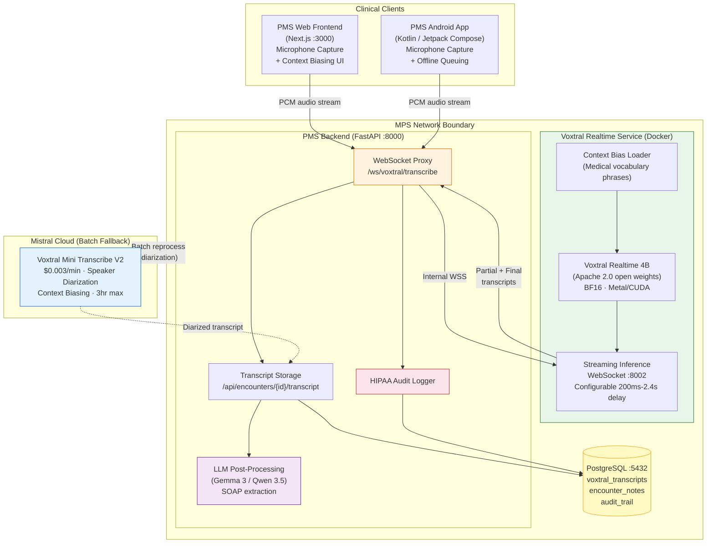

# Product Requirements Document: Voxtral Transcribe 2 Integration into Patient Management System (PMS)

**Document ID:** PRD-PMS-VOXTRALTRANSCRIBE2-001
**Version:** 1.0
**Date:** February 23, 2026
**Author:** Ammar (CEO, MPS Inc.)
**Status:** Draft

---

## 1. Executive Summary

Voxtral Transcribe 2 is Mistral AI's speech-to-text model family released February 4, 2026. It consists of two models: **Voxtral Mini Transcribe V2** for batch transcription with speaker diarization, and **Voxtral Realtime** (4B parameters) for live streaming transcription with sub-200ms configurable latency. The Realtime model is released under the **Apache 2.0** license as open weights on Hugging Face, making it the first production-quality, open-weight, real-time ASR model that can be self-hosted for HIPAA-compliant clinical workflows.

Integrating Voxtral Transcribe 2 into the PMS provides a **hybrid deployment model** that the existing speech experiments cannot offer. Unlike MedASR (Experiment 07), which is self-hosted but English-only, batch-only, and lacks real-time streaming, Voxtral delivers real-time streaming in 13 languages with a model that runs on consumer hardware. Unlike Speechmatics Medical (Experiment 10), which requires a commercial API and BAA negotiation, Voxtral's open weights allow fully on-premise deployment with zero PHI egress — no vendor dependency for the core transcription engine. Voxtral's context biasing feature (up to 100 custom phrases) enables clinical vocabulary customization without model fine-tuning, and the batch model provides speaker diarization for ambient scribing scenarios.

For the PMS, this means clinicians can dictate encounter notes in real time from the Next.js web frontend or Android app, with audio processed entirely on MPS infrastructure. The 4B parameter model fits comfortably on a single consumer GPU (or Apple Silicon via Metal). The batch model adds speaker diarization for multi-party encounters, and the API fallback provides elastic capacity during peak hours — all at $0.003-$0.006/minute, roughly 5x cheaper than competing services.

---

## 2. Problem Statement

The PMS has two existing speech-to-text experiments that each address part of the clinical transcription challenge, but neither provides the complete solution:

- **MedASR (Experiment 07) limitations:** English-only. Batch processing only — no real-time streaming during encounters. 105M parameters optimized for medical dictation but cannot handle ambient multi-party conversations. No speaker diarization. No multilingual support for the PMS's diverse patient population.
- **Speechmatics Medical (Experiment 10) limitations:** Requires a commercial API subscription ($0.015/min+). Audio must traverse the network to Speechmatics servers (even with the WebSocket proxy pattern, PHI leaves the MPS boundary unless the expensive CPU Container is provisioned). BAA negotiation required. Vendor lock-in for the core transcription engine.
- **Gap between the two:** No existing experiment offers self-hosted, real-time, multilingual, open-weight ASR with speaker diarization. MedASR is self-hosted but limited; Speechmatics is capable but commercial. The PMS needs an option that combines the best of both.
- **Cost pressure:** At $0.015/min (Speechmatics), a clinic running 8 hours of ambient scribing per day across 10 providers would spend ~$2,160/month on transcription alone. Voxtral's self-hosted model eliminates this recurring cost entirely.
- **Context biasing need:** Clinical encounters use highly specific vocabulary — medication names (e.g., "empagliflozin"), procedure codes (e.g., "CPT 99214"), and anatomical terms — that general ASR models frequently misrecognize. Voxtral's context biasing allows injecting up to 100 domain-specific phrases per session without retraining.

---

## 3. Proposed Solution

Deploy Voxtral Transcribe 2 as a **dual-mode clinical transcription service**: Voxtral Realtime for live dictation and ambient encounter capture, and Voxtral Mini Transcribe V2 (via API) for batch reprocessing with speaker diarization. The Realtime model runs self-hosted on MPS infrastructure; the batch model uses Mistral's API as a cost-effective supplement.

### 3.1 Architecture Overview

### 3.2 Deployment Model

| Aspect | Decision |
| --- | --- |
| **Primary (Realtime)** | Self-hosted Docker container running Voxtral Realtime 4B. GPU: NVIDIA T4/RTX 3060 (8GB VRAM) or Apple Silicon M2+ (Metal). |
| **Secondary (Batch)** | Mistral Cloud API for batch reprocessing with speaker diarization. $0.003/min. |
| **Licensing** | Voxtral Realtime: Apache 2.0 (open weights). Voxtral Mini Transcribe V2: Mistral API terms. |
| **Transport** | WebSocket (WSS) for real-time streaming. REST for batch submission. |
| **HIPAA compliance** | Real-time audio never leaves MPS network boundary. Batch API used only for non-PHI reprocessing or with de-identified audio. Full audit logging. TLS everywhere. |
| **Audio routing** | Client → PMS backend WebSocket proxy → Voxtral Realtime container. No direct client-to-model connection. |
| **Fallback** | If self-hosted Voxtral is unavailable, route to Mistral API ($0.006/min realtime). Circuit breaker pattern. |

---

## 4. PMS Data Sources

| PMS API | Integration | Description |
| --- | --- | --- |
| `/api/encounters` | **Primary** | Transcripts attached to encounter records. Real-time and batch transcripts stored against active encounters. |
| `/api/patients` | **Context** | Patient demographics (preferred language) used to configure transcription language. Current medications loaded for context biasing. |
| `/api/prescriptions` | **Downstream** | LLM post-processing (Gemma 3 / Qwen 3.5) extracts medication orders from transcripts and creates draft prescriptions. |
| `/api/reports` | **Analytics** | Transcription usage: minutes transcribed, accuracy estimates, language distribution, self-hosted vs API ratio. |

New API endpoints:

| Endpoint | Method | Description |
| --- | --- | --- |
| `/ws/voxtral/transcribe` | WebSocket | Real-time streaming transcription via self-hosted Voxtral Realtime |
| `/api/voxtral/transcribe/batch` | POST | Submit audio for batch transcription with diarization (Mistral API) |
| `/api/voxtral/transcriptions/{id}` | GET | Retrieve transcription result, metadata, and speaker labels |
| `/api/voxtral/context-bias` | GET/PUT | Manage clinic-specific context bias phrase lists |
| `/api/voxtral/health` | GET | Service health check for self-hosted Voxtral container |

---

## 5. Component/Module Definitions

### 5.1 Voxtral Realtime Inference Service

| Property | Value |
| --- | --- |
| **Description** | Docker container running Voxtral Realtime 4B model for streaming speech-to-text inference |
| **Input** | 16kHz mono PCM audio chunks via WebSocket |
| **Output** | JSON with partial transcripts (low-latency), final transcripts (high-accuracy), word-level timestamps |
| **PMS APIs Used** | None (standalone inference; PMS backend proxies requests) |
| **Port** | 8002 |
| **GPU** | NVIDIA T4/RTX 3060 (8GB VRAM) or Apple Silicon M2+ (Metal via voxtral.c) |

### 5.2 Context Bias Manager

| Property | Value |
| --- | --- |
| **Description** | Manages clinic-specific vocabulary phrase lists (up to 100 phrases per session) for improved medical term recognition |
| **Input** | Phrase lists from PMS admin UI + patient medication lists from `/api/patients/{id}` |
| **Output** | Formatted bias phrases injected into Voxtral inference sessions |
| **PMS APIs Used** | `/api/patients` (medication names), `/api/prescriptions` (drug catalog) |

### 5.3 WebSocket Transcription Proxy

| Property | Value |
| --- | --- |
| **Description** | FastAPI WebSocket endpoint that proxies audio between clients and Voxtral Realtime, handles session lifecycle, and persists results |
| **Input** | PCM audio from web/mobile clients |
| **Output** | Streaming transcript events with word timestamps |
| **PMS APIs Used** | `/api/encounters/{id}/transcript` for persistence, audit logging |

### 5.4 Batch Diarization Service

| Property | Value |
| --- | --- |
| **Description** | Submits recorded encounter audio to Mistral's Voxtral Mini Transcribe V2 API for batch processing with speaker diarization |
| **Input** | Audio files (up to 3 hours) from stored encounter recordings |
| **Output** | Diarized transcript with speaker labels, timestamps, and confidence scores |
| **PMS APIs Used** | `/api/encounters/{id}/transcript` for storage |

### 5.5 LLM Post-Processing Pipeline

| Property | Value |
| --- | --- |
| **Description** | Feeds transcripts to on-premise Gemma 3 or Qwen 3.5 (Experiments 13, 20) for structured extraction |
| **Input** | Raw transcript text from Voxtral |
| **Output** | Structured SOAP notes, medication lists, ICD codes, action items |
| **PMS APIs Used** | `/api/encounters`, `/api/prescriptions` |

---

## 6. Non-Functional Requirements

### 6.1 Security and HIPAA Compliance

| Requirement | Implementation |
| --- | --- |
| **PHI in transit** | TLS 1.3 for all WebSocket and REST connections. Audio encrypted in transit. |
| **PHI at rest** | Transcripts encrypted in PostgreSQL (AES-256). Audio not persisted by default; configurable retention for QA. |
| **Network isolation** | Voxtral container on internal Docker network. No outbound internet. Only PMS backend can reach it. |
| **Batch API PHI** | Batch diarization via Mistral API used only with de-identified or consented audio. Configurable per clinic. |
| **Audit logging** | Every transcription session logged: user, patient context, start/end time, model version, word count, language. |
| **Access control** | Transcription access follows PMS role-based permissions. Only authorized clinicians can initiate dictation for their patients. |
| **Data minimization** | Audio chunks processed in-memory and discarded after transcription. No persistent audio storage unless explicitly enabled. |

### 6.2 Performance

| Metric | Target |
| --- | --- |
| **Real-time latency** | < 500ms end-to-end (audio capture → displayed transcript) |
| **Word error rate** | < 5% on English clinical dictation (FLEURS ~4%) |
| **Concurrent sessions** | 4 simultaneous real-time sessions per GPU |
| **Batch throughput** | 3x real-time processing speed |
| **Context bias impact** | < 2% WER on biased medical terms |

### 6.3 Infrastructure

| Component | Requirement |
| --- | --- |
| **Voxtral Realtime container** | Docker with NVIDIA GPU access (8GB VRAM) OR Apple Silicon with Metal support |
| **Model storage** | ~8GB for BF16 weights (Voxtral Realtime 4B) |
| **RAM** | 16GB minimum for inference service |
| **Network** | Internal Docker network, WebSocket capable |
| **Alternative: voxtral.c** | Pure C inference (antirez) — zero Python dependencies, Metal/OpenBLAS acceleration, single binary |

---

## 7. Implementation Phases

### Phase 1: Foundation (Sprints 1-2)

- Deploy Voxtral Realtime 4B in Docker container with GPU acceleration
- Build WebSocket inference endpoint (:8002)
- Create PMS backend WebSocket proxy (`/ws/voxtral/transcribe`)
- Implement HIPAA audit logging for transcription sessions
- Basic health check endpoint
- **Checkpoint:** Single-user real-time dictation working end-to-end

### Phase 2: Core Integration (Sprints 3-4)

- Build context bias manager with medical vocabulary presets
- Integrate patient medication context from `/api/patients`
- Connect to Mistral batch API for speaker diarization
- Build Next.js transcription UI component with real-time display
- Add Android app microphone capture and WebSocket streaming
- Connect transcripts to encounter records via `/api/encounters`
- **Checkpoint:** Multi-language dictation with context biasing and diarization

### Phase 3: Advanced Features (Sprints 5-6)

- LLM post-processing pipeline (Gemma 3 / Qwen 3.5 SOAP extraction)
- Ambient scribing mode (continuous recording with diarization)
- Fallback circuit breaker to Mistral API
- Transcription analytics dashboard
- voxtral.c deployment option for Metal-only environments (no Python/GPU)
- A/B comparison framework against MedASR and Speechmatics
- **Checkpoint:** Production-ready clinical transcription with structured extraction

---

## 8. Success Metrics

| Metric | Target | Measurement |
| --- | --- | --- |
| Clinician documentation time reduction | 40%+ | Pre/post encounter time comparison |
| Real-time transcription latency | < 500ms P95 | WebSocket event timestamps |
| Word error rate (medical terms) | < 5% | Manual review of 100 random encounters/month |
| Context bias accuracy | > 95% on biased terms | Automated comparison against bias phrase list |
| Self-hosted uptime | 99.5% | Docker health check monitoring |
| Monthly transcription cost | < $500/clinic (mixed mode) | API billing + infrastructure cost tracking |
| Clinician adoption rate | 60%+ within 90 days | Usage analytics per provider |
| PHI egress incidents | Zero | Audit log review + network monitoring |

---

## 9. Risks and Mitigations

| Risk | Impact | Mitigation |
| --- | --- | --- |
| Medical term accuracy lower than MedASR | Clinical documentation errors | Context biasing with medication/procedure lists. Fine-tune on clinical audio if needed (Apache 2.0 allows). |
| GPU availability for self-hosted model | Cannot run real-time transcription | voxtral.c alternative (CPU + Metal). Fallback to Mistral API. |
| Mistral API dependency for batch diarization | Vendor lock-in for diarization feature | Diarization is supplementary, not critical path. Self-hosted realtime works without it. |
| Apache 2.0 license changes | Model access revoked | Weights are downloadable and redistributable. Cache locally. |
| Concurrent session limits on single GPU | Peak-hour degradation | Queue management. Horizontal scaling. API overflow routing. |
| 13-language limit (no coverage for all patient languages) | Some patients' languages unsupported | Fall back to Speechmatics (55+ languages) for unsupported languages. |

---

## 10. Dependencies

| Dependency | Type | Notes |
| --- | --- | --- |
| Voxtral Realtime 4B weights | Model | Apache 2.0 from Hugging Face (`mistralai/Voxtral-Mini-4B-Realtime-2602`) |
| Mistral API account | Service | For batch Voxtral Mini Transcribe V2 ($0.003/min) |
| NVIDIA GPU (T4/RTX 3060+) or Apple Silicon M2+ | Hardware | 8GB VRAM minimum for BF16 inference |
| PMS Backend (FastAPI :8000) | Service | WebSocket proxy and transcript storage |
| PMS Frontend (Next.js :3000) | UI | Microphone capture and transcript display |
| PostgreSQL :5432 | Database | Transcript and audit log storage |
| Gemma 3 / Qwen 3.5 (Experiments 13, 20) | AI Models | Optional downstream SOAP extraction and structured note generation |
| voxtral.c (optional) | Alternative runtime | Pure C inference, no Python dependencies, Metal/OpenBLAS |

---

## 11. Comparison with Existing Experiments

| Capability | MedASR (Exp 07) | Speechmatics Medical (Exp 10) | **Voxtral Transcribe 2 (This)** |
| --- | --- | --- | --- |
| **Deployment** | Self-hosted (GPU Docker) | Cloud SaaS or self-hosted CPU container | Self-hosted (GPU/Metal Docker) + API fallback |
| **License** | Open-source | Commercial | **Apache 2.0 open weights** |
| **Real-time streaming** | No (batch only) | Yes (WebSocket) | **Yes (WebSocket, sub-200ms)** |
| **Speaker diarization** | No | Yes (real-time) | Yes (batch model via API) |
| **Languages** | English only | 55+ languages | **13 languages** |
| **Medical vocabulary** | Purpose-built (Conformer) | Medical model fine-tuned | Context biasing (100 phrases/session) |
| **Word error rate** | ~4.6% (radiology) | ~7% (clinical) | **~4% (FLEURS general)** |
| **Parameters** | 105M | Proprietary | **4B** |
| **API cost** | Free (self-hosted) | ~$0.015/min | **$0.003-$0.006/min** |
| **HIPAA approach** | Full on-premise, zero egress | BAA + cloud or expensive on-prem container | **Full on-premise, zero egress** (self-hosted) |
| **Context biasing** | No | No | **Yes (100 phrases)** |
| **Pure C runtime** | No | No | **Yes (voxtral.c by antirez)** |

**Positioning:** Voxtral Transcribe 2 fills the gap between MedASR (self-hosted but limited) and Speechmatics (capable but commercial). It provides the first open-weight, real-time, multilingual ASR that can be fully self-hosted for HIPAA compliance while offering context biasing for clinical vocabulary — at 5x lower API cost than Speechmatics when using the cloud fallback. It does not replace MedASR's medical-specific training or Speechmatics' 55+ language breadth, but it covers the most common clinical languages with the best deployment flexibility.

---

## 12. Research Sources

### Official Documentation
- [Voxtral Transcribe 2 Announcement — Mistral AI](https://mistral.ai/news/voxtral-transcribe-2) — Product announcement with architecture overview, pricing, and feature details
- [Voxtral Audio Transcription Docs — Mistral](https://docs.mistral.ai/capabilities/audio_transcription) — API documentation, code examples, supported languages
- [Voxtral Mini 4B Realtime Model Card — Hugging Face](https://huggingface.co/mistralai/Voxtral-Mini-4B-Realtime-2602) — Open-weight model card, architecture details, Apache 2.0 license

### Architecture & Benchmarks
- [Voxtral Transcribe 2 Technical Deep Dive — MarkTechPost](https://www.marktechpost.com/2026/02/04/mistral-ai-launches-voxtral-transcribe-2-pairing-batch-diarization-and-open-realtime-asr-for-multilingual-production-workloads-at-scale/) — Batch + realtime architecture, benchmark comparison
- [Voxtral Transcribe 2 Review & Comparison — ScreenApp](https://screenapp.io/blog/voxtral-transcribe-2-review-comparison) — Comparison against Whisper, Deepgram, and other ASR services
- [Best Speech-to-Text APIs 2026 — Deepgram](https://deepgram.com/learn/best-speech-to-text-apis-2026) — Industry benchmark comparison including Voxtral pricing

### Open-Source Ecosystem
- [voxtral.c — GitHub (antirez)](https://github.com/antirez/voxtral.c) — Pure C inference, zero dependencies, Metal/OpenBLAS acceleration
- [Voxtral Transcribe 2 — VentureBeat](https://venturebeat.com/technology/mistral-drops-voxtral-transcribe-2-an-open-source-speech-model-that-runs-on) — Analysis of on-device deployment, privacy, and healthcare applicability

### Security & Compliance
- [Voxtral Transcribe 2 — eWeek](https://www.eweek.com/news/mistral-ai-voxtral-transcribe-2-launch/) — HIPAA/GDPR compliance through on-premise deployment
- [Simon Willison's Analysis](https://simonwillison.net/2026/Feb/4/voxtral-2/) — Technical review and deployment considerations

---

## 13. Appendix: Related Documents

- [Voxtral Transcribe 2 Setup Guide](21-VoxtralTranscribe2-PMS-Developer-Setup-Guide.md) — Step-by-step installation, Docker configuration, and PMS integration
- [Voxtral Transcribe 2 Developer Tutorial](21-VoxtralTranscribe2-Developer-Tutorial.md) — Hands-on onboarding: build clinical dictation with context biasing end-to-end
- [PRD: MedASR PMS Integration](07-PRD-MedASR-PMS-Integration.md) — Experiment 07: Self-hosted medical Conformer model (complementary for radiology dictation)
- [PRD: Speechmatics Medical PMS Integration](10-PRD-SpeechmaticsMedical-PMS-Integration.md) — Experiment 10: Commercial real-time clinical ASR (complementary for 55+ languages)
- [Voxtral Realtime Model — Hugging Face](https://huggingface.co/mistralai/Voxtral-Mini-4B-Realtime-2602)
- [Mistral Audio Transcription Docs](https://docs.mistral.ai/capabilities/audio_transcription)
