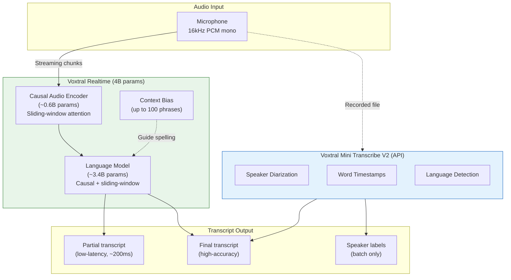
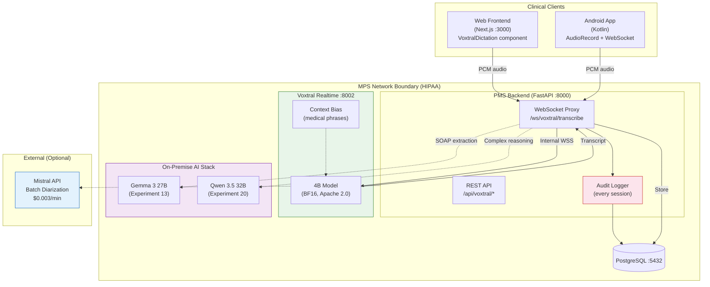

# Voxtral Transcribe 2 Developer Onboarding Tutorial

**Welcome to the MPS PMS Voxtral Transcribe 2 Integration Team**

This tutorial will take you from zero to building your first Voxtral Transcribe 2 integration with the PMS. By the end, you will understand how Voxtral works, have a running local environment, and have built and tested a clinical dictation pipeline with context biasing end-to-end.

**Document ID:** PMS-EXP-VOXTRALTRANSCRIBE2-002
**Version:** 1.0
**Date:** February 23, 2026
**Applies To:** PMS project (all platforms)
**Prerequisite:** [Voxtral Transcribe 2 Setup Guide](21-VoxtralTranscribe2-PMS-Developer-Setup-Guide.md)
**Estimated time:** 2-3 hours
**Difficulty:** Beginner-friendly

---

## What You Will Learn

1. What Voxtral Transcribe 2 is and why it matters for clinical speech-to-text
2. How the dual-model architecture (Realtime + Batch) works
3. How context biasing improves medical term recognition without model fine-tuning
4. How Voxtral differs from MedASR (Experiment 07) and Speechmatics Medical (Experiment 10)
5. How to stream audio from a browser to the self-hosted Voxtral service via WebSocket
6. How to build a clinical dictation component for the PMS encounter form
7. How to configure batch diarization for multi-party encounters via the Mistral API
8. How to test transcription accuracy on medical vocabulary
9. How HIPAA compliance is maintained with self-hosted inference
10. How to debug common transcription issues

---

## Part 1: Understanding Voxtral Transcribe 2 (15 min read)

### 1.1 What Problem Does Voxtral Solve?

Clinical documentation is the single largest time sink for PMS clinicians. A physician seeing 30 patients per day spends 7-15 hours per week on documentation alone. The PMS needs voice-to-text that is:

- **Real-time** — text appears as the clinician speaks, not after uploading a recording
- **Medically accurate** — "Lisinopril" must not become "listen a pill"
- **Self-hosted** — patient audio must never leave the MPS network (HIPAA)
- **Multilingual** — the PMS serves patients speaking English, Spanish, Arabic, and more
- **Cost-effective** — commercial APIs at $0.015/min add up fast across a clinic

No single existing PMS experiment solves all five. MedASR (Experiment 07) handles self-hosting and medical accuracy but is English-only and batch-only. Speechmatics Medical (Experiment 10) handles real-time and multilingual but requires a commercial API and BAA. Voxtral Transcribe 2 is the first model that checks all five boxes simultaneously.

### 1.2 How Voxtral Works — The Key Pieces



Voxtral Transcribe 2 is a **dual-model family**:

1. **Voxtral Realtime** (4B parameters, self-hosted) — A streaming speech-to-text model with a custom causal audio encoder (~0.6B) and language model (~3.4B). Both use sliding-window attention, enabling effectively infinite streaming. It produces transcript text as audio arrives, with configurable delay from 200ms to 2.4 seconds.

2. **Voxtral Mini Transcribe V2** (API-only) — A batch processing model accessed via Mistral's cloud API. It adds speaker diarization (who said what), word-level timestamps, and higher accuracy on long recordings (up to 3 hours). Costs $0.003/minute.

### 1.3 How Voxtral Fits with Other PMS Technologies

| Capability | MedASR (07) | Speechmatics (10) | **Voxtral (21)** | When to Use |
| --- | --- | --- | --- | --- |
| Self-hosted | Yes (GPU) | Expensive container | **Yes (GPU/Metal/CPU)** | Voxtral for most; MedASR for radiology |
| Real-time | No | Yes | **Yes (sub-200ms)** | Voxtral or Speechmatics |
| Medical training | Purpose-built | Medical model | **Context biasing** | MedASR for radiology-specific |
| Languages | English | 55+ | **13** | Speechmatics for rare languages |
| Diarization | No | Yes (real-time) | **Yes (batch API)** | Speechmatics for real-time diarization |
| Open weights | Yes | No | **Yes (Apache 2.0)** | Voxtral or MedASR |
| API cost | Free | ~$0.015/min | **$0.003-$0.006/min** | Voxtral for cost savings |
| Context biasing | No | No | **Yes (100 phrases)** | Voxtral uniquely |
| Pure C runtime | No | No | **Yes (voxtral.c)** | Voxtral on Apple Silicon |
| Post-processing | MedGemma | Adaptive Thinking | **Gemma 3 / Qwen 3.5** | Any LLM for SOAP extraction |

**Decision guide:**
- Use **Voxtral** as the default ASR for most clinical workflows (best balance of capability, cost, and self-hosting)
- Use **MedASR** when you need specialized radiology dictation with the lowest possible WER on English medical terms
- Use **Speechmatics** when you need 55+ languages or real-time speaker diarization during the encounter

### 1.4 Key Vocabulary

| Term | Meaning |
| --- | --- |
| **ASR** | Automatic Speech Recognition — converting spoken audio to text |
| **Causal attention** | Attention mechanism that only looks at past tokens, enabling real-time streaming |
| **Sliding-window attention** | Attention over a fixed-size window that slides forward, enabling infinite input length |
| **Context biasing** | Pre-feeding the model a list of phrases (up to 100) to guide correct spelling |
| **Speaker diarization** | Identifying and labeling which speaker said what in multi-party audio |
| **WER** | Word Error Rate — percentage of incorrectly transcribed words (lower is better) |
| **PCM** | Pulse Code Modulation — raw uncompressed audio format (16kHz, 16-bit, mono) |
| **BF16** | Brain Float 16 — a 16-bit floating point format for efficient GPU inference |
| **FLEURS** | Benchmark for evaluating multilingual ASR (Few-shot Learning Evaluation of Universal Representations of Speech) |
| **voxtral.c** | Pure C implementation of Voxtral inference by antirez (Redis creator), with Metal/OpenBLAS support |

### 1.5 Our Architecture



---

## Part 2: Environment Verification (15 min)

### 2.1 Checklist

Complete the [Setup Guide](21-VoxtralTranscribe2-PMS-Developer-Setup-Guide.md) first, then verify:

1. **Voxtral Realtime container running:**
   ```bash
   curl -s http://localhost:8002/health | jq .
   # Expected: {"status": "healthy", "model": "voxtral-realtime-4b", ...}
   ```

2. **PMS Backend proxy available:**
   ```bash
   curl -s http://localhost:8000/api/voxtral/health | jq .
   # Expected: same as above
   ```

3. **Context bias loaded:**
   ```bash
   curl -s http://localhost:8000/api/voxtral/context-bias | jq '.phrases | length'
   # Expected: a number > 0 (e.g., 40)
   ```

4. **PostgreSQL running:**
   ```bash
   docker exec pms-db pg_isready -U pms
   # Expected: accepting connections
   ```

5. **PMS Frontend running:**
   ```bash
   curl -s -o /dev/null -w "%{http_code}" http://localhost:3000
   # Expected: 200
   ```

### 2.2 Quick Test

Open your browser's developer console and test the WebSocket:

```javascript
const ws = new WebSocket("ws://localhost:8000/api/voxtral/ws/transcribe?language=en");
ws.onopen = () => console.log("Connected to Voxtral proxy");
ws.onmessage = (e) => console.log("Transcript:", JSON.parse(e.data));
ws.onerror = (e) => console.error("Error:", e);
```

If you see "Connected to Voxtral proxy" in the console, the WebSocket chain is working end-to-end.

---

## Part 3: Build Your First Clinical Dictation Integration (45 min)

### 3.1 What We Are Building

A complete clinical dictation flow: the clinician clicks a microphone button on the encounter form, speaks their clinical notes, and sees the transcript appear in real time inside the encounter note field. When they stop, the transcript is saved to the encounter record and sent to Gemma 3 for SOAP note extraction.

### 3.2 Step 1 — Create the Encounter Dictation Page

Create `pms-frontend/src/app/encounters/[id]/dictate/page.tsx`:

```tsx
"use client";

import { useParams } from "next/navigation";
import { useState } from "react";
import { VoxtralDictation } from "@/components/voxtral/VoxtralDictation";

export default function DictatePage() {
  const { id: encounterId } = useParams<{ id: string }>();
  const [savedTranscript, setSavedTranscript] = useState("");
  const [soapNote, setSoapNote] = useState("");
  const [isProcessing, setIsProcessing] = useState(false);

  const handleTranscriptChange = async (text: string) => {
    setSavedTranscript(text);

    // Save transcript to encounter
    await fetch(`/api/encounters/${encounterId}/transcript`, {
      method: "POST",
      headers: { "Content-Type": "application/json" },
      body: JSON.stringify({
        transcript_text: text,
        model_version: "voxtral-realtime-4b",
        source: "self_hosted",
      }),
    });

    // Request SOAP note extraction (via on-premise Gemma 3)
    setIsProcessing(true);
    try {
      const soapResp = await fetch(`/api/encounters/${encounterId}/soap`, {
        method: "POST",
        headers: { "Content-Type": "application/json" },
        body: JSON.stringify({ transcript: text }),
      });
      const soapData = await soapResp.json();
      setSoapNote(soapData.soap_note);
    } finally {
      setIsProcessing(false);
    }
  };

  return (
    <div className="mx-auto max-w-4xl p-6">
      <h1 className="mb-6 text-2xl font-bold">
        Encounter Dictation
      </h1>

      <VoxtralDictation
        encounterId={encounterId}
        language="en"
        onTranscriptChange={handleTranscriptChange}
      />

      {savedTranscript && (
        <div className="mt-6">
          <h2 className="mb-2 text-lg font-semibold">
            Saved Transcript
          </h2>
          <div className="rounded bg-gray-50 p-4 text-sm">
            {savedTranscript}
          </div>
        </div>
      )}

      {isProcessing && (
        <div className="mt-4 text-sm text-gray-500">
          Extracting SOAP note...
        </div>
      )}

      {soapNote && (
        <div className="mt-6">
          <h2 className="mb-2 text-lg font-semibold">
            SOAP Note (AI-Generated)
          </h2>
          <div className="rounded border border-purple-200 bg-purple-50 p-4 text-sm whitespace-pre-wrap">
            {soapNote}
          </div>
        </div>
      )}
    </div>
  );
}
```

### 3.3 Step 2 — Add a Language Selector

For multilingual clinics, add language selection to the dictation component. Voxtral supports 13 languages:

```tsx
const SUPPORTED_LANGUAGES = [
  { code: "en", label: "English" },
  { code: "es", label: "Spanish" },
  { code: "ar", label: "Arabic" },
  { code: "zh", label: "Chinese" },
  { code: "hi", label: "Hindi" },
  { code: "fr", label: "French" },
  { code: "pt", label: "Portuguese" },
  { code: "ru", label: "Russian" },
  { code: "de", label: "German" },
  { code: "ja", label: "Japanese" },
  { code: "ko", label: "Korean" },
  { code: "it", label: "Italian" },
  { code: "nl", label: "Dutch" },
] as const;
```

### 3.4 Step 3 — Test with Medical Vocabulary

Dictate the following test phrases and verify context biasing works:

| Say This | Should Transcribe As | Without Biasing Might Produce |
| --- | --- | --- |
| "Patient is taking Lisinopril 10 milligrams daily" | "Lisinopril" | "listen a pill" / "lizard pill" |
| "Hemoglobin A1c is 7.2 percent" | "Hemoglobin A1c" | "hemoglobin a one c" |
| "Assessment: CPT 99214 level visit" | "CPT 99214" | "see PT 99214" |
| "Bilateral lower extremity edema noted" | "Bilateral" | "by lateral" |
| "Started on Empagliflozin 25 milligrams" | "Empagliflozin" | "em pag li flow zin" |

### 3.5 Step 4 — Configure Batch Diarization

For multi-party encounters (clinician + patient + family), set up batch diarization via the Mistral API:

```python
# pms-backend/app/services/voxtral_batch.py
"""Batch diarization via Mistral Voxtral Mini Transcribe V2 API."""

import httpx
import os

MISTRAL_API_KEY = os.getenv("MISTRAL_API_KEY")
MISTRAL_BATCH_URL = "https://api.mistral.ai/v1/audio/transcriptions"


async def diarize_encounter_audio(
    audio_path: str,
    language: str = "en",
) -> dict:
    """Submit audio for batch transcription with speaker diarization."""
    async with httpx.AsyncClient(timeout=300.0) as client:
        with open(audio_path, "rb") as f:
            response = await client.post(
                MISTRAL_BATCH_URL,
                headers={"Authorization": f"Bearer {MISTRAL_API_KEY}"},
                files={"file": ("encounter.wav", f, "audio/wav")},
                data={
                    "model": "voxtral-mini-transcribe-v2",
                    "language": language,
                    "response_format": "verbose_json",
                    "timestamp_granularities": ["word", "segment"],
                },
            )
            response.raise_for_status()
            return response.json()
```

### 3.6 Step 5 — Verify the Full Pipeline

1. Navigate to `http://localhost:3000/encounters/{encounter-id}/dictate`
2. Click "Start Dictation"
3. Speak a full clinical encounter note:
   > "This is a follow-up visit for a 62-year-old male with type 2 diabetes and hypertension. Current medications include Metformin 1000 milligrams twice daily, Lisinopril 20 milligrams daily, and Atorvastatin 40 milligrams at bedtime. Hemoglobin A1c today is 7.4 percent, down from 8.1 at last visit. Blood pressure 132 over 78. Assessment: Diabetes improving with current regimen. Plan: Continue current medications. Recheck A1c in 3 months. CPT 99214."
4. Click "Stop"
5. Verify the transcript is saved and SOAP note is generated

**Checkpoint:** Full clinical dictation pipeline working — microphone to transcript to SOAP note to encounter record.

---

## Part 4: Evaluating Strengths and Weaknesses (15 min)

### 4.1 Strengths

- **Open weights (Apache 2.0)**: Full control over the model. No vendor dependency for the core engine. Can fine-tune, modify, and redistribute.
- **Self-hosted HIPAA compliance**: Audio never leaves the MPS network. No BAA negotiation needed for the self-hosted path.
- **Context biasing**: Up to 100 custom phrases per session. No model retraining required to improve medical term accuracy.
- **Low cost**: Self-hosted is infrastructure-only cost. API fallback at $0.003/min is 5x cheaper than Speechmatics.
- **Real-time streaming**: Sub-200ms configurable latency. Text appears as the clinician speaks.
- **13 languages**: Covers the most common clinical languages (English, Spanish, Arabic, Chinese, Hindi, French).
- **voxtral.c**: Pure C runtime by antirez (Redis creator) enables deployment on Apple Silicon without Python or GPU drivers.
- **Dual-mode**: Realtime for live dictation + Batch API for diarization and reprocessing.

### 4.2 Weaknesses

- **Not medical-specific**: Unlike MedASR (trained on medical dictation), Voxtral is a general-purpose ASR with context biasing. Medical term accuracy depends on the bias list quality.
- **No real-time diarization**: Speaker diarization is batch-only (via API). Speechmatics offers real-time diarization during the encounter.
- **13 languages only**: Speechmatics supports 55+. Rare languages (e.g., Tagalog, Haitian Creole) require Speechmatics fallback.
- **4B parameters require GPU**: The model needs 8GB VRAM for real-time performance. CPU inference via voxtral.c works but is slower.
- **New model**: Released Feb 4, 2026. Less battle-tested than Whisper or Speechmatics. Community tooling is still emerging.
- **100-phrase bias limit**: Context biasing supports up to 100 phrases per session. Very large custom vocabularies need fine-tuning.

### 4.3 When to Use Voxtral vs Alternatives

| Scenario | Recommended | Reason |
| --- | --- | --- |
| Standard clinical dictation (English) | **Voxtral** | Best balance of accuracy, cost, self-hosting |
| Radiology-specific dictation | **MedASR** | Purpose-trained on radiology terminology |
| Multi-party encounter with real-time speaker labels | **Speechmatics** | Only option with real-time diarization |
| Patient speaking Tagalog, Haitian Creole, etc. | **Speechmatics** | 55+ languages vs Voxtral's 13 |
| Budget-constrained clinic, no GPU | **Voxtral (voxtral.c)** | Runs on Apple Silicon M2+ without GPU |
| Post-encounter batch reprocessing with diarization | **Voxtral Batch API** | $0.003/min vs $0.015/min Speechmatics |
| Android app offline dictation | **MedASR** or future Voxtral mobile | MedASR's 105M fits on-device |

### 4.4 HIPAA / Healthcare Considerations

| Aspect | Status | Notes |
| --- | --- | --- |
| **PHI in transit** | Compliant | TLS 1.3 for all connections. Audio encrypted in transit. |
| **PHI at rest** | Compliant | Transcripts encrypted in PostgreSQL. Audio not persisted by default. |
| **Self-hosted inference** | Compliant | Voxtral Realtime runs entirely on MPS infrastructure. Zero PHI egress. |
| **Batch API (Mistral)** | Requires review | PHI leaves MPS boundary if using Mistral API. Use only with de-identified audio or explicit patient consent. |
| **Audit trail** | Compliant | Every session logged with user, patient, encounter, timestamps. |
| **Access control** | Compliant | Role-based access via PMS auth. Only authorized clinicians can dictate. |
| **Model license** | Apache 2.0 | No restrictions on healthcare use. Can fine-tune on clinical data. |

---

## Part 5: Debugging Common Issues (15 min read)

### Issue 1: Transcript is empty or gibberish

**Symptoms:** WebSocket connects but transcript text is empty, garbled, or unrelated to spoken audio.

**Cause:** Audio format mismatch. Voxtral expects 16kHz, 16-bit, mono PCM.

**Fix:** Verify your audio pipeline:
```bash
# Test with a known-good audio file
ffmpeg -i test.mp3 -ar 16000 -ac 1 -f s16le test.pcm
# Feed to Voxtral and check output
```

### Issue 2: Context bias not working

**Symptoms:** Medical terms still misspelled despite being in the bias list.

**Cause:** Bias phrases not loaded or not passed to the model session.

**Fix:**
```bash
# Check bias phrases endpoint
curl -s http://localhost:8000/api/voxtral/context-bias | jq .

# Check Docker volume mount
docker exec pms-voxtral-realtime ls -la /config/
```

### Issue 3: High memory usage on GPU

**Symptoms:** `nvidia-smi` shows VRAM near capacity. Model slows down with multiple sessions.

**Cause:** BF16 model uses ~8GB VRAM. Multiple concurrent sessions share GPU memory.

**Fix:** Limit concurrent sessions to 4 per GPU. Configure session queuing in the WebSocket proxy.

### Issue 4: WebSocket disconnects after 60 seconds

**Symptoms:** Transcription stops working after about a minute. Browser console shows WebSocket close.

**Cause:** Default WebSocket timeout in reverse proxy (nginx/traefik).

**Fix:** Increase WebSocket timeout:
```nginx
# nginx.conf
proxy_read_timeout 3600s;
proxy_send_timeout 3600s;
```

### Issue 5: "Model loading" health status persists

**Symptoms:** `/health` endpoint returns `{"status": "loading"}` for more than 2 minutes.

**Cause:** Model weights not downloaded completely or path misconfigured.

**Fix:**
```bash
# Check model files exist
docker exec pms-voxtral-realtime ls -la /models/voxtral-realtime-4b/

# Check container logs for errors
docker logs pms-voxtral-realtime --tail 50
```

---

## Part 6: Practice Exercises (45 min)

### Exercise A: Medication Dictation Accuracy Test

Build a test harness that dictates 50 common medication names and measures accuracy:

1. Create a list of 50 medications from the PMS drug catalog
2. Use text-to-speech to generate audio for each medication name
3. Feed each audio clip to Voxtral via WebSocket
4. Compare output against expected medication names
5. Calculate WER with and without context biasing

**Hints:** Use `pyttsx3` or `gTTS` for test audio generation. Use `jiwer` library for WER calculation.

### Exercise B: Multilingual Encounter Dictation

Build a bilingual dictation flow for a Spanish-English encounter:

1. Modify the `VoxtralDictation` component to support mid-session language switching
2. Add a language toggle button that sends the new language parameter to the WebSocket
3. Dictate a bilingual encounter: English clinical notes + Spanish patient instructions
4. Verify both languages transcribe correctly

**Hints:** Voxtral Realtime auto-detects language in many cases, but explicit language parameter improves accuracy.

### Exercise C: Compare Voxtral vs MedASR

If you have MedASR (Experiment 07) running alongside Voxtral:

1. Record 10 clinical dictation samples (mix of general and radiology)
2. Send each sample to both Voxtral and MedASR
3. Compare WER for general clinical terms vs radiology-specific terms
4. Document when each model performs better
5. Propose a routing strategy: which encounters go to which model

---

## Part 7: Development Workflow and Conventions

### 7.1 File Organization

```
pms-backend/
├── app/
│   ├── routers/
│   │   └── voxtral.py              # WebSocket proxy + REST endpoints
│   └── services/
│       └── voxtral_batch.py         # Batch diarization via Mistral API
├── services/
│   └── voxtral/
│       ├── Dockerfile               # Voxtral Realtime container
│       ├── server.py                # Inference server
│       └── context_bias.py          # Medical vocabulary manager
├── config/
│   └── voxtral/
│       └── medical_bias_phrases.json # Clinic-specific bias phrases
└── models/
    └── voxtral-realtime-4b/          # Model weights (gitignored)

pms-frontend/
├── src/
│   ├── hooks/
│   │   └── useVoxtralTranscription.ts  # WebSocket + microphone hook
│   └── components/
│       └── voxtral/
│           └── VoxtralDictation.tsx     # Dictation UI component
```

### 7.2 Naming Conventions

| Item | Convention | Example |
| --- | --- | --- |
| Backend endpoints | `/api/voxtral/*` prefix | `/api/voxtral/ws/transcribe` |
| Database tables | `voxtral_` prefix | `voxtral_transcripts` |
| Frontend components | `Voxtral` prefix | `VoxtralDictation` |
| Hooks | `useVoxtral` prefix | `useVoxtralTranscription` |
| Config files | `voxtral/` directory | `config/voxtral/medical_bias_phrases.json` |
| Docker service | `pms-voxtral-realtime` | Container name |
| Environment variables | `VOXTRAL_` prefix | `VOXTRAL_MODEL_PATH` |

### 7.3 PR Checklist

- [ ] Audio data is never logged or persisted without explicit configuration
- [ ] All WebSocket sessions are audit-logged (user, patient, encounter, timestamps)
- [ ] Context bias phrases do not contain PHI
- [ ] Batch API calls (Mistral) documented with data classification (de-identified vs PHI)
- [ ] New bias phrases added to `medical_bias_phrases.json` if new medications or terms encountered
- [ ] Frontend component uses `onTranscriptChange` callback (not direct API calls)
- [ ] Tests include at least one medical term accuracy check

### 7.4 Security Reminders

1. **Never log raw audio.** Audio is PHI. Process in-memory and discard.
2. **Batch API = PHI egress.** Only use Mistral API with de-identified audio or documented patient consent.
3. **Context bias is not PHI.** Medication names and clinical terms are not patient-specific — safe to include in bias lists.
4. **Audit every session.** User ID, patient context, start/end time, word count, language — all logged.
5. **Network isolation.** Voxtral container must not have outbound internet access. Internal Docker network only.

---

## Part 8: Quick Reference Card

### Key Commands

```bash
# Start service
docker compose up -d voxtral-realtime

# Check health
curl -s http://localhost:8002/health | jq .

# View logs
docker logs -f pms-voxtral-realtime

# Check bias phrases
curl -s http://localhost:8000/api/voxtral/context-bias | jq .

# GPU memory
nvidia-smi --query-gpu=memory.used,memory.total --format=csv

# Audit trail count
docker exec pms-db psql -U pms -d pms -c \
  "SELECT COUNT(*) FROM voxtral_audit_trail;"
```

### Key Files

| File | Purpose |
| --- | --- |
| `services/voxtral/server.py` | Inference server |
| `services/voxtral/context_bias.py` | Medical bias loader |
| `config/voxtral/medical_bias_phrases.json` | Custom vocabulary |
| `app/routers/voxtral.py` | Backend WebSocket proxy |
| `src/hooks/useVoxtralTranscription.ts` | Frontend hook |
| `src/components/voxtral/VoxtralDictation.tsx` | Dictation UI |

### Key URLs

| URL | What |
| --- | --- |
| `http://localhost:8002/health` | Voxtral service health |
| `ws://localhost:8000/api/voxtral/ws/transcribe` | Transcription WebSocket |
| `http://localhost:8000/api/voxtral/context-bias` | Bias phrases |
| `https://huggingface.co/mistralai/Voxtral-Mini-4B-Realtime-2602` | Model weights |
| `https://docs.mistral.ai/capabilities/audio_transcription` | Mistral API docs |
| `https://github.com/antirez/voxtral.c` | Pure C runtime |

### Starter Template

```python
# Minimal Voxtral client (Python)
import asyncio
import websockets

async def transcribe():
    async with websockets.connect(
        "ws://localhost:8002/ws/transcribe"
    ) as ws:
        # Send 1 second of silence (16kHz, 16-bit, mono)
        silence = b"\x00" * 32000
        await ws.send(silence)
        result = await ws.recv()
        print(result)

asyncio.run(transcribe())
```

---

## Next Steps

1. Complete the [Setup Guide](21-VoxtralTranscribe2-PMS-Developer-Setup-Guide.md) if you haven't already
2. Review the [PRD](21-PRD-VoxtralTranscribe2-PMS-Integration.md) for the full integration vision
3. Compare transcription accuracy against [MedASR (Experiment 07)](07-PRD-MedASR-PMS-Integration.md) on your clinic's audio samples
4. Evaluate [Speechmatics (Experiment 10)](10-PRD-SpeechmaticsMedical-PMS-Integration.md) for encounters requiring 55+ languages or real-time diarization
5. Explore the [Gemma 3 (Experiment 13)](13-PRD-Gemma3-PMS-Integration.md) and [Qwen 3.5 (Experiment 20)](20-PRD-Qwen35-PMS-Integration.md) integrations for downstream SOAP note extraction
