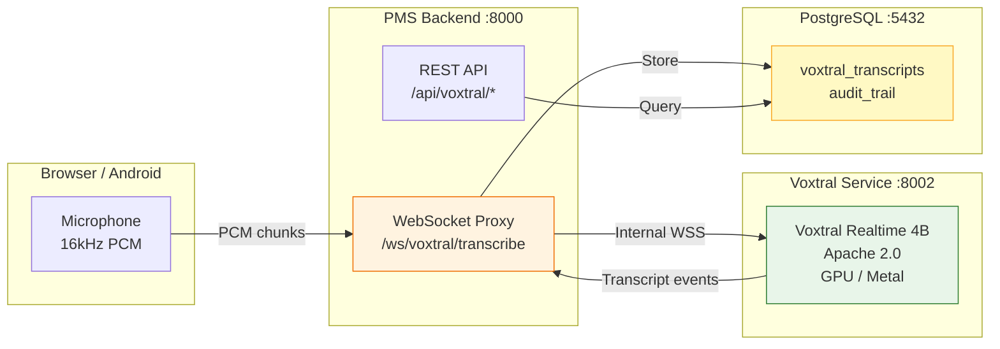

# Voxtral Transcribe 2 Setup Guide for PMS Integration

**Document ID:** PMS-EXP-VOXTRALTRANSCRIBE2-001
**Version:** 1.0
**Date:** February 23, 2026
**Applies To:** PMS project (all platforms)
**Prerequisites Level:** Intermediate

---

## Table of Contents

1. [Overview](#1-overview)
2. [Prerequisites](#2-prerequisites)
3. [Part A: Install and Configure Voxtral Realtime (Self-Hosted)](#3-part-a-install-and-configure-voxtral-realtime-self-hosted)
4. [Part B: Integrate with PMS Backend](#4-part-b-integrate-with-pms-backend)
5. [Part C: Integrate with PMS Frontend](#5-part-c-integrate-with-pms-frontend)
6. [Part D: Testing and Verification](#6-part-d-testing-and-verification)
7. [Troubleshooting](#7-troubleshooting)
8. [Reference Commands](#8-reference-commands)

---

## 1. Overview

This guide walks you through deploying Voxtral Transcribe 2 as a self-hosted real-time speech-to-text service and integrating it with the PMS backend (FastAPI) and frontend (Next.js). By the end, you will have:

- A self-hosted Voxtral Realtime 4B model running in a Docker container with GPU acceleration
- A PMS backend WebSocket proxy forwarding audio to the Voxtral service
- A Next.js frontend component capturing microphone audio and displaying real-time transcripts
- Context biasing configured with medical vocabulary
- HIPAA-compliant audit logging for all transcription sessions
- Fallback configuration to Mistral's batch API for speaker diarization

### Architecture at a Glance



---

## 2. Prerequisites

### 2.1 Required Software

| Software | Minimum Version | Check Command |
| --- | --- | --- |
| Docker | 24.0+ | `docker --version` |
| Docker Compose | 2.20+ | `docker compose version` |
| NVIDIA Container Toolkit | 1.14+ (if NVIDIA GPU) | `nvidia-ctk --version` |
| Python | 3.11+ | `python3 --version` |
| Node.js | 20 LTS+ | `node --version` |
| Git | 2.40+ | `git --version` |
| Hugging Face CLI | Latest | `huggingface-cli --version` |

### 2.2 Hardware Requirements

| Option | GPU | VRAM | RAM | Notes |
| --- | --- | --- | --- | --- |
| **NVIDIA GPU** | T4, RTX 3060, RTX 4060+ | 8GB+ | 16GB+ | Best throughput. Docker + NVIDIA Container Toolkit. |
| **Apple Silicon** | M2, M3, M4 | Unified 16GB+ | 16GB+ | Use voxtral.c with Metal. No Docker GPU needed. |
| **CPU only** | None | N/A | 32GB+ | Possible via voxtral.c with OpenBLAS. Slower (~0.5x real-time). |

### 2.3 Installation of Prerequisites

**Hugging Face CLI (for model download):**

```bash
pip install -U huggingface-hub
huggingface-cli login  # Enter your HF token
```

**NVIDIA Container Toolkit (Linux, if using NVIDIA GPU):**

```bash
distribution=$(. /etc/os-release;echo $ID$VERSION_ID)
curl -fsSL https://nvidia.github.io/libnvidia-container/gpgkey | sudo gpg --dearmor -o /usr/share/keyrings/nvidia-container-toolkit-keyring.gpg
curl -s -L https://nvidia.github.io/libnvidia-container/$distribution/libnvidia-container.list | \
  sed 's#deb https://#deb [signed-by=/usr/share/keyrings/nvidia-container-toolkit-keyring.gpg] https://#g' | \
  sudo tee /etc/apt/sources.list.d/nvidia-container-toolkit.list
sudo apt-get update && sudo apt-get install -y nvidia-container-toolkit
sudo nvidia-ctk runtime configure --runtime=docker
sudo systemctl restart docker
```

### 2.4 Verify PMS Services

Confirm all PMS services are running before proceeding:

```bash
# PMS Backend
curl -s http://localhost:8000/health | jq .
# Expected: {"status": "healthy"}

# PMS Frontend
curl -s -o /dev/null -w "%{http_code}" http://localhost:3000
# Expected: 200

# PostgreSQL
docker exec pms-db pg_isready -U pms
# Expected: accepting connections
```

---

## 3. Part A: Install and Configure Voxtral Realtime (Self-Hosted)

### Step 1: Download Model Weights

```bash
# Create model directory
mkdir -p models/voxtral-realtime-4b

# Download from Hugging Face (Apache 2.0 license)
huggingface-cli download mistralai/Voxtral-Mini-4B-Realtime-2602 \
  --local-dir models/voxtral-realtime-4b \
  --local-dir-use-symlinks False
```

This downloads approximately 8GB of BF16 weights.

### Step 2: Create Voxtral Inference Service

Create `services/voxtral/Dockerfile`:

```dockerfile
FROM python:3.11-slim

WORKDIR /app

RUN pip install --no-cache-dir \
    torch==2.5.0 \
    transformers==4.48.0 \
    accelerate==1.2.0 \
    soundfile==0.12.1 \
    websockets==13.1 \
    fastapi==0.115.0 \
    uvicorn[standard]==0.32.0

COPY server.py .
COPY context_bias.py .

EXPOSE 8002

CMD ["uvicorn", "server:app", "--host", "0.0.0.0", "--port", "8002"]
```

### Step 3: Create Inference Server

Create `services/voxtral/server.py`:

```python
"""Voxtral Realtime 4B - Streaming inference server for PMS integration."""

import asyncio
import json
import logging
import os
import time
from pathlib import Path

import soundfile as sf
import torch
from fastapi import FastAPI, WebSocket, WebSocketDisconnect
from transformers import AutoModelForSpeechSeq2Seq, AutoProcessor

from context_bias import load_bias_phrases

logger = logging.getLogger("voxtral")
logging.basicConfig(level=logging.INFO)

MODEL_PATH = os.getenv("VOXTRAL_MODEL_PATH", "/models/voxtral-realtime-4b")
DEVICE = "cuda" if torch.cuda.is_available() else "cpu"
DTYPE = torch.bfloat16 if DEVICE == "cuda" else torch.float32

app = FastAPI(title="Voxtral Realtime PMS Service")

# Global model references (loaded once at startup)
model = None
processor = None


@app.on_event("startup")
async def load_model():
    global model, processor
    logger.info(f"Loading Voxtral Realtime 4B from {MODEL_PATH} on {DEVICE}")
    processor = AutoProcessor.from_pretrained(MODEL_PATH)
    model = AutoModelForSpeechSeq2Seq.from_pretrained(
        MODEL_PATH,
        torch_dtype=DTYPE,
        device_map="auto" if DEVICE == "cuda" else None,
    )
    if DEVICE == "cpu":
        model = model.to(DEVICE)
    logger.info("Voxtral Realtime 4B loaded successfully")


@app.get("/health")
async def health():
    return {
        "status": "healthy" if model is not None else "loading",
        "model": "voxtral-realtime-4b",
        "device": DEVICE,
        "dtype": str(DTYPE),
    }


@app.websocket("/ws/transcribe")
async def websocket_transcribe(websocket: WebSocket):
    """Stream audio chunks and receive transcript events."""
    await websocket.accept()
    session_id = f"vox-{int(time.time() * 1000)}"
    logger.info(f"[{session_id}] Transcription session started")

    audio_buffer = bytearray()
    bias_phrases = load_bias_phrases()

    try:
        while True:
            data = await websocket.receive_bytes()
            audio_buffer.extend(data)

            # Process in chunks (configurable window)
            if len(audio_buffer) >= 32000:  # 1 second at 16kHz 16-bit
                audio_array = torch.frombuffer(
                    bytes(audio_buffer), dtype=torch.int16
                ).float() / 32768.0

                inputs = processor(
                    audio_array,
                    sampling_rate=16000,
                    return_tensors="pt",
                ).to(DEVICE, dtype=DTYPE)

                with torch.no_grad():
                    predicted_ids = model.generate(
                        **inputs,
                        max_new_tokens=256,
                    )

                transcript = processor.batch_decode(
                    predicted_ids, skip_special_tokens=True
                )[0]

                await websocket.send_json({
                    "type": "transcript",
                    "session_id": session_id,
                    "text": transcript,
                    "timestamp": time.time(),
                    "is_final": True,
                })

                audio_buffer.clear()

    except WebSocketDisconnect:
        logger.info(f"[{session_id}] Session ended")
    except Exception as e:
        logger.error(f"[{session_id}] Error: {e}")
        await websocket.close(code=1011, reason=str(e))


@app.post("/transcribe")
async def batch_transcribe():
    """Batch transcription endpoint (for non-streaming use)."""
    return {"error": "Use WebSocket endpoint /ws/transcribe for streaming"}
```

### Step 4: Create Context Bias Module

Create `services/voxtral/context_bias.py`:

```python
"""Medical context biasing for Voxtral transcription sessions."""

import json
import os
from pathlib import Path

BIAS_FILE = os.getenv("VOXTRAL_BIAS_FILE", "/config/medical_bias_phrases.json")

# Default medical bias phrases (loaded if no custom file exists)
DEFAULT_PHRASES = [
    # Common medications
    "Lisinopril", "Metformin", "Amlodipine", "Atorvastatin", "Omeprazole",
    "Levothyroxine", "Gabapentin", "Losartan", "Hydrochlorothiazide",
    "Empagliflozin", "Semaglutide", "Tirzepatide", "Ozempic", "Mounjaro",
    # Clinical terms
    "SOAP note", "chief complaint", "assessment and plan",
    "differential diagnosis", "history of present illness",
    "review of systems", "vital signs",
    # Procedures and codes
    "CPT 99213", "CPT 99214", "CPT 99215", "ICD-10",
    # Anatomical
    "ileum", "ilium", "peroneal", "perineal", "hyper", "hypo",
]


def load_bias_phrases() -> list[str]:
    """Load context bias phrases from file or return defaults."""
    bias_path = Path(BIAS_FILE)
    if bias_path.exists():
        with open(bias_path) as f:
            data = json.load(f)
            return data.get("phrases", DEFAULT_PHRASES)[:100]  # Max 100
    return DEFAULT_PHRASES[:100]
```

### Step 5: Add to Docker Compose

Add the following service to your `docker-compose.yml`:

```yaml
  voxtral-realtime:
    build:
      context: ./services/voxtral
      dockerfile: Dockerfile
    container_name: pms-voxtral-realtime
    ports:
      - "8002:8002"
    volumes:
      - ./models/voxtral-realtime-4b:/models/voxtral-realtime-4b:ro
      - ./config/voxtral:/config:ro
    environment:
      - VOXTRAL_MODEL_PATH=/models/voxtral-realtime-4b
      - VOXTRAL_BIAS_FILE=/config/medical_bias_phrases.json
    deploy:
      resources:
        reservations:
          devices:
            - driver: nvidia
              count: 1
              capabilities: [gpu]
    networks:
      - pms-internal
    restart: unless-stopped
    healthcheck:
      test: ["CMD", "curl", "-f", "http://localhost:8002/health"]
      interval: 30s
      timeout: 10s
      retries: 3
```

### Step 6: Create Medical Bias Configuration

```bash
mkdir -p config/voxtral
```

Create `config/voxtral/medical_bias_phrases.json`:

```json
{
  "version": "1.0",
  "description": "PMS clinic-specific medical vocabulary for Voxtral context biasing",
  "phrases": [
    "Lisinopril", "Metformin", "Amlodipine", "Atorvastatin", "Omeprazole",
    "Levothyroxine", "Gabapentin", "Losartan", "Hydrochlorothiazide",
    "Empagliflozin", "Semaglutide", "Tirzepatide", "Ozempic", "Mounjaro",
    "Jardiance", "Farxiga", "Entresto", "Eliquis", "Xarelto", "Plavix",
    "SOAP note", "chief complaint", "history of present illness",
    "review of systems", "assessment and plan", "differential diagnosis",
    "CPT 99213", "CPT 99214", "CPT 99215", "ICD-10",
    "hemoglobin A1c", "eGFR", "creatinine", "lipid panel", "TSH",
    "systolic", "diastolic", "tachycardia", "bradycardia",
    "bilateral", "unilateral", "proximal", "distal",
    "ileum", "ilium", "peroneal", "perineal"
  ]
}
```

### Step 7: Build and Start

```bash
docker compose build voxtral-realtime
docker compose up -d voxtral-realtime
```

Wait for model loading (first start takes 30-60 seconds):

```bash
docker logs -f pms-voxtral-realtime
# Wait for: "Voxtral Realtime 4B loaded successfully"
```

**Checkpoint:** Voxtral Realtime container is running on port 8002 with GPU acceleration and medical context biasing configured. Verify:

```bash
curl -s http://localhost:8002/health | jq .
# Expected: {"status": "healthy", "model": "voxtral-realtime-4b", "device": "cuda", ...}
```

---

## 4. Part B: Integrate with PMS Backend

### Step 1: Add Voxtral Configuration

Add to `pms-backend/.env`:

```env
# Voxtral Transcribe 2
VOXTRAL_REALTIME_URL=ws://pms-voxtral-realtime:8002/ws/transcribe
VOXTRAL_HEALTH_URL=http://pms-voxtral-realtime:8002/health
MISTRAL_API_KEY=your-mistral-api-key-here
MISTRAL_BATCH_URL=https://api.mistral.ai/v1/audio/transcriptions
```

### Step 2: Create Database Migration

Create a new Alembic migration for Voxtral transcript storage:

```python
"""Add voxtral_transcripts and voxtral_audit tables.

Revision ID: voxtral_001
"""

from alembic import op
import sqlalchemy as sa
from sqlalchemy.dialects.postgresql import UUID, JSONB


def upgrade():
    op.create_table(
        "voxtral_transcripts",
        sa.Column("id", UUID(as_uuid=True), primary_key=True,
                  server_default=sa.text("gen_random_uuid()")),
        sa.Column("encounter_id", UUID(as_uuid=True),
                  sa.ForeignKey("encounters.id"), nullable=False, index=True),
        sa.Column("user_id", UUID(as_uuid=True),
                  sa.ForeignKey("users.id"), nullable=False),
        sa.Column("transcript_text", sa.Text(), nullable=False),
        sa.Column("language", sa.String(10), nullable=False,
                  server_default="en"),
        sa.Column("word_count", sa.Integer()),
        sa.Column("duration_seconds", sa.Float()),
        sa.Column("model_version", sa.String(50),
                  server_default="voxtral-realtime-4b"),
        sa.Column("source", sa.String(20),
                  server_default="self_hosted"),
        sa.Column("speaker_labels", JSONB()),
        sa.Column("bias_phrases_used", JSONB()),
        sa.Column("created_at", sa.DateTime(timezone=True),
                  server_default=sa.text("now()")),
    )

    op.create_table(
        "voxtral_audit_trail",
        sa.Column("id", UUID(as_uuid=True), primary_key=True,
                  server_default=sa.text("gen_random_uuid()")),
        sa.Column("session_id", sa.String(50), nullable=False, index=True),
        sa.Column("user_id", UUID(as_uuid=True), nullable=False),
        sa.Column("patient_id", UUID(as_uuid=True)),
        sa.Column("encounter_id", UUID(as_uuid=True)),
        sa.Column("action", sa.String(50), nullable=False),
        sa.Column("details", JSONB()),
        sa.Column("created_at", sa.DateTime(timezone=True),
                  server_default=sa.text("now()")),
    )


def downgrade():
    op.drop_table("voxtral_audit_trail")
    op.drop_table("voxtral_transcripts")
```

### Step 3: Create WebSocket Proxy Endpoint

Add to `pms-backend/app/routers/voxtral.py`:

```python
"""Voxtral Transcribe 2 WebSocket proxy and REST endpoints."""

import asyncio
import json
import logging
import os
import time
from uuid import UUID

import httpx
import websockets
from fastapi import APIRouter, HTTPException, WebSocket, WebSocketDisconnect

logger = logging.getLogger("voxtral_proxy")

router = APIRouter(prefix="/voxtral", tags=["voxtral"])

VOXTRAL_REALTIME_URL = os.getenv(
    "VOXTRAL_REALTIME_URL", "ws://pms-voxtral-realtime:8002/ws/transcribe"
)
VOXTRAL_HEALTH_URL = os.getenv(
    "VOXTRAL_HEALTH_URL", "http://pms-voxtral-realtime:8002/health"
)


@router.websocket("/ws/transcribe")
async def proxy_transcription(
    websocket: WebSocket,
    encounter_id: UUID | None = None,
    language: str = "en",
):
    """Proxy audio from client to Voxtral Realtime and stream back."""
    await websocket.accept()
    session_id = f"proxy-{int(time.time() * 1000)}"

    logger.info(
        f"[{session_id}] Starting transcription proxy "
        f"(encounter={encounter_id}, lang={language})"
    )

    try:
        async with websockets.connect(VOXTRAL_REALTIME_URL) as voxtral_ws:
            async def forward_audio():
                """Client -> Voxtral"""
                try:
                    while True:
                        data = await websocket.receive_bytes()
                        await voxtral_ws.send(data)
                except WebSocketDisconnect:
                    await voxtral_ws.close()

            async def forward_transcripts():
                """Voxtral -> Client"""
                try:
                    async for message in voxtral_ws:
                        transcript_event = json.loads(message)
                        await websocket.send_json(transcript_event)
                except websockets.ConnectionClosed:
                    pass

            await asyncio.gather(forward_audio(), forward_transcripts())

    except Exception as e:
        logger.error(f"[{session_id}] Proxy error: {e}")
        await websocket.close(code=1011, reason=str(e))


@router.get("/health")
async def voxtral_health():
    """Check Voxtral Realtime service health."""
    try:
        async with httpx.AsyncClient(timeout=5.0) as client:
            resp = await client.get(VOXTRAL_HEALTH_URL)
            return resp.json()
    except Exception as e:
        raise HTTPException(
            status_code=503, detail=f"Voxtral unavailable: {e}"
        )


@router.get("/context-bias")
async def get_context_bias():
    """Return current medical context bias phrases."""
    from services.voxtral.context_bias import load_bias_phrases
    return {"phrases": load_bias_phrases()}
```

### Step 4: Register Router

Add to `pms-backend/app/main.py`:

```python
from app.routers.voxtral import router as voxtral_router

app.include_router(voxtral_router, prefix="/api")
```

**Checkpoint:** PMS backend has a WebSocket proxy at `/api/voxtral/ws/transcribe` that forwards audio to the self-hosted Voxtral container and streams transcripts back. Health check at `/api/voxtral/health`. Verify:

```bash
curl -s http://localhost:8000/api/voxtral/health | jq .
# Expected: {"status": "healthy", "model": "voxtral-realtime-4b", ...}
```

---

## 5. Part C: Integrate with PMS Frontend

### Step 1: Add Environment Variable

Add to `pms-frontend/.env.local`:

```env
NEXT_PUBLIC_VOXTRAL_WS_URL=ws://localhost:8000/api/voxtral/ws/transcribe
```

### Step 2: Create Voxtral Transcription Hook

Create `pms-frontend/src/hooks/useVoxtralTranscription.ts`:

```typescript
"use client";

import { useCallback, useRef, useState } from "react";

interface TranscriptEvent {
  type: "transcript";
  session_id: string;
  text: string;
  timestamp: number;
  is_final: boolean;
}

interface UseVoxtralTranscriptionReturn {
  isRecording: boolean;
  transcript: string;
  partialTranscript: string;
  error: string | null;
  startRecording: (encounterId?: string, language?: string) => Promise<void>;
  stopRecording: () => void;
}

export function useVoxtralTranscription(): UseVoxtralTranscriptionReturn {
  const [isRecording, setIsRecording] = useState(false);
  const [transcript, setTranscript] = useState("");
  const [partialTranscript, setPartialTranscript] = useState("");
  const [error, setError] = useState<string | null>(null);

  const wsRef = useRef<WebSocket | null>(null);
  const mediaStreamRef = useRef<MediaStream | null>(null);
  const processorRef = useRef<ScriptProcessorNode | null>(null);

  const startRecording = useCallback(
    async (encounterId?: string, language = "en") => {
      try {
        setError(null);
        setTranscript("");
        setPartialTranscript("");

        // Get microphone access
        const stream = await navigator.mediaDevices.getUserMedia({
          audio: {
            sampleRate: 16000,
            channelCount: 1,
            echoCancellation: true,
            noiseSuppression: true,
          },
        });
        mediaStreamRef.current = stream;

        // Connect WebSocket
        const wsUrl = new URL(
          process.env.NEXT_PUBLIC_VOXTRAL_WS_URL ||
            "ws://localhost:8000/api/voxtral/ws/transcribe"
        );
        if (encounterId) wsUrl.searchParams.set("encounter_id", encounterId);
        wsUrl.searchParams.set("language", language);

        const ws = new WebSocket(wsUrl.toString());
        wsRef.current = ws;

        ws.onmessage = (msgEvent) => {
          const data: TranscriptEvent = JSON.parse(msgEvent.data);
          if (data.is_final) {
            setTranscript((prev) => prev + " " + data.text);
            setPartialTranscript("");
          } else {
            setPartialTranscript(data.text);
          }
        };

        ws.onerror = () => setError("WebSocket connection failed");
        ws.onclose = () => setIsRecording(false);

        // Set up audio processing
        const audioCtx = new AudioContext({ sampleRate: 16000 });
        const source = audioCtx.createMediaStreamSource(stream);
        const processor = audioCtx.createScriptProcessor(4096, 1, 1);
        processorRef.current = processor;

        processor.onaudioprocess = (e) => {
          if (ws.readyState === WebSocket.OPEN) {
            const float32 = e.inputBuffer.getChannelData(0);
            const int16 = new Int16Array(float32.length);
            for (let i = 0; i < float32.length; i++) {
              const sample = float32[i];
              int16[i] = Math.max(
                -32768,
                Math.min(32767, Math.round(sample * 32768))
              );
            }
            ws.send(int16.buffer);
          }
        };

        source.connect(processor);
        processor.connect(audioCtx.destination);

        setIsRecording(true);
      } catch (err) {
        const message =
          err instanceof Error ? err.message : "Failed to start recording";
        setError(message);
      }
    },
    []
  );

  const stopRecording = useCallback(() => {
    mediaStreamRef.current?.getTracks().forEach((track) => track.stop());
    processorRef.current?.disconnect();
    wsRef.current?.close();
    setIsRecording(false);
  }, []);

  return {
    isRecording,
    transcript,
    partialTranscript,
    error,
    startRecording,
    stopRecording,
  };
}
```

### Step 3: Create Transcription UI Component

Create `pms-frontend/src/components/voxtral/VoxtralDictation.tsx`:

```tsx
"use client";

import { useVoxtralTranscription } from "@/hooks/useVoxtralTranscription";

interface VoxtralDictationProps {
  encounterId?: string;
  language?: string;
  onTranscriptChange?: (text: string) => void;
}

export function VoxtralDictation({
  encounterId,
  language = "en",
  onTranscriptChange,
}: VoxtralDictationProps) {
  const {
    isRecording,
    transcript,
    partialTranscript,
    error,
    startRecording,
    stopRecording,
  } = useVoxtralTranscription();

  const handleToggle = () => {
    if (isRecording) {
      stopRecording();
      onTranscriptChange?.(transcript);
    } else {
      startRecording(encounterId, language);
    }
  };

  return (
    <div className="rounded-lg border border-gray-200 p-4">
      <div className="mb-3 flex items-center justify-between">
        <div className="flex items-center gap-2">
          <span className="text-sm font-medium text-gray-700">
            Voice Dictation
          </span>
          <span className="rounded bg-green-100 px-2 py-0.5 text-xs text-green-800">
            Voxtral &middot; On-Premise
          </span>
        </div>

        <button
          onClick={handleToggle}
          className={`rounded-full px-4 py-2 text-sm font-medium ${
            isRecording
              ? "bg-red-600 text-white hover:bg-red-700"
              : "bg-blue-600 text-white hover:bg-blue-700"
          }`}
        >
          {isRecording ? "Stop" : "Start Dictation"}
        </button>
      </div>

      {error && (
        <div className="mb-3 rounded bg-red-50 p-2 text-sm text-red-700">
          {error}
        </div>
      )}

      <div className="min-h-[100px] rounded bg-gray-50 p-3 text-sm">
        {transcript && <span>{transcript}</span>}
        {partialTranscript && (
          <span className="text-gray-400"> {partialTranscript}</span>
        )}
        {!transcript && !partialTranscript && !isRecording && (
          <span className="text-gray-400">
            Click &quot;Start Dictation&quot; and begin speaking...
          </span>
        )}
        {isRecording && !transcript && !partialTranscript && (
          <span className="text-gray-400">Listening...</span>
        )}
      </div>
    </div>
  );
}
```

**Checkpoint:** PMS frontend has a `VoxtralDictation` component that captures microphone audio, streams it to the PMS backend WebSocket proxy, and displays real-time transcripts. The component shows an "On-Premise" badge to indicate self-hosted processing.

---

## 6. Part D: Testing and Verification

### Step 1: Verify Voxtral Service Health

```bash
# Direct service check
curl -s http://localhost:8002/health | jq .

# Through PMS backend proxy
curl -s http://localhost:8000/api/voxtral/health | jq .
```

Expected output:
```json
{
  "status": "healthy",
  "model": "voxtral-realtime-4b",
  "device": "cuda",
  "dtype": "torch.bfloat16"
}
```

### Step 2: WebSocket Transcription Test

Use `websocat` to test the WebSocket endpoint:

```bash
# Install websocat
brew install websocat  # macOS
# or: cargo install websocat

# Send a test audio file (16kHz PCM)
ffmpeg -i test_audio.mp3 -ar 16000 -ac 1 -f s16le - | \
  websocat ws://localhost:8002/ws/transcribe --binary
```

### Step 3: End-to-End Browser Test

1. Open the PMS frontend at `http://localhost:3000`
2. Navigate to an encounter record
3. Click "Start Dictation"
4. Allow microphone access when prompted
5. Speak: "Patient presents with a chief complaint of persistent cough for two weeks. Currently taking Lisinopril 10 milligrams daily."
6. Verify transcript appears in real time
7. Verify "Lisinopril" is correctly spelled (context biasing)

### Step 4: Audit Log Verification

```bash
docker exec pms-db psql -U pms -d pms -c \
  "SELECT session_id, action, created_at FROM voxtral_audit_trail ORDER BY created_at DESC LIMIT 5;"
```

---

## 7. Troubleshooting

### Model fails to load — CUDA out of memory

**Symptoms:** Container crashes with `torch.cuda.OutOfMemoryError`. Log shows `CUDA out of memory`.

**Solution:** Voxtral Realtime 4B requires ~8GB VRAM in BF16. If your GPU has less:
```bash
# Option 1: Use CPU (slower but works)
# Set in docker-compose.yml environment:
# VOXTRAL_DEVICE=cpu

# Option 2: Use voxtral.c with Metal (Apple Silicon)
git clone https://github.com/antirez/voxtral.c
cd voxtral.c && make
./voxtral --from-mic
```

### WebSocket connection refused

**Symptoms:** Frontend shows "WebSocket connection failed". Browser console shows connection refused on the voxtral WebSocket URL.

**Solution:** Ensure the PMS backend can reach the Voxtral container:
```bash
# Check container networking
docker exec pms-backend curl -s http://pms-voxtral-realtime:8002/health

# If using host networking, use localhost:8002 instead
```

### High transcription latency (>2 seconds)

**Symptoms:** Transcript appears with noticeable delay. User reports lag between speaking and seeing text.

**Solution:**
```bash
# Check GPU utilization
nvidia-smi

# If GPU at 100%, reduce concurrent sessions or increase chunk size
# In server.py, adjust the audio_buffer threshold for smaller/larger chunks
```

### Medical terms misspelled despite context biasing

**Symptoms:** "Lisinopril" transcribed as "listen a pill" despite being in bias list.

**Solution:**
```bash
# Verify bias phrases are loaded
curl -s http://localhost:8000/api/voxtral/context-bias | jq .

# Check bias file is mounted correctly
docker exec pms-voxtral-realtime cat /config/medical_bias_phrases.json
```

### Port 8002 already in use

**Symptoms:** Container fails to start. Log shows `Address already in use`.

**Solution:**
```bash
# Find what's using port 8002
lsof -i :8002

# Kill the process or change the port in docker-compose.yml
```

---

## 8. Reference Commands

### Daily Development Workflow

```bash
# Start Voxtral service
docker compose up -d voxtral-realtime

# View logs
docker logs -f pms-voxtral-realtime

# Restart after config change
docker compose restart voxtral-realtime

# Stop service
docker compose stop voxtral-realtime
```

### Management Commands

```bash
# Check model version
curl -s http://localhost:8002/health | jq .model

# View context bias phrases
curl -s http://localhost:8000/api/voxtral/context-bias | jq .phrases

# Check GPU memory usage
nvidia-smi --query-gpu=memory.used,memory.total --format=csv

# View transcription audit trail
docker exec pms-db psql -U pms -d pms -c \
  "SELECT COUNT(*), DATE(created_at) FROM voxtral_audit_trail GROUP BY DATE(created_at) ORDER BY 2 DESC;"
```

### Useful URLs

| URL | Description |
| --- | --- |
| `http://localhost:8002/health` | Voxtral Realtime health check |
| `http://localhost:8000/api/voxtral/health` | PMS proxy health check |
| `ws://localhost:8000/api/voxtral/ws/transcribe` | WebSocket transcription endpoint |
| `http://localhost:8000/api/voxtral/context-bias` | Context bias phrase list |

---

## Next Steps

- Complete the [Voxtral Transcribe 2 Developer Tutorial](21-VoxtralTranscribe2-Developer-Tutorial.md) to build your first clinical dictation integration
- Configure batch diarization via Mistral API for multi-party encounters
- Compare transcription accuracy against [MedASR (Experiment 07)](07-PRD-MedASR-PMS-Integration.md) and [Speechmatics Medical (Experiment 10)](10-PRD-SpeechmaticsMedical-PMS-Integration.md)

## Resources

- [Voxtral Transcribe 2 — Mistral Official](https://mistral.ai/news/voxtral-transcribe-2)
- [Mistral Audio Transcription Docs](https://docs.mistral.ai/capabilities/audio_transcription)
- [Voxtral Realtime Model — Hugging Face](https://huggingface.co/mistralai/Voxtral-Mini-4B-Realtime-2602)
- [voxtral.c — Pure C Inference (antirez)](https://github.com/antirez/voxtral.c)
- [PRD: Voxtral Transcribe 2 PMS Integration](21-PRD-VoxtralTranscribe2-PMS-Integration.md)
