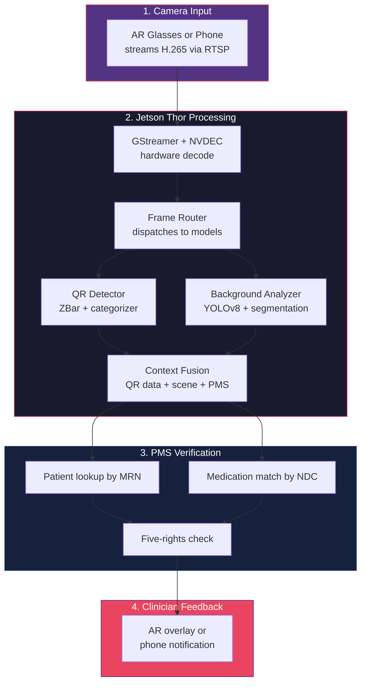
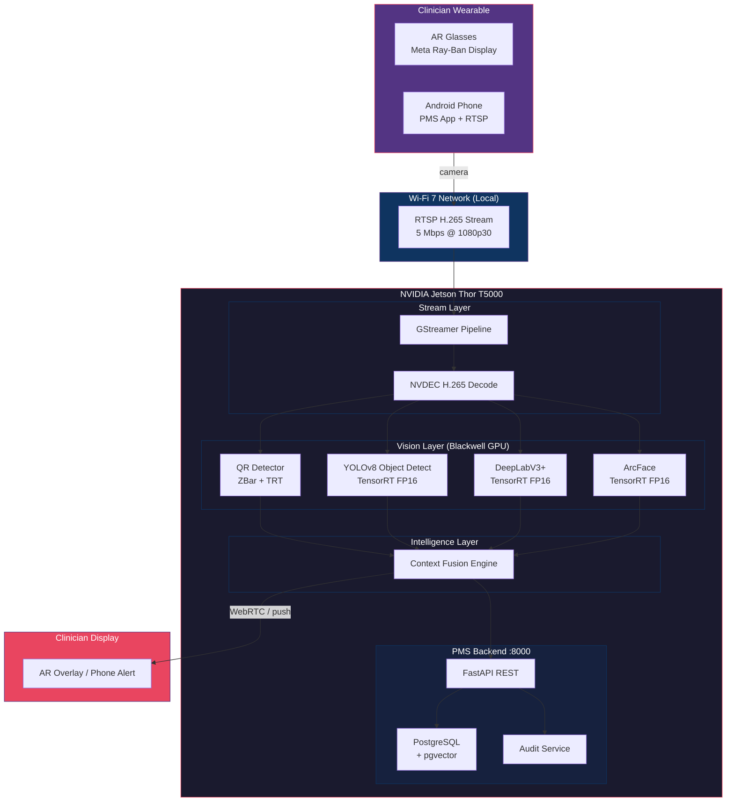

# Edge Vision Stream Developer Onboarding Tutorial

**Welcome to the MPS PMS Edge Vision Stream Integration Team**

This tutorial takes you from zero to building your first real-time camera-to-Jetson vision pipeline for the PMS. By the end, you will have streamed live video from an Android phone to Jetson Thor, detected and decoded a healthcare QR code, analyzed the clinical background context, and verified the scan against PMS patient data.

**Document ID:** PMS-EXP-EDGEVISION-002
**Version:** 1.0
**Date:** 2026-02-25
**Applies To:** PMS project (Jetson Thor + Android)
**Prerequisite:** [Edge Vision Stream Setup Guide](25-EdgeVisionStream-PMS-Developer-Setup-Guide.md)
**Estimated time:** 2-3 hours
**Difficulty:** Beginner-friendly (advanced hardware assumed to be set up)

---

## What You Will Learn

1. Why continuous camera streaming matters for clinical point-of-care workflows
2. How RTSP video streaming works between Android devices and Jetson Thor
3. How GStreamer + NVDEC provides hardware-accelerated video decode on Jetson
4. How to detect and decode healthcare QR codes (patient wristbands, medication barcodes) from live video
5. How background context analysis identifies clinical environments and objects
6. How the Context Fusion Engine combines vision outputs with PMS patient/medication data
7. How to push verification results back to AR glasses or Android phone displays
8. How to evaluate the system's strengths, weaknesses, and HIPAA compliance posture
9. How Edge Vision Stream relates to existing PMS experiments (DermaCheck, MedASR, OpenClaw)
10. How to extend the pipeline with custom vision models for new clinical use cases

---

## Part 1: Understanding Edge Vision Stream (15 min read)

### 1.1 What Problem Does Edge Vision Stream Solve?

In a typical medication administration round, a nurse must:

1. Walk to the patient's bedside
2. Pick up a handheld barcode scanner
3. Scan the patient's wristband QR code
4. Switch to the workstation or tablet to verify the patient
5. Pick up the medication
6. Scan the medication barcode
7. Verify the five rights on screen (right patient, drug, dose, time, route)
8. Administer the medication
9. Document the administration

**Steps 2-7 require repeated device switching** — scanner to screen to scanner to screen. Studies show this friction causes BCMA compliance to drop to near-abandonment on busy wards. Nurses skip scans, verify visually, or batch-scan after the fact — all of which introduce medication error risk.

**Edge Vision Stream eliminates this friction** by:
- Replacing the handheld scanner with continuous AR glasses / phone camera streaming
- Moving all verification to the Jetson Thor edge computer (no workstation needed)
- Pushing results directly to the clinician's field of view (AR overlay or phone notification)
- Adding **context intelligence** that scanners cannot provide: Is the wristband on the patient? Is this the right room? Is the medication at bedside?

### 1.2 How It Works — The Key Pieces



**Four key stages:**

1. **Camera Input**: AR glasses or Android phone streams live H.265 video over RTSP on the local Wi-Fi 7 network to Jetson Thor.
2. **GPU Processing**: GStreamer ingests the stream, NVDEC hardware-decodes it, and a frame router dispatches frames to QR detection (every 3rd frame) and background analysis (every 15th frame).
3. **PMS Verification**: The Context Fusion Engine takes QR-decoded data (MRN, NDC) and background analysis (room type, QR-on-body) and verifies against PMS patient records and medication data.
4. **Clinician Feedback**: Results push back to the clinician as AR overlays (green checkmark = verified, red alert = mismatch) or phone notifications.

### 1.3 How Edge Vision Stream Fits with Other PMS Technologies

| Technology | Relationship | How They Connect |
|---|---|---|
| **Jetson Thor (ADR-0007)** | Foundation | Same hardware, GPU, Docker stack. Vision Stream adds continuous streaming to existing single-image vision. |
| **DermaCheck (Exp. 18)** | Parallel vision pipeline | Both use TensorRT on Jetson GPU. DermaCheck = dermatology images. Vision Stream = live camera for QR/context. |
| **MedASR / Voxtral (Exp. 07, 21)** | Complementary input | MedASR captures audio (what the clinician says). Vision Stream captures video (what the clinician sees). Together = multimodal encounter capture. |
| **OpenClaw (Exp. 05)** | Workflow orchestration | Vision Stream detects events (QR scan, alert). OpenClaw can trigger downstream workflows (medication reconciliation, care coordination). |
| **FHIR (Exp. 16)** | Data interop | Medication verification can use FHIR MedicationRequest resources from external systems. |
| **Sanford Guide (Exp. 11)** | Drug safety | When a medication barcode is scanned, Sanford Guide provides antimicrobial interaction checking. |

### 1.4 Key Vocabulary

| Term | Meaning |
|---|---|
| **RTSP** | Real-Time Streaming Protocol — standard for streaming video from cameras to servers |
| **H.265 / HEVC** | High-efficiency video codec — halves bitrate vs H.264 at same quality |
| **NVDEC** | NVIDIA hardware video decoder on Jetson GPU — decodes H.265 at zero CPU cost |
| **GStreamer** | Open-source multimedia framework for building video processing pipelines |
| **DeepStream** | NVIDIA's GStreamer-based SDK for AI video analytics on Jetson |
| **ZBar** | Open-source library for reading QR codes and barcodes |
| **NDC** | National Drug Code — 10-digit identifier for medications in the US |
| **GS1 Data Matrix** | 2D barcode standard for pharmaceuticals encoding GTIN, expiry, lot, serial |
| **BCMA** | Barcode Medication Administration — safety process for verifying medications at point of care |
| **Five Rights** | Right patient, right drug, right dose, right time, right route |
| **Context Fusion** | Combining multiple vision outputs (QR data + objects + scene) with PMS data for composite verification |
| **WebRTC** | Web Real-Time Communication — bidirectional low-latency streaming for AR overlay return |

### 1.5 Our Architecture



---

## Part 2: Environment Verification (15 min)

### 2.1 Checklist

1. **Jetson Thor accessible**
   ```bash
   ssh pms@192.168.1.100 "nvidia-smi"
   # Expected: GPU info displayed
   ```

2. **PMS services running**
   ```bash
   ssh pms@192.168.1.100 "docker compose ps"
   # Expected: backend, frontend, postgres all Up
   ```

3. **Vision stream service running** (from Setup Guide)
   ```bash
   ssh pms@192.168.1.100 "docker compose ps vision-stream"
   # Expected: Up
   ```

4. **Android phone on same network**
   ```bash
   # On Android (via adb shell or terminal)
   ping 192.168.1.100
   # Expected: Jetson Thor responds
   ```

5. **QR detection module installed**
   ```bash
   ssh pms@192.168.1.100 "python3 -c 'from pyzbar import pyzbar; print(\"ZBar OK\")'"
   # Expected: ZBar OK
   ```

### 2.2 Quick Test

Stream a test video and verify detection:

```bash
# On Jetson Thor - generate test stream with a QR code overlay
# (In production, this comes from the Android phone)
gst-launch-1.0 videotestsrc ! \
    video/x-raw,width=1920,height=1080 ! \
    autovideosink
```

If you see the test pattern, GStreamer is working. The full test with QR detection requires the Android RTSP stream (Part 3).

---

## Part 3: Build Your First Integration (45 min)

### 3.1 What We Are Building

A **patient wristband verification flow**: point your Android phone camera at a printed QR code representing a patient wristband, and the Jetson Thor will:

1. Decode the QR code and extract the MRN
2. Look up the patient in the PMS database
3. Analyze the background to determine if the QR is on a person's body
4. Return a verification result with patient name and room context

### 3.2 Print a Test Wristband QR Code

Generate and print a test QR code:

```bash
pip3 install qrcode
python3 -c "
import qrcode
qr = qrcode.make('MRN:12345|NAME:Jane Smith|DOB:1985-03-22|ROOM:ICU-4B')
qr.save('test_wristband.png')
print('Saved test_wristband.png - print this or display on a second screen')
"
```

### 3.3 Start the Android RTSP Stream

1. Open the PMS Android app
2. Navigate to the streaming screen
3. Tap "Start Streaming"
4. Note the displayed RTSP URL (e.g., `rtsp://192.168.1.101:8554/`)

### 3.4 Connect Jetson to the Stream

On Jetson Thor, start the vision stream processor pointing to the Android's RTSP URL:

```bash
cd /opt/pms/vision-stream
python3 main.py --rtsp-url rtsp://192.168.1.101:8554/
```

### 3.5 Scan the Wristband

Point the Android phone's camera at the printed QR code. Watch the Jetson terminal for output:

```
INFO:vision-stream: QR detected: patient_wristband -> {'mrn': '12345', 'name': 'Jane Smith', 'dob': '1985-03-22', 'room': 'ICU-4B'}
INFO:vision-stream: Scene: patient_room, objects: 3 (hospital_bed, patient_monitor, patient_or_staff)
INFO:vision-stream: Verification: VERIFIED - Patient verified: Jane Smith
```

### 3.6 Test a Medication Barcode

Generate a GS1 test barcode:

```bash
python3 -c "
import qrcode
# GS1 Data Matrix format: (01)GTIN (17)EXPIRY (10)LOT
qr = qrcode.make('(01)00312345678901(17)261231(10)BATCH42A')
qr.save('test_medication.png')
print('Saved test_medication.png')
"
```

Scan with the camera. Expected output:

```
INFO:vision-stream: QR detected: medication_gs1 -> {'gtin': '00312345678901', 'expiry': '261231', 'lot': 'BATCH42A'}
INFO:vision-stream: Verification: VERIFIED - Medication: Amoxicillin 500mg | Expiry: 261231
```

### 3.7 Observe Background Context

While scanning the wristband QR code, the background analyzer runs on every 15th frame. It reports:

- **Room type**: Based on detected objects (bed + monitor = patient_room)
- **QR on body**: Whether the QR code bounding box overlaps with a detected person
- **Objects**: All clinical objects detected with confidence scores

Try scanning the QR code while it's on a table (not on a person) — you should see:

```
INFO:vision-stream: Verification: WARNING - Wristband for Jane Smith detected but NOT on patient body
```

**Checkpoint**: You have successfully streamed video from an Android phone to Jetson Thor, detected a patient wristband QR code, decoded it, looked up the patient in PMS, and received a verification result with background context analysis.

---

## Part 4: Evaluating Strengths and Weaknesses (15 min)

### 4.1 Strengths

1. **Hands-free workflow**: Clinicians never put down what they're holding. Camera streams continuously while they work.
2. **Context intelligence**: Unlike traditional barcode scanners, the system understands the environment — is the wristband on the patient? Is this the right room?
3. **Sub-second latency**: NVDEC hardware decode + TensorRT inference delivers <500ms end-to-end, faster than picking up and aiming a handheld scanner.
4. **Zero cloud dependency**: All processing on Jetson Thor, all data on local network. No PHI leaves the facility.
5. **Multi-stream capable**: Jetson Thor's NVDEC handles 4x 1080p@30fps — multiple clinicians can stream simultaneously during medication rounds.
6. **Composable**: QR detection, background analysis, and face verification are independent modules. Add or remove capabilities without rebuilding the pipeline.

### 4.2 Weaknesses

1. **AR glasses maturity**: Current consumer AR glasses (Meta Ray-Ban, Xreal) have limited battery life (2-4 hours) and narrow FOV for overlays. Enterprise-grade AR glasses (HoloLens, Magic Leap) are expensive.
2. **QR code quality dependency**: Faded, wrinkled, or wet wristband QR codes may fail to scan from a video stream at distance. Handheld scanners can be pressed directly against the code.
3. **Wi-Fi dependency**: The system requires reliable Wi-Fi 7. In areas with dead spots or interference, the stream drops.
4. **Background model accuracy**: The YOLOv8 base model is not trained on clinical objects specifically. Fine-tuning on hospital imagery is required for production accuracy.
5. **Single point of failure**: If the Jetson Thor goes down, all vision stream processing stops for the facility.
6. **Privacy sensitivity**: Continuous camera streaming in patient rooms raises privacy concerns beyond HIPAA — patient consent for camera use must be obtained.

### 4.3 When to Use Edge Vision Stream vs Alternatives

| Scenario | Best Approach |
|---|---|
| Medication administration verification (medication rounds) | **Edge Vision Stream** — hands-free, continuous, context-aware |
| One-off barcode scan at workstation | **Handheld scanner** — simpler, no streaming needed |
| Skin lesion classification | **DermaCheck (Exp. 18)** — specialized dermatology pipeline |
| Document digitization | **Document OCR (ADR-0007)** — single image upload sufficient |
| Patient dictation / clinical notes | **MedASR / Voxtral** — audio pipeline, not video |
| Complex multi-step clinical workflow | **OpenClaw (Exp. 05)** — agentic orchestration with Vision Stream as an input |

### 4.4 HIPAA / Healthcare Considerations

| Concern | Assessment |
|---|---|
| **Video frames contain PHI** | Mitigated: frames processed in GPU memory and immediately discarded. No video storage. |
| **Patient faces in stream** | Face embeddings use existing ArcFace + AES-256-GCM encryption. No raw face images stored. |
| **Network sniffing** | RTSP streams use SRTP encryption. Wi-Fi 7 WPA3 provides network-level encryption. |
| **Audit trail** | Every QR scan, patient lookup, and verification result logged as AuditEvent with clinician ID. |
| **Patient consent** | Required: patients must consent to camera use in their room. Consent tracking via PMS. |
| **Access control** | Streaming requires authenticated PMS session. No anonymous stream access. |

---

## Part 5: Debugging Common Issues (15 min read)

### Issue 1: QR code detected intermittently

**Symptom**: QR code appears in camera view but detection is inconsistent (works sometimes, not others).

**Cause**: Motion blur from camera movement, or QR code too small in frame.

**Fix**: Hold camera steadier or mount AR glasses securely. Move closer to the QR code (fill at least 15% of frame). Increase `FRAME_SKIP` to process more frames if CPU allows. Add image sharpening to the preprocessing pipeline.

### Issue 2: Wrong barcode category assigned

**Symptom**: A medication barcode is categorized as `UNKNOWN` instead of `medication_ndc`.

**Cause**: The barcode format doesn't match the categorization rules (e.g., NDC with dashes or spaces).

**Fix**: Update the `_categorize` method in `qr_detector.py` to handle format variations. NDC codes can appear as `0312-3456-78` (with dashes) or `00312345678` (11-digit with leading zero).

### Issue 3: Background analyzer returns wrong room type

**Symptom**: A patient room is classified as `general_area`.

**Cause**: YOLOv8 base model doesn't reliably detect hospital-specific objects (IV poles, medication carts).

**Fix**: Fine-tune YOLOv8 on a clinical object dataset. Start by labeling 200-500 images of common clinical objects and retraining.

### Issue 4: Stream drops during medication round

**Symptom**: Video stream pauses or disconnects mid-workflow.

**Cause**: Wi-Fi signal strength drops as clinician moves between rooms.

**Fix**: Ensure Wi-Fi 7 AP coverage throughout the unit. Wi-Fi 7 Multi-Link Operation (MLO) helps by using multiple bands simultaneously. Add stream reconnection logic to the ingestor.

### Issue 5: High GPU memory usage

**Symptom**: `nvidia-smi` shows >90% GPU memory usage, causing intermittent failures.

**Cause**: Too many TensorRT models loaded simultaneously.

**Fix**: Use INT8 quantization for less critical models (background segmentation). Load models on-demand rather than all at startup. Total budget: ~13.5 GB of 128 GB available.

---

## Part 6: Practice Exercises (45 min)

### Exercise A: Add Medication Expiry Alert

**Goal**: When a medication barcode is scanned with a GS1 expiry date that has passed, generate a critical alert.

**Hints**:
1. In the Fusion Engine, parse the `expiry` field from GS1 data (format: `YYMMDD`)
2. Compare against today's date
3. Return `VerificationStatus.ALERT` with message "EXPIRED MEDICATION" if past expiry
4. Push a red alert overlay to the AR display

### Exercise B: Add Room-Patient Cross-Verification

**Goal**: When a patient wristband is scanned, verify that the patient's assigned room (from PMS encounter data) matches the room detected by the background analyzer.

**Hints**:
1. After patient lookup, fetch the active encounter: `GET /api/encounters?patient_id={id}&status=active`
2. Compare `encounter.room` with the room identifier from background analysis or a room QR code scan
3. If mismatch, return `WARNING` — "Patient Jane Smith is assigned to ICU-4B but scanned in ICU-6A"

### Exercise C: Multi-Stream Dashboard

**Goal**: Build a simple web dashboard that shows all active camera streams and their latest verification results.

**Hints**:
1. Add a WebSocket endpoint to the vision-stream service that broadcasts verification events
2. Create a simple HTML page that connects via WebSocket and displays:
   - Active stream count
   - Last 10 verification results (color-coded by status)
   - Alert count for the current shift

---

## Part 7: Development Workflow and Conventions

### 7.1 File Organization

```
/opt/pms/vision-stream/
├── Dockerfile              # Container definition with GStreamer + CUDA
├── docker-compose.yml      # Service definition
├── main.py                 # Entry point and orchestrator
├── ingest.py               # GStreamer RTSP ingestion pipeline
├── qr_detector.py          # QR/barcode detection and categorization
├── background_analyzer.py  # Scene context analysis
├── fusion_engine.py        # Context fusion and PMS verification
├── overlay_service.py      # AR overlay / WebRTC return
├── models/                 # TensorRT engine files
│   ├── yolov8m.engine
│   ├── deeplabv3.engine
│   └── arcface.engine
├── tests/
│   ├── test_qr_detector.py
│   ├── test_background.py
│   └── test_fusion.py
└── requirements.txt
```

### 7.2 Naming Conventions

| Item | Convention | Example |
|---|---|---|
| Python modules | snake_case | `qr_detector.py` |
| Classes | PascalCase | `QRDetector`, `FusionEngine` |
| TensorRT engines | `{model}.engine` | `yolov8m.engine` |
| Docker service | kebab-case | `vision-stream` |
| API endpoints | `/vision/{capability}` | `/vision/stream/status` |
| Test files | `test_{module}.py` | `test_qr_detector.py` |
| QR categories | SCREAMING_SNAKE | `PATIENT_WRISTBAND` |

### 7.3 PR Checklist

- [ ] No video frames are persisted to disk (frames processed in-memory only)
- [ ] All PMS API calls include authentication token
- [ ] AuditEvent created for every QR scan and patient/medication lookup
- [ ] TensorRT engines regenerated if model files changed
- [ ] New barcode categories added to `QRDetector._categorize` are documented
- [ ] GPU memory impact assessed (run `nvidia-smi` during testing)
- [ ] Stream latency tested end-to-end (< 500ms target)
- [ ] No PHI in log statements (log patient_id, not patient_name)

### 7.4 Security Reminders

1. **No video storage**: Never persist raw video frames or stream recordings. All processing is in-memory.
2. **SRTP encryption**: Always use SRTP for RTSP streams. Never send unencrypted video over the network.
3. **Auth on every API call**: The Fusion Engine must include a valid clinician token on every PMS API request.
4. **Audit everything**: Every scan, lookup, and verification result must create an AuditEvent.
5. **Patient consent**: Camera streaming in patient rooms requires documented patient consent in the PMS.
6. **No external network**: The `.env` must set `ALLOWED_RTSP_SOURCES=192.168.1.0/24` to reject streams from outside the local network.

---

## Part 8: Quick Reference Card

### Key Commands

```bash
# Start vision stream on Jetson
docker compose up -d vision-stream

# View stream processing logs
docker compose logs -f vision-stream

# Check GPU usage
nvidia-smi -l 1

# Test RTSP stream reception
gst-launch-1.0 rtspsrc location=rtsp://<phone-ip>:8554/ latency=100 ! \
    rtph265depay ! h265parse ! nvv4l2decoder ! fakesink

# Generate test QR codes
python3 -c "import qrcode; qrcode.make('MRN:12345|NAME:Test').save('test.png')"

# Build TensorRT engine from ONNX
trtexec --onnx=model.onnx --saveEngine=model.engine --fp16
```

### Key Files

| File | Purpose |
|---|---|
| `main.py` | Pipeline orchestrator |
| `ingest.py` | RTSP reception + NVDEC decode |
| `qr_detector.py` | QR/barcode detection + healthcare categorization |
| `background_analyzer.py` | Scene context + object detection |
| `fusion_engine.py` | Multi-signal verification + PMS integration |
| `models/*.engine` | TensorRT optimized model files |

### Barcode Category Quick Reference

| Category | Pattern | Example |
|---|---|---|
| `PATIENT_WRISTBAND` | Starts with `MRN:`, `PT:`, `PAT-` | `MRN:12345\|NAME:Jane Smith` |
| `MEDICATION_NDC` | 10-digit numeric | `0312345678` |
| `MEDICATION_GS1` | Starts with `(01)` | `(01)00312345678901(17)261231` |
| `ROOM_BED` | Starts with `RM-` or `BED-` | `RM-ICU-4B` |

### Performance Targets

| Metric | Target |
|---|---|
| Stream-to-detection | < 200ms |
| QR decode | < 50ms |
| Background analysis | < 300ms |
| End-to-end verification | < 500ms |
| Concurrent streams | 2-4 |

---

## Next Steps

1. **Fine-tune YOLOv8** on clinical objects — label 500 images of IV poles, medication carts, patient monitors, and wristbands
2. **Integrate AR glasses** — test Meta Ray-Ban Display companion app streaming via the PMS Android app
3. **Build the multi-stream dashboard** (Exercise C) for charge nurses to monitor medication round compliance
4. **Add Gemma 3 multimodal** — use on-premise Gemma 3 (Experiment 13) for complex scene understanding beyond object detection
5. **Clinical pilot planning** — coordinate with nursing leadership for a controlled deployment on one ward
