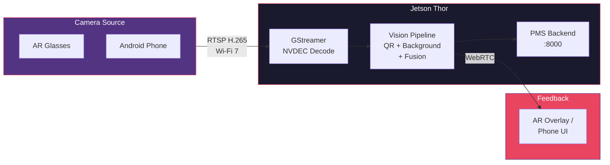

# Edge Vision Stream Setup Guide for PMS Integration

**Document ID:** PMS-EXP-EDGEVISION-001
**Version:** 1.0
**Date:** 2026-02-25
**Applies To:** PMS project (Jetson Thor + Android)
**Prerequisites Level:** Advanced

---

## Table of Contents

1. [Overview](#1-overview)
2. [Prerequisites](#2-prerequisites)
3. [Part A: Configure Jetson Thor Stream Ingestion](#3-part-a-configure-jetson-thor-stream-ingestion)
4. [Part B: Set Up Android RTSP Camera Server](#4-part-b-set-up-android-rtsp-camera-server)
5. [Part C: Build the QR/Barcode Detection Pipeline](#5-part-c-build-the-qrbarcode-detection-pipeline)
6. [Part D: Build the Background Context Analyzer](#6-part-d-build-the-background-context-analyzer)
7. [Part E: Integrate with PMS Backend](#7-part-e-integrate-with-pms-backend)
8. [Part F: Configure AR Glasses Streaming](#8-part-f-configure-ar-glasses-streaming)
9. [Part G: Testing and Verification](#9-part-g-testing-and-verification)
10. [Troubleshooting](#10-troubleshooting)
11. [Reference Commands](#11-reference-commands)
12. [Next Steps](#next-steps)
13. [Resources](#resources)

---

## 1. Overview

This guide walks you through setting up the Edge Vision Stream pipeline on NVIDIA Jetson Thor. By the end, you will have:

- A GStreamer pipeline receiving RTSP video from Android phones or AR glasses
- Hardware-accelerated H.265 decoding via Jetson NVDEC
- QR/barcode detection and decoding on live video frames
- Background context analysis (semantic segmentation + object detection)
- Integration with PMS backend for patient/medication verification
- Real-time feedback via WebRTC return stream or Android push notifications



## 2. Prerequisites

### 2.1 Required Hardware

| Hardware | Specification | Purpose |
|---|---|---|
| NVIDIA Jetson Thor T5000 | JetPack 7.x installed | Edge compute + GPU inference |
| Android phone | Android 12+, rear camera | Camera source (or AR glasses) |
| Wi-Fi 7 access point | 802.11be | Low-latency local network |
| NVMe SSD | >= 256 GB | Jetson storage |

### 2.2 Required Software (Jetson)

| Software | Minimum Version | Check Command |
|---|---|---|
| JetPack | 7.0 | `cat /etc/nv_tegra_release` |
| Docker + NVIDIA Runtime | 24.x | `docker --version && nvidia-smi` |
| GStreamer | 1.24 | `gst-launch-1.0 --version` |
| NVIDIA DeepStream | 7.1 | `deepstream-app --version-all` |
| TensorRT | 10.13 | `dpkg -l \| grep tensorrt` |
| Python | 3.11+ | `python3 --version` |
| CUDA | 13.x | `nvcc --version` |

### 2.3 Required Software (Android)

| Software | Minimum Version | Purpose |
|---|---|---|
| Android Studio | Ladybug+ | Build PMS app with RTSP mode |
| Kotlin | 2.0+ | PMS Android app language |
| CameraX | 1.4+ | Camera API |
| RootEncoder | 2.5+ | RTSP server library |

### 2.4 Verify PMS Services on Jetson

```bash
# SSH into Jetson Thor
ssh pms@192.168.1.100

# Check all PMS containers
docker compose ps
# Expected: backend (Up), frontend (Up), postgres (Up)

# Check backend health
curl http://localhost:8000/health
# Expected: {"status": "healthy"}

# Check GPU
nvidia-smi
# Expected: Jetson Thor GPU with available memory
```

**Checkpoint**: Jetson Thor is running with JetPack 7.x, all PMS services are healthy, and GPU is available.

---

## 3. Part A: Configure Jetson Thor Stream Ingestion

### Step 1: Install GStreamer RTSP server libraries

```bash
# On Jetson Thor
sudo apt update
sudo apt install -y \
    gstreamer1.0-rtsp \
    libgstrtspserver-1.0-dev \
    gstreamer1.0-plugins-bad \
    gstreamer1.0-plugins-ugly \
    python3-gi \
    python3-gst-1.0
```

### Step 2: Test RTSP reception with a test stream

First, verify GStreamer can receive and decode an RTSP stream:

```bash
# Generate a test RTSP stream (on Jetson itself for testing)
gst-launch-1.0 videotestsrc ! \
    x265enc tune=zerolatency ! h265parse ! \
    rtspsink service=8554
```

In a second terminal, verify reception:

```bash
# Receive and display (will show test pattern)
gst-launch-1.0 rtspsrc location=rtsp://127.0.0.1:8554/test latency=100 ! \
    rtph265depay ! h265parse ! \
    nvv4l2decoder ! \
    nvvideoconvert ! \
    autovideosink
```

### Step 3: Create the vision stream ingestion service

Create `/opt/pms/vision-stream/ingest.py`:

```python
"""
Edge Vision Stream - RTSP Ingestion Pipeline
Receives RTSP H.265 streams and dispatches decoded frames
to the vision processing pipeline.
"""
import gi
gi.require_version("Gst", "1.0")
from gi.repository import Gst, GLib
import numpy as np

Gst.init(None)


class StreamIngestor:
    def __init__(self, rtsp_url: str, on_frame_callback):
        self.rtsp_url = rtsp_url
        self.on_frame = on_frame_callback
        self.pipeline = self._build_pipeline()

    def _build_pipeline(self) -> Gst.Pipeline:
        pipeline_str = (
            f"rtspsrc location={self.rtsp_url} latency=100 ! "
            "rtph265depay ! h265parse ! "
            "nvv4l2decoder ! "
            "nvvideoconvert ! "
            "video/x-raw(memory:NVMM),format=RGBA ! "
            "nvvideoconvert ! "
            "video/x-raw,format=RGBA ! "
            "appsink name=sink emit-signals=true max-buffers=2 drop=true"
        )
        pipeline = Gst.parse_launch(pipeline_str)
        sink = pipeline.get_by_name("sink")
        sink.connect("new-sample", self._on_new_sample)
        return pipeline

    def _on_new_sample(self, sink):
        sample = sink.emit("pull-sample")
        buf = sample.get_buffer()
        caps = sample.get_caps()
        width = caps.get_structure(0).get_value("width")
        height = caps.get_structure(0).get_value("height")
        success, map_info = buf.map(Gst.MapFlags.READ)
        if success:
            frame = np.ndarray(
                shape=(height, width, 4),
                dtype=np.uint8,
                buffer=map_info.data,
            )
            self.on_frame(frame, width, height)
            buf.unmap(map_info)
        return Gst.FlowReturn.OK

    def start(self):
        self.pipeline.set_state(Gst.State.PLAYING)

    def stop(self):
        self.pipeline.set_state(Gst.State.NULL)
```

### Step 4: Create the Docker service definition

Add to `/opt/pms/backend/docker-compose.yml`:

```yaml
  vision-stream:
    build:
      context: ../vision-stream
      dockerfile: Dockerfile
    ports:
      - "8554:8554"   # RTSP server port
      - "8443:8443"   # WebRTC signaling
    environment:
      - PMS_API_URL=http://backend:8000
      - RTSP_PORT=8554
      - LOG_LEVEL=INFO
    deploy:
      resources:
        reservations:
          devices:
            - driver: nvidia
              count: all
              capabilities: [gpu]
    depends_on:
      - backend
    networks:
      - pms-net
```

**Checkpoint**: GStreamer RTSP reception is tested. The ingestion pipeline receives RTSP H.265 streams, hardware-decodes them via NVDEC, and dispatches frames to a Python callback.

---

## 4. Part B: Set Up Android RTSP Camera Server

### Step 1: Add RootEncoder dependency

In the PMS Android app's `build.gradle.kts`:

```kotlin
dependencies {
    // Existing PMS dependencies...

    // RTSP streaming
    implementation("com.github.pedroSG94.RootEncoder:library:2.5.3")
}
```

### Step 2: Create the RTSP camera service

Create `app/src/main/java/com/mps/pms/streaming/RtspCameraService.kt`:

```kotlin
package com.mps.pms.streaming

import android.content.Context
import android.util.Log
import androidx.camera.core.CameraSelector
import com.pedro.encoder.input.sources.video.Camera2Source
import com.pedro.library.rtsp.RtspServer

/**
 * RTSP Camera Server for Edge Vision Stream.
 * Streams the phone's rear camera to the Jetson Thor
 * for real-time vision processing.
 */
class RtspCameraService(private val context: Context) {

    private var rtspServer: RtspServer? = null

    companion object {
        private const val TAG = "PMS-RTSP"
        private const val RTSP_PORT = 8554
        private const val VIDEO_WIDTH = 1920
        private const val VIDEO_HEIGHT = 1080
        private const val VIDEO_FPS = 30
        private const val VIDEO_BITRATE = 5_000_000 // 5 Mbps
    }

    fun startStreaming() {
        rtspServer = RtspServer(context, RTSP_PORT).apply {
            prepareVideo(VIDEO_WIDTH, VIDEO_HEIGHT, VIDEO_FPS, VIDEO_BITRATE)
            getVideoSource().let { source ->
                if (source is Camera2Source) {
                    source.setCameraFacing(CameraSelector.LENS_FACING_BACK)
                }
            }
            startStream("")
        }
        Log.i(TAG, "RTSP server started on port $RTSP_PORT")
    }

    fun stopStreaming() {
        rtspServer?.stopStream()
        rtspServer = null
        Log.i(TAG, "RTSP server stopped")
    }

    fun isStreaming(): Boolean = rtspServer?.isStreaming == true

    fun getStreamUrl(): String {
        val ip = getDeviceIp()
        return "rtsp://$ip:$RTSP_PORT"
    }

    private fun getDeviceIp(): String {
        val wifiManager = context.getSystemService(Context.WIFI_SERVICE)
            as android.net.wifi.WifiManager
        val ip = wifiManager.connectionInfo.ipAddress
        return String.format(
            "%d.%d.%d.%d",
            ip and 0xff, ip shr 8 and 0xff,
            ip shr 16 and 0xff, ip shr 24 and 0xff,
        )
    }
}
```

### Step 3: Add streaming toggle to PMS app UI

Add a streaming toggle button to the main activity or a dedicated streaming screen that:

1. Requests camera and network permissions
2. Starts/stops the RTSP server
3. Displays the RTSP URL for Jetson connection
4. Shows a streaming status indicator

### Step 4: Test Android to Jetson stream

1. Connect both Android phone and Jetson Thor to the same Wi-Fi 7 network
2. Start RTSP streaming on the Android app
3. On Jetson, verify the stream is receivable:

```bash
# Replace with your Android phone's IP
gst-launch-1.0 rtspsrc location=rtsp://192.168.1.101:8554/ latency=100 ! \
    rtph265depay ! h265parse ! \
    nvv4l2decoder ! \
    nvvideoconvert ! \
    autovideosink
```

You should see the Android camera feed displayed on the Jetson.

**Checkpoint**: Android PMS app streams 1080p H.265 video over RTSP. Jetson Thor receives and decodes the stream using NVDEC hardware decode.

---

## 5. Part C: Build the QR/Barcode Detection Pipeline

### Step 1: Install ZBar and dependencies

```bash
# On Jetson Thor
sudo apt install -y libzbar0 libzbar-dev
pip3 install pyzbar opencv-python-headless numpy
```

### Step 2: Create the QR detector module

Create `/opt/pms/vision-stream/qr_detector.py`:

```python
"""
QR/Barcode Detection Module
Detects and decodes QR codes, Data Matrix, Code 128, and GS1 barcodes
from video frames. Optimized for healthcare-specific formats.
"""
import re
import cv2
import numpy as np
from pyzbar import pyzbar
from dataclasses import dataclass
from enum import Enum


class BarcodeCategory(Enum):
    PATIENT_WRISTBAND = "patient_wristband"
    MEDICATION_NDC = "medication_ndc"
    MEDICATION_GS1 = "medication_gs1"
    ROOM_BED = "room_bed"
    DOCUMENT = "document"
    UNKNOWN = "unknown"


@dataclass
class QRResult:
    data: str
    barcode_type: str
    category: BarcodeCategory
    bounding_box: tuple  # (x, y, w, h)
    confidence: float
    parsed_fields: dict


class QRDetector:
    """Detects and categorizes healthcare barcodes from video frames."""

    WRISTBAND_PREFIXES = ("MRN:", "PT:", "PAT-")
    NDC_PATTERN_LENGTH = 10
    GS1_AI_PREFIX = "(01)"

    def detect(self, frame: np.ndarray) -> list[QRResult]:
        """Detect all QR/barcodes in a frame."""
        gray = cv2.cvtColor(frame, cv2.COLOR_RGBA2GRAY)
        enhanced = cv2.adaptiveThreshold(
            gray, 255, cv2.ADAPTIVE_THRESH_GAUSSIAN_C,
            cv2.THRESH_BINARY, 11, 2,
        )
        barcodes = pyzbar.decode(enhanced)
        results = []
        for barcode in barcodes:
            data = barcode.data.decode("utf-8", errors="replace")
            rect = barcode.rect
            category = self._categorize(data, barcode.type)
            parsed = self._parse_fields(data, category)
            results.append(QRResult(
                data=data,
                barcode_type=barcode.type,
                category=category,
                bounding_box=(rect.left, rect.top, rect.width, rect.height),
                confidence=1.0,
                parsed_fields=parsed,
            ))
        return results

    def _categorize(self, data: str, barcode_type: str) -> BarcodeCategory:
        if any(data.startswith(p) for p in self.WRISTBAND_PREFIXES):
            return BarcodeCategory.PATIENT_WRISTBAND
        if data.startswith(self.GS1_AI_PREFIX):
            return BarcodeCategory.MEDICATION_GS1
        if data.isdigit() and len(data) == self.NDC_PATTERN_LENGTH:
            return BarcodeCategory.MEDICATION_NDC
        if data.startswith("RM-") or data.startswith("BED-"):
            return BarcodeCategory.ROOM_BED
        return BarcodeCategory.UNKNOWN

    def _parse_fields(self, data: str, category: BarcodeCategory) -> dict:
        if category == BarcodeCategory.PATIENT_WRISTBAND:
            return self._parse_wristband(data)
        if category == BarcodeCategory.MEDICATION_GS1:
            return self._parse_gs1(data)
        if category == BarcodeCategory.MEDICATION_NDC:
            return {"ndc": data}
        if category == BarcodeCategory.ROOM_BED:
            return {"location": data}
        return {"raw": data}

    def _parse_wristband(self, data: str) -> dict:
        fields = {}
        for segment in data.split("|"):
            if ":" in segment:
                key, value = segment.split(":", 1)
                fields[key.strip().lower()] = value.strip()
        return fields

    def _parse_gs1(self, data: str) -> dict:
        fields = {}
        ai_map = {"01": "gtin", "17": "expiry", "10": "lot", "21": "serial"}
        ais = re.findall(r"\((\d+)\)([^(]+)", data)
        for ai_code, value in ais:
            field_name = ai_map.get(ai_code, f"ai_{ai_code}")
            fields[field_name] = value
        return fields
```

### Step 3: Verify QR detection with test images

```bash
python3 -c "
from qr_detector import QRDetector
import cv2, numpy as np, qrcode

qr = qrcode.make('MRN:12345|NAME:John Doe|DOB:1980-01-15')
qr_array = np.array(qr.convert('RGBA'))

detector = QRDetector()
results = detector.detect(qr_array)
for r in results:
    print(f'Category: {r.category.value}')
    print(f'Fields: {r.parsed_fields}')
"
```

Expected output:
```
Category: patient_wristband
Fields: {'mrn': '12345', 'name': 'John Doe', 'dob': '1980-01-15'}
```

**Checkpoint**: QR/barcode detection works on test images. Healthcare-specific barcode categorization identifies patient wristbands, medication NDCs, and GS1 codes.

---

## 6. Part D: Build the Background Context Analyzer

### Step 1: Download and convert models

```bash
# Download YOLOv8 for clinical object detection
pip3 install ultralytics
python3 -c "
from ultralytics import YOLO
model = YOLO('yolov8m.pt')
model.export(format='engine', device=0, half=True)
"

# Download DeepLabV3+ for semantic segmentation
python3 -c "
import torch
import torchvision.models.segmentation as seg
model = seg.deeplabv3_resnet50(pretrained=True)
model.train(False)
dummy = torch.randn(1, 3, 512, 512)
torch.onnx.export(model, dummy, 'deeplabv3.onnx', opset_version=17)
"

# Convert ONNX to TensorRT engine
trtexec --onnx=deeplabv3.onnx \
    --saveEngine=deeplabv3.engine \
    --fp16 \
    --workspace=4096
```

### Step 2: Create the background analyzer module

Create `/opt/pms/vision-stream/background_analyzer.py`:

```python
"""
Background Context Analyzer
Semantic segmentation + object detection on the scene surrounding
a detected QR code. Identifies clinical environment context.
"""
import numpy as np
from dataclasses import dataclass
from ultralytics import YOLO


@dataclass
class SceneContext:
    room_type: str
    detected_objects: list
    qr_on_body: bool
    environment_safe: bool


class BackgroundAnalyzer:
    """Analyzes clinical environment context from video frames."""

    CLINICAL_OBJECTS = {
        "bed": "hospital_bed",
        "person": "patient_or_staff",
        "bottle": "medication_container",
        "tv": "patient_monitor",
        "chair": "wheelchair_or_chair",
    }

    def __init__(self, yolo_engine_path: str = "yolov8m.engine"):
        self.detector = YOLO(yolo_engine_path, task="detect")

    def analyze(
        self, frame: np.ndarray, qr_bbox: tuple | None = None,
    ) -> SceneContext:
        results = self.detector(frame, verbose=False)[0]
        detected_objects = []
        qr_on_body = False

        for box in results.boxes:
            label = results.names[int(box.cls)]
            confidence = float(box.conf)
            bbox = box.xyxy[0].tolist()
            clinical_label = self.CLINICAL_OBJECTS.get(label, label)
            detected_objects.append({
                "label": clinical_label,
                "confidence": confidence,
                "bbox": bbox,
            })
            if qr_bbox and label == "person":
                if self._bboxes_overlap(qr_bbox, bbox):
                    qr_on_body = True

        room_type = self._classify_room(detected_objects)
        return SceneContext(
            room_type=room_type,
            detected_objects=detected_objects,
            qr_on_body=qr_on_body,
            environment_safe=True,
        )

    def _classify_room(self, objects: list) -> str:
        labels = {obj["label"] for obj in objects}
        if "hospital_bed" in labels and "patient_monitor" in labels:
            return "patient_room"
        if "hospital_bed" in labels:
            return "patient_room"
        if "medication_container" in labels:
            return "pharmacy_or_med_room"
        return "general_area"

    @staticmethod
    def _bboxes_overlap(bbox1: tuple, bbox2: list) -> bool:
        x1, y1, w1, h1 = bbox1
        x2_min, y2_min, x2_max, y2_max = bbox2
        return not (
            x1 + w1 < x2_min or x2_max < x1
            or y1 + h1 < y2_min or y2_max < y1
        )
```

**Checkpoint**: Background analyzer detects clinical objects and classifies room types. YOLOv8 TensorRT engine runs on Jetson GPU with FP16 optimization.

---

## 7. Part E: Integrate with PMS Backend

### Step 1: Create the Context Fusion Engine

Create `/opt/pms/vision-stream/fusion_engine.py` that combines QR detection results with background analysis and PMS patient/medication data. The engine:

1. Receives a QR scan result + scene context
2. Looks up patient by MRN or medication by NDC via PMS API
3. Cross-references the five rights (right patient, drug, dose, time, route)
4. Checks if the QR wristband is physically on a patient (overlap detection)
5. Returns a verification status: `VERIFIED`, `WARNING`, or `ALERT`

Key API calls:
- `GET /api/patients/mrn/{mrn}` — Patient lookup from wristband QR
- `GET /api/medications/ndc/{ndc}` — Medication lookup from barcode
- `POST /api/prescriptions/check-interactions` — Drug interaction check

### Step 2: Create the main stream processor

Create `/opt/pms/vision-stream/main.py` that orchestrates:
- RTSP ingestion (frames from camera)
- QR detection on every 3rd frame
- Background analysis on every 15th frame
- PMS verification on each QR detection
- Result logging and notification dispatch

**Checkpoint**: The full pipeline runs: RTSP ingestion -> frame dispatch -> QR detection -> background analysis -> PMS verification.

---

## 8. Part F: Configure AR Glasses Streaming

### AR Glasses as RTSP Camera Source

AR glasses (Meta Ray-Ban Display, Xreal One Pro) can stream their camera feed to the Jetson in two ways:

#### Option 1: Via Companion Android App (Recommended)

Most AR glasses pair with a companion Android app that accesses the glasses' camera feed. The PMS Android app can receive this feed and re-stream it over RTSP:

1. Pair AR glasses with Android phone via Bluetooth
2. Access the glasses camera through the companion SDK
3. Stream via the same RootEncoder RTSP server to Jetson

#### Option 2: Direct Wi-Fi Streaming

Some AR glasses (like Xreal with Nebula) support direct Wi-Fi streaming:

1. Connect glasses to the same Wi-Fi 7 network
2. Configure glasses to stream to the Jetson's RTSP endpoint
3. Jetson receives the stream directly

### WebRTC Return Stream for AR Overlay

To send verification results back as an AR overlay, the vision-stream service pushes JSON overlay messages via WebSocket to the companion app, which renders them on the glasses' display:

- Green checkmark overlay on verified patient/medication
- Red alert overlay on mismatches or interactions
- Info text with patient name, medication details, next due time

**Checkpoint**: AR glasses can stream to Jetson Thor via companion Android app or direct Wi-Fi. Verification results can be pushed back as overlay data.

---

## 9. Part G: Testing and Verification

### Test 1: End-to-end QR scan flow

1. Print a test patient wristband QR code: `MRN:12345|NAME:Test Patient|DOB:1990-05-15`
2. Start the vision stream pipeline on Jetson
3. Start RTSP streaming from Android phone
4. Point the phone camera at the QR code
5. Verify: QR is detected, categorized as `patient_wristband`, MRN extracted, PMS lookup occurs

### Test 2: Medication barcode scan

1. Use a GS1 test barcode: `(01)00312345678901(17)261231(10)LOT123`
2. Scan with the camera
3. Verify: GTIN, expiry, and lot number are extracted

### Test 3: Background context detection

1. Point camera at a scene with identifiable objects (bed, monitor, person)
2. Verify: Objects detected with labels and confidence scores
3. Verify: Room type classified correctly

### Test 4: Multi-stream

1. Start two Android phones streaming simultaneously
2. Verify: Both streams received and processed without frame drops
3. Check GPU utilization: `nvidia-smi` should show <50% GPU memory usage

### Test 5: Full verification checklist

| Test | Expected Result | Status |
|---|---|---|
| RTSP stream reception | Frames decoded at 30fps | |
| QR detection latency | < 50ms per detection | |
| Patient wristband scan -> PMS lookup | MRN extracted, patient found | |
| Medication barcode -> NDC extraction | NDC parsed, formulary checked | |
| Background object detection | Clinical objects identified | |
| QR-on-body detection | Wristband on person flagged | |
| End-to-end latency | < 500ms scan-to-result | |
| No video persisted | No video files on disk | |

**Checkpoint**: All five tests pass.

---

## 10. Troubleshooting

### RTSP stream not connecting

**Symptom**: GStreamer pipeline hangs at PLAYING with no frames.

**Fix**: Verify network connectivity and firewall:
```bash
ping 192.168.1.101
sudo ufw allow 8554/tcp
```

### NVDEC decode errors

**Symptom**: `nvv4l2decoder` reports errors or produces garbled frames.

**Fix**: Verify stream codec with `gst-discoverer-1.0`. Ensure H.265 encoding. If H.264, update pipeline to use `rtph264depay ! h264parse`.

### QR codes not detected

**Symptom**: Camera sees QR codes but ZBar returns no results.

**Fix**: Check image quality — QR detection fails on blurry, too-small, or too-dim images. Try lower resolution (720p) to reduce motion blur.

### GPU out of memory

**Symptom**: `CUDA out of memory` errors when loading models.

**Fix**: Existing PMS models (~5.5 GB) + stream models (~8 GB) = ~13.5 GB of 128 GB. Check for other GPU processes with `nvidia-smi`.

### High latency (>500ms)

**Symptom**: Verification results arrive noticeably after scanning.

**Fix**: Increase frame skip interval, ensure TensorRT engines are prebuilt, check network latency, reduce video resolution to 1080p.

### Android camera permission denied

**Symptom**: RootEncoder fails to start camera.

**Fix**: Ensure permissions in `AndroidManifest.xml`:
```xml
<uses-permission android:name="android.permission.CAMERA" />
<uses-permission android:name="android.permission.INTERNET" />
<uses-permission android:name="android.permission.ACCESS_WIFI_STATE" />
```

---

## 11. Reference Commands

### Jetson Thor Operations

```bash
# Start vision stream service
docker compose up -d vision-stream

# View stream logs
docker compose logs -f vision-stream

# Check GPU utilization
nvidia-smi -l 1

# Test RTSP reception
gst-launch-1.0 rtspsrc location=rtsp://192.168.1.101:8554/ latency=100 ! \
    rtph265depay ! h265parse ! nvv4l2decoder ! fakesink

# Build TensorRT engine
trtexec --onnx=model.onnx --saveEngine=model.engine --fp16
```

### Useful URLs

| Resource | URL |
|---|---|
| PMS Backend Health | http://192.168.1.100:8000/health |
| PMS Frontend | http://192.168.1.100:3000 |
| PMS API Docs | http://192.168.1.100:8000/docs |
| NVIDIA DeepStream Docs | https://docs.nvidia.com/metropolis/deepstream/dev-guide/ |
| Jetson Inference Guide | https://github.com/dusty-nv/jetson-inference |
| RootEncoder Docs | https://github.com/pedroSG94/RootEncoder |

---

## Next Steps

1. **Complete the Developer Tutorial** — [Edge Vision Stream Developer Tutorial](25-EdgeVisionStream-Developer-Tutorial.md)
2. **Fine-tune YOLOv8** on clinical objects (IV poles, medication carts, wristbands, monitors)
3. **Integrate AR glasses** — Test with Meta Ray-Ban Display or Xreal One Pro
4. **Build analytics dashboard** — Scan counts, compliance rates, alert frequency
5. **Clinical pilot** — Deploy in a controlled clinical environment

---

## Resources

### NVIDIA Documentation
- [Jetson Thor Technical Blog](https://developer.nvidia.com/blog/introducing-nvidia-jetson-thor-the-ultimate-platform-for-physical-ai/)
- [DeepStream SDK](https://developer.nvidia.com/deepstream-sdk)
- [Jetson Inference Guide](https://github.com/dusty-nv/jetson-inference)
- [NVIDIA Holoscan for Medical Devices](https://developer.nvidia.com/holoscan-sdk)

### Streaming & Camera
- [RootEncoder Android RTSP](https://github.com/pedroSG94/RootEncoder)
- [Jetson Multi-Camera Media Server](https://developer.nvidia.com/blog/building-multi-camera-media-server-ai-processing-jetson/)

### PMS References
- [ADR-0007: Jetson Thor Edge Deployment](../architecture/0007-jetson-thor-edge-deployment.md)
- [ADR-0009: AI Inference Runtime Selection](../architecture/0009-ai-inference-runtime.md)
- [Vision Capabilities](../features/vision-capabilities.md)
- [Jetson Deployment Guide](../config/jetson-deployment.md)
