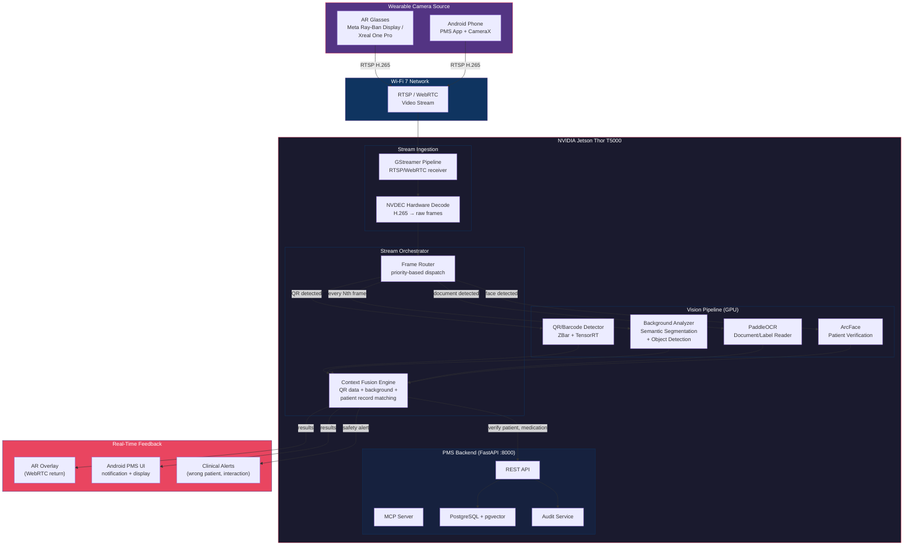

# Product Requirements Document: Edge Vision Stream Integration into Patient Management System (PMS)

**Document ID:** PRD-PMS-EDGEVISION-001
**Version:** 1.0
**Date:** 2026-02-25
**Author:** Ammar (CEO, MPS Inc.)
**Status:** Draft

---

## 1. Executive Summary

Edge Vision Stream is a real-time camera streaming and computer vision pipeline that connects wearable cameras (AR glasses, Android phones) to the NVIDIA Jetson Thor edge device for on-device AI processing. The camera source — worn by a clinician as AR smart glasses or held as a phone — streams live video over Wi-Fi 7 to the Jetson Thor, which executes vision tasks including QR/barcode scanning of patient wristbands and medication packaging, background context detection behind scanned codes (identifying room type, equipment, patient state), object recognition, and document capture. Results are pushed back to the wearable display in real-time, creating a hands-free, AI-augmented clinical workflow.

This builds on the existing Jetson Thor edge deployment (ADR-0007) which already runs wound assessment, patient ID verification, and document OCR. Edge Vision Stream adds a **continuous camera streaming pipeline** (vs. single-image uploads) and **composite vision intelligence** — not just reading a QR code, but understanding the clinical context around it: Is this wristband on a patient's arm? Is the medication at bedside? Is the room environment appropriate?

The system addresses the critical healthcare challenge of barcode medication administration (BCMA) compliance, where studies show scanning compliance declines rapidly under nursing workload pressure. By moving from handheld scanner workflows to hands-free, always-on AR-assisted scanning, the system reduces friction and increases compliance while adding AI-powered safety checks that traditional barcode scanners cannot perform.

## 2. Problem Statement

Current clinical point-of-care verification workflows suffer from:

1. **Barcode scanning friction**: Nurses must locate a handheld scanner, scan the patient wristband, scan the medication barcode, and verify on a workstation screen. Studies show BCMA compliance drops to near-abandonment on busy wards (PMC reference: 16-month longitudinal study).
2. **No contextual awareness**: Traditional barcode scanners read codes but have zero understanding of context — they can't detect if the wristband is on the correct patient, if the medication is at the right bedside, or if the environment is appropriate for administration.
3. **Single-image bottleneck**: The current PMS vision pipeline (ADR-0007) processes one uploaded image at a time. Clinical workflows like medication rounds require continuous, hands-free scanning across multiple patients and medications.
4. **Device switching overhead**: Clinicians currently switch between their Android PMS app (for records), a barcode scanner (for verification), and a workstation (for documentation). This context-switching introduces errors and delays.
5. **Missing environmental intelligence**: There is no automated way to verify clinical context — is this the right room? Is the IV line connected? Is the patient positioned correctly for the procedure?

## 3. Proposed Solution

### 3.1 Architecture Overview

### 3.2 Deployment Model

- **On-device only**: All video processing, AI inference, and data fusion runs on the Jetson Thor. No frames leave the local Wi-Fi 7 network. Zero cloud dependency.
- **Docker-based**: The vision stream pipeline runs as a new Docker service (`pms-vision-stream`) alongside the existing PMS backend, frontend, and PostgreSQL containers.
- **Camera sources**: AR glasses (Meta Ray-Ban Display, Xreal One Pro) or Android phone running the PMS app with RTSP server mode enabled. Both stream H.265 over RTSP to the Jetson.
- **HIPAA compliance**: All video frames are processed in-memory and discarded after inference — no persistent video storage. Only structured results (QR data, detected objects, verification outcomes) are stored with full audit trails. Patient face embeddings use the existing ArcFace + encrypted storage pipeline (ADR-0007, ADR-0010).

## 4. PMS Data Sources

| API Endpoint | Vision Stream Usage | Data Flow |
|---|---|---|
| `/api/patients` | Patient lookup after wristband QR scan → MRN → patient record | QR decode → MRN extraction → patient fetch |
| `/api/patients/{id}/medications` | Active medication list for barcode cross-reference | Medication barcode scan → NDC/GS1 → verify against active meds |
| `/api/encounters` | Current encounter context for the scanned patient | Patient ID → active encounter → verify location/assignment |
| `/api/prescriptions` | Prescription verification for medication administration | Med barcode → prescription match → dose/time/route check |
| `/api/prescriptions/check-interactions` | Drug interaction check when new medication is scanned | Scanned med → interaction check against active meds |
| `/vision/patient-id-verify` | Face verification against stored patient embedding | Continuous face detection → verify matches wristband patient |
| `/vision/document-ocr` | Document/label reading from camera stream | Document frame → OCR → field extraction |

## 5. Component/Module Definitions

### 5.1 Stream Ingestion Service

**Name:** `pms-vision-stream`
**Description:** GStreamer-based pipeline that receives RTSP/WebRTC video from camera sources, hardware-decodes using Jetson NVDEC, and dispatches frames to the vision pipeline.

**Input:** RTSP stream (H.265, 1080p@30fps or 4K@30fps)
**Output:** Raw GPU frames dispatched to vision models
**Key libraries:** GStreamer 1.24+, NVIDIA DeepStream 7.1, jetson-utils

### 5.2 QR/Barcode Detection Module

**Name:** QR Detector
**Description:** Detects and decodes QR codes, Data Matrix, Code 128, and GS1 barcodes from video frames. Optimized for healthcare-specific formats: patient wristband QR (MRN, name, DOB), medication barcodes (NDC, lot, expiry), and room/bed identifiers.

**Input:** Video frame (GPU memory)
**Output:** Decoded barcode data + bounding box coordinates + barcode type
**Key libraries:** ZBar (CPU decode) + custom TensorRT detector for barcode localization
**PMS API:** Decoded MRN → `/api/patients`, NDC → `/api/prescriptions`

### 5.3 Background Context Analyzer

**Name:** Background Analyzer
**Description:** Semantic segmentation and object detection on the scene surrounding a detected QR code. Answers contextual questions: What room type is this? Is the wristband on a patient's arm? Is IV equipment present? Is the medication at bedside?

**Input:** Video frame + QR bounding box (for region-of-interest context)
**Output:** Scene classification, detected objects with labels and confidence, spatial relationships
**Models:**
- Semantic segmentation: DeepLabV3+ (TensorRT FP16) for room/environment classification
- Object detection: YOLOv8-Med (custom fine-tuned) for clinical objects (IV poles, medication carts, beds, monitors, wristbands)
**PMS API:** Scene context enriches audit logs and safety verification

### 5.4 Context Fusion Engine

**Name:** Fusion Engine
**Description:** Combines outputs from QR decoder, background analyzer, OCR, and face verification into a unified clinical context assessment. Performs multi-signal verification:

1. **Patient verification**: QR wristband MRN + face match + encounter room assignment
2. **Medication verification**: Medication barcode NDC + prescription match + five rights check (right patient, drug, dose, time, route)
3. **Environmental verification**: Room type matches encounter location + expected equipment present
4. **Safety alerts**: Interaction warnings, wrong-patient alerts, expired medication detection

**Input:** All vision module outputs + PMS patient/prescription data
**Output:** Verification result (pass/warn/alert) + confidence score + display overlay data

### 5.5 AR Overlay / Feedback Service

**Name:** Feedback Service
**Description:** Pushes verification results back to the wearable device as real-time overlays (AR glasses) or UI notifications (Android PMS app).

**Input:** Fusion Engine results
**Output:** WebRTC return stream with overlay annotations (AR glasses) or push notification payload (Android)
**Display elements:**
- Green checkmark overlay on verified patient/medication
- Red alert overlay on mismatches or interactions
- Info overlay with patient name, medication details, next due time
- Environmental status indicators

## 6. Non-Functional Requirements

### 6.1 Security and HIPAA Compliance

- **No persistent video storage**: Frames processed in GPU memory and discarded. No video recording capability.
- **Encrypted transport**: RTSP streams encrypted with SRTP (AES-128-CM). WebRTC uses DTLS-SRTP by default.
- **Access control**: Camera streaming requires authenticated PMS session. AR glasses pair via Bluetooth + PMS app authentication.
- **Audit logging**: Every QR scan, patient lookup, medication verification, and safety alert logged as AuditEvent with timestamp, clinician ID, patient ID, and verification result.
- **PHI in video**: Live video contains PHI (patient faces, wristbands, medication labels). Mitigated by: no storage, no transmission beyond local network, encrypted stream, and audit trail of all AI-extracted data.
- **Face embedding privacy**: Patient face verification reuses the existing ArcFace + AES-256-GCM encrypted embedding pipeline (ADR-0010, ADR-0016).

### 6.2 Performance

| Metric | Target | Rationale |
|---|---|---|
| Stream-to-detection latency | < 200ms | Clinical real-time feedback threshold |
| QR/barcode decode time | < 50ms per frame | Faster than handheld scanner response |
| Background analysis | < 300ms per frame | Runs on every Nth frame, not every frame |
| End-to-end verification | < 500ms | QR scan → patient lookup → medication match → display |
| Concurrent camera streams | 2-4 | Multiple clinicians on medication rounds simultaneously |
| Video decode throughput | 4x 1080p@30fps | NVDEC hardware decode capability |

### 6.3 Infrastructure

| Component | Resource | Notes |
|---|---|---|
| Docker service `pms-vision-stream` | GPU + CPU | GStreamer + DeepStream + TensorRT models |
| Additional GPU memory | ~8 GB | Segmentation + detection + QR models on top of existing ~5.5 GB |
| Total GPU memory | ~13.5 GB | Well within 128 GB unified memory |
| Network bandwidth (per stream) | ~5 Mbps | H.265 1080p@30fps |
| Wi-Fi 7 capacity | 4 streams @ 20 Mbps | 802.11be easily handles this |

## 7. Implementation Phases

### Phase 1: Stream Pipeline Foundation (Sprint 1-3)

- GStreamer RTSP ingestion pipeline on Jetson Thor with NVDEC hardware decode
- QR/barcode detection module (ZBar + TensorRT localization)
- Android PMS app RTSP server mode (CameraX + RootEncoder library)
- Basic QR → MRN → patient lookup → verification result flow
- WebRTC return stream with simple text overlay (pass/fail)
- Docker service definition and integration with existing docker-compose

### Phase 2: Background Intelligence (Sprint 4-6)

- Background context analyzer: semantic segmentation (DeepLabV3+ TensorRT) + object detection (YOLOv8 fine-tuned on clinical objects)
- Context Fusion Engine combining QR data + background analysis + patient records
- Medication barcode (GS1/NDC) decoding and five-rights verification
- Safety alert pipeline (wrong-patient, drug interaction, expired medication)
- AR glasses integration (Meta Ray-Ban Display WebRTC streaming)
- Enhanced AR overlay with color-coded verification indicators

### Phase 3: Advanced Intelligence (Sprint 7-9)

- Multi-stream orchestration (2-4 concurrent clinicians)
- Face verification integration (continuous ArcFace matching from stream)
- Environmental verification (room type + equipment detection)
- Gemma 3 multimodal integration for complex scene understanding
- Analytics dashboard (scan counts, compliance rates, alert frequency)
- Performance optimization and clinical workflow testing

## 8. Success Metrics

| Metric | Target | Measurement Method |
|---|---|---|
| QR scan success rate | > 98% on first pass | Successful decodes / total scan attempts |
| End-to-end latency | < 500ms (p95) | Timestamp from frame capture to overlay display |
| BCMA compliance rate | > 95% (up from ~60% baseline) | Scans completed / medications administered |
| Wrong-patient alerts | 100% detection | Simulated wrong-patient scenarios caught |
| Drug interaction alerts | 100% of known interactions | Cross-reference with Sanford Guide database |
| Clinician satisfaction | > 4/5 rating | Post-pilot survey |
| Background detection accuracy | > 90% for clinical objects | Annotated test set evaluation |
| Concurrent stream stability | 4 streams without degradation | Load testing with synthetic streams |

## 9. Risks and Mitigations

| Risk | Impact | Mitigation |
|---|---|---|
| AR glasses battery life insufficient for full shift | High — reverts to phone workflow | Support both AR glasses and phone; hot-swap batteries; glasses optional enhancement |
| QR code too damaged/faded to scan from stream | Medium — missed verification | Fall back to manual barcode scanner; alert clinician to request new wristband |
| Wi-Fi 7 interference in clinical environment | High — stream drops | Wi-Fi 7 MLO (Multi-Link Operation) provides channel redundancy; automatic reconnect; buffer recent frames |
| Background analysis false positives | Medium — alert fatigue | Configurable confidence thresholds; learn-from-dismissal feedback loop |
| HIPAA concerns about continuous video | High — compliance risk | No video storage; frames discarded after inference; audit logging of all extracted data |
| GPU memory contention with existing vision models | Medium — performance degradation | Priority-based GPU scheduling; existing models (~5.5 GB) + new models (~8 GB) = ~13.5 GB of 128 GB |
| Clinician resistance to wearing glasses | Medium — low adoption | Phone mode as fallback; AR glasses optional; clinician training and feedback cycles |
| Meta/Xreal API changes for AR glasses | Low — integration breakage | Abstract camera source behind RTSP interface; glasses are just an RTSP source |

## 10. Dependencies

| Dependency | Version | Purpose |
|---|---|---|
| NVIDIA Jetson Thor T5000 | JetPack 7.x | Edge compute platform |
| GStreamer | 1.24+ | Stream ingestion and pipeline |
| NVIDIA DeepStream | 7.1 | Video analytics framework |
| NVIDIA NVDEC | (Jetson hardware) | Hardware H.265 decode |
| TensorRT | 10.13 | Model optimization and inference |
| ZBar | 0.23+ | QR/barcode decoding |
| YOLOv8 | Ultralytics | Object detection (fine-tuned) |
| DeepLabV3+ | TorchVision | Semantic segmentation |
| RootEncoder | 2.5+ | Android RTSP server library |
| CameraX | 1.4+ | Android camera API |
| WebRTC | libwebrtc | AR glasses bidirectional streaming |
| PMS Backend | FastAPI :8000 | Patient/medication data APIs |
| PostgreSQL + pgvector | 16+ | Data storage and embedding search |

## 11. Comparison with Existing Experiments

| Aspect | Edge Vision Stream (This) | Jetson Thor (ADR-0007) | DermaCheck (Exp. 18) | MedASR / Voxtral (Exp. 07, 21) |
|---|---|---|---|---|
| **Input** | Continuous video stream | Single image upload | Single dermoscopic image | Audio stream |
| **Processing** | Real-time multi-model pipeline | Per-request inference | Classification + similarity | Transcription + structuring |
| **Camera source** | AR glasses / phone stream | Android app upload | Android app upload | Microphone |
| **Output** | Composite verification + AR overlay | Inference result JSON | Risk assessment | Structured clinical note |
| **Latency requirement** | < 500ms continuous | < 200ms per image | < 200ms per image | Real-time streaming |
| **Key addition** | **Background context analysis**, continuous scanning, hands-free workflow | Foundation vision stack | Dermatology-specific CDS | Speech-specific processing |

Edge Vision Stream **builds on** ADR-0007's vision stack (same Jetson Thor hardware, TensorRT runtime, ArcFace model) and **extends** it from single-image to continuous-stream processing with composite multi-model intelligence.

## 12. Research Sources

### Official Documentation
- [NVIDIA Jetson Thor Technical Blog](https://developer.nvidia.com/blog/introducing-nvidia-jetson-thor-the-ultimate-platform-for-physical-ai/) — Jetson Thor specifications, Blackwell GPU, NVDEC capabilities
- [NVIDIA DeepStream SDK](https://developer.nvidia.com/deepstream-sdk) — Video analytics framework for Jetson

### Architecture & Streaming
- [Jetson Multi-Camera Media Server](https://developer.nvidia.com/blog/building-multi-camera-media-server-ai-processing-jetson/) — GStreamer + DeepStream multi-camera pipeline architecture
- [NVIDIA Holoscan for Medical Devices](https://developer.nvidia.com/holoscan-sdk) — Low-latency streaming AI for medical instruments
- [RootEncoder Android RTSP Library](https://github.com/pedroSG94/RootEncoder) — Android RTSP server with CameraX + H.265

### Healthcare & Clinical Safety
- [Barcode Medication Administration Longitudinal Study (PMC)](https://pmc.ncbi.nlm.nih.gov/articles/PMC11784319/) — BCMA compliance decline data
- [AI-Powered AR Glasses for Emergency First Aid (PMC)](https://pmc.ncbi.nlm.nih.gov/articles/PMC12382044/) — AR + edge AI for clinical guidance
- [Barcode Technology in Healthcare 2025](https://scanbot.io/blog/barcodes-in-healthcare/) — QR/barcode formats in healthcare

### AR Glasses & Wearables
- [Leopard Imaging Eagle + Jetson Thor](https://www.prnewswire.com/news-releases/leopard-imaging-to-showcase-high-resolution-rgb-ir-stereo-camera-series-eagle-powered-by-nvidia-holoscan-and-nvidia-jetson-thor-at-ces-2026--advancing-physical-ai-302640441.html) — Stereo camera hardware for Jetson Thor
- [AR Smart Glasses Business Case 2026](https://www.uctoday.com/immersive-workplace-xr-tech/augmented-reality-smart-glasses-2026/) — AR adoption trends and ROI data

## 13. Appendix: Related Documents

- [Edge Vision Stream Setup Guide](25-EdgeVisionStream-PMS-Developer-Setup-Guide.md)
- [Edge Vision Stream Developer Tutorial](25-EdgeVisionStream-Developer-Tutorial.md)
- [ADR-0007: Jetson Thor Edge Deployment](../architecture/0007-jetson-thor-edge-deployment.md)
- [ADR-0009: AI Inference Runtime Selection](../architecture/0009-ai-inference-runtime.md)
- [Vision Capabilities](../features/vision-capabilities.md)
- [Jetson Deployment Guide](../config/jetson-deployment.md)
- [DermaCheck / ISIC Archive PRD (Experiment 18)](18-PRD-ISICArchive-PMS-Integration.md)
