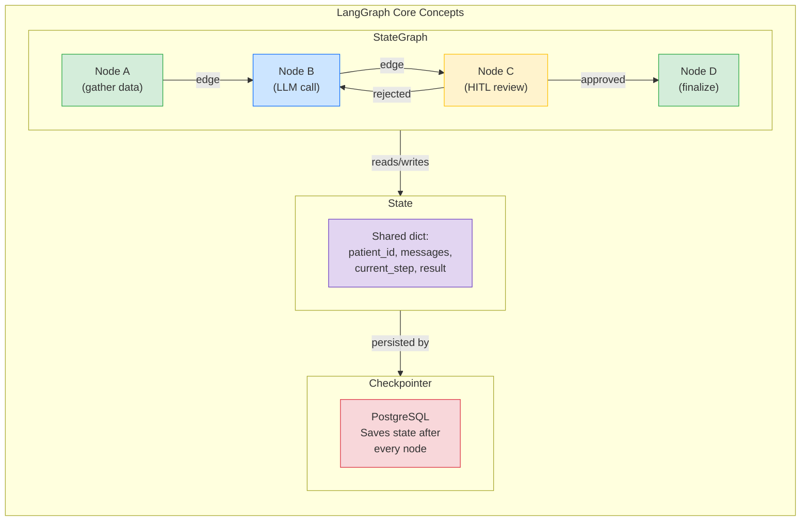
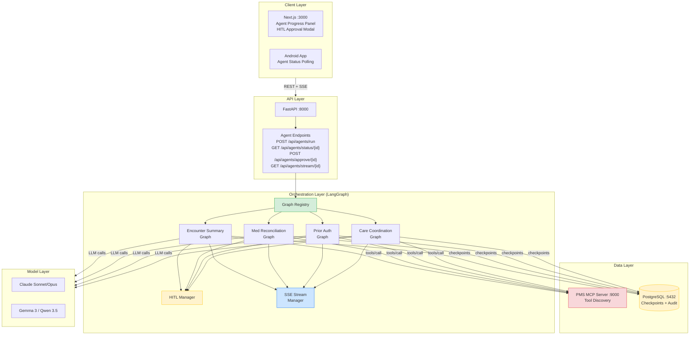

# LangGraph Developer Onboarding Tutorial

**Welcome to the MPS PMS LangGraph Integration Team**

This tutorial will take you from zero to building your first LangGraph integration with the PMS. By the end, you will understand how LangGraph works, have a running local environment, and have built and tested a custom clinical workflow agent end-to-end.

**Document ID:** PMS-EXP-LANGGRAPH-002
**Version:** 1.0
**Date:** March 2, 2026
**Applies To:** PMS project (all platforms)
**Prerequisite:** [LangGraph Setup Guide](26-LangGraph-PMS-Developer-Setup-Guide.md)
**Estimated time:** 2-3 hours
**Difficulty:** Beginner-friendly

---

## What You Will Learn

1. What problem LangGraph solves in the PMS and why stateful orchestration matters for clinical AI
2. How LangGraph's graph model (nodes, edges, state) works
3. How checkpointing provides durable execution for long-running workflows
4. How Human-in-the-Loop (HITL) gates enforce clinician oversight
5. How to verify your local LangGraph environment
6. How to build a Medication Reconciliation agent graph from scratch
7. How to add conditional routing for clinical decision logic
8. How to connect your graph to PMS APIs via MCP
9. How to evaluate LangGraph's strengths and weaknesses for healthcare
10. How to debug agent execution using state inspection and audit logs

---

## Part 1: Understanding LangGraph (15 min read)

### 1.1 What Problem Does LangGraph Solve?

Imagine a clinic where an AI assistant helps with **prior authorization** — a process that takes 15 minutes to 3 days:

1. **Gather patient data** — pull demographics, diagnosis, medication history from the PMS
2. **Check insurance eligibility** — call the payer API to verify coverage
3. **Assemble clinical justification** — select relevant encounter notes, lab results, imaging
4. **Submit to payer** — send the authorization request electronically
5. **Wait for response** — hours to days
6. **Handle result** — if approved, update the prescription. If denied, prepare an appeal with additional documentation

Today, if the PMS server restarts at step 4, **all progress is lost**. The clinician must start over. If the AI generates a clinical justification that needs review, there's no standard way to pause, get clinician approval, and resume.

**LangGraph solves this by treating the workflow as a stateful graph:**

- Each step is a **node** in a directed graph
- Transitions between steps are **edges** (which can be conditional)
- The entire graph state is **checkpointed** to PostgreSQL after every step
- If the server restarts, the graph **resumes from the last checkpoint**
- **HITL interrupt points** pause the graph and wait for human input — seconds, hours, or days later
- The frontend can **stream** real-time progress as the graph executes

### 1.2 How LangGraph Works — The Key Pieces



There are three key concepts:

1. **StateGraph** — A directed graph where nodes are Python functions and edges define control flow. Unlike linear chains, graphs support cycles (node C → node B for retry) and conditional routing.

2. **State** — A shared Python dictionary (defined via a TypedDict or dataclass) that every node can read and write. When node A sets `patient_id = "123"`, node B sees it. State is the memory of the workflow.

3. **Checkpointer** — After every node executes, the checkpointer saves the full state to PostgreSQL. If the process crashes, the graph resumes from the last saved state. Each execution is identified by a `thread_id`.

### 1.3 How LangGraph Fits with Other PMS Technologies

| Technology | Role | Relationship to LangGraph |
|---|---|---|
| **MCP (Experiment 09)** | Tool/data access protocol | LangGraph agents call PMS APIs through MCP tools |
| **OpenClaw (Experiment 05)** | Autonomous task automation | LangGraph replaces OpenClaw's orchestration; OpenClaw skills become graph nodes |
| **Adaptive Thinking (Experiment 08)** | Effort-routed AI reasoning | Effort routing becomes a decision node in LangGraph graphs |
| **Gemma 3 / Qwen 3.5 (Experiments 13/20)** | On-premise LLMs | LangGraph nodes can use on-premise models for PHI-sensitive reasoning |
| **MedASR / Speechmatics (Experiments 07/10)** | Speech-to-text | Transcription output feeds into LangGraph encounter summary graphs |
| **Claude Model Selection (Experiment 15)** | Model routing | LangGraph nodes route to Claude Opus, Sonnet, or Haiku based on complexity |

### 1.4 Key Vocabulary

| Term | Meaning |
|---|---|
| **StateGraph** | The directed graph definition containing nodes and edges |
| **Node** | A Python async function that reads state, does work, and returns state updates |
| **Edge** | A connection between nodes. Can be unconditional or conditional (routing) |
| **State** | The shared data dictionary passed between nodes |
| **Thread** | A unique execution instance of a graph, identified by `thread_id` |
| **Checkpoint** | A saved snapshot of state after a node executes |
| **Checkpointer** | The persistence backend (PostgreSQL in PMS) that saves checkpoints |
| **Superstep** | One round of parallel node execution. Checkpoints are saved after each superstep |
| **Interrupt** | A HITL pause point where the graph waits for external human input |
| **Compiled graph** | A graph + checkpointer ready for execution (call `.compile()`) |
| **Channel** | A named slot in the state. Each key in your state schema is a channel |
| **Reducer** | A function that merges state updates (e.g., `operator.add` appends to lists) |

### 1.5 Our Architecture



---

## Part 2: Environment Verification (15 min)

### 2.1 Checklist

Run each command and confirm the expected output:

1. **Python version:**
   ```bash
   python3 --version
   # Expected: Python 3.12.x or higher
   ```

2. **LangGraph installed:**
   ```bash
   python3 -c "import langgraph; print(langgraph.__version__)"
   # Expected: 1.0.x
   ```

3. **PostgreSQL checkpointer:**
   ```bash
   python3 -c "from langgraph.checkpoint.postgres import PostgresSaver; print('OK')"
   # Expected: OK
   ```

4. **PMS backend running:**
   ```bash
   curl -s http://localhost:8000/api/health | jq .status
   # Expected: "healthy"
   ```

5. **PostgreSQL accessible:**
   ```bash
   psql -h localhost -p 5432 -U pms -d pms_db -c "SELECT 1;"
   # Expected: 1
   ```

6. **Checkpoint tables exist:**
   ```bash
   psql -h localhost -p 5432 -U pms -d pms_db -c "\dt *checkpoint*" | grep checkpoints
   # Expected: public | checkpoints | table | pms
   ```

7. **Agent endpoints accessible:**
   ```bash
   curl -s http://localhost:8000/api/agents/graphs | jq .
   # Expected: [{"name": "encounter_summary"}]
   ```

### 2.2 Quick Test

Run the encounter summary graph end-to-end:

```bash
# Start the agent
RESULT=$(curl -s -X POST http://localhost:8000/api/agents/run \
  -H "Content-Type: application/json" \
  -d '{"graph_name": "encounter_summary", "patient_id": "test-001", "encounter_id": "enc-001"}')

echo "$RESULT" | jq .

# Get the thread ID
THREAD_ID=$(echo "$RESULT" | jq -r .thread_id)
echo "Thread ID: $THREAD_ID"

# Check status (should be waiting for approval)
curl -s "http://localhost:8000/api/agents/status/$THREAD_ID" | jq .status
# Expected: "waiting_for_approval"

# Approve
curl -s -X POST "http://localhost:8000/api/agents/approve/$THREAD_ID" \
  -H "Content-Type: application/json" \
  -d '{"action": "approved"}' | jq .status
# Expected: "completed"
```

If all checks pass, your environment is ready.

---

## Part 3: Build Your First Integration (45 min)

### 3.1 What We Are Building

We will build a **Medication Reconciliation Graph** — an agent that:

1. Loads a patient's current medication list from the PMS
2. Accepts a new medication list (e.g., from admission or transfer)
3. Uses an LLM to compare the lists and identify discrepancies
4. Pauses for clinician review of the reconciliation
5. Saves the reconciled medication list

This is a real clinical workflow that currently requires manual pharmacist review. The LangGraph version automates the comparison while keeping the pharmacist in the loop for approval.

### 3.2 Define the state schema

Create `pms-backend/app/agents/graphs/med_reconciliation.py`:

```python
"""Medication Reconciliation agent graph.

Compares current and new medication lists, identifies discrepancies,
and pauses for clinician review before saving.
"""
from __future__ import annotations

import operator
from dataclasses import field
from typing import Annotated, Any

from langchain_anthropic import ChatAnthropic
from langchain_core.messages import HumanMessage, SystemMessage
from langgraph.graph import END, StateGraph
from langgraph.types import interrupt

from app.agents.state import PmsAgentState


class MedRecState(PmsAgentState):
    """State for medication reconciliation workflow."""
    current_meds: list[dict[str, str]] = field(default_factory=list)
    new_meds: list[dict[str, str]] = field(default_factory=list)
    discrepancies: list[dict[str, Any]] = field(default_factory=list)
    reconciled_list: list[dict[str, str]] = field(default_factory=list)
```

### 3.3 Build the data gathering node

```python
async def load_current_meds(state: MedRecState) -> dict[str, Any]:
    """Node: Load current medication list from PMS.

    In production, this calls the PMS MCP server:
    tools/call -> list_prescriptions(patient_id)
    """
    # Simulated PMS data for tutorial
    current_meds = [
        {"name": "Lisinopril", "dose": "10mg", "frequency": "daily", "purpose": "hypertension"},
        {"name": "Metformin", "dose": "500mg", "frequency": "twice daily", "purpose": "diabetes"},
        {"name": "Atorvastatin", "dose": "20mg", "frequency": "daily", "purpose": "cholesterol"},
        {"name": "Aspirin", "dose": "81mg", "frequency": "daily", "purpose": "cardiac"},
    ]

    return {
        "current_meds": current_meds,
        "current_step": "load_current_meds",
        "steps_completed": ["load_current_meds"],
    }
```

### 3.4 Build the comparison node

```python
async def compare_medications(state: MedRecState) -> dict[str, Any]:
    """Node: Use LLM to compare current and new medication lists."""
    model = ChatAnthropic(model="claude-sonnet-4-6", temperature=0)

    current_text = "\n".join(
        f"- {m['name']} {m['dose']} {m['frequency']} ({m['purpose']})"
        for m in state.current_meds
    )
    new_text = "\n".join(
        f"- {m['name']} {m['dose']} {m['frequency']} ({m.get('purpose', 'unknown')})"
        for m in state.new_meds
    )

    messages = [
        SystemMessage(content="""You are a clinical pharmacist assistant.
Compare two medication lists and identify discrepancies.
For each discrepancy, classify it as: DUPLICATE, INTERACTION, DOSE_CHANGE, NEW, DISCONTINUED, or THERAPEUTIC_SUBSTITUTION.
Return a JSON array of discrepancies with fields: type, medication, details, risk_level (low/medium/high), recommendation."""),
        HumanMessage(content=f"""Current medications:
{current_text}

New medications:
{new_text}

Identify all discrepancies as a JSON array."""),
    ]

    response = await model.ainvoke(messages)

    # Parse discrepancies from LLM response
    # In production, use structured output or tool calling for reliable parsing
    discrepancies = [
        {"type": "EXAMPLE", "medication": "See LLM output", "details": response.content, "risk_level": "medium"}
    ]

    return {
        "messages": [response],
        "discrepancies": discrepancies,
        "current_step": "compare_medications",
        "steps_completed": ["compare_medications"],
        "pending_approval": {
            "type": "med_reconciliation_review",
            "message": f"Found {len(discrepancies)} discrepancy(ies). Please review.",
            "discrepancies": discrepancies,
            "current_meds": state.current_meds,
            "new_meds": state.new_meds,
        },
    }
```

### 3.5 Build the HITL review node

```python
async def pharmacist_review(state: MedRecState) -> dict[str, Any]:
    """Node: HITL — pause for pharmacist/clinician review."""
    decision = interrupt({
        "type": "pharmacist_review",
        "message": "Review medication reconciliation discrepancies.",
        "data": state.pending_approval,
    })

    return {
        "approval_decision": decision.get("action", "approved"),
        "reconciled_list": decision.get("reconciled_list", []),
        "current_step": "pharmacist_review",
        "steps_completed": ["pharmacist_review"],
    }
```

### 3.6 Build the finalization node and assemble the graph

```python
async def save_reconciliation(state: MedRecState) -> dict[str, Any]:
    """Node: Save the reconciled medication list to PMS."""
    # In production, call PMS API to update prescriptions
    return {
        "result": {
            "status": "completed",
            "reconciled_count": len(state.reconciled_list) or len(state.current_meds),
            "discrepancies_found": len(state.discrepancies),
            "decision": state.approval_decision,
        },
        "current_step": "save_reconciliation",
        "steps_completed": ["save_reconciliation"],
    }


def route_after_review(state: MedRecState) -> str:
    """Conditional edge: route based on pharmacist decision."""
    if state.approval_decision == "rejected":
        return "compare_medications"  # re-run comparison with updated context
    return "save_reconciliation"


def build_med_reconciliation_graph() -> StateGraph:
    """Build the medication reconciliation StateGraph."""
    graph = StateGraph(MedRecState)

    # Add nodes
    graph.add_node("load_current_meds", load_current_meds)
    graph.add_node("compare_medications", compare_medications)
    graph.add_node("pharmacist_review", pharmacist_review)
    graph.add_node("save_reconciliation", save_reconciliation)

    # Define edges
    graph.set_entry_point("load_current_meds")
    graph.add_edge("load_current_meds", "compare_medications")
    graph.add_edge("compare_medications", "pharmacist_review")
    graph.add_conditional_edges("pharmacist_review", route_after_review)
    graph.add_edge("save_reconciliation", END)

    return graph
```

### 3.7 Register the graph

Add to `pms-backend/app/agents/registry.py`:

```python
from app.agents.graphs.med_reconciliation import build_med_reconciliation_graph

# In initialize():
self._graphs["med_reconciliation"] = build_med_reconciliation_graph()
```

### 3.8 Test it

```bash
# Start the medication reconciliation agent
curl -s -X POST http://localhost:8000/api/agents/run \
  -H "Content-Type: application/json" \
  -d '{
    "graph_name": "med_reconciliation",
    "patient_id": "patient-042",
    "clinician_id": "pharmacist-001",
    "initial_input": {
      "new_meds": [
        {"name": "Lisinopril", "dose": "20mg", "frequency": "daily", "purpose": "hypertension"},
        {"name": "Metformin", "dose": "500mg", "frequency": "twice daily", "purpose": "diabetes"},
        {"name": "Omeprazole", "dose": "20mg", "frequency": "daily", "purpose": "GERD"}
      ]
    }
  }' | jq .

# Note: Lisinopril dose changed 10mg→20mg (DOSE_CHANGE)
# Note: Atorvastatin missing from new list (DISCONTINUED)
# Note: Aspirin missing from new list (DISCONTINUED)
# Note: Omeprazole is new (NEW)
```

**Checkpoint: You have built a complete medication reconciliation agent with stateful execution, LLM comparison, HITL pharmacist review, and conditional retry.**

---

## Part 4: Evaluating Strengths and Weaknesses (15 min)

### 4.1 Strengths

- **Durable execution:** Checkpointing to PostgreSQL means workflows survive restarts, deployments, and crashes. For clinical workflows that span hours or days, this is essential.
- **First-class HITL:** `interrupt()` is a one-line addition that pauses the graph and waits for human input. No custom polling, no webhook registration — just pause and resume.
- **Graph visualization:** LangGraph can export Mermaid diagrams of your graph structure, making clinical workflows auditable and easy to communicate to non-technical stakeholders.
- **Fault tolerance:** If node 3 of 5 fails, LangGraph retries from the last checkpoint. Nodes that completed successfully are not re-executed.
- **Streaming:** SSE streaming of node transitions and intermediate results enables real-time progress UI without polling.
- **PostgreSQL native:** The checkpointer uses the same database as the PMS. No additional infrastructure. No Redis, no external queue.
- **Open source (MIT):** No vendor lock-in. No per-agent pricing. Full control over the orchestration layer.

### 4.2 Weaknesses

- **Learning curve:** Graph-based programming requires a different mental model from linear code. Developers must think in nodes, edges, and state reducers.
- **Debugging complexity:** When a graph fails, you need to inspect checkpoint state at each node. Stack traces span multiple node boundaries. LangGraph Studio (desktop tool) helps but adds another tool to the stack.
- **LangChain ecosystem coupling:** While LangGraph itself is relatively standalone, the most ergonomic path involves `langchain-core` abstractions (ChatModels, Messages, Tools). Switching LLM providers requires learning LangChain's model interfaces.
- **State schema evolution:** Changing the state schema of a running graph (adding/removing fields) requires migration logic. In-flight threads may have checkpoints with the old schema.
- **Memory overhead:** Each active thread holds state in memory during execution. With 50+ concurrent threads handling large clinical documents, memory consumption can grow.
- **No built-in multi-tenancy:** Thread isolation is by `thread_id`, not by tenant. PMS must enforce tenant isolation at the API layer.

### 4.3 When to Use LangGraph vs Alternatives

| Scenario | Use LangGraph | Use OpenClaw (Exp 05) | Use n8n |
|---|---|---|---|
| Multi-step workflow spanning hours/days | Yes — durable checkpointing | No — no persistence | Possible — but no HITL at tool level |
| Clinician approval required mid-workflow | Yes — native HITL | Partial — custom approval tiers | Yes — send-and-wait pattern |
| Simple one-shot LLM call | No — overkill | No — overkill | No — use direct API |
| Visual workflow builder for non-developers | No — code-only | No — code-only | Yes — visual canvas |
| Production agent with 50+ concurrent users | Yes — designed for this | Risky — no state management | Possible — depends on hosting |
| PHI-sensitive workflow requiring audit trail | Yes — PostgreSQL audit + checkpoints | Partial — custom logging | Partial — depends on configuration |

### 4.4 HIPAA / Healthcare Considerations

| Concern | LangGraph Status | PMS Mitigation |
|---|---|---|
| PHI in agent state | State stored in PostgreSQL checkpoints — includes LLM prompts and responses that may contain PHI | Same encryption (AES-256) and access controls as all PMS data. Checkpoint pruning after completion. |
| Audit trail | LangGraph does not provide audit logging by default | Custom `agent_audit_log` table logs every node execution, tool call, and HITL decision |
| Access control | No built-in RBAC | PMS API layer enforces clinician authentication before agent endpoints |
| Data minimization | Checkpoints retain full state history by default | Configure checkpoint pruning: retain last N checkpoints, delete after completion + retention period |
| Third-party LLM calls | LLM API calls send data to Anthropic/Google | Use on-premise models (Gemma 3/Qwen 3.5) for PHI-sensitive nodes. Use Anthropic with BAA for cloud calls. |
| Model output validation | LLM responses may be inaccurate | HITL review gates for all clinical decisions. No auto-execution of high-risk actions. |

---

## Part 5: Debugging Common Issues (15 min read)

### Issue 1: Graph hangs after node execution

**Symptom:** Agent status shows a node completed, but the next node never starts.

**Cause:** Missing edge between nodes. The graph doesn't know where to go after the completed node.

**Fix:** Verify all nodes have outgoing edges:
```python
# Check graph structure
graph = build_med_reconciliation_graph()
compiled = graph.compile()
print(compiled.get_graph().draw_mermaid())
# Look for nodes with no outgoing arrows
```

### Issue 2: State fields not updating across nodes

**Symptom:** Node B sees `None` for a field that Node A set.

**Cause:** Node A returned the field outside the state schema, or the state class doesn't have the field.

**Fix:** Ensure the field is defined in your state class and that the node returns it in the correct format:
```python
# Bad: returning a key not in state schema
return {"unknown_field": "value"}  # silently ignored

# Good: returning a key defined in state
return {"current_meds": [...]}  # updates state.current_meds
```

### Issue 3: Checkpoint data growing unbounded

**Symptom:** PostgreSQL disk usage increasing over time. Slow checkpoint reads.

**Cause:** Every node execution creates a new checkpoint. Long-running graphs accumulate many checkpoints.

**Fix:** Implement checkpoint pruning:
```sql
-- Delete checkpoints older than 30 days for completed threads
DELETE FROM checkpoints
WHERE thread_id IN (
    SELECT DISTINCT thread_id FROM agent_audit_log
    WHERE event_type = 'workflow_completed'
    AND created_at < NOW() - INTERVAL '30 days'
);
```

### Issue 4: HITL interrupt not pausing the graph

**Symptom:** The graph runs through the HITL node without pausing.

**Cause:** Missing `interrupt()` call, or the graph is compiled without a checkpointer (interrupts require persistence).

**Fix:** Ensure the graph is compiled with a checkpointer:
```python
# Wrong: no checkpointer — interrupt() is silently skipped
graph.compile()

# Right: with checkpointer — interrupt() pauses execution
graph.compile(checkpointer=postgres_saver)
```

### Issue 5: "Thread not found" when resuming

**Symptom:** Calling `approve/{thread_id}` returns a 404 or empty state.

**Cause:** The thread_id doesn't match any checkpoint. May be a typo, or the checkpoint was pruned.

**Fix:** Query the checkpoints table directly:
```bash
psql -h localhost -p 5432 -U pms -d pms_db \
  -c "SELECT thread_id, created_at FROM checkpoints ORDER BY created_at DESC LIMIT 10;"
```

---

## Part 6: Practice Exercise (45 min)

### Option A: Build a Lab Results Alert Graph

Build a graph that:
1. Monitors incoming lab results (simulated) for a patient
2. Checks if any values are outside normal range (critical, abnormal, normal)
3. If critical: immediately alerts the clinician (no HITL — auto-escalate)
4. If abnormal: generates a summary and pauses for clinician review
5. If normal: logs and completes

**Hints:**
- Use a conditional edge after the "check_values" node to route to different paths
- The critical path should skip HITL and go directly to an alert node
- Use `interrupt()` only on the abnormal path

### Option B: Build an Appointment Scheduling Graph

Build a graph that:
1. Takes a referral request (patient, specialty, urgency)
2. Queries available providers (simulated)
3. Proposes 3 time slots to the patient
4. Pauses for patient confirmation (HITL)
5. Books the confirmed slot
6. Sends confirmation notification

**Hints:**
- The HITL interrupt payload should include the 3 slot options
- The resume input should include the selected slot
- Add a timeout: if no response in 24 hours, re-propose slots

### Option C: Build a Discharge Summary Graph

Build a graph that:
1. Gathers all encounter data for an admission
2. Collects medication changes, procedures, and diagnoses
3. Generates a structured discharge summary using an LLM
4. Pauses for attending physician review (HITL)
5. If rejected, regenerates with feedback
6. Generates patient-friendly discharge instructions (separate LLM call at lower reading level)
7. Saves both documents

**Hints:**
- This graph has two LLM calls (steps 3 and 6)
- Use conditional routing after the review to loop back to step 3
- The patient-friendly version should use a different system prompt (e.g., "6th grade reading level")

---

## Part 7: Development Workflow and Conventions

### 7.1 File Organization

```
pms-backend/
├── app/
│   ├── agents/
│   │   ├── __init__.py
│   │   ├── registry.py          # Graph registry singleton
│   │   ├── router.py            # FastAPI agent endpoints
│   │   ├── state.py             # Base state schemas
│   │   ├── hitl.py              # HITL manager utilities
│   │   ├── streaming.py         # SSE stream manager
│   │   ├── audit.py             # Audit logging utilities
│   │   └── graphs/
│   │       ├── __init__.py
│   │       ├── encounter_summary.py
│   │       ├── med_reconciliation.py
│   │       ├── prior_auth.py
│   │       └── care_coordination.py
│   └── ...
├── tests/
│   └── agents/
│       ├── test_encounter_summary.py
│       ├── test_med_reconciliation.py
│       └── conftest.py          # Shared fixtures (mock checkpointer, test state)
└── alembic/
    └── versions/
        └── xxxx_add_langgraph_checkpoints.py
```

### 7.2 Naming Conventions

| Item | Convention | Example |
|---|---|---|
| Graph module | `snake_case.py` | `med_reconciliation.py` |
| Graph builder function | `build_{name}_graph()` | `build_med_reconciliation_graph()` |
| State class | `PascalCaseState` | `MedRecState` |
| Node function | `snake_case` (verb + noun) | `load_current_meds`, `compare_medications` |
| Graph registry name | `snake_case` string | `"med_reconciliation"` |
| Thread ID | UUID v4 | `"a1b2c3d4-..."` |
| Audit event types | `UPPER_SNAKE_CASE` | `NODE_START`, `HITL_REQUEST`, `TOOL_CALL` |

### 7.3 PR Checklist

- [ ] Graph has a builder function returning `StateGraph` (not compiled)
- [ ] State class extends `PmsAgentState` or `MessagesState`
- [ ] All nodes are async functions
- [ ] Every clinical decision node has an HITL interrupt
- [ ] Graph is registered in `registry.py`
- [ ] Unit tests cover: happy path, HITL approval, HITL rejection, fault recovery
- [ ] Audit logging added for all node executions and HITL decisions
- [ ] No PHI hardcoded in test fixtures — use synthetic data
- [ ] Mermaid diagram included in the PR description
- [ ] Checkpoint pruning strategy documented for long-running graphs

### 7.4 Security Reminders

1. **Never log PHI to stdout or file logs.** Use the `agent_audit_log` table with encrypted PostgreSQL storage.
2. **Always use the PMS MCP server for data access.** Never connect LangGraph nodes directly to the database.
3. **HITL is mandatory for all clinical actions.** No graph should auto-execute medication changes, order creation, or diagnosis recording without clinician approval.
4. **Use on-premise models for PHI-heavy prompts.** Route prompts containing full patient records to Gemma 3 or Qwen 3.5 (Experiments 13/20) instead of cloud APIs.
5. **Prune checkpoints after completion.** Set retention policies to prevent unbounded PHI accumulation in checkpoint tables.
6. **Scope thread access to the authenticated clinician.** Verify `clinician_id` in the API layer before returning thread state.

---

## Part 8: Quick Reference Card

### Key Commands

```bash
# Start an agent
curl -X POST http://localhost:8000/api/agents/run \
  -H "Content-Type: application/json" \
  -d '{"graph_name": "...", "patient_id": "..."}'

# Check status
curl http://localhost:8000/api/agents/status/{thread_id}

# Approve HITL
curl -X POST http://localhost:8000/api/agents/approve/{thread_id} \
  -H "Content-Type: application/json" \
  -d '{"action": "approved"}'

# List graphs
curl http://localhost:8000/api/agents/graphs
```

### Key Files

| File | Purpose |
|---|---|
| `app/agents/registry.py` | Graph registration and compilation |
| `app/agents/state.py` | Base state schemas |
| `app/agents/router.py` | FastAPI agent endpoints |
| `app/agents/graphs/*.py` | Individual graph definitions |
| `tests/agents/` | Agent test suite |

### Key URLs

| Resource | URL |
|---|---|
| Agent API docs | http://localhost:8000/docs#/agents |
| LangGraph docs | https://docs.langchain.com/oss/python/langgraph/overview |
| LangGraph GitHub | https://github.com/langchain-ai/langgraph |
| Persistence docs | https://docs.langchain.com/oss/python/langgraph/persistence |
| Streaming docs | https://docs.langchain.com/oss/python/langgraph/streaming |

### Starter Template

```python
"""Template for a new PMS agent graph."""
from __future__ import annotations
from typing import Any
from langchain_anthropic import ChatAnthropic
from langgraph.graph import END, StateGraph
from langgraph.types import interrupt
from app.agents.state import PmsAgentState


class MyGraphState(PmsAgentState):
    """State for this workflow."""
    # Add workflow-specific fields here
    pass


async def step_one(state: MyGraphState) -> dict[str, Any]:
    """Node: First step."""
    return {"current_step": "step_one", "steps_completed": ["step_one"]}


async def step_two(state: MyGraphState) -> dict[str, Any]:
    """Node: Second step (with HITL)."""
    decision = interrupt({"message": "Please review."})
    return {"approval_decision": decision.get("action"), "steps_completed": ["step_two"]}


async def step_three(state: MyGraphState) -> dict[str, Any]:
    """Node: Final step."""
    return {"result": {"status": "completed"}, "steps_completed": ["step_three"]}


def build_my_graph() -> StateGraph:
    graph = StateGraph(MyGraphState)
    graph.add_node("step_one", step_one)
    graph.add_node("step_two", step_two)
    graph.add_node("step_three", step_three)
    graph.set_entry_point("step_one")
    graph.add_edge("step_one", "step_two")
    graph.add_edge("step_two", "step_three")
    graph.add_edge("step_three", END)
    return graph
```

---

## Next Steps

1. **Build a second graph** from the practice exercises in Part 6 to solidify your understanding
2. **Connect to PMS MCP server** — replace simulated data in `load_current_meds` with real MCP tool calls using the [MCP Setup Guide](09-MCP-PMS-Developer-Setup-Guide.md)
3. **Add SSE streaming** — implement the Stream Manager from the [Setup Guide](26-LangGraph-PMS-Developer-Setup-Guide.md) for real-time frontend updates
4. **Review the PRD** — read the [LangGraph PRD](26-PRD-LangGraph-PMS-Integration.md) for the full Phase 1-3 implementation plan
5. **Evaluate on-premise model routing** — integrate with [Claude Model Selection (Experiment 15)](15-PRD-ClaudeModelSelection-PMS-Integration.md) to route PHI-sensitive nodes to Gemma 3 or Qwen 3.5
