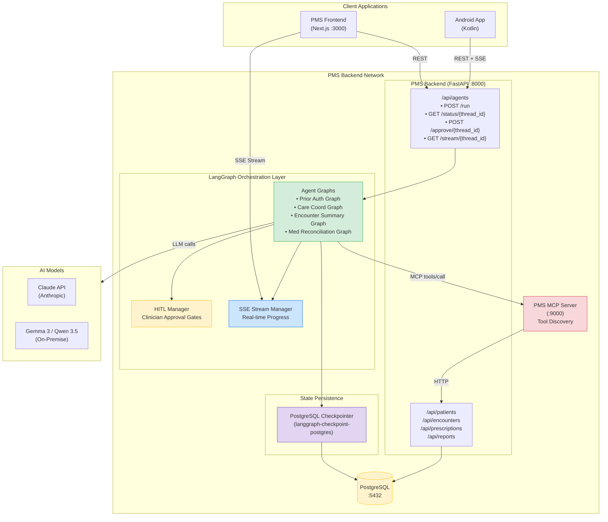

# Product Requirements Document: LangGraph Integration into Patient Management System (PMS)

**Document ID:** PRD-PMS-LANGGRAPH-001
**Version:** 1.1
**Date:** 2026-03-09
**Author:** Ammar (CEO, MPS Inc.)
**Status:** Draft

---

## 1. Executive Summary

LangGraph is an open-source agent orchestration framework by LangChain Inc. that models AI workflows as stateful, directed graphs. Unlike simple LLM chains that execute linearly, LangGraph represents each step — LLM call, tool invocation, human approval gate — as a **node** in a graph, with **edges** defining transitions, conditions, and loops. The framework reached its 1.0 GA milestone in October 2025 and is now in production at companies including Uber, LinkedIn, and Klarna, making it the most mature durable agent framework available. The 1.0 release is stability-focused with zero breaking changes to core graph primitives (state, nodes, edges), while deprecating `langgraph.prebuilt` in favor of `langchain.agents` with a new middleware system for agent customization.

Integrating LangGraph into the PMS addresses a critical architectural gap: **the lack of a durable, stateful orchestration layer for multi-step clinical AI workflows**. Today, PMS AI features (OpenClaw skills, Adaptive Thinking reasoning, MedASR transcription pipelines) each implement their own state management, retry logic, and human-in-the-loop patterns. LangGraph unifies these into a single framework with built-in checkpointing, fault tolerance, and human approval gates — capabilities that directly map to clinical workflow requirements where processes span hours or days (prior authorization, care coordination, multi-provider referral chains).

The integration leverages LangGraph's PostgreSQL checkpointer (`langgraph-checkpoint-postgres`) to persist workflow state in the same database the PMS already uses, its first-class HITL (Human-in-the-Loop) API for clinician approval gates, and its SSE/WebSocket streaming for real-time progress updates to the Next.js frontend and Android app. Combined with the existing MCP server (Experiment 09), LangGraph agents discover and invoke PMS tools through the standardized protocol, while LangGraph manages the orchestration, state, and control flow.

---

## 2. Problem Statement

The current PMS has multiple AI-powered features, each managing workflow state and control flow independently:

- **No durable execution for long-running workflows:** OpenClaw skills run synchronously within a single request. If the server restarts during a 15-minute prior authorization workflow (waiting for insurance payer response), all progress is lost. The clinician must restart from scratch.
- **Inconsistent human-in-the-loop patterns:** OpenClaw implements approval tiers (auto-approve, clinician review, dual approval) using custom code. Adaptive Thinking has its own effort-routing logic. MedASR has no approval mechanism at all. Each feature reinvents the wheel for human oversight.
- **No workflow recovery or replay:** When a multi-step clinical workflow fails at step 4 of 7, there is no mechanism to resume from step 4. The entire workflow must be re-executed, wasting time and API calls.
- **Blind orchestration:** The frontend cannot show real-time progress of multi-step AI workflows. The user sees a spinner and waits. There is no streaming of intermediate state, no progress indicators, no ability to inspect what the agent is doing at each step.
- **Scaling limitation for complex clinical agents:** Building a care coordination agent that contacts multiple specialists, waits for responses over days, reconciles availability, and books appointments requires durable state management that survives server restarts, deployments, and process recycling. The PMS has no framework for this.
- **No standardized agent testing:** Each AI feature tests its workflows differently. There is no common pattern for testing stateful agent graphs with deterministic inputs and assertions on intermediate state.

---

## 3. Proposed Solution

Build a **PMS Agent Orchestration Layer** using LangGraph that serves as the stateful execution engine for all multi-step clinical AI workflows. LangGraph graphs define the control flow, the PostgreSQL checkpointer provides durability, and the existing MCP server (Experiment 09) provides tool access to PMS APIs.

### 3.1 Architecture Overview

### 3.2 Deployment Model

- **Self-hosted, embedded in PMS Backend:** LangGraph runs as a Python library within the existing FastAPI process — no separate service. Agent graph definitions, the checkpointer, and HITL endpoints are added to the FastAPI application.
- **Docker-based:** Included in the existing `pms-backend` Docker image. No additional containers required.
- **PostgreSQL checkpointer:** Uses the existing PMS PostgreSQL database. Checkpoint tables are created via a migration script. PHI is stored in the same security envelope as all other PMS data.
- **HIPAA alignment:** All agent state (including intermediate LLM responses, tool call results, and HITL approval records) is stored in PostgreSQL with the same AES-256 encryption, row-level access control, and audit logging as patient records.

---

## 4. PMS Data Sources

LangGraph agents access PMS data exclusively through the MCP server (Experiment 09), which provides tool discovery and invocation for:

| PMS API | MCP Tool | Agent Use Case |
|---|---|---|
| Patient Records (`/api/patients`) | `search_patients`, `get_patient` | Load patient demographics, insurance info for prior auth |
| Encounter Records (`/api/encounters`) | `list_encounters`, `create_encounter_note` | Retrieve visit history, create AI-generated encounter summaries |
| Medication & Prescription (`/api/prescriptions`) | `list_prescriptions`, `check_interactions` | Medication reconciliation, drug interaction checking |
| Reporting (`/api/reports`) | `generate_report`, `get_quality_metrics` | Generate compliance reports, quality dashboard data |

LangGraph does not access the database directly. All data flows through MCP → PMS Backend → PostgreSQL, maintaining the existing security and authorization boundaries.

---

## 5. Component/Module Definitions

### 5.1 Graph Registry

**Description:** Central registry of all LangGraph agent graphs available in the PMS. Each graph is a Python module with a compiled `StateGraph` and its associated state schema.

**Input:** Graph name, thread ID, initial state (patient ID, encounter ID, etc.)
**Output:** Compiled graph instance ready for execution
**PMS APIs Used:** None (registry only)

### 5.2 Prior Authorization Graph

**Description:** Multi-step workflow that automates prior authorization for medications and procedures. Gathers patient data, checks insurance eligibility, assembles clinical justification, submits to payer, waits for response, and handles appeals.

**Input:** Patient ID, medication/procedure code, prescribing clinician ID
**Output:** Authorization status (approved/denied/pending), reference number, clinical documentation
**PMS APIs Used:** `get_patient`, `list_encounters`, `list_prescriptions`, `generate_report`

### 5.3 Encounter Summary Graph

**Description:** Generates structured encounter notes (SOAP format) from raw clinical data, transcription text, and vitals. Supports clinician review and editing before finalization.

**Input:** Encounter ID, optional MedASR transcription text
**Output:** Structured SOAP note, ICD-10 code suggestions, follow-up recommendations
**PMS APIs Used:** `get_patient`, `list_encounters`, `list_prescriptions`

### 5.4 Medication Reconciliation Graph

**Description:** Compares a patient's current medication list against a new prescription or admission medication list. Identifies duplicates, interactions, and gaps.

**Input:** Patient ID, new medication list (from admission, transfer, or new prescription)
**Output:** Reconciled list with flags (duplicates, interactions, therapeutic substitutions)
**PMS APIs Used:** `get_patient`, `list_prescriptions`, `check_interactions`

### 5.5 Care Coordination Graph

**Description:** Long-running (hours to days) workflow for specialist referral coordination. Contacts specialists, checks availability, waits for responses, reconciles schedules, and books appointments.

**Input:** Patient ID, referral type, preferred providers, urgency level
**Output:** Confirmed appointment, referral documentation, patient notification
**PMS APIs Used:** `get_patient`, `list_encounters`, `generate_report`

### 5.6 HITL Manager

**Description:** Centralized human-in-the-loop service that manages approval gates across all graphs. Exposes REST endpoints for clinicians to approve, reject, or modify agent decisions.

**Input:** Thread ID, node ID, pending decision data
**Output:** Approval decision (approve/reject/modify), clinician ID, timestamp
**PMS APIs Used:** None (internal orchestration)

### 5.7 Stream Manager

**Description:** SSE (Server-Sent Events) endpoint that streams real-time graph execution progress to the frontend. Each node transition, tool call, and HITL pause generates an event.

**Input:** Thread ID
**Output:** SSE event stream with node transitions, tool results, HITL prompts, completion status
**PMS APIs Used:** None (internal orchestration)

---

## 6. Non-Functional Requirements

### 6.1 Security and HIPAA Compliance

| Requirement | Implementation |
|---|---|
| PHI in agent state | All checkpoint data stored in PostgreSQL with existing AES-256 encryption |
| Access control | Agent execution requires authenticated clinician session. HITL approvals tied to clinician identity. |
| Audit trail | Every node execution, tool call, HITL decision, and state mutation logged to `agent_audit_log` table |
| Data minimization | Agent state is pruned after workflow completion. Only the final output and audit trail are retained. |
| Encryption in transit | All SSE streams and REST calls use TLS 1.2+ |
| Session isolation | Each agent thread is scoped to a single clinician session. No cross-session state leakage. |

### 6.2 Performance

| Metric | Target |
|---|---|
| Graph compilation time | < 50ms |
| Node execution overhead (excluding LLM calls) | < 10ms per node |
| Checkpoint write latency | < 20ms (PostgreSQL) |
| Checkpoint read latency (resume) | < 30ms |
| SSE event delivery latency | < 100ms end-to-end |
| Concurrent agent threads | 50+ per PMS instance |
| State recovery time (after restart) | < 5 seconds for any thread |

### 6.3 Infrastructure

| Requirement | Specification |
|---|---|
| Python | 3.10+ (3.12+ recommended; Python 3.9 dropped in LangGraph 1.0) |
| LangGraph | 1.0+ (`pip install langgraph`) |
| Checkpointer | `langgraph-checkpoint-postgres` (latest) |
| PostgreSQL | 14+ (existing PMS database) |
| Additional containers | None — embedded in `pms-backend` |
| Memory overhead | ~50MB base + ~2MB per active agent thread |
| Disk | Checkpoint data ~10KB per graph step |

---

## 7. Implementation Phases

### Phase 1: Foundation (Sprints 1-2, ~4 weeks)

- Install LangGraph and `langgraph-checkpoint-postgres` in PMS backend
- Create PostgreSQL migration for checkpoint tables and `agent_audit_log`
- Build `GraphRegistry` with graph compilation and thread management
- Implement `HITL Manager` REST endpoints (`/api/agents/approve/{thread_id}`)
- Build the **Encounter Summary Graph** as the first proof-of-concept
- Add basic SSE streaming for graph progress
- Unit tests for graph execution, checkpointing, and HITL flow

### Phase 2: Core Integration (Sprints 3-4, ~4 weeks)

- Build the **Prior Authorization Graph** with insurance eligibility and payer submission nodes
- Build the **Medication Reconciliation Graph** with drug interaction checking
- Connect all graphs to the PMS MCP server for tool discovery and invocation
- Add Next.js frontend components: Agent Progress Panel, HITL Approval Modal, Workflow History
- Add Android agent status polling and approval notifications
- Integration tests for graph ↔ MCP ↔ PMS API data flow
- Audit logging for all agent operations

### Phase 3: Advanced Features (Sprints 5-6, ~4 weeks)

- Build the **Care Coordination Graph** (multi-day durable execution)
- Implement graph versioning and migration (update graph definitions without losing in-flight state)
- Add agent analytics dashboard (execution time, failure rates, HITL approval rates per graph)
- Build graph composition — nested subgraphs for reusable clinical sub-workflows
- Performance optimization: checkpoint pruning, state compaction, connection pooling
- Load testing: 50+ concurrent agent threads

---

## 8. Success Metrics

| Metric | Target | Measurement Method |
|---|---|---|
| Prior auth automation rate | 70% auto-completed without clinician intervention | Agent completion logs |
| Encounter summary acceptance rate | 85% accepted with minor or no edits | HITL approval records |
| Workflow recovery success rate | 99% successful resume after interruption | Checkpoint recovery tests |
| HITL response time | < 2 minutes median for clinician approval | HITL timestamp deltas |
| Agent failure rate | < 2% unrecoverable failures | Agent audit logs |
| Frontend progress visibility | 100% of graph steps visible in real-time | SSE event completeness |
| Code reduction | 40% less orchestration code vs custom implementations | Lines of code comparison |

---

## 9. Risks and Mitigations

| Risk | Impact | Mitigation |
|---|---|---|
| Checkpoint data growth fills PostgreSQL | High — affects all PMS operations | Implement checkpoint pruning: retain last 5 checkpoints per thread, archive completed threads after 30 days |
| LLM API failures during graph execution | Medium — workflow stalls | LangGraph's built-in retry at superstep level. Configurable retry count per node. Fallback to on-premise models (Gemma 3 / Qwen 3.5) |
| HITL approval delays block workflows | Medium — patient care delayed | Configurable timeout per approval gate. Escalation to supervisor after timeout. Default-approve for low-risk decisions |
| LangGraph breaking changes | Medium — requires migration | Pin to 1.0.x. Monitor changelog. LangGraph 1.0 guarantees no breaking changes until 2.0. Note: `langgraph.prebuilt` is deprecated in 1.0 (removed in 2.0) — use `langchain.agents.create_agent` instead |
| PHI leakage in agent state | High — HIPAA violation | All state in encrypted PostgreSQL. No external state stores. State pruned after completion. Audit logging |
| Vendor lock-in to LangChain ecosystem | Low — LangGraph is open-source | MIT license. Graph definitions are portable Python. Checkpointer interface is pluggable |
| Concurrent agent thread resource exhaustion | Medium — backend degradation | Thread pool limits. Memory monitoring. Graceful backpressure via queue |

---

## 10. Dependencies

| Dependency | Type | Version | Notes |
|---|---|---|---|
| `langgraph` | Python package | 1.0+ | Core graph orchestration |
| `langgraph-checkpoint-postgres` | Python package | Latest | PostgreSQL checkpoint persistence |
| `psycopg[binary,pool]` | Python package | 3.x | PostgreSQL driver for checkpointer |
| `langchain-anthropic` | Python package | Latest | Claude model integration |
| `langchain` | Python package | 1.0+ | High-level agent API (`create_agent`), middleware |
| `langchain-core` | Python package | 1.0+ | Base abstractions (messages, chat models, tools) |
| PMS MCP Server (Experiment 09) | Internal service | :9000 | Tool discovery and invocation |
| PMS Backend (FastAPI) | Internal service | :8000 | REST API and agent endpoints |
| PostgreSQL | Database | 14+ | Checkpoint storage and audit logs |
| Claude API (Anthropic) | External API | — | Primary LLM for agent reasoning |
| Gemma 3 / Qwen 3.5 (Experiments 13/20) | On-premise models | — | Fallback LLMs for PHI-sensitive or high-volume tasks |

---

## 11. Comparison with Existing Experiments

| Aspect | LangGraph (Experiment 26) | OpenClaw (Experiment 05) | MCP (Experiment 09) |
|---|---|---|---|
| **Purpose** | Stateful workflow orchestration | Autonomous task execution | Universal tool/data protocol |
| **State management** | Built-in durable checkpointing | Custom per-skill state | Stateless protocol |
| **Human-in-the-loop** | First-class API with pause/resume | Custom approval tier system | Not applicable |
| **Fault tolerance** | Automatic resume from last checkpoint | None — restart from beginning | Not applicable |
| **Multi-step workflows** | Native graph with cycles and branches | Linear skill execution | Not applicable |
| **Relationship** | **Uses** MCP for tool access. **Replaces** OpenClaw's custom orchestration. | LangGraph becomes the execution engine for OpenClaw-style workflows. | LangGraph agents are MCP clients. |

LangGraph is **complementary to MCP** and **a successor to OpenClaw's orchestration layer**. MCP provides the tools; LangGraph orchestrates when and how they are called. OpenClaw's domain-specific skills (prior auth logic, clinical justification) become nodes in LangGraph graphs, gaining durable state and HITL for free.

---

## 11.1 LangGraph 1.0 GA Migration Notes

LangGraph 1.0 was released in October 2025 as a stability-focused release. The PMS integration should follow these migration guidelines:

### Deprecated Items (to be removed in 2.0)

| Deprecated | Replacement | PMS Impact |
|---|---|---|
| `langgraph.prebuilt.create_react_agent` | `langchain.agents.create_agent` | Not used — PMS builds custom `StateGraph` graphs directly |
| `langgraph.prebuilt.AgentState` | `langchain.agents.AgentState` | Not used — PMS uses custom `PmsAgentState` extending `MessagesState` |
| `langgraph.prebuilt.HumanInterruptConfig` | `langchain.agents.middleware.human_in_the_loop.InterruptOnConfig` | Not used — PMS uses `interrupt()` directly |
| `langgraph.prebuilt.HumanInterrupt` | `langchain.agents.middleware.human_in_the_loop.HITLRequest` | Not used — PMS implements custom HITL Manager |
| `langgraph.prebuilt.ValidationNode` | Automatic validation in `create_agent` | Not used |
| `MessageGraph` | `StateGraph` with `messages` key | Not used — PMS already uses `StateGraph` |
| `prompt` parameter in `create_react_agent` | `system_prompt` parameter in `create_agent` | Not used |

### What Changed

- **Core graph primitives unchanged:** `StateGraph`, nodes, edges, `interrupt()`, checkpointers — all stable. No code changes needed for PMS graphs.
- **Middleware system:** `langchain.agents.create_agent` introduces a middleware pipeline for cross-cutting concerns (logging, auth, rate limiting). PMS can adopt this for standardized audit logging across all agent graphs.
- **Interrupt class simplified:** The `Interrupt` dataclass now uses two fields (`value`, `id`) instead of the previous four. This is backward-compatible — existing `interrupt()` calls work unchanged.
- **Python 3.10+ required:** All LangChain/LangGraph packages dropped Python 3.9 support (EOL October 2025). PMS already requires 3.12+.
- **Stability guarantee:** No breaking changes until LangGraph 2.0. Safe to pin `langgraph>=1.0,<2.0`.

### PMS Migration Checklist

- [x] Verify no imports from `langgraph.prebuilt` (PMS uses custom graphs — not affected)
- [x] Update `langchain-core` dependency from `0.3+` to `1.0+`
- [x] Add `langchain>=1.0` to dependencies (for future `create_agent` middleware adoption)
- [ ] Evaluate `create_agent` middleware for standardized audit logging across graphs
- [ ] Update CI/CD to test against `langgraph>=1.0,<2.0` version range

---

## 12. Research Sources

### Official Documentation
- [LangGraph Overview — LangChain Docs](https://docs.langchain.com/oss/python/langgraph/overview) — Core concepts, state management, architecture
- [LangGraph GitHub Repository](https://github.com/langchain-ai/langgraph) — Source code, examples, issue tracker
- [LangGraph 1.0 GA Announcement](https://blog.langchain.com/langchain-langgraph-1dot0/) — Release details, production adoption at Uber/LinkedIn/Klarna
- [What's New in LangGraph v1](https://docs.langchain.com/oss/python/releases/langgraph-v1) — Stability focus, deprecated items, integration with LangChain v1
- [LangGraph v1 Migration Guide](https://docs.langchain.com/oss/python/migrate/langgraph-v1) — Deprecated imports, `create_react_agent` → `create_agent`, middleware system

### Architecture & Integration
- [LangGraph Persistence — LangChain Docs](https://docs.langchain.com/oss/python/langgraph/persistence) — Checkpointer architecture, PostgreSQL integration
- [LangGraph Streaming — LangChain Docs](https://docs.langchain.com/oss/python/langgraph/streaming) — SSE, WebSocket, streaming modes
- [FastAPI + LangGraph Production Template — GitHub](https://github.com/wassim249/fastapi-langgraph-agent-production-ready-template) — Production-ready FastAPI integration patterns
- [LangGraph HITL with FastAPI — Medium](https://shaveen12.medium.com/langgraph-human-in-the-loop-hitl-deployment-with-fastapi-be4a9efcd8c0) — HITL deployment patterns

### Security & Compliance
- [HIPAA Compliance for GenAI on AWS — Amazon](https://aws.amazon.com/blogs/industries/hipaa-compliance-for-generative-ai-solutions-on-aws/) — HIPAA-compliant LLM deployment patterns
- [Secure Tool Calling with LangGraph — Auth0](https://auth0.com/blog/secure-third-party-tool-calling-python-fastapi-auth0-langchain-langgraph/) — OAuth2 + tool calling security

### Ecosystem & Comparison
- [LangGraph vs CrewAI vs AutoGen — DataCamp](https://www.datacamp.com/tutorial/crewai-vs-langgraph-vs-autogen) — Framework comparison for production use
- [AI Agent Frameworks 2026 — Turing](https://www.turing.com/resources/ai-agent-frameworks) — Industry landscape and framework selection criteria

---

## 13. Appendix: Related Documents

- [LangGraph Setup Guide](26-LangGraph-PMS-Developer-Setup-Guide.md)
- [LangGraph Developer Tutorial](26-LangGraph-Developer-Tutorial.md)
- [PRD: MCP PMS Integration (Experiment 09)](09-PRD-MCP-PMS-Integration.md) — LangGraph agents use MCP for tool access
- [PRD: OpenClaw PMS Integration (Experiment 05)](05-PRD-OpenClaw-PMS-Integration.md) — LangGraph replaces OpenClaw's orchestration layer
- [PRD: Adaptive Thinking PMS Integration (Experiment 08)](08-PRD-AdaptiveThinking-PMS-Integration.md) — Effort routing can be a node in LangGraph graphs
- [LangGraph Official Documentation](https://docs.langchain.com/oss/python/langgraph/overview)
