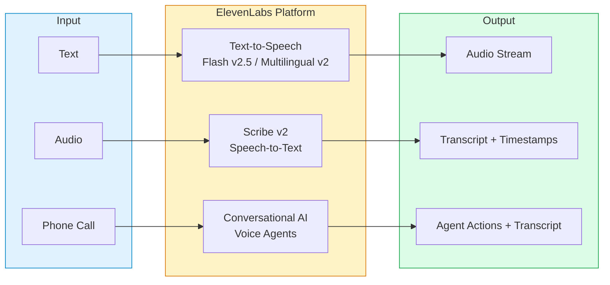
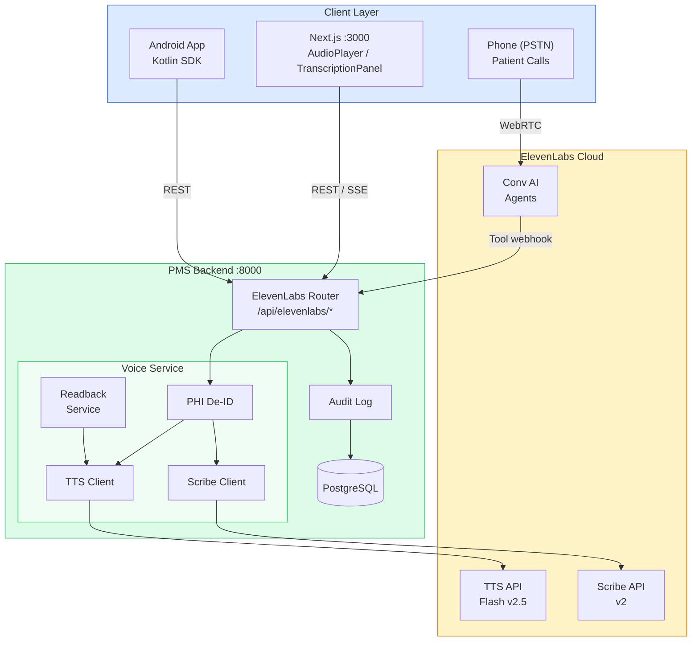

# ElevenLabs Developer Onboarding Tutorial

**Welcome to the MPS PMS ElevenLabs Integration Team**

This tutorial will take you from zero to building your first ElevenLabs voice AI integration with the PMS. By the end, you will understand how ElevenLabs TTS, Scribe STT, and Conversational AI agents work, have a running local environment, and have built and tested a clinical readback and transcription pipeline end-to-end.

**Document ID:** PMS-EXP-ELEVENLABS-002
**Version:** 1.0
**Date:** March 3, 2026
**Applies To:** PMS project (all platforms)
**Prerequisite:** [ElevenLabs Setup Guide](30-ElevenLabs-PMS-Developer-Setup-Guide.md)
**Estimated time:** 2-3 hours
**Difficulty:** Beginner-friendly

---

## What You Will Learn

1. What ElevenLabs is and why the PMS uses it for voice AI
2. How text-to-speech works with Flash v2.5 and Multilingual v2 models
3. How Scribe v2 achieves industry-leading speech-to-text accuracy
4. How to build a clinical content readback pipeline end-to-end
5. How PHI de-identification protects patient data before TTS synthesis
6. How to integrate Scribe as a cloud ASR fallback for clinical dictation
7. How streaming audio delivery works via SSE and WebSocket
8. How Conversational AI agents handle patient phone interactions
9. How ElevenLabs complements on-premise ASR (MedASR, Voxtral, Speechmatics)
10. HIPAA compliance requirements for cloud-hosted voice AI in healthcare

---

## Part 1: Understanding ElevenLabs (15 min read)

### 1.1 What Problem Does ElevenLabs Solve?

Clinical staff at a PMS-powered clinic face three voice-related challenges daily:

> *During a wound dressing change, the nurse needs the patient's medication list read aloud — her hands are occupied and she can't look at the screen.*

> *The front desk receives 200+ calls per day for appointment scheduling and prescription refills. After hours, there is zero coverage.*

> *The clinic wants a cloud transcription option when the on-premise GPU running MedASR is at capacity during peak morning dictation.*

ElevenLabs solves all three by providing:
- **Text-to-Speech (Flash v2.5):** Ultra-realistic speech synthesis in ~75ms, enabling hands-free clinical content delivery
- **Scribe v2:** Industry-leading 3.1% WER speech-to-text with 99-language support, speaker diarization, and entity detection
- **Conversational AI 2.0:** Full voice agent platform for patient-facing phone interactions with tool integration, custom LLM backends, and HIPAA compliance

### 1.2 How ElevenLabs Works — The Key Pieces



**Three independent capabilities:**

1. **TTS (Text-to-Speech):** Send text, receive audio. Choose between Flash v2.5 (~75ms, 32 languages) for real-time and Multilingual v2 (highest quality, emotional range) for pre-rendered content.

2. **Scribe (Speech-to-Text):** Send audio, receive transcript. Scribe v2 provides word-level timestamps, speaker diarization, audio event tags, and entity detection (names, medical terms, SSNs). Scribe v2 Realtime adds <150ms live transcription.

3. **Conversational AI (Voice Agents):** Full-duplex voice conversations via WebSocket/WebRTC. Agents combine TTS + STT + LLM + tools into a managed platform. The agent listens, understands, reasons (using Claude, GPT, Gemini, or custom LLM), speaks back, and can trigger tool actions (book appointment, look up patient).

### 1.3 How ElevenLabs Fits with Other PMS Technologies

| Capability | ElevenLabs (Exp 30) | MedASR (Exp 7) | Speechmatics (Exp 10) | Voxtral (Exp 21) |
|-----------|---------------------|----------------|----------------------|-------------------|
| Text-to-Speech | Flash v2.5, Multilingual v2 | - | - | - |
| Speech-to-Text | Scribe v2 (3.1% WER) | Custom medical (8% WER) | Cloud API (5% WER) | Open-weight (6% WER) |
| Voice Agents | Conversational AI 2.0 | - | - | - |
| Deployment | Cloud (managed) | On-premise GPU | Cloud API | On-premise GPU |
| HIPAA | BAA + zero-retention | Inherent (on-prem) | BAA available | Inherent (on-prem) |
| Best For | TTS readback, phone agents, cloud ASR | PHI-heavy dictation | Real-time medical transcription | Offline/edge ASR |

### 1.4 Key Vocabulary

| Term | Meaning |
|------|---------|
| Flash v2.5 | ElevenLabs' fastest TTS model — ~75ms latency, 32 languages |
| Multilingual v2 | Highest quality TTS model — emotional awareness, premium voices |
| Scribe v2 | ElevenLabs' STT model — 3.1% WER, 99 languages, diarization |
| Voice ID | Unique identifier for a TTS voice (built-in, cloned, or designed) |
| Voice Cloning | Creating a digital replica of a voice from audio samples |
| Diarization | Identifying which speaker said what in multi-speaker audio |
| Zero-retention mode | ElevenLabs retains no audio/text data after processing — required for HIPAA |
| Conversational AI | Full voice agent platform with LLM, TTS, STT, and tool calling |
| Agent Tools | Webhook integrations allowing voice agents to call external APIs |
| BAA | Business Associate Agreement — HIPAA requirement for cloud PHI processing |

### 1.5 Our Architecture



---

## Part 2: Environment Verification (15 min)

### 2.1 Checklist

Run each command and confirm the expected output:

1. **Python SDK installed:**
   ```bash
   python3 -c "from elevenlabs import ElevenLabs; print('OK')"
   ```
   Expected: `OK`

2. **API key configured:**
   ```bash
   python3 -c "import os; k=os.environ.get('ELEVENLABS_API_KEY',''); print(f'Key: {k[:8]}...' if k else 'MISSING')"
   ```
   Expected: `Key: xi-abc12...` (first 8 chars)

3. **Backend running:**
   ```bash
   curl -s http://localhost:8000/health | python3 -m json.tool
   ```
   Expected: JSON with `"status": "ok"`

4. **ElevenLabs connectivity:**
   ```bash
   curl -s http://localhost:8000/api/elevenlabs/health | python3 -m json.tool
   ```
   Expected: `{"status": "healthy", "voices_available": ...}`

5. **Frontend running:**
   ```bash
   curl -s -o /dev/null -w "%{http_code}" http://localhost:3000
   ```
   Expected: `200`

### 2.2 Quick Test

Generate and play a test audio clip:

```bash
curl -s -X POST http://localhost:8000/api/elevenlabs/tts \
  -H "Content-Type: application/json" \
  -d '{"text": "ElevenLabs integration is working. Voice AI is ready.", "strip_phi": false}' \
  --output /tmp/el_test.mp3 && afplay /tmp/el_test.mp3
```

You should hear a natural voice speaking the test sentence.

---

## Part 3: Build Your First Integration — Clinical Readback Pipeline (45 min)

### 3.1 What We Are Building

A **Clinical Readback Pipeline** that:
1. Takes a patient encounter summary from the PMS database
2. Strips all PHI (names, MRNs, dates) via the De-ID Gateway
3. Sends the de-identified text to ElevenLabs TTS
4. Streams the audio back to the clinician's browser in real-time
5. Logs the interaction for HIPAA audit compliance

This enables hands-free review of encounter summaries during procedures.

### 3.2 Step 1: Create the Readback Pipeline Module

Create `pms-backend/app/integrations/elevenlabs/readback.py`:

```python
"""Clinical readback pipeline — encounter summaries, med lists, lab results."""

from __future__ import annotations

import logging
from dataclasses import dataclass
from typing import AsyncIterator

from app.integrations.gemini.deidentify import deidentify_text, DeidentificationResult
from .tts import ElevenLabsTTSClient

logger = logging.getLogger(__name__)


@dataclass
class ReadbackResult:
    """Result of a clinical readback operation."""
    audio: bytes
    phi_stripped: int
    content_type: str
    character_count: int


READBACK_PROMPTS = {
    "encounter_summary": (
        "The following is a clinical encounter summary. "
        "Read it clearly and at a moderate pace suitable for a clinician."
    ),
    "medication_list": (
        "The following is a patient medication list. "
        "Read each medication name, dosage, and frequency clearly. "
        "Pause briefly between medications."
    ),
    "lab_results": (
        "The following are laboratory results. "
        "Read each test name and result clearly, emphasizing any abnormal values."
    ),
}


class ClinicalReadbackPipeline:
    """Orchestrates PHI-safe clinical content readback via ElevenLabs TTS."""

    def __init__(self, tts_client: ElevenLabsTTSClient | None = None) -> None:
        self.tts = tts_client or ElevenLabsTTSClient()

    async def readback(
        self,
        content: str,
        content_type: str = "encounter_summary",
        *,
        voice_id: str | None = None,
    ) -> ReadbackResult:
        """Generate audio readback of clinical content.

        1. De-identifies PHI from content
        2. Prepends content-type context for better prosody
        3. Synthesizes audio via ElevenLabs TTS
        4. Returns audio bytes and metadata
        """
        # Step 1: De-identify
        deid: DeidentificationResult = deidentify_text(content)
        if deid.phi_count > 0:
            logger.info(
                "Readback: stripped %d PHI elements from %s",
                deid.phi_count,
                content_type,
            )

        # Step 2: Build TTS input
        prompt = READBACK_PROMPTS.get(content_type, "")
        tts_input = f"{prompt}\n\n{deid.clean_text}" if prompt else deid.clean_text

        # Step 3: Synthesize
        audio = await self.tts.synthesize(
            tts_input,
            voice_id=voice_id,
        )

        return ReadbackResult(
            audio=audio,
            phi_stripped=deid.phi_count,
            content_type=content_type,
            character_count=len(tts_input),
        )

    async def readback_stream(
        self,
        content: str,
        content_type: str = "encounter_summary",
        *,
        voice_id: str | None = None,
    ) -> AsyncIterator[bytes]:
        """Stream audio readback chunks for real-time playback."""
        deid = deidentify_text(content)
        prompt = READBACK_PROMPTS.get(content_type, "")
        tts_input = f"{prompt}\n\n{deid.clean_text}" if prompt else deid.clean_text

        async for chunk in self.tts.synthesize_stream(
            tts_input, voice_id=voice_id
        ):
            yield chunk
```

### 3.3 Step 2: Add the Readback API Endpoint

Add to `pms-backend/app/api/routes/elevenlabs.py` (append after existing endpoints):

```python
from app.integrations.elevenlabs.readback import ClinicalReadbackPipeline

_readback_pipeline: ClinicalReadbackPipeline | None = None


def _get_readback() -> ClinicalReadbackPipeline:
    global _readback_pipeline
    if _readback_pipeline is None:
        _readback_pipeline = ClinicalReadbackPipeline()
    return _readback_pipeline


@router.post("/readback/stream")
async def stream_clinical_readback(req: ReadbackRequest):
    """Stream clinical readback audio for real-time playback."""
    pipeline = _get_readback()

    async def audio_gen():
        async for chunk in pipeline.readback_stream(
            content=req.content,
            content_type=req.content_type,
            voice_id=req.voice_id,
        ):
            yield chunk

    return StreamingResponse(
        audio_gen(),
        media_type="audio/mpeg",
        headers={"Cache-Control": "no-cache", "X-Accel-Buffering": "no"},
    )
```

### 3.4 Step 3: Build the Frontend Readback Component

Create `pms-frontend/src/components/elevenlabs/EncounterReadback.tsx`:

```tsx
"use client";

import { useRef, useState } from "react";

interface EncounterReadbackProps {
  encounterId: string;
  summary: string;
}

export function EncounterReadback({ encounterId, summary }: EncounterReadbackProps) {
  const [status, setStatus] = useState<"idle" | "loading" | "playing">("idle");
  const audioRef = useRef<HTMLAudioElement>(null);

  async function handleReadback() {
    setStatus("loading");

    try {
      const res = await fetch("/api/elevenlabs/readback", {
        method: "POST",
        headers: { "Content-Type": "application/json" },
        body: JSON.stringify({
          content_type: "encounter_summary",
          content: summary,
        }),
      });

      if (!res.ok) throw new Error("Readback failed");

      const blob = await res.blob();
      const url = URL.createObjectURL(blob);

      if (audioRef.current) {
        audioRef.current.src = url;
        audioRef.current.onplay = () => setStatus("playing");
        audioRef.current.onended = () => setStatus("idle");
        audioRef.current.onerror = () => setStatus("idle");
        audioRef.current.play();
      }
    } catch (err) {
      console.error("Readback error:", err);
      setStatus("idle");
    }
  }

  function handleStop() {
    if (audioRef.current) {
      audioRef.current.pause();
      audioRef.current.currentTime = 0;
    }
    setStatus("idle");
  }

  const buttonLabel = {
    idle: "Read Summary Aloud",
    loading: "Generating Audio...",
    playing: "Stop",
  }[status];

  const buttonClass = {
    idle: "bg-indigo-600 hover:bg-indigo-700",
    loading: "bg-gray-400 cursor-wait",
    playing: "bg-red-600 hover:bg-red-700",
  }[status];

  return (
    <div className="flex items-center gap-3">
      <button
        onClick={status === "playing" ? handleStop : handleReadback}
        disabled={status === "loading"}
        className={`rounded px-3 py-1.5 text-xs font-medium text-white ${buttonClass}`}
      >
        {buttonLabel}
      </button>
      <span className="text-xs text-gray-400">
        Encounter {encounterId}
      </span>
      <audio ref={audioRef} className="hidden" />
    </div>
  );
}
```

### 3.5 Step 4: Test the Full Pipeline

```bash
# Test the readback pipeline with a realistic encounter summary
curl -s -X POST http://localhost:8000/api/elevenlabs/readback \
  -H "Content-Type: application/json" \
  -d '{
    "content_type": "encounter_summary",
    "content": "Patient Jane Doe, MRN 9876543, presented on 02/15/2026 with chief complaint of persistent cough for 2 weeks. Vitals: BP 128/82, HR 76, Temp 98.6F, SpO2 98%. Lung exam revealed bilateral wheezing. Assessment: Acute bronchitis. Plan: Prescribed azithromycin 250mg, 2 tabs day 1 then 1 tab daily x4 days. Albuterol inhaler PRN. Follow-up in 1 week if symptoms persist."
  }' --output /tmp/encounter_readback.mp3

afplay /tmp/encounter_readback.mp3
```

The audio should read the encounter summary naturally, with PHI placeholders replacing "Jane Doe", "9876543", and "02/15/2026".

### 3.6 Step 5: Add Medication List Readback

Test with a medication list:

```bash
curl -s -X POST http://localhost:8000/api/elevenlabs/readback \
  -H "Content-Type: application/json" \
  -d '{
    "content_type": "medication_list",
    "content": "1. Metformin 500mg - Take twice daily with meals for type 2 diabetes. 2. Lisinopril 10mg - Take once daily for hypertension. 3. Atorvastatin 20mg - Take once daily at bedtime for hyperlipidemia. 4. Aspirin 81mg - Take once daily for cardioprotection. 5. Omeprazole 20mg - Take once daily before breakfast for GERD."
  }' --output /tmp/med_readback.mp3

afplay /tmp/med_readback.mp3
```

The TTS should pause between medications for clarity.

---

## Part 4: Evaluating Strengths and Weaknesses (15 min)

### 4.1 Strengths

- **Industry-leading voice quality:** Flash v2.5 produces the most natural-sounding TTS available, critical for patient-facing interactions
- **Ultra-low latency:** ~75ms model inference for Flash v2.5, enabling real-time conversational AI
- **Full-stack voice platform:** TTS + STT + Voice Agents in one platform reduces integration complexity
- **Scribe accuracy:** 3.1% WER outperforms all competitors on the FLEURS benchmark
- **Language coverage:** 32 languages for TTS, 99 for STT — critical for diverse patient populations
- **HIPAA-ready:** Enterprise tier with BAA, zero-retention mode, SOC 2, and GDPR compliance
- **Native SDKs:** Python, JavaScript/React, Kotlin, and Swift SDKs for all PMS platforms
- **Voice cloning:** Create custom clinic voices for consistent branding across all patient touchpoints

### 4.2 Weaknesses

- **Cloud-only:** No on-premise deployment option — all audio data must leave the network (mitigated by zero-retention mode)
- **Cost at scale:** Usage-based pricing can become expensive with high TTS/STT volume — $99-330+/month base plus overages
- **Enterprise-only HIPAA:** BAA requires Enterprise subscription — development and testing on lower tiers cannot use real PHI
- **Voice agent complexity:** Full voice agent deployment requires Twilio/SIP integration, tool webhook infrastructure, and LLM configuration
- **Limited medical vocabulary for TTS:** Pronunciation of drug names and medical terminology may need voice settings tuning
- **Dependency on external service:** Any ElevenLabs outage affects all voice features — requires failover to on-premise ASR

### 4.3 When to Use ElevenLabs vs Alternatives

| Scenario | Best Choice | Why |
|----------|-------------|-----|
| Hands-free clinical readback | **ElevenLabs TTS** | Only option with high-quality TTS |
| PHI-heavy dictation | **MedASR / Voxtral** | Data stays on-premise |
| Patient phone interactions | **ElevenLabs Conv AI** | Only option with voice agents |
| Real-time clinical transcription | **Speechmatics** or **Scribe** | Both offer real-time cloud STT |
| Batch transcription (high accuracy) | **ElevenLabs Scribe** | Lowest WER (3.1%) |
| Offline/edge transcription | **Voxtral** | Runs on-premise without internet |
| Multilingual patients | **ElevenLabs** | 99 language STT, 32 language TTS |

### 4.4 HIPAA / Healthcare Considerations

1. **BAA is mandatory:** Enterprise tier required for any PHI interaction — no exceptions
2. **Zero-retention mode:** Must be enabled — ElevenLabs retains no audio or text data
3. **PHI de-identification:** Always strip PHI before TTS synthesis as a defense-in-depth measure, even with BAA
4. **Voice agent data flow:** Agents access PMS data via tool webhooks — PHI should not be embedded in agent system prompts
5. **Audit logging:** Log every TTS generation, transcription, and agent conversation with metadata (no content)
6. **Voice cloning consent:** Patient voices must NEVER be cloned. Only use approved clinic voices with documented consent
7. **Data residency:** For EU patients, enable EU data residency option in ElevenLabs settings

---

## Part 5: Debugging Common Issues (15 min read)

### Issue 1: TTS Audio Sounds Robotic

**Symptom:** Generated speech lacks natural prosody and sounds monotone.
**Cause:** Using Turbo model instead of Flash v2.5, or text lacks punctuation.
**Fix:** Ensure `ELEVENLABS_TTS_MODEL=eleven_flash_v2_5`. Add proper punctuation and sentence breaks to input text. Use `...` for pauses and `!` for emphasis.

### Issue 2: Scribe Misses Medical Terminology

**Symptom:** Drug names and medical terms are transcribed incorrectly.
**Cause:** No custom vocabulary configured.
**Fix:** Pass `custom_vocabulary` with common medical terms: `["metformin", "lisinopril", "atorvastatin", "azithromycin", "albuterol"]`.

### Issue 3: Streaming Audio Gaps

**Symptom:** Audio playback has gaps or stuttering during streaming.
**Cause:** Network latency or buffer underrun.
**Fix:** Pre-buffer 2-3 chunks before starting playback. Use `mp3_44100_128` format for consistent chunk sizes. Ensure `X-Accel-Buffering: no` header is set.

### Issue 4: 403 Forbidden on Agent Tools

**Symptom:** Voice agent cannot call PMS backend tool webhooks.
**Cause:** CORS or authentication blocking the callback.
**Fix:** Ensure the webhook endpoint allows requests from ElevenLabs IP ranges. Add the agent's callback token to your allowed headers.

### Issue 5: Voice Agent Hangs During Call

**Symptom:** Patient hears silence after asking a question.
**Cause:** Custom LLM timeout or tool webhook not responding within 5 seconds.
**Fix:** Set aggressive timeouts on tool webhooks (3s max). Use cached responses for common queries. Add a "thinking" audio cue while waiting.

### Reading Logs

```bash
# Backend ElevenLabs logs
grep "elevenlabs" pms-backend/logs/app.log | tail -20

# Check for PHI de-identification events
grep "PHI" pms-backend/logs/app.log | grep "elevenlabs"

# ElevenLabs API response times
grep "api.elevenlabs.io" pms-backend/logs/app.log | grep "ms"
```

---

## Part 6: Practice Exercises (45 min)

### Exercise 1: Multi-Voice Medication Review

Build a TTS endpoint that reads a medication list using **different voices** for different sections:
- Use a professional male voice for medication names and dosages
- Use a warm female voice for instructions and warnings
- Pause 1 second between medications

**Hints:**
- Call `list_voices()` to find voice IDs with appropriate characteristics
- Synthesize each medication separately with different voice IDs
- Concatenate the audio buffers with silence gaps between them

### Exercise 2: Comparative Transcription Benchmark

Build a test harness that:
1. Takes a sample clinical dictation audio file
2. Sends it to both ElevenLabs Scribe AND the on-premise MedASR
3. Compares WER for each against a reference transcript
4. Outputs a comparison table

**Hints:**
- Use a ~60 second audio clip with medical terminology
- Calculate WER as: (substitutions + insertions + deletions) / total reference words
- Format output as a markdown table

### Exercise 3: Voice Agent for Prescription Refills

Design (do not deploy) a voice agent configuration that:
1. Greets the patient and asks for their name and date of birth
2. Looks up the patient via PMS `/api/patients` tool
3. Lists their active prescriptions
4. Asks which prescription to refill
5. Submits the refill request
6. Confirms the refill and provides pickup instructions

**Hints:**
- Define 3 agent tools: `lookup_patient`, `list_prescriptions`, `submit_refill`
- Write the system prompt with clear guardrails (never provide medical advice, always offer to transfer to staff)
- Consider error paths: patient not found, prescription expired, controlled substance

---

## Part 7: Development Workflow and Conventions

### 7.1 File Organization

```
pms-backend/app/integrations/elevenlabs/
├── __init__.py           # Package exports
├── config.py             # Configuration module (models, voices, formats)
├── tts.py                # Text-to-speech client
├── stt.py                # Scribe speech-to-text client
├── readback.py           # Clinical readback pipeline
└── audit.py              # HIPAA audit logging

pms-backend/app/api/routes/
└── elevenlabs.py         # FastAPI router (/api/elevenlabs/*)

pms-frontend/src/components/elevenlabs/
├── AudioPlayer.tsx       # General TTS player
├── TranscriptionPanel.tsx # Scribe file upload + display
├── ClinicalReadback.tsx  # One-click readback button
└── EncounterReadback.tsx # Encounter-specific readback
```

### 7.2 Naming Conventions

| Item | Convention | Example |
|------|-----------|---------|
| Python modules | snake_case | `tts.py`, `readback.py` |
| Python classes | PascalCase | `ElevenLabsTTSClient` |
| React components | PascalCase | `AudioPlayer.tsx` |
| API endpoints | kebab-case | `/api/elevenlabs/tts/stream` |
| Environment variables | SCREAMING_SNAKE | `ELEVENLABS_API_KEY` |
| Voice ID references | Use constants | `VOICE_CLINICAL_MALE = "JBFqnCBsd6RMkjVDRZzb"` |

### 7.3 PR Checklist

- [ ] PHI de-identification applied to all text sent to ElevenLabs
- [ ] HIPAA audit log entry for every TTS/STT API call
- [ ] No API keys committed to source control
- [ ] Zero-retention mode verified for any PHI-adjacent workflow
- [ ] Error handling with fallback to on-premise ASR where applicable
- [ ] Unit tests for de-identification and audio streaming
- [ ] Frontend components handle loading, error, and empty states
- [ ] Voice IDs referenced via config, not hardcoded in components

### 7.4 Security Reminders

1. **Never log audio content** — only log metadata (duration, character count, voice ID)
2. **Never expose the API key to the frontend** — all calls route through the backend
3. **Never clone patient voices** — only use pre-approved clinic voices
4. **Always use PHI De-ID Gateway** — even with BAA, apply defense-in-depth
5. **Monitor usage** — unexpected spikes may indicate unauthorized access
6. **Rotate API keys quarterly** — follow the PMS key rotation schedule

---

## Part 8: Quick Reference Card

### Key Commands

```bash
# TTS (text to speech)
curl -X POST http://localhost:8000/api/elevenlabs/tts \
  -H "Content-Type: application/json" \
  -d '{"text": "...", "strip_phi": true}' --output audio.mp3

# Streaming TTS
curl -N -X POST http://localhost:8000/api/elevenlabs/tts/stream \
  -H "Content-Type: application/json" \
  -d '{"text": "..."}' --output stream.mp3

# Clinical readback
curl -X POST http://localhost:8000/api/elevenlabs/readback \
  -H "Content-Type: application/json" \
  -d '{"content_type": "medication_list", "content": "..."}'

# Transcription
curl -X POST http://localhost:8000/api/elevenlabs/transcribe \
  -F "file=@audio.mp3" -F "diarize=true"

# List voices
curl http://localhost:8000/api/elevenlabs/voices

# Health check
curl http://localhost:8000/api/elevenlabs/health
```

### Key Files

| File | Purpose |
|------|---------|
| `app/integrations/elevenlabs/config.py` | SDK configuration |
| `app/integrations/elevenlabs/tts.py` | TTS client |
| `app/integrations/elevenlabs/stt.py` | Scribe STT client |
| `app/integrations/elevenlabs/readback.py` | Clinical readback pipeline |
| `app/api/routes/elevenlabs.py` | FastAPI router |
| `src/components/elevenlabs/AudioPlayer.tsx` | Frontend TTS player |
| `src/components/elevenlabs/ClinicalReadback.tsx` | Readback button |

### Key URLs

| Resource | URL |
|----------|-----|
| ElevenLabs Dashboard | https://elevenlabs.io/app |
| API Reference | https://elevenlabs.io/docs/api-reference |
| Voice Library | https://elevenlabs.io/voice-library |
| PMS ElevenLabs API | http://localhost:8000/docs#/elevenlabs |

### Starter Template: TTS Request

```python
from app.integrations.elevenlabs import ElevenLabsTTSClient
from app.integrations.gemini.deidentify import deidentify_text

async def speak_clinical_text(text: str) -> bytes:
    """Generate TTS audio from clinical text with PHI protection."""
    deid = deidentify_text(text)
    client = ElevenLabsTTSClient()
    return await client.synthesize(deid.clean_text)
```

---

## Next Steps

1. Deploy the readback pipeline to the development environment and test with real encounter summaries (using de-identified test data)
2. Benchmark Scribe v2 against MedASR and Speechmatics using the [comparative benchmark exercise](#exercise-2-comparative-transcription-benchmark)
3. Design voice agent workflows for the three priority use cases: appointment scheduling, prescription refills, and symptom triage
4. Review the [PRD Phase 3](30-PRD-ElevenLabs-PMS-Integration.md) for phone integration architecture with Twilio
5. Contact ElevenLabs sales for Enterprise tier evaluation and BAA execution
