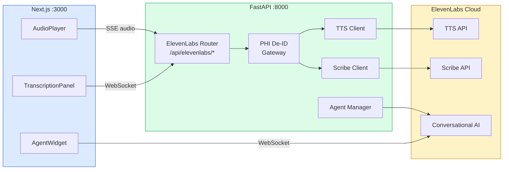

# ElevenLabs Setup Guide for PMS Integration

**Document ID:** PMS-EXP-ELEVENLABS-001
**Version:** 1.0
**Date:** March 3, 2026
**Applies To:** PMS project (all platforms)
**Prerequisites Level:** Intermediate

---

## Table of Contents

1. [Overview](#1-overview)
2. [Prerequisites](#2-prerequisites)
3. [Part A: Install and Configure ElevenLabs SDKs](#3-part-a-install-and-configure-elevenlabs-sdks)
4. [Part B: Integrate with PMS Backend](#4-part-b-integrate-with-pms-backend)
5. [Part C: Integrate with PMS Frontend](#5-part-c-integrate-with-pms-frontend)
6. [Part D: Testing and Verification](#6-part-d-testing-and-verification)
7. [Troubleshooting](#7-troubleshooting)
8. [Reference Commands](#8-reference-commands)

---

## 1. Overview

This guide walks you through adding **ElevenLabs** voice AI capabilities to the PMS stack. By the end you will have:

- The ElevenLabs Python SDK configured in the PMS backend for TTS and Scribe STT
- FastAPI endpoints for text-to-speech streaming, transcription, and voice agent management
- A PHI de-identification gateway preventing patient data from reaching cloud APIs
- Next.js components for TTS audio playback and Scribe real-time transcription
- End-to-end health checks confirming API connectivity

### Architecture at a Glance



---

## 2. Prerequisites

### 2.1 Required Software

| Software | Minimum Version | Check Command |
|----------|----------------|---------------|
| Python | 3.11+ | `python3 --version` |
| Node.js | 20+ | `node --version` |
| PostgreSQL | 15+ | `psql --version` |
| pip | 23+ | `pip --version` |
| ffmpeg (optional) | 6+ | `ffmpeg -version` |

### 2.2 ElevenLabs Account Setup

1. Create an account at [elevenlabs.io](https://elevenlabs.io)
2. Navigate to **Profile Settings > API Keys**
3. Click **Create API Key** and copy it

> **HIPAA WARNING:** Free and Starter plans do NOT support BAAs. For any interaction involving PHI, you must use the **Enterprise** tier with a signed BAA and zero-retention mode enabled. See [HIPAA docs](https://elevenlabs.io/docs/agents-platform/legal/hipaa).

### 2.3 Verify PMS Services

```bash
# Backend health check
curl -s http://localhost:8000/health | python3 -m json.tool

# Frontend running
curl -s -o /dev/null -w "%{http_code}" http://localhost:3000

# PostgreSQL connection
psql -U pms -d pms_dev -c "SELECT 1;"
```

---

## 3. Part A: Install and Configure ElevenLabs SDKs

### Step 1: Install the Python SDK

```bash
cd pms-backend
pip install elevenlabs
```

Verify:

```bash
python3 -c "from elevenlabs import ElevenLabs; print('ElevenLabs SDK installed')"
```

### Step 2: Add environment variables

Add to `pms-backend/.env`:

```env
# ElevenLabs Voice AI
ELEVENLABS_API_KEY=your-api-key-here
ELEVENLABS_TTS_MODEL=eleven_flash_v2_5
ELEVENLABS_TTS_VOICE=JBFqnCBsd6RMkjVDRZzb
ELEVENLABS_STT_MODEL=scribe_v2
ELEVENLABS_ZERO_RETENTION=true
ELEVENLABS_OUTPUT_FORMAT=mp3_44100_128
```

> `JBFqnCBsd6RMkjVDRZzb` is the default "George" voice. Browse voices at [elevenlabs.io/voice-library](https://elevenlabs.io/voice-library).

### Step 3: Create the configuration module

Create `pms-backend/app/integrations/elevenlabs/config.py`:

```python
"""ElevenLabs configuration."""

from dataclasses import dataclass
from enum import Enum
from functools import lru_cache
from os import environ


class TTSModel(str, Enum):
    """ElevenLabs TTS models."""
    FLASH_V25 = "eleven_flash_v2_5"
    MULTILINGUAL_V2 = "eleven_multilingual_v2"
    TURBO_V2_5 = "eleven_turbo_v2_5"


class STTModel(str, Enum):
    """ElevenLabs STT models."""
    SCRIBE_V2 = "scribe_v2"


class OutputFormat(str, Enum):
    """Audio output formats."""
    MP3_44100_128 = "mp3_44100_128"
    PCM_16000 = "pcm_16000"
    PCM_24000 = "pcm_24000"
    OPUS_48000 = "opus_48000"


@dataclass(frozen=True)
class ElevenLabsConfig:
    """Immutable ElevenLabs configuration."""
    api_key: str = ""
    tts_model: str = TTSModel.FLASH_V25.value
    tts_voice: str = "JBFqnCBsd6RMkjVDRZzb"
    stt_model: str = STTModel.SCRIBE_V2.value
    zero_retention: bool = True
    output_format: str = OutputFormat.MP3_44100_128.value


@lru_cache(maxsize=1)
def load_elevenlabs_config() -> ElevenLabsConfig:
    """Load configuration from environment variables."""
    return ElevenLabsConfig(
        api_key=environ.get("ELEVENLABS_API_KEY", ""),
        tts_model=environ.get("ELEVENLABS_TTS_MODEL", TTSModel.FLASH_V25.value),
        tts_voice=environ.get("ELEVENLABS_TTS_VOICE", "JBFqnCBsd6RMkjVDRZzb"),
        stt_model=environ.get("ELEVENLABS_STT_MODEL", STTModel.SCRIBE_V2.value),
        zero_retention=environ.get("ELEVENLABS_ZERO_RETENTION", "true").lower() == "true",
        output_format=environ.get("ELEVENLABS_OUTPUT_FORMAT", OutputFormat.MP3_44100_128.value),
    )
```

### Step 4: Create the TTS client

Create `pms-backend/app/integrations/elevenlabs/tts.py`:

```python
"""ElevenLabs Text-to-Speech client."""

from __future__ import annotations

import asyncio
import logging
from typing import AsyncIterator

from elevenlabs import ElevenLabs

from .config import ElevenLabsConfig, load_elevenlabs_config

logger = logging.getLogger(__name__)


class ElevenLabsTTSClient:
    """Wraps ElevenLabs TTS API with streaming and PHI-safe defaults."""

    def __init__(self, config: ElevenLabsConfig | None = None) -> None:
        self.config = config or load_elevenlabs_config()
        self._client = ElevenLabs(api_key=self.config.api_key)

    async def synthesize(
        self,
        text: str,
        *,
        voice_id: str | None = None,
        model: str | None = None,
        output_format: str | None = None,
    ) -> bytes:
        """Generate speech audio from text (non-streaming).

        Returns complete audio bytes.
        """
        audio = await asyncio.to_thread(
            self._client.text_to_speech.convert,
            text=text,
            voice_id=voice_id or self.config.tts_voice,
            model_id=model or self.config.tts_model,
            output_format=output_format or self.config.output_format,
        )
        # audio is a generator, collect all chunks
        return b"".join(audio)

    async def synthesize_stream(
        self,
        text: str,
        *,
        voice_id: str | None = None,
        model: str | None = None,
    ) -> AsyncIterator[bytes]:
        """Stream speech audio chunks as they are generated.

        Yields audio byte chunks suitable for SSE or WebSocket delivery.
        """
        stream = await asyncio.to_thread(
            self._client.text_to_speech.stream,
            text=text,
            voice_id=voice_id or self.config.tts_voice,
            model_id=model or self.config.tts_model,
            output_format=self.config.output_format,
        )
        for chunk in stream:
            yield chunk

    async def list_voices(self) -> list[dict]:
        """List available voices."""
        response = await asyncio.to_thread(
            self._client.voices.get_all,
        )
        return [
            {"voice_id": v.voice_id, "name": v.name, "category": v.category}
            for v in response.voices
        ]
```

### Step 5: Create the Scribe STT client

Create `pms-backend/app/integrations/elevenlabs/stt.py`:

```python
"""ElevenLabs Scribe speech-to-text client."""

from __future__ import annotations

import asyncio
import logging
from pathlib import Path
from typing import Any

from elevenlabs import ElevenLabs

from .config import ElevenLabsConfig, load_elevenlabs_config

logger = logging.getLogger(__name__)


class ElevenLabsScribeClient:
    """Wraps ElevenLabs Scribe API for speech-to-text."""

    def __init__(self, config: ElevenLabsConfig | None = None) -> None:
        self.config = config or load_elevenlabs_config()
        self._client = ElevenLabs(api_key=self.config.api_key)

    async def transcribe_file(
        self,
        audio_path: str | Path,
        *,
        language: str | None = None,
        diarize: bool = True,
        tag_audio_events: bool = True,
        custom_vocabulary: list[str] | None = None,
    ) -> dict[str, Any]:
        """Transcribe an audio file using Scribe v2.

        Args:
            audio_path: Path to the audio file.
            language: Language code (e.g., "en"). Auto-detected if None.
            diarize: Enable speaker diarization.
            tag_audio_events: Tag non-speech events (laughter, etc.).
            custom_vocabulary: Medical terms to boost recognition.

        Returns:
            Transcript dict with text, words, speakers, and events.
        """
        with open(audio_path, "rb") as f:
            audio_bytes = f.read()

        result = await asyncio.to_thread(
            self._client.speech_to_text.convert,
            file=audio_bytes,
            model_id=self.config.stt_model,
            language_code=language,
            diarize=diarize,
            tag_audio_events=tag_audio_events,
        )

        return {
            "text": result.text,
            "language": result.language_code,
            "words": [
                {
                    "text": w.text,
                    "start": w.start,
                    "end": w.end,
                    "speaker": getattr(w, "speaker", None),
                    "confidence": getattr(w, "confidence", None),
                }
                for w in (result.words or [])
            ],
        }

    async def transcribe_bytes(
        self,
        audio_bytes: bytes,
        *,
        language: str | None = None,
        diarize: bool = True,
    ) -> dict[str, Any]:
        """Transcribe raw audio bytes."""
        result = await asyncio.to_thread(
            self._client.speech_to_text.convert,
            file=audio_bytes,
            model_id=self.config.stt_model,
            language_code=language,
            diarize=diarize,
        )

        return {
            "text": result.text,
            "language": result.language_code,
        }
```

### Step 6: Create the package init

Create `pms-backend/app/integrations/elevenlabs/__init__.py`:

```python
"""ElevenLabs voice AI integration for PMS."""

from .config import ElevenLabsConfig, load_elevenlabs_config
from .tts import ElevenLabsTTSClient
from .stt import ElevenLabsScribeClient

__all__ = [
    "ElevenLabsConfig",
    "load_elevenlabs_config",
    "ElevenLabsTTSClient",
    "ElevenLabsScribeClient",
]
```

**Checkpoint:** ElevenLabs SDK installed, configuration module, TTS client with streaming, and Scribe STT client with diarization. Run `python3 -c "from app.integrations.elevenlabs import ElevenLabsTTSClient; print('OK')"` to verify.

---

## 4. Part B: Integrate with PMS Backend

### Step 1: Create the FastAPI router

Create `pms-backend/app/api/routes/elevenlabs.py`:

```python
"""FastAPI routes for ElevenLabs voice AI."""

from __future__ import annotations

import logging
from typing import Any

from fastapi import APIRouter, File, HTTPException, UploadFile
from fastapi.responses import Response, StreamingResponse
from pydantic import BaseModel, Field

from app.integrations.elevenlabs import ElevenLabsTTSClient, ElevenLabsScribeClient
from app.integrations.gemini.deidentify import deidentify_text  # reuse PHI de-id

logger = logging.getLogger(__name__)
router = APIRouter(prefix="/api/elevenlabs", tags=["elevenlabs"])

_tts: ElevenLabsTTSClient | None = None
_stt: ElevenLabsScribeClient | None = None


def _get_tts() -> ElevenLabsTTSClient:
    global _tts
    if _tts is None:
        _tts = ElevenLabsTTSClient()
    return _tts


def _get_stt() -> ElevenLabsScribeClient:
    global _stt
    if _stt is None:
        _stt = ElevenLabsScribeClient()
    return _stt


# --- Request Models ---


class TTSRequest(BaseModel):
    """Request body for text-to-speech."""
    text: str = Field(..., min_length=1, max_length=5000)
    voice_id: str | None = None
    model: str | None = None
    strip_phi: bool = True


class ReadbackRequest(BaseModel):
    """Request for clinical content readback."""
    content_type: str = Field(..., description="encounter_summary | medication_list | lab_results")
    content: str = Field(..., min_length=1, max_length=10000)
    voice_id: str | None = None


# --- Endpoints ---


@router.post("/tts")
async def text_to_speech(req: TTSRequest):
    """Convert text to speech audio."""
    tts = _get_tts()

    text = req.text
    if req.strip_phi:
        deid = deidentify_text(text)
        text = deid.clean_text
        if deid.phi_count > 0:
            logger.info("Stripped %d PHI elements before TTS", deid.phi_count)

    audio = await tts.synthesize(text, voice_id=req.voice_id, model=req.model)
    return Response(content=audio, media_type="audio/mpeg")


@router.post("/tts/stream")
async def text_to_speech_stream(req: TTSRequest):
    """Stream text-to-speech audio via chunked response."""
    tts = _get_tts()

    text = req.text
    if req.strip_phi:
        deid = deidentify_text(text)
        text = deid.clean_text

    async def audio_generator():
        async for chunk in tts.synthesize_stream(text, voice_id=req.voice_id, model=req.model):
            yield chunk

    return StreamingResponse(
        audio_generator(),
        media_type="audio/mpeg",
        headers={"Cache-Control": "no-cache", "X-Accel-Buffering": "no"},
    )


@router.post("/readback")
async def clinical_readback(req: ReadbackRequest):
    """Read clinical content aloud with PHI de-identification."""
    tts = _get_tts()

    # Always strip PHI for clinical readback
    deid = deidentify_text(req.content)
    if deid.phi_count > 0:
        logger.info(
            "Stripped %d PHI elements from %s readback",
            deid.phi_count,
            req.content_type,
        )

    # Prepend content-type context for better prosody
    prefixes = {
        "encounter_summary": "Encounter summary. ",
        "medication_list": "Medication list. ",
        "lab_results": "Lab results. ",
    }
    prefix = prefixes.get(req.content_type, "")
    full_text = prefix + deid.clean_text

    audio = await tts.synthesize(full_text, voice_id=req.voice_id)
    return Response(content=audio, media_type="audio/mpeg")


@router.post("/transcribe")
async def transcribe_audio(
    file: UploadFile = File(...),
    language: str | None = None,
    diarize: bool = True,
):
    """Transcribe an uploaded audio file using Scribe v2."""
    stt = _get_stt()

    if not file.content_type or not file.content_type.startswith("audio/"):
        raise HTTPException(400, "File must be an audio file")

    audio_bytes = await file.read()
    result = await stt.transcribe_bytes(
        audio_bytes, language=language, diarize=diarize
    )
    return result


@router.get("/voices")
async def list_voices():
    """List available TTS voices."""
    tts = _get_tts()
    return await tts.list_voices()


@router.get("/health")
async def elevenlabs_health():
    """Check ElevenLabs API connectivity."""
    tts = _get_tts()
    try:
        voices = await tts.list_voices()
        return {"status": "healthy", "voices_available": len(voices)}
    except Exception as exc:
        return {"status": "unhealthy", "error": str(exc)}
```

### Step 2: Register the router

Add to your root router file:

```python
from app.api.routes.elevenlabs import router as elevenlabs_router

app.include_router(elevenlabs_router)
```

**Checkpoint:** The PMS backend now has ElevenLabs endpoints at `/api/elevenlabs/*` for TTS, streaming TTS, clinical readback, Scribe transcription, voice listing, and health check.

---

## 5. Part C: Integrate with PMS Frontend

### Step 1: Install the React SDK

```bash
cd pms-frontend
npm install @elevenlabs/react
```

### Step 2: Create the Audio Player component

Create `pms-frontend/src/components/elevenlabs/AudioPlayer.tsx`:

```tsx
"use client";

import { FormEvent, useRef, useState } from "react";

export function AudioPlayer() {
  const [text, setText] = useState("");
  const [loading, setLoading] = useState(false);
  const audioRef = useRef<HTMLAudioElement>(null);

  async function handleSpeak(e: FormEvent) {
    e.preventDefault();
    if (!text.trim()) return;
    setLoading(true);

    try {
      const res = await fetch("/api/elevenlabs/tts", {
        method: "POST",
        headers: { "Content-Type": "application/json" },
        body: JSON.stringify({ text, strip_phi: true }),
      });

      if (!res.ok) throw new Error("TTS failed");

      const blob = await res.blob();
      const url = URL.createObjectURL(blob);

      if (audioRef.current) {
        audioRef.current.src = url;
        audioRef.current.play();
      }
    } catch (err) {
      console.error("TTS error:", err);
    } finally {
      setLoading(false);
    }
  }

  return (
    <div className="rounded-lg border bg-white p-6 shadow-sm">
      <h2 className="mb-4 text-lg font-semibold">Text-to-Speech</h2>

      <form onSubmit={handleSpeak} className="space-y-4">
        <textarea
          value={text}
          onChange={(e) => setText(e.target.value)}
          placeholder="Enter text to speak..."
          className="w-full rounded border p-3 text-sm"
          rows={3}
          disabled={loading}
        />
        <button
          type="submit"
          disabled={loading || !text.trim()}
          className="rounded bg-purple-600 px-4 py-2 text-sm font-medium text-white
                     hover:bg-purple-700 disabled:opacity-50"
        >
          {loading ? "Generating..." : "Speak"}
        </button>
      </form>

      <audio ref={audioRef} controls className="mt-4 w-full" />
    </div>
  );
}
```

### Step 3: Create the Transcription Panel

Create `pms-frontend/src/components/elevenlabs/TranscriptionPanel.tsx`:

```tsx
"use client";

import { useState } from "react";

interface TranscriptionResult {
  text: string;
  language: string;
}

export function TranscriptionPanel() {
  const [result, setResult] = useState<TranscriptionResult | null>(null);
  const [loading, setLoading] = useState(false);
  const [error, setError] = useState<string | null>(null);

  async function handleFileUpload(e: React.ChangeEvent<HTMLInputElement>) {
    const file = e.target.files?.[0];
    if (!file) return;

    setLoading(true);
    setError(null);
    setResult(null);

    try {
      const formData = new FormData();
      formData.append("file", file);

      const res = await fetch("/api/elevenlabs/transcribe?diarize=true", {
        method: "POST",
        body: formData,
      });

      if (!res.ok) throw new Error("Transcription failed");
      const data: TranscriptionResult = await res.json();
      setResult(data);
    } catch (err) {
      setError(err instanceof Error ? err.message : "Unknown error");
    } finally {
      setLoading(false);
    }
  }

  return (
    <div className="rounded-lg border bg-white p-6 shadow-sm">
      <h2 className="mb-4 text-lg font-semibold">
        Audio Transcription (Scribe v2)
      </h2>

      <input
        type="file"
        accept="audio/*"
        onChange={handleFileUpload}
        disabled={loading}
        className="text-sm"
      />

      {loading && <p className="mt-2 text-sm text-gray-500">Transcribing...</p>}

      {error && (
        <div className="mt-4 rounded bg-red-50 p-3 text-sm text-red-700">
          {error}
        </div>
      )}

      {result && (
        <div className="mt-4 space-y-2">
          <p className="text-xs text-gray-500">Language: {result.language}</p>
          <pre className="max-h-64 overflow-auto rounded bg-gray-50 p-4 text-sm whitespace-pre-wrap">
            {result.text}
          </pre>
        </div>
      )}
    </div>
  );
}
```

### Step 4: Create the Clinical Readback component

Create `pms-frontend/src/components/elevenlabs/ClinicalReadback.tsx`:

```tsx
"use client";

import { useRef, useState } from "react";

interface ReadbackProps {
  contentType: "encounter_summary" | "medication_list" | "lab_results";
  content: string;
}

export function ClinicalReadback({ contentType, content }: ReadbackProps) {
  const [playing, setPlaying] = useState(false);
  const audioRef = useRef<HTMLAudioElement>(null);

  async function handlePlay() {
    setPlaying(true);
    try {
      const res = await fetch("/api/elevenlabs/readback", {
        method: "POST",
        headers: { "Content-Type": "application/json" },
        body: JSON.stringify({ content_type: contentType, content }),
      });

      if (!res.ok) throw new Error("Readback failed");

      const blob = await res.blob();
      const url = URL.createObjectURL(blob);

      if (audioRef.current) {
        audioRef.current.src = url;
        audioRef.current.onended = () => setPlaying(false);
        audioRef.current.play();
      }
    } catch (err) {
      console.error("Readback error:", err);
      setPlaying(false);
    }
  }

  return (
    <div className="inline-flex items-center gap-2">
      <button
        onClick={handlePlay}
        disabled={playing}
        className="rounded bg-indigo-100 px-3 py-1 text-xs font-medium text-indigo-700
                   hover:bg-indigo-200 disabled:opacity-50"
        title="Read aloud"
      >
        {playing ? "Speaking..." : "Read Aloud"}
      </button>
      <audio ref={audioRef} className="hidden" />
    </div>
  );
}
```

**Checkpoint:** The PMS frontend now has four ElevenLabs components: `AudioPlayer` for general TTS, `TranscriptionPanel` for Scribe file upload, `ClinicalReadback` for one-click encounter/medication/lab readback, and the `@elevenlabs/react` SDK is available for voice agent widgets.

---

## 6. Part D: Testing and Verification

### Step 1: Health check

```bash
curl -s http://localhost:8000/api/elevenlabs/health | python3 -m json.tool
```

Expected:
```json
{
  "status": "healthy",
  "voices_available": 30
}
```

### Step 2: Test text-to-speech

```bash
curl -s -X POST http://localhost:8000/api/elevenlabs/tts \
  -H "Content-Type: application/json" \
  -d '{"text": "Patient is stable with vitals within normal limits.", "strip_phi": true}' \
  --output test_tts.mp3

# Play the audio (macOS)
afplay test_tts.mp3
```

### Step 3: Test clinical readback with PHI stripping

```bash
curl -s -X POST http://localhost:8000/api/elevenlabs/readback \
  -H "Content-Type: application/json" \
  -d '{
    "content_type": "medication_list",
    "content": "Patient John Smith MRN: 1234567 takes metformin 500mg twice daily and lisinopril 10mg daily."
  }' --output test_readback.mp3

afplay test_readback.mp3
```

The audio should contain generic placeholders instead of "John Smith" and "1234567".

### Step 4: Test Scribe transcription

```bash
# Create a test audio file (requires ffmpeg)
echo "This is a test of the transcription system." | \
  python3 -c "
from elevenlabs import ElevenLabs
import sys
client = ElevenLabs()
audio = client.text_to_speech.convert(text='The patient reports mild headache and fatigue for three days.', voice_id='JBFqnCBsd6RMkjVDRZzb', model_id='eleven_flash_v2_5')
with open('test_audio.mp3', 'wb') as f:
    for chunk in audio:
        f.write(chunk)
"

# Transcribe it
curl -s -X POST http://localhost:8000/api/elevenlabs/transcribe \
  -F "file=@test_audio.mp3" \
  -F "diarize=true" | python3 -m json.tool
```

### Step 5: List available voices

```bash
curl -s http://localhost:8000/api/elevenlabs/voices | python3 -m json.tool
```

### Step 6: Test streaming TTS

```bash
curl -N -X POST http://localhost:8000/api/elevenlabs/tts/stream \
  -H "Content-Type: application/json" \
  -d '{"text": "Heart rate is 72 beats per minute. Blood pressure is 120 over 80."}' \
  --output test_stream.mp3

afplay test_stream.mp3
```

**Checkpoint:** All six tests pass — health check, basic TTS, clinical readback with PHI stripping, Scribe transcription, voice listing, and streaming TTS.

---

## 7. Troubleshooting

### Invalid API Key

**Symptom:** `401 Unauthorized` on any API call.

**Solution:**
1. Verify the key: `echo $ELEVENLABS_API_KEY`
2. Test directly: `curl -H "xi-api-key: $ELEVENLABS_API_KEY" https://api.elevenlabs.io/v1/user`
3. Regenerate at [elevenlabs.io/app/settings/api-keys](https://elevenlabs.io/app/settings/api-keys)

### Rate Limit Exceeded

**Symptom:** `429 Too Many Requests`.

**Solution:**
- Free tier: very limited (10k credits/month)
- Scale plan: 2M characters/month
- Add request queuing and retry logic with exponential backoff
- Cache frequently used TTS outputs to reduce API calls

### Audio Playback Issues

**Symptom:** Audio plays but sounds distorted or silent.

**Solution:**
1. Verify output format matches the audio player expectation (mp3 vs pcm)
2. Check that `Content-Type: audio/mpeg` is set in the response
3. For PCM formats, ensure the player knows the sample rate (16000 or 24000)

### Voice Not Found

**Symptom:** `400 Voice not found` error.

**Solution:**
1. List available voices: `curl -s http://localhost:8000/api/elevenlabs/voices`
2. Verify the voice ID in `.env` matches an available voice
3. Custom/cloned voices require the account that created them

### HIPAA Compliance Issues

**Symptom:** Need to use ElevenLabs with PHI.

**Solution:**
1. **Enterprise tier required** — contact ElevenLabs sales for BAA
2. Enable zero-retention mode: `ELEVENLABS_ZERO_RETENTION=true`
3. Always use PHI De-ID Gateway (`strip_phi: true` in requests)
4. Never store audio containing PHI — process in memory only
5. Audit log every interaction

### WebSocket Connection Failures (Voice Agents)

**Symptom:** Agent widget fails to connect.

**Solution:**
1. Verify the agent ID is correct and the agent is published
2. Check CORS settings allow WebSocket connections from your frontend origin
3. For private agents, ensure conversation tokens are provisioned from the backend
4. Check browser microphone permissions are granted

---

## 8. Reference Commands

### Daily Development

```bash
# Start PMS services
docker compose up -d postgres
cd pms-backend && uvicorn app.main:app --reload --port 8000 &
cd pms-frontend && npm run dev &

# Check ElevenLabs connectivity
curl -s http://localhost:8000/api/elevenlabs/health | python3 -m json.tool

# Quick TTS test
curl -s -X POST http://localhost:8000/api/elevenlabs/tts \
  -H "Content-Type: application/json" \
  -d '{"text": "System check complete."}' --output /tmp/check.mp3 && afplay /tmp/check.mp3
```

### Management Commands

```bash
# Check account usage
curl -s -H "xi-api-key: $ELEVENLABS_API_KEY" \
  https://api.elevenlabs.io/v1/user/subscription | python3 -m json.tool

# List all voices
curl -s -H "xi-api-key: $ELEVENLABS_API_KEY" \
  https://api.elevenlabs.io/v1/voices | python3 -m json.tool

# Get voice details
curl -s -H "xi-api-key: $ELEVENLABS_API_KEY" \
  https://api.elevenlabs.io/v1/voices/{voice_id} | python3 -m json.tool
```

### Useful URLs

| Resource | URL |
|----------|-----|
| PMS ElevenLabs Health | http://localhost:8000/api/elevenlabs/health |
| PMS Backend Swagger | http://localhost:8000/docs#/elevenlabs |
| ElevenLabs Dashboard | https://elevenlabs.io/app |
| Voice Library | https://elevenlabs.io/voice-library |
| API Documentation | https://elevenlabs.io/docs |
| Trust Center | https://compliance.elevenlabs.io |

---

## Next Steps

1. Work through the [ElevenLabs Developer Tutorial](30-ElevenLabs-Developer-Tutorial.md) to build a clinical readback pipeline end-to-end
2. Review the [PRD](30-PRD-ElevenLabs-PMS-Integration.md) for the full voice agent architecture and phone integration plan
3. Compare with existing ASR experiments: [MedASR (7)](07-MedASR-PMS-Developer-Setup-Guide.md), [Speechmatics (10)](10-SpeechmaticsMedical-PMS-Developer-Setup-Guide.md), [Voxtral (21)](21-VoxtralTranscribe2-PMS-Developer-Setup-Guide.md)
4. Set up Enterprise tier with BAA for production healthcare voice workflows

---

## Resources

- **Official Documentation:** [ElevenLabs Docs](https://elevenlabs.io/docs)
- **Python SDK:** [GitHub — elevenlabs-python](https://github.com/elevenlabs/elevenlabs-python)
- **React SDK:** [@elevenlabs/react](https://elevenlabs.io/docs/agents-platform/libraries/react)
- **Kotlin SDK:** [GitHub — elevenlabs-android](https://github.com/elevenlabs/elevenlabs-android)
- **HIPAA Compliance:** [HIPAA Documentation](https://elevenlabs.io/docs/agents-platform/legal/hipaa)
- **Voice Agent Platform:** [Conversational AI](https://elevenlabs.io/conversational-ai)
