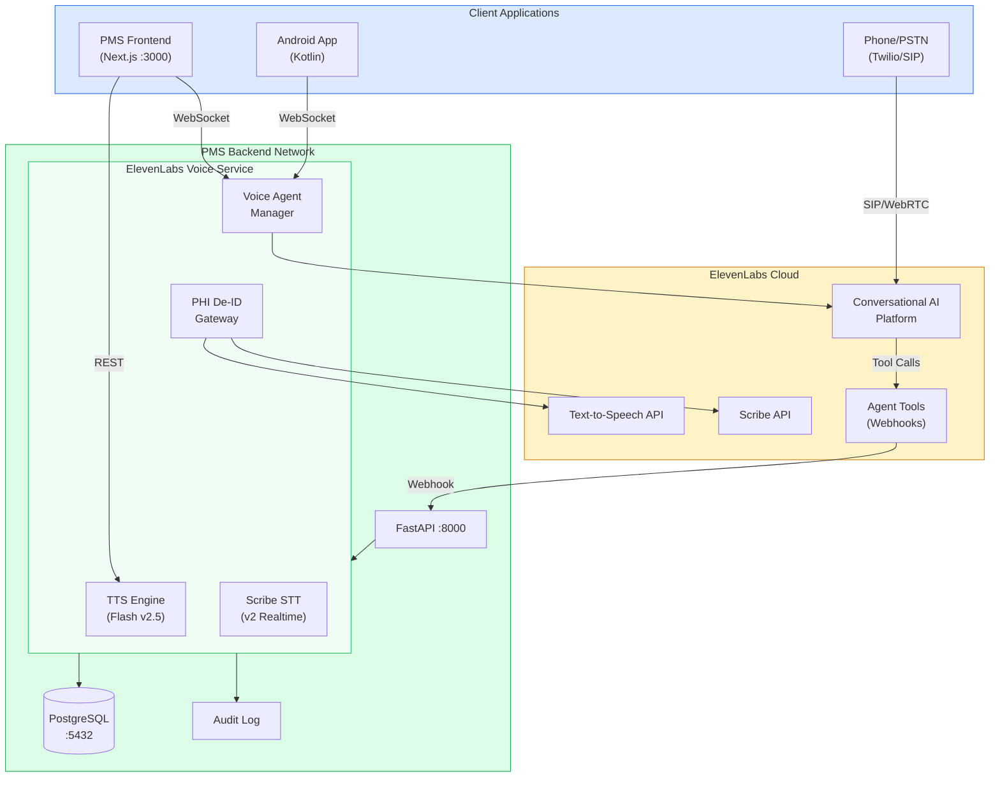

# Product Requirements Document: ElevenLabs Integration into Patient Management System (PMS)

**Document ID:** PRD-PMS-ELEVENLABS-001
**Version:** 1.0
**Date:** March 3, 2026
**Author:** Ammar (CEO, MPS Inc.)
**Status:** Draft

---

## 1. Executive Summary

ElevenLabs is the leading AI voice platform providing ultra-realistic text-to-speech (TTS), real-time speech-to-text (Scribe), voice cloning, and a full Conversational AI agent platform. Their Eleven Flash v2.5 model delivers speech synthesis in ~75ms latency across 32 languages, while Scribe v2 achieves industry-leading 3.1% Word Error Rate on the FLEURS benchmark. The Conversational AI 2.0 platform enables deploying interactive voice agents with custom LLM backends, tool integrations, and WebSocket-based real-time audio streaming.

Integrating ElevenLabs into the PMS creates a **unified voice AI layer** that addresses three critical gaps: (1) patient-facing voice agents for 24/7 appointment scheduling, symptom triage, and medication reminders via phone and in-app; (2) clinician-facing voice synthesis for reading back clinical summaries, lab results, and medication lists during hands-free workflows; and (3) real-time transcription via Scribe for clinical dictation that complements the existing on-premise ASR engines (MedASR Experiment 7, Speechmatics Experiment 10, Voxtral Experiment 21).

The integration adds ElevenLabs as a cloud-hosted voice tier that works alongside on-premise models. Patient-facing agents handle inbound/outbound calls with HIPAA-compliant zero-retention mode. Clinician-facing TTS streams audio through the Next.js frontend and Android app. Scribe provides a high-accuracy cloud transcription fallback when on-premise ASR is unavailable or for batch processing.

---

## 2. Problem Statement

The current PMS has several voice-related gaps that ElevenLabs uniquely addresses:

- **No patient-facing voice agents:** Patients cannot call the clinic and interact with an AI agent for appointment scheduling, prescription refill requests, or symptom triage. All phone interactions require human staff, creating bottlenecks during peak hours and zero coverage after hours.
- **No text-to-speech for clinical content:** When a clinician reviews a patient chart, all information is visual. During surgical prep, wound care, or other hands-free scenarios, there is no way to have clinical summaries, lab results, or medication lists read aloud.
- **No cloud transcription fallback:** The on-premise ASR models (MedASR, Voxtral) require GPU resources. When the GPU is at capacity or unavailable, there is no cloud-based fallback for clinical dictation. Speechmatics (Experiment 10) provides one cloud option; ElevenLabs Scribe adds a second with higher accuracy (3.1% vs ~5% WER).
- **No multilingual voice support:** The PMS serves diverse patient populations. Current ASR models have limited language support. ElevenLabs supports 32 languages for TTS and 99 languages for Scribe, enabling multilingual patient interactions.
- **No voice-based medication reminders:** Automated outbound calls for medication adherence, appointment reminders, and follow-up scheduling require a voice agent platform with phone integration.

---

## 3. Proposed Solution

Build an **ElevenLabs Voice Service** in the PMS backend that provides three capabilities: Conversational AI agents for patient interactions, text-to-speech for clinical content delivery, and Scribe transcription as a cloud ASR fallback.

### 3.1 Architecture Overview

### 3.2 Deployment Model

- **Cloud-hosted (ElevenLabs managed):** All voice processing occurs on ElevenLabs infrastructure. No self-hosted GPU required for TTS/STT.
- **HIPAA compliance:** Enterprise tier with signed BAA, zero-retention mode enabled for all PHI-containing interactions. SOC 2 and GDPR certified.
- **PHI isolation:** The PHI De-ID Gateway strips patient identifiers before sending text to ElevenLabs TTS. Voice agents use tool callbacks to access PMS data rather than receiving PHI directly.
- **Docker integration:** The ElevenLabs Voice Service runs as a module within the existing FastAPI backend container — no additional containers needed since all processing is cloud-side.

---

## 4. PMS Data Sources

| PMS API | ElevenLabs Integration | Use Case |
|---------|----------------------|----------|
| Patient Records (`/api/patients`) | Voice Agent tools | Agent looks up patient demographics for appointment scheduling |
| Encounter Records (`/api/encounters`) | TTS readback | Read clinical summaries aloud during hands-free workflows |
| Medication & Prescription (`/api/prescriptions`) | TTS + Voice Agent | Read medication lists; automated refill reminders via phone |
| Reporting (`/api/reports`) | TTS readback | Read daily clinic summaries and quality metrics |
| Scheduling (future) | Voice Agent tools | Agent books, reschedules, and cancels appointments |

---

## 5. Component/Module Definitions

### 5.1 ElevenLabsTTSClient

**Description:** Async Python client wrapping the ElevenLabs Text-to-Speech API with streaming support.

**Input:** Text string, voice ID, model selection (Flash v2.5 or Multilingual v2), output format (mp3/pcm/opus).
**Output:** Audio byte stream.
**PMS APIs used:** None directly — receives pre-processed text from other services.

### 5.2 ElevenLabsScribeClient

**Description:** Client for the Scribe v2 speech-to-text API with real-time and batch modes.

**Input:** Audio stream (WebSocket) or audio file (REST), language hint, custom vocabulary.
**Output:** Transcript with word-level timestamps, speaker diarization, and entity detection.
**PMS APIs used:** None directly — outputs feed into encounter documentation pipeline.

### 5.3 VoiceAgentManager

**Description:** Manages ElevenLabs Conversational AI agents for patient-facing phone interactions.

**Input:** Agent configuration (system prompt, voice, tools, LLM), inbound call events.
**Output:** Conversation transcripts, tool execution results, call metadata.
**PMS APIs used:** `/api/patients` (lookup), `/api/prescriptions` (refill status), scheduling API (booking).

### 5.4 ClinicalReadbackService

**Description:** Orchestrates TTS readback of clinical content with PHI de-identification.

**Input:** Content type (encounter summary, medication list, lab results), patient ID, voice preference.
**Output:** Audio stream delivered via SSE to frontend or WebSocket to Android app.
**PMS APIs used:** `/api/encounters`, `/api/prescriptions`, `/api/reports`.

### 5.5 PHIVoiceGateway

**Description:** De-identifies text before TTS synthesis, substituting PHI with generic placeholders.

**Input:** Raw clinical text.
**Output:** De-identified text safe for cloud TTS, plus a mapping for reference.
**PMS APIs used:** None — operates on text in-memory.

### 5.6 VoiceAuditLogger

**Description:** HIPAA-compliant audit logging for all voice interactions.

**Input:** Interaction metadata (type, duration, agent ID, user ID, PHI handling).
**Output:** Structured audit log entries in PostgreSQL.
**PMS APIs used:** Internal audit logging tables.

---

## 6. Non-Functional Requirements

### 6.1 Security and HIPAA Compliance

- **BAA:** Enterprise tier subscription with signed Business Associate Agreement
- **Zero-retention mode:** Enabled for all interactions containing or derived from PHI — ElevenLabs retains no audio or text data
- **Encryption:** TLS 1.3 for all API communication; audio streams encrypted in transit via WebSocket Secure (WSS)
- **PHI de-identification:** All clinical text processed through PHI De-ID Gateway before TTS synthesis
- **Voice agent data flow:** Agents access PMS data via tool callbacks — PHI never stored in ElevenLabs agent memory
- **Audit logging:** Every TTS generation, transcription, and agent conversation logged with user ID, timestamp, and PHI handling status
- **Access control:** Voice agent management restricted to admin roles; TTS and STT access controlled by PMS role-based permissions

### 6.2 Performance

| Metric | Target |
|--------|--------|
| TTS first-byte latency | < 100ms (Flash v2.5) |
| TTS full sentence generation | < 500ms |
| Scribe real-time transcription latency | < 150ms |
| Voice agent response time | < 1.5s end-to-end |
| Concurrent TTS streams | 50+ simultaneous |
| Scribe batch transcription speed | 1 hour audio in < 2 minutes |

### 6.3 Infrastructure

- **No additional on-premise infrastructure:** All processing is cloud-hosted by ElevenLabs
- **API key management:** Keys stored in environment variables, rotated quarterly
- **Rate limits:** Scale plan provides 2M characters/month; Enterprise plan offers custom limits
- **Failover:** If ElevenLabs API is unavailable, fall back to on-premise TTS (Voxtral) and ASR (MedASR)
- **Monitoring:** Health check endpoint pinging ElevenLabs API every 60 seconds

---

## 7. Implementation Phases

### Phase 1: Foundation (Sprints 1-2)

- Install ElevenLabs Python SDK and configure authentication
- Build ElevenLabsTTSClient with streaming audio output
- Build ElevenLabsScribeClient for batch transcription
- Create PHI De-ID Gateway for voice text
- Add HIPAA audit logging for all voice API calls
- Health check endpoint and monitoring

### Phase 2: Clinical TTS & Transcription (Sprints 3-4)

- Build ClinicalReadbackService for encounter summaries, medication lists, and lab results
- Integrate TTS audio streaming into Next.js frontend (audio player component)
- Integrate Scribe as cloud ASR fallback alongside MedASR/Voxtral
- Build Android TTS playback using Kotlin SDK
- Voice preference settings per clinician (voice selection, speed, language)

### Phase 3: Voice Agents & Phone Integration (Sprints 5-7)

- Deploy ElevenLabs Conversational AI agents for patient-facing interactions
- Configure agent tools for PMS data access (appointments, prescriptions, patient lookup)
- Integrate phone/SIP provider (Twilio) for inbound/outbound calls
- Build agent management dashboard in Next.js admin panel
- Automated outbound calls for medication reminders and appointment confirmations
- Call analytics and quality monitoring

---

## 8. Success Metrics

| Metric | Target | Measurement Method |
|--------|--------|--------------------|
| TTS adoption by clinicians | 30% of clinicians use readback weekly | Usage analytics |
| Patient call automation rate | 40% of routine calls handled by agent | Call log analysis |
| After-hours coverage | 100% of calls answered 24/7 | Phone system metrics |
| Transcription accuracy (Scribe) | < 5% WER on clinical content | WER benchmark against manual transcription |
| Patient satisfaction (voice agent) | > 4.0/5.0 rating | Post-call survey |
| Appointment no-show reduction | 20% decrease | Scheduling analytics |
| Staff phone time reduction | 50% decrease in routine call handling | Time tracking |

---

## 9. Risks and Mitigations

| Risk | Impact | Mitigation |
|------|--------|------------|
| ElevenLabs API outage | No voice services available | Automatic failover to on-premise TTS (Voxtral) and ASR (MedASR) |
| PHI exposure via TTS | HIPAA violation | PHI De-ID Gateway strips all identifiers; zero-retention mode; BAA in place |
| Voice cloning misuse | Impersonation risk | Restrict voice cloning to admin-approved clinical voices; no patient voice cloning |
| Cost overruns at scale | Budget exceeded | Monitor usage via dashboard; implement per-department quotas; cache frequent TTS outputs |
| Patient discomfort with AI voice | Poor adoption | Clear disclosure that calls are AI-assisted; easy transfer to human staff; natural voice quality |
| Latency spikes | Degraded user experience | Use Flash v2.5 for real-time; Multilingual v2 for batch; CDN for cached audio |
| Regulatory changes | Compliance gap | Monitor FDA/FTC AI voice regulations; maintain flexibility to disable features |

---

## 10. Dependencies

| Dependency | Version | Purpose |
|------------|---------|---------|
| `elevenlabs` Python SDK | >= 1.0 | TTS, STT, and agent management |
| `@elevenlabs/react` | >= 1.0 | React SDK for frontend voice widgets |
| `elevenlabs-android` | >= 1.0 | Kotlin SDK for Android voice integration |
| ElevenLabs Enterprise subscription | - | BAA, zero-retention, custom rate limits |
| Twilio (optional) | - | Phone/PSTN integration for voice agents |
| PMS Backend (FastAPI) | >= current | Host the ElevenLabs Voice Service module |
| PMS Frontend (Next.js) | >= current | TTS audio player and agent widget |
| PMS Android App | >= current | TTS playback and voice agent interface |
| PostgreSQL | >= 15 | Audit logging and conversation metadata |

---

## 11. Comparison with Existing Experiments

| Aspect | ElevenLabs (Exp 30) | MedASR (Exp 7) | Speechmatics (Exp 10) | Voxtral (Exp 21) |
|--------|---------------------|----------------|----------------------|-------------------|
| **Deployment** | Cloud (managed) | On-premise (GPU) | Cloud API | On-premise (GPU) |
| **TTS** | Yes (Flash v2.5, Multilingual v2) | No | No | No |
| **STT Accuracy** | 3.1% WER (Scribe v2) | ~8% WER | ~5% WER | ~6% WER |
| **Voice Agents** | Full Conversational AI platform | No | No | No |
| **Phone Integration** | Yes (SIP/Twilio) | No | No | No |
| **Voice Cloning** | Yes (instant + professional) | No | No | No |
| **Languages** | 32 (TTS), 99 (STT) | English + medical | 50+ | 14 |
| **HIPAA** | BAA + zero-retention (Enterprise) | On-premise (inherent) | BAA available | On-premise (inherent) |
| **Latency** | ~75ms TTS, ~150ms STT | ~100ms STT | ~200ms STT | ~80ms STT |
| **Cost** | Usage-based ($99-330/mo+) | Infrastructure only | Usage-based | Infrastructure only |

**Complementary roles:**
- **ElevenLabs** provides cloud-hosted TTS, voice agents, and high-accuracy STT — uniquely handles patient-facing phone interactions and text-to-speech
- **MedASR/Voxtral** provide on-premise STT with zero PHI egress — handles all dictation where PHI must stay on-site
- **Speechmatics** provides real-time cloud STT with medical vocabulary — alternative cloud ASR option
- Together, they form a **tiered voice AI strategy**: on-premise for PHI-heavy dictation, cloud for patient-facing agents and TTS

---

## 12. Research Sources

### Official Documentation
- [ElevenLabs API Documentation](https://elevenlabs.io/docs/overview/intro) — SDK reference, models, and API guides
- [ElevenLabs Models Overview](https://elevenlabs.io/docs/overview/models) — Flash v2.5, Multilingual v2, Scribe v2 specifications
- [HIPAA Compliance Documentation](https://elevenlabs.io/docs/agents-platform/legal/hipaa) — BAA requirements, zero-retention mode, PHI handling

### Platform & Agents
- [Conversational AI 2.0 Announcement](https://elevenlabs.io/blog/conversational-ai-2-0) — Agent platform features, HIPAA, custom LLM integration
- [Healthcare Voice AI Agents](https://elevenlabs.io/agents/conversational-ai-healthcare) — Healthcare-specific use cases and compliance features
- [Custom LLM Integration](https://elevenlabs.io/docs/agents-platform/customization/llm/custom-llm) — Connecting agents to custom backends

### SDKs & Integration
- [Python SDK (GitHub)](https://github.com/elevenlabs/elevenlabs-python) — Official Python client with async support
- [React SDK](https://elevenlabs.io/docs/agents-platform/libraries/react) — Next.js voice agent widget integration
- [Kotlin SDK](https://elevenlabs.io/docs/agents-platform/libraries/kotlin) — Android voice agent integration
- [Scribe v2 Blog Post](https://elevenlabs.io/blog/meet-scribe) — STT accuracy benchmarks and features

---

## 13. Appendix: Related Documents

- [ElevenLabs Setup Guide](30-ElevenLabs-PMS-Developer-Setup-Guide.md)
- [ElevenLabs Developer Tutorial](30-ElevenLabs-Developer-Tutorial.md)
- [MedASR PRD (Experiment 7)](07-PRD-MedASR-PMS-Integration.md)
- [Speechmatics Medical PRD (Experiment 10)](10-PRD-SpeechmaticsMedical-PMS-Integration.md)
- [Voxtral Transcribe 2 PRD (Experiment 21)](21-PRD-VoxtralTranscribe2-PMS-Integration.md)
- [ElevenLabs Official Documentation](https://elevenlabs.io/docs)
