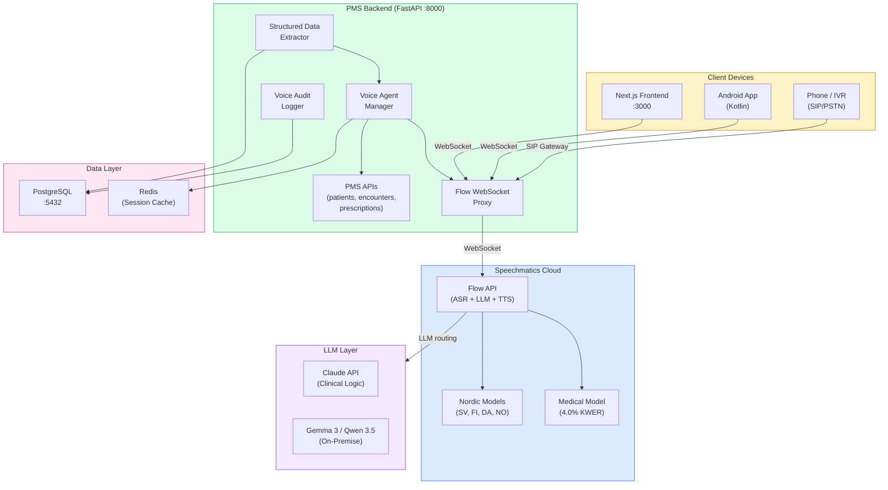

# Product Requirements Document: Speechmatics Flow API Integration into Patient Management System (PMS)

**Document ID:** PRD-PMS-SPEECHMATICS-FLOW-001
**Version:** 1.0
**Date:** March 3, 2026
**Author:** Ammar (CEO, MPS Inc.)
**Status:** Draft

---

## 1. Executive Summary

Speechmatics Flow API is a unified real-time voice agent platform that combines automatic speech recognition (ASR), large language model (LLM) orchestration, and text-to-speech (TTS) into a single WebSocket connection. Unlike the basic Speechmatics Medical transcription evaluated in Experiment 10, Flow API enables **full-duplex conversational voice agents** — the system listens, understands, reasons, and speaks back with sub-2-second end-to-end latency. This transforms Speechmatics from a passive dictation tool into an active clinical voice assistant.

Integrating Flow API into the PMS provides three critical capabilities: (1) **voice-powered clinical agents** that can conduct structured patient intake, medication verification, and appointment scheduling conversations through natural speech; (2) **enhanced medical speech recognition** with updated models achieving 4.0% keyword error rate (KWER) on clinical terms — approximately 50% fewer medical term errors than competitors; and (3) **multilingual clinical voice support** with Nordic medical models (Swedish 3.91% KWER, Finnish 5.41%, Danish 6.15%, Norwegian 7.25%) enabling healthcare workflows in languages underserved by other ASR platforms.

Speechmatics reported 9x growth in voice agent usage and 30 million+ minutes returned to healthcare workforces in 2025, validating production readiness for clinical voice agent deployments. Flow API complements the existing Speechmatics Medical STT (Experiment 10) by adding the conversational agent layer, and ElevenLabs (Experiment 30) by providing a self-hostable alternative with superior medical accuracy for clinical-grade voice interactions.

---

## 2. Problem Statement

- **No conversational voice agent capability:** Experiment 10 provides one-way speech-to-text transcription, but clinical workflows like patient intake, medication reconciliation, and appointment scheduling require two-way voice conversations where the system asks questions, validates responses, and adapts its dialogue based on patient answers.
- **Limited multilingual medical speech recognition:** The PMS serves diverse patient populations including Nordic languages, but current ASR solutions have high error rates on medical terminology in non-English languages — particularly Swedish, Finnish, Danish, and Norwegian.
- **High latency in voice agent pipelines:** Building voice agents by chaining separate ASR, LLM, and TTS services introduces cumulative latency (often 3-5 seconds), creating unnatural conversation pauses that frustrate clinical users and patients.
- **No unified voice agent orchestration:** Developers must manually coordinate WebSocket connections to ASR, HTTP calls to LLMs, and streaming TTS output — each with different error handling, retry logic, and connection lifecycle management.
- **No structured data extraction from voice conversations:** Clinical voice interactions generate unstructured audio, but the PMS needs structured outputs (patient demographics, medication lists, allergy confirmations) extracted and validated in real time during the conversation.

---

## 3. Proposed Solution

Adopt **Speechmatics Flow API** as the conversational voice agent platform for the PMS, complementing the existing Speechmatics Medical STT (Experiment 10) for passive transcription and ElevenLabs (Experiment 30) for cloud TTS with an integrated, low-latency voice agent layer.

### 3.1 Architecture Overview

### 3.2 Deployment Model

- **Speechmatics Cloud (SaaS):** Flow API runs on Speechmatics' cloud infrastructure with SOC 2 Type II certification and HIPAA BAA available for Enterprise plans
- **On-premise option:** Speechmatics offers self-hosted deployment for organizations requiring full data sovereignty — audio never leaves the network perimeter
- **Hybrid LLM routing:** Flow API routes to Speechmatics-hosted LLMs by default, but supports custom LLM endpoints (Claude API, on-premise Gemma 3/Qwen 3.5) for clinical reasoning
- **WebSocket-native:** Single persistent WebSocket connection per voice session — no HTTP polling or multiple service connections
- **Pricing:** Per-minute pricing based on Flow API usage; medical model and Nordic models may have premium tiers

---

## 4. PMS Data Sources

| PMS Resource | Flow API Integration | Use Case |
|-------------|---------------------|----------|
| Patient Records API (`/api/patients`) | Voice agent reads/confirms patient demographics | Patient intake conversations, identity verification |
| Encounter Records API (`/api/encounters`) | Voice agent creates encounter notes from conversation | Clinical documentation from voice sessions |
| Medication & Prescription API (`/api/prescriptions`) | Voice agent reads back medications for reconciliation | Medication verification conversations |
| Reporting API (`/api/reports`) | Voice session analytics and usage metrics | Clinical voice agent performance monitoring |
| Appointment API (`/api/appointments`) | Voice agent schedules and confirms appointments | Patient-facing appointment scheduling conversations |

---

## 5. Component/Module Definitions

### 5.1 Flow WebSocket Proxy

**Description:** FastAPI WebSocket endpoint that proxies audio between clients and Speechmatics Flow API, adding PHI de-identification, session management, and audit logging.

**Input:** Raw audio stream (PCM 16-bit, 16kHz) from client WebSocket.
**Output:** Bidirectional audio and transcript events relayed between client and Flow API.
**PMS APIs:** None directly — acts as transport layer.

### 5.2 Voice Agent Manager

**Description:** Orchestrates clinical voice agent conversations by defining conversation flows, managing state transitions, and coordinating with PMS APIs for data retrieval and updates.

**Input:** Flow API conversation events (user speech, agent responses, conversation state).
**Output:** Structured conversation state, PMS API calls, agent prompts.
**PMS APIs:** `/api/patients`, `/api/encounters`, `/api/prescriptions`, `/api/appointments`.

### 5.3 Clinical Conversation Templates

**Description:** Pre-defined conversation flows for common clinical voice interactions, each with structured prompts, validation rules, and extraction schemas.

**Templates:**
- `patient-intake` — Collects demographics, chief complaint, allergies, current medications
- `medication-reconciliation` — Reads back medications, confirms each, flags discrepancies
- `appointment-scheduling` — Checks availability, confirms patient preferences, schedules appointment
- `lab-result-readback` — Reads lab results to clinicians with critical value flagging

**Input:** Template ID, patient context from PMS.
**Output:** Structured conversation data extracted during voice interaction.
**PMS APIs:** All relevant APIs depending on template.

### 5.4 Structured Data Extractor

**Description:** Extracts structured clinical data from voice conversation transcripts in real time, using the LLM layer to parse natural speech into PMS-compatible data schemas.

**Input:** Conversation transcript segments, extraction schema (JSON Schema).
**Output:** Structured JSON data (patient demographics, medication lists, allergy confirmations).
**PMS APIs:** `/api/patients` (write), `/api/encounters` (write).

### 5.5 Nordic Medical Language Router

**Description:** Routes audio to the appropriate Speechmatics medical language model based on patient language preference or automatic language detection.

**Supported Models:**
- English Medical (4.0% KWER)
- Swedish Medical (3.91% KWER)
- Finnish Medical (5.41% KWER)
- Danish Medical (6.15% KWER)
- Norwegian Medical (7.25% KWER)

**Input:** Audio stream, language hint (optional).
**Output:** Language-specific transcription with medical term optimization.
**PMS APIs:** `/api/patients` (reads language preference).

### 5.6 Voice Session Audit Logger

**Description:** HIPAA-compliant audit logging for all voice agent sessions, recording session metadata, consent status, conversation duration, and structured extraction results without storing raw audio containing PHI.

**Input:** Voice session events (start, transcript segments, agent actions, end).
**Output:** Audit log records in PostgreSQL with HIPAA-required fields.
**PMS APIs:** Internal audit logging API.

---

## 6. Non-Functional Requirements

### 6.1 Security and HIPAA Compliance

- **BAA required:** Enterprise plan with Business Associate Agreement before processing any patient conversations
- **No PHI in prompts:** Voice agent conversation templates must use de-identified placeholders; real patient data injected at runtime only
- **Audio retention policy:** Raw audio must not be stored beyond the active session unless explicit patient consent is documented; configure Speechmatics zero-retention mode
- **Transcript encryption:** All conversation transcripts encrypted at rest (AES-256) and in transit (TLS 1.3)
- **Consent management:** Every voice agent session requires documented patient consent before recording or processing begins
- **Access control:** Voice agent endpoints require authenticated PMS sessions with role-based permissions (clinician, intake staff, scheduling)
- **Audit trail:** Every voice session logged with: user ID, patient ID (hashed), session duration, template used, data extracted, consent status

### 6.2 Performance

| Metric | Target |
|--------|--------|
| Partial transcript latency | < 250ms |
| End-of-speech detection | < 400ms |
| Full voice agent response | < 1.5 seconds |
| Medical keyword error rate (English) | < 4.5% |
| Concurrent voice sessions | 50+ per PMS instance |
| Session startup time | < 2 seconds |

### 6.3 Infrastructure

- **WebSocket support required:** Load balancer must support persistent WebSocket connections (not just HTTP)
- **Redis for session state:** Voice agent conversation state cached in Redis for sub-millisecond access
- **Audio processing:** No GPU required — audio encoding/decoding handled by Speechmatics cloud
- **Bandwidth:** ~128 kbps per active voice session (16kHz PCM mono)
- **On-premise option:** Docker container available for self-hosted Speechmatics deployment if data sovereignty required

---

## 7. Implementation Phases

### Phase 1: Foundation — Flow API Connection & Medical STT Upgrade (Sprint 1)

- Establish Flow API WebSocket proxy in PMS backend
- Configure medical language models (English, Swedish)
- Implement voice session audit logging
- Build basic transcript streaming to Next.js frontend
- Migrate Experiment 10 transcription to Flow API where applicable

### Phase 2: Clinical Voice Agents (Sprints 2-3)

- Build Voice Agent Manager with conversation state machine
- Create patient intake conversation template
- Create medication reconciliation conversation template
- Implement structured data extraction from voice conversations
- Integrate voice agent with PMS patient and encounter APIs
- Build React voice agent component for Next.js frontend

### Phase 3: Multilingual & Advanced Features (Sprints 4-5)

- Deploy Nordic medical models (Finnish, Danish, Norwegian)
- Build automatic language detection and routing
- Create appointment scheduling voice agent template
- Add phone/IVR integration for patient-facing voice agents
- Build voice agent analytics dashboard
- Implement voice agent A/B testing framework for prompt optimization

---

## 8. Success Metrics

| Metric | Target | Measurement Method |
|--------|--------|-------------------|
| Voice agent response latency | < 1.5s end-to-end | WebSocket timestamp analysis |
| Medical keyword accuracy (English) | > 96% (< 4.0% KWER) | Clinical term benchmark suite |
| Patient intake completion rate | > 85% via voice agent | Conversation completion tracking |
| Structured data extraction accuracy | > 90% field-level accuracy | Manual review of 100 voice sessions |
| Multilingual support | 5+ medical languages active | Language model deployment tracking |
| Developer satisfaction | > 4.0/5.0 with Flow API DX | Team survey |

---

## 9. Risks and Mitigations

| Risk | Impact | Mitigation |
|------|--------|------------|
| Voice agent misunderstands critical medical terms | Patient safety risk from incorrect medication or allergy data | Require clinician confirmation for all safety-critical extracted data; use medical model with 4.0% KWER |
| Patient discomfort with voice AI | Low adoption, negative patient experience | Offer opt-out to human staff; start with low-stakes workflows (scheduling); display clear AI disclosure |
| WebSocket connection instability | Dropped voice sessions, lost conversation context | Implement session recovery with Redis state caching; graceful reconnection with context replay |
| Speechmatics pricing escalation | Budget pressure as voice agent usage grows | Monitor per-minute costs; evaluate on-premise deployment for high-volume workflows |
| Nordic model accuracy insufficient | Clinical errors in non-English languages | Validate each language model against clinical benchmark before production deployment; maintain human fallback |
| HIPAA compliance gap in voice data | Regulatory violation, fines | Require BAA before any patient audio; enable zero-retention mode; audit logging for all sessions |

---

## 10. Dependencies

| Dependency | Version | Purpose |
|-----------|---------|---------|
| Speechmatics Flow API | Current | Core voice agent platform |
| Speechmatics Medical Model | Current | Clinical-grade speech recognition |
| Speechmatics Nordic Models | Current | Swedish, Finnish, Danish, Norwegian medical ASR |
| Python `speechmatics` SDK | >= 1.10 | Flow API WebSocket client |
| Redis | >= 7.0 | Voice agent session state caching |
| FastAPI | >= 0.115 | WebSocket proxy endpoints |
| Claude API (Anthropic) | Current | Clinical reasoning for voice agent LLM layer |
| Gemma 3 / Qwen 3.5 (on-premise) | Current | Alternative LLM for voice agent reasoning |

---

## 11. Comparison with Existing Experiments

| Aspect | Speechmatics Flow (Exp 33) | Speechmatics Medical (Exp 10) | ElevenLabs (Exp 30) | Voxtral (Exp 21) | MedASR (Exp 7) |
|--------|---------------------------|-------------------------------|---------------------|-------------------|----------------|
| **Primary function** | Voice agents (ASR+LLM+TTS) | Transcription only | TTS + STT + voice agents | Self-hosted ASR | Self-hosted ASR |
| **Conversation support** | Full-duplex voice agents | No | Conversational AI 2.0 | No | No |
| **Medical model** | 4.0% KWER (updated) | 4.0% KWER (original) | General purpose | General + biasing | Medical fine-tuned |
| **Multilingual medical** | 5 Nordic + English | English only | 32 languages (general) | 30+ languages | English only |
| **Latency** | < 1.5s agent response | < 250ms transcript | ~75ms TTS | < 500ms transcript | < 300ms transcript |
| **Deployment** | Cloud or on-premise | Cloud or on-premise | Cloud only | Self-hosted | Self-hosted |
| **LLM integration** | Built-in routing | None | Built-in routing | None | None |
| **Best for** | Clinical voice conversations | Passive dictation | Patient-facing voice calls | Offline transcription | GPU-local transcription |

**Complementary roles:**
- **Flow API (Exp 33)** provides interactive clinical voice agents with medical-grade accuracy and multilingual support
- **Speechmatics Medical (Exp 10)** remains the choice for passive clinical dictation and encounter documentation
- **ElevenLabs (Exp 30)** provides superior TTS quality for patient-facing voice calls and clinical readback
- **Voxtral/MedASR (Exp 21/7)** provide fully self-hosted ASR for environments requiring zero cloud dependency

---

## 12. Research Sources

### Official Documentation
- [Speechmatics Flow API Documentation](https://docs.speechmatics.com/flow/getting-started) — Core Flow API architecture, WebSocket protocol, and integration guide
- [Speechmatics Medical Model](https://www.speechmatics.com/company/articles-and-news/introducing-the-worlds-most-accurate-medical-model) — Medical model accuracy benchmarks and clinical term evaluation

### Healthcare & Nordic Expansion
- [Speechmatics Nordic Healthcare Models](https://www.speechmatics.com/company/articles-and-news/speechmatics-nordic-healthcare-medical-models) — Swedish, Finnish, Danish, Norwegian medical models with KWER benchmarks
- [Speechmatics 2025 Year in Review](https://www.speechmatics.com/company/articles-and-news/speechmatics-2025-year-review) — 9x voice agent growth, 30M+ healthcare minutes, production-scale validation

### Voice Agent Architecture
- [Speechmatics Flow Voice Agent Overview](https://www.speechmatics.com/product/flow) — Flow API capabilities, LLM integration, and voice agent use cases
- [Building Voice Agents with Flow](https://docs.speechmatics.com/flow/voice-agents) — Technical guide for building conversational voice agents

---

## 13. Appendix: Related Documents

- [Speechmatics Flow API Setup Guide](33-SpeechmaticsFlow-PMS-Developer-Setup-Guide.md)
- [Speechmatics Flow API Developer Tutorial](33-SpeechmaticsFlow-Developer-Tutorial.md)
- [Speechmatics Medical PRD (Experiment 10)](10-PRD-SpeechmaticsMedical-PMS-Integration.md)
- [ElevenLabs PRD (Experiment 30)](30-PRD-ElevenLabs-PMS-Integration.md)
- [MedASR PRD (Experiment 7)](07-PRD-MedASR-PMS-Integration.md)
