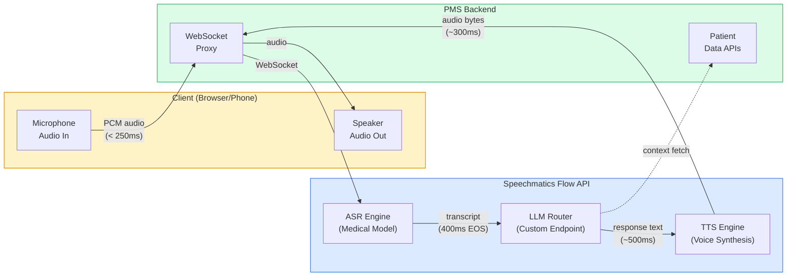
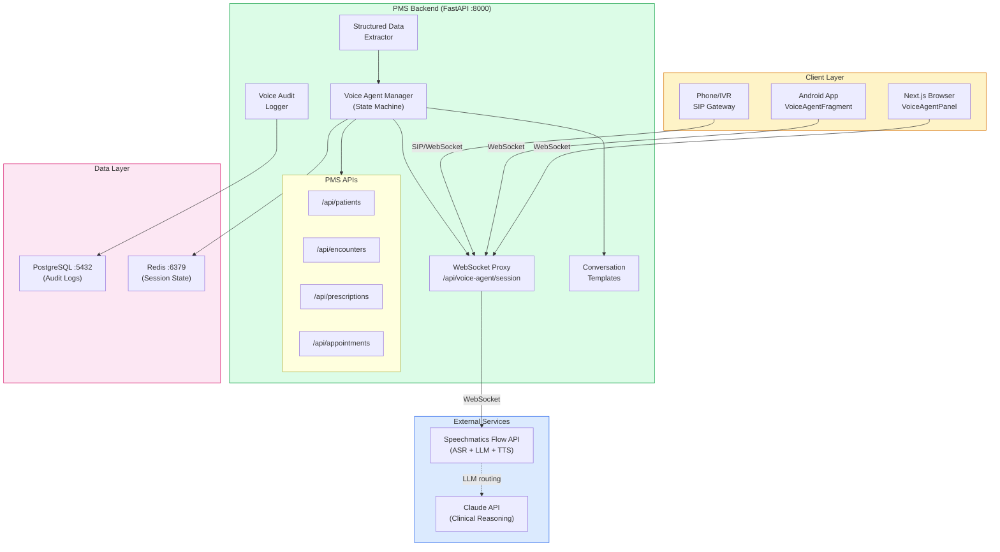

# Speechmatics Flow API Developer Onboarding Tutorial

**Welcome to the MPS PMS Speechmatics Flow API Integration Team**

This tutorial will take you from zero to building your first clinical voice agent with the PMS. By the end, you will understand how Speechmatics Flow API orchestrates real-time voice conversations, have a running local environment, and have built and tested a medication reconciliation voice agent end-to-end.

**Document ID:** PMS-EXP-SPEECHMATICS-FLOW-002
**Version:** 1.0
**Date:** March 3, 2026
**Applies To:** PMS project (all platforms)
**Prerequisite:** [Speechmatics Flow API Setup Guide](33-SpeechmaticsFlow-PMS-Developer-Setup-Guide.md)
**Estimated time:** 2-3 hours
**Difficulty:** Beginner-friendly

---

## What You Will Learn

1. What Speechmatics Flow API is and how it differs from traditional ASR
2. How the Flow API pipeline works (ASR → LLM → TTS in a single WebSocket)
3. How medical language models achieve 4.0% keyword error rate on clinical terms
4. How to build a clinical voice agent with conversation templates
5. How the Voice Agent Manager orchestrates multi-turn clinical conversations
6. How structured data extraction captures clinical information from voice in real time
7. How Nordic medical models enable multilingual healthcare workflows
8. How to implement HIPAA-compliant voice session audit logging
9. How Flow API compares to basic Speechmatics Medical STT (Experiment 10)
10. How to debug common voice agent issues (latency, accuracy, connection stability)

---

## Part 1: Understanding Speechmatics Flow API (15 min read)

### 1.1 What Problem Does Flow API Solve?

The PMS clinical workflow includes many repetitive verbal interactions: patient intake interviews, medication verification calls, appointment scheduling, and lab result communications. Today these are either fully manual (staff on the phone) or use basic transcription (Experiment 10) that captures what was said but does not participate in the conversation.

> *The intake coordinator spends 12 minutes per patient asking the same demographic questions, typing answers into the PMS. With 30 patients per day, that is 6 hours of repetitive data entry that could be handled by a voice agent.*

Flow API solves this by combining three services into a single real-time pipeline:

1. **ASR (Automatic Speech Recognition):** Converts patient speech to text with medical-grade accuracy
2. **LLM (Large Language Model):** Reasons about the conversation, generates appropriate responses, and extracts structured data
3. **TTS (Text-to-Speech):** Converts agent responses back to natural speech

The entire pipeline runs through one WebSocket connection with sub-2-second end-to-end latency.

### 1.2 How Flow API Works — The Key Pieces



**Three key concepts:**

1. **Single WebSocket connection:** Unlike chaining ASR + LLM + TTS as separate HTTP calls (which adds 3-5 seconds), Flow API handles all three in one persistent connection with ~1.5 second total latency.

2. **Medical Model specialization:** The ASR engine uses a medical-specific model trained on clinical terminology — achieving 4.0% keyword error rate on medical terms, which is approximately 50% fewer errors than general-purpose models on words like "metformin," "auscultation," and "hydrochlorothiazide."

3. **Custom LLM routing:** Flow API can route the reasoning step to any LLM endpoint — Speechmatics' default, Claude API for complex clinical logic, or on-premise Gemma 3/Qwen 3.5 for zero-egress deployment.

### 1.3 How Flow API Fits with Other PMS Technologies

| Feature | Flow API (Exp 33) | Speechmatics Medical (Exp 10) | ElevenLabs (Exp 30) | MedASR (Exp 7) | Voxtral (Exp 21) |
|---------|-------------------|-------------------------------|---------------------|----------------|-------------------|
| Two-way voice agents | Yes | No | Yes | No | No |
| Medical ASR accuracy | 4.0% KWER | 4.0% KWER | General | Medical tuned | Context biasing |
| Nordic medical models | 5 languages | English only | 32 general | English only | 30+ general |
| Built-in LLM routing | Yes | No | Yes | No | No |
| Self-hosted option | Yes | Yes | No | Yes | Yes |
| Latency | ~1.5s agent | ~250ms transcript | ~75ms TTS | ~300ms | ~500ms |
| Best for | Voice conversations | Passive dictation | Patient voice calls | GPU-local ASR | Offline ASR |

### 1.4 Key Vocabulary

| Term | Meaning |
|------|---------|
| Flow API | Speechmatics' unified voice agent platform combining ASR + LLM + TTS |
| KWER | Keyword Error Rate — accuracy metric for domain-specific terms (medical, legal) |
| End-of-Speech (EOS) | Detection of when the speaker has finished talking (~400ms) |
| Partial Transcript | Real-time interim transcription before utterance is complete |
| Final Transcript | Committed transcription after end-of-speech detection |
| Conversation Template | Pre-defined dialogue flow with prompts, validation, and extraction schema |
| Custom LLM Endpoint | User-provided LLM URL for Flow API to route reasoning to |
| Medical Model | ASR model fine-tuned on clinical vocabulary and medical dictation |
| Zero-retention Mode | Setting where Speechmatics deletes all audio after processing |
| Voice Session | A single continuous voice agent conversation from start to end |

### 1.5 Our Architecture



---

## Part 2: Environment Verification (15 min)

### 2.1 Checklist

1. **PMS backend running:**
   ```bash
   curl http://localhost:8000/health
   ```
   Expected: `{"status": "healthy"}`

2. **Voice agent health check:**
   ```bash
   curl http://localhost:8000/api/voice-agent/health
   ```
   Expected: `{"status": "ok", "service": "speechmatics-flow", ...}`

3. **Templates available:**
   ```bash
   curl http://localhost:8000/api/voice-agent/templates | python -m json.tool
   ```
   Expected: 4 templates listed

4. **Medical languages available:**
   ```bash
   curl http://localhost:8000/api/voice-agent/languages | python -m json.tool
   ```
   Expected: 5 languages with KWER values

5. **Redis running:**
   ```bash
   redis-cli ping
   ```
   Expected: `PONG`

6. **Frontend running:**
   ```bash
   curl -s http://localhost:3000 | head -1
   ```
   Expected: HTML response

### 2.2 Quick Test

1. Open http://localhost:3000 in Chrome
2. Navigate to any patient view
3. Open the Voice Agent panel
4. Click **Start Session** > **Start Speaking**
5. Say "Hello, testing voice agent"
6. Verify your speech appears as transcript text
7. Click **End Session**

---

## Part 3: Build Your First Voice Agent (45 min)

### 3.1 What We Are Building

A **Medication Reconciliation Voice Agent** that:
1. Reads back a patient's current medication list from the PMS
2. Asks the patient to confirm each medication (name, dose, frequency)
3. Flags any discrepancies (patient says they stopped a medication)
4. Extracts structured reconciliation data in real time
5. Creates an encounter note with the reconciliation results

### 3.2 Step 1: Create the Medication Reconciliation Template

Create `app/integrations/speechmatics_flow/templates/medication_reconciliation.py`:

```python
"""Medication reconciliation conversation template for Flow API."""

from typing import Any


def build_medrec_prompt(patient_name: str, medications: list[dict]) -> str:
    """Build the system prompt for medication reconciliation conversation."""
    med_list = "\n".join(
        f"- {m['name']} {m['dose']} {m['frequency']}"
        for m in medications
    )

    return f"""You are a clinical medication reconciliation assistant for {patient_name}.

Your task is to verify the patient's current medications one by one.

Current medication list from the medical record:
{med_list}

Instructions:
1. Greet the patient warmly and explain you are verifying their medications.
2. Read each medication one at a time: name, dose, and how often they take it.
3. After reading each medication, ask: "Are you still taking this medication at this dose?"
4. If the patient says they stopped or changed a medication, acknowledge and note the change.
5. After all medications, ask: "Are you taking any new medications not on this list?"
6. Summarize any changes found and thank the patient.

Rules:
- Speak clearly and slowly, especially for medication names.
- Use simple language — avoid medical jargon unless the patient uses it.
- If the patient is confused, repeat the information.
- Never provide medical advice or recommend changes.
- Always be patient and empathetic.
"""


def build_extraction_schema() -> dict[str, Any]:
    """JSON Schema for structured data extraction from medrec conversation."""
    return {
        "type": "object",
        "properties": {
            "medications_confirmed": {
                "type": "array",
                "items": {
                    "type": "object",
                    "properties": {
                        "name": {"type": "string"},
                        "dose": {"type": "string"},
                        "frequency": {"type": "string"},
                        "status": {
                            "type": "string",
                            "enum": ["confirmed", "stopped", "changed", "unknown"],
                        },
                        "patient_notes": {"type": "string"},
                    },
                    "required": ["name", "status"],
                },
            },
            "new_medications_reported": {
                "type": "array",
                "items": {
                    "type": "object",
                    "properties": {
                        "name": {"type": "string"},
                        "dose": {"type": "string"},
                        "frequency": {"type": "string"},
                    },
                },
            },
            "discrepancies_found": {"type": "boolean"},
            "conversation_complete": {"type": "boolean"},
        },
        "required": ["medications_confirmed", "discrepancies_found"],
    }
```

### 3.3 Step 2: Create the Medication Reconciliation Endpoint

Add to `app/api/routes/voice_agent.py`:

```python
from app.integrations.speechmatics_flow.templates.medication_reconciliation import (
    build_medrec_prompt,
    build_extraction_schema,
)


@router.websocket("/session/medrec/{patient_id}")
async def medication_reconciliation_session(
    websocket: WebSocket,
    patient_id: str,
    language: str = Query("en"),
):
    """
    Specialized WebSocket endpoint for medication reconciliation.

    Fetches patient medications from PMS, builds conversation prompt,
    and runs the voice agent with structured extraction.
    """
    await websocket.accept()

    # Fetch patient data from PMS
    # In production, this calls the real PMS API
    patient = await get_patient_data(patient_id)
    medications = await get_patient_medications(patient_id)

    if not patient:
        await websocket.send_json({"type": "error", "message": "Patient not found"})
        await websocket.close()
        return

    # Build conversation prompt
    prompt = build_medrec_prompt(
        patient_name=patient["name"],
        medications=medications,
    )

    # Configure Flow session with medrec template
    config = FlowSessionConfig(
        language=FlowLanguage(language),
        template=ConversationTemplate.MEDICATION_RECONCILIATION,
        patient_id=patient_id,
        enable_medical_model=True,
        metadata={
            "prompt": prompt,
            "extraction_schema": build_extraction_schema(),
            "medication_count": len(medications),
        },
    )

    session = await agent_manager.create_session(config)
    flow_client = FlowClient(settings)

    try:
        await flow_client.connect(config)

        await websocket.send_json({
            "type": "session_started",
            "session_id": session.session_id,
            "medication_count": len(medications),
            "patient_name": patient["name"],
        })

        # Same bidirectional forwarding as generic session
        async def forward_audio():
            try:
                while True:
                    data = await websocket.receive_bytes()
                    await flow_client.send_audio(data)
            except WebSocketDisconnect:
                pass

        async def forward_events():
            async for event in flow_client.receive_events():
                if event.type == "agent_audio" and event.agent_audio:
                    await websocket.send_bytes(event.agent_audio)
                elif event.transcript:
                    session.add_transcript("user", event.transcript)
                    await websocket.send_json({
                        "type": event.type,
                        "transcript": event.transcript,
                    })
                elif event.agent_text:
                    session.add_transcript("agent", event.agent_text)
                    await websocket.send_json({
                        "type": "agent_response",
                        "text": event.agent_text,
                    })

        await asyncio.gather(forward_audio(), forward_events(), return_exceptions=True)

    finally:
        await flow_client.close()
        result = await agent_manager.end_session(session.session_id)
        if result:
            await websocket.send_json({
                "type": "session_complete",
                "transcript_segments": len(result.get("transcript_segments", [])),
            })


# Mock data helpers (replace with real PMS API calls)
async def get_patient_data(patient_id: str) -> dict | None:
    """Fetch patient demographics from PMS."""
    # Replace with: response = await httpx.get(f"/api/patients/{patient_id}")
    return {
        "id": patient_id,
        "name": "John Smith",
        "date_of_birth": "1965-03-15",
    }


async def get_patient_medications(patient_id: str) -> list[dict]:
    """Fetch active medications from PMS."""
    # Replace with: response = await httpx.get(f"/api/prescriptions?patient_id={patient_id}")
    return [
        {"name": "Metformin", "dose": "500mg", "frequency": "twice daily"},
        {"name": "Lisinopril", "dose": "10mg", "frequency": "once daily"},
        {"name": "Atorvastatin", "dose": "20mg", "frequency": "once daily at bedtime"},
    ]
```

### 3.4 Step 3: Create the Medication Reconciliation Component

Create `src/components/voice/MedReconciliationAgent.tsx`:

```tsx
"use client";

import { useState, useEffect } from "react";
import { useVoiceAgent } from "@/hooks/useVoiceAgent";

interface MedReconciliationAgentProps {
  patientId: string;
  patientName: string;
}

interface MedicationStatus {
  name: string;
  dose: string;
  frequency: string;
  status: "pending" | "confirmed" | "stopped" | "changed";
}

export function MedReconciliationAgent({
  patientId,
  patientName,
}: MedReconciliationAgentProps) {
  const [medications, setMedications] = useState<MedicationStatus[]>([]);

  const {
    isConnected,
    isRecording,
    sessionId,
    transcript,
    connect,
    startRecording,
    stopRecording,
    disconnect,
  } = useVoiceAgent({
    template: "medication-reconciliation",
    language: "en",
    patientId,
  });

  // Fetch medications on mount
  useEffect(() => {
    fetch(`/api/prescriptions?patient_id=${patientId}`)
      .then((r) => r.json())
      .then((data) => {
        setMedications(
          data.map((m: Record<string, string>) => ({
            ...m,
            status: "pending" as const,
          }))
        );
      })
      .catch(() => {
        // Use mock data for development
        setMedications([
          { name: "Metformin", dose: "500mg", frequency: "twice daily", status: "pending" },
          { name: "Lisinopril", dose: "10mg", frequency: "once daily", status: "pending" },
          { name: "Atorvastatin", dose: "20mg", frequency: "at bedtime", status: "pending" },
        ]);
      });
  }, [patientId]);

  return (
    <div className="rounded-lg border border-gray-200 bg-white shadow-sm">
      {/* Header */}
      <div className="border-b border-gray-200 px-6 py-4">
        <h2 className="text-lg font-semibold text-gray-900">
          Medication Reconciliation
        </h2>
        <p className="text-sm text-gray-500">Patient: {patientName}</p>
      </div>

      <div className="grid grid-cols-2 gap-0">
        {/* Left: Medication List */}
        <div className="border-r border-gray-200 p-4">
          <h3 className="mb-3 text-sm font-medium text-gray-700">
            Current Medications
          </h3>
          <div className="space-y-2">
            {medications.map((med, i) => (
              <div
                key={i}
                className={`rounded-lg border p-3 text-sm ${
                  med.status === "confirmed"
                    ? "border-green-200 bg-green-50"
                    : med.status === "stopped"
                      ? "border-red-200 bg-red-50"
                      : med.status === "changed"
                        ? "border-yellow-200 bg-yellow-50"
                        : "border-gray-200 bg-gray-50"
                }`}
              >
                <div className="font-medium">{med.name}</div>
                <div className="text-gray-600">
                  {med.dose} — {med.frequency}
                </div>
                <div className="mt-1 text-xs uppercase text-gray-500">
                  {med.status}
                </div>
              </div>
            ))}
          </div>
        </div>

        {/* Right: Conversation */}
        <div className="p-4">
          <h3 className="mb-3 text-sm font-medium text-gray-700">
            Voice Conversation
          </h3>

          {/* Controls */}
          <div className="mb-3 flex gap-2">
            {!isConnected ? (
              <button
                onClick={connect}
                className="w-full rounded bg-blue-600 px-4 py-2 text-sm font-medium text-white hover:bg-blue-700"
              >
                Start Reconciliation
              </button>
            ) : (
              <>
                {!isRecording ? (
                  <button
                    onClick={startRecording}
                    className="flex-1 rounded bg-green-600 px-3 py-2 text-sm text-white hover:bg-green-700"
                  >
                    Speak
                  </button>
                ) : (
                  <button
                    onClick={stopRecording}
                    className="flex-1 rounded bg-red-600 px-3 py-2 text-sm text-white hover:bg-red-700"
                  >
                    Pause
                  </button>
                )}
                <button
                  onClick={disconnect}
                  className="rounded border px-3 py-2 text-sm"
                >
                  End
                </button>
              </>
            )}
          </div>

          {/* Status indicator */}
          <div className="mb-3 flex items-center gap-2 text-xs text-gray-500">
            <span
              className={`inline-block h-2 w-2 rounded-full ${
                isRecording
                  ? "animate-pulse bg-red-500"
                  : isConnected
                    ? "bg-green-500"
                    : "bg-gray-400"
              }`}
            />
            {isRecording
              ? "Listening..."
              : isConnected
                ? "Ready"
                : "Not connected"}
          </div>

          {/* Transcript */}
          <div className="max-h-64 overflow-y-auto rounded bg-gray-50 p-3">
            {transcript.length === 0 ? (
              <p className="text-xs text-gray-400">
                Click &quot;Start Reconciliation&quot; to begin...
              </p>
            ) : (
              <div className="space-y-2">
                {transcript.map((entry, i) => (
                  <div key={i} className="text-xs">
                    <span
                      className={`font-medium ${
                        entry.speaker === "user"
                          ? "text-blue-600"
                          : "text-green-600"
                      }`}
                    >
                      {entry.speaker === "user" ? "Patient" : "Agent"}:
                    </span>{" "}
                    <span className="text-gray-700">{entry.text}</span>
                  </div>
                ))}
              </div>
            )}
          </div>
        </div>
      </div>
    </div>
  );
}
```

### 3.5 Step 4: Test the Medication Reconciliation Agent

1. Open http://localhost:3000/patients/test-patient-001
2. Open the **Medication Reconciliation** panel
3. Click **Start Reconciliation**
4. The agent should greet you and begin reading medications
5. Respond to each medication (e.g., "Yes, I still take that" or "I stopped taking that one")
6. After all medications, the agent asks about new medications
7. Click **End** to complete the session

### 3.6 Step 5: Verify Audit Logging

```bash
# Check PostgreSQL for the voice session audit record
psql -h localhost -p 5432 -U pms -d pms_dev -c "
  SELECT session_id, template, language, duration_seconds, segment_count
  FROM voice_session_audits
  ORDER BY created_at DESC
  LIMIT 5;
"
```

---

## Part 4: Evaluating Strengths and Weaknesses (15 min)

### 4.1 Strengths

- **Unified voice agent pipeline:** Single WebSocket connection for ASR + LLM + TTS eliminates the latency of chaining separate services — ~1.5s total vs 3-5s for DIY pipelines
- **Medical-grade accuracy:** 4.0% KWER on clinical terms is best-in-class, meaning fewer medication name errors in safety-critical conversations
- **Nordic medical models:** Only ASR platform offering medical-specific models for Swedish (3.91% KWER), Finnish, Danish, and Norwegian — critical for Nordic healthcare deployments
- **Custom LLM routing:** Route reasoning to Claude for complex clinical logic or on-premise models for zero-egress — not locked into Speechmatics' LLM
- **Self-hosted option:** Can deploy entirely on-premise for organizations requiring full data sovereignty — audio never leaves the network
- **Production-proven scale:** 9x voice agent growth and 30M+ healthcare minutes processed in 2025 validates production readiness
- **Low integration complexity:** WebSocket-native API maps cleanly to browser MediaRecorder and FastAPI WebSocket endpoints

### 4.2 Weaknesses

- **No built-in TTS quality control:** Flow API TTS is functional but not as natural as ElevenLabs Flash v2.5 — for patient-facing calls, ElevenLabs may provide better voice quality
- **Medical models limited to 5 languages:** While Nordic coverage is excellent, Spanish, Mandarin, and Arabic medical models are not yet available — a gap for US healthcare diversity
- **Pricing not publicly transparent:** Enterprise medical models and Flow API may have premium pricing tiers not visible on the website
- **Newer platform:** Flow API is newer than Speechmatics' standard transcription — fewer community examples and third-party integrations
- **No built-in conversation management:** Flow API handles the ASR/LLM/TTS pipeline but does not provide conversation state machines, template systems, or extraction schemas — these must be built in the PMS backend
- **WebSocket complexity:** Persistent WebSocket connections require careful load balancer configuration, reconnection logic, and session state management

### 4.3 When to Use Flow API vs Alternatives

| Scenario | Best Choice | Why |
|----------|-------------|-----|
| Interactive clinical voice agent | **Flow API (Exp 33)** | Unified pipeline, medical accuracy, lowest latency |
| Passive clinical dictation | **Speechmatics Medical (Exp 10)** | Simpler API, no LLM needed, lower cost |
| Patient-facing phone calls | **ElevenLabs (Exp 30)** | Superior TTS voice quality for patient experience |
| Fully self-hosted ASR | **MedASR (Exp 7)** or **Voxtral (Exp 21)** | Zero cloud dependency, GPU-local processing |
| Nordic language clinical workflows | **Flow API (Exp 33)** | Only platform with medical-specific Nordic models |
| Cost-sensitive high-volume transcription | **Voxtral (Exp 21)** | Open-weight, no per-minute API costs |

### 4.4 HIPAA / Healthcare Considerations

1. **BAA required before production:** Contact Speechmatics Enterprise sales for Business Associate Agreement — mandatory before any patient audio processing
2. **Enable zero-retention mode:** Configure Speechmatics to delete all audio immediately after processing — no persistent storage of patient voice data
3. **Consent before recording:** Every voice session must begin with documented patient consent — build consent confirmation into conversation templates
4. **No PHI in conversation templates:** Prompt templates use placeholders; real patient data injected at runtime only and never stored in source code
5. **Audit every session:** Log session metadata (user, patient hash, duration, template, language) without storing raw audio transcripts containing PHI
6. **Encrypt transcripts in transit and at rest:** TLS 1.3 for WebSocket connections; AES-256 for any persisted transcript data
7. **Role-based access:** Voice agent endpoints require authenticated PMS sessions — patients cannot access clinician-only templates (lab readback)

---

## Part 5: Debugging Common Issues (15 min read)

### Issue 1: Agent Response Takes 5+ Seconds

**Symptom:** Long pause between user speech and agent response.
**Cause:** LLM routing to a slow endpoint, or large conversation context.
**Fix:** Check custom LLM endpoint latency. Reduce conversation history sent to LLM. Consider using Claude Haiku for faster responses on simple conversations.

### Issue 2: Medical Terms Consistently Misrecognized

**Symptom:** "Metformin" transcribed as "met for min" or "Lisinopril" as "license no pill."
**Cause:** Medical model not enabled, or audio quality too low.
**Fix:** Verify `enable_medical_model: true` in session config. Ensure microphone captures clear audio (noise suppression enabled, 16kHz sample rate). Check language setting matches spoken language.

### Issue 3: WebSocket Disconnects After 60 Seconds

**Symptom:** Connection drops exactly at 60 seconds.
**Cause:** Load balancer or reverse proxy timeout on idle WebSocket connections.
**Fix:** Configure nginx `proxy_read_timeout 3600s;` and `proxy_send_timeout 3600s;`. Send WebSocket ping frames every 30 seconds to keep the connection alive.

### Issue 4: Audio Playback Echoes or Feeds Back

**Symptom:** Agent hears its own response and responds to itself in a loop.
**Cause:** Browser speakers are picked up by the microphone.
**Fix:** Enable echo cancellation in `getUserMedia` constraints: `echoCancellation: true`. Consider muting the microphone while agent audio is playing.

### Issue 5: Session State Lost on Reconnection

**Symptom:** After a brief network interruption, the conversation restarts from the beginning.
**Cause:** WebSocket reconnection creates a new Flow API session without restoring context.
**Fix:** Cache conversation state in Redis. On reconnection, rebuild the conversation context from cached transcript segments and resume from the last confirmed state.

### Issue 6: Nordic Model Returns English Transcripts

**Symptom:** Swedish speech transcribed as English words.
**Cause:** Language parameter not set correctly, or auto-detection defaulting to English.
**Fix:** Explicitly set `language: "sv"` in FlowSessionConfig. Do not rely on auto-detection for medical conversations — always set the language based on patient preference in the PMS.

---

## Part 6: Practice Exercises (45 min)

### Exercise 1: Patient Intake Voice Agent

Build a voice agent that conducts a new patient intake interview:
1. Create `templates/patient_intake.py` with prompts for collecting: full name, date of birth, allergies, chief complaint, and emergency contact
2. Build an extraction schema that captures each field as structured data
3. Add a `/session/intake/{patient_id}` WebSocket endpoint
4. Create a `PatientIntakeAgent.tsx` component
5. Test with a mock patient

**Hints:**
- Start with the medication reconciliation template as a base
- The prompt should instruct the agent to ask one question at a time
- Validate date of birth format in the extraction schema

### Exercise 2: Multilingual Lab Result Readback

Build a voice agent that reads lab results to clinicians in their preferred language:
1. Create `templates/lab_readback.py` supporting English and Swedish
2. Fetch lab results from `/api/encounters/{id}/labs`
3. Flag critical values (bold in transcript, agent says "critical" audibly)
4. Build a `LabReadbackAgent.tsx` that shows lab values alongside the transcript
5. Test with Swedish language model

**Hints:**
- Use `FlowLanguage.SWEDISH` for the Swedish medical model (3.91% KWER)
- Critical value thresholds: hemoglobin < 7 g/dL, potassium > 6.0 mEq/L, glucose > 400 mg/dL
- The agent should read each value, the reference range, and whether it is normal/abnormal/critical

### Exercise 3: Compare Flow API vs Basic Speechmatics

Run a side-by-side comparison:
1. Record a 2-minute clinical dictation sample (real or scripted)
2. Process through Speechmatics Medical (Experiment 10) for transcription
3. Process through Flow API with a clinical agent template
4. Compare: transcript accuracy, medical term recognition, latency, and structured data output
5. Document findings in a comparison report

**Hints:**
- Use the same audio file for both to ensure a fair comparison
- Count medical term errors specifically (KWER) — not just general WER
- Measure latency from audio send to first transcript response

---

## Part 7: Development Workflow and Conventions

### 7.1 File Organization

```
pms-backend/
├── app/
│   ├── integrations/
│   │   └── speechmatics_flow/
│   │       ├── __init__.py
│   │       ├── config.py              # Settings, enums, session config
│   │       ├── client.py              # Flow API WebSocket client
│   │       ├── agent_manager.py       # Session state management
│   │       └── templates/
│   │           ├── __init__.py
│   │           ├── medication_reconciliation.py
│   │           ├── patient_intake.py
│   │           └── lab_readback.py
│   ├── api/routes/
│   │   └── voice_agent.py             # WebSocket endpoints
│   └── models/
│       └── voice_audit.py             # Audit log model

pms-frontend/
├── src/
│   ├── hooks/
│   │   └── useVoiceAgent.ts           # WebSocket + audio hook
│   └── components/voice/
│       ├── VoiceAgentPanel.tsx         # Generic voice agent UI
│       └── MedReconciliationAgent.tsx  # Medrec-specific UI
```

### 7.2 Naming Conventions

| Item | Convention | Example |
|------|-----------|---------|
| Conversation templates | snake_case module | `medication_reconciliation.py` |
| WebSocket endpoints | `/api/voice-agent/{type}` | `/api/voice-agent/session/medrec/{id}` |
| React components | PascalCase | `MedReconciliationAgent.tsx` |
| Hooks | camelCase with `use` prefix | `useVoiceAgent.ts` |
| Session IDs | UUID v4 | `a1b2c3d4-...` |
| Audit log table | snake_case plural | `voice_session_audits` |

### 7.3 PR Checklist

- [ ] Voice agent template includes HIPAA-safe prompts (no hardcoded PHI)
- [ ] Extraction schema validates all required fields
- [ ] WebSocket endpoint handles disconnection gracefully
- [ ] Audit log entry created for every voice session
- [ ] Consent documented before voice processing begins
- [ ] Frontend component handles microphone permission denial gracefully
- [ ] Medical model enabled for clinical conversations
- [ ] Language parameter validated against supported models
- [ ] Tests cover happy path and error scenarios

### 7.4 Security Reminders

1. **Never store raw audio** containing patient speech — process in memory and discard
2. **Hash patient IDs** in audit logs — use SHA-256, never store cleartext patient identifiers in session logs
3. **Validate language parameter** — only accept supported medical model languages to prevent fallback to general model
4. **Rate-limit voice sessions** — prevent abuse by limiting concurrent sessions per user
5. **Review conversation templates** in PRs — changes to prompts affect all future patient interactions

---

## Part 8: Quick Reference Card

### Key Endpoints

| Endpoint | Method | Purpose |
|----------|--------|---------|
| `/api/voice-agent/session` | WebSocket | Generic voice agent session |
| `/api/voice-agent/session/medrec/{id}` | WebSocket | Medication reconciliation |
| `/api/voice-agent/templates` | GET | List conversation templates |
| `/api/voice-agent/languages` | GET | List medical language models |
| `/api/voice-agent/health` | GET | Service health check |

### Key Files

| File | Purpose |
|------|---------|
| `config.py` | Flow API settings, language enums, session config |
| `client.py` | WebSocket client for Speechmatics Flow API |
| `agent_manager.py` | Voice session state management with Redis |
| `voice_agent.py` | FastAPI WebSocket router |
| `useVoiceAgent.ts` | React hook for browser audio + WebSocket |
| `VoiceAgentPanel.tsx` | Generic voice agent UI component |

### Medical Model Accuracy

| Language | KWER | Notes |
|----------|------|-------|
| English | 4.0% | ~50% fewer medical term errors than competitors |
| Swedish | 3.91% | Best-in-class Nordic medical accuracy |
| Finnish | 5.41% | Medical-specific model |
| Danish | 6.15% | Medical-specific model |
| Norwegian | 7.25% | Medical-specific model |

### Quick Start Template

```python
# Minimal Flow API voice session
from app.integrations.speechmatics_flow.client import FlowClient
from app.integrations.speechmatics_flow.config import FlowSessionConfig, FlowLanguage

client = FlowClient()
config = FlowSessionConfig(
    language=FlowLanguage.ENGLISH,
    enable_medical_model=True,
)

await client.connect(config)
await client.send_audio(audio_bytes)
async for event in client.receive_events():
    if event.transcript:
        print(f"User: {event.transcript}")
    if event.agent_text:
        print(f"Agent: {event.agent_text}")
await client.close()
```

---

## Next Steps

1. Build additional conversation templates (patient intake, appointment scheduling)
2. Integrate with [ElevenLabs (Exp 30)](30-ElevenLabs-Developer-Tutorial.md) for enhanced TTS quality on patient-facing calls
3. Compare Flow API medical accuracy against [MedASR (Exp 7)](07-MedASR-Developer-Tutorial.md) and [Voxtral (Exp 21)](21-VoxtralTranscribe2-Developer-Tutorial.md)
4. Deploy Nordic models and test with Swedish-speaking clinical staff
5. Review [LangGraph (Exp 26)](26-LangGraph-Developer-Tutorial.md) for adding stateful checkpointing to multi-step voice agent workflows
