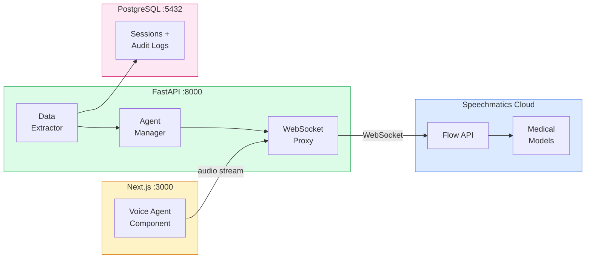

# Speechmatics Flow API Setup Guide for PMS Integration

**Document ID:** PMS-EXP-SPEECHMATICS-FLOW-001
**Version:** 1.0
**Date:** March 3, 2026
**Applies To:** PMS project (all platforms)
**Prerequisites Level:** Intermediate

---

## Table of Contents

1. [Overview](#1-overview)
2. [Prerequisites](#2-prerequisites)
3. [Part A: Configure Speechmatics Flow API](#3-part-a-configure-speechmatics-flow-api)
4. [Part B: Integrate with PMS Backend](#4-part-b-integrate-with-pms-backend)
5. [Part C: Integrate with PMS Frontend](#5-part-c-integrate-with-pms-frontend)
6. [Part D: Testing and Verification](#6-part-d-testing-and-verification)
7. [Troubleshooting](#7-troubleshooting)
8. [Reference Commands](#8-reference-commands)

---

## 1. Overview

This guide walks you through integrating **Speechmatics Flow API** into the PMS for real-time clinical voice agent conversations. By the end you will have:

- Speechmatics Flow API configured with medical language models
- A WebSocket proxy in the PMS backend for bidirectional audio streaming
- A Voice Agent Manager with clinical conversation templates
- A structured data extractor for real-time clinical data capture
- React voice agent components in the Next.js frontend
- HIPAA-compliant audit logging for all voice sessions

### Architecture at a Glance



---

## 2. Prerequisites

### 2.1 Required Software

| Software | Minimum Version | Check Command |
|----------|----------------|---------------|
| Python | 3.11+ | `python --version` |
| Node.js | 20+ | `node --version` |
| Redis | 7.0+ | `redis-cli ping` |
| PostgreSQL | 15+ | `psql --version` |

### 2.2 Required Accounts

| Service | Purpose | Sign Up |
|---------|---------|---------|
| Speechmatics | Flow API access | speechmatics.com/signup |
| Speechmatics Enterprise | BAA for HIPAA (production) | Contact sales |

### 2.3 Verify PMS Services

```bash
# Backend running
curl http://localhost:8000/health

# Frontend running
curl http://localhost:3000

# PostgreSQL accessible
psql -h localhost -p 5432 -U pms -d pms_dev -c "SELECT 1"

# Redis running
redis-cli ping
```

---

## 3. Part A: Configure Speechmatics Flow API

### Step 1: Install the Speechmatics Python SDK

```bash
cd pms-backend
pip install speechmatics>=1.10.0 websockets>=12.0
pip freeze | grep speechmatics
```

### Step 2: Obtain API credentials

1. Sign in to the Speechmatics Portal (portal.speechmatics.com)
2. Navigate to **API Keys** > **Create New Key**
3. Name the key `pms-flow-api`
4. Select scopes: `flow:read`, `flow:write`, `transcription:read`
5. Copy the API key

### Step 3: Configure environment variables

Add to your `.env` file:

```bash
# Speechmatics Flow API
SPEECHMATICS_API_KEY=your_api_key_here
SPEECHMATICS_FLOW_URL=wss://flow.api.speechmatics.com/v1/flow
SPEECHMATICS_LANGUAGE=en
SPEECHMATICS_MEDICAL_MODEL=true
SPEECHMATICS_MAX_SESSIONS=50

# Redis for session state
REDIS_URL=redis://localhost:6379/2
```

### Step 4: Create the Flow API configuration module

Create `app/integrations/speechmatics_flow/config.py`:

```python
"""Speechmatics Flow API configuration."""

from dataclasses import dataclass, field
from enum import Enum
from typing import Optional

from pydantic_settings import BaseSettings


class FlowLanguage(str, Enum):
    """Supported medical language models."""
    ENGLISH = "en"
    SWEDISH = "sv"
    FINNISH = "fi"
    DANISH = "da"
    NORWEGIAN = "no"


class ConversationTemplate(str, Enum):
    """Pre-defined clinical conversation templates."""
    PATIENT_INTAKE = "patient-intake"
    MEDICATION_RECONCILIATION = "medication-reconciliation"
    APPOINTMENT_SCHEDULING = "appointment-scheduling"
    LAB_RESULT_READBACK = "lab-result-readback"


class FlowSettings(BaseSettings):
    """Speechmatics Flow API settings loaded from environment."""

    speechmatics_api_key: str
    speechmatics_flow_url: str = "wss://flow.api.speechmatics.com/v1/flow"
    speechmatics_language: str = "en"
    speechmatics_medical_model: bool = True
    speechmatics_max_sessions: int = 50
    redis_url: str = "redis://localhost:6379/2"

    class Config:
        env_file = ".env"


@dataclass
class FlowSessionConfig:
    """Configuration for a single Flow API voice session."""

    language: FlowLanguage = FlowLanguage.ENGLISH
    template: Optional[ConversationTemplate] = None
    patient_id: Optional[str] = None
    user_id: str = ""
    enable_medical_model: bool = True
    sample_rate: int = 16000
    encoding: str = "pcm_s16le"
    custom_llm_endpoint: Optional[str] = None
    metadata: dict = field(default_factory=dict)
```

### Step 5: Create the Flow API client

Create `app/integrations/speechmatics_flow/client.py`:

```python
"""Speechmatics Flow API WebSocket client."""

import asyncio
import json
import logging
from typing import AsyncIterator, Callable, Optional

import websockets
from websockets.asyncio.client import ClientConnection

from .config import FlowSessionConfig, FlowSettings

logger = logging.getLogger(__name__)


class FlowEvent:
    """Parsed event from Flow API WebSocket."""

    def __init__(self, event_type: str, data: dict):
        self.type = event_type
        self.data = data

    @property
    def transcript(self) -> Optional[str]:
        if self.type in ("partial_transcript", "final_transcript"):
            return self.data.get("metadata", {}).get("transcript", "")
        return None

    @property
    def agent_audio(self) -> Optional[bytes]:
        if self.type == "agent_audio":
            return self.data.get("audio")
        return None

    @property
    def agent_text(self) -> Optional[str]:
        if self.type == "agent_response":
            return self.data.get("text", "")
        return None


class FlowClient:
    """WebSocket client for Speechmatics Flow API."""

    def __init__(self, settings: Optional[FlowSettings] = None):
        self.settings = settings or FlowSettings()
        self._ws: Optional[ClientConnection] = None
        self._session_active = False

    async def connect(self, config: FlowSessionConfig) -> None:
        """Establish WebSocket connection to Flow API."""
        headers = {
            "Authorization": f"Bearer {self.settings.speechmatics_api_key}",
        }

        self._ws = await websockets.connect(
            self.settings.speechmatics_flow_url,
            additional_headers=headers,
            max_size=10 * 1024 * 1024,
        )

        # Send session start message
        start_msg = {
            "message": "StartConversation",
            "audio_format": {
                "type": "raw",
                "encoding": config.encoding,
                "sample_rate": config.sample_rate,
            },
            "conversation_config": {
                "language": config.language.value,
                "medical_model": config.enable_medical_model,
            },
        }

        if config.template:
            start_msg["conversation_config"]["template"] = config.template.value

        if config.custom_llm_endpoint:
            start_msg["conversation_config"]["llm"] = {
                "endpoint": config.custom_llm_endpoint,
            }

        await self._ws.send(json.dumps(start_msg))

        # Wait for ConversationStarted acknowledgment
        response = await self._ws.recv()
        event = json.loads(response)
        if event.get("message") != "ConversationStarted":
            raise ConnectionError(
                f"Flow API connection failed: {event}"
            )

        self._session_active = True
        logger.info("Flow API session started: language=%s", config.language.value)

    async def send_audio(self, audio_chunk: bytes) -> None:
        """Send audio chunk to Flow API."""
        if not self._ws or not self._session_active:
            raise RuntimeError("No active Flow session")
        await self._ws.send(audio_chunk)

    async def receive_events(self) -> AsyncIterator[FlowEvent]:
        """Receive events from Flow API as async iterator."""
        if not self._ws:
            raise RuntimeError("No active Flow session")

        try:
            async for message in self._ws:
                if isinstance(message, bytes):
                    yield FlowEvent("agent_audio", {"audio": message})
                else:
                    data = json.loads(message)
                    msg_type = data.get("message", "unknown")
                    yield FlowEvent(msg_type, data)

                    if msg_type == "ConversationEnded":
                        break
        except websockets.ConnectionClosed:
            logger.info("Flow API connection closed")
        finally:
            self._session_active = False

    async def end_session(self) -> None:
        """Gracefully end the Flow API session."""
        if self._ws and self._session_active:
            await self._ws.send(json.dumps({"message": "EndConversation"}))
            self._session_active = False

    async def close(self) -> None:
        """Close the WebSocket connection."""
        await self.end_session()
        if self._ws:
            await self._ws.close()
            self._ws = None
```

### Step 6: Create the Voice Agent Manager

Create `app/integrations/speechmatics_flow/agent_manager.py`:

```python
"""Voice Agent Manager for clinical conversation orchestration."""

import json
import logging
import uuid
from datetime import datetime, timezone
from typing import Any, Optional

import redis.asyncio as redis

from .config import ConversationTemplate, FlowSessionConfig

logger = logging.getLogger(__name__)


class VoiceSession:
    """Tracks state for an active voice agent session."""

    def __init__(
        self,
        session_id: str,
        config: FlowSessionConfig,
    ):
        self.session_id = session_id
        self.config = config
        self.started_at = datetime.now(timezone.utc)
        self.transcript_segments: list[dict] = []
        self.extracted_data: dict[str, Any] = {}
        self.conversation_state: str = "active"

    def add_transcript(self, speaker: str, text: str) -> None:
        self.transcript_segments.append({
            "speaker": speaker,
            "text": text,
            "timestamp": datetime.now(timezone.utc).isoformat(),
        })

    def to_dict(self) -> dict:
        return {
            "session_id": self.session_id,
            "config": {
                "language": self.config.language.value,
                "template": self.config.template.value if self.config.template else None,
                "patient_id": self.config.patient_id,
                "user_id": self.config.user_id,
            },
            "started_at": self.started_at.isoformat(),
            "transcript_segments": self.transcript_segments,
            "extracted_data": self.extracted_data,
            "conversation_state": self.conversation_state,
        }


class VoiceAgentManager:
    """Manages clinical voice agent sessions with Redis state caching."""

    def __init__(self, redis_url: str = "redis://localhost:6379/2"):
        self._redis = redis.from_url(redis_url)
        self._sessions: dict[str, VoiceSession] = {}

    async def create_session(
        self,
        config: FlowSessionConfig,
    ) -> VoiceSession:
        """Create a new voice agent session."""
        session_id = str(uuid.uuid4())
        session = VoiceSession(session_id=session_id, config=config)
        self._sessions[session_id] = session

        # Cache session state in Redis
        await self._redis.setex(
            f"voice_session:{session_id}",
            3600,  # 1 hour TTL
            json.dumps(session.to_dict()),
        )

        logger.info(
            "Voice session created: id=%s template=%s language=%s",
            session_id,
            config.template,
            config.language.value,
        )
        return session

    async def get_session(self, session_id: str) -> Optional[VoiceSession]:
        """Retrieve an active voice session."""
        return self._sessions.get(session_id)

    async def end_session(self, session_id: str) -> Optional[dict]:
        """End a voice session and return final state."""
        session = self._sessions.pop(session_id, None)
        if session:
            session.conversation_state = "completed"
            await self._redis.delete(f"voice_session:{session_id}")
            return session.to_dict()
        return None

    async def close(self) -> None:
        """Close Redis connection."""
        await self._redis.close()
```

**Checkpoint:** Speechmatics Flow API SDK installed, configuration module created, Flow client and Voice Agent Manager implemented.

---

## 4. Part B: Integrate with PMS Backend

### Step 1: Create the FastAPI WebSocket router

Create `app/api/routes/voice_agent.py`:

```python
"""Voice agent WebSocket endpoints using Speechmatics Flow API."""

import asyncio
import json
import logging
from typing import Optional

from fastapi import APIRouter, Depends, WebSocket, WebSocketDisconnect, Query
from fastapi.responses import JSONResponse

from app.integrations.speechmatics_flow.client import FlowClient, FlowEvent
from app.integrations.speechmatics_flow.config import (
    ConversationTemplate,
    FlowLanguage,
    FlowSessionConfig,
    FlowSettings,
)
from app.integrations.speechmatics_flow.agent_manager import VoiceAgentManager

logger = logging.getLogger(__name__)
router = APIRouter(prefix="/api/voice-agent", tags=["voice-agent"])

# Singletons (initialize in app startup)
settings = FlowSettings()
agent_manager = VoiceAgentManager(redis_url=settings.redis_url)


@router.websocket("/session")
async def voice_agent_session(
    websocket: WebSocket,
    template: Optional[str] = Query(None),
    language: str = Query("en"),
    patient_id: Optional[str] = Query(None),
):
    """
    WebSocket endpoint for voice agent sessions.

    Client sends: binary audio chunks (PCM 16-bit, 16kHz)
    Server sends: JSON events (transcripts, agent responses) and binary audio (agent speech)
    """
    await websocket.accept()

    # Build session config
    config = FlowSessionConfig(
        language=FlowLanguage(language),
        template=ConversationTemplate(template) if template else None,
        patient_id=patient_id,
        enable_medical_model=True,
    )

    # Create session
    session = await agent_manager.create_session(config)
    flow_client = FlowClient(settings)

    try:
        # Connect to Flow API
        await flow_client.connect(config)

        # Send session ID to client
        await websocket.send_json({
            "type": "session_started",
            "session_id": session.session_id,
        })

        # Run send and receive in parallel
        async def forward_audio():
            """Forward client audio to Flow API."""
            try:
                while True:
                    data = await websocket.receive_bytes()
                    await flow_client.send_audio(data)
            except WebSocketDisconnect:
                logger.info("Client disconnected: %s", session.session_id)

        async def forward_events():
            """Forward Flow API events to client."""
            async for event in flow_client.receive_events():
                if event.type == "agent_audio" and event.agent_audio:
                    await websocket.send_bytes(event.agent_audio)
                elif event.transcript:
                    session.add_transcript("user", event.transcript)
                    await websocket.send_json({
                        "type": event.type,
                        "transcript": event.transcript,
                    })
                elif event.agent_text:
                    session.add_transcript("agent", event.agent_text)
                    await websocket.send_json({
                        "type": "agent_response",
                        "text": event.agent_text,
                    })
                else:
                    await websocket.send_json({
                        "type": event.type,
                        "data": event.data,
                    })

        # Run both coroutines concurrently
        await asyncio.gather(
            forward_audio(),
            forward_events(),
            return_exceptions=True,
        )

    except Exception as e:
        logger.error("Voice session error: %s", e)
        await websocket.send_json({"type": "error", "message": str(e)})
    finally:
        await flow_client.close()
        result = await agent_manager.end_session(session.session_id)
        logger.info(
            "Voice session ended: %s segments=%d",
            session.session_id,
            len(result.get("transcript_segments", [])) if result else 0,
        )


@router.get("/templates")
async def list_templates():
    """List available conversation templates."""
    return {
        "templates": [
            {
                "id": t.value,
                "name": t.value.replace("-", " ").title(),
                "description": _TEMPLATE_DESCRIPTIONS.get(t.value, ""),
            }
            for t in ConversationTemplate
        ]
    }


@router.get("/languages")
async def list_languages():
    """List available medical language models."""
    return {
        "languages": [
            {
                "code": lang.value,
                "name": _LANGUAGE_NAMES.get(lang.value, lang.value),
                "kwer": _LANGUAGE_KWER.get(lang.value, "N/A"),
            }
            for lang in FlowLanguage
        ]
    }


@router.get("/health")
async def health_check():
    """Check Speechmatics Flow API connectivity."""
    return {
        "status": "ok",
        "service": "speechmatics-flow",
        "max_sessions": settings.speechmatics_max_sessions,
        "medical_model": True,
    }


# Reference data
_TEMPLATE_DESCRIPTIONS = {
    "patient-intake": "Collect demographics, chief complaint, allergies, and medications",
    "medication-reconciliation": "Read back and verify current medications with patient",
    "appointment-scheduling": "Schedule and confirm patient appointments",
    "lab-result-readback": "Read lab results to clinicians with critical value alerts",
}

_LANGUAGE_NAMES = {
    "en": "English",
    "sv": "Swedish",
    "fi": "Finnish",
    "da": "Danish",
    "no": "Norwegian",
}

_LANGUAGE_KWER = {
    "en": "4.0%",
    "sv": "3.91%",
    "fi": "5.41%",
    "da": "6.15%",
    "no": "7.25%",
}
```

### Step 2: Register the router

Add to `app/main.py`:

```python
from app.api.routes.voice_agent import router as voice_agent_router

app.include_router(voice_agent_router)
```

### Step 3: Create the audit logging model

Add to `app/models/voice_audit.py`:

```python
"""Voice session audit log model."""

from datetime import datetime
from typing import Optional

from sqlalchemy import Column, DateTime, Integer, String, Text, JSON
from sqlalchemy.sql import func

from app.database import Base


class VoiceSessionAudit(Base):
    """HIPAA-compliant audit log for voice agent sessions."""

    __tablename__ = "voice_session_audits"

    id = Column(Integer, primary_key=True, autoincrement=True)
    session_id = Column(String(36), unique=True, nullable=False, index=True)
    user_id = Column(String(36), nullable=False, index=True)
    patient_id_hash = Column(String(64), nullable=True)
    template = Column(String(50), nullable=True)
    language = Column(String(5), nullable=False, default="en")
    started_at = Column(DateTime(timezone=True), nullable=False)
    ended_at = Column(DateTime(timezone=True), nullable=True)
    duration_seconds = Column(Integer, nullable=True)
    segment_count = Column(Integer, default=0)
    extracted_fields = Column(JSON, nullable=True)
    consent_documented = Column(String(10), default="pending")
    created_at = Column(
        DateTime(timezone=True), server_default=func.now()
    )
```

**Checkpoint:** PMS backend has WebSocket proxy for Flow API, conversation template endpoints, medical language model listing, and HIPAA audit logging.

---

## 5. Part C: Integrate with PMS Frontend

### Step 1: Install audio dependencies

```bash
cd pms-frontend
npm install @anthropic-ai/sdk  # Already present for Claude integration
```

No additional NPM packages are required — the browser's native `MediaRecorder` and `WebSocket` APIs handle audio capture and streaming.

### Step 2: Create the Voice Agent hook

Create `src/hooks/useVoiceAgent.ts`:

```typescript
"use client";

import { useState, useRef, useCallback, useEffect } from "react";

interface VoiceAgentEvent {
  type: string;
  transcript?: string;
  text?: string;
  session_id?: string;
  data?: Record<string, unknown>;
}

interface TranscriptEntry {
  speaker: "user" | "agent";
  text: string;
  timestamp: string;
}

interface UseVoiceAgentOptions {
  template?: string;
  language?: string;
  patientId?: string;
  onTranscript?: (entry: TranscriptEntry) => void;
  onAgentAudio?: (audio: ArrayBuffer) => void;
  onError?: (error: string) => void;
}

export function useVoiceAgent(options: UseVoiceAgentOptions = {}) {
  const [isConnected, setIsConnected] = useState(false);
  const [isRecording, setIsRecording] = useState(false);
  const [sessionId, setSessionId] = useState<string | null>(null);
  const [transcript, setTranscript] = useState<TranscriptEntry[]>([]);

  const wsRef = useRef<WebSocket | null>(null);
  const mediaStreamRef = useRef<MediaStream | null>(null);
  const processorRef = useRef<ScriptProcessorNode | null>(null);
  const audioContextRef = useRef<AudioContext | null>(null);

  const connect = useCallback(async () => {
    const params = new URLSearchParams();
    if (options.template) params.set("template", options.template);
    if (options.language) params.set("language", options.language);
    if (options.patientId) params.set("patient_id", options.patientId);

    const wsUrl = `ws://localhost:8000/api/voice-agent/session?${params}`;
    const ws = new WebSocket(wsUrl);
    wsRef.current = ws;

    ws.binaryType = "arraybuffer";

    ws.onopen = () => {
      setIsConnected(true);
    };

    ws.onmessage = (event) => {
      if (event.data instanceof ArrayBuffer) {
        // Agent audio response
        options.onAgentAudio?.(event.data);
        playAudio(event.data);
      } else {
        const parsed: VoiceAgentEvent = JSON.parse(event.data);

        if (parsed.type === "session_started" && parsed.session_id) {
          setSessionId(parsed.session_id);
        } else if (
          parsed.type === "final_transcript" &&
          parsed.transcript
        ) {
          const entry: TranscriptEntry = {
            speaker: "user",
            text: parsed.transcript,
            timestamp: new Date().toISOString(),
          };
          setTranscript((prev) => [...prev, entry]);
          options.onTranscript?.(entry);
        } else if (parsed.type === "agent_response" && parsed.text) {
          const entry: TranscriptEntry = {
            speaker: "agent",
            text: parsed.text,
            timestamp: new Date().toISOString(),
          };
          setTranscript((prev) => [...prev, entry]);
          options.onTranscript?.(entry);
        }
      }
    };

    ws.onerror = () => {
      options.onError?.("WebSocket connection error");
    };

    ws.onclose = () => {
      setIsConnected(false);
      setIsRecording(false);
    };
  }, [options]);

  const startRecording = useCallback(async () => {
    if (!wsRef.current || wsRef.current.readyState !== WebSocket.OPEN) {
      return;
    }

    const stream = await navigator.mediaDevices.getUserMedia({
      audio: {
        sampleRate: 16000,
        channelCount: 1,
        echoCancellation: true,
        noiseSuppression: true,
      },
    });

    mediaStreamRef.current = stream;
    const audioContext = new AudioContext({ sampleRate: 16000 });
    audioContextRef.current = audioContext;

    const source = audioContext.createMediaStreamSource(stream);
    const processor = audioContext.createScriptProcessor(4096, 1, 1);
    processorRef.current = processor;

    processor.onaudioprocess = (e) => {
      if (wsRef.current?.readyState === WebSocket.OPEN) {
        const float32 = e.inputBuffer.getChannelData(0);
        const int16 = new Int16Array(float32.length);
        for (let i = 0; i < float32.length; i++) {
          const s = Math.max(-1, Math.min(1, float32[i]));
          int16[i] = s < 0 ? s * 0x8000 : s * 0x7fff;
        }
        wsRef.current.send(int16.buffer);
      }
    };

    source.connect(processor);
    processor.connect(audioContext.destination);
    setIsRecording(true);
  }, []);

  const stopRecording = useCallback(() => {
    processorRef.current?.disconnect();
    mediaStreamRef.current?.getTracks().forEach((t) => t.stop());
    audioContextRef.current?.close();
    setIsRecording(false);
  }, []);

  const disconnect = useCallback(() => {
    stopRecording();
    wsRef.current?.close();
    setIsConnected(false);
    setSessionId(null);
  }, [stopRecording]);

  // Cleanup on unmount
  useEffect(() => {
    return () => {
      disconnect();
    };
  }, [disconnect]);

  return {
    isConnected,
    isRecording,
    sessionId,
    transcript,
    connect,
    startRecording,
    stopRecording,
    disconnect,
  };
}

/** Play raw PCM audio through Web Audio API. */
function playAudio(buffer: ArrayBuffer) {
  const audioCtx = new AudioContext({ sampleRate: 16000 });
  const int16 = new Int16Array(buffer);
  const float32 = new Float32Array(int16.length);
  for (let i = 0; i < int16.length; i++) {
    float32[i] = int16[i] / 0x7fff;
  }
  const audioBuffer = audioCtx.createBuffer(1, float32.length, 16000);
  audioBuffer.copyToChannel(float32, 0);
  const source = audioCtx.createBufferSource();
  source.buffer = audioBuffer;
  source.connect(audioCtx.destination);
  source.start();
}
```

### Step 3: Create the Voice Agent component

Create `src/components/voice/VoiceAgentPanel.tsx`:

```tsx
"use client";

import { useState } from "react";
import { useVoiceAgent } from "@/hooks/useVoiceAgent";

interface VoiceAgentPanelProps {
  patientId?: string;
}

export function VoiceAgentPanel({ patientId }: VoiceAgentPanelProps) {
  const [template, setTemplate] = useState("patient-intake");
  const [language, setLanguage] = useState("en");

  const {
    isConnected,
    isRecording,
    sessionId,
    transcript,
    connect,
    startRecording,
    stopRecording,
    disconnect,
  } = useVoiceAgent({
    template,
    language,
    patientId,
    onError: (err) => console.error("Voice agent error:", err),
  });

  return (
    <div className="rounded-lg border border-gray-200 bg-white p-6 shadow-sm">
      <h2 className="mb-4 text-lg font-semibold text-gray-900">
        Voice Agent
      </h2>

      {/* Controls */}
      <div className="mb-4 flex gap-3">
        <select
          value={template}
          onChange={(e) => setTemplate(e.target.value)}
          disabled={isConnected}
          className="rounded border border-gray-300 px-3 py-2 text-sm"
        >
          <option value="patient-intake">Patient Intake</option>
          <option value="medication-reconciliation">
            Medication Reconciliation
          </option>
          <option value="appointment-scheduling">
            Appointment Scheduling
          </option>
          <option value="lab-result-readback">Lab Result Readback</option>
        </select>

        <select
          value={language}
          onChange={(e) => setLanguage(e.target.value)}
          disabled={isConnected}
          className="rounded border border-gray-300 px-3 py-2 text-sm"
        >
          <option value="en">English (4.0% KWER)</option>
          <option value="sv">Swedish (3.91% KWER)</option>
          <option value="fi">Finnish (5.41% KWER)</option>
          <option value="da">Danish (6.15% KWER)</option>
          <option value="no">Norwegian (7.25% KWER)</option>
        </select>
      </div>

      {/* Action Buttons */}
      <div className="mb-4 flex gap-2">
        {!isConnected ? (
          <button
            onClick={connect}
            className="rounded bg-blue-600 px-4 py-2 text-sm font-medium text-white hover:bg-blue-700"
          >
            Start Session
          </button>
        ) : (
          <>
            {!isRecording ? (
              <button
                onClick={startRecording}
                className="rounded bg-green-600 px-4 py-2 text-sm font-medium text-white hover:bg-green-700"
              >
                Start Speaking
              </button>
            ) : (
              <button
                onClick={stopRecording}
                className="rounded bg-red-600 px-4 py-2 text-sm font-medium text-white hover:bg-red-700"
              >
                Stop Speaking
              </button>
            )}
            <button
              onClick={disconnect}
              className="rounded border border-gray-300 px-4 py-2 text-sm font-medium text-gray-700 hover:bg-gray-50"
            >
              End Session
            </button>
          </>
        )}
      </div>

      {/* Status */}
      <div className="mb-4 flex items-center gap-2 text-sm text-gray-600">
        <span
          className={`inline-block h-2 w-2 rounded-full ${
            isRecording
              ? "animate-pulse bg-red-500"
              : isConnected
                ? "bg-green-500"
                : "bg-gray-400"
          }`}
        />
        {isRecording
          ? "Listening..."
          : isConnected
            ? "Connected"
            : "Disconnected"}
        {sessionId && (
          <span className="ml-2 text-xs text-gray-400">
            Session: {sessionId.slice(0, 8)}
          </span>
        )}
      </div>

      {/* Transcript */}
      <div className="max-h-96 overflow-y-auto rounded bg-gray-50 p-4">
        {transcript.length === 0 ? (
          <p className="text-sm text-gray-400">
            Conversation transcript will appear here...
          </p>
        ) : (
          <div className="space-y-3">
            {transcript.map((entry, i) => (
              <div
                key={i}
                className={`flex ${
                  entry.speaker === "user"
                    ? "justify-end"
                    : "justify-start"
                }`}
              >
                <div
                  className={`max-w-[80%] rounded-lg px-3 py-2 text-sm ${
                    entry.speaker === "user"
                      ? "bg-blue-100 text-blue-900"
                      : "bg-white text-gray-900 shadow-sm"
                  }`}
                >
                  <p className="mb-1 text-xs font-medium text-gray-500">
                    {entry.speaker === "user" ? "You" : "Agent"}
                  </p>
                  <p>{entry.text}</p>
                </div>
              </div>
            ))}
          </div>
        )}
      </div>
    </div>
  );
}
```

**Checkpoint:** Next.js frontend has a `useVoiceAgent` hook for WebSocket audio streaming and a `VoiceAgentPanel` component with template selection, language selection, recording controls, and live transcript display.

---

## 6. Part D: Testing and Verification

### Step 1: Verify Speechmatics connectivity

```bash
curl http://localhost:8000/api/voice-agent/health
```

Expected:
```json
{
  "status": "ok",
  "service": "speechmatics-flow",
  "max_sessions": 50,
  "medical_model": true
}
```

### Step 2: List available templates

```bash
curl http://localhost:8000/api/voice-agent/templates
```

Expected:
```json
{
  "templates": [
    {"id": "patient-intake", "name": "Patient Intake", "description": "Collect demographics, chief complaint, allergies, and medications"},
    {"id": "medication-reconciliation", "name": "Medication Reconciliation", "description": "Read back and verify current medications with patient"},
    {"id": "appointment-scheduling", "name": "Appointment Scheduling", "description": "Schedule and confirm patient appointments"},
    {"id": "lab-result-readback", "name": "Lab Result Readback", "description": "Read lab results to clinicians with critical value alerts"}
  ]
}
```

### Step 3: List medical language models

```bash
curl http://localhost:8000/api/voice-agent/languages
```

Expected:
```json
{
  "languages": [
    {"code": "en", "name": "English", "kwer": "4.0%"},
    {"code": "sv", "name": "Swedish", "kwer": "3.91%"},
    {"code": "fi", "name": "Finnish", "kwer": "5.41%"},
    {"code": "da", "name": "Danish", "kwer": "6.15%"},
    {"code": "no", "name": "Norwegian", "kwer": "7.25%"}
  ]
}
```

### Step 4: Test WebSocket connection

```bash
# Using websocat for WebSocket testing
pip install websockets
python -c "
import asyncio, websockets, json

async def test():
    uri = 'ws://localhost:8000/api/voice-agent/session?template=patient-intake&language=en'
    async with websockets.connect(uri) as ws:
        msg = await ws.recv()
        data = json.loads(msg)
        print(f'Session started: {data}')
        assert data['type'] == 'session_started'
        print('WebSocket connection test passed')

asyncio.run(test())
"
```

### Step 5: Test frontend component

1. Open http://localhost:3000 in Chrome
2. Navigate to a patient encounter view
3. Click **Start Session** on the Voice Agent panel
4. Grant microphone access when prompted
5. Click **Start Speaking** and speak: "Patient reports headache for three days"
6. Verify transcript appears in the panel
7. Click **End Session**

**Checkpoint:** All five verification steps pass — backend health check, template listing, language listing, WebSocket connection, and frontend voice agent interaction.

---

## 7. Troubleshooting

### WebSocket Connection Refused

**Symptom:** `WebSocket connection to 'ws://localhost:8000/api/voice-agent/session' failed`
**Cause:** Backend not running or WebSocket route not registered.
**Fix:** Verify `app.include_router(voice_agent_router)` in main.py. Check `uvicorn` is running with `--ws auto`.

### Microphone Permission Denied

**Symptom:** `NotAllowedError: Permission denied` in browser console.
**Cause:** Browser blocked microphone access.
**Fix:** Click the lock icon in the URL bar > Site settings > Microphone > Allow. Must use HTTPS in production (localhost is exempt).

### Flow API Authentication Error

**Symptom:** `ConversationStarted` never received; connection closes immediately.
**Cause:** Invalid or expired Speechmatics API key.
**Fix:** Verify `SPEECHMATICS_API_KEY` in `.env`. Regenerate at portal.speechmatics.com if expired.

### High Latency in Agent Responses

**Symptom:** Agent takes 3+ seconds to respond after user finishes speaking.
**Cause:** LLM routing adds latency, or audio chunks too large.
**Fix:** Reduce `ScriptProcessor` buffer size from 4096 to 2048. Verify LLM endpoint is responsive. Check network latency to Speechmatics servers.

### Audio Playback Distortion

**Symptom:** Agent speech sounds garbled or too fast/slow.
**Cause:** Sample rate mismatch between Flow API output and Web Audio API playback.
**Fix:** Ensure `AudioContext` sample rate matches Flow API output format (16kHz PCM by default).

### Redis Connection Error

**Symptom:** `ConnectionRefusedError: Connection refused` on session creation.
**Cause:** Redis not running or wrong URL.
**Fix:** `redis-cli ping` to verify. Check `REDIS_URL` in `.env` matches your Redis instance.

---

## 8. Reference Commands

### Daily Development

```bash
# Start all services
docker compose up -d redis postgres
cd pms-backend && uvicorn app.main:app --reload --ws auto --port 8000
cd pms-frontend && npm run dev

# Watch voice agent logs
tail -f pms-backend/logs/voice_agent.log

# Check active voice sessions via Redis
redis-cli -n 2 keys "voice_session:*"
```

### Management Commands

```bash
# List Speechmatics API usage
curl -H "Authorization: Bearer $SPEECHMATICS_API_KEY" \
  https://mp.speechmatics.com/v1/api_usage

# Test medical model accuracy
python scripts/test_medical_accuracy.py --language en --model medical

# Run voice agent integration tests
pytest tests/integrations/test_voice_agent.py -v
```

### Useful URLs

| Resource | URL |
|----------|-----|
| Speechmatics Portal | portal.speechmatics.com |
| Flow API Docs | docs.speechmatics.com/flow |
| Medical Model Docs | docs.speechmatics.com/features/medical |
| PMS Voice Agent Health | http://localhost:8000/api/voice-agent/health |

---

## Next Steps

1. Work through the [Speechmatics Flow API Developer Tutorial](33-SpeechmaticsFlow-Developer-Tutorial.md) to build a complete medication reconciliation voice agent
2. Review [Speechmatics Medical (Experiment 10)](10-SpeechmaticsMedical-PMS-Developer-Setup-Guide.md) for passive dictation features that complement Flow API
3. Explore [ElevenLabs (Experiment 30)](30-ElevenLabs-PMS-Developer-Setup-Guide.md) for alternative TTS quality comparison

---

## Resources

- **Flow API Documentation:** [docs.speechmatics.com/flow](https://docs.speechmatics.com/flow/getting-started)
- **Medical Model:** [speechmatics.com/medical-model](https://www.speechmatics.com/company/articles-and-news/introducing-the-worlds-most-accurate-medical-model)
- **Nordic Healthcare Models:** [speechmatics.com/nordic](https://www.speechmatics.com/company/articles-and-news/speechmatics-nordic-healthcare-medical-models)
- **Python SDK:** [github.com/speechmatics/speechmatics-python](https://github.com/speechmatics/speechmatics-python)
