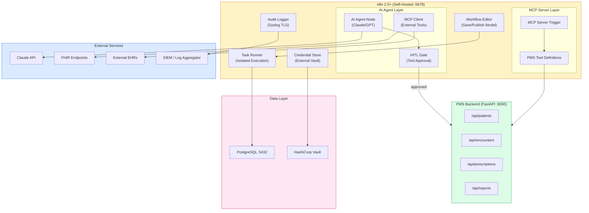

# Product Requirements Document: n8n 2.0+ Updates Integration into Patient Management System (PMS)

**Document ID:** PRD-PMS-N8N-UPDATES-001
**Version:** 1.0
**Date:** March 3, 2026
**Author:** Ammar (CEO, MPS Inc.)
**Status:** Draft

---

## 1. Executive Summary

n8n 2.0, released December 2025, is a hardening release that transforms n8n from a flexible prototyping tool into a production-grade workflow automation platform. The release introduces **task runners** (isolated Code node execution by default), a **save/publish workflow model** (separating edits from live production), **human-in-the-loop (HITL) for AI agent tool calls** (gated approval before high-impact actions), and **MCP (Model Context Protocol) bidirectional integration** (n8n as both MCP server and MCP client). Combined with enterprise features like audit logging, RBAC, encrypted credential storage with external vault integration, and Syslog TLS streaming, n8n 2.0+ provides the security and governance foundation needed for HIPAA-regulated healthcare automation.

Integrating n8n 2.0+ into the PMS provides three critical capabilities: (1) **clinical workflow automation with HITL approval gates** where AI agents process prior authorizations, care coordination tasks, and medication reconciliation workflows but require clinician approval before executing high-impact actions like sending prescriptions or updating patient records; (2) **MCP-powered tool integration** where n8n workflows expose PMS APIs as MCP tools that any AI agent (Claude, Copilot, Gemini) can discover and call, while n8n agents consume external MCP servers for clinical decision support; and (3) **enterprise-grade security** with isolated code execution, encrypted credentials, audit trails, and RBAC that satisfy HIPAA technical safeguard requirements for self-hosted deployments.

n8n 2.0+ complements LangGraph (Experiment 26) by providing a visual, low-code workflow builder for clinical automation that non-developers (clinical operations staff) can use, while LangGraph handles complex stateful agent orchestration that requires custom Python code.

---

## 2. Problem Statement

- **No visual clinical workflow automation:** Clinical operations staff need to automate repetitive workflows (appointment reminders, lab result routing, insurance verification) but lack a visual tool — current options require developer time for every workflow change.
- **No human-in-the-loop for AI agent actions:** AI agents processing clinical workflows can take high-impact actions (updating patient records, sending prescriptions) without mandatory human review — creating patient safety and compliance risks.
- **No MCP bridge between PMS and AI agents:** PMS APIs are not discoverable by external AI agents — each integration requires custom code. Conversely, n8n agents cannot leverage external clinical decision support tools via MCP.
- **Workflow automation lacks security isolation:** Code execution in automation workflows runs in the same process as the platform, creating security risks for healthcare environments where workflow code may process PHI.
- **No audit trail for automated clinical actions:** When workflows modify patient data, there is no centralized, tamper-evident log of what changed, who approved it, and which workflow triggered the action.
- **Credential management not healthcare-grade:** API keys, database passwords, and service tokens are stored in platform databases rather than enterprise vault systems (HashiCorp Vault, AWS Secrets Manager).

---

## 3. Proposed Solution

Adopt **n8n 2.0+** as the visual workflow automation platform for PMS clinical operations, self-hosted on HIPAA-compliant infrastructure, with HITL approval gates for patient-safety-critical actions, MCP integration for AI agent interoperability, and enterprise security features for compliance.

### 3.1 Architecture Overview

### 3.2 Deployment Model

- **Self-hosted (mandatory for HIPAA):** n8n deployed on private cloud or on-premise infrastructure — no PHI passes through n8n's cloud
- **Docker Compose deployment:** n8n + PostgreSQL + Redis in a single `docker-compose.yml` with encrypted volumes
- **Task runners enabled:** All Code node execution runs in isolated sandboxed processes by default (n8n 2.0+)
- **External credential storage:** HashiCorp Vault or AWS Secrets Manager for API keys and database credentials
- **Syslog TLS streaming:** Audit logs streamed to enterprise SIEM over encrypted TLS/TCP connections
- **Licensing:** n8n Community (free, self-hosted) for development; n8n Enterprise for RBAC, audit logging, and SSO

---

## 4. PMS Data Sources

| PMS Resource | n8n Integration | Use Case |
|-------------|----------------|----------|
| Patient Records API (`/api/patients`) | Webhook trigger + HTTP node | Patient registration workflows, demographic updates |
| Encounter Records API (`/api/encounters`) | AI Agent + HITL gate | Encounter documentation automation with clinician approval |
| Medication & Prescription API (`/api/prescriptions`) | AI Agent + HITL gate | Medication reconciliation workflows with pharmacist review |
| Reporting API (`/api/reports`) | Schedule trigger + HTTP node | Automated daily/weekly clinical reports |
| Appointment API (`/api/appointments`) | Webhook trigger + Chat node | Appointment reminder workflows with patient confirmation |

---

## 5. Component/Module Definitions

### 5.1 Clinical Workflow Templates

**Description:** Pre-built n8n workflow templates for common PMS clinical operations.

**Templates:**
- `prior-authorization` — Insurance verification → clinical data collection → submission → HITL approval → status tracking
- `appointment-reminder` — Schedule trigger → patient lookup → SMS/email send → response tracking
- `lab-result-routing` — HL7 webhook → result parsing → critical value check → clinician notification → HITL acknowledgment
- `medication-reconciliation` — Patient encounter trigger → medication list fetch → AI analysis → pharmacist HITL review → record update
- `care-coordination-referral` — Referral request → FHIR bundle creation → external EHR submission → status monitoring

### 5.2 HITL Approval Gate System

**Description:** Human-in-the-loop approval mechanism for AI agent tool calls in clinical workflows.

**How it works:**
1. AI Agent node calls a tool (e.g., "Update Patient Record")
2. HITL gate intercepts the tool call and pauses execution
3. Clinician receives approval request via Chat node (Slack, Teams, or n8n UI)
4. Clinician reviews the proposed action and approves/rejects
5. If approved, the tool executes; if rejected, the workflow routes to an alternative path
6. All approval decisions are audit-logged

**PMS APIs:** All write operations gated by HITL.

### 5.3 MCP Server Workflows

**Description:** n8n workflows exposed as MCP tools that external AI agents can discover and call.

**Exposed Tools:**
- `pms-patient-lookup` — Search patients by name, MRN, or DOB
- `pms-encounter-summary` — Get encounter summary for a patient
- `pms-medication-list` — Get active medications for a patient
- `pms-schedule-appointment` — Schedule an appointment (HITL-gated)
- `pms-lab-results` — Get recent lab results for a patient

**PMS APIs:** All PMS APIs exposed through MCP tool definitions.

### 5.4 MCP Client Integrations

**Description:** n8n AI agents consuming external MCP servers for clinical decision support.

**Connected MCP Servers:**
- PMS MCP Server (Experiment 9) — Direct PMS data access
- FHIR MCP Server — External EHR data via FHIR R4
- Clinical guidelines MCP — Treatment protocol lookup
- Drug interaction MCP — Medication safety checking

### 5.5 Enterprise Security Layer

**Description:** Security infrastructure for HIPAA-compliant workflow automation.

**Components:**
- **Task Runner:** Isolated Code node execution in sandboxed processes
- **Credential Vault:** External secret management (HashiCorp Vault, AWS Secrets Manager)
- **Audit Logger:** Centralized audit trail with Syslog TLS streaming to SIEM
- **RBAC:** Role-based access control mapped to PMS user roles (admin, clinician, operations)
- **Save/Publish Model:** Workflow edits separated from production execution — requires explicit publish

### 5.6 PostgreSQL Memory for AI Agents

**Description:** Persistent conversation memory for n8n AI agents using PostgreSQL (replacing deprecated Motorhead).

**Purpose:** AI agents processing multi-step clinical workflows need conversation history that survives restarts and can be audited.

**PMS Integration:** Memory table stored in the same PostgreSQL instance as PMS data, with separate schema for isolation.

---

## 6. Non-Functional Requirements

### 6.1 Security and HIPAA Compliance

- **Self-hosted mandatory:** n8n must run on HIPAA-compliant infrastructure — no PHI on n8n cloud
- **Task runners enabled:** All Code node execution in isolated sandboxed processes (default in 2.0+)
- **Encrypted credentials:** All API keys and passwords stored in external vault (HashiCorp Vault or AWS Secrets Manager)
- **Audit logging:** Every workflow execution, credential access, and HITL decision logged with tamper-evident storage
- **Syslog TLS:** Audit logs streamed to SIEM over TLS/TCP encrypted connections
- **RBAC:** Role-based access control — clinical operations can build workflows but cannot access credentials directly
- **PHI isolation:** Workflow data containing PHI encrypted at rest (AES-256) and in transit (TLS 1.3)
- **Environment variable blocking:** Code nodes cannot access environment variables by default (n8n 2.0+)

### 6.2 Performance

| Metric | Target |
|--------|--------|
| Workflow execution start | < 500ms |
| HITL notification delivery | < 5 seconds |
| MCP tool response time | < 2 seconds |
| Concurrent workflow executions | 100+ |
| Audit log write latency | < 100ms |
| Webhook response time | < 1 second |

### 6.3 Infrastructure

- **Docker Compose:** n8n + PostgreSQL + Redis + Vault
- **Compute:** 2 vCPU, 4GB RAM minimum for n8n server
- **Storage:** 50GB+ for workflow data, execution logs, and audit records
- **Network:** HTTPS for editor, TLS for Syslog, WebSocket for MCP SSE
- **n8n Enterprise license:** Required for RBAC, audit logging, SSO, and external credentials

---

## 7. Implementation Phases

### Phase 1: Foundation — Self-Hosted Deployment & Security (Sprint 1)

- Deploy n8n 2.0+ self-hosted with Docker Compose on HIPAA-compliant infrastructure
- Configure task runners, encrypted credentials, and PostgreSQL backend
- Set up RBAC with PMS-aligned roles (admin, clinician, operations)
- Enable audit logging with Syslog TLS streaming to SIEM
- Build first workflow: appointment reminder with patient lookup

### Phase 2: Clinical Workflows with HITL (Sprints 2-3)

- Build prior authorization workflow with AI agent and HITL approval
- Build medication reconciliation workflow with pharmacist review gate
- Build lab result routing workflow with critical value alerting
- Configure Chat node for Slack/Teams HITL notifications
- Deploy PostgreSQL Memory for AI agent conversation persistence
- Team training on workflow editor (save/publish model)

### Phase 3: MCP Integration & Advanced Automation (Sprints 4-5)

- Create MCP Server workflows exposing PMS APIs as discoverable tools
- Connect MCP Client to external clinical decision support servers
- Build care coordination referral workflow with FHIR bundle creation
- Create workflow template library for clinical operations team
- Build workflow execution dashboard with performance metrics
- Optimize HITL response times and escalation paths

---

## 8. Success Metrics

| Metric | Target | Measurement Method |
|--------|--------|-------------------|
| Clinical workflows automated | 10+ active workflows | n8n execution dashboard |
| HITL approval response time | < 5 minutes average | Workflow execution logs |
| Workflow execution success rate | > 95% | n8n error tracking |
| Time saved per week | 20+ staff hours | Time Saved node tracking |
| MCP tools exposed | 5+ PMS tools discoverable | MCP server health check |
| Audit log completeness | 100% of executions logged | SIEM correlation |

---

## 9. Risks and Mitigations

| Risk | Impact | Mitigation |
|------|--------|------------|
| Self-hosted maintenance burden | DevOps overhead for updates and monitoring | Use Docker Compose with automated updates; assign dedicated infrastructure owner |
| HITL bottleneck delays patient care | Workflows stall waiting for approval | Configure escalation paths with timeout auto-routing; prioritize critical workflows |
| AI agent hallucination in clinical workflows | Incorrect patient data updates | HITL gate on all write operations; validate AI output against PMS data before execution |
| n8n Community license lacks enterprise features | No RBAC, audit logging, or SSO | Budget for n8n Enterprise license ($50/month self-hosted) for production deployment |
| Credential exposure in workflow definitions | Security breach | External vault integration; never store secrets in workflow JSON; audit credential access |
| Workflow complexity grows unmanageable | Difficult to maintain and debug | Enforce workflow naming conventions; limit workflow size; use sub-workflows for reusability |

---

## 10. Dependencies

| Dependency | Version | Purpose |
|-----------|---------|---------|
| n8n | >= 2.0 | Workflow automation platform |
| PostgreSQL | >= 15 | Workflow data, execution logs, AI memory |
| Redis | >= 7.0 | Queue management, execution scaling |
| Docker | >= 24 | Container deployment |
| HashiCorp Vault | >= 1.15 | External credential storage |
| Claude API (Anthropic) | Current | AI Agent node LLM provider |
| n8n Enterprise License | Current | RBAC, audit logging, SSO, external credentials |

---

## 11. Comparison with Existing Experiments

| Aspect | n8n 2.0+ (Exp 34) | LangGraph (Exp 26) | OpenClaw (Exp 5) | MCP (Exp 9) |
|--------|-------------------|-------------------|------------------|-------------|
| **Primary function** | Visual workflow automation | Stateful agent orchestration | Agentic workflow automation | AI tool integration protocol |
| **User audience** | Clinical ops + developers | Developers only | Developers only | Developers only |
| **Visual builder** | Yes (drag-and-drop) | No (Python code) | No (code-based) | No |
| **HITL support** | Tool-level gating | Checkpoint-based | Approval tiers | N/A |
| **MCP integration** | Bidirectional (server + client) | Via custom tools | No | Core protocol |
| **Self-hosted** | Yes (Docker) | Yes (Python) | Yes (Docker) | Yes (FastMCP) |
| **Enterprise governance** | RBAC, audit, SSO | None built-in | None built-in | None built-in |
| **AI agent support** | Built-in Agent node | Core feature | Core feature | Tool exposure |
| **Best for** | Visual clinical workflow automation | Complex stateful agents | Autonomous task execution | AI tool interoperability |

**Complementary roles:**
- **n8n 2.0+ (Exp 34)** provides visual, low-code workflow automation accessible to clinical operations staff with enterprise governance
- **LangGraph (Exp 26)** handles complex, code-heavy agent orchestration with durable state checkpointing
- **MCP (Exp 9)** provides the interoperability standard that n8n leverages for bidirectional tool integration
- Together, they form a layered automation stack: n8n (visual workflows) → LangGraph (complex agents) → MCP (tool interoperability)

---

## 12. Research Sources

### Official Documentation
- [n8n Release Notes](https://docs.n8n.io/release-notes/) — Complete changelog for n8n 2.0+ releases
- [n8n AI Agents](https://n8n.io/ai-agents/) — AI agent node capabilities, HITL, and tool integration
- [n8n MCP Client Tool Documentation](https://docs.n8n.io/integrations/builtin/cluster-nodes/sub-nodes/n8n-nodes-langchain.toolmcp/) — MCP Client node setup and configuration

### Architecture & Security
- [n8n Enterprise Features](https://n8n.io/enterprise/) — RBAC, audit logging, SSO, encrypted credentials
- [n8n Security Audit Documentation](https://docs.n8n.io/hosting/securing/security-audit/) — Built-in security scanning and audit capabilities
- [Introducing n8n 2.0](https://blog.n8n.io/introducing-n8n-2-0/) — Task runners, save/publish model, hardening improvements

### Healthcare & Compliance
- [n8n HIPAA Compliance Guide](https://ciphernutz.com/blog/n8n-hipaa-compliance) — Self-hosted deployment for healthcare compliance
- [n8n Self-Hosted Architecture Guide](https://northflank.com/blog/how-to-self-host-n8n-setup-architecture-and-pricing-guide) — Infrastructure architecture for self-hosted n8n

### MCP Integration
- [n8n MCP Integration Guide](https://www.leanware.co/insights/n8n-mcp-integration) — Bidirectional MCP setup with n8n
- [n8n MCP Server Trigger](https://www.n8n-mcp.com/) — Exposing n8n workflows as MCP tools

---

## 13. Appendix: Related Documents

- [n8n 2.0+ Setup Guide](34-n8nUpdates-PMS-Developer-Setup-Guide.md)
- [n8n 2.0+ Developer Tutorial](34-n8nUpdates-Developer-Tutorial.md)
- [LangGraph PRD (Experiment 26)](26-PRD-LangGraph-PMS-Integration.md)
- [MCP PRD (Experiment 9)](09-PRD-MCP-PMS-Integration.md)
- [OpenClaw PRD (Experiment 5)](05-PRD-OpenClaw-PMS-Integration.md)
