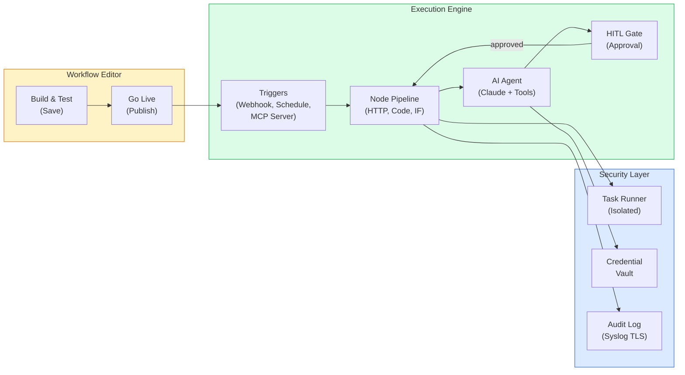
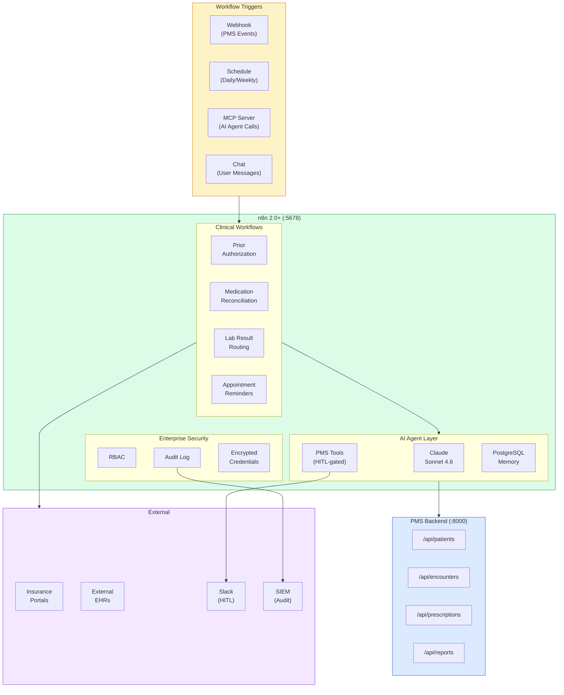

# n8n 2.0+ Developer Onboarding Tutorial

**Welcome to the MPS PMS n8n 2.0+ Integration Team**

This tutorial will take you from zero to building your first clinical workflow automation with n8n. By the end, you will understand how n8n 2.0+ provides production-grade workflow automation, have a running local environment, and have built and tested a prior authorization workflow with AI agents and human-in-the-loop approval end-to-end.

**Document ID:** PMS-EXP-N8N-UPDATES-002
**Version:** 1.0
**Date:** March 3, 2026
**Applies To:** PMS project (all platforms)
**Prerequisite:** [n8n 2.0+ Setup Guide](34-n8nUpdates-PMS-Developer-Setup-Guide.md)
**Estimated time:** 2-3 hours
**Difficulty:** Beginner-friendly

---

## What You Will Learn

1. What n8n 2.0+ is and what changed in the hardening release
2. How task runners provide isolated code execution for security
3. How the save/publish model separates workflow development from production
4. How AI Agent nodes integrate with Claude for clinical reasoning
5. How human-in-the-loop (HITL) gates enforce clinician approval on high-impact actions
6. How MCP Server and Client nodes enable bidirectional tool integration
7. How PostgreSQL Memory replaces deprecated Motorhead for agent persistence
8. How to build clinical workflows for prior authorization and medication reconciliation
9. How enterprise features (RBAC, audit logging, encrypted credentials) support HIPAA compliance
10. How n8n 2.0+ compares to LangGraph and OpenClaw for clinical automation

---

## Part 1: Understanding n8n 2.0+ (15 min read)

### 1.1 What Problem Does n8n 2.0+ Solve?

Clinical operations staff spend hours on repetitive administrative tasks: verifying insurance coverage, sending appointment reminders, routing lab results, and coordinating care between providers. These tasks follow predictable patterns but require careful handling because they involve patient data.

> *The prior authorization coordinator submits 40 requests per day, each requiring: patient data lookup, clinical documentation collection, insurance portal submission, and status tracking. Each request takes 15-20 minutes of manual work.*

n8n 2.0+ solves this by providing a **visual workflow builder** where clinical operations staff can automate these patterns while maintaining the human oversight required for patient safety. The 2.0 hardening release specifically addresses production-readiness concerns:

1. **Task runners** — Code executes in isolated sandboxed processes, preventing a malformed workflow from affecting the platform
2. **Save/Publish model** — Edit workflows freely without affecting production; explicitly publish when ready
3. **HITL for AI tools** — AI agents cannot take high-impact actions without explicit human approval
4. **Enterprise security** — RBAC, audit logging, encrypted credentials, and Syslog TLS streaming

### 1.2 How n8n 2.0+ Works — The Key Pieces



**Three key concepts:**

1. **Visual workflow builder with save/publish:** Non-developers can build workflows by dragging and connecting nodes. The save/publish separation prevents accidental production changes — you edit freely, then explicitly publish when ready.

2. **AI Agent node with HITL gates:** The AI Agent node connects to Claude (or GPT) for reasoning. When the agent wants to call a tool that modifies data (update patient record, send prescription), the HITL gate pauses execution and requires human approval via Slack, Teams, or the n8n Chat UI.

3. **MCP bidirectional integration:** n8n can be both an MCP **server** (exposing workflows as tools that external AI agents call) and an MCP **client** (n8n agents consuming tools from external MCP servers). This makes n8n workflows discoverable by Claude, Copilot, and any MCP-compatible AI.

### 1.3 How n8n 2.0+ Fits with Other PMS Technologies

| Feature | n8n 2.0+ (Exp 34) | LangGraph (Exp 26) | OpenClaw (Exp 5) | MCP (Exp 9) |
|---------|-------------------|-------------------|------------------|-------------|
| Visual builder | Drag-and-drop | Python code | Code-based | N/A |
| User audience | Ops + devs | Developers | Developers | Developers |
| HITL support | Tool-level gates | Checkpoints | Approval tiers | N/A |
| MCP integration | Server + Client | Custom tools | None | Core protocol |
| Self-hosted | Docker Compose | Python + PostgreSQL | Docker | FastMCP |
| Enterprise governance | RBAC, audit, SSO | None built-in | None | None |
| Conversation memory | PostgreSQL Memory | PostgreSQL checkpoints | None | N/A |
| Best for | Visual workflow automation | Complex stateful agents | Autonomous tasks | Tool interoperability |

### 1.4 Key Vocabulary

| Term | Meaning |
|------|---------|
| Task Runner | Isolated sandbox process for Code node execution (n8n 2.0+ default) |
| Save/Publish | Workflow editing model — Save preserves edits, Publish makes them live |
| HITL | Human-in-the-loop — requires human approval before executing a tool |
| MCP Server Trigger | Node that exposes n8n workflows as MCP tools for external AI agents |
| MCP Client Tool | Node that connects n8n agents to external MCP servers |
| Chat Node | Node for human interaction — send messages, collect approvals |
| PostgreSQL Memory | Persistent conversation history for AI agents (replaces Motorhead) |
| Webhook Trigger | Node that starts a workflow when an HTTP request arrives |
| Credential Store | Encrypted storage for API keys, integrated with external vaults |
| Execution Queue | Redis-backed queue for parallel workflow execution |

### 1.5 Our Architecture



---

## Part 2: Environment Verification (15 min)

### 2.1 Checklist

1. **n8n running:**
   ```bash
   curl http://localhost:5678/healthz
   ```
   Expected: `{"status":"ok"}`

2. **n8n editor accessible:**
   Open http://localhost:5678 — should show the workflow editor

3. **PMS backend running:**
   ```bash
   curl http://localhost:8000/health
   ```
   Expected: `{"status": "healthy"}`

4. **PostgreSQL running:**
   ```bash
   docker compose exec postgres pg_isready -U n8n
   ```
   Expected: `accepting connections`

5. **Redis running:**
   ```bash
   docker compose exec redis redis-cli ping
   ```
   Expected: `PONG`

6. **Anthropic credential configured:**
   In n8n: Settings > Credentials > verify `PMS Claude API` exists and tests successfully

### 2.2 Quick Test

1. Open http://localhost:5678
2. Create a new workflow
3. Add a **Manual Trigger** node
4. Add a **Code** node with: `return [{ json: { message: "n8n 2.0+ is working!" } }]`
5. Click **Test Workflow**
6. Verify the output shows the message

---

## Part 3: Build Your First Workflow (45 min)

### 3.1 What We Are Building

A **Prior Authorization Automation** workflow that:
1. Receives a prior auth request via webhook from the PMS
2. Fetches patient demographics and clinical data from PMS APIs
3. AI Agent analyzes the request and prepares submission documentation
4. HITL gate sends the prepared documentation to a clinician for review
5. On approval, submits the authorization to the insurance portal
6. Tracks status and notifies the requesting clinician when approved/denied

### 3.2 Step 1: Create the Webhook Trigger

1. Create a new workflow: **PMS: Prior Authorization**
2. Add a **Webhook** node:
   - Method: POST
   - Path: `/prior-auth`
   - Response: Immediately (return execution ID)
3. Test with:
   ```bash
   curl -X POST http://localhost:5678/webhook-test/prior-auth \
     -H "Content-Type: application/json" \
     -d '{
       "patient_id": "P001",
       "procedure_code": "27447",
       "procedure_name": "Total Knee Replacement",
       "diagnosis_codes": ["M17.11"],
       "requesting_provider": "Dr. Smith",
       "insurance_id": "INS-12345"
     }'
   ```

### 3.3 Step 2: Fetch Patient Data from PMS

Add two **HTTP Request** nodes connected to the Webhook:

**Node: Fetch Patient**
- Method: GET
- URL: `http://host.docker.internal:8000/api/patients/{{ $json.patient_id }}`

**Node: Fetch Encounters**
- Method: GET
- URL: `http://host.docker.internal:8000/api/encounters?patient_id={{ $json.patient_id }}&limit=5`

Connect both in parallel from the Webhook trigger (n8n executes parallel branches concurrently).

### 3.4 Step 3: AI Agent Prepares Authorization

Add an **AI Agent** node connected to the Merge node (merging patient + encounters):

- Agent Type: Tools Agent
- Model: Anthropic Claude Sonnet 4.6
- System Prompt:
  ```
  You are a prior authorization preparation assistant for healthcare.

  Given the patient data and recent encounters, prepare a prior authorization
  submission document that includes:

  1. Patient demographics summary
  2. Clinical justification for the procedure
  3. Supporting diagnosis codes with descriptions
  4. Relevant encounter history supporting medical necessity
  5. Requested procedure details

  Format the output as a structured authorization request.
  Do not fabricate clinical information — use only the provided data.
  ```
- Input: Merged patient + encounter data

Add **PostgreSQL Chat Memory** to the agent:
- Table: `n8n_prior_auth_memory`
- Session ID: `{{ $('Webhook').item.json.patient_id }}_prior_auth`

### 3.5 Step 4: HITL Clinician Review

Add a **Chat** node (Send a message and wait for response):

- Message:
  ```
  Prior Authorization Review Required

  Patient: {{ $('Fetch Patient').item.json.name }}
  Procedure: {{ $('Webhook').item.json.procedure_name }}

  AI-Prepared Documentation:
  {{ $('AI Agent').item.json.output }}

  Please review and choose:
  - Approve: Submit to insurance
  - Modify: Edit before submission
  - Reject: Cancel this authorization
  ```

This node **pauses the workflow** until the clinician responds.

### 3.6 Step 5: Route Based on Approval

Add an **IF** node:
- Condition: `{{ $json.response }}` equals "Approve"

**Approve branch:** Add HTTP Request node to submit to insurance API
**Reject branch:** Add a Set node to log the rejection reason

### 3.7 Step 6: Publish and Test

1. Click **Save** (saves without going live)
2. Review the workflow one more time
3. Click **Publish** (makes it live)
4. Test the full workflow:

```bash
curl -X POST http://localhost:5678/webhook/prior-auth \
  -H "Content-Type: application/json" \
  -d '{
    "patient_id": "P001",
    "procedure_code": "27447",
    "procedure_name": "Total Knee Replacement",
    "diagnosis_codes": ["M17.11"],
    "requesting_provider": "Dr. Smith",
    "insurance_id": "INS-12345"
  }'
```

The workflow executes through steps 1-3, then pauses at step 4 waiting for clinician approval via the Chat UI.

---

## Part 4: Evaluating Strengths and Weaknesses (15 min)

### 4.1 Strengths

- **Visual workflow builder:** Clinical operations staff can build and modify workflows without writing code — dramatically reducing developer dependency for workflow changes
- **Save/Publish model:** Safe workflow development — edits never accidentally affect production
- **HITL for AI agents:** Tool-level approval gates ensure no AI agent action modifies patient data without human review — critical for healthcare compliance
- **MCP bidirectional integration:** n8n workflows are discoverable by external AI agents via MCP Server, while n8n agents can consume external tools via MCP Client
- **Task runners (n8n 2.0+):** Isolated code execution prevents workflow code from accessing the platform process — essential for security
- **Enterprise governance:** RBAC, audit logging, encrypted credentials, SSO, and Syslog TLS streaming meet healthcare enterprise requirements
- **Self-hosted control:** Full data sovereignty — no PHI leaves your infrastructure
- **400+ integrations:** Native nodes for Slack, Teams, email, HTTP, databases, and more — connect to anything

### 4.2 Weaknesses

- **n8n Cloud not HIPAA-compliant:** Must self-host for healthcare — adds infrastructure maintenance burden
- **Enterprise features require paid license:** RBAC, audit logging, SSO are only available in n8n Enterprise ($50/month minimum)
- **No built-in clinical domain knowledge:** Unlike OpenClaw (Experiment 5), n8n has no healthcare-specific nodes or templates — all clinical logic must be built manually
- **Complex workflows become hard to manage:** Visual workflows with 20+ nodes can become difficult to read and maintain — need sub-workflow patterns
- **PostgreSQL Memory is basic:** Conversation memory for AI agents is simpler than LangGraph's checkpoint system — no branching or state replay
- **MCP Server uses SSE only:** No WebSocket or stdio transport for MCP — may limit some integrations
- **Limited testing framework:** No built-in unit testing for workflows — must test via manual execution or API calls

### 4.3 When to Use n8n vs Alternatives

| Scenario | Best Choice | Why |
|----------|-------------|-----|
| Visual workflow for operations staff | **n8n 2.0+ (Exp 34)** | Drag-and-drop builder, no code required |
| Complex stateful agent orchestration | **LangGraph (Exp 26)** | Durable checkpoints, branching state, Python flexibility |
| Autonomous multi-step task execution | **OpenClaw (Exp 5)** | Purpose-built for autonomous agent workflows |
| AI tool interoperability standard | **MCP (Exp 9)** | Core protocol; n8n is a consumer/provider of MCP |
| Appointment reminders and notifications | **n8n 2.0+ (Exp 34)** | Schedule triggers, email/SMS nodes, simple logic |
| Prior authorization with AI analysis | **n8n 2.0+ (Exp 34)** | AI Agent + HITL + PMS integration in visual builder |
| Medication interaction checking | **LangGraph (Exp 26)** | Complex reasoning chains with state management |

### 4.4 HIPAA / Healthcare Considerations

1. **Self-host is mandatory:** n8n Cloud does not sign BAAs — deploy on your own HIPAA-compliant infrastructure
2. **Enable task runners:** Ensure `N8N_RUNNERS_ENABLED=true` — isolates Code node execution from the platform process
3. **Encrypt credentials externally:** Use HashiCorp Vault or AWS Secrets Manager — never store API keys in n8n's internal database alone
4. **Audit every execution:** Enable Syslog TLS streaming to your SIEM — maintain 12+ months of audit history
5. **RBAC for role separation:** Clinical ops can build workflows; only admins can access credentials or modify security settings
6. **No PHI in workflow definitions:** Use variable references (`{{ $json.patient_id }}`) — never hardcode patient data in workflow nodes
7. **HITL on all write operations:** Any workflow that creates, updates, or deletes patient data must include a HITL approval gate

---

## Part 5: Debugging Common Issues (15 min read)

### Issue 1: Workflow Executes But No HITL Notification Sent

**Symptom:** The Chat node executes but nobody receives the approval request.
**Cause:** Chat node is not connected to an external notification channel.
**Fix:** For testing, use the n8n built-in Chat UI (click the chat icon in the editor). For production, connect the Chat node to Slack or Teams via their respective trigger nodes.

### Issue 2: AI Agent Returns "No Tools Available"

**Symptom:** AI Agent node shows "The agent has no tools" warning.
**Cause:** No tool sub-nodes connected to the AI Agent node.
**Fix:** Add tool sub-nodes (HTTP Request Tool, Code Tool, or MCP Client Tool) as children of the AI Agent node. Each tool must have a name and description.

### Issue 3: Webhook Returns 404

**Symptom:** `curl` to webhook URL returns 404 Not Found.
**Cause:** Workflow not activated, or using test URL vs production URL.
**Fix:** For testing, use `/webhook-test/path`. For production, activate the workflow and use `/webhook/path`. Verify the workflow is published (not just saved).

### Issue 4: Execution Queue Backs Up

**Symptom:** Workflows take minutes to start executing.
**Cause:** Redis queue is full, or n8n has too many concurrent executions.
**Fix:** Check Redis: `docker compose exec redis redis-cli info clients`. Increase `EXECUTIONS_CONCURRENCY` in environment variables. Scale horizontally with multiple n8n workers.

### Issue 5: Credentials Decryption Fails After Upgrade

**Symptom:** "Could not decrypt credentials" error after n8n version upgrade.
**Cause:** `N8N_ENCRYPTION_KEY` changed or missing.
**Fix:** The encryption key must remain the same across all upgrades. Check `.env` file for `N8N_ENCRYPTION_KEY`. If lost, credentials must be re-created.

---

## Part 6: Practice Exercises (45 min)

### Exercise 1: Lab Result Critical Value Alert

Build a workflow that:
1. Receives lab results via webhook (simulating HL7 ORU message)
2. Parses the result and checks against critical value thresholds
3. If critical: sends immediate Slack notification to the ordering clinician
4. If abnormal but not critical: queues for next-business-day review
5. Logs all routing decisions to the audit trail

**Hints:**
- Use an IF node to check critical thresholds (e.g., potassium > 6.0)
- Use the Slack node for notifications (or substitute with email)
- Add a Set node to structure the audit log entry

### Exercise 2: Expose PMS Scheduling as MCP Tool

Build an MCP Server workflow that exposes appointment scheduling:
1. Create MCP Server Trigger with tool: `pms-schedule-appointment`
2. Parameters: patient_id, provider_id, date, time, reason
3. Add HITL gate before creating the appointment
4. Call PMS `/api/appointments` endpoint on approval
5. Test by connecting Claude Desktop to the MCP server

**Hints:**
- The MCP Server Trigger automatically handles tool discovery
- Use the Chat node for HITL — it pauses execution until approved
- Claude Desktop connects via SSE to `http://localhost:5678/mcp/scheduling`

### Exercise 3: Multi-Step Care Coordination

Design (do not fully implement) a workflow that:
1. Triggers when a referral is created in the PMS
2. AI Agent analyzes the referral and generates a FHIR Bundle
3. HITL gate for clinician review of the FHIR Bundle
4. Submits to the external EHR via FHIR API
5. Monitors for acceptance/rejection
6. Updates the PMS with the referral status

Document the workflow design with node names, connections, and data flow.

---

## Part 7: Development Workflow and Conventions

### 7.1 File Organization

```
n8n/
├── docker-compose.yml           # n8n + PostgreSQL + Redis
├── .env                          # Environment variables (never commit)
├── workflows/
│   ├── prior-authorization.json  # Exported workflow definitions
│   ├── medication-recon.json
│   ├── lab-result-routing.json
│   └── mcp-server-pms.json
└── backups/
    └── credentials-backup.enc   # Encrypted credential backup
```

### 7.2 Naming Conventions

| Item | Convention | Example |
|------|-----------|---------|
| Workflows | `PMS: {Description}` | `PMS: Prior Authorization` |
| Webhook paths | kebab-case | `/prior-auth`, `/lab-result` |
| MCP tools | `pms-{action}` | `pms-patient-lookup` |
| Credentials | `PMS {Service}` | `PMS Claude API`, `PMS Backend Token` |
| Memory sessions | `{patient_id}_{workflow}` | `P001_prior_auth` |

### 7.3 PR Checklist

- [ ] Workflow exported to `workflows/` directory as JSON
- [ ] No hardcoded PHI in workflow nodes
- [ ] HITL gate present on all write operations to PMS
- [ ] Credentials use reference names, not inline values
- [ ] Error handling path exists for API failures
- [ ] Audit logging configured for the workflow
- [ ] Tested with both approve and reject HITL paths
- [ ] Save/Publish distinction verified (saved edits do not affect production)

### 7.4 Security Reminders

1. **Never commit `.env` files** — API keys, database passwords, and encryption keys stay out of git
2. **Use HITL on all patient data modifications** — no workflow should update PMS records without human approval
3. **Export workflows without credentials** — when sharing workflow JSON, credentials are excluded by default; verify before sharing
4. **Rotate the encryption key carefully** — changing `N8N_ENCRYPTION_KEY` makes all existing credentials unreadable
5. **Review AI Agent prompts in PRs** — prompt changes affect how the agent interacts with patient data

---

## Part 8: Quick Reference Card

### Key URLs

| Resource | URL |
|----------|-----|
| n8n Editor | http://localhost:5678 |
| n8n API Docs | http://localhost:5678/api/v1/docs |
| MCP Server | http://localhost:5678/mcp/pms-tools |
| n8n Documentation | https://docs.n8n.io |
| n8n AI Agents | https://n8n.io/ai-agents |

### Key Docker Commands

```bash
docker compose up -d          # Start n8n stack
docker compose logs -f n8n    # Follow logs
docker compose restart n8n    # Restart n8n only
docker compose down           # Stop everything
docker compose pull           # Update images
```

### n8n 2.0+ Key Features

| Feature | What Changed | Why It Matters |
|---------|-------------|----------------|
| Task Runners | Code runs in isolated process | Security — prevents workflow code from accessing platform |
| Save/Publish | Edits saved separately from production | Safety — no accidental production changes |
| HITL Gates | AI tool calls require human approval | Compliance — clinician review before patient data changes |
| MCP Server | Workflows exposed as MCP tools | Interoperability — any AI agent can call n8n workflows |
| MCP Client | Agents consume external MCP tools | Extensibility — n8n agents use external clinical tools |
| PostgreSQL Memory | Replaces Motorhead (deprecated) | Reliability — persistent, queryable conversation history |
| Syslog TLS | Encrypted audit log streaming | Compliance — tamper-evident audit trail for HIPAA |

---

## Next Steps

1. Build the remaining clinical workflow templates (lab routing, appointment reminders, care coordination)
2. Configure Slack integration for production HITL notifications
3. Review [LangGraph (Exp 26)](26-LangGraph-Developer-Tutorial.md) for complex agent orchestration that complements n8n
4. Connect n8n MCP Client to the [PMS MCP Server (Exp 9)](09-MCP-Developer-Tutorial.md) for full tool interoperability
5. Set up n8n Enterprise for RBAC, audit logging, and SSO in the production environment
