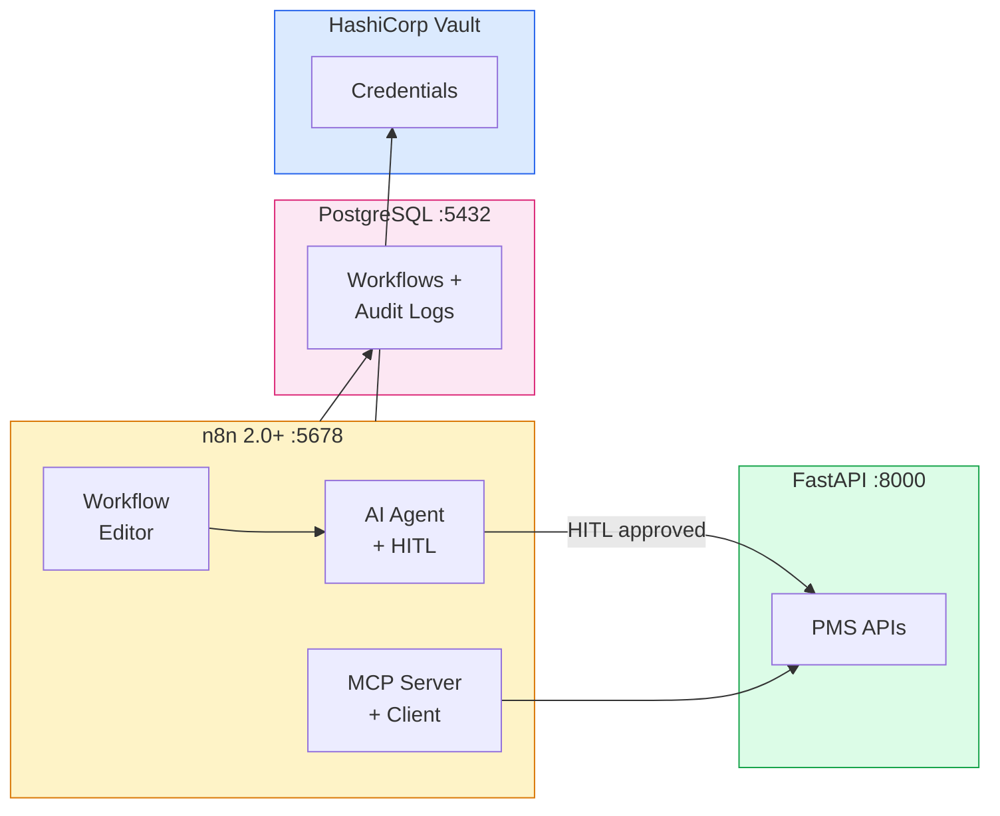

# n8n 2.0+ Setup Guide for PMS Integration

**Document ID:** PMS-EXP-N8N-UPDATES-001
**Version:** 1.0
**Date:** March 3, 2026
**Applies To:** PMS project (all platforms)
**Prerequisites Level:** Intermediate

---

## Table of Contents

1. [Overview](#1-overview)
2. [Prerequisites](#2-prerequisites)
3. [Part A: Deploy n8n Self-Hosted](#3-part-a-deploy-n8n-self-hosted)
4. [Part B: Configure AI Agents with HITL](#4-part-b-configure-ai-agents-with-hitl)
5. [Part C: Set Up MCP Integration](#5-part-c-set-up-mcp-integration)
6. [Part D: Testing and Verification](#6-part-d-testing-and-verification)
7. [Troubleshooting](#7-troubleshooting)
8. [Reference Commands](#8-reference-commands)

---

## 1. Overview

This guide walks you through deploying **n8n 2.0+** self-hosted for PMS clinical workflow automation. By the end you will have:

- n8n self-hosted with Docker Compose on HIPAA-compliant infrastructure
- Task runners enabled for isolated code execution (n8n 2.0+ default)
- AI Agent node configured with Claude for clinical reasoning
- Human-in-the-loop (HITL) approval gates on patient-safety-critical actions
- MCP Server workflows exposing PMS APIs as discoverable tools
- MCP Client connecting n8n agents to external clinical decision support
- PostgreSQL Memory replacing deprecated Motorhead for conversation persistence
- Audit logging with Syslog TLS streaming

### Architecture at a Glance



---

## 2. Prerequisites

### 2.1 Required Software

| Software | Minimum Version | Check Command |
|----------|----------------|---------------|
| Docker | 24+ | `docker --version` |
| Docker Compose | 2.20+ | `docker compose version` |
| Node.js | 20+ (for local dev) | `node --version` |
| PostgreSQL | 15+ | `psql --version` |

### 2.2 Required Accounts

| Service | Purpose | Notes |
|---------|---------|-------|
| Anthropic | Claude API for AI Agent node | API key required |
| n8n Enterprise (optional) | RBAC, audit logging, SSO | $50/month self-hosted |

### 2.3 Verify PMS Services

```bash
# Backend running
curl http://localhost:8000/health

# Frontend running
curl http://localhost:3000

# PostgreSQL accessible
psql -h localhost -p 5432 -U pms -d pms_dev -c "SELECT 1"
```

---

## 3. Part A: Deploy n8n Self-Hosted

### Step 1: Create the Docker Compose configuration

Create `n8n/docker-compose.yml`:

```yaml
version: "3.8"

services:
  n8n:
    image: docker.n8n.io/n8nio/n8n:latest
    restart: always
    ports:
      - "5678:5678"
    environment:
      # Database
      - DB_TYPE=postgresdb
      - DB_POSTGRESDB_HOST=postgres
      - DB_POSTGRESDB_PORT=5432
      - DB_POSTGRESDB_DATABASE=n8n
      - DB_POSTGRESDB_USER=n8n
      - DB_POSTGRESDB_PASSWORD=${N8N_DB_PASSWORD}

      # Security (n8n 2.0+ defaults)
      - N8N_RUNNERS_ENABLED=true
      - N8N_ENFORCE_SETTINGS_FILE_PERMISSIONS=true
      - EXECUTIONS_MODE=queue

      # Encryption
      - N8N_ENCRYPTION_KEY=${N8N_ENCRYPTION_KEY}

      # External credentials (optional — HashiCorp Vault)
      # - N8N_EXTERNAL_SECRETS_PROVIDER=vault
      # - N8N_EXTERNAL_SECRETS_VAULT_URL=http://vault:8200
      # - N8N_EXTERNAL_SECRETS_VAULT_TOKEN=${VAULT_TOKEN}

      # Audit logging
      - N8N_LOG_LEVEL=info
      - N8N_LOG_OUTPUT=console,file
      - N8N_LOG_FILE_LOCATION=/home/node/.n8n/logs/n8n.log

      # Webhook URL (for MCP Server Trigger)
      - WEBHOOK_URL=http://localhost:5678
    volumes:
      - n8n_data:/home/node/.n8n
    depends_on:
      postgres:
        condition: service_healthy
      redis:
        condition: service_healthy

  postgres:
    image: postgres:16
    restart: always
    environment:
      - POSTGRES_DB=n8n
      - POSTGRES_USER=n8n
      - POSTGRES_PASSWORD=${N8N_DB_PASSWORD}
    volumes:
      - postgres_data:/var/lib/postgresql/data
    healthcheck:
      test: ["CMD-SHELL", "pg_isready -U n8n"]
      interval: 10s
      timeout: 5s
      retries: 5

  redis:
    image: redis:7-alpine
    restart: always
    healthcheck:
      test: ["CMD", "redis-cli", "ping"]
      interval: 10s
      timeout: 5s
      retries: 5

volumes:
  n8n_data:
  postgres_data:
```

### Step 2: Create environment file

Create `n8n/.env`:

```bash
# Database
N8N_DB_PASSWORD=your_secure_password_here

# Encryption key (generate once, never change)
N8N_ENCRYPTION_KEY=$(openssl rand -hex 32)

# Anthropic API key for AI Agent node
ANTHROPIC_API_KEY=your_anthropic_api_key_here

# Optional: HashiCorp Vault
# VAULT_TOKEN=your_vault_token
```

### Step 3: Start n8n

```bash
cd n8n
docker compose up -d

# Verify all services are running
docker compose ps

# Check n8n logs
docker compose logs n8n --tail 50
```

### Step 4: Access the n8n editor

1. Open http://localhost:5678 in your browser
2. Create an owner account (first-time setup)
3. Verify the editor loads with the workflow canvas

### Step 5: Verify task runners are enabled

In the n8n editor, create a test workflow:
1. Add a **Code** node
2. Add this JavaScript: `return [{ json: { isolated: true, pid: process.pid } }]`
3. Execute the workflow
4. Verify the Code node ran successfully — task runners execute code in an isolated process

**Checkpoint:** n8n 2.0+ deployed self-hosted with Docker Compose, PostgreSQL backend, Redis queue, and task runners enabled for isolated code execution.

---

## 4. Part B: Configure AI Agents with HITL

### Step 1: Add Anthropic credentials

1. In n8n, go to **Settings** > **Credentials** > **Add Credential**
2. Search for **Anthropic**
3. Enter your API key
4. Name: `PMS Claude API`
5. Test connection and save

### Step 2: Build a medication reconciliation workflow with HITL

Create a new workflow named `PMS: Medication Reconciliation`:

**Node 1: Webhook Trigger**
- Method: POST
- Path: `/medication-reconciliation`
- Authentication: Header Auth (X-API-Key)

**Node 2: HTTP Request (Fetch Patient)**
- Method: GET
- URL: `http://host.docker.internal:8000/api/patients/{{ $json.patient_id }}`
- Authentication: Bearer Token (PMS API credential)

**Node 3: HTTP Request (Fetch Medications)**
- Method: GET
- URL: `http://host.docker.internal:8000/api/prescriptions?patient_id={{ $json.patient_id }}`

**Node 4: AI Agent**
- Agent Type: Tools Agent
- Model: Anthropic Claude (Sonnet 4.6)
- System Prompt:
  ```
  You are a medication reconciliation assistant for the PMS.
  Analyze the patient's current medications and identify potential issues:
  1. Drug-drug interactions
  2. Duplicate therapies
  3. Medications that may need dose adjustment based on patient age/weight
  4. Missing medications for documented conditions

  Patient: {{ $('Fetch Patient').item.json.name }}
  Medications: {{ $('Fetch Medications').item.json }}

  Provide a structured reconciliation report.
  ```

**Node 5: Chat Node (HITL Approval)**
- Operation: Send a message and wait for response
- Message:
  ```
  Medication Reconciliation Review Required

  Patient: {{ $('Fetch Patient').item.json.name }}
  Agent Findings: {{ $('AI Agent').item.json.output }}

  Options:
  - Approve: Accept findings and update patient record
  - Reject: Discard findings
  - Modify: Edit findings before saving
  ```
- Response Type: Approval buttons (Approve / Reject / Modify)

**Node 6: IF Node (Check Approval)**
- Condition: `{{ $json.response }}` equals "Approve"

**Node 7a (Approve branch): HTTP Request (Update Record)**
- Method: POST
- URL: `http://host.docker.internal:8000/api/encounters`
- Body: Reconciliation findings from AI Agent

**Node 7b (Reject branch): No Operation**
- Log rejection reason

### Step 3: Configure PostgreSQL Memory

Replace deprecated Motorhead Memory with PostgreSQL Memory:

1. In the AI Agent node, click **Add Memory**
2. Select **PostgreSQL Chat Memory**
3. Configure:
   - Connection: Use existing PostgreSQL credential
   - Table Name: `n8n_agent_memory`
   - Session ID: `{{ $json.patient_id }}_medrec`
4. This stores conversation history that survives n8n restarts

### Step 4: Test the HITL workflow

```bash
# Trigger the medication reconciliation workflow
curl -X POST http://localhost:5678/webhook/medication-reconciliation \
  -H "Content-Type: application/json" \
  -H "X-API-Key: your_webhook_key" \
  -d '{"patient_id": "test-patient-001"}'
```

The workflow will:
1. Fetch patient data from PMS
2. Fetch medications from PMS
3. AI Agent analyzes medications and generates findings
4. Chat node sends HITL approval request
5. Workflow pauses until clinician approves/rejects

**Checkpoint:** AI Agent workflow with HITL approval gates deployed, PostgreSQL Memory configured, and medication reconciliation workflow tested end-to-end.

---

## 5. Part C: Set Up MCP Integration

### Step 1: Create MCP Server workflow (expose PMS tools)

Create a new workflow named `PMS: MCP Server`:

**Node 1: MCP Server Trigger**
- This node exposes the workflow as an MCP server
- Endpoint: `http://localhost:5678/mcp/pms-tools` (SSE)

**Node 2: Tool — Patient Lookup**
- Connect to MCP Server Trigger
- Name: `pms-patient-lookup`
- Description: `Search PMS patients by name, MRN, or date of birth`
- Parameters:
  - `query` (string, required): Search term
  - `search_type` (string, enum: name/mrn/dob): Search field

**Node 3: HTTP Request (Patient Search)**
- Connected to Tool node
- Method: GET
- URL: `http://host.docker.internal:8000/api/patients?search={{ $json.query }}&type={{ $json.search_type }}`

**Node 4: Tool — Medication List**
- Connect to MCP Server Trigger
- Name: `pms-medication-list`
- Description: `Get active medications for a patient by patient ID`
- Parameters:
  - `patient_id` (string, required): Patient identifier

**Node 5: HTTP Request (Medication Fetch)**
- Connected to Tool node
- Method: GET
- URL: `http://host.docker.internal:8000/api/prescriptions?patient_id={{ $json.patient_id }}`

Activate the workflow. The MCP Server is now discoverable at:
```
http://localhost:5678/mcp/pms-tools
```

### Step 2: Create MCP Client workflow (consume external tools)

Create a new workflow named `PMS: Clinical Decision Support`:

**Node 1: Webhook Trigger**
- Path: `/clinical-decision`

**Node 2: AI Agent**
- Agent Type: Tools Agent
- Model: Anthropic Claude (Sonnet 4.6)

**Node 3: MCP Client Tool** (sub-node of AI Agent)
- SSE Endpoint: `http://localhost:8000/mcp/sse` (PMS MCP Server from Experiment 9)
- This gives the AI Agent access to all PMS MCP tools

The AI Agent can now discover and call tools from the PMS MCP Server during workflow execution.

### Step 3: Test MCP Server

```bash
# Test MCP Server discovery
curl http://localhost:5678/mcp/pms-tools

# Test patient lookup tool via MCP
curl -X POST http://localhost:5678/mcp/pms-tools \
  -H "Content-Type: application/json" \
  -d '{"tool": "pms-patient-lookup", "arguments": {"query": "Smith", "search_type": "name"}}'
```

**Checkpoint:** MCP Server workflow exposes PMS APIs as discoverable tools, MCP Client workflow connects to external MCP servers, and bidirectional MCP integration is verified.

---

## 6. Part D: Testing and Verification

### Step 1: Verify n8n is running

```bash
curl http://localhost:5678/healthz
```

Expected: `{"status":"ok"}`

### Step 2: Verify task runners

Create and execute a Code node workflow. Check Docker logs:
```bash
docker compose logs n8n | grep "task-runner"
```

Expected: Task runner process messages indicating isolated execution.

### Step 3: Test HITL workflow

```bash
curl -X POST http://localhost:5678/webhook/medication-reconciliation \
  -H "Content-Type: application/json" \
  -H "X-API-Key: test_key" \
  -d '{"patient_id": "test-patient-001"}'
```

Expected: Workflow executes, pauses at Chat node, sends HITL notification.

### Step 4: Test MCP Server

```bash
curl http://localhost:5678/mcp/pms-tools
```

Expected: MCP tool definitions for patient lookup and medication list.

### Step 5: Verify audit logging

```bash
docker compose exec n8n cat /home/node/.n8n/logs/n8n.log | tail -20
```

Expected: Execution logs with timestamps, workflow IDs, and node execution details.

### Step 6: Test save/publish model

1. Open a workflow in the editor
2. Make a change and click **Save** — changes are saved but NOT live
3. Click **Publish** — changes are now live in production
4. Verify the distinction by checking execution behavior before and after publish

**Checkpoint:** All six verification steps pass — n8n running, task runners active, HITL workflow functional, MCP Server responding, audit logs recording, and save/publish model verified.

---

## 7. Troubleshooting

### n8n Container Fails to Start

**Symptom:** `docker compose up` shows n8n container restarting in a loop.
**Cause:** PostgreSQL not ready, or encryption key missing.
**Fix:** Check PostgreSQL health: `docker compose logs postgres`. Verify `N8N_ENCRYPTION_KEY` is set in `.env`. Never change the encryption key after initial setup.

### AI Agent Node Returns Empty Response

**Symptom:** AI Agent execution shows no output.
**Cause:** Anthropic credential not configured or API key invalid.
**Fix:** Go to Settings > Credentials > PMS Claude API > Test Connection. Regenerate API key at console.anthropic.com if expired.

### HITL Chat Node Never Receives Response

**Symptom:** Workflow stays paused indefinitely at Chat node.
**Cause:** Chat node not connected to a communication channel, or user not in the approval workflow.
**Fix:** For testing, use the n8n Chat UI (built-in). For production, connect to Slack or Teams via the respective trigger nodes.

### MCP Server Returns 404

**Symptom:** `curl http://localhost:5678/mcp/pms-tools` returns 404.
**Cause:** MCP Server workflow not activated, or webhook URL misconfigured.
**Fix:** Activate the MCP Server workflow. Verify `WEBHOOK_URL` environment variable matches the n8n URL.

### Code Node Fails with "Permission Denied"

**Symptom:** Code node throws `Error: Permission denied` when accessing environment variables.
**Cause:** n8n 2.0+ blocks environment variable access from Code nodes by default.
**Fix:** This is intentional for security. If you need environment variable access, configure it explicitly in n8n settings (not recommended for production).

### PostgreSQL Memory Table Not Created

**Symptom:** AI Agent with PostgreSQL Memory fails on first run.
**Cause:** Memory table does not exist yet.
**Fix:** The PostgreSQL Chat Memory node auto-creates the table on first execution. Ensure the PostgreSQL credential has CREATE TABLE permissions.

---

## 8. Reference Commands

### Daily Development

```bash
# Start n8n stack
cd n8n && docker compose up -d

# View logs
docker compose logs -f n8n

# Stop n8n
docker compose down

# Restart n8n only (preserve database)
docker compose restart n8n
```

### Management Commands

```bash
# Export all workflows
docker compose exec n8n n8n export:workflow --all --output=/home/node/.n8n/backups/

# Import a workflow
docker compose exec n8n n8n import:workflow --input=/home/node/.n8n/backups/workflow.json

# List credentials (IDs only, no secrets)
docker compose exec n8n n8n list:credentials

# Update n8n to latest
docker compose pull n8n && docker compose up -d n8n
```

### Useful URLs

| Resource | URL |
|----------|-----|
| n8n Editor | http://localhost:5678 |
| n8n API | http://localhost:5678/api/v1 |
| MCP Server | http://localhost:5678/mcp/pms-tools |
| n8n Docs | https://docs.n8n.io |
| n8n Release Notes | https://docs.n8n.io/release-notes/ |

---

## Next Steps

1. Work through the [n8n 2.0+ Developer Tutorial](34-n8nUpdates-Developer-Tutorial.md) to build a complete prior authorization workflow
2. Review [LangGraph (Experiment 26)](26-LangGraph-PMS-Developer-Setup-Guide.md) for complex stateful agent orchestration
3. Review [MCP (Experiment 9)](09-MCP-PMS-Developer-Setup-Guide.md) for the MCP server that n8n connects to

---

## Resources

- **n8n Documentation:** [docs.n8n.io](https://docs.n8n.io)
- **n8n AI Agents:** [n8n.io/ai-agents](https://n8n.io/ai-agents/)
- **n8n MCP Client Tool:** [docs.n8n.io/integrations/builtin/cluster-nodes/sub-nodes/n8n-nodes-langchain.toolmcp](https://docs.n8n.io/integrations/builtin/cluster-nodes/sub-nodes/n8n-nodes-langchain.toolmcp/)
- **n8n GitHub:** [github.com/n8n-io/n8n](https://github.com/n8n-io/n8n)
- **n8n Enterprise:** [n8n.io/enterprise](https://n8n.io/enterprise/)
