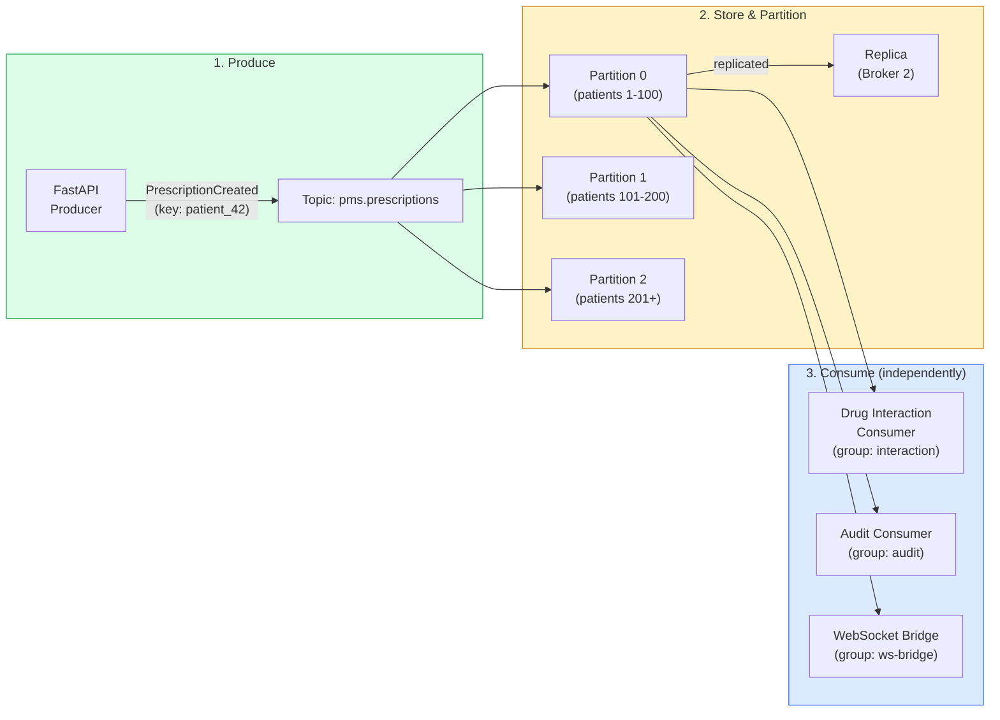
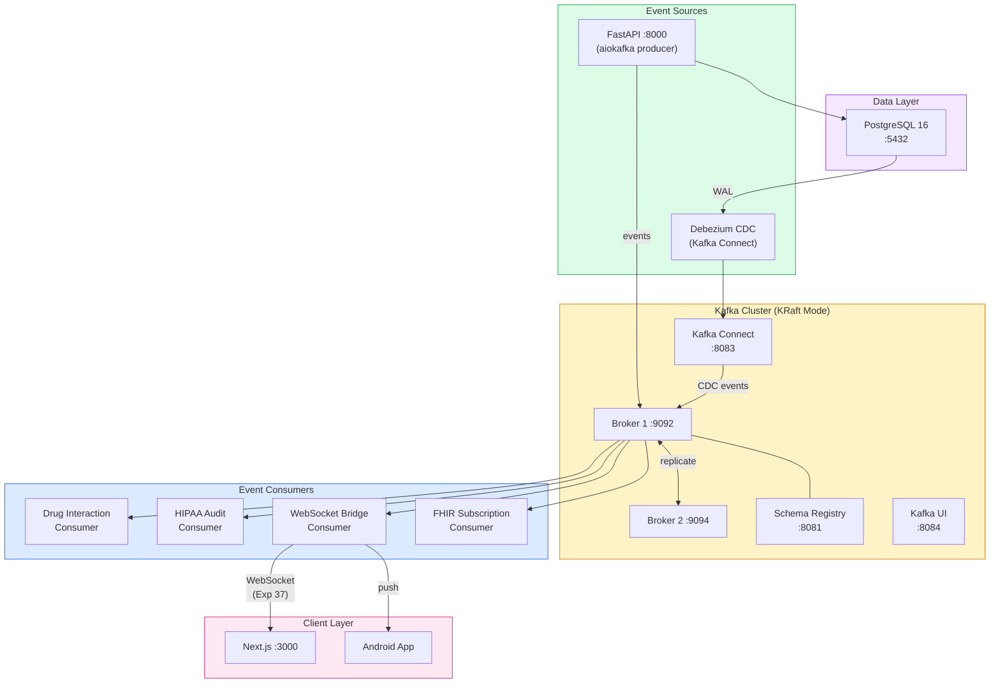

# Apache Kafka Developer Onboarding Tutorial

**Welcome to the MPS PMS Apache Kafka Integration Team**

This tutorial will take you from zero to building your first Kafka-powered clinical event pipeline with the PMS. By the end, you will understand how Kafka works, have a running local environment, and have built and tested a prescription event pipeline with drug interaction detection end-to-end.

**Document ID:** PMS-EXP-KAFKA-002
**Version:** 1.0
**Date:** March 3, 2026
**Applies To:** PMS project (all platforms)
**Prerequisite:** [Kafka Setup Guide](38-Kafka-PMS-Developer-Setup-Guide.md)
**Estimated time:** 2-3 hours
**Difficulty:** Beginner-friendly

---

## What You Will Learn

1. How Apache Kafka works as a distributed event streaming platform
2. How topics, partitions, consumer groups, and offsets provide durable, ordered event delivery
3. How Debezium CDC captures PostgreSQL changes without modifying application code
4. How to build an async Kafka producer in FastAPI with Avro serialization
5. How to build typed event consumers with exactly-once processing guarantees
6. How to implement a prescription drug interaction detection pipeline using Kafka
7. How to replay events from Kafka for debugging and operational recovery
8. How to monitor consumer lag and troubleshoot processing delays
9. How Kafka integrates with WebSocket (Exp 37) for real-time client delivery
10. How to evaluate when Kafka is the right choice vs simpler alternatives

---

## Part 1: Understanding Apache Kafka (15 min read)

### 1.1 What Problem Does Kafka Solve?

Consider a day in the PMS clinic: a physician prescribes a new medication for Patient 42. This single action triggers a cascade of downstream effects:

- The **drug interaction checker** must verify no dangerous interactions with existing medications
- The **HIPAA audit trail** must record who prescribed what, when
- The **WebSocket layer** must push a notification to other providers viewing Patient 42's record
- The **FHIR facade** must emit a MedicationRequest resource for external EHR subscribers
- The **reporting engine** must update prescription volume metrics on the admin dashboard
- The **HL7v2 outbound feed** must send an ORM message to the pharmacy system

Without Kafka, the FastAPI backend must synchronously call each of these services. If the reporting engine is slow, the prescription API response is slow. If the HL7v2 feed is down, data is lost. If a new analytics service is added next quarter, the backend must be modified.

With Kafka, the prescription endpoint publishes a single `PrescriptionCreated` event to the `pms.prescriptions` topic and returns immediately. Each downstream service consumes the event independently, at its own pace, from its own position in the topic. Services can be added, removed, or restarted without affecting the producer or each other. Events are stored durably for years and can be replayed for debugging, recovery, or new service backfill.

### 1.2 How Kafka Works — The Key Pieces



**Three key concepts:**

1. **Produce:** The FastAPI backend publishes typed events (Avro-serialized) to named topics. Each event has a key (the entity ID, e.g., patient_id) that determines which partition it lands in. Events with the same key always go to the same partition, guaranteeing ordering per entity.

2. **Store & Partition:** Topics are divided into partitions spread across brokers. Each message is replicated to multiple brokers for fault tolerance. Messages are stored durably on disk — not deleted after consumption. Retention can be configured from hours to years (7 years for HIPAA PHI topics).

3. **Consume:** Each consumer group maintains its own offset (read position) per partition. Multiple groups can read the same topic independently. Within a group, each partition is assigned to exactly one consumer — adding more consumers increases parallelism. Consumer groups track their position with committed offsets, enabling exactly-once processing with manual commits.

### 1.3 How Kafka Fits with Other PMS Technologies

| Technology | Role | Relationship to Kafka |
|-----------|------|----------------------|
| **Kafka (Exp 38)** | Durable event backbone | Central nervous system for all PMS event flow |
| **WebSocket (Exp 37)** | Real-time client push | Consumes Kafka events via WebSocket Bridge Consumer |
| **PostgreSQL** | Primary database | Source for Debezium CDC; Kafka stores event history |
| **Debezium CDC** | Database change capture | Streams PostgreSQL WAL changes into Kafka topics |
| **FHIR (Exp 16)** | Healthcare data exchange | Consumes Kafka events, emits FHIR resources |
| **HL7v2 (Exp 17)** | Legacy lab messaging | Publishes/consumes lab messages via Kafka |
| **n8n (Exp 34)** | Workflow automation | Kafka trigger node starts clinical workflows |
| **AI Inference (Exp 13, 20)** | Clinical decision support | Consumes prescription events for drug interaction checking |
| **LangGraph (Exp 26)** | AI agent orchestration | Agent results published to Kafka topics |

### 1.4 Key Vocabulary

| Term | Meaning |
|------|---------|
| **Topic** | A named, ordered log of events (like a database table for events) — e.g., `pms.prescriptions` |
| **Partition** | A subdivision of a topic distributed across brokers; events with the same key go to the same partition |
| **Producer** | A client that publishes events to topics — the FastAPI backend in our case |
| **Consumer** | A client that reads events from topics — audit logger, WebSocket bridge, AI pipeline |
| **Consumer Group** | A set of consumers that collectively read a topic; each partition assigned to one consumer in the group |
| **Offset** | A sequential ID for each message in a partition; consumers track their position using offsets |
| **Broker** | A Kafka server node; our cluster has 2 brokers for redundancy |
| **KRaft** | Kafka's built-in consensus protocol, replacing ZooKeeper for metadata management |
| **Debezium** | A CDC platform that captures database row changes from PostgreSQL's WAL and publishes them to Kafka |
| **Schema Registry** | A service managing Avro schemas for events, ensuring backward compatibility as schemas evolve |
| **Avro** | A compact binary serialization format for events — type-safe, schema-versioned, 60-80% smaller than JSON |
| **Exactly-once** | Delivery guarantee ensuring each event is processed exactly once, even during retries or failures |

### 1.5 Our Architecture



---

## Part 2: Environment Verification (15 min)

### 2.1 Checklist

```bash
# 1. Kafka brokers are running
kcat -b localhost:9092 -L | grep "brokers"
# Expected: "2 brokers"

# 2. PMS topics exist
docker compose exec kafka-broker-1 /opt/kafka/bin/kafka-topics.sh \
  --bootstrap-server localhost:9092 --list | grep pms
# Expected: pms.patients, pms.encounters, pms.prescriptions, pms.audit

# 3. Schema Registry is accessible
curl -s http://localhost:8081/subjects
# Expected: [] (empty list initially) or list of registered subjects

# 4. Debezium connector is running
curl -s http://localhost:8083/connectors/pms-postgres-cdc/status \
  | python3 -c "import sys,json; d=json.load(sys.stdin); print(d['connector']['state'])"
# Expected: RUNNING

# 5. PostgreSQL is accepting connections
pg_isready -h localhost -p 5432
# Expected: accepting connections

# 6. FastAPI backend is running
curl -s http://localhost:8000/health
# Expected: {"status": "healthy"}

# 7. Kafka UI is accessible
curl -s -o /dev/null -w "%{http_code}" http://localhost:8084
# Expected: 200
```

### 2.2 Quick Test

Produce and consume a test message:

```bash
# Terminal 1: Start a consumer on the patients topic
kcat -b localhost:9092 -t pms.patients -C -o end

# Terminal 2: Produce a test message
echo '{"event_id":"test-001","event_type":"PatientCreated","timestamp":"2026-03-03T12:00:00Z","user_id":1,"patient_id":999,"changed_fields":[],"metadata":{}}' \
  | kcat -b localhost:9092 -t pms.patients -P

# Terminal 1 should display the message within 1 second
```

---

## Part 3: Build Your First Integration (45 min)

### 3.1 What We Are Building

We will build a **Prescription Drug Interaction Detection Pipeline** — an event-driven system where:

1. A clinician creates a prescription via the PMS API
2. The FastAPI backend publishes a `PrescriptionCreated` event to Kafka
3. A **Drug Interaction Consumer** reads the event, checks for interactions against the patient's existing medications, and publishes an `InteractionDetected` event if found
4. The **WebSocket Bridge Consumer** forwards the alert to all providers viewing that patient's record
5. The **HIPAA Audit Consumer** logs the entire chain for compliance

This is a realistic clinical safety feature: the CDC reports that adverse drug events cause over 1.3 million emergency department visits annually in the US. Real-time interaction detection is a life-saving feature.

### 3.2 Create the Drug Interaction Consumer

```python
# app/kafka/consumers/drug_interaction.py
"""
Consumes PrescriptionCreated events and checks for drug interactions.
Publishes InteractionDetected events when dangerous combinations are found.
"""
import logging

from app.kafka.consumer import PMSEventConsumer
from app.kafka.producer import producer
from app.kafka.config import PMSEventType

logger = logging.getLogger(__name__)

# Simplified drug interaction database (in production, use a clinical API)
# Maps medication_id pairs to interaction severity and description
KNOWN_INTERACTIONS = {
    frozenset([101, 205]): {
        "severity": "critical",
        "description": "Warfarin + Aspirin: Increased bleeding risk",
    },
    frozenset([101, 310]): {
        "severity": "warning",
        "description": "Warfarin + Acetaminophen: Increased INR risk at high doses",
    },
    frozenset([205, 420]): {
        "severity": "critical",
        "description": "Aspirin + Ibuprofen: Reduced antiplatelet effect, GI bleeding risk",
    },
    frozenset([530, 640]): {
        "severity": "warning",
        "description": "Metformin + Contrast dye: Lactic acidosis risk",
    },
}


async def get_patient_medications(patient_id: int) -> list[int]:
    """Fetch current medication IDs for a patient.

    In production, this calls /api/patients/{id}/prescriptions.
    For the tutorial, we return a mock list.
    """
    # Mock: Patient 42 is on Warfarin (101) and Metformin (530)
    mock_medications = {
        42: [101, 530],
        43: [205, 640],
    }
    return mock_medications.get(patient_id, [])


async def check_interactions(
    patient_id: int, new_medication_id: int
) -> list[dict]:
    """Check for interactions between a new medication and existing ones."""
    existing = await get_patient_medications(patient_id)
    interactions = []

    for existing_med_id in existing:
        pair = frozenset([existing_med_id, new_medication_id])
        if pair in KNOWN_INTERACTIONS:
            interactions.append({
                **KNOWN_INTERACTIONS[pair],
                "medication_a": existing_med_id,
                "medication_b": new_medication_id,
            })

    return interactions


async def handle_prescription_event(topic: str, event: dict):
    """Process prescription events and check for drug interactions."""
    event_type = event.get("event_type")

    if event_type != PMSEventType.PRESCRIPTION_CREATED.value:
        return  # Only check new prescriptions

    patient_id = event.get("patient_id")
    medication_id = event.get("medication_id")
    user_id = event.get("user_id")

    if not medication_id:
        logger.warning(f"PrescriptionCreated without medication_id: {event.get('event_id')}")
        return

    logger.info(
        f"Checking interactions for patient={patient_id}, "
        f"new_medication={medication_id}"
    )

    interactions = await check_interactions(patient_id, medication_id)

    if interactions:
        for interaction in interactions:
            logger.warning(
                f"INTERACTION DETECTED: {interaction['severity']} - "
                f"{interaction['description']}"
            )

            # Publish interaction alert to Kafka
            await producer.publish_prescription_event(
                event_type=PMSEventType.INTERACTION_DETECTED,
                prescription_id=event.get("prescription_id", 0),
                patient_id=patient_id,
                user_id=user_id,
                medication_id=medication_id,
                metadata={
                    "severity": interaction["severity"],
                    "description": interaction["description"],
                    "medication_a": str(interaction["medication_a"]),
                    "medication_b": str(interaction["medication_b"]),
                    "triggering_event_id": event.get("event_id", ""),
                },
            )
    else:
        logger.info(f"No interactions found for patient={patient_id}")


# Consumer instance
drug_interaction_consumer = PMSEventConsumer(
    topics=["pms.prescriptions"],
    group_id="pms-drug-interaction",
    handler=handle_prescription_event,
)
```

### 3.3 Register the Consumer in FastAPI Lifespan

```python
# app/main.py — add to lifespan
from app.kafka.consumers.drug_interaction import drug_interaction_consumer


@asynccontextmanager
async def lifespan(app):
    # Startup
    await kafka_producer.start()
    ws_task = asyncio.create_task(ws_bridge_consumer.start())
    audit_task = asyncio.create_task(audit_consumer.start())
    interaction_task = asyncio.create_task(drug_interaction_consumer.start())
    yield
    # Shutdown
    await drug_interaction_consumer.stop()
    await ws_bridge_consumer.stop()
    await audit_consumer.stop()
    interaction_task.cancel()
    ws_task.cancel()
    audit_task.cancel()
    await kafka_producer.stop()
```

### 3.4 Test the End-to-End Pipeline

```bash
# Terminal 1: Watch the prescriptions topic for interaction alerts
kcat -b localhost:9092 -t pms.prescriptions -C -o end

# Terminal 2: Create a prescription that triggers an interaction
# Patient 42 is on Warfarin (101). Prescribe Aspirin (205) — critical interaction!
curl -X POST http://localhost:8000/api/prescriptions \
  -H "Content-Type: application/json" \
  -H "Authorization: Bearer YOUR_JWT_TOKEN" \
  -d '{
    "patient_id": 42,
    "medication_id": 205,
    "dosage": "81mg",
    "frequency": "daily"
  }'

# Terminal 1 should show TWO events:
# 1. PrescriptionCreated event (from the API endpoint)
# 2. InteractionDetected event (from the drug interaction consumer)
#    with metadata containing severity="critical" and description about bleeding risk
```

### 3.5 Verify the Audit Trail

```bash
# Check that both events were audit-logged
psql -h localhost -p 5432 -U pms_user -d pms -c "
SELECT event_id, event_type, topic, record_id, created_at
FROM hipaa_audit_log
ORDER BY created_at DESC
LIMIT 5;
"

# Expected: Both PrescriptionCreated and InteractionDetected events
# with timestamps, user IDs, and integrity hashes
```

### 3.6 Verify WebSocket Delivery

If you have a WebSocket client connected and subscribed to `patients:42`, you should have received the interaction alert within 200ms of the prescription creation. The full event chain:

```
API → Kafka (PrescriptionCreated) → Drug Interaction Consumer → Kafka (InteractionDetected) → WebSocket Bridge → Browser
```

Total end-to-end time: typically < 500ms.

**Checkpoint:** You have built a complete prescription drug interaction detection pipeline. Events flow from the API through Kafka to the interaction checker, audit trail, and WebSocket clients — all asynchronously and independently.

---

## Part 4: Evaluating Strengths and Weaknesses (15 min)

### 4.1 Strengths

- **Durable event storage:** Events are stored on disk for configurable periods (up to years); nothing is lost even if all consumers are offline
- **Exactly-once semantics:** Idempotent producers + transactional consumers guarantee no duplicates and no data loss — critical for clinical data accuracy
- **Horizontal scalability:** Partitioned topics distribute load across brokers; adding consumers to a group increases parallelism linearly
- **Consumer independence:** Each consumer group maintains its own offset; adding, removing, or restarting a consumer doesn't affect others
- **Event replay:** Any consumer can reset its offset to replay events from any point in history — invaluable for debugging, backfilling new services, and disaster recovery
- **Debezium CDC:** Captures every database change (including direct SQL, migrations, admin tools) without modifying application code
- **Schema evolution:** Schema Registry enforces backward compatibility, allowing producers and consumers to evolve independently
- **Massive ecosystem:** 80% of Fortune 100 companies use Kafka; extensive tooling, documentation, and community support

### 4.2 Weaknesses

- **Operational complexity:** Kafka requires broker management, partition rebalancing, and storage monitoring — significantly more complex than Redis pub/sub or a simple message queue
- **Resource overhead:** Minimum 2 brokers + Schema Registry + Connect = 4+ containers with ~5 GB RAM for development; overkill for small teams or low-volume systems
- **Learning curve:** Topics, partitions, consumer groups, offsets, rebalancing, exactly-once semantics — Kafka has many concepts to master
- **Latency floor:** Kafka batches messages for throughput efficiency; typical latency is 5-50ms, vs < 1ms for Redis pub/sub — not ideal for sub-millisecond requirements
- **Not a database:** Kafka stores events but doesn't support queries, joins, or indexes — consumers must build their own materialized views
- **Consumer rebalancing disruption:** When consumers join or leave a group, partition reassignment can cause brief processing pauses (seconds to minutes with large topic counts)

### 4.3 When to Use Kafka vs Alternatives

| Scenario | Best Choice | Why |
|----------|-------------|-----|
| Durable, replayable clinical event history | **Kafka** | Years of retention with replay capability |
| Real-time client push notifications | **WebSocket (Exp 37)** | Lower latency, simpler for direct client communication |
| Simple pub/sub between 2-3 services | **Redis pub/sub** | Much simpler ops; sufficient if durability not required |
| Task queue (process one at a time) | **Redis + Celery** or **RabbitMQ** | Better task semantics; priority queues; retries |
| Database change propagation | **Kafka + Debezium** | CDC captures all changes including direct SQL |
| FHIR Subscription notifications | **Kafka → FHIR Consumer** | Durable delivery with retry for external systems |
| AI inference pipeline | **Kafka** | Decouple request from inference; handle backpressure |
| Single-service internal events | **Python asyncio events** | No infrastructure needed for in-process events |

**Rule of thumb:** Use Kafka when you need durability, replay, multiple independent consumers, or high throughput. Use simpler alternatives when you need point-to-point messaging, low latency, or minimal operational overhead.

### 4.4 HIPAA / Healthcare Considerations

| Requirement | Kafka Implementation |
|-------------|---------------------|
| **Encryption in transit** | TLS 1.3 for all broker communication; SASL/SCRAM authentication |
| **Encryption at rest** | AES-256 disk encryption for Kafka log segments |
| **Access control** | ACL-based topic authorization; PHI topics restricted to authorized consumers |
| **Audit trail** | Dedicated audit consumer writes immutable records with integrity hashes |
| **Data retention** | 7-year retention for PHI topics (HIPAA 6-year requirement + buffer) |
| **Right to delete** | Log compaction with tombstone records permanently removes patient data |
| **PHI minimization** | Events contain IDs and metadata; full records fetched via authenticated API |
| **Breach detection** | Consumer group monitoring detects unauthorized topic access |

---

## Part 5: Debugging Common Issues (15 min read)

### Issue 1: Consumer Not Receiving Messages

**Symptom:** Consumer starts but never processes any events.
**Cause:** Consumer group has committed offsets past all existing messages; new messages are not being produced.
**Fix:** Check offsets: `kafka-consumer-groups.sh --group GROUP --describe`. Reset to latest: `kafka-consumer-groups.sh --group GROUP --reset-offsets --to-latest --execute`. Verify producer is publishing: `kcat -t TOPIC -C -o end`.

### Issue 2: Duplicate Event Processing

**Symptom:** Same event processed multiple times by the same consumer.
**Cause:** Consumer crashes after processing but before committing the offset.
**Fix:** Implement idempotency: check event_id against a processed-events set (Redis or database) before processing. Ensure `enable_auto_commit=False` and commit only after successful processing.

### Issue 3: Debezium Replication Slot Growing

**Symptom:** PostgreSQL disk usage increases; `pg_replication_slots` shows high `confirmed_flush_lsn` lag.
**Cause:** Debezium connector is stopped or failing; PostgreSQL retains WAL segments.
**Fix:** Check connector status: `curl http://localhost:8083/connectors/pms-postgres-cdc/status`. Restart: `curl -X POST http://localhost:8083/connectors/pms-postgres-cdc/restart`. If stuck, drop and recreate slot.

### Issue 4: Schema Compatibility Error

**Symptom:** Producer fails with "Schema incompatible" error from Schema Registry.
**Cause:** New schema version breaks backward compatibility (e.g., removing a required field).
**Fix:** Add new fields with defaults; never remove or rename existing fields. Use `BACKWARD` compatibility level. Test schema changes locally before deploying.

### Issue 5: Consumer Lag Increasing

**Symptom:** `kafka-consumer-groups.sh --describe` shows growing LAG.
**Cause:** Consumer processing is slower than production rate.
**Fix:** Profile handler execution time. Increase partition count and add consumers to the group for parallelism. Optimize handler (batch database writes, async I/O). Consider dead-letter queue for slow/failing messages.

### Issue 6: Messages Out of Order

**Symptom:** Events for the same patient arrive in wrong order.
**Cause:** Events are published with different keys or to different partitions.
**Fix:** Use entity ID (patient_id, encounter_id) as the message key — Kafka guarantees ordering within a partition, and same key = same partition. Check producer key assignment: `await producer.send(topic, key=str(patient_id).encode(), ...)`.

---

## Part 6: Practice Exercise (45 min)

### Option A: Build an Encounter Status Tracker

Build a consumer that tracks encounter lifecycle events and publishes aggregate statistics:

1. Create a consumer on `pms.encounters` tracking status transitions (created → updated → signed → amended)
2. Maintain an in-memory state machine for each encounter (valid transitions only)
3. When an encounter is signed, publish a `pms.metrics` event with encounter duration (created_at → signed_at)
4. Expose an API endpoint `/api/metrics/encounters` that returns average encounter time from the in-memory state

**Hints:** Use a dict mapping encounter_id → state. Track timestamps from event payloads. Invalid transitions (e.g., signed → created) should be logged as warnings.

### Option B: Build a CDC Replay Tool

Build a command-line tool that replays Debezium CDC events for a specific patient:

1. Create a consumer on `pms.cdc.public.patients` with a unique group ID
2. Reset offsets to the beginning of the topic
3. Filter events where `payload.after.id` matches the target patient ID
4. Print a timeline of all changes: timestamp, operation (INSERT/UPDATE/DELETE), changed fields
5. Calculate total number of modifications and time span

**Hints:** Use `kcat` with `-o beginning` for quick exploration. CDC events have a `payload.before` and `payload.after` structure. Compare before/after to identify changed fields.

### Option C: Build a FHIR Subscription Bridge

Build a consumer that converts Kafka events into FHIR Subscription notifications:

1. Create a consumer on `pms.patients` and `pms.prescriptions`
2. For `PatientCreated` events, construct a FHIR Patient resource stub (id, name, status)
3. For `PrescriptionCreated` events, construct a FHIR MedicationRequest stub
4. POST the FHIR resource to a mock FHIR endpoint (`http://localhost:8000/api/fhir/notify`)
5. Handle failures with exponential backoff and retry up to 3 times

**Hints:** Reference the FHIR experiment (Exp 16) for resource structure. Use `aiohttp` for async HTTP posts. Track retry count per event in a dict.

---

## Part 7: Development Workflow and Conventions

### 7.1 File Organization

```
pms-backend/
├── app/
│   ├── kafka/
│   │   ├── __init__.py
│   │   ├── config.py             # KafkaSettings, PMSEventType enum
│   │   ├── schemas.py            # Avro schema definitions
│   │   ├── producer.py           # PMSEventProducer singleton
│   │   ├── consumer.py           # PMSEventConsumer base class
│   │   └── consumers/
│   │       ├── __init__.py
│   │       ├── audit.py          # HIPAA audit consumer
│   │       ├── ws_bridge.py      # WebSocket bridge consumer
│   │       ├── drug_interaction.py  # Drug interaction detection
│   │       └── fhir_bridge.py    # FHIR subscription bridge
│   └── main.py                   # Registers producer + consumers in lifespan

docker-compose.yml                # Kafka cluster, Schema Registry, Connect, UI
avro/                             # Avro schema files (.avsc) for version control
  ├── PatientEvent.avsc
  ├── EncounterEvent.avsc
  └── PrescriptionEvent.avsc
```

### 7.2 Naming Conventions

| Item | Convention | Example |
|------|-----------|---------|
| Topics | `pms.{entity}` (application) or `pms.cdc.{schema}.{table}` (CDC) | `pms.prescriptions`, `pms.cdc.public.patients` |
| Event types | PascalCase verb+noun | `PrescriptionCreated`, `InteractionDetected` |
| Consumer groups | `pms-{service-name}` | `pms-drug-interaction`, `pms-hipaa-audit` |
| Avro namespaces | `com.mps.pms.events` | `com.mps.pms.events.PrescriptionEvent` |
| Python modules | Snake case in `app/kafka/` | `drug_interaction.py`, `ws_bridge.py` |
| Config env vars | `KAFKA_` prefix | `KAFKA_BOOTSTRAP_SERVERS`, `KAFKA_ACKS` |

### 7.3 PR Checklist

- [ ] New events use a typed `PMSEventType` enum value (not raw strings)
- [ ] New event schemas are defined in `app/kafka/schemas.py` with all required fields
- [ ] Avro schemas maintain backward compatibility (new fields have defaults; no removals)
- [ ] Consumer uses manual offset commit (`enable_auto_commit=False`)
- [ ] Consumer handler is idempotent (safe to process the same event twice)
- [ ] PHI is NOT included in event payloads — IDs and metadata only
- [ ] Consumer group ID follows naming convention (`pms-{service-name}`)
- [ ] Event key uses the entity ID (patient_id, encounter_id) for partition ordering
- [ ] Dead-letter queue handling exists for unprocessable messages
- [ ] Integration tests cover the produce → consume pipeline

### 7.4 Security Reminders

1. **Never include PHI in Kafka messages.** Events carry record IDs and metadata only. Consumers fetch full records via authenticated REST API.
2. **Use SASL/SCRAM authentication** for all producers and consumers in staging/production. Development can use PLAINTEXT for simplicity.
3. **Apply topic ACLs** for PHI topics (`pms.patients`, `pms.encounters`, `pms.prescriptions`). Only authorized service accounts can produce or consume.
4. **Enable TLS 1.3** for all broker communication in staging/production. Development can start without TLS but must test with TLS before deployment.
5. **Audit all topic access.** The HIPAA audit consumer logs every event; Kafka broker audit logging captures administrative operations.
6. **Retain PHI topics for 7+ years.** Configure `retention.ms=-1` with time-based cleanup policies. Monitor storage growth monthly.

---

## Part 8: Quick Reference Card

### Key Commands

```bash
# List topics
kafka-topics.sh --bootstrap-server localhost:9092 --list

# Describe a topic (partitions, replicas, config)
kafka-topics.sh --bootstrap-server localhost:9092 --describe --topic pms.prescriptions

# Tail a topic (watch new messages)
kcat -b localhost:9092 -t pms.prescriptions -C -o end

# Read from beginning (first N messages)
kcat -b localhost:9092 -t pms.prescriptions -C -o beginning -c 10

# Check consumer group lag
kafka-consumer-groups.sh --bootstrap-server localhost:9092 --group pms-drug-interaction --describe

# Reset consumer offsets to latest
kafka-consumer-groups.sh --bootstrap-server localhost:9092 --group GROUP --topic TOPIC --reset-offsets --to-latest --execute

# List Debezium connectors
curl -s http://localhost:8083/connectors

# Check Schema Registry subjects
curl -s http://localhost:8081/subjects
```

### Key Files

| File | Purpose |
|------|---------|
| `docker-compose.yml` | Kafka cluster, Schema Registry, Connect, UI |
| `app/kafka/config.py` | Kafka settings, event type enum |
| `app/kafka/schemas.py` | Avro schema definitions |
| `app/kafka/producer.py` | Async Kafka producer |
| `app/kafka/consumer.py` | Consumer base class |
| `app/kafka/consumers/*.py` | Service-specific consumers |

### Key URLs

| Resource | URL |
|----------|-----|
| Kafka UI (local) | http://localhost:8084 |
| Schema Registry | http://localhost:8081 |
| Kafka Connect | http://localhost:8083 |
| Apache Kafka Docs | https://kafka.apache.org/documentation/ |
| Debezium Docs | https://debezium.io/documentation/ |
| aiokafka Docs | https://aiokafka.readthedocs.io/ |

### Starter Template — New Event Consumer

```python
# app/kafka/consumers/my_consumer.py
from app.kafka.consumer import PMSEventConsumer

async def handle_event(topic: str, event: dict):
    event_type = event.get("event_type")
    # Process the event
    print(f"Received {event_type} from {topic}")

my_consumer = PMSEventConsumer(
    topics=["pms.prescriptions"],
    group_id="pms-my-service",
    handler=handle_event,
)

# Register in app/main.py lifespan:
# my_task = asyncio.create_task(my_consumer.start())
```

---

## Next Steps

1. **[Kafka PRD](38-PRD-Kafka-PMS-Integration.md)** — Review the full product requirements for Kafka integration
2. **[WebSocket Integration (Exp 37)](37-PRD-WebSocket-PMS-Integration.md)** — See how the WebSocket Bridge Consumer connects Kafka durability with real-time delivery
3. **[FHIR Integration (Exp 16)](16-PRD-FHIR-PMS-Integration.md)** — Build a FHIR Subscription Consumer converting Kafka events to FHIR notifications
4. **[HL7v2 LIS Messaging (Exp 17)](17-PRD-HL7v2LIS-PMS-Integration.md)** — Connect lab system messages through Kafka for durable delivery
5. **[Gemma 3 / Qwen 3.5 AI (Exp 13, 20)](13-PRD-Gemma3-PMS-Integration.md)** — Feed Kafka prescription events to the on-premise AI inference pipeline
