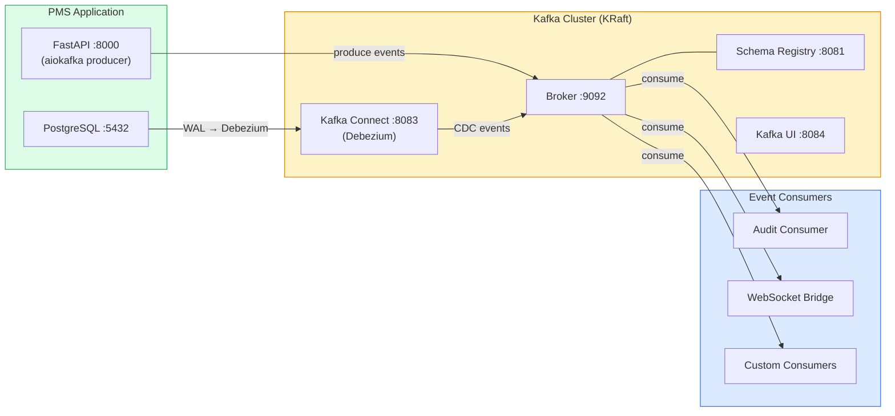

# Apache Kafka Setup Guide for PMS Integration

**Document ID:** PMS-EXP-KAFKA-001
**Version:** 1.0
**Date:** March 3, 2026
**Applies To:** PMS project (all platforms)
**Prerequisites Level:** Intermediate

---

## Table of Contents

1. [Overview](#1-overview)
2. [Prerequisites](#2-prerequisites)
3. [Part A: Deploy Kafka Cluster](#3-part-a-deploy-kafka-cluster)
4. [Part B: Integrate with PMS Backend](#4-part-b-integrate-with-pms-backend)
5. [Part C: Integrate with PMS Frontend](#5-part-c-integrate-with-pms-frontend)
6. [Part D: Testing and Verification](#6-part-d-testing-and-verification)
7. [Troubleshooting](#7-troubleshooting)
8. [Reference Commands](#8-reference-commands)

---

## 1. Overview

This guide walks you through deploying Apache Kafka (KRaft mode) as the event streaming backbone for the PMS and integrating it with the FastAPI backend, PostgreSQL via Debezium CDC, and the real-time WebSocket layer. By the end, you will have:

- A Kafka cluster (2 brokers, KRaft mode) running in Docker Compose
- Schema Registry with Avro schemas for PMS clinical events
- Debezium CDC connector streaming PostgreSQL changes to Kafka topics
- An async Kafka producer in the FastAPI backend publishing clinical events
- A consumer framework for building event-driven PMS services
- A WebSocket Bridge Consumer feeding real-time events to the Exp 37 WebSocket layer

### Architecture at a Glance



---

## 2. Prerequisites

### 2.1 Required Software

| Software | Minimum Version | Check Command |
|----------|----------------|---------------|
| Docker | 24+ | `docker --version` |
| Docker Compose | 2.20+ | `docker compose version` |
| Python | 3.11+ | `python3 --version` |
| FastAPI | 0.115+ | `pip show fastapi` |
| Node.js | 18+ | `node --version` |
| PostgreSQL | 16.x | `psql --version` |
| kcat (kafkacat) | Latest | `kcat -V` |

### 2.2 Installation of Prerequisites

**kcat (Kafka command-line producer/consumer):**

```bash
# macOS
brew install kcat

# Ubuntu/Debian
apt-get install kafkacat

# Verify
kcat -V
```

**Python Kafka libraries:**

```bash
cd /path/to/pms-backend
source .venv/bin/activate
pip install aiokafka fastavro
```

### 2.3 Verify PMS Services

```bash
# Check PMS backend
curl -s http://localhost:8000/health
# Expected: {"status": "healthy"}

# Check PostgreSQL
pg_isready -h localhost -p 5432
# Expected: localhost:5432 - accepting connections

# Check PostgreSQL logical replication is enabled
psql -h localhost -p 5432 -U pms_user -d pms -c "SHOW wal_level;"
# Expected: logical
# If not 'logical', see Part A step 3.2
```

**Checkpoint:** Docker, Python 3.11+, kcat, and PMS services are running. PostgreSQL has logical replication enabled.

---

## 3. Part A: Deploy Kafka Cluster

### 3.1 Add Kafka Services to Docker Compose

Add these services to your `docker-compose.yml`:

```yaml
# docker-compose.yml — add to services section
services:
  # ... existing pms-backend, pms-frontend, postgres, redis services ...

  kafka-broker-1:
    image: apache/kafka:3.7.2
    container_name: pms-kafka-1
    environment:
      KAFKA_NODE_ID: 1
      KAFKA_PROCESS_ROLES: broker,controller
      KAFKA_LISTENERS: PLAINTEXT://0.0.0.0:9092,CONTROLLER://0.0.0.0:9093
      KAFKA_ADVERTISED_LISTENERS: PLAINTEXT://kafka-broker-1:9092
      KAFKA_CONTROLLER_LISTENER_NAMES: CONTROLLER
      KAFKA_LISTENER_SECURITY_PROTOCOL_MAP: PLAINTEXT:PLAINTEXT,CONTROLLER:PLAINTEXT
      KAFKA_CONTROLLER_QUORUM_VOTERS: 1@kafka-broker-1:9093,2@kafka-broker-2:9093
      KAFKA_OFFSETS_TOPIC_REPLICATION_FACTOR: 2
      KAFKA_TRANSACTION_STATE_LOG_REPLICATION_FACTOR: 2
      KAFKA_TRANSACTION_STATE_LOG_MIN_ISR: 1
      KAFKA_GROUP_INITIAL_REBALANCE_DELAY_MS: 0
      KAFKA_LOG_RETENTION_HOURS: -1  # Infinite retention; managed per-topic
      CLUSTER_ID: pms-kafka-cluster-001
    ports:
      - "9092:9092"
    volumes:
      - kafka_data_1:/var/lib/kafka/data
    healthcheck:
      test: ["CMD-SHELL", "/opt/kafka/bin/kafka-broker-api-versions.sh --bootstrap-server localhost:9092 > /dev/null 2>&1"]
      interval: 15s
      timeout: 10s
      retries: 5
    restart: unless-stopped

  kafka-broker-2:
    image: apache/kafka:3.7.2
    container_name: pms-kafka-2
    environment:
      KAFKA_NODE_ID: 2
      KAFKA_PROCESS_ROLES: broker,controller
      KAFKA_LISTENERS: PLAINTEXT://0.0.0.0:9094,CONTROLLER://0.0.0.0:9093
      KAFKA_ADVERTISED_LISTENERS: PLAINTEXT://kafka-broker-2:9094
      KAFKA_CONTROLLER_LISTENER_NAMES: CONTROLLER
      KAFKA_LISTENER_SECURITY_PROTOCOL_MAP: PLAINTEXT:PLAINTEXT,CONTROLLER:PLAINTEXT
      KAFKA_CONTROLLER_QUORUM_VOTERS: 1@kafka-broker-1:9093,2@kafka-broker-2:9093
      KAFKA_OFFSETS_TOPIC_REPLICATION_FACTOR: 2
      KAFKA_TRANSACTION_STATE_LOG_REPLICATION_FACTOR: 2
      KAFKA_TRANSACTION_STATE_LOG_MIN_ISR: 1
      CLUSTER_ID: pms-kafka-cluster-001
    volumes:
      - kafka_data_2:/var/lib/kafka/data
    restart: unless-stopped

  schema-registry:
    image: confluentinc/cp-schema-registry:7.6.0
    container_name: pms-schema-registry
    depends_on:
      kafka-broker-1:
        condition: service_healthy
    environment:
      SCHEMA_REGISTRY_HOST_NAME: schema-registry
      SCHEMA_REGISTRY_KAFKASTORE_BOOTSTRAP_SERVERS: kafka-broker-1:9092
      SCHEMA_REGISTRY_LISTENERS: http://0.0.0.0:8081
    ports:
      - "8081:8081"
    restart: unless-stopped

  kafka-connect:
    image: debezium/connect:2.6
    container_name: pms-kafka-connect
    depends_on:
      kafka-broker-1:
        condition: service_healthy
    environment:
      BOOTSTRAP_SERVERS: kafka-broker-1:9092
      GROUP_ID: pms-connect-cluster
      CONFIG_STORAGE_TOPIC: pms.connect.configs
      OFFSET_STORAGE_TOPIC: pms.connect.offsets
      STATUS_STORAGE_TOPIC: pms.connect.status
      CONFIG_STORAGE_REPLICATION_FACTOR: 2
      OFFSET_STORAGE_REPLICATION_FACTOR: 2
      STATUS_STORAGE_REPLICATION_FACTOR: 2
      KEY_CONVERTER: org.apache.kafka.connect.json.JsonConverter
      VALUE_CONVERTER: org.apache.kafka.connect.json.JsonConverter
    ports:
      - "8083:8083"
    restart: unless-stopped

  kafka-ui:
    image: provectuslabs/kafka-ui:latest
    container_name: pms-kafka-ui
    depends_on:
      kafka-broker-1:
        condition: service_healthy
    environment:
      KAFKA_CLUSTERS_0_NAME: pms-cluster
      KAFKA_CLUSTERS_0_BOOTSTRAPSERVERS: kafka-broker-1:9092
      KAFKA_CLUSTERS_0_SCHEMAREGISTRY: http://schema-registry:8081
      KAFKA_CLUSTERS_0_KAFKACONNECT_0_NAME: pms-connect
      KAFKA_CLUSTERS_0_KAFKACONNECT_0_ADDRESS: http://kafka-connect:8083
    ports:
      - "8084:8080"
    restart: unless-stopped

volumes:
  kafka_data_1:
  kafka_data_2:
```

### 3.2 Enable PostgreSQL Logical Replication

Debezium CDC requires PostgreSQL's WAL level set to `logical`:

```bash
# Check current WAL level
psql -h localhost -p 5432 -U pms_user -d pms -c "SHOW wal_level;"

# If not 'logical', update postgresql.conf:
# wal_level = logical
# max_replication_slots = 4
# max_wal_senders = 4

# For Docker PostgreSQL, add environment variables:
# POSTGRES_INITDB_ARGS: "--wal-level=logical"
# Or alter system:
psql -h localhost -p 5432 -U postgres -c "ALTER SYSTEM SET wal_level = 'logical';"
psql -h localhost -p 5432 -U postgres -c "ALTER SYSTEM SET max_replication_slots = 4;"

# Restart PostgreSQL to apply
docker compose restart postgres
```

### 3.3 Start the Kafka Cluster

```bash
docker compose up -d kafka-broker-1 kafka-broker-2 schema-registry kafka-connect kafka-ui

# Wait for all services to become healthy (30-60 seconds)
docker compose ps

# Verify Kafka broker
kcat -b localhost:9092 -L
# Expected: lists broker metadata and topic information
```

### 3.4 Create PMS Topics

```bash
# Create topics with appropriate partitions and replication
docker compose exec kafka-broker-1 /opt/kafka/bin/kafka-topics.sh \
  --bootstrap-server localhost:9092 \
  --create --topic pms.patients \
  --partitions 6 --replication-factor 2

docker compose exec kafka-broker-1 /opt/kafka/bin/kafka-topics.sh \
  --bootstrap-server localhost:9092 \
  --create --topic pms.encounters \
  --partitions 6 --replication-factor 2

docker compose exec kafka-broker-1 /opt/kafka/bin/kafka-topics.sh \
  --bootstrap-server localhost:9092 \
  --create --topic pms.prescriptions \
  --partitions 6 --replication-factor 2

docker compose exec kafka-broker-1 /opt/kafka/bin/kafka-topics.sh \
  --bootstrap-server localhost:9092 \
  --create --topic pms.audit \
  --partitions 3 --replication-factor 2

# Verify topics
docker compose exec kafka-broker-1 /opt/kafka/bin/kafka-topics.sh \
  --bootstrap-server localhost:9092 --list
```

### 3.5 Configure Debezium CDC Connector

Register the PostgreSQL CDC connector:

```bash
curl -X POST http://localhost:8083/connectors \
  -H "Content-Type: application/json" \
  -d '{
    "name": "pms-postgres-cdc",
    "config": {
      "connector.class": "io.debezium.connector.postgresql.PostgresConnector",
      "database.hostname": "postgres",
      "database.port": "5432",
      "database.user": "pms_user",
      "database.password": "pms_pass",
      "database.dbname": "pms",
      "topic.prefix": "pms.cdc",
      "table.include.list": "public.patients,public.encounters,public.prescriptions,public.medications",
      "plugin.name": "pgoutput",
      "slot.name": "pms_debezium_slot",
      "publication.name": "pms_publication",
      "snapshot.mode": "initial",
      "tombstones.on.delete": true,
      "decimal.handling.mode": "string",
      "time.precision.mode": "connect"
    }
  }'

# Verify connector status
curl -s http://localhost:8083/connectors/pms-postgres-cdc/status | python3 -m json.tool
# Expected: "state": "RUNNING"
```

**Checkpoint:** Kafka cluster (2 brokers, KRaft) is running. Schema Registry is accessible at :8081. Kafka Connect with Debezium is streaming PostgreSQL CDC events. Kafka UI is accessible at http://localhost:8084. PMS topics are created.

---

## 4. Part B: Integrate with PMS Backend

### 4.1 Kafka Configuration Module

```python
# app/kafka/config.py
from enum import Enum
from pydantic_settings import BaseSettings


class PMSEventType(str, Enum):
    """PMS clinical event types."""
    # Patient events
    PATIENT_CREATED = "PatientCreated"
    PATIENT_UPDATED = "PatientUpdated"
    PATIENT_STATUS_CHANGED = "PatientStatusChanged"

    # Encounter events
    ENCOUNTER_CREATED = "EncounterCreated"
    ENCOUNTER_UPDATED = "EncounterUpdated"
    ENCOUNTER_SIGNED = "EncounterSigned"

    # Prescription events
    PRESCRIPTION_CREATED = "PrescriptionCreated"
    PRESCRIPTION_DISPENSED = "PrescriptionDispensed"
    INTERACTION_DETECTED = "InteractionDetected"

    # System events
    AUDIT_EVENT = "AuditEvent"


class KafkaSettings(BaseSettings):
    """Kafka connection and behavior settings."""
    bootstrap_servers: str = "localhost:9092"
    schema_registry_url: str = "http://localhost:8081"
    client_id: str = "pms-backend"
    acks: str = "all"  # Wait for all replicas
    enable_idempotence: bool = True  # Exactly-once production
    max_batch_size: int = 16384  # 16 KB
    linger_ms: int = 10  # Batch window
    compression_type: str = "lz4"

    # Consumer settings
    consumer_group_id: str = "pms-backend-consumers"
    auto_offset_reset: str = "earliest"
    enable_auto_commit: bool = False  # Manual commit for exactly-once

    class Config:
        env_prefix = "KAFKA_"


kafka_settings = KafkaSettings()
```

### 4.2 Avro Schema Definitions

```python
# app/kafka/schemas.py
"""Avro schemas for PMS clinical events."""

PATIENT_EVENT_SCHEMA = {
    "type": "record",
    "name": "PatientEvent",
    "namespace": "com.mps.pms.events",
    "fields": [
        {"name": "event_id", "type": "string"},
        {"name": "event_type", "type": "string"},
        {"name": "timestamp", "type": "string"},
        {"name": "user_id", "type": "int"},
        {"name": "patient_id", "type": "int"},
        {"name": "changed_fields", "type": {"type": "array", "items": "string"}, "default": []},
        {"name": "metadata", "type": {"type": "map", "values": "string"}, "default": {}},
    ],
}

ENCOUNTER_EVENT_SCHEMA = {
    "type": "record",
    "name": "EncounterEvent",
    "namespace": "com.mps.pms.events",
    "fields": [
        {"name": "event_id", "type": "string"},
        {"name": "event_type", "type": "string"},
        {"name": "timestamp", "type": "string"},
        {"name": "user_id", "type": "int"},
        {"name": "encounter_id", "type": "int"},
        {"name": "patient_id", "type": "int"},
        {"name": "status", "type": ["null", "string"], "default": None},
        {"name": "changed_fields", "type": {"type": "array", "items": "string"}, "default": []},
        {"name": "metadata", "type": {"type": "map", "values": "string"}, "default": {}},
    ],
}

PRESCRIPTION_EVENT_SCHEMA = {
    "type": "record",
    "name": "PrescriptionEvent",
    "namespace": "com.mps.pms.events",
    "fields": [
        {"name": "event_id", "type": "string"},
        {"name": "event_type", "type": "string"},
        {"name": "timestamp", "type": "string"},
        {"name": "user_id", "type": "int"},
        {"name": "prescription_id", "type": "int"},
        {"name": "patient_id", "type": "int"},
        {"name": "medication_id", "type": ["null", "int"], "default": None},
        {"name": "changed_fields", "type": {"type": "array", "items": "string"}, "default": []},
        {"name": "metadata", "type": {"type": "map", "values": "string"}, "default": {}},
    ],
}

# Map topic names to schemas
TOPIC_SCHEMAS = {
    "pms.patients": PATIENT_EVENT_SCHEMA,
    "pms.encounters": ENCOUNTER_EVENT_SCHEMA,
    "pms.prescriptions": PRESCRIPTION_EVENT_SCHEMA,
}
```

### 4.3 Kafka Producer Service

```python
# app/kafka/producer.py
import io
import logging
import uuid
from datetime import datetime, timezone

import fastavro
from aiokafka import AIOKafkaProducer

from app.kafka.config import kafka_settings, PMSEventType
from app.kafka.schemas import TOPIC_SCHEMAS

logger = logging.getLogger(__name__)


class PMSEventProducer:
    """Async Kafka producer for PMS clinical events."""

    def __init__(self):
        self._producer = None

    async def start(self):
        """Initialize the Kafka producer."""
        self._producer = AIOKafkaProducer(
            bootstrap_servers=kafka_settings.bootstrap_servers,
            client_id=kafka_settings.client_id,
            acks=kafka_settings.acks,
            enable_idempotence=kafka_settings.enable_idempotence,
            max_batch_size=kafka_settings.max_batch_size,
            linger_ms=kafka_settings.linger_ms,
            compression_type=kafka_settings.compression_type,
            value_serializer=None,  # We handle serialization manually
        )
        await self._producer.start()
        logger.info("Kafka producer started")

    async def stop(self):
        """Flush pending messages and stop the producer."""
        if self._producer:
            await self._producer.stop()
            logger.info("Kafka producer stopped")

    async def publish_patient_event(
        self,
        event_type: PMSEventType,
        patient_id: int,
        user_id: int,
        changed_fields: list[str] | None = None,
        metadata: dict[str, str] | None = None,
    ):
        """Publish a patient-related event."""
        event = {
            "event_id": str(uuid.uuid4()),
            "event_type": event_type.value,
            "timestamp": datetime.now(timezone.utc).isoformat(),
            "user_id": user_id,
            "patient_id": patient_id,
            "changed_fields": changed_fields or [],
            "metadata": metadata or {},
        }
        await self._publish("pms.patients", str(patient_id), event)

    async def publish_encounter_event(
        self,
        event_type: PMSEventType,
        encounter_id: int,
        patient_id: int,
        user_id: int,
        status: str | None = None,
        changed_fields: list[str] | None = None,
        metadata: dict[str, str] | None = None,
    ):
        """Publish an encounter-related event."""
        event = {
            "event_id": str(uuid.uuid4()),
            "event_type": event_type.value,
            "timestamp": datetime.now(timezone.utc).isoformat(),
            "user_id": user_id,
            "encounter_id": encounter_id,
            "patient_id": patient_id,
            "status": status,
            "changed_fields": changed_fields or [],
            "metadata": metadata or {},
        }
        await self._publish("pms.encounters", str(encounter_id), event)

    async def publish_prescription_event(
        self,
        event_type: PMSEventType,
        prescription_id: int,
        patient_id: int,
        user_id: int,
        medication_id: int | None = None,
        changed_fields: list[str] | None = None,
        metadata: dict[str, str] | None = None,
    ):
        """Publish a prescription-related event."""
        event = {
            "event_id": str(uuid.uuid4()),
            "event_type": event_type.value,
            "timestamp": datetime.now(timezone.utc).isoformat(),
            "user_id": user_id,
            "prescription_id": prescription_id,
            "patient_id": patient_id,
            "medication_id": medication_id,
            "changed_fields": changed_fields or [],
            "metadata": metadata or {},
        }
        await self._publish("pms.prescriptions", str(prescription_id), event)

    async def _publish(self, topic: str, key: str, event: dict):
        """Serialize and publish an event to a Kafka topic."""
        schema = TOPIC_SCHEMAS.get(topic)
        if not schema:
            raise ValueError(f"No schema registered for topic {topic}")

        # Avro serialize
        buf = io.BytesIO()
        fastavro.schemaless_writer(buf, fastavro.parse_schema(schema), event)
        value_bytes = buf.getvalue()
        key_bytes = key.encode("utf-8")

        await self._producer.send_and_wait(
            topic=topic,
            key=key_bytes,
            value=value_bytes,
        )

        logger.info(
            f"Published {event['event_type']} to {topic} "
            f"(key={key}, event_id={event['event_id']})"
        )


# Singleton
producer = PMSEventProducer()
```

### 4.4 Consumer Framework

```python
# app/kafka/consumer.py
import io
import logging
from typing import Callable, Awaitable

import fastavro
from aiokafka import AIOKafkaConsumer

from app.kafka.config import kafka_settings
from app.kafka.schemas import TOPIC_SCHEMAS

logger = logging.getLogger(__name__)


class PMSEventConsumer:
    """Async Kafka consumer with Avro deserialization and manual commit."""

    def __init__(
        self,
        topics: list[str],
        group_id: str,
        handler: Callable[[str, dict], Awaitable[None]],
    ):
        self._topics = topics
        self._group_id = group_id
        self._handler = handler
        self._consumer = None
        self._running = False

    async def start(self):
        """Start consuming messages."""
        self._consumer = AIOKafkaConsumer(
            *self._topics,
            bootstrap_servers=kafka_settings.bootstrap_servers,
            group_id=self._group_id,
            auto_offset_reset=kafka_settings.auto_offset_reset,
            enable_auto_commit=kafka_settings.enable_auto_commit,
        )
        await self._consumer.start()
        self._running = True
        logger.info(f"Consumer [{self._group_id}] started on topics: {self._topics}")

        try:
            async for message in self._consumer:
                try:
                    # Deserialize Avro
                    schema = TOPIC_SCHEMAS.get(message.topic)
                    if schema:
                        buf = io.BytesIO(message.value)
                        event = fastavro.schemaless_reader(
                            buf, fastavro.parse_schema(schema)
                        )
                    else:
                        # Fallback: raw JSON for CDC topics
                        import json
                        event = json.loads(message.value.decode("utf-8"))

                    # Process the event
                    await self._handler(message.topic, event)

                    # Manual commit after successful processing
                    await self._consumer.commit()

                except Exception as e:
                    logger.error(
                        f"Consumer [{self._group_id}] error processing message "
                        f"from {message.topic}: {e}"
                    )
                    # TODO: Route to dead-letter queue
        finally:
            await self._consumer.stop()

    async def stop(self):
        """Stop consuming."""
        self._running = False
        if self._consumer:
            await self._consumer.stop()
            logger.info(f"Consumer [{self._group_id}] stopped")
```

### 4.5 Integrate Producer into FastAPI Endpoints

```python
# app/routers/patients.py — add event publishing after database operations
from app.kafka.producer import producer
from app.kafka.config import PMSEventType


@router.post("/api/patients", response_model=PatientResponse)
async def create_patient(
    patient: PatientCreate,
    current_user: User = Depends(get_current_user),
    db: AsyncSession = Depends(get_db),
):
    # ... existing database logic ...
    db_patient = Patient(**patient.model_dump())
    db.add(db_patient)
    await db.commit()
    await db.refresh(db_patient)

    # Publish event to Kafka (after successful commit)
    await producer.publish_patient_event(
        event_type=PMSEventType.PATIENT_CREATED,
        patient_id=db_patient.id,
        user_id=current_user.id,
        changed_fields=list(patient.model_dump().keys()),
        metadata={"source": "api", "ip": request.client.host},
    )

    return db_patient
```

### 4.6 Register Producer in FastAPI Lifespan

```python
# app/main.py — add Kafka producer to lifespan
from app.kafka.producer import producer as kafka_producer


@asynccontextmanager
async def lifespan(app):
    # Startup
    await kafka_producer.start()
    # ... existing startup (WebSocket manager, pg_listener, etc.) ...
    yield
    # Shutdown
    await kafka_producer.stop()
    # ... existing shutdown ...
```

**Checkpoint:** Kafka producer is integrated into the FastAPI backend. Patient, encounter, and prescription events are published to Kafka topics after database commits. Consumer framework supports Avro deserialization with manual offset commits.

---

## 5. Part C: Integrate with PMS Frontend

The frontend does not interact with Kafka directly. Instead, Kafka events flow to the frontend via the **WebSocket Bridge Consumer** (connecting Exp 38 Kafka with Exp 37 WebSocket).

### 5.1 WebSocket Bridge Consumer

```python
# app/kafka/consumers/ws_bridge.py
"""Bridges Kafka events to the WebSocket Connection Manager."""
import logging

from app.kafka.consumer import PMSEventConsumer
from app.websocket.manager import manager as ws_manager

logger = logging.getLogger(__name__)

# Topic-to-WebSocket channel mapping
TOPIC_CHANNEL_MAP = {
    "pms.patients": lambda event: f"patients:{event.get('patient_id')}",
    "pms.encounters": lambda event: f"encounter:{event.get('encounter_id')}",
    "pms.prescriptions": lambda event: f"patients:{event.get('patient_id')}",
}


async def handle_event(topic: str, event: dict):
    """Forward Kafka events to WebSocket channels."""
    channel_fn = TOPIC_CHANNEL_MAP.get(topic)
    if not channel_fn:
        return

    channel = channel_fn(event)

    ws_event = {
        "type": f"{topic.split('.')[-1]}.{event.get('event_type', 'unknown').lower()}",
        "id": event.get("patient_id") or event.get("encounter_id") or event.get("prescription_id"),
        "event_id": event.get("event_id"),
        "timestamp": event.get("timestamp"),
    }

    await ws_manager.publish(channel, ws_event)
    logger.debug(f"Bridged Kafka event to WebSocket channel={channel}")


# Consumer instance
ws_bridge_consumer = PMSEventConsumer(
    topics=["pms.patients", "pms.encounters", "pms.prescriptions"],
    group_id="pms-ws-bridge",
    handler=handle_event,
)
```

### 5.2 HIPAA Audit Consumer

```python
# app/kafka/consumers/audit.py
"""Writes all PMS events to the HIPAA audit trail."""
import hashlib
import json
import logging
from datetime import datetime, timezone

from sqlalchemy.ext.asyncio import AsyncSession

from app.kafka.consumer import PMSEventConsumer
from app.database import async_session_maker

logger = logging.getLogger(__name__)


async def handle_audit_event(topic: str, event: dict):
    """Write event to HIPAA audit table with integrity hash."""
    event_json = json.dumps(event, sort_keys=True)
    integrity_hash = hashlib.sha256(event_json.encode()).hexdigest()

    async with async_session_maker() as session:
        await session.execute(
            """
            INSERT INTO hipaa_audit_log
            (event_id, event_type, topic, user_id, record_id, timestamp, payload_hash, created_at)
            VALUES (:event_id, :event_type, :topic, :user_id, :record_id, :timestamp, :hash, :now)
            """,
            {
                "event_id": event.get("event_id", "unknown"),
                "event_type": event.get("event_type", "unknown"),
                "topic": topic,
                "user_id": event.get("user_id"),
                "record_id": event.get("patient_id") or event.get("encounter_id") or event.get("prescription_id"),
                "timestamp": event.get("timestamp"),
                "hash": integrity_hash,
                "now": datetime.now(timezone.utc),
            },
        )
        await session.commit()

    logger.info(f"Audit logged: {event.get('event_type')} (hash={integrity_hash[:12]})")


audit_consumer = PMSEventConsumer(
    topics=["pms.patients", "pms.encounters", "pms.prescriptions", "pms.audit"],
    group_id="pms-hipaa-audit",
    handler=handle_audit_event,
)
```

### 5.3 Start Consumers in FastAPI Lifespan

```python
# app/main.py — add consumers to lifespan
import asyncio
from app.kafka.consumers.ws_bridge import ws_bridge_consumer
from app.kafka.consumers.audit import audit_consumer


@asynccontextmanager
async def lifespan(app):
    # Startup
    await kafka_producer.start()
    ws_task = asyncio.create_task(ws_bridge_consumer.start())
    audit_task = asyncio.create_task(audit_consumer.start())
    yield
    # Shutdown
    await ws_bridge_consumer.stop()
    await audit_consumer.stop()
    ws_task.cancel()
    audit_task.cancel()
    await kafka_producer.stop()
```

### 5.4 Environment Variables

```bash
# .env (PMS backend)
KAFKA_BOOTSTRAP_SERVERS=localhost:9092
KAFKA_SCHEMA_REGISTRY_URL=http://localhost:8081
KAFKA_CLIENT_ID=pms-backend
KAFKA_ACKS=all
KAFKA_ENABLE_IDEMPOTENCE=true
```

**Checkpoint:** WebSocket Bridge Consumer forwards Kafka events to WebSocket channels for real-time frontend delivery. HIPAA Audit Consumer writes all events with integrity hashes. Both consumers start with the FastAPI lifespan.

---

## 6. Part D: Testing and Verification

### 6.1 Verify Kafka Cluster Health

```bash
# List brokers
kcat -b localhost:9092 -L | head -10
# Expected: 2 brokers listed

# List topics
docker compose exec kafka-broker-1 /opt/kafka/bin/kafka-topics.sh \
  --bootstrap-server localhost:9092 --list
# Expected: pms.patients, pms.encounters, pms.prescriptions, pms.audit, ...
```

### 6.2 Test Application-Level Producer

```bash
# Create a patient via the API
curl -X POST http://localhost:8000/api/patients \
  -H "Content-Type: application/json" \
  -H "Authorization: Bearer YOUR_JWT_TOKEN" \
  -d '{"first_name": "Test", "last_name": "Patient", "birth_date": "1990-01-15", "status": "active"}'

# Consume from the patients topic to verify the event
kcat -b localhost:9092 -t pms.patients -C -e -o end -c 1
# Expected: Avro-encoded message (binary) with PatientCreated event
```

### 6.3 Test Debezium CDC

```bash
# Check Debezium connector status
curl -s http://localhost:8083/connectors/pms-postgres-cdc/status | python3 -m json.tool
# Expected: "state": "RUNNING"

# Insert directly into PostgreSQL (bypassing the API)
psql -h localhost -p 5432 -U pms_user -d pms -c "
INSERT INTO patients (first_name, last_name, birth_date, status)
VALUES ('CDC', 'Test', '1985-06-20', 'active');
"

# Consume CDC events
kcat -b localhost:9092 -t pms.cdc.public.patients -C -e -o end -c 1
# Expected: JSON with before/after state of the inserted row
```

### 6.4 Test WebSocket Bridge

```bash
# Connect WebSocket client
npx wscat -c "ws://localhost:8000/ws?token=YOUR_JWT_TOKEN"

# Subscribe to patient channel
> {"type":"subscribe","channel":"patients:1"}

# In another terminal, update patient 1 via API
curl -X PATCH http://localhost:8000/api/patients/1 \
  -H "Content-Type: application/json" \
  -H "Authorization: Bearer YOUR_JWT_TOKEN" \
  -d '{"status": "inactive"}'

# WebSocket should receive the event within 200ms:
# {"type":"patients.patientstatuschanged","id":1,"event_id":"...","timestamp":"..."}
```

### 6.5 Verify Consumer Lag

```bash
# Check consumer group lag
docker compose exec kafka-broker-1 /opt/kafka/bin/kafka-consumer-groups.sh \
  --bootstrap-server localhost:9092 \
  --group pms-ws-bridge \
  --describe
# Expected: LAG column should show 0 or near-0 for each partition
```

### 6.6 Open Kafka UI

Navigate to http://localhost:8084 to see:
- Broker status and cluster health
- Topics with message counts and partition distribution
- Consumer groups with lag metrics
- Schema Registry schemas
- Kafka Connect connectors

**Checkpoint:** Kafka cluster healthy. Application producer publishes events. Debezium CDC captures database changes. WebSocket bridge delivers events to clients. Consumer lag is near-zero.

---

## 7. Troubleshooting

### 7.1 Kafka Broker Fails to Start

**Symptom:** `pms-kafka-1` container exits immediately or stays in restart loop.

**Solution:**
1. Check logs: `docker compose logs kafka-broker-1`
2. Verify `CLUSTER_ID` is identical across all brokers
3. Ensure `KAFKA_CONTROLLER_QUORUM_VOTERS` lists all broker addresses correctly
4. Clear data volumes if cluster ID mismatch: `docker volume rm pms_kafka_data_1 pms_kafka_data_2`
5. Ensure ports 9092, 9093, 9094 are not in use by other services

### 7.2 Debezium Connector Fails

**Symptom:** Connector status shows `FAILED` or no CDC topics appear.

**Solution:**
1. Check connector logs: `docker compose logs kafka-connect`
2. Verify PostgreSQL `wal_level = logical`: `psql -c "SHOW wal_level;"`
3. Verify database user has replication permission: `ALTER ROLE pms_user REPLICATION;`
4. Check replication slot exists: `SELECT * FROM pg_replication_slots;`
5. If slot is stale, drop and recreate: `SELECT pg_drop_replication_slot('pms_debezium_slot');`

### 7.3 Consumer Lag Growing

**Symptom:** Consumer group lag increases continuously; events are delayed.

**Solution:**
1. Check consumer is running: verify no errors in consumer logs
2. Check consumer processing time: handler may be too slow (database writes, API calls)
3. Increase partition count to allow parallel consumers: more partitions = more parallelism
4. Check for poison messages: a single failing message blocks the partition; implement dead-letter queue
5. Scale consumer instances: add more consumers to the same group

### 7.4 Schema Registry Connection Refused

**Symptom:** Producer fails with "Schema Registry unavailable" or serialization errors.

**Solution:**
1. Verify Schema Registry is running: `curl http://localhost:8081/subjects`
2. Check Schema Registry logs: `docker compose logs schema-registry`
3. Ensure `SCHEMA_REGISTRY_KAFKASTORE_BOOTSTRAP_SERVERS` points to the correct broker
4. Wait for Schema Registry to fully start (it needs Kafka to be healthy first)

### 7.5 Messages Lost or Out of Order

**Symptom:** Consumer processes events in unexpected order or misses events.

**Solution:**
1. Verify `acks=all` in producer config (ensures all replicas received the message)
2. Verify `enable_idempotence=true` (prevents duplicate messages on retry)
3. Check partition key: events for the same entity must use the same key (e.g., patient_id) for ordering
4. Check consumer `enable_auto_commit=false` and manual commit after processing
5. For multi-partition topics, ordering is only guaranteed within a single partition

### 7.6 High Disk Usage from Kafka Logs

**Symptom:** Kafka data volumes grow rapidly.

**Solution:**
1. Check topic retention settings: `kafka-topics.sh --describe --topic pms.patients`
2. For development, set shorter retention: `retention.ms=604800000` (7 days)
3. Enable log compression: `compression.type=lz4` reduces storage by 60-80%
4. Monitor disk usage: `docker system df -v`

---

## 8. Reference Commands

### Daily Development Workflow

```bash
# Start Kafka cluster
docker compose up -d kafka-broker-1 kafka-broker-2 schema-registry kafka-connect kafka-ui

# Verify health
kcat -b localhost:9092 -L | head -5

# Tail a topic (watch events in real-time)
kcat -b localhost:9092 -t pms.patients -C -o end

# Open Kafka UI
open http://localhost:8084
```

### Management Commands

| Command | Purpose |
|---------|---------|
| `kcat -b localhost:9092 -L` | List brokers and topics |
| `kcat -b localhost:9092 -t TOPIC -C -o end` | Tail a topic from latest |
| `kcat -b localhost:9092 -t TOPIC -C -o beginning -c 10` | Read first 10 messages |
| `kafka-topics.sh --describe --topic TOPIC` | Show topic configuration |
| `kafka-consumer-groups.sh --group GROUP --describe` | Check consumer lag |
| `curl http://localhost:8083/connectors` | List Kafka Connect connectors |
| `curl http://localhost:8081/subjects` | List Schema Registry subjects |
| `curl http://localhost:8083/connectors/NAME/restart` | Restart a connector |

### Useful URLs

| Resource | URL |
|----------|-----|
| Kafka UI (local) | http://localhost:8084 |
| Schema Registry API | http://localhost:8081 |
| Kafka Connect API | http://localhost:8083 |
| Apache Kafka Documentation | https://kafka.apache.org/documentation/ |
| Debezium Documentation | https://debezium.io/documentation/ |
| Confluent Schema Registry | https://docs.confluent.io/platform/current/schema-registry/ |
| aiokafka Documentation | https://aiokafka.readthedocs.io/ |

---

## Next Steps

After completing this setup:

1. **[Kafka Developer Tutorial](38-Kafka-Developer-Tutorial.md)** — Build a prescription event pipeline with drug interaction detection, CDC replay, and consumer lag monitoring end-to-end
2. **[WebSocket Integration (Exp 37)](37-PRD-WebSocket-PMS-Integration.md)** — The WebSocket Bridge Consumer connects Kafka durability with real-time client delivery
3. **[FHIR Integration (Exp 16)](16-PRD-FHIR-PMS-Integration.md)** — Build a FHIR Subscription Consumer that converts Kafka events to FHIR notifications

---

## Resources

- [Apache Kafka Documentation](https://kafka.apache.org/documentation/)
- [Kafka Getting Started](https://kafka.apache.org/quickstart)
- [Debezium PostgreSQL Connector](https://debezium.io/documentation/reference/stable/connectors/postgresql.html)
- [Confluent Schema Registry](https://docs.confluent.io/platform/current/schema-registry/)
- [aiokafka — Async Kafka Client for Python](https://aiokafka.readthedocs.io/)
- [fastavro — Fast Avro Serialization](https://fastavro.readthedocs.io/)
- [Kafka UI (provectus)](https://github.com/provectus/kafka-ui)
