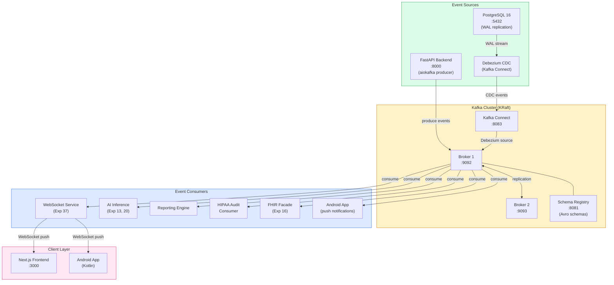

# Product Requirements Document: Apache Kafka Integration into Patient Management System (PMS)

**Document ID:** PRD-PMS-KAFKA-001
**Version:** 1.0
**Date:** March 3, 2026
**Author:** Ammar (CEO, MPS Inc.)
**Status:** Draft

---

## 1. Executive Summary

Apache Kafka is a distributed event streaming platform capable of handling millions of events per second with durable, ordered, exactly-once delivery guarantees. Originally developed at LinkedIn and now maintained by the Apache Software Foundation and Confluent, Kafka has become the de facto standard for enterprise event streaming — powering real-time data pipelines at organizations ranging from Netflix and Uber to major healthcare systems. In 2026, data streaming is no longer emerging technology; it is strategic infrastructure at the heart of modern enterprise architectures.

For the PMS, Kafka addresses a fundamental architectural gap: the absence of a durable, replayable event backbone connecting the clinical data lifecycle. Today, the PMS backend (FastAPI), frontend (Next.js), Android app, and downstream services (AI inference, reporting, audit logging) communicate through synchronous REST API calls. When the reporting service is temporarily down, medication changes are lost. When the AI inference pipeline falls behind, prescription interaction checks block the clinical workflow. When a new analytics service is added, the backend must be modified to send it data. Kafka decouples all of these — every clinical event (patient created, encounter signed, prescription written, lab result received) is published to durable, partitioned topics that any number of consumers can read independently, at their own pace, and replay from any point in history.

The integration uses Kafka in KRaft mode (no ZooKeeper), Debezium for PostgreSQL Change Data Capture (CDC) to stream database changes without modifying application code, Schema Registry with Avro for type-safe clinical event schemas, and aiokafka/confluent-kafka-python for async FastAPI producers and consumers. All topics carrying PHI use TLS 1.3 encryption in transit, AES-256 encryption at rest, SASL/SCRAM authentication, and ACL-based topic authorization — meeting HIPAA requirements for data in motion and at rest with 6+ year retention capability.

---

## 2. Problem Statement

- **Tight coupling between PMS services:** The FastAPI backend is the sole orchestrator of all data flow. When a prescription is created, the backend must synchronously notify the drug interaction checker, update the audit log, inform the reporting pipeline, and push a WebSocket event. If any downstream service is slow or unavailable, the clinical workflow is blocked or data is lost.
- **No event replay or audit trail of data changes:** HIPAA requires 6+ years of audit retention. Currently, audit logs capture API access events but not the full history of data state changes. If a patient record was modified, there is no immutable, replayable log of what changed, when, and in what order — only the current database state and discrete audit entries.
- **Downstream services cannot consume at their own pace:** The AI inference pipeline (Experiments 13, 20), reporting engine, and analytics services all need clinical data, but each has different throughput characteristics. Synchronous REST calls force all consumers to keep up with the producer or lose data.
- **Adding new consumers requires backend changes:** Every time a new downstream service needs clinical data (e.g., a new analytics dashboard, a FHIR subscription endpoint, an HL7v2 outbound feed), the backend must be modified to send data to it. Kafka's pub/sub model eliminates this — new consumers subscribe to existing topics without any producer changes.
- **No Change Data Capture from PostgreSQL:** Database-level changes (direct SQL updates, migration scripts, admin corrections) bypass the application layer and are invisible to downstream services. Debezium CDC captures every row-level change from PostgreSQL's Write-Ahead Log (WAL), ensuring nothing is missed.
- **Real-time WebSocket events lack durability:** Experiment 37 (WebSocket) provides instant delivery but no persistence — if a client is disconnected when an event occurs, that event is lost. Kafka provides the durable event store that WebSocket can read from, ensuring every event is delivered even after reconnection.

---

## 3. Proposed Solution

Adopt **Apache Kafka** as the central event streaming backbone for the PMS, providing durable, ordered, replayable event delivery between all PMS services with exactly-once semantics and HIPAA-compliant security.

### 3.1 Architecture Overview

### 3.2 Deployment Model

- **Self-hosted, Docker-based:** Kafka cluster (KRaft mode — no ZooKeeper), Schema Registry, and Kafka Connect run in Docker Compose alongside the existing PMS stack
- **KRaft mode:** Kafka 3.7+ with KRaft consensus eliminates ZooKeeper dependency, reducing infrastructure from 5 containers to 3 (broker, schema-registry, connect)
- **Data encryption:** TLS 1.3 for all inter-broker and client-broker communication; AES-256 encryption at rest for topic data on disk
- **Authentication:** SASL/SCRAM-SHA-512 for client authentication; ACL-based authorization per topic
- **PHI isolation:** Topics carrying PHI (`pms.patients`, `pms.encounters`, `pms.prescriptions`) have strict ACLs; non-PHI topics (`pms.system.events`, `pms.audit`) have broader read access
- **Retention:** PHI topics retain data for 7 years (HIPAA 6-year requirement + 1-year buffer); audit topics retain indefinitely; system topics retain for 30 days
- **Replication:** Factor of 2 for development, 3 for production — every message is stored on multiple brokers for fault tolerance

---

## 4. PMS Data Sources

| PMS Resource | Kafka Topic | Event Types | Retention |
|-------------|-------------|-------------|-----------|
| Patient Records API (`/api/patients`) | `pms.patients` | `PatientCreated`, `PatientUpdated`, `PatientStatusChanged`, `PatientMerged` | 7 years |
| Encounter Records API (`/api/encounters`) | `pms.encounters` | `EncounterCreated`, `EncounterUpdated`, `EncounterSigned`, `EncounterAmended` | 7 years |
| Medication & Prescription API (`/api/prescriptions`) | `pms.prescriptions` | `PrescriptionCreated`, `PrescriptionDispensed`, `InteractionDetected`, `ReconciliationCompleted` | 7 years |
| Reporting API (`/api/reports`) | `pms.reports` | `ReportRequested`, `ReportGenerated`, `ReportExported` | 30 days |
| PostgreSQL CDC (Debezium) | `pms.cdc.patients`, `pms.cdc.encounters`, `pms.cdc.prescriptions` | Row-level INSERT, UPDATE, DELETE with before/after state | 7 years |
| System / Audit Events | `pms.audit` | `UserLogin`, `RecordAccessed`, `PermissionChanged`, `SystemAlert` | Indefinite |

---

## 5. Component/Module Definitions

### 5.1 Kafka Event Producer (FastAPI)

**Description:** Async Kafka producer integrated into the FastAPI backend using aiokafka. Every clinical data mutation (create, update, delete) publishes a typed event to the corresponding Kafka topic after the database transaction commits. Events are serialized using Avro schemas registered in Schema Registry, ensuring type safety and backward compatibility.

**Input:** Clinical data mutations from API endpoints (patient CRUD, encounter operations, prescription management).
**Output:** Avro-serialized events published to `pms.patients`, `pms.encounters`, `pms.prescriptions` topics.
**PMS APIs used:** Post-commit hooks on `/api/patients`, `/api/encounters`, `/api/prescriptions` endpoints.

### 5.2 Debezium CDC Connector

**Description:** Kafka Connect source connector running Debezium PostgreSQL CDC. Captures every row-level change from PostgreSQL's Write-Ahead Log (WAL) using logical replication, emitting events with full before/after state for each change. This captures changes made outside the application layer (direct SQL, migrations, admin tools) that the application-level producer would miss.

**Input:** PostgreSQL WAL logical replication stream.
**Output:** CDC events to `pms.cdc.patients`, `pms.cdc.encounters`, `pms.cdc.prescriptions` topics with Avro serialization.
**PMS APIs used:** None (operates at database level); complements the application-level producer.

### 5.3 Clinical Event Consumer Framework

**Description:** Reusable async consumer framework for building PMS event consumers. Provides deserialization, error handling, dead-letter queue routing, idempotency checking (via event ID deduplication), and consumer group management. Each downstream service (AI inference, reporting, FHIR, audit) instantiates a consumer from this framework.

**Input:** Kafka topic subscriptions with consumer group configuration.
**Output:** Deserialized, validated clinical events delivered to service-specific handlers.
**PMS APIs used:** Consumes from all `pms.*` topics; calls downstream service APIs.

### 5.4 HIPAA Audit Event Consumer

**Description:** Dedicated consumer that reads from all PMS topics and writes an immutable audit trail to a long-term storage system (PostgreSQL audit table or S3-compatible object storage). Provides the replayable, tamper-evident audit history required by HIPAA. Each audit entry includes: event ID, timestamp, user ID, event type, affected record ID, and a hash of the event payload for integrity verification.

**Input:** All `pms.*` and `pms.cdc.*` topic events.
**Output:** Immutable audit records with integrity hashes; retention >= 7 years.
**PMS APIs used:** Audit storage API; alerting on anomalous access patterns.

### 5.5 WebSocket Bridge Consumer

**Description:** Consumer that reads from PMS topics and forwards events to the WebSocket Connection Manager (Experiment 37) for real-time client delivery. This bridges the durable Kafka event store with the instant WebSocket transport layer — Kafka guarantees no events are lost, WebSocket guarantees instant delivery to connected clients.

**Input:** Kafka topic events from `pms.patients`, `pms.encounters`, `pms.prescriptions`.
**Output:** WebSocket messages to the Connection Manager via Redis pub/sub.
**PMS APIs used:** WebSocket Connection Manager (Exp 37); Redis pub/sub.

### 5.6 Schema Registry

**Description:** Confluent Schema Registry managing Avro schemas for all PMS event types. Enforces backward and forward compatibility rules so producers and consumers can evolve independently. Every event schema includes a version number; consumers can handle both current and previous schema versions without downtime.

**Input:** Avro schema definitions for each event type.
**Output:** Schema IDs embedded in Kafka message headers; compatibility validation on schema evolution.

---

## 6. Non-Functional Requirements

### 6.1 Security and HIPAA Compliance

- **Encryption in transit:** TLS 1.3 for all client-broker, inter-broker, and Connect-broker communication; mutual TLS (mTLS) for Debezium connector
- **Encryption at rest:** AES-256 disk encryption for Kafka log segments; broker data volumes use LUKS or dm-crypt
- **Authentication:** SASL/SCRAM-SHA-512 for all producers and consumers; per-client credentials with rotation policy
- **Authorization:** ACL-based topic access control; PHI topics restricted to authorized service accounts only; read-only access for audit and reporting consumers
- **PHI minimization in events:** Events contain record IDs, field names, and change metadata; full PHI payloads are encrypted within the Avro schema using field-level encryption where required
- **Audit logging:** All topic access (produce, consume, admin) logged; Kafka broker audit log enabled; consumer offset tracking for compliance verification
- **Retention compliance:** PHI topics configured with 7-year retention (2,555 days); audit topics with infinite retention; log compaction disabled for PHI topics to preserve full history
- **Data deletion:** GDPR/state privacy law right-to-delete implemented via Kafka log compaction with tombstone records — publishing a null-value record with the patient's key permanently removes their data from compacted topics

### 6.2 Performance

| Metric | Target |
|--------|--------|
| Event publish latency (producer → broker) | < 10ms (p99) |
| End-to-end latency (API → consumer) | < 100ms (p95) |
| Throughput per broker | >= 100,000 messages/second |
| Consumer lag (real-time consumers) | < 1,000 messages |
| Debezium CDC latency | < 500ms from WAL write to topic |
| Schema Registry lookup | < 5ms (cached) |
| Event replay rate | >= 50,000 messages/second |
| Broker storage per day (estimated) | ~500 MB (PMS scale) |

### 6.3 Infrastructure

| Component | Specification |
|-----------|--------------|
| Kafka Broker (KRaft) | 2 containers (dev), 3 (prod); 2 GB RAM each; SSD storage |
| Schema Registry | 1 container; 512 MB RAM |
| Kafka Connect + Debezium | 1 container; 1 GB RAM; PostgreSQL logical replication slot |
| Kafka UI (optional) | 1 container (Kafdrop or Kafka UI); 256 MB RAM |
| Docker Compose | 4-5 new containers added to existing PMS stack |
| Storage | ~180 GB/year at PMS scale with 7-year PHI retention |
| Network | Internal Docker network; no external ports exposed (except broker for development) |

---

## 7. Implementation Phases

### Phase 1: Kafka Infrastructure & CDC Foundation (Sprints 1-2)

- Deploy Kafka cluster (KRaft mode, 2 brokers) via Docker Compose
- Deploy Schema Registry and register initial PMS event schemas (Patient, Encounter, Prescription)
- Deploy Kafka Connect with Debezium PostgreSQL CDC connector
- Configure TLS 1.3 encryption, SASL/SCRAM authentication, and topic ACLs
- Verify CDC events from PostgreSQL appear in `pms.cdc.*` topics
- Build basic Python consumer framework with aiokafka
- Create HIPAA Audit Event Consumer writing to PostgreSQL audit table
- Write integration tests for producer → broker → consumer pipeline

### Phase 2: Application-Level Event Production & Core Consumers (Sprints 3-4)

- Integrate aiokafka producer into FastAPI backend (post-commit event publishing)
- Register Avro schemas for all PMS event types in Schema Registry
- Build WebSocket Bridge Consumer connecting Kafka events to Exp 37 WebSocket layer
- Build AI Inference Consumer forwarding prescription events to drug interaction pipeline (Exp 13, 20)
- Build Reporting Consumer for real-time dashboard metric updates
- Implement dead-letter queue (DLQ) for failed consumer processing
- Implement idempotency checking (event ID deduplication) in consumer framework
- Performance test with realistic clinical event volume

### Phase 3: Advanced Features & Operational Maturity (Sprints 5-6)

- Build FHIR Subscription Consumer connecting Kafka events to FHIR facade (Exp 16)
- Implement event replay tooling for operational recovery and debugging
- Build Kafka Streams application for real-time clinical event aggregation (patient timeline, encounter summary)
- Implement consumer lag monitoring and alerting (Prometheus + Grafana)
- Configure 7-year retention for PHI topics with storage tiering (hot → warm → cold)
- Build administrative tools: topic management, schema evolution, consumer group management
- Load test at 10x expected production volume
- Document operational runbooks for broker failure, partition rebalancing, and schema evolution

---

## 8. Success Metrics

| Metric | Target | Measurement Method |
|--------|--------|--------------------|
| Service coupling | Zero synchronous cross-service calls for data distribution | Architecture review; API call tracing |
| Event delivery guarantee | Exactly-once for all clinical events | Consumer offset and idempotency tracking |
| End-to-end latency | < 100ms (producer → consumer, p95) | Kafka consumer lag metrics + instrumented timing |
| Data loss | Zero events lost during normal operation | Compare producer record count vs consumer count |
| Audit trail completeness | 100% of data mutations captured | Cross-reference CDC events against database change count |
| New consumer onboarding time | < 1 day to add a new event consumer | Track time from request to production consumer |
| System availability | >= 99.9% broker uptime | Kafka broker health monitoring |
| HIPAA audit compliance | 7+ years of replayable event history | Retention policy verification; audit consumer lag |

---

## 9. Risks and Mitigations

| Risk | Impact | Mitigation |
|------|--------|------------|
| Operational complexity of Kafka cluster | Team unfamiliar with Kafka ops; broker failures cause downtime | KRaft mode reduces complexity (no ZooKeeper); Kafka UI for monitoring; detailed runbooks; start with 2 brokers in dev |
| Debezium CDC replication slot growth | PostgreSQL WAL accumulates if Debezium is down, consuming disk | Monitor replication slot lag; alert at 1 GB; auto-drop stale slots after 24h; document recovery procedure |
| Schema evolution breaks consumers | Incompatible schema changes cause deserialization failures | Schema Registry enforces backward compatibility; all schema changes go through PR review; consumer tests include schema migration |
| Storage growth with 7-year retention | PHI topics accumulate significant storage over years | Tiered storage (hot SSD → warm HDD → cold S3); estimated ~180 GB/year at PMS scale; budget for growth |
| Exactly-once overhead | Transactional producing adds latency | Enable idempotent producer (minimal overhead); use transactions only for multi-topic writes; benchmark shows < 5ms additional latency |
| Kafka becomes single point of failure | All event flow stops if Kafka cluster is unavailable | Multi-broker replication (factor 3 in prod); Kafka designed for 99.99% uptime; fallback to synchronous REST for critical paths during outage |
| Developer learning curve | Team must learn Kafka concepts (topics, partitions, consumer groups, offsets) | Phase 1 includes guided onboarding; consumer framework abstracts complexity; developer tutorial provided |

---

## 10. Dependencies

| Dependency | Version | Purpose | License |
|-----------|---------|---------|---------|
| Apache Kafka | 3.7+ (KRaft) | Event streaming broker | Apache 2.0 |
| Confluent Schema Registry | 7.6+ | Avro schema management | Confluent Community License |
| Debezium | 2.6+ | PostgreSQL CDC connector | Apache 2.0 |
| Kafka Connect | Bundled with Kafka | Connector runtime for Debezium | Apache 2.0 |
| aiokafka | 0.10+ | Async Python Kafka client for FastAPI | Apache 2.0 |
| confluent-kafka-python | 2.4+ (optional) | Alternative Python Kafka client with native Avro support | Apache 2.0 |
| fastavro | 1.9+ | Fast Avro serialization for Python | MIT |
| PostgreSQL | 16.x | Source database with logical replication | PostgreSQL License |
| Redis | 7.x | WebSocket bridge pub/sub (Exp 37 integration) | BSD 3-Clause |

---

## 11. Comparison with Existing Experiments

| Aspect | Kafka (Exp 38) | WebSocket (Exp 37) | n8n Workflows (Exp 34) | LangGraph (Exp 26) | FHIR (Exp 16) | HL7v2 (Exp 17) |
|--------|---------------|--------------------|-----------------------|--------------------|----|------|
| **Primary function** | Durable event streaming backbone | Real-time client push | Visual workflow automation | Stateful AI agent orchestration | Healthcare data exchange standard | Legacy lab messaging |
| **Delivery guarantee** | Exactly-once, durable, replayable | At-most-once (fire-and-forget) | At-least-once (queue-based) | At-least-once (checkpoint) | HTTP request/response | MLLP ACK/NAK |
| **Persistence** | Years of durable storage | None (in-memory only) | Workflow execution history | PostgreSQL checkpoints | REST resources | Message log |
| **Scalability** | Millions of events/second | Thousands of connections | Hundreds of workflows | Tens of concurrent agents | Hundreds of API calls | Hundreds of messages |
| **Consumer model** | Pub/sub with consumer groups | Channel subscriptions | Trigger-based | Graph node execution | REST subscriptions | Point-to-point |
| **PHI handling** | Encrypted topics with ACLs | ID-only messages | Workflow data isolation | Agent context isolation | FHIR resource security | Segment-level encryption |

**Complementary roles:**
- **Kafka (Exp 38)** is the durable event backbone; **WebSocket (Exp 37)** is the real-time delivery layer — Kafka stores and guarantees delivery, WebSocket provides instant push to clients. The WebSocket Bridge Consumer connects the two.
- **Debezium CDC** captures all database changes (including those from n8n workflows, LangGraph agents, and direct SQL) without application code changes — a universal change feed.
- **FHIR (Exp 16)** and **HL7v2 (Exp 17)** interoperability events can be published to Kafka topics, enabling external systems to consume PMS changes as a stream rather than polling FHIR endpoints.
- **n8n (Exp 34)** can trigger workflows from Kafka events using the Kafka trigger node, enabling event-driven automation.

---

## 12. Research Sources

### Official Documentation
- [Apache Kafka Introduction](https://kafka.apache.org/42/getting-started/introduction/) — Core concepts, architecture, and API overview
- [Confluent Kafka Architecture Course](https://developer.confluent.io/courses/architecture/get-started/) — Internal architecture deep-dive
- [Debezium PostgreSQL Connector](https://debezium.io/documentation/reference/stable/connectors/postgresql.html) — CDC connector configuration and capabilities

### Healthcare & Compliance
- [Kafka for Cloud-Based Healthcare HIPAA Compliance (Alibaba Cloud)](https://www.alibabacloud.com/tech-news/a/kafka/gtv2q09fj3-kafka-for-cloud-based-healthcare-data-management-a-guide-to-hipaa-compliance) — HIPAA requirements for Kafka deployment
- [Kafka Data Privacy, Security, and Compliance (Confluent)](https://www.confluent.io/blog/kafka-data-privacy-security-and-compliance/) — Encryption, audit, and PHI handling patterns
- [Healthcare Data Streaming Use Cases (Conduktor)](https://www.conduktor.io/glossary/healthcare-data-streaming-use-cases) — Clinical streaming patterns and ICU monitoring
- [Apache Kafka in the Healthcare Industry (Kai Waehner)](https://www.kai-waehner.de/blog/2022/03/28/apache-kafka-data-streaming-healthcare-industry/) — Healthcare event streaming architecture patterns

### Architecture & Integration
- [FastAPI Kafka Integration with aiokafka (Agent Factory)](https://agentfactory.panaversity.org/docs/AI-Cloud-Native-Development/event-driven-kafka/async-fastapi-integration) — Async producer/consumer patterns for FastAPI
- [Data Streaming Landscape 2026 (Kai Waehner)](https://www.kai-waehner.de/blog/2025/12/05/the-data-streaming-landscape-2026/) — Industry trends and Kafka ecosystem evolution
- [Exactly-Once Semantics in Kafka (Conduktor)](https://www.conduktor.io/glossary/exactly-once-semantics-in-kafka/) — Idempotent producer and transactional semantics
- [Running Kafka KRaft on Docker (Instaclustr)](https://www.instaclustr.com/education/apache-spark/running-apache-kafka-kraft-on-docker-tutorial-and-best-practices/) — KRaft Docker deployment guide

---

## 13. Appendix: Related Documents

- [Kafka PMS Setup Guide](38-Kafka-PMS-Developer-Setup-Guide.md)
- [Kafka PMS Developer Tutorial](38-Kafka-Developer-Tutorial.md)
- [WebSocket PMS Integration PRD (Experiment 37)](37-PRD-WebSocket-PMS-Integration.md) — Real-time client delivery layer that Kafka feeds
- [FHIR PMS Integration PRD (Experiment 16)](16-PRD-FHIR-PMS-Integration.md) — Interoperability layer that consumes Kafka events
- [HL7v2 LIS Messaging PRD (Experiment 17)](17-PRD-HL7v2LIS-PMS-Integration.md) — Legacy lab messaging that publishes to Kafka
- [n8n 2.0+ PRD (Experiment 34)](34-PRD-n8nUpdates-PMS-Integration.md) — Workflow automation triggered by Kafka events
