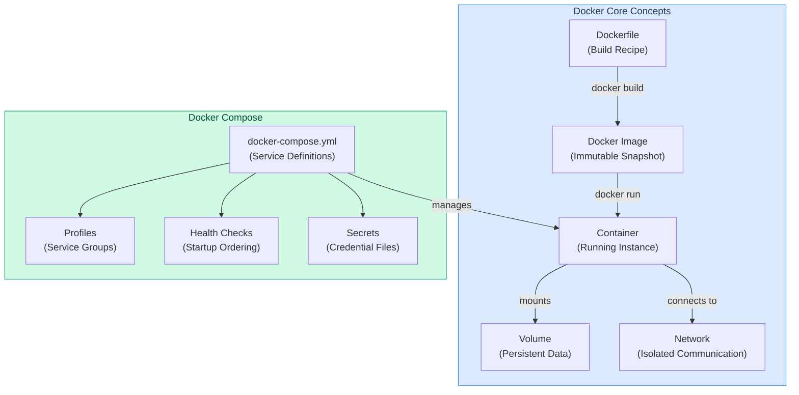
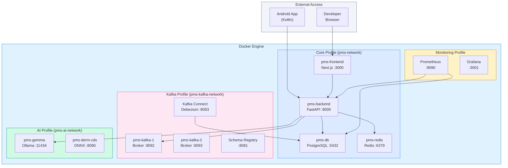

# Docker Developer Onboarding Tutorial

**Welcome to the MPS PMS Docker Integration Team**

This tutorial will take you from zero to building your first Docker-containerized PMS integration. By the end, you will understand how Docker works, have a running local environment, and have built and tested a custom multi-service integration end-to-end.

**Document ID:** PMS-EXP-DOCKER-002
**Version:** 1.0
**Date:** March 3, 2026
**Applies To:** PMS project (all platforms)
**Prerequisite:** [Docker Setup Guide](39-Docker-PMS-Developer-Setup-Guide.md)
**Estimated time:** 2-3 hours
**Difficulty:** Beginner-friendly

---

## What You Will Learn

1. How Docker containers differ from virtual machines and why containerization matters for healthcare software
2. How Docker images are built using multi-stage Dockerfiles for minimal attack surface
3. How Docker Compose orchestrates multiple services with health checks and dependency ordering
4. How Docker networks isolate PHI-processing services from non-sensitive workloads
5. How Docker secrets protect credentials without exposing them in environment variables or images
6. How to build a complete patient data pipeline running entirely in containers
7. How to debug containerized services using logs, exec, and health checks
8. How to evaluate Docker's strengths and limitations for HIPAA-compliant deployments
9. How Docker integrates with every other PMS experiment (Kafka, WebSocket, AI models)
10. How to follow PMS conventions for Dockerfiles, Compose files, and container security

---

## Part 1: Understanding Docker (15 min read)

### 1.1 What Problem Does Docker Solve?

Imagine a new developer joins the PMS team. To run the application locally, they need to install:

- Python 3.12 with the exact same pip packages
- Node.js 22 with matching npm dependencies
- PostgreSQL 16 with pgvector and pgcrypto extensions
- Redis 7 with specific configuration
- Potentially Kafka, Ollama, and other experiment services

Each of these has OS-specific installation steps, version conflicts, and configuration differences. On macOS, PostgreSQL installs differently than Ubuntu. On Windows, Python path handling differs. A developer might spend 1-2 days just getting the environment working — and their environment still won't exactly match production.

**Docker solves this by packaging each service with its exact dependencies into a portable container.** Instead of installing 6+ services, the developer runs one command: `docker compose --profile core up`. Every developer, CI server, and production host runs the same containers.

For healthcare software, this consistency is critical: HIPAA compliance requires that security controls are identical across environments. Docker ensures that the encryption, access controls, and audit logging you test locally are exactly what runs in production.

### 1.2 How Docker Works — The Key Pieces



**Three concepts to internalize:**

1. **Image = Blueprint**: A Dockerfile defines how to build an image. The image is an immutable, layered snapshot of your application + dependencies. Think of it as a class definition.

2. **Container = Running Instance**: When you run an image, Docker creates a container — an isolated process with its own filesystem, network, and PID namespace. Think of it as an object instance.

3. **Compose = Orchestrator**: Docker Compose defines how multiple containers work together — networks, volumes, health checks, startup order, and secrets — in a single YAML file.

### 1.3 How Docker Fits with Other PMS Technologies

| Experiment | Relationship to Docker | How Docker Helps |
|-----------|----------------------|-----------------|
| 37-WebSocket | Runs inside `pms-backend` container | Redis pub/sub container provides cross-instance broadcasting |
| 38-Kafka | Entire Kafka cluster runs as Docker containers | `kafka` profile starts 2 brokers + Schema Registry + Connect |
| 13-Gemma 3 | Ollama runs as Docker container with GPU | `ai` profile provides isolated AI network |
| 16-FHIR | FHIR Facade runs inside `pms-backend` container | Consistent environment for FHIR resource mapping |
| 09-MCP | MCP server runs inside `pms-backend` container | Container networking provides stable service discovery |
| 35-Kintsugi | Voice biomarker engine runs as separate container | Isolated container with audio processing dependencies |
| 12-AI Zero-Day Scan | Security scanning runs in CI container | `docker scout` scans images for vulnerabilities |

### 1.4 Key Vocabulary

| Term | Meaning |
|------|---------|
| **Image** | Immutable, layered snapshot of an application with its dependencies |
| **Container** | Running instance of an image with isolated filesystem, network, and processes |
| **Dockerfile** | Text file with instructions to build a Docker image |
| **Multi-stage build** | Dockerfile with multiple `FROM` stages — builder installs dependencies, runtime copies only what's needed |
| **Docker Compose** | Tool for defining and running multi-container applications via YAML |
| **Profile** | Named group of services in Compose (e.g., `core`, `kafka`, `ai`) that can be selectively started |
| **Volume** | Persistent storage that survives container restarts and removals |
| **Bridge network** | Virtual network allowing containers to communicate by service name |
| **Health check** | Command Docker runs periodically to determine if a container is healthy |
| **Secret** | Sensitive data (passwords, keys) mounted as files at `/run/secrets/` — never in env vars |
| **BuildKit** | Modern Docker build engine with parallel execution, caching, and multi-platform support |
| **Layer** | Each Dockerfile instruction creates an immutable layer; unchanged layers are cached |

### 1.5 Our Architecture



---

## Part 2: Environment Verification (15 min)

### 2.1 Checklist

Run each command and verify the expected output:

```bash
# 1. Docker Engine is running
docker info --format '{{.ServerVersion}}'
# Expected: 24.x.x or higher

# 2. Docker Compose v2 is available
docker compose version
# Expected: Docker Compose version v2.24.x or higher

# 3. BuildKit is enabled
docker buildx version
# Expected: github.com/docker/buildx v0.x.x

# 4. PMS source code is available
ls ~/Projects/demo/docker-compose.yml
# Expected: file exists

# 5. Secrets are created
ls ~/Projects/demo/secrets/
# Expected: db_password.txt, redis_password.txt, jwt_secret.txt

# 6. No port conflicts
lsof -i :3000,:8000,:5432,:6379 2>/dev/null | grep LISTEN
# Expected: no output (or only Docker processes)
```

### 2.2 Quick Test

Start the core stack and verify end-to-end connectivity:

```bash
cd ~/Projects/demo

# Start core services
docker compose --profile core up -d

# Wait for health checks (up to 60 seconds)
echo "Waiting for services to be healthy..."
timeout 60 bash -c 'until docker compose --profile core ps | grep -q "unhealthy"; do
  if docker compose --profile core ps | grep -v "unhealthy" | grep -q "healthy"; then
    echo "All services healthy!"
    break
  fi
  sleep 2
done'

# Verify backend responds
curl -sf http://localhost:8000/health && echo " Backend OK" || echo " Backend FAILED"

# Verify frontend responds
curl -sf http://localhost:3000 > /dev/null && echo " Frontend OK" || echo " Frontend FAILED"

# Clean up
docker compose --profile core down
```

---

## Part 3: Build Your First Integration (45 min)

### 3.1 What We Are Building

We will build a **Patient Encounter Audit Logger** — a containerized pipeline that:

1. Receives encounter creation events via the PMS Backend API
2. Logs every PHI access to a HIPAA audit table in PostgreSQL
3. Caches recent encounter summaries in Redis for fast dashboard access
4. Exposes a containerized audit dashboard endpoint

This exercises all four core containers working together with proper security.

### 3.2 Step 1 — Create the Audit Logger Service

Create `app/services/audit_logger.py` in the backend:

```python
"""
HIPAA-compliant audit logger for PMS encounter events.
Runs inside the pms-backend container, uses Docker secrets for DB credentials.
"""
import uuid
from datetime import datetime, timezone
from typing import Optional

from sqlalchemy.ext.asyncio import AsyncSession
from sqlalchemy import text
import redis.asyncio as aioredis
import json

from app.core.config import settings


class AuditLogger:
    """Logs all PHI access events for HIPAA compliance."""

    def __init__(self, db: AsyncSession):
        self.db = db
        self._redis: Optional[aioredis.Redis] = None

    async def _get_redis(self) -> aioredis.Redis:
        """Lazy Redis connection using Docker secret password."""
        if self._redis is None:
            self._redis = aioredis.from_url(
                settings.redis_url,
                password=settings.redis_password,
                decode_responses=True,
            )
        return self._redis

    async def log_access(
        self,
        user_id: uuid.UUID,
        action: str,
        resource_type: str,
        resource_id: uuid.UUID,
        details: Optional[dict] = None,
        ip_address: Optional[str] = None,
        user_agent: Optional[str] = None,
    ) -> uuid.UUID:
        """
        Log a PHI access event to the audit table and cache.

        This method writes to both PostgreSQL (durable) and Redis (fast reads).
        The PostgreSQL write is the source of truth for HIPAA compliance.
        """
        audit_id = uuid.uuid4()
        timestamp = datetime.now(timezone.utc)

        # Write to PostgreSQL (HIPAA durable audit log)
        await self.db.execute(
            text("""
                INSERT INTO pms.audit_log
                    (id, timestamp, user_id, action, resource_type, resource_id,
                     details, ip_address, user_agent)
                VALUES
                    (:id, :ts, :user_id, :action, :rtype, :rid,
                     :details, :ip, :ua)
            """),
            {
                "id": audit_id,
                "ts": timestamp,
                "user_id": user_id,
                "action": action,
                "rtype": resource_type,
                "rid": resource_id,
                "details": json.dumps(details) if details else None,
                "ip": ip_address,
                "ua": user_agent,
            },
        )
        await self.db.commit()

        # Cache in Redis for fast dashboard reads (TTL: 1 hour)
        redis = await self._get_redis()
        cache_key = f"audit:recent:{resource_type}"
        audit_entry = {
            "id": str(audit_id),
            "timestamp": timestamp.isoformat(),
            "user_id": str(user_id),
            "action": action,
            "resource_type": resource_type,
            "resource_id": str(resource_id),
        }
        await redis.lpush(cache_key, json.dumps(audit_entry))
        await redis.ltrim(cache_key, 0, 99)  # Keep last 100 entries
        await redis.expire(cache_key, 3600)   # 1 hour TTL

        return audit_id

    async def get_recent_audits(
        self, resource_type: str, limit: int = 20
    ) -> list[dict]:
        """
        Get recent audit entries from Redis cache.
        Falls back to PostgreSQL if cache is empty.
        """
        redis = await self._get_redis()
        cache_key = f"audit:recent:{resource_type}"

        # Try Redis cache first
        cached = await redis.lrange(cache_key, 0, limit - 1)
        if cached:
            return [json.loads(entry) for entry in cached]

        # Fallback to PostgreSQL
        result = await self.db.execute(
            text("""
                SELECT id, timestamp, user_id, action, resource_type, resource_id
                FROM pms.audit_log
                WHERE resource_type = :rtype
                ORDER BY timestamp DESC
                LIMIT :limit
            """),
            {"rtype": resource_type, "limit": limit},
        )
        rows = result.fetchall()
        return [
            {
                "id": str(row.id),
                "timestamp": row.timestamp.isoformat(),
                "user_id": str(row.user_id),
                "action": row.action,
                "resource_type": row.resource_type,
                "resource_id": str(row.resource_id),
            }
            for row in rows
        ]
```

### 3.3 Step 2 — Create the Audit API Endpoint

Create `app/api/audit.py`:

```python
"""Audit log API endpoints — runs inside pms-backend container."""
import uuid
from fastapi import APIRouter, Depends, Request
from sqlalchemy.ext.asyncio import AsyncSession

from app.core.database import get_db
from app.services.audit_logger import AuditLogger

router = APIRouter(prefix="/api/audit", tags=["audit"])


@router.get("/recent/{resource_type}")
async def get_recent_audits(
    resource_type: str,
    limit: int = 20,
    db: AsyncSession = Depends(get_db),
):
    """Get recent audit log entries (cached in Redis)."""
    logger = AuditLogger(db)
    audits = await logger.get_recent_audits(resource_type, limit)
    return {"audits": audits, "count": len(audits)}


@router.post("/log")
async def log_audit_event(
    request: Request,
    user_id: uuid.UUID,
    action: str,
    resource_type: str,
    resource_id: uuid.UUID,
    db: AsyncSession = Depends(get_db),
):
    """Log a PHI access event (writes to PostgreSQL + Redis cache)."""
    logger = AuditLogger(db)
    audit_id = await logger.log_access(
        user_id=user_id,
        action=action,
        resource_type=resource_type,
        resource_id=resource_id,
        ip_address=request.client.host if request.client else None,
        user_agent=request.headers.get("user-agent"),
    )
    return {"audit_id": str(audit_id), "status": "logged"}
```

### 3.4 Step 3 — Rebuild and Test the Backend Container

```bash
# Rebuild the backend with new code
docker compose --profile core build pms-backend

# Restart only the backend (DB and Redis stay running)
docker compose --profile core up -d pms-backend

# Wait for health check
sleep 10
docker compose --profile core ps pms-backend
# Expected: Up (healthy)
```

### 3.5 Step 4 — Test the Audit Pipeline End-to-End

```bash
# Log an audit event (encounter access)
curl -s -X POST "http://localhost:8000/api/audit/log?\
user_id=550e8400-e29b-41d4-a716-446655440000&\
action=view&\
resource_type=encounter&\
resource_id=660e8400-e29b-41d4-a716-446655440001" | python3 -m json.tool

# Expected:
# {
#     "audit_id": "...",
#     "status": "logged"
# }

# Log a few more events
for i in $(seq 1 5); do
  curl -s -X POST "http://localhost:8000/api/audit/log?\
user_id=550e8400-e29b-41d4-a716-446655440000&\
action=update&\
resource_type=encounter&\
resource_id=660e8400-e29b-41d4-a716-44665544000$i" > /dev/null
done
echo "Logged 5 encounter update events"

# Retrieve recent audits (served from Redis cache)
curl -s http://localhost:8000/api/audit/recent/encounter?limit=10 | python3 -m json.tool

# Expected: list of 6 audit entries from Redis
```

### 3.6 Step 5 — Verify Data Persistence

```bash
# Confirm data is in PostgreSQL (not just Redis)
docker compose exec pms-db psql -U pms_user -d pms -c \
  "SELECT action, resource_type, timestamp FROM pms.audit_log ORDER BY timestamp DESC LIMIT 5;"

# Confirm data is cached in Redis
docker compose exec pms-redis redis-cli LLEN audit:recent:encounter
# Expected: 6

# Test persistence: restart containers
docker compose --profile core restart

# Data should survive restart (volumes are persistent)
curl -s http://localhost:8000/api/audit/recent/encounter?limit=3 | python3 -m json.tool
# Expected: audit entries still present
```

**Checkpoint**: You've built a complete containerized audit pipeline. PHI access events flow from the API → PostgreSQL (durable) + Redis (cache), all running in isolated containers with Docker secrets for credentials.

---

## Part 4: Evaluating Strengths and Weaknesses (15 min)

### 4.1 Strengths

- **Environment Parity**: Identical containers from development to production eliminate "works on my machine" failures
- **One-Command Setup**: `docker compose --profile core up` starts the full PMS stack in under 60 seconds
- **Network Isolation**: Custom bridge networks enforce least-privilege communication between services processing PHI
- **Ecosystem Maturity**: 12+ years of production use, massive community (65K+ GitHub stars on Moby), every CI/CD platform has native Docker support
- **Multi-Stage Builds**: Separate build and runtime stages reduce image size (950 MB → 180 MB for Python AI APIs) and exclude dev dependencies from production
- **Secrets Management**: `/run/secrets/` files are more secure than environment variables — not visible in `docker inspect`, process lists, or logs
- **Profile System**: Compose profiles let developers start only the services they need (`core` vs `core + kafka + ai`)
- **Universal Standard**: OCI image format ensures portability across Docker, Podman, Kubernetes, and cloud container services

### 4.2 Weaknesses

- **macOS Performance**: Docker Desktop on macOS uses a Linux VM, causing 2-5x I/O slowdown for bind mounts. Mitigated by OrbStack or named volumes, but still slower than native
- **Licensing Complexity**: Docker Desktop requires a paid subscription for organizations with > 250 employees or > $10M revenue. Docker Engine itself is free (Apache 2.0)
- **Resource Overhead**: Running a full stack (backend + frontend + DB + Redis + Kafka + AI) consumes 8-16 GB RAM. Laptops with 8 GB struggle
- **Build Time**: Initial `docker compose build` can take 5-10 minutes (downloading base images, installing dependencies). Subsequent builds use cache
- **Debugging Complexity**: Debugging across container boundaries requires `docker exec`, log aggregation, and network inspection — more complex than debugging a single process
- **Not an Orchestrator**: Docker Compose is excellent for development and single-host production, but lacks the auto-scaling, rolling updates, and self-healing of Kubernetes

### 4.3 When to Use Docker vs Alternatives

| Scenario | Recommendation |
|----------|---------------|
| Local development | **Docker Compose** — profiles, health checks, hot reload |
| CI/CD testing | **Docker Compose** — reproducible test environments |
| Single-host production | **Docker Compose** with `--profile` and restart policies |
| Multi-host production | **Kubernetes** (Helm charts built from Docker images) |
| Security-sensitive CI | **Podman** — rootless by default, no daemon |
| Ultra-lightweight edge | **containerd** — 42 MB vs Docker's 77 MB per instance |
| macOS development (speed priority) | **OrbStack** — Docker-compatible but faster I/O |

### 4.4 HIPAA / Healthcare Considerations

| HIPAA Requirement | Docker Implementation |
|-------------------|----------------------|
| **Encryption at rest** | Host-level LUKS encryption on volumes; PostgreSQL TDE; encrypted Docker volume drivers |
| **Encryption in transit** | TLS between containers (internal CA); mTLS for production database connections |
| **Access control** | Docker secrets (not env vars); non-root containers; read-only filesystems; network isolation |
| **Audit logging** | Centralized log driver (fluentd/json-file); immutable image layers for forensics |
| **Minimum necessary access** | Custom bridge networks; `internal: true` for non-public services; no `--privileged` |
| **Session management** | Application-level JWT with 30-min expiry; Redis session store with TTL |
| **Breach notification** | Container immutability enables exact reproduction of compromised environment |
| **BAA requirement** | Docker Inc. does not sign BAAs — all PHI processing uses self-hosted Docker Engine (no Docker Hub for PHI images) |

**Critical Rule**: Never push Docker images containing PHI to Docker Hub or any public registry. PHI is always mounted at runtime via volumes or secrets, never baked into images.

---

## Part 5: Debugging Common Issues (15 min read)

### Issue 1: Container Exits Immediately (Exit Code 1)

**Symptoms**: `docker compose ps` shows `Exited (1)` for a service

**Cause**: Application crash during startup — missing dependency, import error, or configuration issue

**Fix**:
```bash
# View the crash logs
docker compose logs pms-backend --tail=50

# Common causes:
# - Missing environment variable → check docker-compose.yml
# - Database not ready → check depends_on has condition: service_healthy
# - Import error → check requirements.txt matches Dockerfile
```

### Issue 2: "Connection Refused" Between Containers

**Symptoms**: Backend can't connect to `pms-db:5432` or `pms-redis:6379`

**Cause**: Containers on different networks, or target service not yet healthy

**Fix**:
```bash
# Verify both containers are on the same network
docker network inspect pms-network | grep -A2 "pms-backend\|pms-db"

# Verify target service is healthy
docker compose ps pms-db
# If "starting" or "unhealthy", wait or check its logs

# Test connectivity manually
docker compose exec pms-backend ping -c 1 pms-db
docker compose exec pms-backend curl -sf http://pms-db:5432 2>&1
```

### Issue 3: Changes Not Reflected After Code Edit

**Symptoms**: You edited Python/TypeScript code but the container serves the old version

**Cause**: Container is running the baked-in image, not your local files

**Fix**:
```bash
# Option A: Use docker-compose.override.yml with bind mounts (see Setup Guide)
# This enables hot reload for development

# Option B: Rebuild the specific service
docker compose --profile core build pms-backend
docker compose --profile core up -d pms-backend

# Option C: Use Compose Watch (auto-rebuild on file changes)
docker compose --profile core watch
```

### Issue 4: Docker Build Fails — "No Space Left on Device"

**Symptoms**: `COPY failed: no space left on device` during `docker build`

**Cause**: Docker's build cache and unused images consumed all allocated disk

**Fix**:
```bash
# Check disk usage
docker system df

# Clean up (removes unused images, containers, build cache)
docker system prune -a

# If Docker Desktop: increase disk allocation in Settings → Resources
```

### Issue 5: Health Check Fails — Container Stuck in "Starting"

**Symptoms**: `docker compose ps` shows `Up (health: starting)` indefinitely

**Cause**: Health check command fails — wrong endpoint, missing `curl`, or service not ready

**Fix**:
```bash
# Run the health check manually
docker compose exec pms-backend curl -f http://localhost:8000/health

# If curl is not installed in the image, add it to the Dockerfile:
# RUN apt-get update && apt-get install -y --no-install-recommends curl

# Check the health check configuration
docker inspect pms-backend --format='{{json .State.Health}}'
```

### Reading Container Logs Effectively

```bash
# Follow logs in real-time (all services)
docker compose --profile core logs -f

# Filter to one service
docker compose logs -f pms-backend

# Show only last 50 lines
docker compose logs --tail=50 pms-backend

# Show logs with timestamps
docker compose logs -t pms-backend

# Search logs for errors
docker compose logs pms-backend 2>&1 | grep -i "error\|exception\|traceback"
```

---

## Part 6: Practice Exercise (45 min)

### Option A: Containerized Prescription Alert Pipeline (Recommended)

Build a prescription alert system where:

1. A new prescription is created via `/api/prescriptions` in the backend container
2. The audit logger logs the creation event to PostgreSQL
3. A Redis pub/sub message notifies subscribed frontends
4. The frontend container displays the new prescription in a dashboard

**Hints**:
- Use `redis.publish("prescriptions:new", json.dumps(event))` in the backend
- Use `redis.subscribe("prescriptions:new")` in a WebSocket handler
- All communication happens over the `pms-network` bridge
- Test with `docker compose exec pms-redis redis-cli SUBSCRIBE prescriptions:new`

### Option B: Add a Monitoring Sidecar Container

Add Prometheus and Grafana containers to the Docker Compose file:

1. Create a `monitoring` profile with `pms-prometheus` and `pms-grafana` services
2. Configure Prometheus to scrape `/metrics` from the backend (add `prometheus-fastapi-instrumentator`)
3. Create a Grafana dashboard showing API request rate, latency, and error rate
4. Ensure monitoring containers are on a separate network but can reach the backend

**Hints**:
- Use `prom/prometheus:latest` and `grafana/grafana:latest` images
- Mount `prometheus.yml` as a volume with scrape targets
- Grafana default credentials: admin/admin (change on first login)
- Use `docker compose --profile core --profile monitoring up -d`

### Option C: CI/CD Pipeline with Docker

Create a GitHub Actions workflow that:

1. Builds all Docker images with `docker compose build`
2. Runs `docker scout cves` to scan for vulnerabilities
3. Starts the full stack with `docker compose --profile core up -d`
4. Runs integration tests against the containerized services
5. Pushes images to GitHub Container Registry on success

**Hints**:
- Use `services: postgres` and `services: redis` in the GitHub Actions job
- Or use Docker Compose directly with `docker compose --profile core up -d`
- Use `docker compose exec pms-backend pytest` to run tests inside the container
- Tag images with `ghcr.io/${{ github.repository }}/pms-backend:${{ github.sha }}`

---

## Part 7: Development Workflow and Conventions

### 7.1 File Organization

```
demo/
├── docker/
│   ├── backend/
│   │   ├── Dockerfile          # Multi-stage FastAPI build
│   │   └── .dockerignore       # Exclude __pycache__, .env, tests
│   ├── frontend/
│   │   ├── Dockerfile          # Multi-stage Next.js build
│   │   └── .dockerignore       # Exclude node_modules, .next, .env
│   ├── db/
│   │   └── init.sql            # PostgreSQL initialization
│   └── redis/
│       └── redis.conf          # Custom Redis configuration (optional)
├── docker-compose.yml          # Main Compose file (all profiles)
├── docker-compose.override.yml # Dev overrides (hot reload, bind mounts)
├── docker-compose.prod.yml     # Production overrides (no ports, limits)
├── secrets/                    # Docker secrets (NEVER committed)
│   ├── db_password.txt
│   ├── redis_password.txt
│   └── jwt_secret.txt
├── .dockerignore               # Root-level ignore
└── Makefile                    # Convenience commands (optional)
```

### 7.2 Naming Conventions

| Item | Convention | Example |
|------|-----------|---------|
| Container name | `pms-{service}` | `pms-backend`, `pms-db`, `pms-kafka-1` |
| Image name | `pms-{service}:{version}` | `pms-backend:1.0.0`, `pms-frontend:latest` |
| Volume name | `pms-{service}-data` | `pms-db-data`, `pms-redis-data` |
| Network name | `pms-{concern}-network` | `pms-network`, `pms-kafka-network`, `pms-ai-network` |
| Secret name | `{credential_name}` | `db_password`, `jwt_secret`, `redis_password` |
| Profile name | lowercase, descriptive | `core`, `kafka`, `ai`, `monitoring` |
| Dockerfile location | `docker/{service}/Dockerfile` | `docker/backend/Dockerfile` |

### 7.3 PR Checklist

- [ ] Dockerfiles use multi-stage builds (no dev dependencies in production image)
- [ ] All containers run as non-root user (`USER pms` in Dockerfile)
- [ ] No PHI in Docker images (secrets mounted at runtime via `/run/secrets/`)
- [ ] No `.env` files committed (use Docker secrets or Compose environment)
- [ ] Health checks defined for all services
- [ ] `docker compose --profile core up` succeeds from a clean state
- [ ] `.dockerignore` excludes sensitive files and build artifacts
- [ ] New services added to appropriate Compose profile
- [ ] Resource limits set (`deploy.resources.limits`)
- [ ] `security_opt: no-new-privileges:true` on all containers
- [ ] Internal networks marked `internal: true` where external access is unnecessary

### 7.4 Security Reminders

1. **Never use `--privileged` flag** — grants full host access, violates HIPAA least-privilege
2. **Never store PHI in Docker images** — use volumes and secrets at runtime
3. **Never expose database ports in production** — remove `ports:` mapping, use internal networks only
4. **Always use specific image tags** — pin `postgres:16-bookworm`, never `postgres:latest`
5. **Run `docker scout cves` before pushing** — scan for known vulnerabilities
6. **Rotate secrets regularly** — update secret files and restart affected containers
7. **Use `.dockerignore` to exclude `.env`, credentials, and test data** — prevents accidental inclusion in images

---

## Part 8: Quick Reference Card

### Key Commands

```bash
# Start / Stop
docker compose --profile core up -d         # Start core stack
docker compose --profile core down           # Stop (preserve data)
docker compose --profile core down -v        # Stop + delete volumes

# Build
docker compose --profile core build          # Build all images
docker compose build pms-backend             # Build one image
docker compose build --no-cache pms-backend  # Force rebuild

# Logs & Debug
docker compose logs -f pms-backend           # Follow logs
docker compose exec pms-backend bash         # Shell into container
docker compose exec pms-db psql -U pms_user -d pms  # DB shell

# Status
docker compose --profile core ps            # Service status
docker stats                                 # Resource usage (live)
docker system df                             # Disk usage
```

### Key Files

| File | Purpose |
|------|---------|
| `docker-compose.yml` | Service definitions, networks, volumes, secrets |
| `docker-compose.override.yml` | Development overrides (hot reload) |
| `docker/backend/Dockerfile` | FastAPI multi-stage build |
| `docker/frontend/Dockerfile` | Next.js multi-stage build |
| `docker/db/init.sql` | PostgreSQL initialization |
| `secrets/db_password.txt` | Database password (NEVER commit) |

### Key URLs

| URL | Service |
|-----|---------|
| http://localhost:3000 | PMS Frontend |
| http://localhost:8000 | PMS Backend API |
| http://localhost:8000/docs | Swagger UI |
| http://localhost:8000/health | Health Check |

### Starter Template — New Service

```yaml
# Add to docker-compose.yml under services:
  pms-new-service:
    build:
      context: ../pms-new-service
      dockerfile: ../demo/docker/new-service/Dockerfile
    profiles: ["core"]  # or new profile name
    container_name: pms-new-service
    restart: unless-stopped
    networks:
      - pms-network
    depends_on:
      pms-backend:
        condition: service_healthy
    healthcheck:
      test: ["CMD", "curl", "-f", "http://localhost:PORT/health"]
      interval: 30s
      timeout: 5s
      retries: 3
      start_period: 10s
    deploy:
      resources:
        limits:
          memory: 256M
          cpus: "0.5"
    security_opt:
      - no-new-privileges:true
```

---

## Next Steps

1. **Production Hardening**: Create `docker-compose.prod.yml` with no exposed ports, read-only filesystems, and stricter resource limits
2. **Add Kafka Profile**: Follow the [Kafka Setup Guide](38-Kafka-PMS-Developer-Setup-Guide.md) to containerize the event streaming stack
3. **CI/CD Pipeline**: Build a GitHub Actions workflow that builds, scans, tests, and pushes Docker images
4. **Kubernetes Migration**: Convert Docker Compose to Helm charts for multi-host production deployment
5. **Explore the [Experiment Interconnection Roadmap](00-Experiment-Interconnection-Roadmap.md)** to see how Docker enables all 38 other experiments
