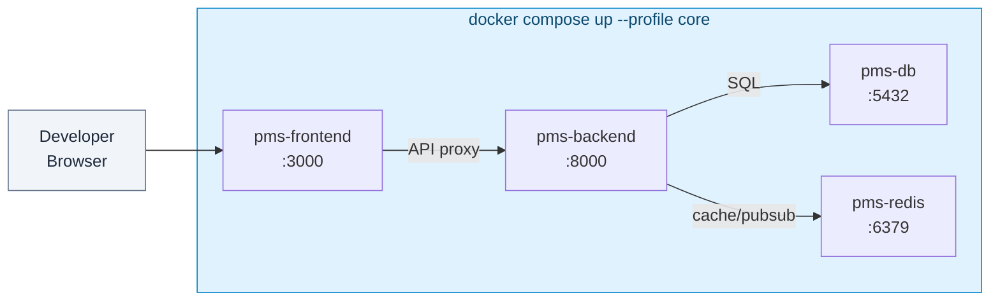

# Docker Setup Guide for PMS Integration

**Document ID:** PMS-EXP-DOCKER-001
**Version:** 1.0
**Date:** March 3, 2026
**Applies To:** PMS project (all platforms)
**Prerequisites Level:** Beginner

---

## Table of Contents

1. [Overview](#1-overview)
2. [Prerequisites](#2-prerequisites)
3. [Part A: Install and Configure Docker](#3-part-a-install-and-configure-docker)
4. [Part B: Integrate with PMS Backend](#4-part-b-integrate-with-pms-backend)
5. [Part C: Integrate with PMS Frontend](#5-part-c-integrate-with-pms-frontend)
6. [Part D: Testing and Verification](#6-part-d-testing-and-verification)
7. [Troubleshooting](#7-troubleshooting)
8. [Reference Commands](#8-reference-commands)

---

## 1. Overview

This guide walks you through containerizing the entire PMS stack using Docker and Docker Compose. By the end, you will have:

- A multi-stage Dockerfile for the FastAPI backend (< 200 MB image)
- A multi-stage Dockerfile for the Next.js frontend (< 150 MB image)
- A PostgreSQL container with encrypted persistent storage
- A Redis container for caching and WebSocket pub/sub
- A Docker Compose configuration with profiles for core services, Kafka, and AI models
- Custom bridge networks isolating PHI-processing services
- Docker secrets for HIPAA-compliant credential management
- Health checks ensuring proper startup ordering

### Architecture at a Glance



---

## 2. Prerequisites

### 2.1 Required Software

| Software | Minimum Version | Check Command |
|----------|----------------|---------------|
| Docker Engine | 24.0 | `docker --version` |
| Docker Compose | v2.24 | `docker compose version` |
| Git | 2.39 | `git --version` |
| Make (optional) | 3.81 | `make --version` |

### 2.2 Installation of Prerequisites

#### macOS

**Option A: Docker Desktop** (free for < 250 employees/$10M revenue)

```bash
# Install via Homebrew
brew install --cask docker

# Launch Docker Desktop from Applications
open -a Docker
```

**Option B: OrbStack** (free, faster I/O than Docker Desktop)

```bash
brew install --cask orbstack
```

**Option C: Colima** (free, open-source)

```bash
brew install colima docker docker-compose
colima start --cpu 4 --memory 8 --disk 60
```

#### Linux (Ubuntu/Debian)

```bash
# Remove old Docker packages
sudo apt-get remove docker docker-engine docker.io containerd runc

# Add Docker's official GPG key and repository
sudo apt-get update
sudo apt-get install ca-certificates curl
sudo install -m 0755 -d /etc/apt/keyrings
sudo curl -fsSL https://download.docker.com/linux/ubuntu/gpg -o /etc/apt/keyrings/docker.asc
sudo chmod a+r /etc/apt/keyrings/docker.asc

echo "deb [arch=$(dpkg --print-architecture) signed-by=/etc/apt/keyrings/docker.asc] \
  https://download.docker.com/linux/ubuntu $(. /etc/os-release && echo "$VERSION_CODENAME") stable" | \
  sudo tee /etc/apt/sources.list.d/docker.list > /dev/null

sudo apt-get update
sudo apt-get install docker-ce docker-ce-cli containerd.io docker-buildx-plugin docker-compose-plugin

# Add your user to the docker group (avoids sudo)
sudo usermod -aG docker $USER
newgrp docker
```

#### Windows

Install Docker Desktop from [docker.com/products/docker-desktop](https://www.docker.com/products/docker-desktop/) with WSL 2 backend enabled.

### 2.3 Verify PMS Services

Before containerizing, confirm you have the PMS source code:

```bash
# Clone the PMS repositories (if not already done)
cd ~/Projects
ls pms-backend pms-frontend  # Verify repos exist

# Check the docs repo
cd demo
ls docs/experiments/39-*  # This guide should exist
```

**Checkpoint**: Docker is installed and running. `docker run hello-world` succeeds.

---

## 3. Part A: Install and Configure Docker

### Step 1: Create the Project Docker Directory

```bash
cd ~/Projects/demo
mkdir -p docker/{backend,frontend,db,redis}
```

### Step 2: Create the Backend Dockerfile

Create `docker/backend/Dockerfile`:

```dockerfile
# ============================================
# Stage 1: Builder — install Python dependencies
# ============================================
FROM python:3.12-slim AS builder

WORKDIR /build

# Install build dependencies
RUN apt-get update && \
    apt-get install -y --no-install-recommends gcc libpq-dev && \
    rm -rf /var/lib/apt/lists/*

# Copy only requirements first (Docker layer caching)
COPY requirements.txt .
RUN pip install --no-cache-dir --prefix=/install -r requirements.txt

# ============================================
# Stage 2: Runtime — slim production image
# ============================================
FROM python:3.12-slim AS runtime

# Security: create non-root user
RUN groupadd -r pms && useradd -r -g pms -d /app -s /sbin/nologin pms

# Install only runtime system libraries
RUN apt-get update && \
    apt-get install -y --no-install-recommends libpq5 curl && \
    rm -rf /var/lib/apt/lists/*

# Copy installed Python packages from builder
COPY --from=builder /install /usr/local

WORKDIR /app

# Copy application code
COPY --chown=pms:pms . .

# Switch to non-root user
USER pms

# Health check — FastAPI /health endpoint
HEALTHCHECK --interval=30s --timeout=5s --start-period=10s --retries=3 \
    CMD curl -f http://localhost:8000/health || exit 1

EXPOSE 8000

# Run with uvicorn
CMD ["uvicorn", "app.main:app", "--host", "0.0.0.0", "--port", "8000", "--workers", "4"]
```

### Step 3: Create the Frontend Dockerfile

Create `docker/frontend/Dockerfile`:

```dockerfile
# ============================================
# Stage 1: Dependencies
# ============================================
FROM node:22-slim AS deps

WORKDIR /app
COPY package.json package-lock.json ./
RUN npm ci --only=production

# ============================================
# Stage 2: Builder
# ============================================
FROM node:22-slim AS builder

WORKDIR /app
COPY --from=deps /app/node_modules ./node_modules
COPY . .

# Build-time environment variables
ARG NEXT_PUBLIC_API_URL=http://pms-backend:8000
ENV NEXT_PUBLIC_API_URL=$NEXT_PUBLIC_API_URL

RUN npm run build

# ============================================
# Stage 3: Runtime
# ============================================
FROM node:22-slim AS runtime

# Security: create non-root user
RUN groupadd -r pms && useradd -r -g pms -d /app -s /sbin/nologin pms

WORKDIR /app

# Copy only production artifacts
COPY --from=builder --chown=pms:pms /app/.next/standalone ./
COPY --from=builder --chown=pms:pms /app/.next/static ./.next/static
COPY --from=builder --chown=pms:pms /app/public ./public

USER pms

HEALTHCHECK --interval=30s --timeout=5s --start-period=15s --retries=3 \
    CMD curl -f http://localhost:3000/ || exit 1

EXPOSE 3000

ENV PORT=3000
ENV HOSTNAME="0.0.0.0"

CMD ["node", "server.js"]
```

### Step 4: Create the PostgreSQL Initialization Script

Create `docker/db/init.sql`:

```sql
-- PMS Database Initialization
-- This runs on first container startup only

-- Enable required extensions
CREATE EXTENSION IF NOT EXISTS "uuid-ossp";
CREATE EXTENSION IF NOT EXISTS "pgcrypto";
CREATE EXTENSION IF NOT EXISTS "vector";  -- pgvector for AI similarity search

-- Create application schema
CREATE SCHEMA IF NOT EXISTS pms;

-- Set search path
ALTER DATABASE pms SET search_path TO pms, public;

-- Create audit log table for HIPAA compliance
CREATE TABLE IF NOT EXISTS pms.audit_log (
    id UUID PRIMARY KEY DEFAULT uuid_generate_v4(),
    timestamp TIMESTAMPTZ NOT NULL DEFAULT NOW(),
    user_id UUID,
    action VARCHAR(50) NOT NULL,
    resource_type VARCHAR(100) NOT NULL,
    resource_id UUID,
    details JSONB,
    ip_address INET,
    user_agent TEXT
);

CREATE INDEX idx_audit_log_timestamp ON pms.audit_log (timestamp DESC);
CREATE INDEX idx_audit_log_user ON pms.audit_log (user_id, timestamp DESC);

-- Grant permissions
GRANT ALL PRIVILEGES ON SCHEMA pms TO pms_user;
GRANT ALL PRIVILEGES ON ALL TABLES IN SCHEMA pms TO pms_user;
ALTER DEFAULT PRIVILEGES IN SCHEMA pms GRANT ALL ON TABLES TO pms_user;
```

### Step 5: Create Docker Compose Configuration

Create `docker-compose.yml` in the project root:

```yaml
# PMS Docker Compose Configuration
# Usage:
#   docker compose --profile core up          # Backend + Frontend + DB + Redis
#   docker compose --profile core --profile kafka up   # + Kafka stack
#   docker compose --profile core --profile ai up      # + AI models
#   docker compose up                         # All profiles

name: pms

# ── Secrets (HIPAA: never use env vars for credentials) ──
secrets:
  db_password:
    file: ./secrets/db_password.txt
  db_root_password:
    file: ./secrets/db_root_password.txt
  redis_password:
    file: ./secrets/redis_password.txt
  jwt_secret:
    file: ./secrets/jwt_secret.txt

# ── Named Volumes ──
volumes:
  pms-db-data:
    driver: local
  pms-redis-data:
    driver: local
  pms-kafka-data-1:
    driver: local
  pms-kafka-data-2:
    driver: local
  pms-ai-models:
    driver: local

# ── Networks (isolated by concern) ──
networks:
  pms-network:
    driver: bridge
    ipam:
      config:
        - subnet: 172.28.0.0/16
  pms-kafka-network:
    driver: bridge
    internal: true  # No external access
  pms-ai-network:
    driver: bridge
    internal: true  # No external access

# ── Services ──
services:

  # ── Core Profile ──

  pms-db:
    image: postgres:16-bookworm
    profiles: ["core"]
    container_name: pms-db
    restart: unless-stopped
    environment:
      POSTGRES_DB: pms
      POSTGRES_USER: pms_user
      POSTGRES_PASSWORD_FILE: /run/secrets/db_password
    secrets:
      - db_password
    volumes:
      - pms-db-data:/var/lib/postgresql/data
      - ./docker/db/init.sql:/docker-entrypoint-initdb.d/01-init.sql:ro
    ports:
      - "5432:5432"
    networks:
      - pms-network
    healthcheck:
      test: ["CMD-SHELL", "pg_isready -U pms_user -d pms"]
      interval: 10s
      timeout: 5s
      retries: 5
      start_period: 30s
    deploy:
      resources:
        limits:
          memory: 1G
          cpus: "1.0"
    security_opt:
      - no-new-privileges:true

  pms-redis:
    image: redis:7-alpine
    profiles: ["core"]
    container_name: pms-redis
    restart: unless-stopped
    command: >
      redis-server
      --requirepass /run/secrets/redis_password
      --maxmemory 256mb
      --maxmemory-policy allkeys-lru
      --appendonly yes
      --appendfsync everysec
    secrets:
      - redis_password
    volumes:
      - pms-redis-data:/data
    ports:
      - "6379:6379"
    networks:
      - pms-network
    healthcheck:
      test: ["CMD", "redis-cli", "ping"]
      interval: 10s
      timeout: 5s
      retries: 5
    deploy:
      resources:
        limits:
          memory: 512M
          cpus: "0.5"
    security_opt:
      - no-new-privileges:true

  pms-backend:
    build:
      context: ../pms-backend
      dockerfile: ../demo/docker/backend/Dockerfile
    profiles: ["core"]
    container_name: pms-backend
    restart: unless-stopped
    environment:
      DATABASE_URL: postgresql+asyncpg://pms_user@pms-db:5432/pms
      REDIS_URL: redis://pms-redis:6379/0
      ENVIRONMENT: development
    secrets:
      - db_password
      - jwt_secret
    ports:
      - "8000:8000"
    networks:
      - pms-network
      - pms-kafka-network
      - pms-ai-network
    depends_on:
      pms-db:
        condition: service_healthy
      pms-redis:
        condition: service_healthy
    healthcheck:
      test: ["CMD", "curl", "-f", "http://localhost:8000/health"]
      interval: 30s
      timeout: 5s
      retries: 3
      start_period: 15s
    deploy:
      resources:
        limits:
          memory: 512M
          cpus: "1.0"
    security_opt:
      - no-new-privileges:true

  pms-frontend:
    build:
      context: ../pms-frontend
      dockerfile: ../demo/docker/frontend/Dockerfile
      args:
        NEXT_PUBLIC_API_URL: http://pms-backend:8000
    profiles: ["core"]
    container_name: pms-frontend
    restart: unless-stopped
    environment:
      NEXT_PUBLIC_API_URL: http://pms-backend:8000
    ports:
      - "3000:3000"
    networks:
      - pms-network
    depends_on:
      pms-backend:
        condition: service_healthy
    healthcheck:
      test: ["CMD", "curl", "-f", "http://localhost:3000/"]
      interval: 30s
      timeout: 5s
      retries: 3
      start_period: 20s
    deploy:
      resources:
        limits:
          memory: 256M
          cpus: "0.5"
    security_opt:
      - no-new-privileges:true

  # ── Kafka Profile ──

  pms-kafka-1:
    image: confluentinc/cp-kafka:7.7.1
    profiles: ["kafka"]
    container_name: pms-kafka-1
    restart: unless-stopped
    environment:
      KAFKA_NODE_ID: 1
      KAFKA_PROCESS_ROLES: broker,controller
      KAFKA_LISTENERS: PLAINTEXT://0.0.0.0:9092,CONTROLLER://0.0.0.0:9093
      KAFKA_ADVERTISED_LISTENERS: PLAINTEXT://pms-kafka-1:9092
      KAFKA_CONTROLLER_QUORUM_VOTERS: 1@pms-kafka-1:9093,2@pms-kafka-2:9093
      KAFKA_CONTROLLER_LISTENER_NAMES: CONTROLLER
      KAFKA_INTER_BROKER_LISTENER_NAME: PLAINTEXT
      CLUSTER_ID: pms-kafka-cluster-001
      KAFKA_LOG_RETENTION_HOURS: 168
      KAFKA_AUTO_CREATE_TOPICS_ENABLE: "false"
    volumes:
      - pms-kafka-data-1:/var/lib/kafka/data
    ports:
      - "9092:9092"
    networks:
      - pms-kafka-network
      - pms-network
    healthcheck:
      test: ["CMD-SHELL", "kafka-broker-api-versions --bootstrap-server localhost:9092"]
      interval: 30s
      timeout: 10s
      retries: 5
      start_period: 60s
    deploy:
      resources:
        limits:
          memory: 1G
          cpus: "1.0"

  pms-kafka-2:
    image: confluentinc/cp-kafka:7.7.1
    profiles: ["kafka"]
    container_name: pms-kafka-2
    restart: unless-stopped
    environment:
      KAFKA_NODE_ID: 2
      KAFKA_PROCESS_ROLES: broker,controller
      KAFKA_LISTENERS: PLAINTEXT://0.0.0.0:9092,CONTROLLER://0.0.0.0:9093
      KAFKA_ADVERTISED_LISTENERS: PLAINTEXT://pms-kafka-2:9092
      KAFKA_CONTROLLER_QUORUM_VOTERS: 1@pms-kafka-1:9093,2@pms-kafka-2:9093
      KAFKA_CONTROLLER_LISTENER_NAMES: CONTROLLER
      KAFKA_INTER_BROKER_LISTENER_NAME: PLAINTEXT
      CLUSTER_ID: pms-kafka-cluster-001
    volumes:
      - pms-kafka-data-2:/var/lib/kafka/data
    networks:
      - pms-kafka-network
    deploy:
      resources:
        limits:
          memory: 1G
          cpus: "1.0"

  # ── AI Profile ──

  pms-gemma:
    image: ollama/ollama:latest
    profiles: ["ai"]
    container_name: pms-gemma
    restart: unless-stopped
    volumes:
      - pms-ai-models:/root/.ollama
    ports:
      - "11434:11434"
    networks:
      - pms-ai-network
    deploy:
      resources:
        limits:
          memory: 8G
        reservations:
          devices:
            - driver: nvidia
              count: all
              capabilities: [gpu]

# ── Development Overrides (docker-compose.override.yml) ──
# Automatically loaded by Docker Compose in development.
# Create this file for hot-reload bind mounts:
#
#   services:
#     pms-backend:
#       volumes:
#         - ../pms-backend:/app
#       command: uvicorn app.main:app --host 0.0.0.0 --port 8000 --reload
#     pms-frontend:
#       volumes:
#         - ../pms-frontend:/app
#         - /app/node_modules
#       command: npm run dev
```

### Step 6: Create Docker Secrets

```bash
# Create secrets directory (NEVER commit this to git)
mkdir -p secrets
echo "secrets/" >> .gitignore

# Generate secure passwords
openssl rand -base64 32 > secrets/db_password.txt
openssl rand -base64 32 > secrets/db_root_password.txt
openssl rand -base64 32 > secrets/redis_password.txt
openssl rand -base64 64 > secrets/jwt_secret.txt

# Verify secrets exist
ls -la secrets/
```

### Step 7: Create .dockerignore Files

Create `docker/backend/.dockerignore`:

```
__pycache__
*.pyc
*.pyo
.env
.env.*
.venv
venv
.git
.gitignore
*.md
tests/
.pytest_cache/
.mypy_cache/
.coverage
htmlcov/
```

Create `docker/frontend/.dockerignore`:

```
node_modules
.next
.env
.env.*
.git
.gitignore
*.md
tests/
coverage/
.turbo
```

### Step 8: Start the PMS Stack

```bash
# Start core services (backend + frontend + db + redis)
docker compose --profile core up -d

# Watch the startup logs
docker compose --profile core logs -f

# Wait for health checks (all should show "healthy")
docker compose --profile core ps
```

**Checkpoint**: All four core containers are running and healthy. `docker compose --profile core ps` shows `healthy` status for each service. Visiting `http://localhost:3000` shows the PMS frontend, and `http://localhost:8000/docs` shows the FastAPI Swagger UI.

---

## 4. Part B: Integrate with PMS Backend

### Step 1: Configure Backend to Read Docker Secrets

Update the FastAPI settings to read credentials from Docker secrets files:

```python
# app/core/config.py
import os
from pathlib import Path
from pydantic_settings import BaseSettings


def _read_secret(name: str, default: str = "") -> str:
    """Read a Docker secret from /run/secrets/{name}."""
    secret_path = Path(f"/run/secrets/{name}")
    if secret_path.exists():
        return secret_path.read_text().strip()
    return os.getenv(name.upper(), default)


class Settings(BaseSettings):
    # Database
    database_url: str = os.getenv(
        "DATABASE_URL",
        "postgresql+asyncpg://pms_user@localhost:5432/pms"
    )
    db_password: str = _read_secret("db_password", "dev_password")

    # Redis
    redis_url: str = os.getenv("REDIS_URL", "redis://localhost:6379/0")
    redis_password: str = _read_secret("redis_password", "")

    # JWT
    jwt_secret: str = _read_secret("jwt_secret", "dev_secret_change_me")
    jwt_algorithm: str = "HS256"
    jwt_expire_minutes: int = 30

    # Environment
    environment: str = os.getenv("ENVIRONMENT", "development")
    debug: bool = environment == "development"

    @property
    def async_database_url(self) -> str:
        """Build the full database URL with password."""
        if self.db_password and "@" in self.database_url:
            # Insert password into URL: user@host -> user:password@host
            parts = self.database_url.split("@", 1)
            return f"{parts[0]}:{self.db_password}@{parts[1]}"
        return self.database_url


settings = Settings()
```

### Step 2: Add Health Check Endpoint

```python
# app/api/health.py
from fastapi import APIRouter, Depends
from sqlalchemy.ext.asyncio import AsyncSession
from app.core.database import get_db
import redis.asyncio as aioredis
from app.core.config import settings

router = APIRouter()


@router.get("/health")
async def health_check(db: AsyncSession = Depends(get_db)):
    """Health check endpoint for Docker HEALTHCHECK."""
    checks = {"status": "healthy", "services": {}}

    # Check database
    try:
        await db.execute("SELECT 1")
        checks["services"]["database"] = "connected"
    except Exception as e:
        checks["status"] = "unhealthy"
        checks["services"]["database"] = f"error: {str(e)}"

    # Check Redis
    try:
        r = aioredis.from_url(settings.redis_url)
        await r.ping()
        checks["services"]["redis"] = "connected"
        await r.aclose()
    except Exception as e:
        checks["services"]["redis"] = f"error: {str(e)}"

    status_code = 200 if checks["status"] == "healthy" else 503
    return checks
```

### Step 3: Configure Database Migrations for Containers

```python
# alembic/env.py — Docker-aware configuration
import os
from app.core.config import settings

# Use the Docker-aware database URL
config.set_main_option("sqlalchemy.url", settings.async_database_url)
```

Run migrations inside the container:

```bash
# Run Alembic migrations
docker compose exec pms-backend alembic upgrade head

# Verify migration
docker compose exec pms-db psql -U pms_user -d pms -c "\dt pms.*"
```

**Checkpoint**: Backend container reads credentials from Docker secrets (not environment variables). The `/health` endpoint returns `{"status": "healthy"}` with both database and Redis connected.

---

## 5. Part C: Integrate with PMS Frontend

### Step 1: Configure Next.js for Container Deployment

Update `next.config.js` for standalone output (required for Docker):

```javascript
// next.config.js
/** @type {import('next').NextConfig} */
const nextConfig = {
  output: 'standalone',  // Required for Docker deployment

  // API proxy to backend container
  async rewrites() {
    return [
      {
        source: '/api/:path*',
        destination: `${process.env.NEXT_PUBLIC_API_URL || 'http://localhost:8000'}/api/:path*`,
      },
    ];
  },

  // WebSocket proxy support
  async headers() {
    return [
      {
        source: '/ws/:path*',
        headers: [
          { key: 'Connection', value: 'Upgrade' },
          { key: 'Upgrade', value: 'websocket' },
        ],
      },
    ];
  },
};

module.exports = nextConfig;
```

### Step 2: Create Environment-Aware API Client

```typescript
// lib/api-client.ts
const API_BASE_URL = process.env.NEXT_PUBLIC_API_URL || 'http://localhost:8000';

// Server-side: use Docker internal network hostname
// Client-side: use relative URLs (proxied by Next.js)
const getBaseUrl = () => {
  if (typeof window === 'undefined') {
    // Server-side rendering — use Docker service name
    return API_BASE_URL;
  }
  // Client-side — use relative URL (proxied)
  return '';
};

export async function apiClient<T>(
  endpoint: string,
  options?: RequestInit
): Promise<T> {
  const url = `${getBaseUrl()}/api${endpoint}`;
  const response = await fetch(url, {
    ...options,
    headers: {
      'Content-Type': 'application/json',
      ...options?.headers,
    },
  });

  if (!response.ok) {
    throw new Error(`API error: ${response.status} ${response.statusText}`);
  }

  return response.json();
}
```

### Step 3: Development Override for Hot Reload

Create `docker-compose.override.yml` (auto-loaded in development):

```yaml
services:
  pms-backend:
    build:
      target: runtime
    volumes:
      - ../pms-backend:/app
    command: uvicorn app.main:app --host 0.0.0.0 --port 8000 --reload
    environment:
      ENVIRONMENT: development

  pms-frontend:
    volumes:
      - ../pms-frontend:/app
      - /app/node_modules  # Prevent overwriting container's node_modules
      - /app/.next          # Prevent overwriting container's build cache
    command: npm run dev
    environment:
      NODE_ENV: development
```

**Checkpoint**: Frontend container proxies API requests to the backend container via Docker's internal DNS. Hot reload works in development via bind mounts. `http://localhost:3000` renders the PMS UI with live data from the containerized backend.

---

## 6. Part D: Testing and Verification

### Step 1: Verify All Services Are Healthy

```bash
# Check container status and health
docker compose --profile core ps

# Expected output:
# NAME            SERVICE        STATUS         PORTS
# pms-backend     pms-backend    Up (healthy)   0.0.0.0:8000->8000/tcp
# pms-frontend    pms-frontend   Up (healthy)   0.0.0.0:3000->3000/tcp
# pms-db          pms-db         Up (healthy)   0.0.0.0:5432->5432/tcp
# pms-redis       pms-redis      Up (healthy)   0.0.0.0:6379->6379/tcp
```

### Step 2: Test Backend Health Endpoint

```bash
curl -s http://localhost:8000/health | python3 -m json.tool

# Expected output:
# {
#     "status": "healthy",
#     "services": {
#         "database": "connected",
#         "redis": "connected"
#     }
# }
```

### Step 3: Test Database Connectivity

```bash
# Connect to PostgreSQL inside the container
docker compose exec pms-db psql -U pms_user -d pms -c "SELECT version();"

# Check extensions are loaded
docker compose exec pms-db psql -U pms_user -d pms -c "SELECT extname FROM pg_extension;"
```

### Step 4: Test Redis Connectivity

```bash
# Ping Redis
docker compose exec pms-redis redis-cli ping
# Expected: PONG

# Check memory usage
docker compose exec pms-redis redis-cli info memory | grep used_memory_human
```

### Step 5: Test Network Isolation

```bash
# Verify containers on pms-network can communicate
docker compose exec pms-backend curl -s http://pms-db:5432 2>&1 | head -1
# Expected: some response (connection works)

# Verify AI network is internal (no external access)
docker network inspect pms-ai-network | grep -i internal
# Expected: "Internal": true
```

### Step 6: Test Frontend-to-Backend Communication

```bash
# Test API proxy from frontend
curl -s http://localhost:3000/api/health | python3 -m json.tool

# Expected: same health response proxied through Next.js
```

### Step 7: Integration Test — Create and Retrieve a Patient

```bash
# Create a patient via the API
curl -s -X POST http://localhost:8000/api/patients \
  -H "Content-Type: application/json" \
  -H "Authorization: Bearer $TOKEN" \
  -d '{
    "first_name": "Docker",
    "last_name": "TestPatient",
    "date_of_birth": "1990-01-15",
    "mrn": "MRN-DOCKER-001"
  }' | python3 -m json.tool

# Retrieve the patient
curl -s http://localhost:8000/api/patients?mrn=MRN-DOCKER-001 \
  -H "Authorization: Bearer $TOKEN" | python3 -m json.tool
```

**Checkpoint**: All services healthy, database connected with extensions, Redis responsive, network isolation verified, frontend proxying to backend, and full CRUD operations working through containers.

---

## 7. Troubleshooting

### Container Fails to Start — Port Already in Use

**Symptoms**: `Error starting userland proxy: listen tcp4 0.0.0.0:5432: bind: address already in use`

**Solution**:
```bash
# Find what's using the port
lsof -i :5432

# Option 1: Stop the local service
brew services stop postgresql  # macOS
sudo systemctl stop postgresql  # Linux

# Option 2: Change the host port mapping in docker-compose.yml
# ports: "5433:5432" instead of "5432:5432"
```

### Backend Can't Connect to Database

**Symptoms**: `connection refused` or `could not connect to server`

**Solution**:
```bash
# Check if database is healthy
docker compose --profile core ps pms-db

# Check database logs
docker compose --profile core logs pms-db

# Verify the backend can resolve the hostname
docker compose exec pms-backend ping -c 1 pms-db

# Common cause: backend started before DB was ready
# Fix: ensure depends_on with health check condition is set
```

### Docker Desktop Slow on macOS (I/O Performance)

**Symptoms**: File operations, npm install, pip install take 5-10x longer than native

**Solution**:
```bash
# Option 1: Use named volumes instead of bind mounts for node_modules
# (already done in docker-compose.override.yml)

# Option 2: Switch to OrbStack (native file system speed)
brew install --cask orbstack

# Option 3: Use Docker Compose watch mode (v2.22+)
docker compose --profile core watch
```

### Out of Disk Space

**Symptoms**: `no space left on device` during build or pull

**Solution**:
```bash
# Check Docker disk usage
docker system df

# Remove unused containers, images, networks, and build cache
docker system prune -a --volumes

# Remove only dangling images
docker image prune

# Remove only stopped containers
docker container prune
```

### Secrets Not Available in Container

**Symptoms**: Application reads empty or default values instead of secrets

**Solution**:
```bash
# Verify secrets exist on disk
ls -la secrets/

# Verify secrets are mounted in the container
docker compose exec pms-backend ls /run/secrets/

# Verify the secret value (careful with PHI!)
docker compose exec pms-backend cat /run/secrets/db_password

# Common cause: secrets file has trailing newline
# Fix: use `echo -n` or `printf` when creating secrets
printf '%s' "$(openssl rand -base64 32)" > secrets/db_password.txt
```

### Container Can't Pull Images (Network/Auth Issues)

**Symptoms**: `error pulling image configuration` or `dial tcp: lookup registry-1.docker.io`

**Solution**:
```bash
# Check Docker Hub login
docker login

# Check network connectivity
docker run --rm alpine ping -c 1 registry-1.docker.io

# If behind corporate proxy, configure Docker daemon proxy:
# ~/.docker/config.json or Docker Desktop settings
```

---

## 8. Reference Commands

### Daily Development Workflow

```bash
# Start the full stack
docker compose --profile core up -d

# Start with Kafka
docker compose --profile core --profile kafka up -d

# View logs (follow mode)
docker compose --profile core logs -f pms-backend

# Rebuild after code changes (with cache)
docker compose --profile core build pms-backend
docker compose --profile core up -d pms-backend

# Force rebuild without cache
docker compose --profile core build --no-cache pms-backend

# Stop all services (preserve data)
docker compose --profile core down

# Stop and remove volumes (DESTROYS DATA)
docker compose --profile core down -v
```

### Management Commands

```bash
# Run database migrations
docker compose exec pms-backend alembic upgrade head

# Open a Python shell in the backend
docker compose exec pms-backend python

# Open a PostgreSQL shell
docker compose exec pms-db psql -U pms_user -d pms

# Open a Redis CLI
docker compose exec pms-redis redis-cli

# Run backend tests
docker compose exec pms-backend pytest

# Run frontend tests
docker compose exec pms-frontend npm test
```

### Monitoring Commands

```bash
# Container resource usage (live)
docker stats

# Container health status
docker compose --profile core ps

# View container logs (last 100 lines)
docker compose logs --tail=100 pms-backend

# Inspect a container's configuration
docker inspect pms-backend

# Check network connectivity
docker network inspect pms-network
```

### Useful URLs

| Service | URL | Description |
|---------|-----|-------------|
| PMS Frontend | http://localhost:3000 | Next.js web application |
| PMS Backend API | http://localhost:8000 | FastAPI REST API |
| Swagger UI | http://localhost:8000/docs | Interactive API documentation |
| Health Check | http://localhost:8000/health | Service health status |
| PostgreSQL | localhost:5432 | Database (via psql or GUI tool) |
| Redis | localhost:6379 | Cache (via redis-cli or GUI tool) |
| Kafka Broker | localhost:9092 | Event streaming (kafka profile) |
| Ollama API | localhost:11434 | AI model inference (ai profile) |

---

## Next Steps

1. Complete the [Docker Developer Tutorial](39-Docker-Developer-Tutorial.md) to build a containerized patient data pipeline end-to-end
2. Add the [Kafka profile services](38-Kafka-PMS-Developer-Setup-Guide.md) for event streaming
3. Configure [WebSocket support](37-WebSocket-PMS-Developer-Setup-Guide.md) with Redis pub/sub in Docker
4. Set up CI/CD pipeline with Docker image building and scanning
5. Explore production hardening with read-only filesystems and seccomp profiles

---

## Resources

- [Docker Official Documentation](https://docs.docker.com/)
- [Docker Compose Reference](https://docs.docker.com/compose/compose-file/)
- [FastAPI Docker Deployment](https://fastapi.tiangolo.com/deployment/docker/)
- [Docker Security Best Practices](https://docs.docker.com/build/building/best-practices/)
- [HIPAA-Compliant Docker Host](https://www.atlantic.net/hipaa-compliant-hosting/best-practices-for-creating-a-hipaa-compliant-docker-host/)
- [Docker GitHub Repository](https://github.com/moby/moby)
- [PMS PRD: Docker Integration](39-PRD-Docker-PMS-Integration.md)
- [PMS Docker Developer Tutorial](39-Docker-Developer-Tutorial.md)
