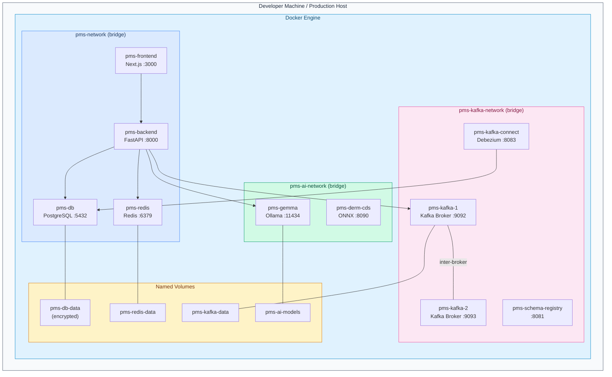

# Product Requirements Document: Docker Containerization for Patient Management System (PMS)

**Document ID:** PRD-PMS-DOCKER-001
**Version:** 1.0
**Date:** March 3, 2026
**Author:** Ammar (CEO, MPS Inc.)
**Status:** Draft

---

## 1. Executive Summary

Docker is the industry-standard container platform that packages applications and their dependencies into portable, isolated units called containers. Built on Linux namespaces and cgroups, Docker provides OS-level virtualization that enables consistent development, testing, and deployment across any environment. Docker Compose extends this to multi-container applications, allowing entire service stacks to be defined in a single YAML file and launched with one command.

For the PMS, Docker containerization addresses a critical operational gap: the lack of a unified, reproducible environment across development, testing, staging, and production. Today, each PMS service — FastAPI backend, Next.js frontend, PostgreSQL database, and the growing portfolio of experiment integrations (Kafka, Redis, AI model servers, WebSocket brokers) — must be individually installed and configured on each developer's machine. This leads to environment drift, onboarding friction, and "works on my machine" failures that slow clinical feature delivery.

By containerizing every PMS service with Docker and orchestrating them via Docker Compose, we achieve: one-command environment setup (`docker compose up`), guaranteed parity between development and production, HIPAA-compliant network isolation between services processing PHI, encrypted volume management for persistent data, and a foundation for future Kubernetes deployment. Docker is the infrastructure backbone that every other PMS experiment — from Kafka event streaming to AI model inference — depends on for consistent deployment.

## 2. Problem Statement

The PMS faces several infrastructure challenges that Docker directly addresses:

1. **Environment Inconsistency**: Developers on macOS, Linux, and Windows produce subtly different runtime behaviors due to OS-level differences in Python, Node.js, and PostgreSQL installations. This causes test failures that only appear in CI/CD or production.

2. **Onboarding Friction**: New developers must install Python 3.12+, Node.js 22+, PostgreSQL 16+, Redis, and potentially Kafka, Schema Registry, and AI model runtimes. Setup routinely takes 1–2 days with manual troubleshooting.

3. **Service Orchestration Complexity**: The PMS now spans 5+ services (backend, frontend, database, Redis, Kafka, AI inference) with interdependencies. Starting them in the correct order with proper networking requires tribal knowledge.

4. **PHI Security Gaps**: Without container-level network isolation, all services on a developer machine share the same network namespace. There is no enforcement of least-privilege network access between services processing protected health information (PHI).

5. **Experiment Deployment Chaos**: Each new experiment (37-WebSocket, 38-Kafka, 35-Kintsugi, etc.) introduces its own infrastructure requirements. Without containerization, these accumulate as ad-hoc installations that conflict with each other.

6. **Production Parity**: The gap between local development and production deployment grows with each new service, making it harder to reproduce and debug production issues.

## 3. Proposed Solution

### 3.1 Architecture Overview

### 3.2 Deployment Model

**Self-Hosted Containerization** using Docker Engine and Docker Compose:

- **Development**: Docker Desktop (macOS/Windows) or Docker Engine (Linux) running all services locally via `docker compose up`. Developers never install Python, Node.js, or PostgreSQL directly.
- **CI/CD**: GitHub Actions with Docker-in-Docker or Docker Compose services for integration testing.
- **Staging/Production**: Docker Compose on dedicated servers, with future migration path to Kubernetes (K8s) when scale demands it.
- **HIPAA Security Envelope**: Network isolation via custom bridge networks, Docker secrets for credentials (never environment variables for PHI), encrypted volumes for PostgreSQL data at rest, non-root container execution, and read-only filesystems where possible.

## 4. PMS Data Sources

Docker containerization wraps all existing PMS APIs — it does not introduce new data flows, but it secures and isolates the existing ones:

| PMS API | Container | Docker-Specific Considerations |
|---------|-----------|-------------------------------|
| Patient Records API (`/api/patients`) | `pms-backend` | PHI in transit encrypted via internal TLS; database connection over isolated bridge network |
| Encounter Records API (`/api/encounters`) | `pms-backend` | Session state managed via Redis container with encrypted persistence |
| Medication & Prescription API (`/api/prescriptions`) | `pms-backend` | Drug interaction checks route to `pms-gemma` AI container over separate AI network |
| Reporting API (`/api/reports`) | `pms-backend` | Report generation may require cross-network access to Kafka consumer containers |
| PostgreSQL Database | `pms-db` | Data persisted on encrypted named volume; backups via `pg_dump` in sidecar container |
| Kafka Event Streams | `pms-kafka-1/2` | Isolated on dedicated bridge network; only `pms-backend` and `pms-kafka-connect` bridged |

## 5. Component/Module Definitions

### 5.1 PMS Backend Container (`pms-backend`)

- **Description**: Multi-stage Docker image for the FastAPI application with Uvicorn ASGI server
- **Base Image**: `python:3.12-slim` (multi-stage: builder + runtime)
- **Input**: HTTP requests on port 8000, Kafka consumer events, Redis pub/sub messages
- **Output**: JSON API responses, Kafka producer events, WebSocket messages
- **PMS APIs**: All (`/api/patients`, `/api/encounters`, `/api/prescriptions`, `/api/reports`)
- **Key Features**: Non-root user execution, health check endpoint (`/health`), graceful shutdown handling, dependency injection of secrets from `/run/secrets/`

### 5.2 PMS Frontend Container (`pms-frontend`)

- **Description**: Multi-stage Docker image — Node.js builder stage + Nginx/standalone Next.js runtime
- **Base Image**: `node:22-slim` (builder) + `node:22-slim` (runtime) or `nginx:alpine` (static export)
- **Input**: Browser requests on port 3000
- **Output**: Server-rendered HTML, API proxy to backend
- **PMS APIs**: Proxies all backend APIs via Next.js API routes or direct fetch
- **Key Features**: Build-time environment variable injection, static asset caching, WebSocket proxy support

### 5.3 PMS Database Container (`pms-db`)

- **Description**: PostgreSQL 16 with extensions (pgvector, pg_cron) on encrypted named volume
- **Base Image**: `postgres:16-bookworm` with custom initialization scripts
- **Input**: SQL queries from `pms-backend` on port 5432
- **Output**: Query results, LISTEN/NOTIFY events for WebSocket integration
- **PMS APIs**: Backing store for all APIs
- **Key Features**: Custom `initdb.d/` scripts for schema creation, WAL archiving for point-in-time recovery, SCRAM-SHA-256 authentication, SSL client certificates

### 5.4 PMS Redis Container (`pms-redis`)

- **Description**: Redis 7 for caching, session storage, pub/sub, and WebSocket connection state
- **Base Image**: `redis:7-alpine` with custom `redis.conf`
- **Input**: Redis protocol on port 6379
- **Output**: Cached responses, pub/sub messages
- **Key Features**: `maxmemory` policy for bounded resource usage, AOF persistence, ACL-based authentication, TLS support

### 5.5 Docker Compose Orchestrator (`docker-compose.yml`)

- **Description**: Multi-file Compose configuration using profiles for service grouping
- **Profiles**: `core` (backend + frontend + db + redis), `kafka` (Kafka cluster + Schema Registry + Connect), `ai` (Ollama + CDS), `monitoring` (Prometheus + Grafana)
- **Key Features**: Health check dependencies (`depends_on` with `condition: service_healthy`), named volumes with driver options, multi-network isolation, environment-specific overrides (`docker-compose.override.yml`, `docker-compose.prod.yml`)

### 5.6 HIPAA Compliance Module

- **Description**: Cross-cutting security configurations applied to all containers
- **Components**: Docker secrets for database passwords, API keys, and encryption keys; network policies limiting inter-container communication; read-only root filesystems with tmpfs for write paths; security-opt configurations (no-new-privileges, seccomp profiles); audit logging via centralized log driver
- **Key Features**: PHI never stored in Docker images or environment variables; all persistent data on encrypted volumes; container-level resource limits (CPU, memory) preventing DoS

## 6. Non-Functional Requirements

### 6.1 Security and HIPAA Compliance

| Requirement | Implementation |
|-------------|---------------|
| **PHI Encryption at Rest** | PostgreSQL data volume encrypted via LUKS (host-level) or Docker volume driver with encryption; Redis AOF on encrypted volume |
| **PHI Encryption in Transit** | Internal TLS between containers on bridge networks; mTLS for production database connections |
| **Access Control** | Docker secrets mounted as files in `/run/secrets/`; SCRAM-SHA-256 for PostgreSQL; ACL for Redis; no root containers |
| **Audit Logging** | Centralized logging via Docker `json-file` or `fluentd` log driver; all API access logged with request ID |
| **Network Isolation** | Separate bridge networks for PMS core, Kafka, and AI services; only explicitly bridged containers can cross networks |
| **Image Security** | Multi-stage builds exclude dev dependencies; base images pinned to specific digests; vulnerability scanning via `docker scout` |
| **Session Timeout** | Application-level JWT expiry (30 min); Redis session TTL enforcement |
| **Breach Response** | Container forensics via `docker logs`, `docker inspect`; immutable image layers for post-incident analysis |

### 6.2 Performance

| Metric | Target |
|--------|--------|
| Container startup time (full stack) | < 30 seconds |
| API response latency (container vs bare-metal) | < 5% overhead |
| Image size (backend) | < 200 MB (multi-stage slim) |
| Image size (frontend) | < 150 MB (multi-stage) |
| Database volume I/O | Native-speed via bind mount or named volume |
| Memory per container (backend) | < 512 MB limit |
| Memory per container (frontend) | < 256 MB limit |

### 6.3 Infrastructure

| Component | Requirement |
|-----------|-------------|
| Docker Engine | 24.0+ (BuildKit enabled by default) |
| Docker Compose | v2.24+ (profiles, watch mode, GPU support) |
| Host OS | Linux (production), macOS/Windows (development via Docker Desktop) |
| Host RAM | 16 GB minimum (full stack with Kafka + AI) |
| Host Disk | 50 GB free (images, volumes, build cache) |
| GPU (optional) | NVIDIA GPU for AI containers via `nvidia-container-toolkit` |

## 7. Implementation Phases

### Phase 1 — Foundation (Sprints 1–2, Weeks 1–4)

- Create Dockerfiles for `pms-backend`, `pms-frontend`, `pms-db`
- Create base `docker-compose.yml` with `core` profile
- Implement multi-stage builds for backend (Python) and frontend (Node.js)
- Configure health checks for all containers
- Set up Docker secrets for database credentials
- Create custom bridge network with proper isolation
- Write `.dockerignore` files to exclude PHI, `.env`, and build artifacts
- **Deliverable**: `docker compose --profile core up` starts full PMS stack

### Phase 2 — Extended Services (Sprints 3–4, Weeks 5–8)

- Add `kafka` profile: Kafka brokers, Schema Registry, Kafka Connect (Debezium)
- Add `ai` profile: Ollama (Gemma 3), DermaCheck CDS service
- Add `redis` container with ACL and TLS configuration
- Implement Docker Compose watch mode for hot-reload development
- Create `docker-compose.prod.yml` with production-specific overrides (no port exposure, resource limits, restart policies)
- Configure multi-network isolation (pms-network, pms-kafka-network, pms-ai-network)
- **Deliverable**: Full experiment stack runs containerized with proper isolation

### Phase 3 — Production Hardening (Sprints 5–6, Weeks 9–12)

- Add `monitoring` profile: Prometheus, Grafana, cAdvisor
- Implement automated backup/restore for PostgreSQL volumes
- Create CI/CD pipeline: build images → scan → test → push to registry → deploy
- Write Kubernetes migration manifests (Helm charts) for future scaling
- Implement log aggregation via Fluentd/ELK
- Security hardening: read-only filesystems, seccomp profiles, vulnerability scanning in CI
- **Deliverable**: Production-ready containerized deployment with monitoring and CI/CD

## 8. Success Metrics

| Metric | Target | Measurement Method |
|--------|--------|--------------------|
| Developer onboarding time | < 30 minutes (from clone to running stack) | Time from `git clone` to successful API response |
| Environment consistency | 0 "works on my machine" bugs per sprint | Bug tracker tag analysis |
| Full stack startup time | < 60 seconds (first run), < 15 seconds (cached) | `time docker compose up` measurement |
| Image vulnerability count | 0 critical, < 5 high | `docker scout` CVE scan in CI |
| Container resource overhead | < 10% CPU, < 5% latency vs bare-metal | Benchmark comparison |
| HIPAA audit findings (container) | 0 critical | Annual HIPAA risk assessment |
| Deployment frequency | 2x increase in deployments per week | CI/CD pipeline metrics |

## 9. Risks and Mitigations

| Risk | Impact | Mitigation |
|------|--------|------------|
| Docker Desktop licensing cost for large teams | Medium — $9-24/month per developer | Use Docker Engine on Linux, OrbStack on macOS, or Rancher Desktop as free alternatives |
| Performance overhead on macOS (Docker Desktop VM) | Medium — I/O-intensive operations 2-5x slower | Use Docker Compose watch mode with bind mounts, or OrbStack for native-speed I/O; cache `node_modules` and `.venv` in named volumes |
| PHI exposure in Docker image layers | Critical — HIPAA violation | Multi-stage builds exclude `.env`; secrets mounted at runtime only; `.dockerignore` excludes all sensitive files; image scanning in CI |
| Volume data loss | High — patient data loss | Named volumes with host-level encryption; automated `pg_dump` backups to encrypted off-site storage; volume backup sidecar container |
| Network misconfiguration exposing PHI | High — unauthorized access | Custom bridge networks with explicit service attachment; no `network_mode: host`; firewall rules on production hosts |
| Build cache bloat consuming disk | Low — developer inconvenience | Scheduled `docker system prune`; BuildKit garbage collection; CI cache management |
| Container escape vulnerability | Critical — host compromise | Keep Docker Engine updated; run containers as non-root; enable seccomp and AppArmor profiles; subscribe to Docker security advisories |

## 10. Dependencies

| Dependency | Version | Purpose | License |
|-----------|---------|---------|---------|
| Docker Engine | 24.0+ | Container runtime | Apache 2.0 |
| Docker Compose | v2.24+ | Multi-container orchestration | Apache 2.0 |
| Docker Desktop (optional) | 4.37+ | macOS/Windows development | Freemium (free < 250 employees/$10M) |
| BuildKit | Built into Docker 24+ | Multi-stage builds, caching | Apache 2.0 |
| PostgreSQL 16 image | `postgres:16-bookworm` | Database container | PostgreSQL License |
| Redis 7 image | `redis:7-alpine` | Cache/pub-sub container | BSD 3-Clause |
| Python 3.12 image | `python:3.12-slim` | Backend base image | PSF License |
| Node.js 22 image | `node:22-slim` | Frontend base image | MIT |
| NVIDIA Container Toolkit | 1.14+ | GPU passthrough for AI | Apache 2.0 |

## 11. Comparison with Existing Experiments

### Docker vs Experiment 38 (Apache Kafka)

Kafka is one of the most complex services to run locally. Without Docker, developers must install Java, download Kafka binaries, configure KRaft mode, and manage multiple broker processes. Docker Compose reduces this to a single `kafka` profile definition. Docker is the **enablement layer** that makes Kafka (and every other experiment) practical for local development.

### Docker as Foundation for All Experiments

| Experiment | Without Docker | With Docker |
|-----------|---------------|-------------|
| 37-WebSocket | Install Redis manually for pub/sub | Redis container in `core` profile |
| 38-Kafka | Install Java + Kafka binaries + ZK/KRaft | `kafka` profile: 2 brokers + Schema Registry + Connect |
| 13-Gemma 3 | Install Ollama + download models manually | `ai` profile: Ollama container with model volume |
| 18-ISIC Archive | Install ONNX Runtime + Python deps | `ai` profile: CDS container with ONNX |
| 35-Kintsugi | Install librosa + audio processing deps | Dedicated container with pre-built audio stack |
| 09-MCP | Configure FastMCP server manually | Bundled in `pms-backend` container |

Docker is not an alternative to any existing experiment — it is the **infrastructure platform** that all experiments should run on.

## 12. Research Sources

### Official Documentation
- [Docker Engine Documentation](https://docs.docker.com/engine/) — Core runtime architecture, networking, volumes, and security
- [Docker Compose Documentation](https://docs.docker.com/compose/) — Multi-container orchestration, profiles, and watch mode
- [FastAPI Docker Deployment Guide](https://fastapi.tiangolo.com/deployment/docker/) — Official FastAPI containerization patterns

### Architecture & Build Optimization
- [Docker BuildKit Features](https://oneuptime.com/blog/post/2026-02-02-docker-buildkit/view) — Multi-stage builds, DAG execution, multi-platform support
- [Multi-Stage Docker Builds for Python AI APIs](https://dasroot.net/posts/2026/02/multi-stage-docker-builds-python-ai-apis/) — Image size reduction from 950MB to 180MB
- [Slimmer FastAPI Docker Images](https://davidmuraya.com/blog/slimmer-fastapi-docker-images-multistage-builds/) — Python slim image best practices

### Security & HIPAA Compliance
- [HIPAA-Compliant Docker Host Best Practices](https://www.atlantic.net/hipaa-compliant-hosting/best-practices-for-creating-a-hipaa-compliant-docker-host/) — PHI isolation, secrets management, audit logging
- [HIPAA Compliance for Containers and Cloud](https://www.sysdig.com/learn-cloud-native/a-guide-to-hipaa-compliance-for-containers-and-the-cloud) — Container-specific HIPAA requirements
- [Docker Secrets Management Guide](https://semaphore.io/blog/docker-secrets-management) — Secrets vs environment variables, runtime mounting

### Ecosystem & Alternatives
- [Docker vs Podman vs Containerd 2025 Comparison](https://sanj.dev/post/docker-vs-podman-comparison) — Runtime performance benchmarks and architecture comparison
- [Docker Desktop Pricing](https://www.docker.com/pricing/) — License tiers, free tier eligibility, enterprise features

## 13. Appendix: Related Documents

- [Docker Setup Guide for PMS Integration](39-Docker-PMS-Developer-Setup-Guide.md)
- [Docker Developer Onboarding Tutorial](39-Docker-Developer-Tutorial.md)
- [Apache Kafka PMS Integration (Experiment 38)](38-PRD-Kafka-PMS-Integration.md) — Kafka containers managed by Docker Compose
- [WebSocket PMS Integration (Experiment 37)](37-PRD-WebSocket-PMS-Integration.md) — Redis container for pub/sub
- [Gemma 3 PMS Integration (Experiment 13)](13-PRD-Gemma3-PMS-Integration.md) — Ollama container for AI inference
- [Docker Official Documentation](https://docs.docker.com/)
