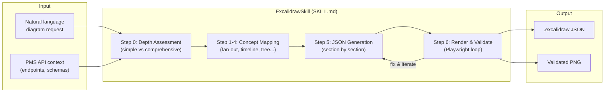
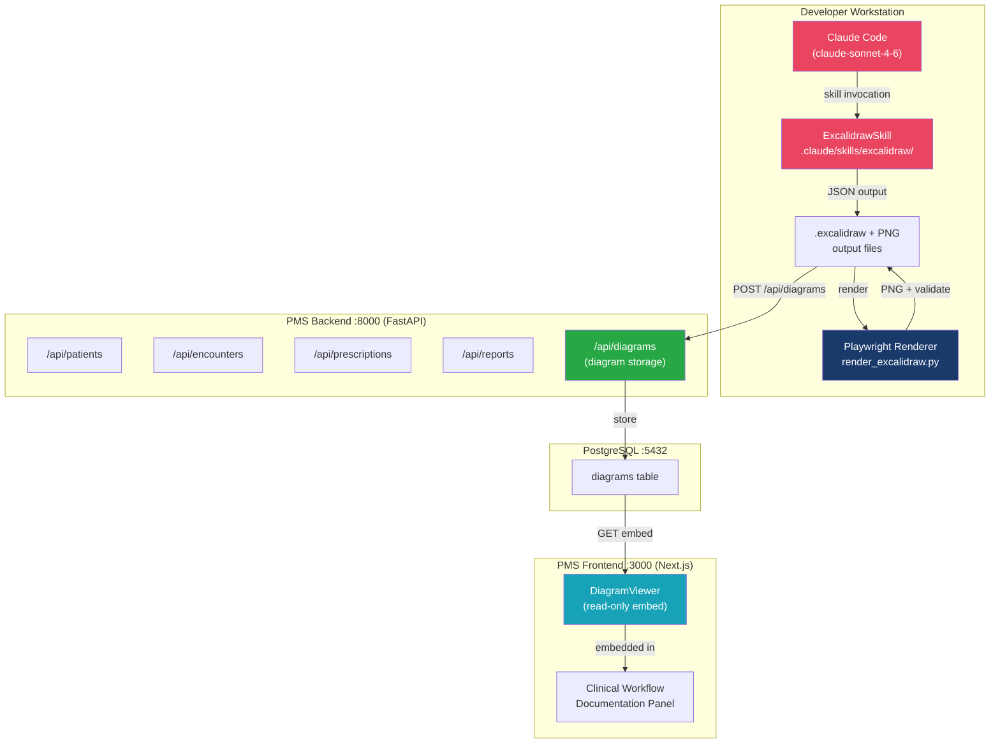

# ExcalidrawSkill Developer Onboarding Tutorial

**Welcome to the MPS PMS ExcalidrawSkill Integration Team**

This tutorial will take you from zero to building your first AI-generated clinical workflow diagram with ExcalidrawSkill inside the PMS Claude Code environment. By the end, you will understand how the skill works, have a validated local rendering pipeline, and have produced a complete prescription approval flow diagram with evidence artifacts.

**Document ID:** PMS-EXP-EXCALIDRAWSKILL-002
**Version:** 1.0
**Date:** 2026-03-03
**Applies To:** PMS project (all platforms)
**Prerequisite:** [ExcalidrawSkill Setup Guide](40-ExcalidrawSkill-PMS-Developer-Setup-Guide.md)
**Estimated time:** 2–3 hours
**Difficulty:** Beginner-friendly

---

## What You Will Learn

1. How ExcalidrawSkill's design philosophy ("diagrams that argue") differs from Mermaid and generic flowcharts
2. How the `.excalidraw` JSON format works and what makes a diagram valid
3. How to invoke ExcalidrawSkill inside a Claude Code session
4. How to use the visual pattern library (fan-out, convergence, timeline, tree) for clinical workflows
5. How to embed evidence artifacts (API payloads, code snippets) inside diagrams
6. How to use the Playwright render-and-validate loop to catch layout issues
7. How the MPS brand color palette applies to different node categories (patient data, AI, alerts)
8. How to generate a full prescription approval workflow diagram section by section
9. How to store, retrieve, and embed diagrams using the PMS DiagramViewer component
10. How to evaluate ExcalidrawSkill strengths, weaknesses, and HIPAA considerations

---

## Part 1: Understanding ExcalidrawSkill (15 min read)

### 1.1 What Problem Does ExcalidrawSkill Solve?

PMS clinical staff struggle to understand complex multi-step workflows from text descriptions alone. When a new clinician joins, they read prose descriptions of the prior authorization flow or medication reconciliation pipeline — but a textual description of a 12-step workflow with 3 decision branches and 2 external system calls does not form a clear mental model.

Developers face a similar problem: each new PMS experiment (Kafka, LangGraph, WebSocket) introduces architectural complexity that needs visual documentation before code review can be effective.

Existing tools fall short:
- **Mermaid** is excellent for simple flowcharts embedded in GitHub markdown, but cannot represent evidence artifacts (actual JSON payloads, API schemas) or multi-zoom complexity.
- **Manual Excalidraw drawing** produces beautiful hand-drawn diagrams, but takes 30–60 minutes per diagram and requires a skilled diagrammer.
- **Generic AI charting** produces placeholder text like "API Call → Service → Database" without actual field names, endpoint paths, or data formats.

ExcalidrawSkill gives AI agents (Claude Code) the ability to produce validated, evidence-rich, semantically structured Excalidraw diagrams in minutes — no manual drawing required.

---

### 1.2 How ExcalidrawSkill Works — The Key Pieces



**Three key concepts to remember:**

1. **Diagrams argue, not display.** The spatial layout and shape choice must reinforce the concept. A fan-out pattern (one source → many arrows → many targets) communicates one-to-many relationships without any text label.

2. **Evidence artifacts prove accuracy.** A comprehensive diagram embeds real API endpoint names (`/api/prescriptions`), actual JSON field names (`{ "patient_id": "...", "medication_code": "..." }`), and real event names (`prescription.created`) rather than generic placeholders.

3. **Render-and-validate is mandatory.** JSON generation alone is insufficient. The Playwright loop renders the diagram as a real browser would, catching invisible problems: overlapping text, arrows pointing at wrong elements, misaligned containers.

---

### 1.3 How ExcalidrawSkill Fits with Other PMS Technologies

| Technology | Relationship to ExcalidrawSkill |
|-----------|--------------------------------|
| Knowledge Work Plugins (Exp 24) | ExcalidrawSkill is a Knowledge Work Plugin — same architecture, ready to bundle |
| Mermaid (used in all PMS docs) | Complementary: Mermaid for inline GitHub docs, Excalidraw for rich visual artifacts |
| LangGraph (Exp 26) | ExcalidrawSkill documents the workflows that LangGraph executes |
| MCP (Exp 09) | Future: expose diagram generation as an MCP tool callable from any AI client |
| Claude Code (Exp 27) | ExcalidrawSkill is a Claude Code skill — requires Claude Code as the host |
| Docker (Exp 39) | ExcalidrawSkill's renderer can be wrapped in Docker for CI diagram generation |

---

### 1.4 Key Vocabulary

| Term | Meaning |
|------|---------|
| `.excalidraw` | JSON file format for Excalidraw diagrams, containing elements and appState |
| Element | A single canvas object (rectangle, ellipse, text, arrow) defined by position, size, style |
| Fan-out | Visual pattern where one source element fans out to many targets via arrows |
| Convergence | Visual pattern where many sources converge to a single target (funnel shape) |
| Evidence artifact | A diagram element that embeds concrete real-world data: code snippet, JSON payload, API name |
| Multi-zoom architecture | A diagram readable at 3 levels: overview, section labels, and evidence details |
| Render loop | The Playwright-based validate-fix-re-render cycle run after JSON generation |
| Depth assessment | Step 0 of SKILL.md: deciding if a diagram needs conceptual or comprehensive treatment |
| Color palette | `color-palette.md` — the single source of truth for all diagram colors |
| Semantic shape | Shape that carries meaning by its type: ellipse = start/end, diamond = decision |

---

### 1.5 Our Architecture



---

## Part 2: Environment Verification (15 min)

### 2.1 Checklist

Run each check and confirm the expected output:

```bash
# 1. Claude Code skill is installed
ls .claude/skills/excalidraw/SKILL.md
# Expected: file exists

# 2. References folder is complete
ls .claude/skills/excalidraw/references/
# Expected: color-palette.md element-templates.md json-schema.md pyproject.toml render_excalidraw.py render_template.html

# 3. Python venv and playwright are ready
.claude/skills/excalidraw/references/.venv/bin/python -c "import playwright; print('OK')"
# Expected: OK

# 4. Chromium is installed
.claude/skills/excalidraw/references/.venv/bin/playwright install chromium --dry-run 2>&1 | grep -i chromium
# Expected: [chromium] ... (already installed)

# 5. PMS backend is running
curl -s http://localhost:8000/health | python3 -m json.tool
# Expected: {"status": "ok"}

# 6. Output directory exists
ls /tmp/pms-diagrams/ 2>/dev/null || mkdir -p /tmp/pms-diagrams && echo "Created"
```

### 2.2 Quick Test

Generate and render a minimal diagram to confirm the full pipeline works:

```bash
# Create a minimal valid excalidraw file
cat > /tmp/pms-diagrams/quicktest.excalidraw << 'EOF'
{
  "type": "excalidraw",
  "version": 2,
  "source": "https://excalidraw.com",
  "elements": [
    {"id":"e1","type":"ellipse","x":50,"y":50,"width":160,"height":60,
     "strokeColor":"#1a3a6c","backgroundColor":"#e8f0fe","fillStyle":"solid",
     "strokeWidth":2,"opacity":100},
    {"id":"t1","type":"text","x":90,"y":68,"width":80,"height":24,
     "text":"Patient","fontSize":16,"fontFamily":1,"textAlign":"center",
     "strokeColor":"#1a3a6c"}
  ],
  "appState":{"viewBackgroundColor":"#fafafa"},
  "files":{}
}
EOF

# Render it
cd .claude/skills/excalidraw/references && source .venv/bin/activate
python render_excalidraw.py /tmp/pms-diagrams/quicktest.excalidraw /tmp/pms-diagrams/quicktest.png
ls -la /tmp/pms-diagrams/quicktest.png
# Expected: PNG file, > 5KB
```

---

## Part 3: Build Your First Integration (45 min)

### 3.1 What We Are Building

We will generate a comprehensive Excalidraw diagram of the **PMS Prescription Approval Workflow** — the path from a clinician entering a medication order to pharmacy fulfillment, including drug interaction checking, prior authorization, and the AI drug interaction alert.

This diagram will demonstrate:
- Fan-out pattern (one prescription → multiple checks in parallel)
- Evidence artifacts (real `/api/prescriptions` payload)
- Multi-zoom architecture (overview → sections → details)
- MPS brand color coding

---

### 3.2 Step 1 — Plan the Diagram Before Generating

Before asking Claude Code to generate any JSON, plan the diagram structure by answering these questions:

**What is the central narrative?** A prescription moves from creation through automated checks to pharmacist review and either approval or rejection.

**What visual patterns apply?**
- Timeline: the linear sequence of steps
- Fan-out: one prescription → three parallel checks (drug interaction, formulary check, prior auth)
- Convergence: the three checks → pharmacist review decision

**What evidence artifacts should appear?**
- `POST /api/prescriptions` request payload
- Drug interaction check API response
- Prior auth approval/rejection event

**Sketch the zones:**
1. Zone A: Clinician creates prescription order
2. Zone B: Automated checks (fan-out: drug interaction, formulary, prior auth)
3. Zone C: Pharmacist review and decision
4. Zone D: Outcome (approved → dispense / rejected → alert clinician)

---

### 3.3 Step 2 — Generate Zone A (Clinician Order Entry)

Open a Claude Code session. Invoke ExcalidrawSkill with the context from your plan:

```
Generate Excalidraw JSON for Zone A of the PMS Prescription Approval Workflow diagram.

Zone A: Clinician Order Entry
- Start with an ellipse labeled "Clinician" (MPS primary blue fill)
- Arrow to rectangle "Select Medication" (light blue fill)
- Arrow to rectangle "Enter Dose & Duration"
- Arrow to rectangle "POST /api/prescriptions" (evidence artifact: dark background, show JSON payload with fields: patient_id, medication_code, dose_mg, frequency, prescriber_id)
- End with an arrow pointing right toward Zone B

Use MPS brand colors. Seed IDs starting at 100xxx. Save to /tmp/pms-diagrams/prescription-workflow.excalidraw
```

Claude Code will generate Zone A JSON and write the file. Validate and render:

```bash
python3 -c "import json; json.load(open('/tmp/pms-diagrams/prescription-workflow.excalidraw'))" && echo "Valid JSON"
python render_excalidraw.py /tmp/pms-diagrams/prescription-workflow.excalidraw /tmp/pms-diagrams/zone-a.png
open /tmp/pms-diagrams/zone-a.png
```

Review the output. Common issues to look for:
- Text overflows the containing rectangle → ask Claude to increase width
- Arrow doesn't connect to elements → ask Claude to check `startBinding` and `endBinding` IDs

---

### 3.4 Step 3 — Generate Zone B (Automated Parallel Checks)

With Zone A validated, ask Claude to add Zone B:

```
Add Zone B to /tmp/pms-diagrams/prescription-workflow.excalidraw.

Zone B: Automated Parallel Checks (fan-out pattern)
- One arrow from Zone A exits to a "fan point" ellipse
- Three arrows fan out from the fan point to three parallel process blocks:
  1. Rectangle "Drug Interaction Check" (AI node, red fill) with evidence artifact showing alert JSON
  2. Rectangle "Formulary Check" (info node, light blue)
  3. Rectangle "Prior Auth Check" (warning node, yellow fill) with PA request status
- All three blocks have arrows pointing right toward Zone C convergence
- Use seed IDs starting at 200xxx
```

Validate and render after each zone addition.

---

### 3.5 Step 4 — Generate Zone C and D (Decision and Outcome)

```
Add Zone C and D to /tmp/pms-diagrams/prescription-workflow.excalidraw.

Zone C: Pharmacist Review
- Convergence point where 3 Zone B arrows merge
- Diamond shape "Pharmacist Decision"
- Two branches: "Approve" (green) and "Reject" (red)

Zone D: Outcomes
- Approve branch → ellipse "Dispense to Patient"
- Reject branch → rectangle "Alert Clinician" + evidence artifact showing notification event payload

Use seed IDs starting at 300xxx for Zone C, 400xxx for Zone D.
```

---

### 3.6 Step 5 — Full Render and Validate Loop

Run the final render and visually inspect the complete diagram:

```bash
cd .claude/skills/excalidraw/references && source .venv/bin/activate
python render_excalidraw.py \
  /tmp/pms-diagrams/prescription-workflow.excalidraw \
  /tmp/pms-diagrams/prescription-workflow-final.png
open /tmp/pms-diagrams/prescription-workflow-final.png
```

**Validation checklist:**
- [ ] All zones are clearly separated with visual whitespace
- [ ] Fan-out arrows in Zone B are evenly spaced
- [ ] Evidence artifact text is readable (not too small)
- [ ] Arrow directions correctly represent the flow left → right
- [ ] Convergence in Zone C shows all three Zone B arrows merging
- [ ] Color coding is consistent: AI nodes = red, clinical data = blue/green, alerts = yellow/orange

If issues exist, ask Claude Code to fix the specific zone, then re-render.

---

### 3.7 Step 6 — Store in PMS and Embed in Frontend

Upload the validated diagram:

```bash
EXCALIDRAW_JSON=$(cat /tmp/pms-diagrams/prescription-workflow.excalidraw | python3 -c 'import json,sys; print(json.dumps(sys.stdin.read()))')
PNG_B64=$(base64 -i /tmp/pms-diagrams/prescription-workflow-final.png)

curl -s -X POST http://localhost:8000/api/diagrams \
  -H "Authorization: Bearer $PMS_TOKEN" \
  -H "Content-Type: application/json" \
  -d "{
    \"title\": \"Prescription Approval Workflow\",
    \"description\": \"Full flow from clinician order to pharmacy fulfillment with drug interaction, formulary, and prior auth checks\",
    \"excalidraw_json\": $EXCALIDRAW_JSON,
    \"png_base64\": \"$PNG_B64\"
  }"
```

Embed in the PMS frontend:

```typescript
// In a prescription management page
import DiagramViewer from "@/components/DiagramViewer";

// Fetch diagram from /api/diagrams/{id} and pass json to viewer
<DiagramViewer
  excalidrawJson={diagram.excalidraw_json}
  title="Prescription Approval Workflow"
  height={700}
/>
```

---

## Part 4: Evaluating Strengths and Weaknesses (15 min)

### 4.1 Strengths

- **Evidence-rich output.** The skill requires actual API names, payload fields, and event names — output is anchored to PMS reality, not generic placeholders.
- **Zero additional services.** Unlike Kafka, LangGraph, or WebSocket integrations, ExcalidrawSkill requires no running containers, no API keys, and no network services beyond Playwright's headless browser.
- **Iterative validation.** The render-and-validate loop catches visual problems that are invisible in JSON, producing professional-quality output.
- **Brand customizable.** A single `color-palette.md` file controls all visual styling — swap colors once for all future diagrams.
- **Works inside Claude Code's existing workflow.** Developers already use Claude Code; this adds diagram generation without context switching.

### 4.2 Weaknesses

- **Token-intensive for complex diagrams.** Large multi-section diagrams require multiple AI calls and careful section management. A full architecture diagram may consume 50K+ tokens.
- **Fragile JSON generation.** Excalidraw JSON has strict structure; malformed output (wrong binding IDs, missing required fields) produces broken renders. The validate loop mitigates but doesn't eliminate this risk.
- **Playwright dependency.** The render pipeline requires Chromium + Playwright installed on the developer machine. CI environments need explicit configuration.
- **Not real-time collaborative.** Unlike the Excalidraw web app, the skill generates static files — it's not a live shared whiteboard.
- **No bidirectional sync.** You cannot edit a generated diagram in the Excalidraw app and have the changes reflected back in the skill's context.

### 4.3 When to Use ExcalidrawSkill vs. Alternatives

| Use Case | Best Choice | Why |
|----------|------------|-----|
| Inline GitHub markdown diagram | Mermaid | Renders natively in GitHub without external tools |
| Rich clinical workflow with evidence artifacts | ExcalidrawSkill | Multi-zoom, evidence-backed, professionally rendered |
| Real-time collaborative whiteboard | Excalidraw web app | Live editing, sharing, no AI needed |
| Architecture diagram for regulatory docs | ExcalidrawSkill | Validated PNG output for documentation packages |
| Quick ADR decision diagram (3-4 nodes) | Mermaid | Faster, no render step needed |
| MCP server architecture visualization | ExcalidrawSkill | Complex multi-component diagrams with labeled data flows |

### 4.4 HIPAA / Healthcare Considerations

**Risk: PHI in diagram text.** If a developer asks ExcalidrawSkill to diagram a specific patient's medication history, actual PHI (names, MRNs, diagnoses) could appear in diagram text and be committed to the repository.

**Mitigations:**
1. **Naming convention:** All diagram generation prompts must describe workflow types, not specific patient data. Use "Patient (MRN: XXXXX)" not real MRNs.
2. **Pre-commit hook:** Add a git hook that scans new `.excalidraw` files for patterns matching PHI formats (e.g., 10-digit MRNs, SSN patterns, DOB formats).
3. **Audit logging:** The `/api/diagrams` endpoint logs all diagram creation events with user and title — enabling periodic PHI audits.
4. **Developer training:** Include this section in the HIPAA training module for all PMS developers.

---

## Part 5: Debugging Common Issues (15 min)

### Issue 1: Diagram renders blank

**Symptom:** PNG output is a white canvas with no elements

**Cause:** Element coordinates are off-screen (negative x/y, or elements clustered far from origin)

**Fix:**
```bash
python3 -c "
import json
with open('/tmp/pms-diagrams/problem.excalidraw') as f:
    data = json.load(f)
for el in data['elements']:
    print(el.get('type'), el.get('x'), el.get('y'))
"
# Look for large negative numbers or very large positive numbers
# Ask Claude to normalize coordinates — start x=100, y=100
```

### Issue 2: Arrows point to wrong elements

**Symptom:** Visual arrows connect unrelated shapes

**Cause:** Arrow `startBinding`/`endBinding` uses wrong element IDs

**Fix:**
```bash
# List all element IDs in the file
python3 -c "
import json
with open('/tmp/pms-diagrams/problem.excalidraw') as f:
    data = json.load(f)
for el in data['elements']:
    print(el['id'], el.get('type'))
"
# Cross-check arrow bindings against the ID list
# Ask Claude to fix bindings with corrected IDs
```

### Issue 3: Text overflows rectangles

**Symptom:** Text is cut off at rectangle edges or appears outside the bounding box

**Cause:** Rectangle `width`/`height` too small for the text content

**Fix:** Ask Claude to increase the container dimensions. Rule of thumb: each 10-character line of text needs ~80px width and ~25px height per line.

### Issue 4: Playwright crashes with memory error

**Symptom:** `render_excalidraw.py` exits with out-of-memory error or segfault

**Cause:** Very large diagrams (100+ elements) exceed Playwright's default memory

**Fix:**
```bash
# Set a higher memory limit via Playwright launch options
# Edit render_excalidraw.py to add: --disable-gpu --no-sandbox flags for CI
# Or generate the diagram in smaller sections and merge PNGs
```

### Issue 5: `@excalidraw/excalidraw` breaks on Next.js 15 RSC

**Symptom:** Server component error, hydration mismatch, or "document is not defined"

**Cause:** Excalidraw uses browser-only APIs and cannot run in React Server Components

**Fix:** Ensure `DiagramViewer.tsx` has `"use client"` at the top AND uses `dynamic` with `ssr: false`:
```typescript
"use client";
const Excalidraw = dynamic(
  () => import("@excalidraw/excalidraw").then((m) => m.Excalidraw),
  { ssr: false }
);
```

---

## Part 6: Practice Exercises (45 min)

### Option A: PMS Architecture Overview Diagram (Recommended)

Generate a comprehensive Excalidraw diagram showing the full PMS system:
- Backend (FastAPI :8000) with all major API routers
- Frontend (Next.js :3000)
- PostgreSQL :5432 with key tables
- Android app
- Kafka (Experiment 38)
- Three AI services (Gemma 3, Qwen 3.5, Claude)

**Hint:** Use subgraph-style grouping with section rectangles. Fan-out from the backend to all API consumers.

**Steps:**
1. Plan 5 zones: Frontend, Backend, Database, Android, AI Services
2. Generate zone by zone (seed IDs: 100xxx, 200xxx, 300xxx, 400xxx, 500xxx)
3. Add cross-zone connection arrows last
4. Render and validate each zone
5. Store in `/api/diagrams` with title "PMS System Architecture Overview"

---

### Option B: Patient Encounter SOAP Note Capture Flow

Generate a clinical workflow diagram for the encounter documentation process:
- Patient check-in → encounter creation
- Clinician dictation (Voxtral/MedASR) → transcription → structured note extraction
- SOAP note fields (Subjective, Objective, Assessment, Plan) layout
- Sign-off → encounter closed → trigger downstream Kafka events

**Hint:** Use a timeline pattern for the linear sequence, then fan-out from the transcription step.

---

### Option C: HIPAA Data Boundary Map

Generate a security architecture diagram showing data boundaries:
- PHI data at rest (PostgreSQL, encrypted BYTEA)
- PHI data in transit (TLS 1.3 required paths)
- De-identification gateway (between PMS and cloud AI services)
- Audit log paths
- External data flows that must NOT contain PHI

**Hint:** Use overlapping ellipses for abstract "zones" (PHI zone, de-identified zone, external zone). Use dashed arrows for de-identified flows and solid arrows for fully encrypted PHI flows.

---

## Part 7: Development Workflow and Conventions

### 7.1 File Organization

```
pms-project/
├── .claude/
│   └── skills/
│       └── excalidraw/
│           ├── SKILL.md                    # Core skill methodology
│           └── references/
│               ├── color-palette.md        # MPS brand colors
│               ├── color-palette-mps.md    # MPS overrides
│               ├── element-templates.md
│               ├── json-schema.md
│               ├── render_excalidraw.py    # Render script
│               ├── render_template.html
│               └── pyproject.toml
├── docs/
│   └── experiments/
│       └── diagrams/                       # Committed .excalidraw + PNG files
│           ├── pms-architecture.excalidraw
│           ├── pms-architecture.png
│           ├── prescription-workflow.excalidraw
│           └── prescription-workflow.png
└── /tmp/pms-diagrams/                      # Working directory (not committed)
```

### 7.2 Naming Conventions

| Item | Convention | Example |
|------|-----------|---------|
| `.excalidraw` files | kebab-case, descriptive | `prescription-approval-workflow.excalidraw` |
| PNG exports | Same base name as `.excalidraw` | `prescription-approval-workflow.png` |
| Diagram titles in `/api/diagrams` | Title Case, concise | `Prescription Approval Workflow` |
| Element IDs | Zone-prefixed + semantic name | `200xxx` → `200_drug_interaction_rect` |
| Zone seed namespaces | 100xxx per zone | Zone A: 100xxx, Zone B: 200xxx, etc. |

### 7.3 PR Checklist

Before submitting any PR that includes diagram files:

- [ ] All `.excalidraw` files are valid JSON (`python3 -m json.tool < file.excalidraw`)
- [ ] All `.excalidraw` files have been rendered to PNG and PNG is committed alongside
- [ ] PNG files are visually reviewed — no blank output, no overlapping text
- [ ] No PHI appears in any diagram element text (names, MRNs, DOBs)
- [ ] Diagram titles use de-identified clinical workflow names
- [ ] New diagrams are uploaded to `/api/diagrams` and the diagram ID is recorded in the relevant `docs/experiments/` file
- [ ] MPS brand color palette is used consistently

### 7.4 Security Reminders

1. **Never diagram real patient data.** Use placeholder values: "Patient (de-identified)", "Encounter #XXXX", "Medication: [REDACTED]".
2. **Check git diff before committing.** Run `git diff --stat` and review any `.excalidraw` files for accidental PHI.
3. **The `/api/diagrams` endpoint requires JWT auth.** Do not make diagram endpoints publicly accessible.
4. **Playwright runs a headless browser.** On shared developer machines, ensure Playwright's temp files are cleaned up (`/tmp/playwright-*`).

---

## Part 8: Quick Reference Card

### Key Commands

```bash
# Render a diagram
cd .claude/skills/excalidraw/references && source .venv/bin/activate
python render_excalidraw.py <input.excalidraw> <output.png>

# Validate JSON
python3 -c "import json; json.load(open('<file>.excalidraw'))" && echo "Valid"

# List all element IDs (for debugging bindings)
python3 -c "import json; [print(e['id'], e.get('type')) for e in json.load(open('<file>.excalidraw'))['elements']]"

# Upload to PMS
curl -X POST http://localhost:8000/api/diagrams \
  -H "Authorization: Bearer $PMS_TOKEN" \
  -H "Content-Type: application/json" \
  -d '{"title":"...", "excalidraw_json":"..."}'

# Install Playwright browsers (if missing)
.venv/bin/playwright install chromium --with-deps
```

### Key Files

| File | Purpose |
|------|---------|
| `.claude/skills/excalidraw/SKILL.md` | Complete skill methodology |
| `.claude/skills/excalidraw/references/color-palette.md` | Default color definitions |
| `.claude/skills/excalidraw/references/color-palette-mps.md` | MPS brand overrides |
| `.claude/skills/excalidraw/references/render_excalidraw.py` | PNG renderer |
| `docs/experiments/diagrams/` | Committed diagram assets |

### Key URLs

| Resource | URL |
|---------|-----|
| Excalidraw web app (test/edit) | https://excalidraw.com |
| Excalidraw JSON docs | https://docs.excalidraw.com/docs/codebase/json-schema |
| ExcalidrawSkill repo | https://github.com/coleam00/excalidraw-diagram-skill |
| PMS Diagrams API | http://localhost:8000/api/diagrams |

### Starter Prompt Template

```
Generate a comprehensive Excalidraw diagram showing [WORKFLOW NAME].

Context:
- This is for the PMS clinical workflow documentation
- Use MPS brand colors from color-palette-mps.md
- Include evidence artifacts with real API endpoint names and JSON field names

Zones:
1. [Zone A name]: [description]
2. [Zone B name]: [description with fan-out/convergence pattern]
3. [Zone C name]: [description]

Visual patterns:
- [zone]: [fan-out | convergence | timeline | tree]

Evidence artifacts:
- Zone [X]: show POST /api/[endpoint] payload with fields [list]
- Zone [Y]: show response event with fields [list]

Seed IDs: Zone A=100xxx, Zone B=200xxx, Zone C=300xxx
Output file: /tmp/pms-diagrams/[kebab-case-name].excalidraw
Generate Zone A first, then I will validate and ask for Zone B.
```

---

## Next Steps

1. Complete all 5 Phase 1 pilot diagrams from the [PRD](40-PRD-ExcalidrawSkill-PMS-Integration.md): PMS architecture, patient lifecycle, encounter SOAP flow, prescription approval, HIPAA boundary map
2. Add ExcalidrawSkill to the PMS Knowledge Work Plugin bundle — see [Experiment 24](24-KnowledgeWorkPlugins-PMS-Developer-Setup-Guide.md)
3. Set up the CI diagram generation step in GitHub Actions for automatic architecture diagram updates
4. Build the `/api/diagrams` endpoint and integrate DiagramViewer into the clinical workflow panels — see [Setup Guide Part D and E](40-ExcalidrawSkill-PMS-Developer-Setup-Guide.md)
5. Propose an ADR for ExcalidrawSkill as the official PMS diagram tooling standard, replacing ad-hoc Mermaid for complex workflows
