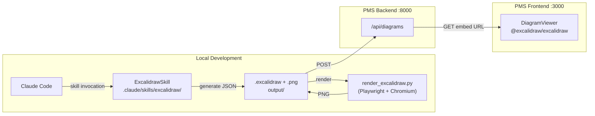

# ExcalidrawSkill Setup Guide for PMS Integration

**Document ID:** PMS-EXP-EXCALIDRAWSKILL-001
**Version:** 1.0
**Date:** 2026-03-03
**Applies To:** PMS project (all platforms)
**Prerequisites Level:** Intermediate

---

## Table of Contents

1. [Overview](#1-overview)
2. [Prerequisites](#2-prerequisites)
3. [Part A: Install ExcalidrawSkill as a Claude Code Plugin](#3-part-a-install-excalidrawskill-as-a-claude-code-plugin)
4. [Part B: Configure MPS Brand Colors](#4-part-b-configure-mps-brand-colors)
5. [Part C: Install and Verify the Playwright Renderer](#5-part-c-install-and-verify-the-playwright-renderer)
6. [Part D: Integrate with PMS Backend (Diagram Asset API)](#6-part-d-integrate-with-pms-backend-diagram-asset-api)
7. [Part E: Integrate with PMS Frontend (DiagramViewer Component)](#7-part-e-integrate-with-pms-frontend-diagramviewer-component)
8. [Part F: Testing and Verification](#8-part-f-testing-and-verification)
9. [Troubleshooting](#9-troubleshooting)
10. [Reference Commands](#10-reference-commands)

---

## 1. Overview

This guide walks through installing the `excalidraw-diagram-skill` from Cole Medin's open-source repository, configuring it for MPS brand conventions, wiring the Playwright rendering pipeline, and optionally exposing a `/api/diagrams` endpoint for persistent diagram asset storage.

By the end of this guide you will have:

- ExcalidrawSkill running as a Claude Code plugin under `.claude/skills/excalidraw/`
- The Playwright renderer able to convert `.excalidraw` JSON to PNG
- MPS brand colors applied to all generated diagrams
- (Optional) A `/api/diagrams` FastAPI endpoint and `DiagramViewer` Next.js component

### Architecture at a Glance



---

## 2. Prerequisites

### 2.1 Required Software

| Software | Minimum Version | Check Command |
|----------|----------------|---------------|
| Claude Code | Latest | `claude --version` |
| Python | 3.11 | `python3 --version` |
| pip / uv | Latest | `pip --version` |
| Node.js | 20 LTS | `node --version` |
| npm | 10+ | `npm --version` |
| Git | 2.40+ | `git --version` |
| PMS Backend | Running | `curl http://localhost:8000/health` |
| PMS Frontend | Running | `curl http://localhost:3000` |

### 2.2 Installation of Prerequisites

**Python 3.11+ (if not installed):**
```bash
# macOS
brew install python@3.11

# Ubuntu/Debian
sudo apt update && sudo apt install python3.11 python3.11-venv python3-pip -y

# Verify
python3.11 --version
```

**uv (fast Python package manager, recommended):**
```bash
curl -LsSf https://astral.sh/uv/install.sh | sh
```

### 2.3 Verify PMS Services

```bash
# Verify PMS backend
curl -s http://localhost:8000/health | python3 -m json.tool
# Expected: {"status": "ok", ...}

# Verify PMS frontend
curl -s -o /dev/null -w "%{http_code}" http://localhost:3000
# Expected: 200

# Verify PostgreSQL
psql $DATABASE_URL -c "SELECT version();"
# Expected: PostgreSQL 15.x ...
```

---

## 3. Part A: Install ExcalidrawSkill as a Claude Code Plugin

### Step 1: Navigate to the PMS project root

```bash
cd /path/to/pms-project
```

### Step 2: Create the skills directory structure

```bash
mkdir -p .claude/skills/excalidraw/references
```

### Step 3: Clone the skill repository

```bash
# Clone to a temporary location
git clone https://github.com/coleam00/excalidraw-diagram-skill /tmp/excalidraw-skill

# Copy skill files
cp /tmp/excalidraw-skill/SKILL.md .claude/skills/excalidraw/
cp -r /tmp/excalidraw-skill/references/ .claude/skills/excalidraw/references/

# Clean up
rm -rf /tmp/excalidraw-skill
```

### Step 4: Verify the skill structure

```bash
find .claude/skills/excalidraw -type f
```

**Expected output:**
```
.claude/skills/excalidraw/SKILL.md
.claude/skills/excalidraw/references/color-palette.md
.claude/skills/excalidraw/references/element-templates.md
.claude/skills/excalidraw/references/json-schema.md
.claude/skills/excalidraw/references/pyproject.toml
.claude/skills/excalidraw/references/render_excalidraw.py
.claude/skills/excalidraw/references/render_template.html
```

### Step 5: Register the skill in Claude Code settings

Add the skill path to `.claude/settings.json` (create if it doesn't exist):

```json
{
  "skills": [
    ".claude/skills/excalidraw"
  ]
}
```

**Checkpoint A:** The skill is installed. Verify by opening a new Claude Code session and asking: *"List available skills."* You should see the ExcalidrawSkill listed.

---

## 4. Part B: Configure MPS Brand Colors

### Step 1: Open the color palette file

```bash
cat .claude/skills/excalidraw/references/color-palette.md
```

Review the default palette sections: semantic shapes, free-floating text, evidence artifacts, and background colors.

### Step 2: Create an MPS-customized palette

Create `.claude/skills/excalidraw/references/color-palette-mps.md` with MPS brand overrides:

```markdown
# MPS Color Palette Overrides

## Brand Primary
- Primary Blue: #1a3a6c (fill for primary process nodes)
- Primary Light: #e8f0fe (fill for secondary/info nodes)

## Clinical Data Nodes
- Patient data: fill #d4edda, stroke #28a745
- Encounter data: fill #d1ecf1, stroke #17a2b8
- Prescription data: fill #fff3cd, stroke #ffc107
- Alert/Warning: fill #f8d7da, stroke #dc3545

## AI/Inference Nodes
- AI component: fill #e94560, stroke #c73652, font_color #ffffff

## Evidence Artifacts
- Code snippet background: #1e1e2e
- JSON payload background: #1e1e2e
- API endpoint label: fill #2d2d2d, font_color #e0e0e0

## Background
- Canvas default: #fafafa
- Section background: #f4f4f8
```

**Checkpoint B:** MPS brand colors are documented. All future diagram generation sessions will reference this file.

---

## 5. Part C: Install and Verify the Playwright Renderer

### Step 1: Create a Python virtual environment

```bash
cd .claude/skills/excalidraw/references
python3 -m venv .venv
source .venv/bin/activate  # Windows: .venv\Scripts\activate
```

### Step 2: Install dependencies

```bash
# Using pyproject.toml
pip install -e .

# Or install playwright directly
pip install playwright
```

### Step 3: Install Playwright browsers

```bash
playwright install chromium
```

### Step 4: Create an output directory

```bash
mkdir -p /tmp/pms-diagrams
```

### Step 5: Test the renderer with a minimal diagram

Create `/tmp/test-diagram.excalidraw`:

```json
{
  "type": "excalidraw",
  "version": 2,
  "source": "https://excalidraw.com",
  "elements": [
    {
      "id": "test_rect",
      "type": "rectangle",
      "x": 100,
      "y": 100,
      "width": 200,
      "height": 80,
      "strokeColor": "#1a3a6c",
      "backgroundColor": "#e8f0fe",
      "fillStyle": "solid",
      "strokeWidth": 2,
      "roundness": {"type": 3},
      "opacity": 100
    },
    {
      "id": "test_label",
      "type": "text",
      "x": 140,
      "y": 128,
      "width": 120,
      "height": 24,
      "text": "PMS Test",
      "fontSize": 18,
      "fontFamily": 1,
      "textAlign": "center",
      "strokeColor": "#1a3a6c"
    }
  ],
  "appState": {
    "gridSize": null,
    "viewBackgroundColor": "#fafafa"
  },
  "files": {}
}
```

Run the renderer:

```bash
python render_excalidraw.py /tmp/test-diagram.excalidraw /tmp/pms-diagrams/test-output.png
```

### Step 6: Verify PNG output

```bash
ls -la /tmp/pms-diagrams/test-output.png
# Expected: file exists, size > 5KB
file /tmp/pms-diagrams/test-output.png
# Expected: PNG image data
```

**Checkpoint C:** The Playwright renderer is working. PNG output is visible and contains the diagram.

---

## 6. Part D: Integrate with PMS Backend (Diagram Asset API)

> This is optional for the core ExcalidrawSkill workflow. Skip to Part E if you only need local diagram generation.

### Step 1: Create the diagrams database migration

In `pms-backend/alembic/versions/`, create `xxxx_add_diagrams_table.py`:

```python
"""Add diagrams table

Revision ID: add_diagrams_table
"""
from alembic import op
import sqlalchemy as sa

def upgrade():
    op.create_table(
        "diagrams",
        sa.Column("id", sa.UUID(), nullable=False, server_default=sa.text("gen_random_uuid()")),
        sa.Column("title", sa.String(255), nullable=False),
        sa.Column("description", sa.Text()),
        sa.Column("excalidraw_json", sa.Text(), nullable=False),
        sa.Column("png_blob", sa.LargeBinary()),
        sa.Column("created_by", sa.String(255)),
        sa.Column("created_at", sa.DateTime(timezone=True), server_default=sa.func.now()),
        sa.Column("updated_at", sa.DateTime(timezone=True), onupdate=sa.func.now()),
        sa.PrimaryKeyConstraint("id"),
    )
    op.create_index("idx_diagrams_created_by", "diagrams", ["created_by"])

def downgrade():
    op.drop_table("diagrams")
```

Run the migration:

```bash
cd pms-backend
alembic upgrade head
```

### Step 2: Create the diagrams FastAPI router

Create `pms-backend/app/routers/diagrams.py`:

```python
from fastapi import APIRouter, Depends, HTTPException
from pydantic import BaseModel
from sqlalchemy.ext.asyncio import AsyncSession
from app.database import get_db
from app.auth import get_current_user
import base64, logging

logger = logging.getLogger(__name__)
router = APIRouter(prefix="/api/diagrams", tags=["diagrams"])

class DiagramCreate(BaseModel):
    title: str
    description: str = ""
    excalidraw_json: str
    png_base64: str = ""  # optional PNG as base64

class DiagramResponse(BaseModel):
    id: str
    title: str
    description: str
    excalidraw_json: str
    created_at: str

@router.post("/", response_model=DiagramResponse)
async def create_diagram(
    payload: DiagramCreate,
    db: AsyncSession = Depends(get_db),
    current_user = Depends(get_current_user)
):
    png_bytes = base64.b64decode(payload.png_base64) if payload.png_base64 else None
    result = await db.execute(
        """INSERT INTO diagrams (title, description, excalidraw_json, png_blob, created_by)
           VALUES (:title, :description, :json, :png, :user)
           RETURNING id, title, description, excalidraw_json, created_at""",
        {"title": payload.title, "description": payload.description,
         "json": payload.excalidraw_json, "png": png_bytes, "user": current_user.email}
    )
    row = result.fetchone()
    logger.info(f"AUDIT diagram_created title={payload.title} user={current_user.email}")
    return DiagramResponse(
        id=str(row.id), title=row.title, description=row.description,
        excalidraw_json=row.excalidraw_json, created_at=str(row.created_at)
    )

@router.get("/{diagram_id}", response_model=DiagramResponse)
async def get_diagram(diagram_id: str, db: AsyncSession = Depends(get_db)):
    result = await db.execute(
        "SELECT id, title, description, excalidraw_json, created_at FROM diagrams WHERE id = :id",
        {"id": diagram_id}
    )
    row = result.fetchone()
    if not row:
        raise HTTPException(status_code=404, detail="Diagram not found")
    return DiagramResponse(
        id=str(row.id), title=row.title, description=row.description,
        excalidraw_json=row.excalidraw_json, created_at=str(row.created_at)
    )
```

### Step 3: Register the router

In `pms-backend/app/main.py`, add:

```python
from app.routers import diagrams
app.include_router(diagrams.router)
```

**Checkpoint D:** Diagram API is running. Test:

```bash
curl -s http://localhost:8000/api/diagrams \
  -H "Authorization: Bearer $PMS_TOKEN" \
  -H "Content-Type: application/json" \
  -d '{"title":"Test","excalidraw_json":"{}"}'
# Expected: {"id": "...", "title": "Test", ...}
```

---

## 7. Part E: Integrate with PMS Frontend (DiagramViewer Component)

### Step 1: Install the Excalidraw npm package

```bash
cd pms-frontend
npm install @excalidraw/excalidraw
```

### Step 2: Create the DiagramViewer component

Create `pms-frontend/components/DiagramViewer.tsx`:

```typescript
"use client";
import dynamic from "next/dynamic";
import { useState, useEffect } from "react";

// Excalidraw must be loaded client-side only (uses browser APIs)
const Excalidraw = dynamic(
  () => import("@excalidraw/excalidraw").then((mod) => mod.Excalidraw),
  { ssr: false }
);

interface DiagramViewerProps {
  excalidrawJson: string;  // serialized .excalidraw JSON
  title?: string;
  height?: number;
}

export default function DiagramViewer({ excalidrawJson, title, height = 500 }: DiagramViewerProps) {
  const [data, setData] = useState<{ elements: any[]; appState: any; files: any } | null>(null);

  useEffect(() => {
    try {
      const parsed = JSON.parse(excalidrawJson);
      setData({ elements: parsed.elements || [], appState: parsed.appState || {}, files: parsed.files || {} });
    } catch {
      console.error("Invalid excalidraw JSON");
    }
  }, [excalidrawJson]);

  if (!data) return <div className="text-gray-400">Loading diagram...</div>;

  return (
    <div className="border rounded-lg overflow-hidden" style={{ height }}>
      {title && <div className="px-4 py-2 bg-gray-50 border-b text-sm font-medium text-gray-700">{title}</div>}
      <Excalidraw
        initialData={data}
        viewModeEnabled={true}  // read-only, no editing
        zenModeEnabled={false}
        gridModeEnabled={false}
      />
    </div>
  );
}
```

### Step 3: Use the component in a clinical workflow panel

```typescript
// In a clinical workflow page
import DiagramViewer from "@/components/DiagramViewer";

// Example: render a prior auth flow diagram
<DiagramViewer
  excalidrawJson={diagram.excalidraw_json}
  title="Prior Authorization Workflow"
  height={600}
/>
```

**Checkpoint E:** The DiagramViewer component loads and renders an Excalidraw diagram in read-only mode. Verify by running `npm run dev` and navigating to a page that includes the component.

---

## 8. Part F: Testing and Verification

### End-to-end diagram generation test

In a Claude Code session:

```
Generate an Excalidraw diagram showing the PMS patient registration workflow.
Include: patient arrival → intake form → identity verification → insurance check → record creation → encounter initiation.
Use the MPS color palette. Save to /tmp/pms-diagrams/patient-registration.excalidraw
```

Then render:

```bash
cd .claude/skills/excalidraw/references
source .venv/bin/activate
python render_excalidraw.py /tmp/pms-diagrams/patient-registration.excalidraw /tmp/pms-diagrams/patient-registration.png
open /tmp/pms-diagrams/patient-registration.png  # macOS
```

### API integration test

```bash
# Upload diagram to PMS
JSON=$(cat /tmp/pms-diagrams/patient-registration.excalidraw)
curl -s -X POST http://localhost:8000/api/diagrams \
  -H "Authorization: Bearer $PMS_TOKEN" \
  -H "Content-Type: application/json" \
  -d "{\"title\": \"Patient Registration Workflow\", \"excalidraw_json\": $(echo $JSON | python3 -c 'import json,sys; print(json.dumps(sys.stdin.read()))')}"
```

### Frontend verification

1. Navigate to the page containing `DiagramViewer`
2. Confirm the diagram renders interactively (zoom/pan)
3. Confirm view-only mode (no editing toolbar)
4. Check browser console for zero errors

---

## 9. Troubleshooting

### Playwright browser not found

**Symptom:** `playwright install` succeeds but render script fails with "browser not found"

**Fix:**
```bash
# Explicitly install chromium
playwright install chromium --with-deps
# Or use the full install
playwright install --with-deps
```

### `@excalidraw/excalidraw` SSR error

**Symptom:** Next.js build fails with "window is not defined" or similar browser API error

**Fix:** Ensure the import uses `dynamic` with `ssr: false` as shown in Step 2. Never import Excalidraw in a server component.

### JSON parse error in DiagramViewer

**Symptom:** Diagram shows "Loading diagram..." indefinitely

**Fix:** Validate the JSON before storing:
```bash
cat /tmp/pms-diagrams/test.excalidraw | python3 -m json.tool > /dev/null && echo "Valid JSON"
```

### Claude Code skill not recognized

**Symptom:** Claude Code does not list ExcalidrawSkill in available skills

**Fix:**
1. Verify `SKILL.md` exists at `.claude/skills/excalidraw/SKILL.md`
2. Verify `.claude/settings.json` includes the skill path
3. Restart the Claude Code session

### Diagram generation produces invalid JSON

**Symptom:** Playwright render fails; JSON is malformed

**Fix:** Use the section-by-section generation strategy described in SKILL.md. Ask Claude to generate one section at a time, validating JSON after each section:
```bash
python3 -c "import json; json.load(open('/tmp/diagram.excalidraw'))" && echo "Valid"
```

---

## 10. Reference Commands

### Daily development workflow

```bash
# Generate a diagram (in Claude Code session)
# Invoke ExcalidrawSkill by describing the diagram in plain English

# Render to PNG
cd .claude/skills/excalidraw/references && source .venv/bin/activate
python render_excalidraw.py <input.excalidraw> <output.png>

# Validate JSON
python3 -c "import json; json.load(open('<file>.excalidraw'))" && echo "Valid"

# Upload to PMS
curl -X POST http://localhost:8000/api/diagrams \
  -H "Authorization: Bearer $PMS_TOKEN" \
  -H "Content-Type: application/json" \
  -d @diagram-payload.json
```

### Useful URLs

| Resource | URL |
|---------|-----|
| Excalidraw web app (test JSON) | https://excalidraw.com |
| Official JSON schema docs | https://docs.excalidraw.com/docs/codebase/json-schema |
| Skill repository | https://github.com/coleam00/excalidraw-diagram-skill |
| PMS diagrams API | http://localhost:8000/api/diagrams |
| PMS frontend | http://localhost:3000 |

---

## Next Steps

- Read the [ExcalidrawSkill Developer Tutorial](40-ExcalidrawSkill-Developer-Tutorial.md) for hands-on practice
- Generate the 5 pilot diagrams listed in Phase 1 of the [PRD](40-PRD-ExcalidrawSkill-PMS-Integration.md)
- Explore adding ExcalidrawSkill to the PMS Knowledge Work Plugin bundle ([Experiment 24](24-KnowledgeWorkPlugins-PMS-Developer-Setup-Guide.md))

## Resources

- [GitHub: coleam00/excalidraw-diagram-skill](https://github.com/coleam00/excalidraw-diagram-skill)
- [Excalidraw Official Documentation](https://docs.excalidraw.com)
- [Excalidraw npm Package](https://www.npmjs.com/package/@excalidraw/excalidraw)
- [Playwright Python Documentation](https://playwright.dev/python/docs/intro)
- [ExcalidrawSkill PRD](40-PRD-ExcalidrawSkill-PMS-Integration.md)
