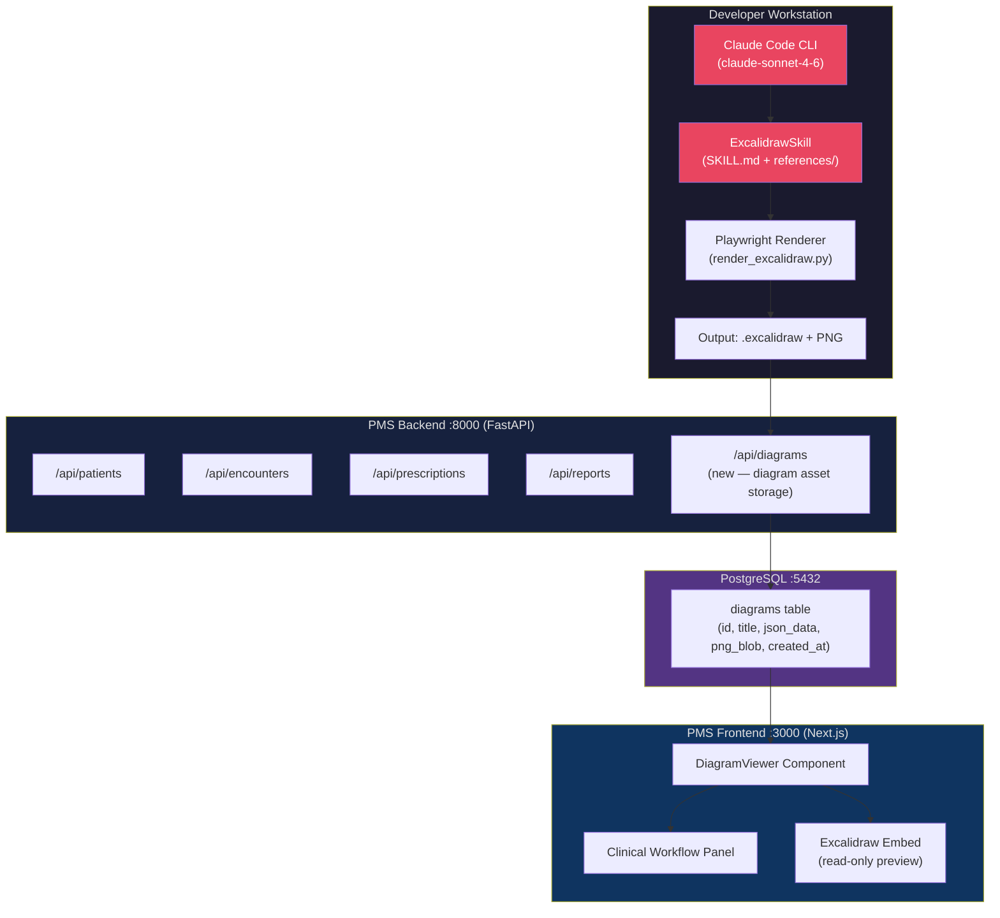

# Product Requirements Document: ExcalidrawSkill Integration into Patient Management System (PMS)

**Document ID:** PRD-PMS-EXCALIDRAWSKILL-001
**Version:** 1.0
**Date:** 2026-03-03
**Author:** Ammar (CEO, MPS Inc.)
**Status:** Draft

---

## 1. Executive Summary

ExcalidrawSkill is an open-source coding agent skill developed by Cole Medin (`coleam00`) that gives AI assistants — including Claude Code — the ability to generate structured, semantically meaningful visual diagrams in Excalidraw's native `.excalidraw` JSON format. Unlike generic charting libraries, the skill treats diagrams as visual arguments: every shape choice, spatial arrangement, and layout pattern is chosen to reinforce the concept being illustrated rather than merely display information.

For the MPS Patient Management System, ExcalidrawSkill provides a path to AI-generated clinical documentation artifacts — workflow diagrams, architecture maps, care-pathway visualizations, and onboarding materials — that are automatically rendered, validated, and iterable. A built-in Playwright-based render-and-validate loop catches visual issues (overlapping text, broken arrows, misaligned elements) before any diagram is delivered, ensuring production-quality output.

The strategic value to PMS is accelerated documentation creation for clinical workflows (prior auth flows, medication reconciliation pipelines, care coordination paths), developer onboarding diagrams for the 39+ PMS experiments, and live architecture visualization during the rapid growth of the platform. ExcalidrawSkill integrates as a Claude Code skill — a lightweight markdown-based plugin that needs no extra services, no Docker containers, and no cloud credentials.

---

## 2. Problem Statement

The PMS platform has grown to 39+ experiments across FastAPI, Next.js, Android, Kafka, WebSocket, LangGraph, and multiple AI services. Documentation must keep pace with this complexity, but manually drawing architecture diagrams for each new feature, clinical workflow, and integration is slow, inconsistent, and often deferred until after the fact.

Specific pain points:

- **Clinical workflow documentation is inconsistent.** Prior authorization flows, medication reconciliation pipelines, and care coordination pathways are described in prose but lack visual representations that clinical staff can use during training.
- **Architecture diagrams are static and stale.** Diagram-as-code tooling (Mermaid) produces acceptable output for simple flows but cannot represent evidence artifacts, realistic UI mockups, or multi-zoom technical depth.
- **Onboarding overhead is high.** Each new PMS developer or clinician needs visual walkthroughs of patient record flows, encounter creation, prescription approval gates, and HIPAA data paths.
- **AI agents cannot currently produce verified diagrams.** When Claude Code is asked to diagram a system, it must produce Mermaid code or ASCII art — neither of which is visually validated or interactive.

ExcalidrawSkill closes this gap by making AI-generated diagram production a first-class, validated capability within the Claude Code development environment already in use across PMS.

---

## 3. Proposed Solution

### 3.1 Architecture Overview

### 3.2 Deployment Model

ExcalidrawSkill runs entirely on the developer's local machine as a Claude Code plugin. It requires:

- **Python 3.11+** and `playwright` for the render validation loop
- **No cloud credentials** — diagrams are generated locally and stored in the PMS repository or a new `/api/diagrams` endpoint
- **HIPAA posture**: All diagram content stays within the developer's environment or the PMS backend. No PHI should be embedded in diagram text. Diagram generation prompts must be reviewed to ensure they reference only de-identified clinical concepts (e.g., "encounter workflow" not specific patient names).
- **Docker optional** — the Playwright headless browser runs on the host; a Docker-wrapped version can be added for CI diagram generation.

---

## 4. PMS Data Sources

ExcalidrawSkill consumes PMS API knowledge to generate accurate, evidence-backed diagrams:

| PMS API | Usage in Diagrams |
|---------|------------------|
| `/api/patients` | Patient record lifecycle flows, intake/registration diagrams |
| `/api/encounters` | Encounter creation, SOAP note capture, review/sign workflows |
| `/api/prescriptions` | Medication reconciliation pipelines, drug interaction alert flows |
| `/api/reports` | Reporting dashboard data flows, analytics pipeline diagrams |
| `/api/diagrams` (new) | Store and retrieve `.excalidraw` JSON and PNG artifacts |

Diagrams do not call live APIs at generation time. Instead, the AI uses knowledge of the API structure to embed accurate endpoint names, field names, and data shapes as evidence artifacts within the diagram.

---

## 5. Component / Module Definitions

### 5.1 ExcalidrawSkill Plugin

**Description:** Claude Code skill loaded from `.claude/skills/excalidraw/SKILL.md`. Provides design methodology, visual pattern library, JSON schema, and rendering instructions to Claude.

**Input:** Natural-language diagram request with context (e.g., "diagram the PMS prescription approval workflow")

**Output:** `.excalidraw` JSON file + rendered PNG via Playwright

**PMS APIs used:** Conceptual knowledge only; no live API calls at generation time

---

### 5.2 Playwright Render Service

**Description:** Python script (`render_excalidraw.py`) that loads a `.excalidraw` JSON file into a headless browser, renders the Excalidraw canvas, and captures a PNG screenshot.

**Input:** `.excalidraw` JSON file path

**Output:** PNG image at specified output path

**Dependencies:** Python `playwright`, headless Chromium

---

### 5.3 Diagram Asset API (`/api/diagrams`)

**Description:** New FastAPI endpoint for storing and retrieving diagram artifacts. Enables the PMS frontend to embed diagrams in clinical workflow panels, onboarding pages, and documentation portals.

**Input:** POST — `{ title, description, excalidraw_json, png_bytes }`

**Output:** GET — `{ id, title, excalidraw_json_url, png_url, created_at }`

**PMS APIs used:** PostgreSQL `diagrams` table (new)

---

### 5.4 DiagramViewer Frontend Component

**Description:** Next.js React component that renders Excalidraw diagrams in read-only mode within the PMS frontend. Used in clinical workflow documentation panels and onboarding screens.

**Input:** `diagram_id` or `excalidraw_json` prop

**Output:** Interactive (zoom, pan) read-only Excalidraw canvas embedded in the UI

**Dependencies:** `@excalidraw/excalidraw` npm package

---

### 5.5 Color Palette Configuration

**Description:** `references/color-palette.md` defines all diagram colors with semantic meanings (AI nodes, clinical data nodes, error states, evidence artifacts). MPS customizes this with brand colors.

**Input:** Brand hex codes from MPS design system

**Output:** Updated color palette used in all generated diagrams

---

## 6. Non-Functional Requirements

### 6.1 Security and HIPAA Compliance

- **No PHI in diagrams.** All diagram generation prompts must use de-identified clinical concepts. The diagram generation workflow must include a pre-check step that flags any prompt containing potential PHI (patient names, MRNs, DOBs).
- **Local rendering.** The Playwright render loop runs entirely on the developer's workstation. No diagram content is sent to external services.
- **Diagram storage encryption.** The `diagrams` table in PostgreSQL should store `json_data` as `TEXT` (no PHI) and `png_blob` as `BYTEA`. If future diagrams could contain PHI, AES-256-GCM encryption matching the existing image storage pattern (ADR-0010) applies.
- **Access control.** The `/api/diagrams` endpoint follows existing PMS auth middleware (JWT, role-based access). Diagram assets are scoped to the creating user or tenant.
- **Audit logging.** All diagram creation and retrieval events are logged to the PMS audit log with user, timestamp, and diagram title.

### 6.2 Performance

| Metric | Target |
|--------|--------|
| Diagram generation time (simple) | < 30 seconds |
| Diagram generation time (comprehensive, multi-section) | < 5 minutes |
| Playwright render time | < 10 seconds per diagram |
| PNG retrieval from `/api/diagrams` | < 200ms (p95) |
| Excalidraw embed load time in frontend | < 1 second |

### 6.3 Infrastructure

- **Developer machine:** Python 3.11+, Playwright, headless Chromium (~150 MB download)
- **CI/CD:** Optional diagram generation step in GitHub Actions for automated documentation updates
- **Backend:** Minimal — one new table, one new FastAPI router (`diagrams.py`)
- **Frontend:** `@excalidraw/excalidraw` npm package (~2MB bundle addition)

---

## 7. Implementation Phases

### Phase 1: Foundation (Sprint 1–2)
- Install ExcalidrawSkill as a Claude Code plugin in the PMS `.claude/skills/excalidraw/` directory
- Configure `color-palette.md` with MPS brand colors
- Generate and validate 5 pilot diagrams: (1) PMS architecture overview, (2) patient record lifecycle, (3) encounter SOAP workflow, (4) prescription approval flow, (5) HIPAA data boundary map
- Document findings in a follow-up ADR

### Phase 2: Core Integration (Sprint 3–4)
- Build `/api/diagrams` FastAPI endpoint with PostgreSQL storage
- Create `DiagramViewer` Next.js component using `@excalidraw/excalidraw`
- Integrate diagram viewer into the existing clinical workflow panels
- Add PHI-check pre-flight to diagram generation prompts via Claude Code hook

### Phase 3: Advanced Features (Sprint 5–6)
- CI diagram generation: GitHub Actions workflow that auto-generates architecture diagrams on pull requests that touch key files
- Diagram versioning: track diagram history per PMS feature/ADR
- Export pipeline: bulk export all experiment diagrams as PNG for regulatory documentation packages
- AI-powered diagram update: detect API endpoint changes and prompt for diagram refresh

---

## 8. Success Metrics

| Metric | Target | Measurement Method |
|--------|--------|--------------------|
| Diagrams generated per sprint | ≥ 10 | Count of `.excalidraw` files committed |
| Diagram render success rate | ≥ 95% | Playwright exit code tracking |
| Documentation coverage | All 39 experiments have architecture diagram | Manual audit |
| Developer onboarding time | -25% reduction | Pre/post developer survey |
| Diagram PHI incident rate | 0 | Audit log review |
| Frontend diagram load time | < 1 second | Lighthouse performance report |

---

## 9. Risks and Mitigations

| Risk | Impact | Mitigation |
|------|--------|------------|
| PHI accidentally embedded in diagram text | High (HIPAA breach) | Pre-flight PHI checker Claude Code hook; naming convention enforcement |
| Excalidraw JSON schema changes between versions | Medium (render failures) | Pin `@excalidraw/excalidraw` version; test before upgrade |
| Playwright Chromium incompatibility on CI | Medium (broken CI step) | Use pinned Playwright version; wrap in `try/catch` with fallback to JSON-only output |
| Diagram sprawl (hundreds of stale diagrams) | Low (maintenance overhead) | Diagram registry in `/api/diagrams` with `last_verified` field; quarterly stale diagram review |
| Token limits during large diagram generation | Medium (incomplete diagrams) | Section-by-section generation strategy (built into SKILL.md); use Claude Sonnet 4.6 for cost efficiency |

---

## 10. Dependencies

| Dependency | Version | Notes |
|-----------|---------|-------|
| ExcalidrawSkill | main (coleam00/excalidraw-diagram-skill) | Open-source, MIT-style |
| Python | 3.11+ | For Playwright render script |
| playwright (Python) | 1.44+ | Headless Chromium rendering |
| @excalidraw/excalidraw | 0.17+ | Frontend embed component |
| Claude Code | Latest | Plugin host |
| claude-sonnet-4-6 | Latest | AI model for generation |
| PostgreSQL | 15+ | Diagram asset storage |
| FastAPI | 0.111+ | Diagram API endpoint |

---

## 11. Comparison with Existing Experiments

**vs. Knowledge Work Plugins (Experiment 24):** ExcalidrawSkill is itself a Knowledge Work Plugin — it follows the same Claude Code skill/plugin architecture. Experiment 24 provides the framework for building and distributing PMS-specific skills; ExcalidrawSkill is a concrete, pre-built skill that can be added to the PMS plugin bundle. They are complementary: ExcalidrawSkill is the content, Knowledge Work Plugins is the delivery vehicle.

**vs. Mermaid (used throughout PMS docs):** Mermaid produces text-based diagrams that render in GitHub markdown. ExcalidrawSkill produces interactive, hand-drawn-aesthetic diagrams with evidence artifacts, multi-zoom depth, and validated layouts. For high-stakes clinical workflow documentation and regulatory artifacts, ExcalidrawSkill is preferable. For quick inline docs in GitHub, Mermaid remains sufficient.

**vs. LangGraph (Experiment 26):** LangGraph is a runtime workflow orchestrator for stateful AI agent pipelines. ExcalidrawSkill is a documentation tool. They are complementary: LangGraph runs the clinical workflows; ExcalidrawSkill visualizes them for documentation, training, and regulatory review.

---

## 12. Research Sources

### Official Repository
- [coleam00/excalidraw-diagram-skill](https://github.com/coleam00/excalidraw-diagram-skill) — Primary source for skill architecture, SKILL.md, and rendering scripts

### Architecture & Specification
- [Excalidraw JSON Schema — Official Docs](https://docs.excalidraw.com/docs/codebase/json-schema) — Element structure, field definitions, clipboard format
- [From Whiteboard to Excalidraw: Multi-Agent Workflow — Mastra Blog](https://mastra.ai/blog/whiteboard-to-excalidraw-converter) — Multi-agent approaches to diagram generation, token limit strategies

### Ecosystem & Adoption
- [AI-Powered Diagramming: Excalidraw MCP Servers — Skywork.ai](https://skywork.ai/skypage/en/ai-diagramming-excalidraw-servers/1981259947439259648) — MCP server integrations, canvas toolkit capabilities
- [Excalidraw Diagram Generator — LobeHub](https://lobehub.com/skills/akm-rs-akm-excalidraw-diagram-generator) — Alternative skill implementations and diagram type coverage
- [Microsoft Architecture Review Agent — Microsoft Community Hub](https://techcommunity.microsoft.com/blog/educatordeveloperblog/stop-drawing-architecture-diagrams-manually-meet-the-open-source-ai-architecture/4496271) — Enterprise adoption pattern using Excalidraw + AI agents

---

## 13. Appendix: Related Documents

- [ExcalidrawSkill Setup Guide](40-ExcalidrawSkill-PMS-Developer-Setup-Guide.md)
- [ExcalidrawSkill Developer Tutorial](40-ExcalidrawSkill-Developer-Tutorial.md)
- [Knowledge Work Plugins PRD](24-PRD-KnowledgeWorkPlugins-PMS-Integration.md) — Complementary plugin framework
- [LangGraph PRD](26-PRD-LangGraph-PMS-Integration.md) — Clinical workflows ExcalidrawSkill can visualize
- [Official Excalidraw Documentation](https://docs.excalidraw.com)
- [GitHub: coleam00/excalidraw-diagram-skill](https://github.com/coleam00/excalidraw-diagram-skill)
