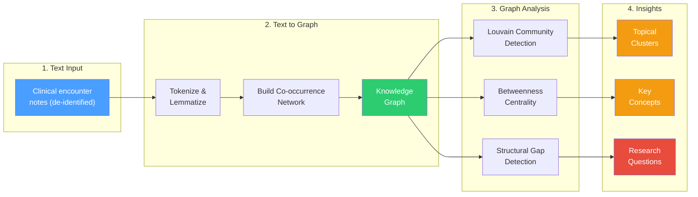
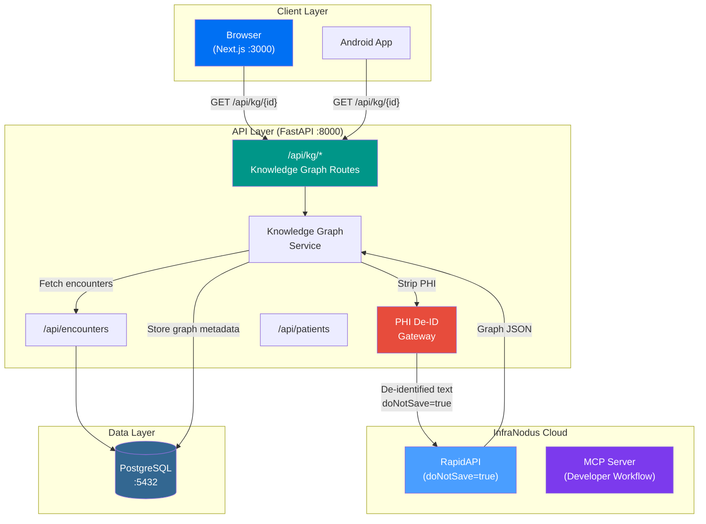

# InfraNodus Developer Onboarding Tutorial

**Welcome to the MPS PMS InfraNodus Integration Team**

This tutorial will take you from zero to building your first clinical text knowledge graph integration with the PMS. By the end, you will understand how text network analysis works, have a running local environment, and have built and tested a custom encounter documentation analyzer end-to-end.

**Document ID:** PMS-EXP-INFRANODUS-002
**Version:** 2.0
**Date:** 2026-03-06
**Applies To:** PMS project (all platforms)
**Prerequisite:** [InfraNodus Setup Guide](41-InfraNodus-PMS-Developer-Setup-Guide.md)
**Estimated time:** 2-3 hours
**Difficulty:** Beginner-friendly

---

## What You Will Learn

1. What text network analysis is and why it matters for clinical documentation
2. How InfraNodus transforms text into knowledge graphs using co-occurrence networks
3. How Louvain community detection identifies topical clusters in clinical notes
4. How structural gaps reveal missing connections in clinical reasoning
5. How to submit clinical text to the InfraNodus Cloud API and interpret the response
6. How to build a patient encounter knowledge graph endpoint
7. How to render an interactive force-directed graph in React
8. How to detect and display documentation gaps with bridging questions
9. How to perform longitudinal analysis across multiple encounters
10. How to ensure HIPAA compliance throughout the pipeline

---

## Part 1: Understanding InfraNodus (15 min read)

### 1.1 What Problem Does InfraNodus Solve?

Imagine a patient with type 2 diabetes, chronic kidney disease, hypertension, and depression who has been seen 47 times over 3 years by 5 different providers. Each encounter generated a clinical note. A new clinician reviewing this patient must read dozens of notes sequentially, mentally tracking how metformin relates to the kidney function decline, how the depression correlates with medication non-adherence, and whether anyone ever connected the persistent fatigue to both the diabetes and the depression.

**Text network analysis solves this by converting all 47 notes into a single visual knowledge graph** where:
- **Nodes** are clinical concepts (symptoms, medications, diagnoses, procedures)
- **Edges** are co-occurrence relationships (concepts mentioned together)
- **Clusters** are topical groups (e.g., the "diabetes management" cluster, the "mental health" cluster)
- **Gaps** are missing connections between clusters that suggest unexplored clinical relationships

Instead of reading 47 notes, the clinician sees a graph with 5 colored clusters, immediately spotting that the "depression" cluster and the "medication adherence" cluster have no connection -- a gap that suggests this relationship has never been documented or addressed.

### 1.2 How InfraNodus Works -- The Key Pieces



**Stage 1 -- Text to Graph**: InfraNodus tokenizes text, removes stop words, and builds a co-occurrence network. If "metformin" and "kidney function" appear within a 4-word window, an edge is created between them. The more often they co-occur, the stronger the edge.

**Stage 2 -- Community Detection**: The Louvain algorithm identifies clusters of densely connected concepts. In clinical text, these clusters naturally correspond to clinical domains: "cardiovascular management," "pain symptoms," "medication list."

**Stage 3 -- Gap & Centrality Analysis**: Betweenness centrality identifies "bridge" concepts that connect multiple clusters (e.g., "fatigue" bridging diabetes and depression). Structural gaps are pairs of clusters with weak or no connections -- these are the insights.

### 1.3 Two Integration Paths

| Feature | Cloud API (RapidAPI) | MCP Server |
|---------|---------------------|------------|
| Use case | PMS backend integration | Developer workflows (Claude Code) |
| Endpoint | `infranodus.p.rapidapi.com` | `npx infranodus-mcp-server` or `mcp.infranodus.com` |
| Authentication | RapidAPI key | InfraNodus API key / OAuth |
| Data safety | `doNotSave=true` parameter | `doNotSave=true` parameter |
| PHI handling | PHI De-ID Gateway required | Never submit PHI via MCP |
| Output | Graph JSON (nodes, edges, clusters, gaps) | Same, plus AI-generated insights |
| Actively maintained | Yes (InfraNodus cloud) | Yes (173 commits, 70+ stars) |
| Pricing | Free tier (~70 requests), paid plans | Included with InfraNodus subscription |

> **Note**: An open-source self-hosted option exists at [github.com/noduslabs/infranodus](https://github.com/noduslabs/infranodus) but was last updated in 2020 and is unsupported. We use the Cloud API for all PMS integration.

### 1.4 How InfraNodus Fits with Other PMS Technologies

| Technology | Experiment | Relationship to InfraNodus |
|------------|-----------|----------------------------|
| **LangGraph** | Exp 26 | InfraNodus *discovers* documentation gaps; LangGraph *acts* on them via automated agent workflows |
| **MCP** | Exp 09 | InfraNodus MCP server enables Claude to query knowledge graphs directly during development |
| **Gemini Interactions API** | Exp 29 | Gap-bridging questions from InfraNodus can be answered by Gemini Deep Research Agent |
| **MedASR / Speechmatics** | Exp 07/10 | Voice transcription feeds text into InfraNodus for real-time encounter graph building |
| **Kintsugi** | Exp 35 | Mental health voice biomarkers could be correlated with depression-cluster gaps in clinical graphs |
| **ExcalidrawSkill** | Exp 40 | Knowledge graphs could be exported to Excalidraw for clinical presentation diagrams |

### 1.5 Key Vocabulary

| Term | Meaning |
|------|---------|
| **Co-occurrence network** | A graph where nodes are words and edges connect words that appear near each other in text |
| **Topical cluster** | A group of densely connected nodes identified by community detection (Louvain algorithm) |
| **Structural gap** | A weak or missing connection between two topical clusters -- potential area for new insight |
| **Betweenness centrality** | A measure of how often a node sits on the shortest path between other nodes -- high centrality = bridge concept |
| **Modularity** | A metric measuring how well a graph decomposes into distinct clusters (0 = random, 1 = perfect separation) |
| **Force-directed layout** | A physics simulation that positions graph nodes so connected nodes attract and unconnected nodes repel |
| **Graph RAG** | Using knowledge graph structure to augment LLM retrieval -- InfraNodus provides graph context for AI reasoning |
| **PHI De-identification** | Removing protected health information (names, dates, MRNs) from text before processing |
| **`doNotSave`** | InfraNodus API parameter that prevents server-side storage of submitted text |

### 1.6 Our Architecture



Key design decisions:
- **PHI never reaches InfraNodus** -- the De-ID Gateway is mandatory, not optional
- **Cloud API with `doNotSave=true`** -- text is processed but never stored on InfraNodus servers
- **Graph metadata in PostgreSQL** -- graph structures persist in PG alongside patient data
- **Same API for browser and Android** -- both consume `/api/kg/*` endpoints

---

## Part 2: Environment Verification (15 min)

### 2.1 Checklist

Run each command and verify the expected output:

```bash
# 1. PMS Backend is running
curl -s http://localhost:8000/health | jq .status
# Expected: "ok"

# 2. PMS Frontend is running
curl -s -o /dev/null -w "%{http_code}" http://localhost:3000
# Expected: 200

# 3. PostgreSQL is accessible
psql -h localhost -p 5432 -U pms_user -d pms_db -c "SELECT version();" 2>/dev/null | head -3
# Expected: PostgreSQL 15.x or higher

# 4. InfraNodus API key is set
echo $INFRANODUS_API_KEY | head -c 10
# Expected: First 10 chars of your key

# 5. InfraNodus Cloud API is responding
curl -s -X POST "https://infranodus.p.rapidapi.com/api/1/graph/graphAndStatements" \
  -H "X-RapidAPI-Key: $INFRANODUS_API_KEY" \
  -H "Content-Type: application/json" \
  -d '{"text": "test", "graphName": "health", "doNotSave": true}' | jq .status
# Expected: some response (not 403)

# 6. D3.js is installed
cd pms-frontend && npm list d3 | grep d3
# Expected: d3@7.x.x
```

### 2.2 Quick Test

Submit a simple clinical text and verify the full pipeline:

```bash
curl -s -X POST http://localhost:8000/api/kg/analyze \
  -H "Content-Type: application/json" \
  -d '{
    "encounter_id": 1,
    "text": "Patient reports persistent headache and fatigue. Blood pressure elevated at 150/95. Started lisinopril 10mg daily. Ordered CBC and metabolic panel."
  }' | jq '{
    has_nodes: (.nodes | length > 0),
    has_edges: (.edges | length > 0),
    has_clusters: (.clusters | length > 0)
  }'
```

Expected output:
```json
{
  "has_nodes": true,
  "has_edges": true,
  "has_clusters": true
}
```

If this works, your environment is ready. Move to Part 3.

---

## Part 3: Build Your First Integration (45 min)

### 3.1 What We Are Building

We'll build a **Clinical Encounter Knowledge Graph Analyzer** -- a feature that takes a patient's encounter notes, generates a knowledge graph via the InfraNodus Cloud API, identifies topical clusters and documentation gaps, and displays the result as an interactive graph with a gap analysis sidebar.

The workflow:
1. User clicks "Analyze Documentation" on a patient's encounter list
2. Backend fetches encounter notes, strips PHI, sends to InfraNodus Cloud API
3. InfraNodus returns graph structure with clusters and gaps
4. Frontend renders the graph and gap panel

### 3.2 Create the encounter text aggregator

In `pms-backend/app/services/knowledge_graph.py`, add a method to aggregate encounter text:

```python
async def aggregate_encounter_text(
    self,
    patient_id: int,
    db_session,
) -> str:
    """Fetch all encounter notes for a patient and combine them."""
    # In production, this queries the encounters table
    # For this tutorial, we use sample data
    sample_encounters = [
        "Initial visit. Patient presents with type 2 diabetes. "
        "HbA1c 8.1%. Started metformin 500mg BID. Diet counseling provided.",

        "Follow-up visit. HbA1c improved to 7.4%. Metformin increased to "
        "1000mg BID. Patient reports occasional dizziness. BP 145/90. "
        "Added lisinopril 10mg.",

        "3-month follow-up. HbA1c 7.0%. BP 130/85. Patient reports "
        "persistent fatigue and low mood. PHQ-9 score 12 (moderate depression). "
        "Referred to behavioral health.",

        "Endocrinology consult. Reviewed diabetes management. Metformin "
        "well-tolerated. Added GLP-1 agonist semaglutide 0.25mg weekly. "
        "Discussed weight management goals.",

        "Behavioral health intake. Patient reports difficulty sleeping, "
        "loss of interest in activities, poor appetite. Stressors include "
        "job loss. Started sertraline 50mg. Follow up in 2 weeks.",
    ]
    return "\n\n---\n\n".join(sample_encounters)
```

### 3.3 Build the analysis endpoint

Update `pms-backend/app/api/routes/knowledge_graph.py`:

```python
@router.post("/analyze/patient/{patient_id}")
async def analyze_patient_documentation(
    patient_id: int,
    kg_service: KnowledgeGraphService = Depends(),
):
    """Analyze all encounter notes for a patient as a unified knowledge graph."""
    # Aggregate encounter text
    combined_text = await kg_service.aggregate_encounter_text(
        patient_id=patient_id,
        db_session=None,  # Pass real session in production
    )

    # Analyze as single graph
    result = await kg_service.analyze_encounter(
        encounter_text=combined_text,
        graph_name=f"patient_{patient_id}_full",
    )

    # Get gaps and advice
    gaps = await kg_service.get_gaps_and_advice(
        text=combined_text,
        graph_name=f"patient_{patient_id}_full",
    )

    return {
        "patient_id": patient_id,
        "graph": result,
        "gaps": gaps,
        "encounter_count": len(combined_text.split("---")),
    }
```

### 3.4 Test the endpoint

```bash
curl -s -X POST http://localhost:8000/api/kg/analyze/patient/1 | jq '{
  patient_id,
  encounter_count,
  node_count: (.graph.nodes | length),
  cluster_count: (.graph.clusters | length),
  gap_count: (.gaps.gaps | length),
  top_concepts: [.graph.nodes | sort_by(-.size) | .[0:5] | .[].label]
}'
```

Expected output (approximate):
```json
{
  "patient_id": 1,
  "encounter_count": 5,
  "node_count": 35,
  "cluster_count": 4,
  "gap_count": 2,
  "top_concepts": ["metformin", "diabetes", "patient", "depression", "fatigue"]
}
```

### 3.5 Interpret the graph

The graph should reveal approximately 4 clusters:

| Cluster | Color | Key Concepts | Clinical Domain |
|---------|-------|--------------|-----------------|
| 0 | Blue | metformin, diabetes, HbA1c, semaglutide | Diabetes management |
| 1 | Red | depression, PHQ-9, sertraline, sleeping | Mental health |
| 2 | Green | lisinopril, BP, dizziness, hypertension | Cardiovascular |
| 3 | Orange | fatigue, appetite, mood, weight | Symptom overlap |

The structural gaps might be:
- **Depression <-> Diabetes**: Documented separately but not connected -- has anyone addressed how depression affects glycemic control?
- **Medication adherence <-> Fatigue**: Fatigue mentioned in multiple clusters but not linked to medication side effects

### 3.6 Build the frontend integration

Create `pms-frontend/src/app/patients/[id]/knowledge-graph/page.tsx`:

```tsx
"use client";

import { useParams } from "next/navigation";
import { GraphVisualization } from "@/components/knowledge-graph/GraphVisualization";
import { GapAnalysisPanel } from "@/components/knowledge-graph/GapAnalysisPanel";

export default function KnowledgeGraphPage() {
  const params = useParams();
  const patientId = Number(params.id);

  return (
    <div className="p-6">
      <h1 className="text-xl font-bold mb-4">
        Clinical Knowledge Graph -- Patient #{patientId}
      </h1>
      <p className="text-sm text-gray-500 mb-6">
        Text network analysis of all encounter documentation.
        Clusters represent clinical topic groups. Gaps indicate
        underdocumented relationships between clinical domains.
      </p>

      <div className="grid grid-cols-1 lg:grid-cols-3 gap-6">
        <div className="lg:col-span-2">
          <GraphVisualization patientId={patientId} />
        </div>
        <div className="space-y-4">
          <GapAnalysisPanel patientId={patientId} />

          <div className="border rounded-lg bg-white shadow-sm p-4">
            <h3 className="text-sm font-semibold text-gray-700 mb-2">
              How to Read This Graph
            </h3>
            <ul className="text-xs text-gray-600 space-y-1">
              <li><strong>Node size</strong> = importance (betweenness centrality)</li>
              <li><strong>Node color</strong> = topical cluster</li>
              <li><strong>Edge thickness</strong> = co-occurrence strength</li>
              <li><strong>Gaps</strong> = missing connections between clusters</li>
              <li>Drag nodes to rearrange. Scroll to zoom.</li>
            </ul>
          </div>
        </div>
      </div>
    </div>
  );
}
```

Navigate to `http://localhost:3000/patients/1/knowledge-graph` to see your graph.

---

## Part 4: Evaluating Strengths and Weaknesses (15 min)

### 4.1 Strengths

- **Unique insight mechanism**: No other tool in the PMS stack provides structural gap detection in clinical documentation. This is genuinely novel for clinical workflows.
- **Cloud API -- no infrastructure**: No graph database to maintain, no Docker containers to manage. API calls with `doNotSave=true` and results cached in PostgreSQL.
- **MCP server**: Direct integration with Claude for developer-facing knowledge graph analysis. Actively maintained (70+ stars, 173 commits).
- **Graph RAG**: Knowledge graph structure augments LLM reasoning quality, providing structured context that flat text search (RAG) misses.
- **API flexibility**: REST API via RapidAPI, MCP server, and n8n/Make.com connectors.
- **AI-generated bridging questions**: The `graphAndAdvice` endpoint generates research questions for structural gaps -- directly actionable for clinicians.

### 4.2 Weaknesses

- **Cloud dependency**: All text analysis requires the InfraNodus cloud API. No viable self-hosted option (open-source repo is from 2020 and unsupported).
- **PHI risk**: Clinical text is sent to a cloud API. Mitigated by PHI De-ID Gateway and `doNotSave=true`, but cloud processing of healthcare text inherently carries risk.
- **Not purpose-built for medical NLP**: InfraNodus uses general NLP. It doesn't understand medical ontologies (SNOMED-CT, ICD-10) natively. Acronyms like "BID" or "PRN" are treated as regular words, not pharmaceutical instructions.
- **Co-occurrence window limitations**: The fixed-window co-occurrence approach may miss clinical relationships that span paragraphs (e.g., a symptom mentioned in HPI and a medication mentioned in the plan).
- **No temporal analysis**: The graph treats all text as simultaneous. It doesn't capture that symptom X appeared before medication Y was started.
- **API rate limits**: Free tier allows ~70 requests. Production use requires a paid plan.

### 4.3 When to Use InfraNodus vs Alternatives

| Scenario | Best Tool | Why |
|----------|-----------|-----|
| Visualize connections in a patient's clinical history | **InfraNodus** | Purpose-built for text network visualization |
| Detect underdocumented clinical relationships | **InfraNodus** | Structural gap detection is unique |
| Automate multi-step clinical workflows | **LangGraph (Exp 26)** | InfraNodus discovers; LangGraph acts |
| Extract structured data from clinical notes | **Gemma 3 / Qwen 3.5 (Exp 13/20)** | Better for NER and structured extraction |
| Build medical knowledge ontologies | **Dedicated medical KG tools** | InfraNodus is general-purpose, not medical ontology-aware |
| Real-time encounter graph during dictation | **InfraNodus + MedASR (Exp 07)** | Combine: MedASR transcribes -> InfraNodus graphs |

### 4.4 HIPAA / Healthcare Considerations

| Concern | Assessment | Mitigation |
|---------|------------|------------|
| **PHI in API calls** | Risk: clinical text sent to cloud | PHI De-ID Gateway is mandatory. `doNotSave=true` prevents storage. |
| **Cloud data retention** | Risk: InfraNodus might store text | Verify `doNotSave` behavior. Review Nodus Labs data policy. |
| **Audit trail** | Requirement: HIPAA access logging | All `/api/kg/*` calls logged with user ID, patient ID, timestamp, operation type |
| **Access control** | Requirement: role-based access | Knowledge graph endpoints require authenticated clinician role |
| **No BAA available** | Risk: HIPAA compliance gap | Document risk. Ensure PHI De-ID strips all identifiers. Consider enterprise tier with isolated server. |

---

## Part 5: Debugging Common Issues (15 min read)

### Issue 1: Graph returns zero nodes

**Symptom**: API returns `{"nodes": [], "edges": []}` for valid text.

**Cause**: Text is too short (< 50 words) or entirely stop words after tokenization.

**Fix**: Ensure encounter text has meaningful clinical content. Minimum recommended input: 100 words. Aggregate multiple encounters for richer graphs.

### Issue 2: All nodes in one cluster

**Symptom**: Graph shows only 1 cluster despite diverse clinical content.

**Cause**: Modularity is too low. The text concepts are too interconnected for Louvain to separate.

**Fix**: Try longer text inputs or analyze encounters separately and compare graphs.

### Issue 3: PHI appears in graph nodes

**Symptom**: Patient name or date appears as a node label.

**Cause**: PHI De-ID Gateway missed a pattern (e.g., unusual name format, non-standard date).

**Fix**: Add the missed pattern to `PHI_PATTERNS` in `phi_deid.py`. Run the PHI audit test:

```bash
python3 -c "
from app.services.phi_deid import deidentify_text
result = deidentify_text('your problematic text here')
print(result['deidentified_text'])
"
```

### Issue 4: API returns 429 (rate limited)

**Symptom**: `429 Too Many Requests` after multiple analysis calls.

**Cause**: Exceeded free tier (~70 requests) or calling too fast.

**Fix**: Implement caching in PostgreSQL -- store graph results and serve from cache for repeated analyses. Upgrade to paid tier for production use.

### Issue 5: D3.js graph overlaps all nodes

**Symptom**: All nodes rendered at the same position.

**Cause**: Force simulation didn't run long enough, or all nodes have identical positions in the data.

**Fix**: Ensure the simulation runs for enough ticks:
```typescript
// In GraphVisualization.tsx, add:
simulation.tick(300); // Pre-run 300 ticks before rendering
```

---

## Part 6: Practice Exercise (45 min)

### Option A: Medication Interaction Graph

Build a specialized graph that only analyzes medication mentions and their co-occurring symptoms/conditions.

**Hints**:
1. Pre-filter encounter text to extract medication-related sentences
2. Submit filtered text to InfraNodus Cloud API
3. Clusters should correspond to therapeutic areas
4. Gaps may reveal undocumented drug interactions

**Steps outline**:
- Create a `medication_filter()` function using regex for drug names
- Build endpoint `POST /api/kg/medications/{patient_id}`
- Render with medication-specific color coding

### Option B: Documentation Quality Scorer

Build a population-level analysis that scores documentation completeness for a cohort.

**Hints**:
1. Batch-analyze encounters for multiple patients (be mindful of API rate limits)
2. Compute per-patient metrics: cluster count, gap density, average betweenness
3. Score documentation quality as inverse of gap density
4. Surface patients with high gap density for review

**Steps outline**:
- Create `batch_analyze()` in Knowledge Graph Service with rate limiting
- Build endpoint `GET /api/kg/quality/cohort`
- Display as sortable table with quality scores

### Option C: Real-Time Encounter Graph

Connect InfraNodus to the live encounter editor so the graph updates as the clinician types.

**Hints**:
1. Use WebSocket (Exp 37) for real-time text streaming
2. Debounce InfraNodus API calls (every 10 seconds to respect rate limits)
3. Animate graph transitions as new nodes/edges appear
4. Highlight newly detected gaps in real time

**Steps outline**:
- Add WebSocket handler for encounter text changes
- Implement debounced graph analysis
- Use D3.js transitions for smooth node/edge updates

---

## Part 7: Development Workflow and Conventions

### 7.1 File Organization

```
pms-backend/
  app/
    services/
      phi_deid.py              # PHI de-identification gateway
      knowledge_graph.py       # InfraNodus Cloud API integration
    api/
      routes/
        knowledge_graph.py     # KG API endpoints
    core/
      config.py                # InfraNodus configuration settings

pms-frontend/
  src/
    components/
      knowledge-graph/
        GraphVisualization.tsx  # D3.js force-directed graph
        GapAnalysisPanel.tsx    # Gap analysis sidebar
    app/
      patients/
        [id]/
          knowledge-graph/
            page.tsx            # Knowledge graph page
```

### 7.2 Naming Conventions

| Item | Convention | Example |
|------|-----------|---------|
| Graph names | `{entity}_{id}_{type}` | `patient_42_longitudinal` |
| API endpoints | `/api/kg/{resource}` | `/api/kg/analyze`, `/api/kg/{id}/gaps` |
| React components | PascalCase in `knowledge-graph/` | `GraphVisualization.tsx` |
| Python services | snake_case | `knowledge_graph.py` |
| Environment vars | `INFRANODUS_` prefix | `INFRANODUS_API_KEY` |

### 7.3 PR Checklist

- [ ] PHI De-ID Gateway tested with new text patterns -- no PHI leaks
- [ ] `doNotSave=true` used for all Cloud API calls
- [ ] HIPAA audit log entry added for new KG operations
- [ ] Graph visualization tested with 1, 5, and 50 encounter inputs
- [ ] D3.js component tested on Chrome, Firefox, Safari
- [ ] Error handling for InfraNodus API timeout and rate limits
- [ ] Graph results cached in PostgreSQL to reduce API calls
- [ ] No PII/PHI in test fixtures committed to repo

### 7.4 Security Reminders

1. **Never bypass the PHI De-ID Gateway** -- all text must be de-identified before API calls, even for testing
2. **Always use `doNotSave=true`** -- never allow InfraNodus to persist clinical text
3. **Rotate InfraNodus API key every 90 days** -- store in environment variables, not in code
4. **Audit log every graph operation** -- user ID + patient ID + timestamp + operation type
5. **Cache graph results** -- reduces API calls and avoids sending the same text repeatedly

---

## Part 8: Quick Reference Card

### Key Commands

```bash
# Test Cloud API directly
curl -s -X POST "https://infranodus.p.rapidapi.com/api/1/graph/graphAndStatements" \
  -H "X-RapidAPI-Key: $INFRANODUS_API_KEY" \
  -H "Content-Type: application/json" \
  -d '{"text": "...", "graphName": "test", "doNotSave": true}'

# Analyze text via PMS backend
curl -X POST http://localhost:8000/api/kg/analyze \
  -H "Content-Type: application/json" \
  -d '{"encounter_id": 1, "text": "..."}'

# Get patient graph
curl http://localhost:8000/api/kg/{patient_id}

# Get gaps
curl http://localhost:8000/api/kg/{patient_id}/gaps
```

### Key Files

| File | Purpose |
|------|---------|
| `app/services/phi_deid.py` | PHI removal |
| `app/services/knowledge_graph.py` | InfraNodus Cloud API client |
| `app/api/routes/knowledge_graph.py` | API endpoints |
| `src/components/knowledge-graph/GraphVisualization.tsx` | D3.js graph |
| `src/components/knowledge-graph/GapAnalysisPanel.tsx` | Gap sidebar |
| `.env` | API keys and config |

### Key URLs

| URL | Purpose |
|-----|---------|
| https://infranodus.com/api | Cloud API docs |
| https://infranodus.com/mcp | MCP server docs |
| https://rapidapi.com/infranodus-infranodus-default/api/infranodus | RapidAPI listing |
| https://github.com/infranodus/mcp-server-infranodus | MCP server repo |
| http://localhost:8000/api/kg/analyze | PMS graph analysis endpoint |
| http://localhost:3000/patients/1/knowledge-graph | Frontend graph view |

### Starter Template

```python
# Minimal InfraNodus analysis
from app.services.knowledge_graph import KnowledgeGraphService

kg = KnowledgeGraphService()

result = await kg.analyze_encounter(
    encounter_text="Patient presents with headache and nausea...",
    graph_name="encounter_1",
)

print(f"Nodes: {len(result['nodes'])}")
print(f"Clusters: {len(result['clusters'])}")
print(f"Gaps: {len(result.get('gaps', []))}")
```

---

## Next Steps

1. Review the [PRD: InfraNodus PMS Integration](41-PRD-InfraNodus-PMS-Integration.md) for full feature scope and implementation phases
2. Explore [LangGraph (Exp 26)](26-LangGraph-Developer-Tutorial.md) to build agents that act on discovered documentation gaps
3. Connect [MedASR (Exp 07)](07-MedASR-Developer-Tutorial.md) transcription output to InfraNodus for real-time encounter graphing
4. Set up the [InfraNodus MCP Server](https://infranodus.com/mcp) for Claude Code integration in your development workflow
5. Read the [InfraNodus academic paper (WWW'19)](https://dl.acm.org/doi/10.1145/3308558.3314123) for graph-theoretic foundations
