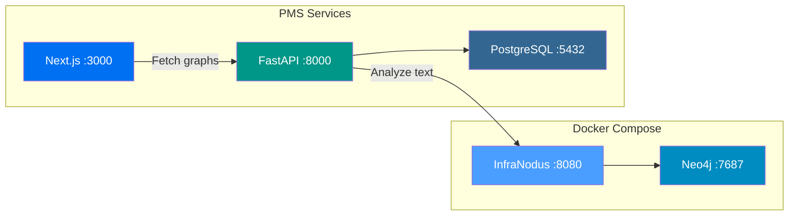

# InfraNodus Setup Guide for PMS Integration

**Document ID:** PMS-EXP-INFRANODUS-001
**Version:** 1.0
**Date:** 2026-03-06
**Applies To:** PMS project (all platforms)
**Prerequisites Level:** Intermediate

---

## Table of Contents

1. [Overview](#1-overview)
2. [Prerequisites](#2-prerequisites)
3. [Part A: Install and Configure InfraNodus](#3-part-a-install-and-configure-infranodus)
4. [Part B: Integrate with PMS Backend](#4-part-b-integrate-with-pms-backend)
5. [Part C: Integrate with PMS Frontend](#5-part-c-integrate-with-pms-frontend)
6. [Part D: Testing and Verification](#6-part-d-testing-and-verification)
7. [Troubleshooting](#7-troubleshooting)
8. [Reference Commands](#8-reference-commands)

---

## 1. Overview

This guide walks you through deploying a self-hosted InfraNodus instance with Neo4j, connecting it to the PMS backend via a Knowledge Graph Service, and adding graph visualization and gap analysis to the PMS frontend.

By the end of this guide you will have:

- A self-hosted InfraNodus + Neo4j running in Docker
- A PHI De-Identification Gateway in the PMS backend
- A Knowledge Graph Service exposing graph analysis endpoints
- A D3.js-based graph visualization component in the PMS frontend
- A gap analysis panel showing structural gaps with AI-generated suggestions



## 2. Prerequisites

### 2.1 Required Software

| Software | Minimum Version | Check Command |
|----------|----------------|---------------|
| Docker | 24.0+ | `docker --version` |
| Docker Compose | 2.20+ | `docker compose version` |
| Node.js | 20.x LTS | `node --version` |
| Python | 3.11+ | `python3 --version` |
| Git | 2.40+ | `git --version` |
| PMS Backend | Current | `curl http://localhost:8000/docs` |
| PMS Frontend | Current | `curl http://localhost:3000` |
| PostgreSQL | 15+ | `psql --version` |

### 2.2 Installation of Prerequisites

**Neo4j (via Docker — no manual install needed)**:
Neo4j is deployed as a Docker container alongside InfraNodus. No separate installation required.

**D3.js (frontend dependency)**:
```bash
cd pms-frontend
npm install d3@7 @types/d3
```

**InfraNodus API key (for cloud fallback)**:
1. Create an account at [infranodus.com](https://infranodus.com)
2. Navigate to Settings → API Access
3. Copy your API token
4. Store in `.env` as `INFRANODUS_API_KEY`

### 2.3 Verify PMS Services

```bash
# Backend health check
curl -s http://localhost:8000/health | jq .

# Frontend accessibility
curl -s -o /dev/null -w "%{http_code}" http://localhost:3000

# PostgreSQL connection
psql -h localhost -p 5432 -U pms_user -d pms_db -c "SELECT 1;"
```

All three should return successful responses before proceeding.

## 3. Part A: Install and Configure InfraNodus

### Step 1: Create Docker Compose extension

Create `docker-compose.infranodus.yml` in the project root:

```yaml
# docker-compose.infranodus.yml
services:
  infranodus:
    image: node:20-slim
    container_name: pms-infranodus
    working_dir: /app
    volumes:
      - ./infranodus-app:/app
    ports:
      - "8080:8080"
    environment:
      - NEO4J_URI=bolt://neo4j:7687
      - NEO4J_USER=neo4j
      - NEO4J_PASSWORD=${NEO4J_PASSWORD:-pms_infra_secure_2026}
      - PORT=8080
      - NODE_ENV=production
    depends_on:
      neo4j:
        condition: service_healthy
    networks:
      - pms-network
    restart: unless-stopped

  neo4j:
    image: neo4j:5-community
    container_name: pms-neo4j
    environment:
      - NEO4J_AUTH=neo4j/${NEO4J_PASSWORD:-pms_infra_secure_2026}
      - NEO4J_PLUGINS=["apoc"]
      - NEO4J_dbms_security_procedures_unrestricted=apoc.*
    volumes:
      - neo4j-data:/data
      - neo4j-logs:/logs
    ports:
      - "7474:7474"   # Browser UI (dev only)
      - "7687:7687"   # Bolt protocol
    healthcheck:
      test: ["CMD", "cypher-shell", "-u", "neo4j", "-p", "${NEO4J_PASSWORD:-pms_infra_secure_2026}", "RETURN 1"]
      interval: 10s
      timeout: 5s
      retries: 5
    networks:
      - pms-network
    restart: unless-stopped

volumes:
  neo4j-data:
  neo4j-logs:

networks:
  pms-network:
    external: true
```

### Step 2: Clone InfraNodus open-source

```bash
git clone https://github.com/noduslabs/infranodus.git infranodus-app
cd infranodus-app
npm install
cd ..
```

### Step 3: Configure environment variables

Add to your project `.env`:

```bash
# InfraNodus Configuration
NEO4J_PASSWORD=pms_infra_secure_2026
INFRANODUS_INTERNAL_URL=http://infranodus:8080
INFRANODUS_API_KEY=your_rapidapi_key_here    # Cloud fallback only
INFRANODUS_DO_NOT_SAVE=true                   # Never persist PHI on cloud
```

### Step 4: Start InfraNodus services

```bash
# Create the shared network if it doesn't exist
docker network create pms-network 2>/dev/null || true

# Start InfraNodus + Neo4j
docker compose -f docker-compose.infranodus.yml up -d

# Watch logs until healthy
docker compose -f docker-compose.infranodus.yml logs -f --tail=50
```

### Step 5: Verify InfraNodus is running

```bash
# Check Neo4j
curl -s http://localhost:7474 | head -5

# Check Neo4j Bolt connectivity
docker exec pms-neo4j cypher-shell -u neo4j -p pms_infra_secure_2026 "RETURN 'Neo4j OK' AS status"
```

**Checkpoint**: Neo4j is running and accessible via Bolt. InfraNodus Node.js app is connected to Neo4j. Both containers are on the `pms-network`.

## 4. Part B: Integrate with PMS Backend

### Step 1: Create the PHI De-Identification Gateway

Create `pms-backend/app/services/phi_deid.py`:

```python
"""PHI De-Identification Gateway for InfraNodus text analysis."""

import re
from typing import Dict, List, Tuple


# PHI patterns to redact
PHI_PATTERNS: List[Tuple[str, str]] = [
    # Names (simplified — production should use NER)
    (r"\b(?:Mr|Mrs|Ms|Dr|Prof)\.?\s+[A-Z][a-z]+(?:\s+[A-Z][a-z]+)*\b", "[PERSON_NAME]"),
    # SSN
    (r"\b\d{3}-\d{2}-\d{4}\b", "[SSN]"),
    # Phone
    (r"\b(?:\+1[-.\s]?)?\(?\d{3}\)?[-.\s]?\d{3}[-.\s]?\d{4}\b", "[PHONE]"),
    # Email
    (r"\b[A-Za-z0-9._%+-]+@[A-Za-z0-9.-]+\.[A-Z|a-z]{2,}\b", "[EMAIL]"),
    # MRN (6-10 digit medical record number)
    (r"\bMRN[:\s#]*\d{6,10}\b", "[MRN]"),
    # Dates (MM/DD/YYYY or YYYY-MM-DD)
    (r"\b\d{1,2}/\d{1,2}/\d{2,4}\b", "[DATE]"),
    (r"\b\d{4}-\d{2}-\d{2}\b", "[DATE]"),
    # Addresses (simplified)
    (r"\b\d{1,5}\s+[A-Z][a-z]+(?:\s+[A-Z][a-z]+)*\s+(?:St|Ave|Blvd|Dr|Ln|Rd|Way|Ct)\b", "[ADDRESS]"),
    # ZIP codes
    (r"\b\d{5}(?:-\d{4})?\b", "[ZIP]"),
]


def deidentify_text(text: str) -> Dict[str, str]:
    """Remove PHI from clinical text. Returns de-identified text and redaction log."""
    redacted = text
    redaction_count = 0

    for pattern, replacement in PHI_PATTERNS:
        matches = re.findall(pattern, redacted)
        redaction_count += len(matches)
        redacted = re.sub(pattern, replacement, redacted)

    return {
        "deidentified_text": redacted,
        "redaction_count": redaction_count,
        "original_length": len(text),
        "deidentified_length": len(redacted),
    }
```

### Step 2: Create the Knowledge Graph Service

Create `pms-backend/app/services/knowledge_graph.py`:

```python
"""Knowledge Graph Service — InfraNodus integration for clinical text analysis."""

import httpx
import logging
from typing import Any, Dict, List, Optional

from app.core.config import settings
from app.services.phi_deid import deidentify_text

logger = logging.getLogger(__name__)


class KnowledgeGraphService:
    """Analyzes clinical text via InfraNodus and returns graph structures."""

    def __init__(self):
        self.internal_url = settings.INFRANODUS_INTERNAL_URL
        self.api_key = settings.INFRANODUS_API_KEY
        self.do_not_save = settings.INFRANODUS_DO_NOT_SAVE

    async def analyze_encounter(
        self,
        encounter_text: str,
        graph_name: str,
        use_cloud_fallback: bool = False,
    ) -> Dict[str, Any]:
        """Analyze a single encounter note and return graph structure."""
        # Step 1: De-identify PHI
        deid_result = deidentify_text(encounter_text)
        clean_text = deid_result["deidentified_text"]

        # Step 2: Submit to InfraNodus
        try:
            if use_cloud_fallback:
                return await self._analyze_cloud(clean_text, graph_name)
            return await self._analyze_self_hosted(clean_text, graph_name)
        except Exception as e:
            logger.error(f"InfraNodus analysis failed: {e}")
            if not use_cloud_fallback:
                logger.info("Falling back to cloud API")
                return await self._analyze_cloud(clean_text, graph_name)
            raise

    async def _analyze_self_hosted(
        self, text: str, graph_name: str
    ) -> Dict[str, Any]:
        """Submit text to self-hosted InfraNodus."""
        async with httpx.AsyncClient(timeout=30.0) as client:
            response = await client.post(
                f"{self.internal_url}/api/graph/analyze",
                json={
                    "text": text,
                    "graphName": graph_name,
                    "language": "en",
                },
            )
            response.raise_for_status()
            return response.json()

    async def _analyze_cloud(
        self, text: str, graph_name: str
    ) -> Dict[str, Any]:
        """Submit text to InfraNodus Cloud API via RapidAPI."""
        async with httpx.AsyncClient(timeout=30.0) as client:
            response = await client.post(
                "https://infranodus.p.rapidapi.com/api/1/graph/graphAndStatements",
                headers={
                    "X-RapidAPI-Key": self.api_key,
                    "Content-Type": "application/json",
                },
                json={
                    "text": text,
                    "graphName": graph_name,
                    "doNotSave": self.do_not_save,
                },
            )
            response.raise_for_status()
            return response.json()

    async def get_gaps(
        self, graph_name: str
    ) -> Dict[str, Any]:
        """Get structural gaps and AI-generated bridging questions."""
        async with httpx.AsyncClient(timeout=30.0) as client:
            response = await client.post(
                f"{self.internal_url}/api/graph/gaps",
                json={"graphName": graph_name},
            )
            response.raise_for_status()
            return response.json()

    async def analyze_longitudinal(
        self,
        encounters: List[Dict[str, str]],
        patient_id: str,
    ) -> Dict[str, Any]:
        """Analyze all encounters for a patient as a unified graph."""
        combined_text = "\n\n---\n\n".join(
            enc["note_text"] for enc in encounters
        )
        graph_name = f"patient_{patient_id}_longitudinal"
        return await self.analyze_encounter(combined_text, graph_name)
```

### Step 3: Create API endpoints

Create `pms-backend/app/api/routes/knowledge_graph.py`:

```python
"""Knowledge Graph API endpoints."""

from fastapi import APIRouter, Depends, HTTPException, status
from pydantic import BaseModel
from typing import List, Optional

from app.services.knowledge_graph import KnowledgeGraphService

router = APIRouter(prefix="/api/kg", tags=["knowledge-graph"])


class AnalyzeRequest(BaseModel):
    encounter_id: int
    text: str


class LongitudinalRequest(BaseModel):
    patient_id: int
    encounter_ids: Optional[List[int]] = None


@router.post("/analyze")
async def analyze_encounter(
    request: AnalyzeRequest,
    kg_service: KnowledgeGraphService = Depends(),
):
    """Analyze a single encounter note as a text network graph."""
    result = await kg_service.analyze_encounter(
        encounter_text=request.text,
        graph_name=f"encounter_{request.encounter_id}",
    )
    return result


@router.get("/{patient_id}")
async def get_patient_graph(
    patient_id: int,
    kg_service: KnowledgeGraphService = Depends(),
):
    """Get the longitudinal knowledge graph for a patient."""
    # In production, fetch encounters from DB
    result = await kg_service.analyze_longitudinal(
        encounters=[],  # Populated from DB in production
        patient_id=str(patient_id),
    )
    return result


@router.get("/{patient_id}/gaps")
async def get_patient_gaps(
    patient_id: int,
    kg_service: KnowledgeGraphService = Depends(),
):
    """Get structural gaps in a patient's clinical documentation."""
    graph_name = f"patient_{patient_id}_longitudinal"
    result = await kg_service.get_gaps(graph_name)
    return result
```

### Step 4: Register the router

Add to `pms-backend/app/main.py`:

```python
from app.api.routes.knowledge_graph import router as kg_router

app.include_router(kg_router)
```

### Step 5: Add configuration settings

Add to `pms-backend/app/core/config.py`:

```python
class Settings(BaseSettings):
    # ... existing settings ...

    # InfraNodus
    INFRANODUS_INTERNAL_URL: str = "http://infranodus:8080"
    INFRANODUS_API_KEY: str = ""
    INFRANODUS_DO_NOT_SAVE: bool = True
```

**Checkpoint**: PMS backend has PHI De-ID Gateway, Knowledge Graph Service, and three API endpoints (`POST /api/kg/analyze`, `GET /api/kg/{patient_id}`, `GET /api/kg/{patient_id}/gaps`). Cloud fallback configured with `doNotSave=true`.

## 5. Part C: Integrate with PMS Frontend

### Step 1: Create the Graph Visualization component

Create `pms-frontend/src/components/knowledge-graph/GraphVisualization.tsx`:

```tsx
"use client";

import React, { useEffect, useRef, useState } from "react";
import * as d3 from "d3";

interface GraphNode {
  id: string;
  label: string;
  cluster: number;
  size: number; // betweenness centrality
}

interface GraphEdge {
  source: string;
  target: string;
  weight: number;
}

interface GraphData {
  nodes: GraphNode[];
  edges: GraphEdge[];
  clusters: { id: number; label: string; color: string }[];
  gaps: { cluster1: number; cluster2: number; question: string }[];
}

interface Props {
  patientId: number;
}

const CLUSTER_COLORS = [
  "#4a9eff", "#e74c3c", "#2ecc71", "#f39c12",
  "#9b59b6", "#1abc9c", "#e67e22", "#3498db",
];

export function GraphVisualization({ patientId }: Props) {
  const svgRef = useRef<SVGSVGElement>(null);
  const [graphData, setGraphData] = useState<GraphData | null>(null);
  const [loading, setLoading] = useState(true);
  const [error, setError] = useState<string | null>(null);

  useEffect(() => {
    async function fetchGraph() {
      try {
        const res = await fetch(`/api/kg/${patientId}`);
        if (!res.ok) throw new Error("Failed to fetch graph");
        const data = await res.json();
        setGraphData(data);
      } catch (err) {
        setError(err instanceof Error ? err.message : "Unknown error");
      } finally {
        setLoading(false);
      }
    }
    fetchGraph();
  }, [patientId]);

  useEffect(() => {
    if (!graphData || !svgRef.current) return;

    const svg = d3.select(svgRef.current);
    const width = 800;
    const height = 600;

    svg.selectAll("*").remove();
    svg.attr("viewBox", `0 0 ${width} ${height}`);

    const g = svg.append("g");

    // Zoom behavior
    const zoom = d3.zoom<SVGSVGElement, unknown>()
      .scaleExtent([0.3, 5])
      .on("zoom", (event) => g.attr("transform", event.transform));
    svg.call(zoom);

    // Force simulation
    const simulation = d3.forceSimulation(graphData.nodes as any)
      .force("link", d3.forceLink(graphData.edges as any)
        .id((d: any) => d.id)
        .distance(80))
      .force("charge", d3.forceManyBody().strength(-200))
      .force("center", d3.forceCenter(width / 2, height / 2))
      .force("collision", d3.forceCollide().radius(30));

    // Draw edges
    const links = g.selectAll("line")
      .data(graphData.edges)
      .join("line")
      .attr("stroke", "#999")
      .attr("stroke-opacity", 0.4)
      .attr("stroke-width", (d) => Math.sqrt(d.weight));

    // Draw nodes
    const nodes = g.selectAll("circle")
      .data(graphData.nodes)
      .join("circle")
      .attr("r", (d) => 5 + d.size * 15)
      .attr("fill", (d) => CLUSTER_COLORS[d.cluster % CLUSTER_COLORS.length])
      .attr("stroke", "#fff")
      .attr("stroke-width", 1.5)
      .call(d3.drag<SVGCircleElement, GraphNode>()
        .on("start", (event, d: any) => {
          if (!event.active) simulation.alphaTarget(0.3).restart();
          d.fx = d.x;
          d.fy = d.y;
        })
        .on("drag", (event, d: any) => {
          d.fx = event.x;
          d.fy = event.y;
        })
        .on("end", (event, d: any) => {
          if (!event.active) simulation.alphaTarget(0);
          d.fx = null;
          d.fy = null;
        }) as any);

    // Node labels
    const labels = g.selectAll("text")
      .data(graphData.nodes)
      .join("text")
      .text((d) => d.label)
      .attr("font-size", 10)
      .attr("dx", 12)
      .attr("dy", 4)
      .attr("fill", "#374151");

    // Tooltip
    nodes.append("title").text((d) => `${d.label} (cluster ${d.cluster})`);

    // Tick
    simulation.on("tick", () => {
      links
        .attr("x1", (d: any) => d.source.x)
        .attr("y1", (d: any) => d.source.y)
        .attr("x2", (d: any) => d.target.x)
        .attr("y2", (d: any) => d.target.y);
      nodes
        .attr("cx", (d: any) => d.x)
        .attr("cy", (d: any) => d.y);
      labels
        .attr("x", (d: any) => d.x)
        .attr("y", (d: any) => d.y);
    });

    return () => { simulation.stop(); };
  }, [graphData]);

  if (loading) return <div className="p-4 text-gray-500">Loading knowledge graph...</div>;
  if (error) return <div className="p-4 text-red-500">Error: {error}</div>;

  return (
    <div className="border rounded-lg bg-white shadow-sm">
      <div className="p-3 border-b">
        <h3 className="text-sm font-semibold text-gray-700">
          Clinical Knowledge Graph
        </h3>
        <p className="text-xs text-gray-500">
          Nodes = clinical concepts. Colors = topical clusters. Size = importance.
        </p>
      </div>
      <svg ref={svgRef} className="w-full" style={{ height: 600 }} />
    </div>
  );
}
```

### Step 2: Create the Gap Analysis Panel

Create `pms-frontend/src/components/knowledge-graph/GapAnalysisPanel.tsx`:

```tsx
"use client";

import React, { useEffect, useState } from "react";

interface Gap {
  cluster1_label: string;
  cluster2_label: string;
  gap_score: number;
  suggested_question: string;
}

interface Props {
  patientId: number;
}

export function GapAnalysisPanel({ patientId }: Props) {
  const [gaps, setGaps] = useState<Gap[]>([]);
  const [loading, setLoading] = useState(true);

  useEffect(() => {
    async function fetchGaps() {
      try {
        const res = await fetch(`/api/kg/${patientId}/gaps`);
        if (!res.ok) throw new Error("Failed to fetch gaps");
        const data = await res.json();
        setGaps(data.gaps || []);
      } catch {
        setGaps([]);
      } finally {
        setLoading(false);
      }
    }
    fetchGaps();
  }, [patientId]);

  if (loading) return <div className="p-4 text-gray-500">Analyzing documentation gaps...</div>;

  return (
    <div className="border rounded-lg bg-white shadow-sm">
      <div className="p-3 border-b">
        <h3 className="text-sm font-semibold text-gray-700">
          Documentation Gaps
        </h3>
        <p className="text-xs text-gray-500">
          Structural gaps between clinical topic clusters
        </p>
      </div>
      <div className="p-3 space-y-3">
        {gaps.length === 0 ? (
          <p className="text-sm text-green-600">No significant gaps detected.</p>
        ) : (
          gaps.map((gap, i) => (
            <div key={i} className="p-3 bg-amber-50 border border-amber-200 rounded text-sm">
              <div className="flex items-center gap-2 mb-1">
                <span className="font-medium text-amber-800">
                  {gap.cluster1_label}
                </span>
                <span className="text-amber-400">↔</span>
                <span className="font-medium text-amber-800">
                  {gap.cluster2_label}
                </span>
                <span className="ml-auto text-xs text-amber-600">
                  Gap: {(gap.gap_score * 100).toFixed(0)}%
                </span>
              </div>
              <p className="text-amber-700 text-xs italic">
                {gap.suggested_question}
              </p>
            </div>
          ))
        )}
      </div>
    </div>
  );
}
```

### Step 3: Add to patient detail page

In your patient detail page component, add:

```tsx
import { GraphVisualization } from "@/components/knowledge-graph/GraphVisualization";
import { GapAnalysisPanel } from "@/components/knowledge-graph/GapAnalysisPanel";

// Inside your patient detail layout:
<div className="grid grid-cols-3 gap-4">
  <div className="col-span-2">
    <GraphVisualization patientId={patient.id} />
  </div>
  <div>
    <GapAnalysisPanel patientId={patient.id} />
  </div>
</div>
```

### Step 4: Add environment variables

Add to `pms-frontend/.env.local`:

```bash
# Knowledge Graph API (proxied through Next.js API routes to backend)
NEXT_PUBLIC_KG_ENABLED=true
```

**Checkpoint**: PMS frontend has a D3.js graph visualization component and a gap analysis panel. Both fetch data from the PMS backend Knowledge Graph endpoints. The graph is interactive (zoom, drag, tooltips).

## 6. Part D: Testing and Verification

### Service Health Checks

```bash
# 1. Neo4j health
docker exec pms-neo4j cypher-shell \
  -u neo4j -p pms_infra_secure_2026 \
  "RETURN 'healthy' AS status"
# Expected: healthy

# 2. InfraNodus health
curl -s http://localhost:8080/health
# Expected: {"status":"ok"}

# 3. PMS Backend KG endpoints
curl -s http://localhost:8000/api/kg/1 | jq .status
# Expected: graph data or empty result

# 4. PHI De-ID test
curl -s -X POST http://localhost:8000/api/kg/analyze \
  -H "Content-Type: application/json" \
  -d '{
    "encounter_id": 1,
    "text": "Mr. John Smith (MRN: 12345678) presents with headache and fatigue. BP 140/90. Started on lisinopril 10mg. Follow up 01/15/2026."
  }' | jq .
# Expected: Graph response with no PHI in node labels
```

### Functional Tests

```bash
# Test PHI de-identification
python3 -c "
from app.services.phi_deid import deidentify_text
result = deidentify_text('Mr. John Smith MRN: 12345678 born 01/15/1990')
print(result)
assert '[PERSON_NAME]' in result['deidentified_text']
assert '[MRN]' in result['deidentified_text']
assert '[DATE]' in result['deidentified_text']
assert 'John Smith' not in result['deidentified_text']
print('PHI De-ID: PASS')
"
```

### Integration Test

```bash
# End-to-end: submit clinical text, verify graph response
curl -s -X POST http://localhost:8000/api/kg/analyze \
  -H "Content-Type: application/json" \
  -d '{
    "encounter_id": 999,
    "text": "Patient presents with chronic lower back pain radiating to left leg. History of type 2 diabetes mellitus managed with metformin 1000mg BID. Recent HbA1c 7.2%. MRI lumbar spine shows L4-L5 disc herniation. Physical therapy recommended. Consider epidural steroid injection if no improvement in 4 weeks."
  }' | jq '{
    node_count: (.nodes | length),
    edge_count: (.edges | length),
    cluster_count: (.clusters | length),
    gap_count: (.gaps | length)
  }'
# Expected: Non-zero counts for nodes, edges, and clusters
```

**Checkpoint**: All services running, PHI de-identification verified, graph analysis returning structured data, no PHI in graph output.

## 7. Troubleshooting

### Neo4j fails to start

**Symptom**: `pms-neo4j` container exits immediately or health check fails.

**Solution**:
```bash
# Check logs
docker logs pms-neo4j

# Common fix: permission issue on data volume
docker volume rm neo4j-data
docker compose -f docker-compose.infranodus.yml up -d neo4j
```

### InfraNodus cannot connect to Neo4j

**Symptom**: InfraNodus logs show `ServiceUnavailable: Could not connect to Neo4j`.

**Solution**:
```bash
# Verify Neo4j is on the same network
docker network inspect pms-network | grep -A5 neo4j

# Verify Neo4j bolt port
docker exec pms-neo4j cypher-shell -u neo4j -p pms_infra_secure_2026 "RETURN 1"

# Restart InfraNodus after Neo4j is healthy
docker restart pms-infranodus
```

### Port 8080 conflict

**Symptom**: `Bind for 0.0.0.0:8080 failed: port is already allocated`.

**Solution**:
```bash
# Find what's using port 8080
lsof -i :8080

# Change InfraNodus port in docker-compose.infranodus.yml
ports:
  - "8081:8080"

# Update INFRANODUS_INTERNAL_URL in .env
INFRANODUS_INTERNAL_URL=http://infranodus:8080  # Internal port stays the same
```

### Graph visualization not rendering

**Symptom**: Blank SVG in the frontend.

**Solution**:
```bash
# Verify D3.js is installed
cd pms-frontend && npm list d3

# Check browser console for errors
# Common issue: CORS — ensure backend allows frontend origin

# Verify API returns data
curl -s http://localhost:8000/api/kg/1 | jq '.nodes | length'
```

### Cloud API returns 403

**Symptom**: `403 Forbidden` when using cloud fallback.

**Solution**:
```bash
# Verify API key
echo $INFRANODUS_API_KEY

# Test directly
curl -s -H "X-RapidAPI-Key: $INFRANODUS_API_KEY" \
  https://infranodus.p.rapidapi.com/api/1/status
```

## 8. Reference Commands

### Daily Development

```bash
# Start InfraNodus stack
docker compose -f docker-compose.infranodus.yml up -d

# Stop InfraNodus stack
docker compose -f docker-compose.infranodus.yml down

# View logs
docker compose -f docker-compose.infranodus.yml logs -f infranodus

# Neo4j browser (dev only)
open http://localhost:7474
```

### Management Commands

```bash
# Clear all graph data (development only!)
docker exec pms-neo4j cypher-shell \
  -u neo4j -p pms_infra_secure_2026 \
  "MATCH (n) DETACH DELETE n"

# Export graph data
docker exec pms-neo4j cypher-shell \
  -u neo4j -p pms_infra_secure_2026 \
  "MATCH (n)-[r]->(m) RETURN n, r, m LIMIT 100" \
  --format plain > graph_export.txt

# Check graph node count
docker exec pms-neo4j cypher-shell \
  -u neo4j -p pms_infra_secure_2026 \
  "MATCH (n) RETURN count(n) AS node_count"
```

### Useful URLs

| Service | URL | Purpose |
|---------|-----|---------|
| InfraNodus App | http://localhost:8080 | Self-hosted UI |
| Neo4j Browser | http://localhost:7474 | Graph database admin |
| PMS Backend API Docs | http://localhost:8000/docs | Swagger UI with KG endpoints |
| PMS Frontend | http://localhost:3000 | Graph visualization in patient view |
| InfraNodus Cloud API | https://infranodus.com/api | API documentation |
| InfraNodus MCP Server | https://infranodus.com/mcp | MCP integration guide |

## Next Steps

1. Complete the [InfraNodus Developer Tutorial](41-InfraNodus-Developer-Tutorial.md) to build your first clinical knowledge graph integration end-to-end
2. Review the [PRD: InfraNodus PMS Integration](41-PRD-InfraNodus-PMS-Integration.md) for full feature scope
3. Explore [LangGraph integration (Exp 26)](26-LangGraph-PMS-Developer-Setup-Guide.md) to trigger automated workflows from detected documentation gaps
4. Configure the [InfraNodus MCP Server](https://infranodus.com/mcp) for Claude Code developer workflows

## Resources

- [InfraNodus Official Documentation](https://infranodus.com/docs)
- [InfraNodus GitHub Repository](https://github.com/noduslabs/infranodus)
- [InfraNodus API Reference](https://infranodus.com/api)
- [InfraNodus MCP Server](https://github.com/infranodus/mcp-server-infranodus)
- [Neo4j Documentation](https://neo4j.com/docs/)
- [D3.js Force-Directed Graph](https://d3js.org/d3-force)
- [InfraNodus Support Center](https://support.noduslabs.com/)
