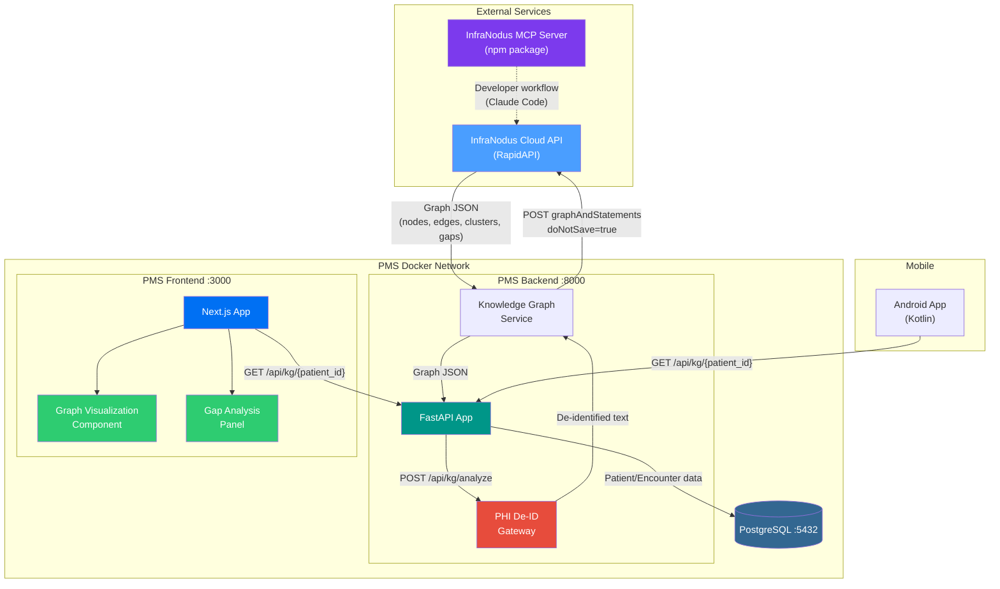

# Product Requirements Document: InfraNodus Integration into Patient Management System (PMS)

**Document ID:** PRD-PMS-INFRANODUS-001
**Version:** 2.0
**Date:** 2026-03-06
**Author:** Ammar (CEO, MPS Inc.)
**Status:** Draft

---

## 1. Executive Summary

InfraNodus is a text network analysis and knowledge graph visualization platform that transforms unstructured text into interactive network graphs, revealing topical clusters, structural gaps, and latent connections. Built on graph theory and NLP, it represents words as nodes and their co-occurrences as edges, then applies community detection algorithms (Louvain) and force-layout positioning to surface the dominant themes, blind spots, and unexplored research directions within any body of text.

Integrating InfraNodus into the PMS enables clinical teams to visualize and analyze the discourse captured in patient encounter notes, clinical documentation, and medication histories as knowledge graphs. This reveals hidden connections between symptoms, diagnoses, and treatments that linear text obscures -- identifying gaps in clinical reasoning, surfacing undocumented medication interactions, and providing a structural overview of a patient's clinical narrative across encounters.

Two integration paths are available:

1. **Cloud API via RapidAPI** (primary): The InfraNodus REST API at `infranodus.p.rapidapi.com` accepts text via POST and returns graph JSON with nodes, edges, topical clusters, structural gaps, and AI-generated insights. The `doNotSave=true` parameter prevents server-side storage of submitted text. Combined with the mandatory PHI De-Identification Gateway, this provides the clinical text analysis capability without retaining patient data on external servers.

2. **MCP Server** (developer integration): The actively maintained `infranodus-mcp-server` npm package ([GitHub](https://github.com/infranodus/mcp-server-infranodus)) provides direct LLM integration, enabling Claude Code and other MCP-compatible tools to query InfraNodus knowledge graphs during development and clinical workflow design.

> **Note on self-hosted option**: An open-source InfraNodus repository exists at [github.com/noduslabs/infranodus](https://github.com/noduslabs/infranodus) (AGPLv3), but it was **last updated in 2020** and is explicitly unsupported by Nodus Labs. It lacks the current AI capabilities, graph algorithms, and API features of the cloud version. It is not recommended for production use.

## 2. Problem Statement

Clinical documentation in the PMS contains rich, interconnected information -- symptoms, diagnoses, medications, lab results, and care plans -- but this information is consumed linearly, one encounter note at a time. Clinicians reviewing a patient with a complex history (multiple chronic conditions, polypharmacy, numerous specialist visits) must mentally reconstruct the connections between disparate notes. Key relationships between symptoms and medications, gaps in documentation, and emerging patterns across encounters remain invisible in traditional text-based EHR views.

Specific bottlenecks this integration addresses:

- **Longitudinal pattern blindness**: No way to visualize how clinical concepts (symptoms, diagnoses, medications) relate across a patient's full encounter history
- **Documentation gap detection**: No systematic method to identify missing elements in clinical notes (e.g., undocumented medication rationale, missing follow-up plans)
- **Clinical reasoning support**: No tool to help clinicians see structural gaps between symptom clusters and diagnosis clusters that may indicate unexplored differential diagnoses
- **Population-level discourse analysis**: No way to analyze the topical structure of clinical documentation across patient cohorts to identify documentation quality patterns or training needs

## 3. Proposed Solution

### 3.1 Architecture Overview

### 3.2 Deployment Model

- **Primary -- Cloud API via RapidAPI**: All text analysis handled by InfraNodus cloud. The `doNotSave=true` parameter prevents server-side data retention. PHI De-ID Gateway strips patient identifiers before any text leaves the PMS network.
- **MCP Server**: The `infranodus-mcp-server` npm package provides Claude Code integration for developer-facing knowledge graph analysis of clinical workflow design and codebase documentation.
- **Graph metadata in PostgreSQL**: Graph structures (nodes, edges, clusters, gaps) returned by the API are persisted in PostgreSQL alongside patient/encounter data. No external graph database required.
- **HIPAA compliance**: PHI De-ID Gateway is mandatory for all API calls. `doNotSave=true` prevents cloud retention. All graph operations logged to HIPAA audit table. Graph metadata encrypted at rest in PostgreSQL.

## 4. PMS Data Sources

| PMS API | Relevance | Usage |
|---------|-----------|-------|
| **Patient Records API** (`/api/patients`) | High | Retrieve patient demographics for encounter context. Patient IDs used as graph namespace keys. |
| **Encounter Records API** (`/api/encounters`) | Critical | Primary text source. Each encounter note is analyzed as a text network. Longitudinal analysis aggregates all encounters for a patient. |
| **Medication & Prescription API** (`/api/prescriptions`) | High | Medication names injected as seed nodes. Drug interaction patterns detected via graph community analysis. |
| **Reporting API** (`/api/reports`) | Medium | Population-level documentation analysis. Aggregate graph metrics (gap density, cluster count) fed into quality reports. |

## 5. Component/Module Definitions

### 5.1 PHI De-Identification Gateway

- **Description**: Middleware that strips PHI (names, dates, MRNs, addresses) from clinical text before submission to the InfraNodus cloud API. Uses regex patterns and NER-based entity detection.
- **Input**: Raw encounter note text from `/api/encounters`
- **Output**: De-identified text with PHI tokens replaced by category placeholders (e.g., `[PATIENT_NAME]`, `[DATE]`)
- **PMS APIs**: Encounter Records API

### 5.2 Knowledge Graph Service

- **Description**: FastAPI service that submits de-identified text to the InfraNodus Cloud API via RapidAPI, receives graph JSON (nodes, edges, clusters, gaps), and persists graph metadata in PostgreSQL.
- **Input**: De-identified encounter text, patient graph namespace
- **Output**: Graph JSON with topical clusters, key concepts, structural gaps, and network metrics (betweenness centrality, modularity)
- **PMS APIs**: Encounter Records API, Patient Records API
- **API parameters**: Always includes `doNotSave=true` to prevent cloud data retention

### 5.3 Graph Visualization Component

- **Description**: React component rendering the InfraNodus knowledge graph using D3.js force-directed layout. Nodes colored by topical cluster, sized by betweenness centrality. Interactive zoom, filter by cluster, and time-range selection.
- **Input**: Graph JSON from `/api/kg/{patient_id}`
- **Output**: Interactive SVG graph visualization in the patient detail view
- **PMS APIs**: Patient Records API (for context), Knowledge Graph Service API

### 5.4 Gap Analysis Panel

- **Description**: Sidebar panel displaying structural gaps identified by InfraNodus -- pairs of topical clusters with weak or missing connections. Each gap includes AI-generated research questions suggesting what clinical documentation might bridge the gap.
- **Input**: Gap data from graph analysis, AI-generated questions from InfraNodus `graphAndAdvice` endpoint
- **Output**: Prioritized list of documentation gaps with suggested actions
- **PMS APIs**: Encounter Records API, Knowledge Graph Service API

### 5.5 Population Graph Analytics

- **Description**: Batch analysis of encounter documentation across patient cohorts. Produces aggregate metrics: average cluster count per encounter, gap density trends, documentation completeness scores.
- **Input**: Batch encounter texts from Reporting API
- **Output**: Aggregate graph metrics and quality scores for `/api/reports`
- **PMS APIs**: Reporting API, Encounter Records API

## 6. Non-Functional Requirements

### 6.1 Security and HIPAA Compliance

- All clinical text must pass through PHI De-ID Gateway before any API call to InfraNodus
- Cloud API must always use `doNotSave=true` parameter -- verify via API response headers
- All graph operations logged to HIPAA audit table with user ID, timestamp, patient ID, and operation type
- Graph metadata stored in PostgreSQL must be encrypted at rest (AES-256)
- API key stored in environment variables, rotated every 90 days
- No raw clinical text stored outside the PMS network -- only de-identified graph structures persist

### 6.2 Performance

| Metric | Target |
|--------|--------|
| Single encounter graph generation | < 3 seconds |
| Longitudinal graph (50 encounters) | < 15 seconds |
| Graph visualization render | < 1 second |
| Population batch (100 patients) | < 5 minutes |

### 6.3 Infrastructure

- **Cloud API**: Outbound HTTPS to `infranodus.p.rapidapi.com` required. No local graph database needed.
- **MCP Server**: `npx infranodus-mcp-server` for developer workflows. Requires InfraNodus API key.
- **Storage**: Graph metadata persisted in PostgreSQL. ~1KB per encounter graph. Minimal overhead.

## 7. Implementation Phases

### Phase 1: Foundation (Sprints 1-2)

- Configure InfraNodus Cloud API access via RapidAPI
- Implement PHI De-ID Gateway
- Build Knowledge Graph Service with single-encounter analysis
- API endpoints: `POST /api/kg/analyze`, `GET /api/kg/{patient_id}`
- Persist graph metadata in PostgreSQL

### Phase 2: Visualization & Gap Analysis (Sprints 3-4)

- Build D3.js Graph Visualization Component
- Implement Gap Analysis Panel with AI-generated research questions
- Integrate into patient detail view on frontend
- Add longitudinal multi-encounter graph analysis

### Phase 3: Population Analytics & MCP (Sprints 5-6)

- Build Population Graph Analytics batch pipeline
- Integrate graph metrics into Reporting API
- Configure InfraNodus MCP server for developer workflows
- Android app: read-only graph visualization via WebView

## 8. Success Metrics

| Metric | Target | Measurement |
|--------|--------|-------------|
| Documentation gap detection rate | >80% of known gaps identified | Compare against manual clinician review of 50 charts |
| Clinician adoption | >40% of clinicians use graph view weekly | Usage analytics on Graph Visualization Component |
| Graph generation latency | <3s for single encounter | APM monitoring on Knowledge Graph Service |
| Documentation completeness improvement | >15% reduction in gap density over 3 months | Population Graph Analytics trend |
| Clinician satisfaction | >4.0/5.0 on usability survey | Quarterly survey |

## 9. Risks and Mitigations

| Risk | Impact | Mitigation |
|------|--------|------------|
| PHI leakage via graph analysis | Critical -- HIPAA violation | PHI De-ID Gateway is mandatory. `doNotSave=true` for all API calls. Quarterly PHI audit. |
| Cloud API unavailability | Medium -- screening capability blocked | Monitor API health. Implement request queuing and retry logic. Cache recent graph results in PostgreSQL. |
| Clinical relevance of structural gaps | Medium -- false positive gaps | Clinician validation of gap suggestions. Feedback loop to tune gap detection thresholds. |
| RapidAPI pricing changes | Medium -- cost escalation | Monitor usage. Evaluate InfraNodus direct API pricing tiers. Budget for ~70 free requests then paid tier. |
| Cloud API lacks `doNotSave` enforcement | Medium -- data retention risk | Verify `doNotSave` behavior via API response headers. Audit Nodus Labs data handling policy quarterly. |
| Developer unfamiliarity with graph theory | Low -- slower adoption | Developer tutorial covers graph fundamentals. Pre-built query templates. |

## 10. Dependencies

| Dependency | Version | Purpose |
|------------|---------|---------|
| InfraNodus Cloud API (RapidAPI) | Current | Primary text network analysis engine |
| InfraNodus MCP Server | `infranodus-mcp-server` (npm) | Developer workflow integration with Claude |
| D3.js | 7.x | Graph visualization in React frontend |
| PMS Backend (FastAPI) | Current | API gateway for graph operations |
| PMS Frontend (Next.js) | Current | Graph visualization and gap analysis UI |
| PostgreSQL | 15+ | Graph metadata persistence and audit logging |

## 11. Comparison with Existing Experiments

| Aspect | InfraNodus (Exp 41) | LangGraph (Exp 26) | Gemini Interactions API (Exp 29) |
|--------|---------------------|---------------------|----------------------------------|
| **Core function** | Text network analysis & visualization | Stateful agent orchestration | Cloud-hosted agentic research |
| **Data representation** | Knowledge graph (nodes = words, edges = co-occurrence) | State graph (nodes = agent states, edges = transitions) | Conversational turns with structured extraction |
| **Clinical value** | Pattern discovery, gap detection, documentation quality | Workflow automation, multi-step clinical tasks | Evidence synthesis, deep research |
| **PHI handling** | Cloud API with De-ID Gateway + `doNotSave=true` | In-process (no external calls) | Cloud with de-identification |
| **Complementarity** | InfraNodus *discovers patterns* in clinical text; LangGraph *acts on* those patterns via automated workflows; Gemini Deep Research *enriches* gap-bridging with external evidence |

InfraNodus is complementary to LangGraph (Exp 26): InfraNodus identifies structural gaps in clinical documentation, and LangGraph agents can be triggered to automatically fill those gaps (e.g., ordering a missing lab, scheduling a follow-up). Combined with the Gemini Interactions API (Exp 29), the gap-bridging research questions generated by InfraNodus can be answered by Deep Research Agent, creating a discovery -> research -> action pipeline.

## 12. Research Sources

### Official Documentation
- [InfraNodus -- How It Works](https://infranodus.com/about/how-it-works) -- Core architecture: text-to-graph transformation, Louvain clustering, force-layout
- [InfraNodus API Documentation](https://infranodus.com/api) -- REST API endpoints, authentication, `doNotSave` parameter, response schemas
- [InfraNodus on RapidAPI](https://rapidapi.com/infranodus-infranodus-default/api/infranodus) -- Cloud API marketplace listing

### MCP Server
- [InfraNodus MCP Server (GitHub)](https://github.com/infranodus/mcp-server-infranodus) -- Actively maintained, 70+ stars, 173 commits, npm package
- [InfraNodus MCP Setup Guide](https://infranodus.com/mcp) -- MCP integration with Claude, Cursor, VSCode

### Architecture & Specification
- [InfraNodus: Generating Insight Using Text Network Analysis (WWW'19)](https://dl.acm.org/doi/10.1145/3308558.3314123) -- Academic paper: graph-theoretic foundations, betweenness centrality for insight generation

### Security & Compliance
- [InfraNodus API Access Points](https://support.noduslabs.com/hc/en-us/articles/13605983537692-InfraNodus-API-Access-Points) -- API key management, `doNotSave` data handling guarantees
- [InfraNodus Pricing & Enterprise](https://support.noduslabs.com/hc/en-us/articles/15670160113564-Why-is-InfraNodus-not-free-or-doesn-t-cost-5) -- Pricing tiers, enterprise options with isolated server deployment

### Ecosystem & Adoption
- [GraphRAG: Optimize Your LLM with Knowledge Graphs](https://infranodus.com/use-case/ai-knowledge-graphs) -- Graph RAG approach for augmenting LLM responses
- [Patient-Centric Knowledge Graphs Survey (PMC)](https://pmc.ncbi.nlm.nih.gov/articles/PMC11558794/) -- Academic review of knowledge graphs in healthcare

### Open-Source (Reference Only)
- [InfraNodus GitHub Repository](https://github.com/noduslabs/infranodus) -- Open-source codebase (AGPLv3, **last updated 2020, unsupported**). Reference only -- not recommended for production deployment.

## 13. Appendix: Related Documents

- [InfraNodus Setup Guide](41-InfraNodus-PMS-Developer-Setup-Guide.md)
- [InfraNodus Developer Tutorial](41-InfraNodus-Developer-Tutorial.md)
- [LangGraph PMS Integration (Exp 26)](26-PRD-LangGraph-PMS-Integration.md)
- [MCP PMS Integration (Exp 09)](09-PRD-MCP-PMS-Integration.md)
- [Gemini Interactions API (Exp 29)](29-PRD-GeminiInteractions-PMS-Integration.md)
- [InfraNodus Official Docs](https://infranodus.com/docs)
- [InfraNodus API](https://infranodus.com/api)
