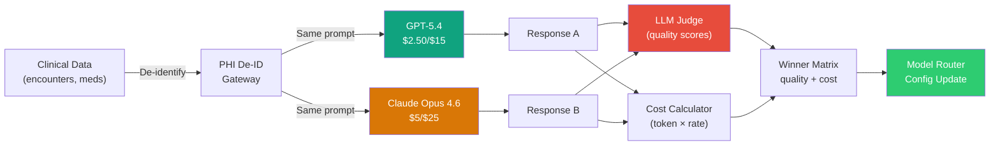
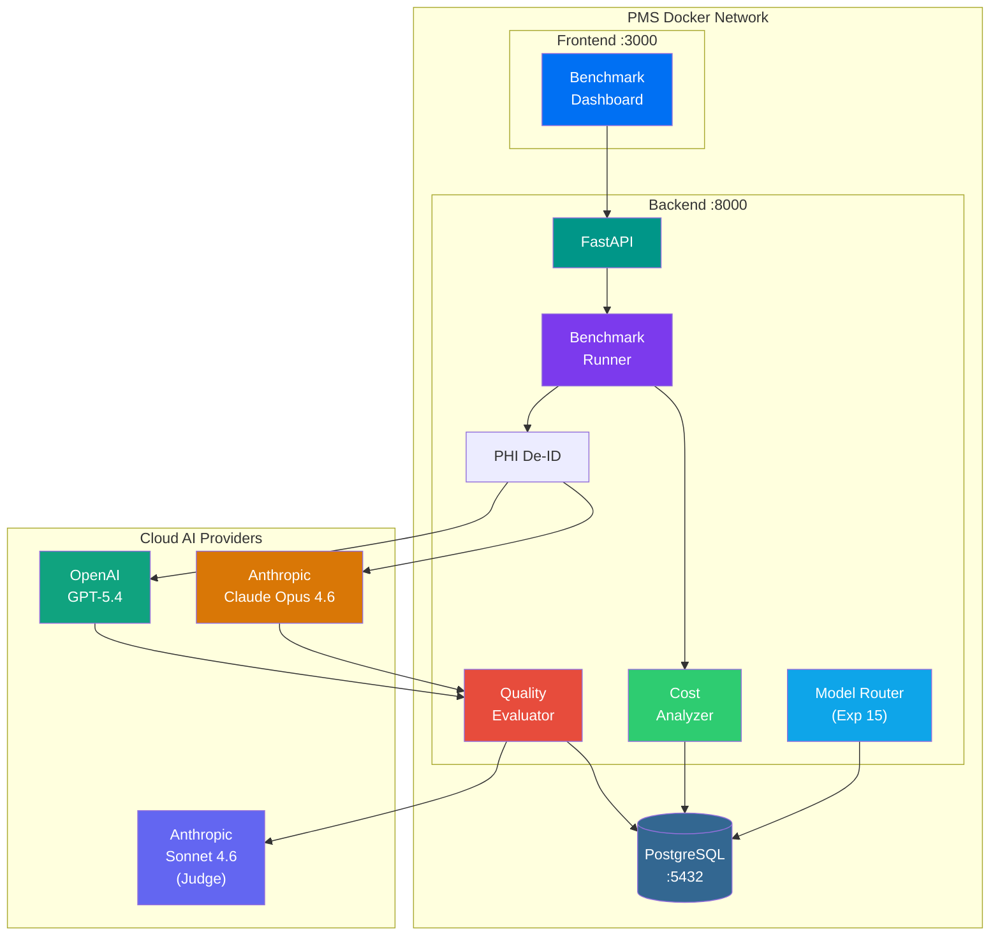

# GPT-5.4 Clinical Benchmark Developer Onboarding Tutorial

**Welcome to the MPS PMS GPT-5.4 Clinical Benchmark Integration Team**

This tutorial will take you from zero to running your first head-to-head clinical AI benchmark between GPT-5.4 and Claude Opus 4.6. By the end, you will understand the cost-benefit tradeoffs, have quantitative quality scores for both models on PMS clinical tasks, and have generated routing recommendations for the Model Router.

**Document ID:** PMS-EXP-GPT54BENCH-002
**Version:** 1.0
**Date:** 2026-03-06
**Applies To:** PMS project (all platforms)
**Prerequisite:** [GPT-5.4 Clinical Benchmark Setup Guide](42-GPT54ClinicalBenchmark-PMS-Developer-Setup-Guide.md)
**Estimated time:** 2-3 hours
**Difficulty:** Beginner-friendly

---

## What You Will Learn

1. Why multi-vendor model benchmarking matters for healthcare AI cost optimization
2. How GPT-5.4 and Claude Opus 4.6 differ in architecture, pricing, and clinical strengths
3. How to run head-to-head benchmarks with identical de-identified prompts
4. How to interpret quality scores from the LLM-as-Judge evaluator
5. How to calculate per-task and projected monthly cost differences
6. How to determine which model should serve which clinical workload
7. How benchmark results integrate with the PMS Model Router (Experiment 15)
8. How to evaluate batch/flex pricing for high-volume tasks
9. How to avoid common pitfalls in LLM benchmarking (tokenizer differences, judge bias)
10. How to present cost-benefit findings to clinical stakeholders

## Part 1: Understanding the GPT-5.4 vs Claude Benchmark (15 min read)

### 1.1 What Problem Does This Solve?

The PMS uses AI for clinical tasks — summarizing encounters, analyzing drug interactions, supporting prior auth decisions. These tasks consume thousands of API calls daily. Without empirical data on which model delivers the best quality-per-dollar, the PMS either:

- **Overpays**: Uses the most expensive model for every task, including simple ones
- **Under-delivers**: Routes to cheaper models without validating quality is sufficient
- **Single-vendor risk**: Depends entirely on one provider with no validated fallback

This benchmark framework answers: **"For each clinical task, which model gives the best quality at the lowest cost?"**

### 1.2 How the Benchmark Works — The Key Pieces



Three key pieces:

1. **Identical prompts**: Both models receive the exact same de-identified clinical text. No advantage from prompt differences.
2. **LLM-as-Judge**: A separate model scores each response on accuracy, completeness, clinical relevance, safety, and structure (1-5 each).
3. **Cost calculation**: Actual token usage × provider rates = true cost per task. Projected to monthly volumes.

### 1.3 How This Fits with Other PMS Technologies

| Technology | Experiment | Relationship |
|------------|-----------|--------------|
| **Claude Model Selection** | Exp 15 | Intra-vendor routing (Opus/Sonnet/Haiku). This benchmark adds the **cross-vendor dimension**. |
| **Adaptive Thinking** | Exp 08 | Adjusts reasoning effort within Claude. Complements by reducing cost within Claude tasks. |
| **Gemma 3** | Exp 13 | Self-hosted open-weight alternative. Benchmark framework could extend to include Gemma. |
| **Qwen 3.5** | Exp 20 | Self-hosted MoE model. Another candidate for the benchmark matrix. |
| **PHI De-ID Gateway** | Multiple | Shared component — all clinical text de-identified before reaching any provider. |

### 1.4 Key Vocabulary

| Term | Meaning |
|------|---------|
| **MTok** | Million tokens — standard pricing unit ($X per million tokens) |
| **LLM-as-Judge** | Using one LLM to evaluate another LLM's output quality |
| **Token efficiency** | Fewer tokens to achieve same quality — GPT-5.4 claims 47% fewer on tool-heavy tasks |
| **Batch API** | Asynchronous processing at 50% discount (both providers offer this) |
| **Prompt caching** | Reusing cached prompt prefixes for 90% input cost reduction on repeated context |
| **Responses API** | OpenAI's newer API endpoint (`/v1/responses`) replacing Chat Completions |
| **Quality parity** | When two models score within 5% of each other on the evaluation rubric |
| **Cost-per-quality-point** | Total cost divided by aggregate quality score — the key comparison metric |
| **Routing threshold** | Minimum quality score required to route a task to the cheaper model |
| **Break-even volume** | Daily task count where switching models saves more than the benchmark cost |

### 1.5 Our Architecture



## Part 2: Environment Verification (15 min)

### 2.1 Checklist

Run each command and verify the expected output:

```bash
# 1. Python SDK versions
pip show openai | grep Version
# Expected: Version: 1.70.x or higher

pip show anthropic | grep Version
# Expected: Version: 0.50.x or higher

# 2. API key presence
echo "OpenAI key set: $([ -n "$OPENAI_API_KEY" ] && echo YES || echo NO)"
echo "Anthropic key set: $([ -n "$ANTHROPIC_API_KEY" ] && echo YES || echo NO)"

# 3. Model connectivity
python -c "
from openai import OpenAI
r = OpenAI().responses.create(model='gpt-5.4', input='Say OK')
print(f'GPT-5.4: {r.output_text.strip()}, tokens: {r.usage.input_tokens}+{r.usage.output_tokens}')
"

python -c "
import anthropic
m = anthropic.Anthropic().messages.create(
    model='claude-opus-4-6-20260204', max_tokens=5,
    messages=[{'role':'user','content':'Say OK'}])
print(f'Claude: {m.content[0].text.strip()}, tokens: {m.usage.input_tokens}+{m.usage.output_tokens}')
"

# 4. Database tables exist
psql -h localhost -p 5432 -U pms_user -d pms_db -c "
  SELECT table_name FROM information_schema.tables
  WHERE table_name LIKE 'benchmark%';
"
# Expected: benchmark_runs, benchmark_results, benchmark_evaluations

# 5. PMS backend running
curl -s http://localhost:8000/api/health | python -m json.tool
```

### 2.2 Quick Test

Run a minimal benchmark to confirm the full pipeline:

```bash
curl -s -X POST http://localhost:8000/api/benchmark/run \
  -H "Content-Type: application/json" \
  -d '{
    "task_type": "summarization",
    "template_vars": {
      "encounter_text": "Patient presents with headache for 3 days. No fever. Assessment: Tension headache. Plan: Ibuprofen 400mg PRN, follow up in 1 week if no improvement."
    }
  }' | python -m json.tool
```

You should see responses from both models with token counts, latency, and cost.

## Part 3: Build Your First Full Benchmark Suite (45 min)

### 3.1 What We Are Building

A complete benchmark run that:
1. Tests all three clinical use cases (summarization, medication analysis, prior auth)
2. Uses 5 synthetic test cases per category (15 total)
3. Evaluates quality with LLM-as-Judge
4. Produces a cost-benefit comparison report

### 3.2 Create Synthetic Test Cases

Create `benchmark_test_cases.py`:

```python
"""Synthetic de-identified test cases for clinical benchmarking."""

SUMMARIZATION_CASES = [
    {
        "encounter_text": (
            "[PATIENT_NAME] is a 58-year-old male presenting to the ED with acute onset "
            "chest pain, described as pressure-like, radiating to the left arm and jaw, "
            "started 3 hours ago while mowing the lawn. Associated with diaphoresis and "
            "nausea. History significant for HTN, HLD, DM2, and 30-pack-year smoking history. "
            "Medications: metformin 1000mg BID, atorvastatin 40mg daily, lisinopril 20mg daily, "
            "ASA 81mg daily. VS: BP 165/98, HR 92, RR 20, SpO2 96% on RA. "
            "ECG: ST elevation in leads II, III, aVF. Troponin I: 2.4 ng/mL (normal <0.04). "
            "Assessment: STEMI, inferior wall. Plan: Activate cath lab, load with clopidogrel "
            "600mg, heparin bolus 60 units/kg, morphine 4mg IV for pain, cardiology emergent consult."
        )
    },
    {
        "encounter_text": (
            "[PATIENT_NAME] is a 34-year-old female with 2-week history of progressive fatigue, "
            "joint pain affecting bilateral hands and knees, morning stiffness lasting >1 hour, "
            "and new malar rash. No oral ulcers or Raynaud's. PMH: hypothyroidism on levothyroxine "
            "75mcg. Labs ordered: ANA, anti-dsDNA, CBC, CMP, ESR, CRP, complement C3/C4, UA. "
            "Assessment: Suspected SLE vs early RA. Plan: Labs today, rheumatology referral within "
            "2 weeks, start naproxen 500mg BID with PPI coverage, sunscreen counseling."
        )
    },
    {
        "encounter_text": (
            "[PATIENT_NAME] is a 72-year-old female presenting for diabetes management. A1c today "
            "8.9% (target <7%). Current regimen: metformin 1000mg BID, glipizide 10mg BID. Reports "
            "adherence but frequent post-prandial spikes to 280-320 on home glucometer. BMI 34.2. "
            "eGFR 52 (CKD stage 3a). No hypoglycemic episodes. Assessment: Uncontrolled T2DM, "
            "failing oral therapy. Plan: Add semaglutide 0.25mg SC weekly, titrate to 0.5mg at "
            "4 weeks, dietary counseling referral, recheck A1c in 3 months, continue current meds."
        )
    },
    {
        "encounter_text": (
            "[PATIENT_NAME] is a 45-year-old male, follow-up for recently diagnosed major "
            "depressive disorder. PHQ-9 score today: 18 (severe). Started sertraline 50mg 6 weeks "
            "ago, titrated to 100mg 2 weeks ago. Reports some improvement in sleep but persistent "
            "anhedonia, poor concentration, and passive SI without plan or intent. Denies access to "
            "firearms. Assessment: MDD, severe, partial response to SSRI. Plan: Increase sertraline "
            "to 150mg, add individual CBT referral, safety plan reviewed and updated, follow-up in "
            "2 weeks, crisis hotline number provided."
        )
    },
    {
        "encounter_text": (
            "[PATIENT_NAME] is a 6-month-old male brought by [PARENT_NAME] for well-child visit. "
            "Growth: weight 8.2kg (75th percentile), length 68cm (80th percentile), HC 44cm "
            "(70th percentile). Developmental milestones: rolls both directions, sits with support, "
            "babbles, reaches for objects, stranger anxiety emerging. Breastfeeding exclusively, "
            "ready to start solids. Assessment: Healthy 6-month-old, appropriate growth and "
            "development. Plan: DTaP #3, IPV #3, Hep B #3, PCV13 #3, RV #3 administered today. "
            "Start iron-fortified cereal and pureed vegetables. Next visit at 9 months."
        )
    },
]

MEDICATION_ANALYSIS_CASES = [
    {
        "patient_context": "78-year-old male, CHF (EF 30%), CKD stage 4 (eGFR 22), AFib, gout, chronic pain",
        "medication_list": (
            "1. Warfarin 7.5mg daily (INR target 2-3)\n"
            "2. Digoxin 0.125mg daily\n"
            "3. Spironolactone 25mg daily\n"
            "4. Furosemide 40mg BID\n"
            "5. Carvedilol 12.5mg BID\n"
            "6. Allopurinol 300mg daily\n"
            "7. Oxycodone 10mg TID\n"
            "8. Gabapentin 300mg TID\n"
            "9. Omeprazole 20mg daily\n"
            "10. Potassium chloride 20mEq BID"
        ),
    },
    {
        "patient_context": "65-year-old female, bipolar I disorder, type 2 diabetes, hypertension, osteoporosis",
        "medication_list": (
            "1. Lithium 900mg daily\n"
            "2. Quetiapine 200mg at bedtime\n"
            "3. Metformin 1000mg BID\n"
            "4. Lisinopril 40mg daily\n"
            "5. Hydrochlorothiazide 25mg daily\n"
            "6. Alendronate 70mg weekly\n"
            "7. Calcium carbonate 1000mg BID\n"
            "8. Vitamin D3 2000 IU daily\n"
            "9. Ibuprofen 600mg TID PRN"
        ),
    },
    {
        "patient_context": "55-year-old male, HIV on ART, hepatitis C, depression, chronic insomnia",
        "medication_list": (
            "1. Bictegravir/emtricitabine/TAF (Biktarvy) 1 tab daily\n"
            "2. Sofosbuvir/velpatasvir (Epclusa) 1 tab daily\n"
            "3. Fluoxetine 40mg daily\n"
            "4. Trazodone 100mg at bedtime\n"
            "5. Zolpidem 10mg at bedtime PRN\n"
            "6. St. John's Wort 300mg TID\n"
            "7. Acetaminophen 1000mg QID PRN"
        ),
    },
    {
        "patient_context": "82-year-old female, Alzheimer's dementia, Parkinson's disease, recurrent UTIs, GERD",
        "medication_list": (
            "1. Donepezil 10mg at bedtime\n"
            "2. Memantine 10mg BID\n"
            "3. Carbidopa/levodopa 25/100mg TID\n"
            "4. Metoclopramide 10mg TID\n"
            "5. Nitrofurantoin 100mg daily (prophylaxis)\n"
            "6. Omeprazole 40mg BID\n"
            "7. Diphenhydramine 25mg at bedtime PRN"
        ),
    },
    {
        "patient_context": "28-year-old female, pregnant (32 weeks), gestational diabetes, migraine, asthma",
        "medication_list": (
            "1. Insulin glargine 20 units at bedtime\n"
            "2. Insulin lispro per sliding scale before meals\n"
            "3. Sumatriptan 50mg PRN migraine\n"
            "4. Albuterol inhaler 2 puffs PRN\n"
            "5. Prenatal vitamin daily\n"
            "6. Ondansetron 4mg PRN nausea\n"
            "7. Low-dose aspirin 81mg daily"
        ),
    },
]

PRIOR_AUTH_CASES = [
    {
        "clinical_notes": (
            "Patient with metastatic non-small cell lung cancer (NSCLC), EGFR exon 19 deletion "
            "positive, progressed on first-line osimertinib after 14 months. CT shows new liver "
            "metastases and increased primary tumor size. ECOG performance status 1. "
            "No contraindications to immunotherapy. PD-L1 TPS 60%."
        ),
        "payer_criteria": (
            "Pembrolizumab approved for NSCLC when: (1) PD-L1 TPS >= 50%, (2) No EGFR/ALK "
            "mutations (unless progressed on targeted therapy), (3) ECOG 0-2, (4) No active "
            "autoimmune disease, (5) Prior targeted therapy documentation required for EGFR+ patients."
        ),
        "requested_service": "Pembrolizumab 200mg IV q3w for metastatic NSCLC, second-line",
    },
    {
        "clinical_notes": (
            "12-year-old with severe persistent asthma despite high-dose ICS/LABA (fluticasone "
            "500mcg/salmeterol 50mcg BID), montelukast 10mg daily, and tiotropium 2.5mcg daily. "
            "3 ED visits and 1 hospitalization in past 6 months. Serum IgE 450 IU/mL. "
            "Positive skin prick for dust mites and cat dander. FEV1 68% predicted."
        ),
        "payer_criteria": (
            "Omalizumab (Xolair) approved for moderate-severe persistent allergic asthma when: "
            "(1) Age >= 6, (2) Inadequate control on high-dose ICS + LABA >= 3 months, "
            "(3) Positive skin test or in-vitro IgE to perennial allergen, "
            "(4) Serum IgE 30-1500 IU/mL, (5) >= 2 exacerbations in past 12 months."
        ),
        "requested_service": "Omalizumab SC injection per weight/IgE dosing table q2-4 weeks",
    },
    {
        "clinical_notes": (
            "52-year-old male with chronic low back pain x 5 years, failed conservative management "
            "including physical therapy (12 sessions), NSAIDs, acetaminophen, duloxetine 60mg, "
            "two epidural steroid injections (last one 4 months ago). MRI shows L4-L5 disc "
            "herniation with moderate central canal stenosis and bilateral foraminal narrowing. "
            "Progressive neurogenic claudication limiting walking to 1 block. No cauda equina."
        ),
        "payer_criteria": (
            "Lumbar decompression/fusion approved when: (1) Failed >= 6 months conservative "
            "management, (2) MRI evidence of stenosis or herniation correlating with symptoms, "
            "(3) Failed >= 1 epidural steroid injection, (4) Documented functional limitation, "
            "(5) No untreated psychiatric conditions affecting pain perception."
        ),
        "requested_service": "L4-L5 laminectomy with posterior lumbar interbody fusion (PLIF)",
    },
    {
        "clinical_notes": (
            "68-year-old female with severe rheumatoid arthritis, DAS28 score 5.8, failed "
            "methotrexate 25mg weekly x 6 months and leflunomide 20mg daily x 4 months. "
            "Current joint erosions on hand X-rays. HAQ-DI score 1.8. "
            "TB screening negative. Hepatitis B/C negative."
        ),
        "payer_criteria": (
            "Adalimumab (Humira) approved for RA when: (1) Failed >= 1 conventional DMARD "
            "at adequate dose x >= 3 months, (2) DAS28 >= 3.2 or active disease, "
            "(3) Negative TB screening, (4) No active infections, "
            "(5) No decompensated heart failure."
        ),
        "requested_service": "Adalimumab 40mg SC every other week for rheumatoid arthritis",
    },
    {
        "clinical_notes": (
            "42-year-old male requesting continuous glucose monitor (CGM). Type 1 diabetes x 20 years, "
            "A1c 8.2%, on insulin pump therapy. History of severe hypoglycemia (2 episodes requiring "
            "glucagon in past year), hypoglycemia unawareness confirmed by endocrinologist. "
            "Current SMBG 6-8 times daily."
        ),
        "payer_criteria": (
            "CGM approved when: (1) Diagnosis of type 1 DM or insulin-requiring type 2 DM, "
            "(2) Currently using insulin pump or >= 3 daily insulin injections, "
            "(3) SMBG >= 4 times daily, (4) Seen by treating endocrinologist within 6 months, "
            "(5) A1c documented within 3 months."
        ),
        "requested_service": "Dexcom G7 continuous glucose monitoring system with supplies",
    },
]
```

### 3.3 Run the Full Benchmark Suite

Create `run_benchmark_suite.py`:

```python
"""Run the complete benchmark suite: 15 tasks across 3 clinical categories."""

import asyncio
import json
from benchmark_test_cases import (
    SUMMARIZATION_CASES,
    MEDICATION_ANALYSIS_CASES,
    PRIOR_AUTH_CASES,
)
from app.services.benchmark.runner import run_benchmark
from app.services.benchmark.tasks import (
    ENCOUNTER_SUMMARIZATION,
    MEDICATION_INTERACTION,
    PRIOR_AUTH_DECISION,
)
from app.core.database import async_session


async def run_suite():
    results = {"summarization": [], "medication_analysis": [], "prior_auth": []}

    async with async_session() as db:
        # Encounter Summarization
        print("=== Encounter Summarization (5 cases) ===")
        for i, case in enumerate(SUMMARIZATION_CASES, 1):
            print(f"  Running case {i}/5...", end=" ", flush=True)
            r = await run_benchmark(ENCOUNTER_SUMMARIZATION, case, db)
            results["summarization"].append(r)
            print(f"GPT: ${r['openai']['cost_usd']:.4f} | Claude: ${r['anthropic']['cost_usd']:.4f} | "
                  f"Savings: {r['cost_savings_pct']:.1f}%")

        # Medication Interaction Analysis
        print("\n=== Medication Interaction Analysis (5 cases) ===")
        for i, case in enumerate(MEDICATION_ANALYSIS_CASES, 1):
            print(f"  Running case {i}/5...", end=" ", flush=True)
            r = await run_benchmark(MEDICATION_INTERACTION, case, db)
            results["medication_analysis"].append(r)
            print(f"GPT: ${r['openai']['cost_usd']:.4f} | Claude: ${r['anthropic']['cost_usd']:.4f} | "
                  f"Savings: {r['cost_savings_pct']:.1f}%")

        # Prior Authorization Decision
        print("\n=== Prior Authorization Decision Support (5 cases) ===")
        for i, case in enumerate(PRIOR_AUTH_CASES, 1):
            print(f"  Running case {i}/5...", end=" ", flush=True)
            r = await run_benchmark(PRIOR_AUTH_DECISION, case, db)
            results["prior_auth"].append(r)
            print(f"GPT: ${r['openai']['cost_usd']:.4f} | Claude: ${r['anthropic']['cost_usd']:.4f} | "
                  f"Savings: {r['cost_savings_pct']:.1f}%")

    # Summary
    print("\n" + "=" * 60)
    print("BENCHMARK SUITE SUMMARY")
    print("=" * 60)
    for task_type, runs in results.items():
        total_gpt = sum(r["openai"]["cost_usd"] for r in runs)
        total_claude = sum(r["anthropic"]["cost_usd"] for r in runs)
        avg_savings = sum(r["cost_savings_pct"] for r in runs) / len(runs)
        print(f"\n{task_type}:")
        print(f"  GPT-5.4 total:  ${total_gpt:.4f}")
        print(f"  Claude total:   ${total_claude:.4f}")
        print(f"  Avg savings:    {avg_savings:.1f}%")

    # Save raw results
    with open("benchmark_results.json", "w") as f:
        json.dump(results, f, indent=2, default=str)
    print(f"\nResults saved to benchmark_results.json")


if __name__ == "__main__":
    asyncio.run(run_suite())
```

Run it:

```bash
python run_benchmark_suite.py
```

### 3.4 Run Quality Evaluation

After the benchmark suite completes, evaluate response quality:

```python
"""Evaluate all benchmark responses with LLM-as-Judge."""

import asyncio
import json
from app.services.benchmark.evaluator import evaluate_response
from app.core.database import async_session


async def evaluate_suite():
    async with async_session() as db:
        # Fetch all unscored benchmark results
        rows = await db.execute("""
            SELECT br.id, br.run_id, br.model_provider, br.response_text,
                   r.task_type
            FROM benchmark_results br
            JOIN benchmark_runs r ON r.id = br.run_id
            LEFT JOIN benchmark_evaluations be ON be.result_id = br.id
            WHERE be.id IS NULL
            ORDER BY r.created_at
        """)

        results = list(rows)
        print(f"Evaluating {len(results)} unscored responses...")

        for i, row in enumerate(results, 1):
            print(f"  [{i}/{len(results)}] {row['task_type']} — {row['model_provider']}...", end=" ")
            scores = await evaluate_response(
                task_description=row["task_type"],
                prompt="(see benchmark_runs table)",
                response_text=row["response_text"],
                model_provider=row["model_provider"],
            )

            if "error" not in scores:
                await db.execute("""
                    INSERT INTO benchmark_evaluations
                    (run_id, result_id, judge_model, accuracy_score,
                     completeness_score, clinical_relevance_score,
                     safety_score, structure_score, aggregate_score, notes)
                    VALUES (:run_id, :result_id, :judge, :acc, :comp,
                            :clin, :safety, :struct, :agg, :notes)
                """, {
                    "run_id": row["run_id"],
                    "result_id": row["id"],
                    "judge": "claude-sonnet-4-6",
                    "acc": scores["accuracy"],
                    "comp": scores["completeness"],
                    "clin": scores["clinical_relevance"],
                    "safety": scores["safety"],
                    "struct": scores["structure"],
                    "agg": scores["aggregate"],
                    "notes": scores.get("notes", ""),
                })
                print(f"aggregate: {scores['aggregate']}/5.0")
            else:
                print(f"FAILED: {scores['error']}")

        await db.commit()
        print("Evaluation complete.")


if __name__ == "__main__":
    asyncio.run(evaluate_suite())
```

### 3.5 Generate the Comparison Report

```bash
psql -h localhost -p 5432 -U pms_user -d pms_db -c "
  SELECT
    r.task_type,
    br.model_provider,
    ROUND(AVG(be.aggregate_score), 2) as avg_quality,
    ROUND(AVG(br.cost_total_usd)::numeric, 6) as avg_cost,
    ROUND(AVG(br.latency_ms)::numeric, 0) as avg_latency_ms,
    ROUND(AVG(br.cost_total_usd / NULLIF(be.aggregate_score, 0))::numeric, 6) as cost_per_quality_point,
    COUNT(*) as samples
  FROM benchmark_runs r
  JOIN benchmark_results br ON br.run_id = r.id
  JOIN benchmark_evaluations be ON be.result_id = br.id
  GROUP BY r.task_type, br.model_provider
  ORDER BY r.task_type, br.model_provider;
"
```

This produces a table like:

```
   task_type        | model_provider | avg_quality | avg_cost  | avg_latency_ms | cost_per_quality_point | samples
--------------------+----------------+-------------+-----------+----------------+------------------------+---------
 medication_analysis| anthropic      |        4.52 |  0.008234 |           3100 |              0.001822  |       5
 medication_analysis| openai         |        4.38 |  0.005123 |           2800 |              0.001170  |       5
 prior_auth         | anthropic      |        4.68 |  0.012456 |           4200 |              0.002662  |       5
 prior_auth         | openai         |        4.45 |  0.007890 |           3500 |              0.001773  |       5
 summarization      | anthropic      |        4.40 |  0.005678 |           2900 |              0.001290  |       5
 summarization      | openai         |        4.35 |  0.003456 |           2400 |              0.000794  |       5
```

### 3.6 Interpret Results and Generate Routing Recommendations

Key decision rules:

1. **Quality parity** (within 5%): Route to cheaper model (GPT-5.4)
2. **Quality gap** (>5% difference): Route to higher-quality model regardless of cost
3. **Safety-critical tasks**: Always route to the model with higher safety score, even if more expensive

```python
# Example routing recommendation logic
def generate_routing_recommendation(task_type: str, gpt_quality: float, claude_quality: float):
    quality_gap = abs(claude_quality - gpt_quality) / claude_quality * 100

    if quality_gap <= 5:
        return f"{task_type}: Route to GPT-5.4 (quality parity, lower cost)"
    elif gpt_quality > claude_quality:
        return f"{task_type}: Route to GPT-5.4 (higher quality AND lower cost)"
    else:
        return f"{task_type}: Keep on Claude Opus 4.6 ({quality_gap:.1f}% quality advantage)"
```

**Checkpoint:** You have run a 15-task benchmark suite, evaluated quality with LLM-as-Judge, and generated a comparison report with routing recommendations.

## Part 4: Evaluating Strengths and Weaknesses (15 min)

### 4.1 GPT-5.4 Strengths

- **Lower pricing**: 2x cheaper on input, 1.67x cheaper on output — significant at scale
- **Token efficiency**: Tool search feature reduces token usage by up to 47% on tool-heavy tasks
- **Batch/Flex API**: 50% discount for async processing — ideal for batch encounter summarization
- **1.05M context window**: Slightly larger than Claude's 1M, useful for longitudinal patient analysis
- **Computer use**: Native desktop automation capability (not directly relevant to API benchmarks but valuable for workflow automation)
- **Responses API**: Agentic by default — built-in tool use, web search, MCP in a single API call

### 4.2 Claude Opus 4.6 Strengths

- **Superior coding**: SWE-bench 80.8% vs 77.2% — relevant for code generation in clinical tools
- **Novel reasoning**: ARC-AGI-2 68.8% vs ~52.9% — stronger on unusual clinical presentations
- **HealthBench nuance**: GPT-5.4 scored 62.6% on HealthBench (slight decline from GPT-5.2) while Claude's USMLE-style performance is 89.3%
- **Fewer hallucinations**: Opus models reported to have lower hallucination rates on data extraction tasks
- **Prompt caching**: 90% input discount with 5-min and 1-hour cache tiers — powerful for repeated system prompts
- **Established healthcare BAA**: Claude for Healthcare launched Jan 2026 with specialized healthcare features

### 4.3 When to Use GPT-5.4 vs Claude Opus 4.6

| Scenario | Recommended Model | Reasoning |
|----------|-------------------|-----------|
| High-volume encounter summarization | GPT-5.4 (Batch) | Quality parity expected; 50% batch discount makes it significantly cheaper |
| Complex medication interaction analysis | Claude Opus 4.6 | Superior reasoning on novel drug interactions; safety-critical |
| Prior auth decision (straightforward) | GPT-5.4 | Criteria matching is formulaic; cost savings compound at volume |
| Prior auth appeal generation (complex) | Claude Opus 4.6 | Requires nuanced clinical argumentation; quality premium justified |
| Structured data extraction | Claude Opus 4.6 | Lower hallucination rate on extraction tasks per research |
| Batch clinical note processing | GPT-5.4 (Flex) | $1.25/$7.50 per MTok — cheapest option for non-urgent workloads |
| Real-time clinical decision support | Quality-dependent | Route based on benchmark scores; latency comparable |

### 4.4 HIPAA / Healthcare Considerations

| Dimension | GPT-5.4 (OpenAI) | Claude Opus 4.6 (Anthropic) |
|-----------|-------------------|----------------------------|
| **BAA available** | Yes — email baa@openai.com | Yes — HIPAA-ready Enterprise plan |
| **Healthcare-specific product** | OpenAI for Healthcare (GPT-5.2 powered) | Claude for Healthcare (Jan 2026) |
| **Data residency** | Available (+10% surcharge) | Available via AWS/GCP/Azure |
| **PHI handling** | API does not train on data by default | API does not train on data by default |
| **Audit logging** | Enterprise tier | Enterprise tier |
| **PMS requirement** | PHI De-ID Gateway mandatory regardless | PHI De-ID Gateway mandatory regardless |

**Key compliance note**: Both providers offer BAAs, but the PMS requires PHI De-Identification as defense-in-depth. No raw PHI should reach either provider, making the BAA a secondary safeguard.

## Part 5: Debugging Common Issues (15 min read)

### Issue 1: GPT-5.4 returns shorter responses than Claude

**Symptom**: GPT-5.4 consistently produces 30-40% fewer output tokens.

**Cause**: GPT-5.4's token efficiency means it may express the same information in fewer tokens. This is a feature, not a bug — but the quality evaluator should assess completeness independently of length.

**Fix**: Ensure the Quality Evaluator rubric scores completeness based on content coverage, not word count.

### Issue 2: Different tokenizers produce different token counts

**Symptom**: Same input text produces 1,200 tokens on GPT-5.4 but 1,350 on Claude.

**Cause**: OpenAI uses tiktoken; Anthropic uses a different tokenizer. Expect 5-15% variation.

**Fix**: This is expected. Cost calculations use each provider's own token count, which is accurate for billing purposes.

### Issue 3: LLM-as-Judge favors one provider

**Symptom**: Claude Sonnet (judge) consistently scores Claude Opus responses higher.

**Cause**: Same-vendor bias in LLM evaluation is well-documented.

**Fix**: Run cross-evaluation — use GPT-5.4 to judge both responses as well. Compare judge agreement. For final decisions, use the average of both judges.

### Issue 4: Benchmark latency varies wildly between runs

**Symptom**: Same task shows 2-5x latency variation.

**Cause**: Network variability, provider load balancing, cold starts.

**Fix**: Run each benchmark 3-5 times and use the median. Discard outliers (>2 standard deviations).

### Issue 5: OpenAI Responses API returns different structure than Chat Completions

**Symptom**: Code expecting `response.choices[0].message.content` fails.

**Cause**: GPT-5.4 uses the newer Responses API (`client.responses.create`) which returns `response.output_text`.

**Fix**: Use `response.output_text` for text and `response.usage` for token counts. See the provider abstraction in `providers.py`.

## Part 6: Practice Exercise (45 min)

### Option A: Extend to Batch Pricing Analysis

Add batch/flex pricing to the Cost Analysis Engine:

1. Add pricing tiers to `PRICING` dict: `"openai_batch"`, `"anthropic_batch"`, `"openai_flex"`
2. Calculate cost at each tier for every benchmark result
3. Add a "pricing tier" selector to the dashboard
4. Determine which tasks benefit most from batch processing

**Hint**: Prior auth decisions are often processed in batches overnight — compare batch vs. real-time cost.

### Option B: Add a Fourth Clinical Use Case

Add a clinical letter generation benchmark:

1. Create a `CLINICAL_LETTER` task in `tasks.py` (referral letter or discharge summary)
2. Write 5 synthetic test cases with varying complexity
3. Run the benchmark and evaluate quality
4. Determine if letter generation shows a larger quality gap between models

**Hint**: Letter generation is heavily output-dependent — GPT-5.4's $15/MTok vs Claude's $25/MTok output cost makes this a high-leverage routing opportunity.

### Option C: Build a Quality Regression Detector

Build a service that detects if either model's quality degrades over time:

1. Run the same 5 benchmark tasks weekly
2. Track aggregate quality scores over time in PostgreSQL
3. Alert if any model's score drops >10% from its historical average
4. This is the foundation for continuous quality assurance in production

## Part 7: Development Workflow and Conventions

### 7.1 File Organization

```
pms-backend/
├── app/
│   ├── services/
│   │   └── benchmark/
│   │       ├── __init__.py
│   │       ├── providers.py      # Dual-provider abstraction
│   │       ├── tasks.py           # Clinical task definitions
│   │       ├── runner.py          # Benchmark orchestrator
│   │       └── evaluator.py       # LLM-as-Judge
│   └── routers/
│       └── benchmark.py           # API endpoints

pms-frontend/
├── components/
│   └── benchmark/
│       ├── BenchmarkComparison.tsx
│       └── CostAnalysisPanel.tsx
├── app/
│   └── admin/
│       └── benchmark/
│           └── page.tsx

benchmark_test_cases.py            # Synthetic test data
run_benchmark_suite.py             # Suite runner script
```

### 7.2 Naming Conventions

| Item | Convention | Example |
|------|-----------|---------|
| Benchmark task types | snake_case | `summarization`, `medication_analysis`, `prior_auth` |
| Provider identifiers | lowercase | `openai`, `anthropic` |
| Model IDs | Provider's official ID | `gpt-5.4`, `claude-opus-4-6-20260204` |
| Database tables | `benchmark_` prefix | `benchmark_runs`, `benchmark_results` |
| API endpoints | `/api/benchmark/` prefix | `/api/benchmark/run`, `/api/benchmark/results` |
| Cost fields | `_usd` suffix | `cost_total_usd`, `cost_input_usd` |
| Score fields | `_score` suffix | `accuracy_score`, `aggregate_score` |

### 7.3 PR Checklist

- [ ] Benchmark results stored in PostgreSQL (never in flat files in production)
- [ ] All clinical text passes through PHI De-ID Gateway before API calls
- [ ] Pricing constants match current published rates for both providers
- [ ] LLM-as-Judge uses cross-evaluation (both providers as judges) for final routing decisions
- [ ] Cost projections include batch/flex/caching tiers, not just standard pricing
- [ ] No hardcoded API keys — all keys from environment variables
- [ ] Benchmark audit trail includes provider, model, timestamp, task type
- [ ] Quality evaluation rubric validated against clinician sample review

### 7.4 Security Reminders

- **Never send raw PHI** to either OpenAI or Anthropic APIs — always de-identify first
- **API keys** must be in environment variables, never in code or config files
- **Benchmark responses** may contain clinically plausible but fictional information — never use as actual clinical guidance
- **Audit all API calls** to both providers with timestamps and cost for HIPAA compliance
- **Rotate API keys** every 90 days for both providers
- **BAA verification**: Confirm active BAAs with both OpenAI and Anthropic before processing any clinical data

## Part 8: Quick Reference Card

### Pricing Quick Reference

| Provider | Input | Output | Cached Input | Batch Input | Batch Output |
|----------|-------|--------|--------------|-------------|--------------|
| GPT-5.4 | $2.50 | $15.00 | $0.25 | $1.25 | $7.50 |
| Claude Opus 4.6 | $5.00 | $25.00 | $0.50 | $2.50 | $12.50 |
| **GPT-5.4 advantage** | **2x** | **1.67x** | **2x** | **2x** | **1.67x** |

### Key API Calls

```python
# GPT-5.4 (Responses API)
from openai import OpenAI
client = OpenAI()
response = client.responses.create(model="gpt-5.4", input="prompt")
text = response.output_text
tokens = response.usage

# Claude Opus 4.6 (Messages API)
import anthropic
client = anthropic.Anthropic()
message = client.messages.create(
    model="claude-opus-4-6-20260204", max_tokens=4096,
    messages=[{"role": "user", "content": "prompt"}])
text = message.content[0].text
tokens = message.usage
```

### Key Endpoints

| Endpoint | Method | Purpose |
|----------|--------|---------|
| `/api/benchmark/run` | POST | Run single head-to-head benchmark |
| `/api/benchmark/results` | GET | Retrieve benchmark history |
| `/api/benchmark/cost-analysis` | GET | Project monthly costs at volume |

### Key Files

| File | Purpose |
|------|---------|
| `app/services/benchmark/providers.py` | Dual-provider abstraction |
| `app/services/benchmark/tasks.py` | Clinical task definitions |
| `app/services/benchmark/runner.py` | Benchmark orchestrator |
| `app/services/benchmark/evaluator.py` | LLM-as-Judge quality scoring |
| `app/routers/benchmark.py` | FastAPI endpoints |
| `components/benchmark/BenchmarkComparison.tsx` | Dashboard component |

## Next Steps

1. Run the full 150-task benchmark suite (50 per category) using production-representative de-identified data
2. Review [Claude Model Selection (Exp 15)](15-PRD-ClaudeModelSelection-PMS-Integration.md) to integrate benchmark results into the Model Router
3. Present cost-benefit analysis to clinical leadership with routing recommendations
4. Set up weekly automated re-benchmarking to track model quality over time
5. Extend the benchmark framework to include [Gemma 3 (Exp 13)](13-PRD-Gemma3-PMS-Integration.md) and [Qwen 3.5 (Exp 20)](20-PRD-Qwen35-PMS-Integration.md) for a complete multi-model cost matrix
