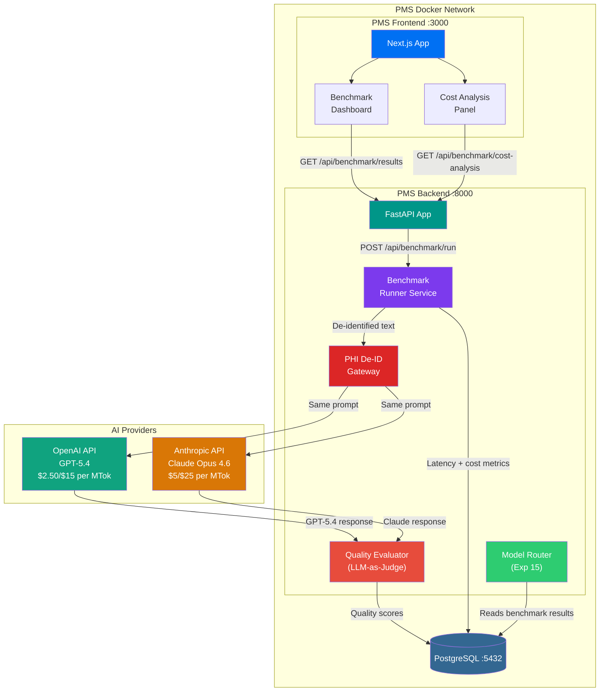

# Product Requirements Document: GPT-5.4 Clinical Benchmark — Head-to-Head Cost-Benefit Analysis vs Claude Opus 4.6 for PMS

**Document ID:** PRD-PMS-GPT54BENCH-001
**Version:** 1.0
**Date:** 2026-03-06
**Author:** Ammar (CEO, MPS Inc.)
**Status:** Draft

---

## 1. Executive Summary

GPT-5.4 is OpenAI's frontier model released on March 5, 2026, combining advanced reasoning, coding, native computer use, and 1M-token context into a single model. It is priced at $2.50/MTok input and $15/MTok output — representing a 2x input cost reduction and 1.67x output cost reduction compared to Claude Opus 4.6 ($5/MTok input, $25/MTok output). For high-volume clinical AI tasks such as encounter summarization, medication reconciliation, and prior authorization analysis, this pricing gap compounds rapidly: a PMS processing 1,000 encounters/day at ~2K input + ~1K output tokens each would spend ~$40/day on GPT-5.4 vs ~$35/day on Claude Opus 4.6 — but when output-heavy tasks dominate, the gap widens further.

This experiment establishes a **dual-model evaluation framework** that benchmarks GPT-5.4 and Claude Opus 4.6 head-to-head on the PMS's three highest-volume clinical AI use cases: (1) encounter note summarization, (2) medication interaction analysis, and (3) prior authorization decision support. The framework produces quantitative quality scores, latency measurements, and per-task cost projections to determine which model should serve which clinical workload — enabling the PMS Model Router (Experiment 15) to make data-driven routing decisions.

The evaluation is not about replacing Claude with GPT-5.4 wholesale. Rather, it determines the **optimal model allocation**: tasks where GPT-5.4 delivers equivalent or better quality at lower cost should be routed there, while tasks requiring Claude's superior coding or agentic capabilities remain on Claude. The goal is a cost-optimized, quality-validated multi-vendor AI strategy.

## 2. Problem Statement

The PMS currently relies on Claude models for all AI-powered clinical tasks. While Claude Opus 4.6 delivers excellent quality, single-vendor dependency creates two risks:

- **Cost inefficiency**: Not all clinical tasks require frontier-tier quality. Encounter summarization of straightforward visits may perform equally well on a cheaper model, but without benchmarking data, we cannot make this determination with confidence.
- **Vendor lock-in**: Sole dependence on Anthropic exposes the PMS to pricing changes, rate limit adjustments, and outage risk with no validated fallback.
- **No empirical basis for routing**: The Model Router (Experiment 15) currently routes by task complexity heuristics, not by measured quality/cost tradeoffs across vendors. Without head-to-head benchmark data on real PMS workloads, routing decisions are guesswork.

Specific bottlenecks:

- **Encounter summarization cost**: At ~1,500 encounters/day across a multi-clinic deployment, summarization alone could cost $50-150/day depending on note length and model choice.
- **Medication reconciliation latency**: Complex polypharmacy patients require deep reasoning — is GPT-5.4's reasoning sufficient, or does Claude's advantage on ARC-AGI-2 (68.8% vs ~52.9%) translate to better clinical reasoning here?
- **Prior auth throughput**: Prior authorization analysis is output-heavy (generating structured decisions, justifications, and appeals). Output token cost differences ($15 vs $25/MTok) have outsized impact on this workload.

## 3. Proposed Solution

### 3.1 Architecture Overview

### 3.2 Deployment Model

- **Cloud API only**: Both models are accessed via their respective cloud APIs (OpenAI API and Anthropic API). No self-hosted inference.
- **PHI De-Identification**: All clinical text passes through the PHI De-ID Gateway before reaching either provider. Both OpenAI and Anthropic offer BAAs, but PHI de-identification remains mandatory as defense-in-depth.
- **Benchmark results in PostgreSQL**: All evaluation data (prompts, responses, quality scores, latency, token counts, costs) stored in PostgreSQL for analysis.
- **HIPAA compliance**: Both providers support BAAs. OpenAI BAA via `baa@openai.com`; Anthropic BAA via HIPAA-ready Enterprise plan. PHI De-ID Gateway ensures no raw PHI reaches either provider regardless.

## 4. PMS Data Sources

| PMS API | Relevance | Usage |
|---------|-----------|-------|
| **Encounter Records API** (`/api/encounters`) | Critical | Primary source for benchmark test cases. Real encounter notes (de-identified) used as evaluation prompts for summarization and clinical reasoning tasks. |
| **Medication & Prescription API** (`/api/prescriptions`) | Critical | Medication lists and prescription histories used as input for drug interaction analysis benchmarks. |
| **Patient Records API** (`/api/patients`) | High | Patient demographics and history provide context for prior authorization decision support benchmarks. |
| **Reporting API** (`/api/reports`) | Medium | Benchmark results and cost projections integrated into operational reports. Model Router performance metrics fed into quality dashboards. |

## 5. Component/Module Definitions

### 5.1 Benchmark Runner Service

- **Description**: Orchestrates head-to-head evaluations by sending identical de-identified prompts to both GPT-5.4 and Claude Opus 4.6, collecting responses, and recording metrics (latency, token counts, cost).
- **Input**: De-identified clinical text from `/api/encounters` and `/api/prescriptions`, benchmark task definitions (summarization, medication analysis, prior auth)
- **Output**: Raw response pairs, token usage metrics, latency measurements, cost calculations
- **PMS APIs**: Encounter Records API, Medication & Prescription API, Patient Records API

### 5.2 Quality Evaluator (LLM-as-Judge)

- **Description**: Uses a separate LLM call (Claude Sonnet 4.6 or GPT-5.4 itself) as an automated judge to score response quality on clinical dimensions: accuracy, completeness, clinical relevance, safety (no hallucinated medications/dosages), and structured output compliance.
- **Input**: Response pairs from Benchmark Runner, clinical evaluation rubric
- **Output**: Per-dimension quality scores (1-5 scale), aggregate quality index, winner determination per task
- **PMS APIs**: None (operates on benchmark data only)

### 5.3 Cost Analysis Engine

- **Description**: Calculates per-task and projected monthly costs for each model based on actual token usage from benchmarks. Models cost with and without batch/flex pricing, prompt caching, and extended context surcharges.
- **Input**: Token usage data from Benchmark Runner, current pricing tiers for both providers
- **Output**: Cost-per-task breakdowns, monthly projections at various volume levels, break-even analysis, ROI calculations
- **PMS APIs**: Reporting API (for volume projections)

### 5.4 Benchmark Dashboard

- **Description**: React component displaying head-to-head comparison results with interactive charts showing quality vs. cost tradeoffs per clinical task type.
- **Input**: Benchmark results from `/api/benchmark/results`
- **Output**: Interactive visualizations (quality radar charts, cost bar charts, latency histograms, winner matrices)
- **PMS APIs**: Reporting API

### 5.5 Model Router Integration

- **Description**: Updates to the existing Model Router (Experiment 15) to incorporate benchmark-validated routing rules. Routes tasks to the model that meets quality thresholds at lowest cost.
- **Input**: Benchmark quality scores and cost data, task classification
- **Output**: Updated routing configuration with empirical quality/cost thresholds per task type
- **PMS APIs**: All PMS APIs (routing applies to all AI-powered features)

## 6. Non-Functional Requirements

### 6.1 Security and HIPAA Compliance

- PHI De-ID Gateway is mandatory for all benchmark runs — no raw PHI reaches either provider
- Both OpenAI BAA and Anthropic BAA must be in place before processing any clinical data
- All benchmark responses and evaluation data stored encrypted at rest in PostgreSQL (AES-256)
- Benchmark audit trail: every API call logged with timestamp, model, task type, token counts, and cost
- API keys stored in environment variables, rotated every 90 days
- No clinical text stored in benchmark results — only de-identified versions and quality scores

### 6.2 Performance

| Metric | Target |
|--------|--------|
| Benchmark run (single task, both models) | < 30 seconds |
| Full benchmark suite (50 tasks x 3 categories) | < 45 minutes |
| Quality evaluation per response pair | < 10 seconds |
| Cost analysis report generation | < 5 seconds |
| Dashboard render with 500+ benchmark results | < 2 seconds |

### 6.3 Infrastructure

- **No additional infrastructure**: Both models accessed via cloud APIs
- **PostgreSQL**: Benchmark results stored in existing PMS database (~5KB per benchmark run)
- **API rate limits**: OpenAI Tier 2+ recommended for batch benchmarking; Anthropic rate limits vary by plan
- **Estimated benchmark cost**: Full 150-task suite costs ~$5-10 per run across both providers

## 7. Implementation Phases

### Phase 1: Foundation — Benchmark Framework (Sprints 1-2)

- Set up OpenAI Python SDK alongside existing Anthropic SDK
- Build Benchmark Runner Service with de-identification pipeline
- Implement three clinical task templates (summarization, medication analysis, prior auth)
- Create benchmark results schema in PostgreSQL
- Run initial 50-task benchmark suite

### Phase 2: Evaluation & Dashboard (Sprints 3-4)

- Build LLM-as-Judge Quality Evaluator with clinical rubric
- Implement Cost Analysis Engine with multi-tier pricing models
- Build Benchmark Dashboard in Next.js
- Run expanded 150-task benchmark suite with quality evaluation
- Generate initial routing recommendations

### Phase 3: Router Integration & Continuous Benchmarking (Sprints 5-6)

- Update Model Router (Exp 15) with benchmark-validated routing rules
- Implement continuous benchmarking pipeline (weekly re-evaluation)
- Add model degradation detection (quality drops trigger alerts)
- Android app: read-only benchmark results via WebView
- Cost savings tracking dashboard

## 8. Success Metrics

| Metric | Target | Measurement |
|--------|--------|-------------|
| Benchmark coverage | All 3 clinical use cases with 50+ test cases each | Count of validated benchmark tasks |
| Quality parity detection | Identify tasks where GPT-5.4 quality >= 95% of Claude | Quality Evaluator scores |
| Cost reduction on routed tasks | >30% cost reduction on tasks routed to GPT-5.4 | Cost Analysis Engine |
| Routing accuracy | <5% of routed tasks require manual model override | Clinician feedback loop |
| Benchmark reliability | >95% agreement between repeated runs | Run-over-run consistency |
| Time to routing decision | <1 week from benchmark run to router update | Sprint tracking |

## 9. Risks and Mitigations

| Risk | Impact | Mitigation |
|------|--------|------------|
| GPT-5.4 quality insufficient for clinical tasks | High — cannot route, no cost savings | Quality Evaluator establishes minimum thresholds; tasks that fail stay on Claude |
| Benchmark results not generalizable | Medium — routing decisions based on limited sample | Use diverse, representative de-identified encounters; minimum 50 test cases per category |
| Pricing changes by either provider | Medium — cost projections invalidated | Abstract pricing into configurable parameters; re-run cost analysis monthly |
| LLM-as-Judge bias | Medium — judge model may favor its own provider | Use cross-evaluation (Claude judges GPT output and vice versa); validate against clinician review sample |
| API rate limiting during benchmark runs | Low — delays in benchmark execution | Stagger requests; use batch/flex API for non-urgent benchmarks |
| PHI leakage during benchmarking | Critical — HIPAA violation | PHI De-ID Gateway mandatory; synthetic test cases for initial development |

## 10. Dependencies

| Dependency | Version | Purpose |
|------------|---------|---------|
| OpenAI Python SDK | >=1.70 | GPT-5.4 API access via Responses endpoint |
| Anthropic Python SDK | >=0.50 | Claude Opus 4.6 API access |
| GPT-5.4 API access | `gpt-5.4` model ID | Benchmark target model |
| Claude Opus 4.6 API access | `claude-opus-4-6-20260204` | Benchmark baseline model |
| PMS Backend (FastAPI) | Current | Benchmark Runner host, API gateway |
| PMS Frontend (Next.js) | Current | Benchmark Dashboard |
| PostgreSQL | 15+ | Benchmark results persistence |
| Model Router (Exp 15) | Current | Routing rule integration |
| PHI De-ID Gateway | Current | Mandatory de-identification |

## 11. Comparison with Existing Experiments

| Aspect | GPT-5.4 Benchmark (Exp 42) | Claude Model Selection (Exp 15) | Adaptive Thinking (Exp 08) |
|--------|----------------------------|----------------------------------|----------------------------|
| **Core function** | Cross-vendor model benchmarking and cost-benefit analysis | Intra-vendor model routing (Opus/Sonnet/Haiku) | Reasoning effort optimization within Claude |
| **Models evaluated** | GPT-5.4 vs Claude Opus 4.6 | Claude Opus 4.6 vs Sonnet 4.6 vs Haiku 4.5 | Single Claude model with effort levels |
| **Cost optimization** | Cross-vendor arbitrage ($2.50 vs $5.00 input) | Tier routing (Opus $5 → Haiku $0.80) | Effort routing (reduce reasoning tokens) |
| **Quality measurement** | LLM-as-Judge with clinical rubric | Task complexity heuristics | Implicit (effort level selection) |
| **Complementarity** | Exp 42 provides the **cross-vendor dimension** missing from Exp 15. Together, they enable a 2D routing matrix: (1) choose vendor by quality/cost benchmark, then (2) choose model tier within that vendor. Exp 08's effort routing applies within whichever model is selected. |

## 12. Research Sources

### Official Documentation
- [Introducing GPT-5.4 | OpenAI](https://openai.com/index/introducing-gpt-5-4/) — Model capabilities, architecture, release announcement
- [GPT-5.4 Model | OpenAI API](https://developers.openai.com/api/docs/models/gpt-5.4) — API model card, context window, supported features
- [Using GPT-5.4 | OpenAI API](https://developers.openai.com/api/docs/guides/latest-model/) — Integration guide, Responses API, tool search
- [Claude Opus 4.6 | Anthropic](https://www.anthropic.com/claude/opus) — Model capabilities and positioning

### Pricing & Cost Analysis
- [OpenAI API Pricing](https://developers.openai.com/api/docs/pricing) — GPT-5.4 standard, batch, flex, and extended context pricing
- [Claude API Pricing](https://platform.claude.com/docs/en/about-claude/pricing) — Opus 4.6 standard, batch, prompt caching pricing
- [GPT-5.4 Pricing, Benchmarks & API Costs | TokenCost](https://tokencost.app/blog/openai-gpt-5-4-pricing-benchmarks-review) — Third-party pricing comparison and analysis

### Benchmarks & Comparisons
- [GPT-5.4 vs Claude Opus 4.6 | Bind AI](https://blog.getbind.co/gpt-5-4-vs-claude-opus-4-6-which-one-is-better-for-coding/) — Head-to-head benchmark comparison
- [Claude Opus 4.6 vs GPT-5.4 Comprehensive Comparison | Apiyi](https://help.apiyi.com/en/claude-opus-4-6-vs-gpt-5-4-comparison-12-benchmarks-guide-en.html) — 12-benchmark comparison guide

### Healthcare & HIPAA
- [OpenAI for Healthcare](https://openai.com/index/openai-for-healthcare/) — Healthcare products, BAA, HIPAA compliance
- [Anthropic Healthcare & Life Sciences](https://www.anthropic.com/news/healthcare-life-sciences) — Claude for Healthcare, BAA, HIPAA-ready Enterprise
- [Anthropic BAA](https://privacy.claude.com/en/articles/8114513-business-associate-agreements-baa-for-commercial-customers) — BAA requirements and coverage

## 13. Appendix: Related Documents

- [GPT-5.4 Clinical Benchmark Setup Guide](42-GPT54ClinicalBenchmark-PMS-Developer-Setup-Guide.md)
- [GPT-5.4 Clinical Benchmark Developer Tutorial](42-GPT54ClinicalBenchmark-Developer-Tutorial.md)
- [Claude Model Selection (Exp 15)](15-PRD-ClaudeModelSelection-PMS-Integration.md)
- [Adaptive Thinking (Exp 08)](08-PRD-AdaptiveThinking-PMS-Integration.md)
- [OpenAI API Documentation](https://developers.openai.com/api/docs/)
- [Anthropic API Documentation](https://platform.claude.com/docs/)

### Appendix A: Pricing Comparison Matrix

| Dimension | GPT-5.4 | Claude Opus 4.6 | GPT-5.4 Advantage |
|-----------|---------|-----------------|-------------------|
| **Input (standard)** | $2.50/MTok | $5.00/MTok | 2x cheaper |
| **Output (standard)** | $15.00/MTok | $25.00/MTok | 1.67x cheaper |
| **Input (cached)** | $0.25/MTok | $0.50/MTok | 2x cheaper |
| **Input (batch/flex)** | $1.25/MTok | $2.50/MTok | 2x cheaper |
| **Output (batch)** | $7.50/MTok | $12.50/MTok | 1.67x cheaper |
| **Extended context (>272K/>200K)** | $5.00/$22.50 | $10.00/$37.50 | 2x/1.67x cheaper |
| **Context window** | 1.05M tokens | 1.0M tokens | Slightly larger |
| **Max output** | 128K tokens | 128K tokens | Parity |

### Appendix B: Benchmark Comparison Summary

| Benchmark | GPT-5.4 | Claude Opus 4.6 | Winner |
|-----------|---------|-----------------|--------|
| SWE-bench Verified | 77.2% | 80.8% | Claude |
| ARC-AGI-2 | ~52.9% (GPT-5.2) | 68.8% | Claude |
| OSWorld (desktop automation) | 75.0% | 72.7% | GPT-5.4 |
| Terminal-Bench 2.0 | 75.1% | 65.4% | GPT-5.4 |
| GDPval (knowledge work) | 83.0% | — | GPT-5.4 |
| HealthBench (GPT-5.4) | 62.6% | — | Needs head-to-head |
| USMLE-style (Claude) | — | 89.3% | Needs head-to-head |

### Appendix C: Top 3 Clinical Use Cases for Benchmarking

| # | Use Case | Volume | Input Profile | Output Profile | Cost Sensitivity |
|---|----------|--------|---------------|----------------|-----------------|
| 1 | **Encounter Note Summarization** | ~1,500/day | Long encounter notes (2-5K tokens) | Structured summary (500-1K tokens) | High — highest volume task |
| 2 | **Medication Interaction Analysis** | ~300/day | Medication list + patient context (1-2K tokens) | Interaction report with severity + recommendations (1-3K tokens) | Medium — output-heavy |
| 3 | **Prior Authorization Decision Support** | ~200/day | Clinical notes + payer criteria (3-8K tokens) | Structured decision + justification + appeal draft (2-5K tokens) | High — output-heavy, highest per-task cost |
