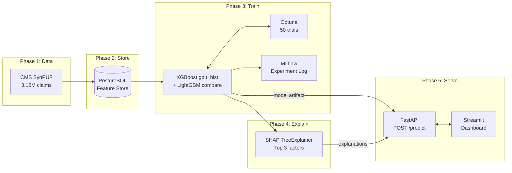
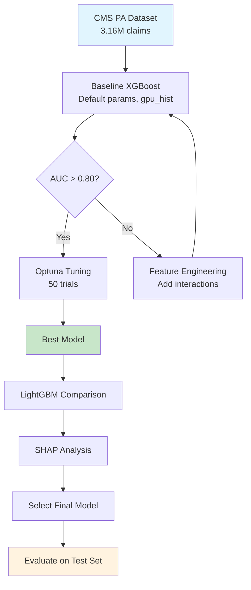

# CMS Prior Authorization ML Pipeline — Developer Tutorial

**Document ID:** PMS-EXP-CMSPA-TUTORIAL-001
**Version:** 1.0
**Date:** 2026-03-07
**Applies To:** MarginLogic PA Outcome Intelligence (Experiment 43)
**Target Hardware:** NVIDIA Jetson AGX Thor (JetPack 7.0)
**Prerequisites:** Complete the [Setup Guide](43-CMSPriorAuthDataset-PMS-Developer-Setup-Guide.md) first

---

## Table of Contents

1. [What You Will Build](#1-what-you-will-build)
2. [Part A: Understanding the CMS PA Dataset](#2-part-a-understanding-the-cms-pa-dataset)
3. [Part B: Training Approach — XGBoost with GPU Acceleration](#3-part-b-training-approach--xgboost-with-gpu-acceleration)
4. [Part C: Train the Baseline Model](#4-part-c-train-the-baseline-model)
5. [Part D: Hyperparameter Tuning with Optuna](#5-part-d-hyperparameter-tuning-with-optuna)
6. [Part E: SHAP Interpretability](#6-part-e-shap-interpretability)
7. [Part F: Build the FastAPI Risk Scoring API](#7-part-f-build-the-fastapi-risk-scoring-api)
8. [Part G: Build the Streamlit Dashboard](#8-part-g-build-the-streamlit-dashboard)
9. [Part H: End-to-End Pipeline Test](#9-part-h-end-to-end-pipeline-test)
10. [Part I: Benchmark Results](#10-part-i-benchmark-results)
11. [Part J: Transitioning to Real TRA Data](#11-part-j-transitioning-to-real-tra-data)

---

## 1. What You Will Build

This tutorial runs the complete PA prediction pipeline on the Jetson Thor, matching the MarginLogic execution roadmap's "Jetson Thor Validation Experiment." By the end, you will have:

1. A profiled and understood CMS PA dataset (3.16M claims, 22K PA-required)
2. An XGBoost classifier trained with GPU acceleration (`gpu_hist` on CUDA 13.0)
3. Optuna hyperparameter tuning (50 trials)
4. SHAP explanations identifying top risk factors per prediction
5. A FastAPI endpoint serving predictions in <100ms
6. A Streamlit dashboard with payer analytics and live prediction form
7. Benchmark numbers: GPU vs CPU training time, SHAP compute time, API latency



---

## 2. Part A: Understanding the CMS PA Dataset

### Dataset Overview

The dataset was built in Phase 1 by joining CMS DE-SynPUF synthetic Medicare claims with 115 HCPCS codes from three CMS prior authorization programs. This is not real PHI — it's synthetic data designed for ML experimentation.

**Key stats:**

| Metric | Value |
|--------|-------|
| Total claims | 3,161,457 |
| PA-required claims | 22,231 (0.70%) |
| Features | 30 columns |
| Train split | 2,213,019 (70%) |
| Validation split | 474,219 (15%) |
| Test split | 474,219 (15%) |

### Explore the Data

Create `01_explore_data.py`:

```python
"""Step 1: Data exploration and profiling."""
import pandas as pd
import matplotlib
matplotlib.use('Agg')
import matplotlib.pyplot as plt
import seaborn as sns

# Load
train = pd.read_parquet('data/processed/cms_pa_dataset_train.parquet')
print(f"Shape: {train.shape}")
print(f"\nPA distribution:\n{train['pa_required'].value_counts()}")
print(f"\nPA rate: {train['pa_required'].mean()*100:.2f}%")

# Feature correlations with PA requirement
numeric_cols = train.select_dtypes(include='number').columns
correlations = train[numeric_cols].corrwith(train['pa_required']).sort_values(ascending=False)
print(f"\nTop features correlated with PA requirement:")
print(correlations.head(10))
print(f"\nBottom features (negative correlation):")
print(correlations.tail(5))

# Class distribution by claim type
print(f"\nPA rate by claim type:")
print(train.groupby('claim_type')['pa_required'].mean())

# Chronic condition analysis
sp_cols = [c for c in train.columns if c.startswith('SP_')]
print(f"\nPA rate by chronic condition:")
for col in sp_cols:
    rate_with = train[train[col] == 1]['pa_required'].mean()
    rate_without = train[train[col] == 0]['pa_required'].mean()
    ratio = rate_with / rate_without if rate_without > 0 else float('inf')
    print(f"  {col}: with={rate_with:.4f}, without={rate_without:.4f}, ratio={ratio:.2f}x")

# Save correlation plot
fig, ax = plt.subplots(figsize=(10, 6))
correlations.drop('pa_required').plot(kind='barh', ax=ax)
ax.set_title('Feature Correlation with PA Requirement')
ax.set_xlabel('Pearson Correlation')
fig.tight_layout()
fig.savefig('data/processed/feature_correlations.png', dpi=150)
print("\nSaved feature_correlations.png")
```

**Run:**

```bash
python3 01_explore_data.py
```

### Understanding the Class Imbalance

At 0.70% positive rate, this is a heavily imbalanced dataset. This is realistic — most claims do NOT require PA. The training approach must handle this:

| Strategy | How | When to Use |
|----------|-----|-------------|
| `scale_pos_weight` | XGBoost parameter = n_negative / n_positive (~142) | Default approach |
| SMOTE | Synthetic oversampling of minority class | If `scale_pos_weight` underfits |
| Focal loss | Down-weights easy negatives | If precision is too low |
| Undersampling | Random removal of majority class | Quick experiments only |
| Threshold tuning | Adjust decision threshold from 0.5 | Always — optimize for recall |

---

## 3. Part B: Training Approach — XGBoost with GPU Acceleration

### Why XGBoost on Jetson Thor

| Factor | Details |
|--------|---------|
| **Algorithm** | Gradient-boosted decision trees — state of the art for tabular data |
| **GPU acceleration** | `tree_method='gpu_hist'` builds trees on GPU. Jetson Thor's Blackwell GPU handles this natively |
| **Interpretability** | SHAP TreeExplainer gives exact feature attributions — critical for healthcare (clinicians need to understand why) |
| **Small data performance** | Unlike deep learning, XGBoost performs well with thousands of rows (MarginLogic's TRA dataset will be 3K-5K) |
| **Categorical handling** | Native categorical feature support since XGBoost 1.6 — no need for one-hot encoding |

### Training Strategy



**Three-phase approach:**

1. **Baseline** — XGBoost with `scale_pos_weight` and default hyperparameters. Establishes a performance floor.
2. **Tuning** — Optuna Bayesian optimization over 50 trials. Searches: `max_depth`, `learning_rate`, `n_estimators`, `min_child_weight`, `subsample`, `colsample_bytree`, `reg_alpha`, `reg_lambda`.
3. **Comparison** — Train equivalent LightGBM model. Pick the winner or ensemble both.

---

## 4. Part C: Train the Baseline Model

Create `02_train_baseline.py`:

```python
"""Step 2: Train XGBoost baseline with GPU acceleration."""
import time
import pandas as pd
import numpy as np
import xgboost as xgb
from sklearn.metrics import (
    roc_auc_score, precision_score, recall_score, f1_score,
    classification_report, confusion_matrix
)
import mlflow
import mlflow.xgboost
import warnings
warnings.filterwarnings('ignore')

# ── Load data ──────────────────────────────────────────────────
train = pd.read_parquet('data/processed/cms_pa_dataset_train.parquet')
val = pd.read_parquet('data/processed/cms_pa_dataset_val.parquet')
test = pd.read_parquet('data/processed/cms_pa_dataset_test.parquet')

# ── Prepare features ──────────────────────────────────────────
drop_cols = ['DESYNPUF_ID', 'CLM_ID', 'claim_type', 'pa_required',
             'BENE_BIRTH_DT', 'BENE_DEATH_DT']
feature_cols = [c for c in train.columns if c not in drop_cols
                and train[c].dtype in ['int64', 'float64', 'int32', 'float32']]

X_train = train[feature_cols].values
y_train = train['pa_required'].values
X_val = val[feature_cols].values
y_val = val['pa_required'].values
X_test = test[feature_cols].values
y_test = test['pa_required'].values

print(f"Features: {len(feature_cols)}")
print(f"Train: {X_train.shape}, positive rate: {y_train.mean():.4f}")
print(f"Val:   {X_val.shape}, positive rate: {y_val.mean():.4f}")
print(f"Test:  {X_test.shape}, positive rate: {y_test.mean():.4f}")

# ── Class imbalance ────────────────────────────────────────────
n_neg = (y_train == 0).sum()
n_pos = (y_train == 1).sum()
scale_pos_weight = n_neg / n_pos
print(f"\nClass imbalance: {n_neg:,} neg / {n_pos:,} pos = {scale_pos_weight:.1f}x weight")

# ── XGBoost DMatrix ────────────────────────────────────────────
dtrain = xgb.DMatrix(X_train, label=y_train, feature_names=feature_cols)
dval = xgb.DMatrix(X_val, label=y_val, feature_names=feature_cols)
dtest = xgb.DMatrix(X_test, label=y_test, feature_names=feature_cols)

# ── Train with GPU ─────────────────────────────────────────────
params = {
    'objective': 'binary:logistic',
    'eval_metric': ['auc', 'aucpr'],
    'tree_method': 'gpu_hist',       # GPU-accelerated
    'scale_pos_weight': scale_pos_weight,
    'max_depth': 6,
    'learning_rate': 0.1,
    'min_child_weight': 5,
    'subsample': 0.8,
    'colsample_bytree': 0.8,
    'reg_alpha': 0.1,
    'reg_lambda': 1.0,
    'seed': 42,
    'verbosity': 1,
}

mlflow.set_tracking_uri('http://127.0.0.1:5000')
mlflow.set_experiment('cms-pa-prediction')

with mlflow.start_run(run_name='baseline-gpu'):
    mlflow.log_params(params)
    mlflow.log_param('n_train', len(X_train))
    mlflow.log_param('n_val', len(X_val))
    mlflow.log_param('n_features', len(feature_cols))

    # GPU training
    print("\n── Training with GPU (gpu_hist) ──")
    start_gpu = time.time()
    model_gpu = xgb.train(
        params,
        dtrain,
        num_boost_round=500,
        evals=[(dtrain, 'train'), (dval, 'val')],
        early_stopping_rounds=50,
        verbose_eval=50,
    )
    gpu_time = time.time() - start_gpu
    print(f"GPU training time: {gpu_time:.2f}s")
    mlflow.log_metric('train_time_gpu_sec', gpu_time)

    # CPU training (for comparison)
    print("\n── Training with CPU (hist) ──")
    params_cpu = params.copy()
    params_cpu['tree_method'] = 'hist'
    start_cpu = time.time()
    model_cpu = xgb.train(
        params_cpu,
        dtrain,
        num_boost_round=model_gpu.best_iteration + 1,
        evals=[(dval, 'val')],
        verbose_eval=0,
    )
    cpu_time = time.time() - start_cpu
    print(f"CPU training time: {cpu_time:.2f}s")
    mlflow.log_metric('train_time_cpu_sec', cpu_time)
    mlflow.log_metric('gpu_speedup', cpu_time / gpu_time)

    # ── Evaluate ───────────────────────────────────────────────
    y_pred_proba = model_gpu.predict(dtest)

    # Find optimal threshold (maximize F1)
    thresholds = np.arange(0.1, 0.9, 0.01)
    f1_scores = [f1_score(y_test, (y_pred_proba >= t).astype(int)) for t in thresholds]
    best_threshold = thresholds[np.argmax(f1_scores)]
    y_pred = (y_pred_proba >= best_threshold).astype(int)

    auc = roc_auc_score(y_test, y_pred_proba)
    precision = precision_score(y_test, y_pred)
    recall = recall_score(y_test, y_pred)
    f1 = f1_score(y_test, y_pred)

    print(f"\n── Test Set Results ──")
    print(f"AUC-ROC:    {auc:.4f}")
    print(f"Threshold:  {best_threshold:.2f}")
    print(f"Precision:  {precision:.4f}")
    print(f"Recall:     {recall:.4f}")
    print(f"F1:         {f1:.4f}")
    print(f"\nClassification Report:")
    print(classification_report(y_test, y_pred, target_names=['No PA', 'PA Required']))
    print(f"Confusion Matrix:")
    print(confusion_matrix(y_test, y_pred))

    mlflow.log_metric('auc_roc', auc)
    mlflow.log_metric('precision', precision)
    mlflow.log_metric('recall', recall)
    mlflow.log_metric('f1', f1)
    mlflow.log_metric('best_threshold', best_threshold)
    mlflow.log_metric('best_iteration', model_gpu.best_iteration)

    # Feature importance
    importance = model_gpu.get_score(importance_type='gain')
    top_features = sorted(importance.items(), key=lambda x: x[1], reverse=True)[:10]
    print(f"\nTop 10 features by gain:")
    for feat, gain in top_features:
        print(f"  {feat}: {gain:.2f}")

    # Save model
    model_gpu.save_model('data/processed/xgb_baseline.json')
    mlflow.xgboost.log_model(model_gpu, 'model')
    print(f"\nModel saved to data/processed/xgb_baseline.json")

    # Save benchmark results
    print(f"\n── Benchmark Summary ──")
    print(f"GPU training time:  {gpu_time:.2f}s")
    print(f"CPU training time:  {cpu_time:.2f}s")
    print(f"GPU speedup:        {cpu_time/gpu_time:.1f}x")
    print(f"Best iteration:     {model_gpu.best_iteration}")
```

**Run:**

```bash
python3 02_train_baseline.py
```

> **On Jetson Thor:** Expect GPU training to complete in 30-60 seconds for 2.2M rows. CPU will take 2-5x longer. The GPU advantage scales with data size — at TRA's 3-5K rows, the difference is negligible, but the pipeline validates that GPU training works.

---

## 5. Part D: Hyperparameter Tuning with Optuna

Create `03_optuna_tune.py`:

```python
"""Step 3: Bayesian hyperparameter optimization with Optuna."""
import time
import pandas as pd
import numpy as np
import xgboost as xgb
import optuna
from sklearn.metrics import roc_auc_score
import mlflow

# Load data
train = pd.read_parquet('data/processed/cms_pa_dataset_train.parquet')
val = pd.read_parquet('data/processed/cms_pa_dataset_val.parquet')

drop_cols = ['DESYNPUF_ID', 'CLM_ID', 'claim_type', 'pa_required',
             'BENE_BIRTH_DT', 'BENE_DEATH_DT']
feature_cols = [c for c in train.columns if c not in drop_cols
                and train[c].dtype in ['int64', 'float64', 'int32', 'float32']]

X_train = train[feature_cols].values
y_train = train['pa_required'].values
X_val = val[feature_cols].values
y_val = val['pa_required'].values

n_neg = (y_train == 0).sum()
n_pos = (y_train == 1).sum()

dtrain = xgb.DMatrix(X_train, label=y_train, feature_names=feature_cols)
dval = xgb.DMatrix(X_val, label=y_val, feature_names=feature_cols)


def objective(trial):
    params = {
        'objective': 'binary:logistic',
        'eval_metric': 'auc',
        'tree_method': 'gpu_hist',
        'scale_pos_weight': n_neg / n_pos,
        'max_depth': trial.suggest_int('max_depth', 3, 10),
        'learning_rate': trial.suggest_float('learning_rate', 0.01, 0.3, log=True),
        'min_child_weight': trial.suggest_int('min_child_weight', 1, 20),
        'subsample': trial.suggest_float('subsample', 0.5, 1.0),
        'colsample_bytree': trial.suggest_float('colsample_bytree', 0.3, 1.0),
        'reg_alpha': trial.suggest_float('reg_alpha', 1e-4, 10.0, log=True),
        'reg_lambda': trial.suggest_float('reg_lambda', 1e-4, 10.0, log=True),
        'gamma': trial.suggest_float('gamma', 0, 5.0),
        'seed': 42,
        'verbosity': 0,
    }

    model = xgb.train(
        params,
        dtrain,
        num_boost_round=500,
        evals=[(dval, 'val')],
        early_stopping_rounds=30,
        verbose_eval=0,
    )

    y_pred = model.predict(dval)
    auc = roc_auc_score(y_val, y_pred)
    return auc


# Run optimization
print("Starting Optuna hyperparameter search (50 trials)...")
start = time.time()

study = optuna.create_study(direction='maximize', study_name='cms-pa-xgboost')
study.optimize(objective, n_trials=50, show_progress_bar=True)

tuning_time = time.time() - start
print(f"\nOptuna search time: {tuning_time:.1f}s ({tuning_time/60:.1f} min)")
print(f"Best AUC: {study.best_value:.4f}")
print(f"Best params:")
for k, v in study.best_params.items():
    print(f"  {k}: {v}")

# Train final model with best params
print("\nTraining final model with best params...")
best_params = study.best_params.copy()
best_params.update({
    'objective': 'binary:logistic',
    'eval_metric': ['auc', 'aucpr'],
    'tree_method': 'gpu_hist',
    'scale_pos_weight': n_neg / n_pos,
    'seed': 42,
    'verbosity': 1,
})

final_model = xgb.train(
    best_params,
    dtrain,
    num_boost_round=500,
    evals=[(dtrain, 'train'), (dval, 'val')],
    early_stopping_rounds=50,
    verbose_eval=50,
)

final_model.save_model('data/processed/xgb_tuned.json')
print(f"\nTuned model saved to data/processed/xgb_tuned.json")

# Log to MLflow
mlflow.set_tracking_uri('http://127.0.0.1:5000')
mlflow.set_experiment('cms-pa-prediction')
with mlflow.start_run(run_name='optuna-tuned'):
    mlflow.log_params(study.best_params)
    mlflow.log_metric('best_auc', study.best_value)
    mlflow.log_metric('optuna_time_sec', tuning_time)
    mlflow.log_metric('n_trials', 50)
    mlflow.xgboost.log_model(final_model, 'model')
```

**Run:**

```bash
python3 03_optuna_tune.py
```

> **Expected on Jetson Thor:** 50 trials should complete in 5-15 minutes depending on tree depth. Each trial trains a full model with early stopping.

---

## 6. Part E: SHAP Interpretability

Create `04_shap_explain.py`:

```python
"""Step 4: SHAP explanations for model interpretability."""
import time
import pandas as pd
import numpy as np
import xgboost as xgb
import shap
import matplotlib
matplotlib.use('Agg')
import matplotlib.pyplot as plt

# Load model and test data
model = xgb.Booster()
model.load_model('data/processed/xgb_tuned.json')

test = pd.read_parquet('data/processed/cms_pa_dataset_test.parquet')
drop_cols = ['DESYNPUF_ID', 'CLM_ID', 'claim_type', 'pa_required',
             'BENE_BIRTH_DT', 'BENE_DEATH_DT']
feature_cols = [c for c in test.columns if c not in drop_cols
                and test[c].dtype in ['int64', 'float64', 'int32', 'float32']]

X_test = test[feature_cols]
y_test = test['pa_required'].values

# ── Compute SHAP values ──
print("Computing SHAP values...")
start = time.time()

# Use a sample for SHAP (full test set may be slow)
sample_size = min(10000, len(X_test))
X_sample = X_test.sample(n=sample_size, random_state=42)

explainer = shap.TreeExplainer(model)
shap_values = explainer.shap_values(X_sample)

shap_time = time.time() - start
print(f"SHAP computation time ({sample_size:,} samples): {shap_time:.2f}s")

# ── Global feature importance ──
print("\nTop 10 features by mean |SHAP value|:")
mean_shap = np.abs(shap_values).mean(axis=0)
feature_importance = pd.Series(mean_shap, index=feature_cols).sort_values(ascending=False)
for feat, importance in feature_importance.head(10).items():
    print(f"  {feat}: {importance:.4f}")

# Save SHAP summary plot
fig, ax = plt.subplots(figsize=(10, 8))
shap.summary_plot(shap_values, X_sample, feature_names=feature_cols, show=False)
plt.tight_layout()
plt.savefig('data/processed/shap_summary.png', dpi=150, bbox_inches='tight')
print("\nSaved shap_summary.png")

# ── Per-prediction explanations ──
# Show top 3 factors for a PA-required prediction
pa_indices = test[test['pa_required'] == 1].index
if len(pa_indices) > 0:
    # Get a PA-required sample
    sample_idx = pa_indices[0]
    sample_row = test.loc[[sample_idx], feature_cols]
    sample_shap = explainer.shap_values(sample_row)[0]

    print(f"\n── Example: PA-required claim (index {sample_idx}) ──")
    factors = pd.Series(sample_shap, index=feature_cols)
    top3 = factors.abs().sort_values(ascending=False).head(3)
    for feat in top3.index:
        val = sample_row[feat].values[0]
        shap_val = factors[feat]
        direction = "increases" if shap_val > 0 else "decreases"
        print(f"  {feat} = {val} → SHAP {shap_val:+.4f} ({direction} PA likelihood)")

# ── Plain-language translation templates ──
print("\n── SHAP → Plain Language Templates ──")
TRANSLATIONS = {
    'n_hcpcs_codes': 'Number of procedure codes on this claim',
    'total_payment': 'Total claim payment amount',
    'chronic_condition_count': 'Number of chronic conditions',
    'n_diagnosis_codes': 'Number of diagnoses on this claim',
    'BENE_SEX_IDENT_CD': 'Patient sex',
    'BENE_RACE_CD': 'Patient race',
    'SP_DIABETES': 'Diabetes diagnosis',
    'SP_CHF': 'Congestive heart failure',
    'SP_COPD': 'COPD diagnosis',
    'SP_OSTEOPRS': 'Osteoporosis diagnosis',
    'SP_RA_OA': 'Rheumatoid arthritis / osteoarthritis',
    'BENE_ESRD_IND': 'End-stage renal disease indicator',
    'SP_ALZHDMTA': 'Alzheimer\'s / dementia',
    'SP_CNCR': 'Cancer diagnosis',
    'SP_ISCHMCHT': 'Ischemic heart disease',
    'SP_STRKETIA': 'Stroke / TIA history',
    'SP_DEPRESSN': 'Depression diagnosis',
    'SP_CHRNKIDN': 'Chronic kidney disease',
}

for feat in feature_importance.head(5).index:
    readable = TRANSLATIONS.get(feat, feat)
    print(f"  {feat} → \"{readable}\"")

print(f"\nBenchmark: SHAP computation: {shap_time:.2f}s for {sample_size:,} samples")
```

**Run:**

```bash
python3 04_shap_explain.py
```

---

## 7. Part F: Build the FastAPI Risk Scoring API

Create `05_api_server.py`:

```python
"""Step 5: FastAPI risk scoring API."""
import time
import numpy as np
import xgboost as xgb
import shap
from fastapi import FastAPI
from pydantic import BaseModel

# ── Load model and explainer at startup ──
model = xgb.Booster()
model.load_model('data/processed/xgb_tuned.json')
explainer = shap.TreeExplainer(model)

FEATURE_NAMES = [
    'BENE_SEX_IDENT_CD', 'BENE_RACE_CD', 'BENE_ESRD_IND',
    'SP_STATE_CODE', 'BENE_COUNTY_CD',
    'BENE_HI_CVRAGE_TOT_MONS', 'BENE_SMI_CVRAGE_TOT_MONS',
    'BENE_HMO_CVRAGE_TOT_MONS', 'PLAN_CVRG_MOS_NUM',
    'SP_ALZHDMTA', 'SP_CHF', 'SP_CHRNKIDN', 'SP_CNCR',
    'SP_COPD', 'SP_DEPRESSN', 'SP_DIABETES', 'SP_ISCHMCHT',
    'SP_OSTEOPRS', 'SP_RA_OA', 'SP_STRKETIA',
    'MEDREIMB_IP', 'BENRES_IP', 'PPPYMT_IP',
    'MEDREIMB_OP', 'BENRES_OP', 'PPPYMT_OP',
    'MEDREIMB_CAR', 'BENRES_CAR', 'PPPYMT_CAR',
    'n_diagnosis_codes', 'chronic_condition_count',
    'n_hcpcs_codes', 'total_payment',
]

TRANSLATIONS = {
    'n_hcpcs_codes': 'Number of procedure codes on this claim',
    'total_payment': 'Total claim payment amount',
    'chronic_condition_count': 'Number of chronic conditions',
    'n_diagnosis_codes': 'Number of diagnoses on this claim',
    'SP_DIABETES': 'Diabetes diagnosis present',
    'SP_CHF': 'Congestive heart failure present',
    'SP_COPD': 'COPD diagnosis present',
    'SP_OSTEOPRS': 'Osteoporosis diagnosis present',
    'SP_RA_OA': 'Rheumatoid arthritis / osteoarthritis present',
    'SP_ISCHMCHT': 'Ischemic heart disease present',
}

DECISION_THRESHOLD = 0.35  # Tuned for high recall


app = FastAPI(title='MarginLogic PA Risk Scoring API', version='0.1.0')


class PARequest(BaseModel):
    """Input features for a PA prediction."""
    sex: int = 1                        # 1=male, 2=female
    race: int = 1                       # 1=white, 2=black, 3=other, 5=hispanic
    esrd: int = 0                       # End-stage renal disease
    state_code: int = 39                # FIPS state code
    county_code: int = 0
    hi_coverage_months: int = 12
    smi_coverage_months: int = 12
    hmo_coverage_months: int = 0
    plan_coverage_months: int = 12
    alzheimers: int = 0
    chf: int = 0
    chronic_kidney: int = 0
    cancer: int = 0
    copd: int = 0
    depression: int = 0
    diabetes: int = 0
    ischemic_heart: int = 0
    osteoporosis: int = 0
    ra_oa: int = 0
    stroke_tia: int = 0
    ip_reimbursement: float = 0
    ip_beneficiary_responsibility: float = 0
    ip_primary_payer: float = 0
    op_reimbursement: float = 0
    op_beneficiary_responsibility: float = 0
    op_primary_payer: float = 0
    carrier_reimbursement: float = 0
    carrier_beneficiary_responsibility: float = 0
    carrier_primary_payer: float = 0
    n_diagnosis_codes: int = 1
    chronic_condition_count: int = 0
    n_hcpcs_codes: int = 1
    total_payment: float = 100


class PAResponse(BaseModel):
    pa_probability: float
    pa_required: bool
    risk_level: str
    top_factors: list[dict]
    latency_ms: float


@app.post('/predict', response_model=PAResponse)
def predict(request: PARequest):
    start = time.time()

    features = np.array([[
        request.sex, request.race, request.esrd,
        request.state_code, request.county_code,
        request.hi_coverage_months, request.smi_coverage_months,
        request.hmo_coverage_months, request.plan_coverage_months,
        request.alzheimers, request.chf, request.chronic_kidney,
        request.cancer, request.copd, request.depression,
        request.diabetes, request.ischemic_heart,
        request.osteoporosis, request.ra_oa, request.stroke_tia,
        request.ip_reimbursement, request.ip_beneficiary_responsibility,
        request.ip_primary_payer,
        request.op_reimbursement, request.op_beneficiary_responsibility,
        request.op_primary_payer,
        request.carrier_reimbursement, request.carrier_beneficiary_responsibility,
        request.carrier_primary_payer,
        request.n_diagnosis_codes, request.chronic_condition_count,
        request.n_hcpcs_codes, request.total_payment,
    ]])

    # Predict
    dmatrix = xgb.DMatrix(features, feature_names=FEATURE_NAMES)
    probability = float(model.predict(dmatrix)[0])

    # SHAP explanation
    shap_values = explainer.shap_values(features)[0]
    top_indices = np.argsort(np.abs(shap_values))[-3:][::-1]
    top_factors = []
    for idx in top_indices:
        feat = FEATURE_NAMES[idx]
        top_factors.append({
            'feature': feat,
            'readable': TRANSLATIONS.get(feat, feat),
            'value': float(features[0, idx]),
            'shap_value': float(shap_values[idx]),
            'direction': 'increases' if shap_values[idx] > 0 else 'decreases',
        })

    # Risk level
    if probability >= 0.7:
        risk_level = 'HIGH'
    elif probability >= DECISION_THRESHOLD:
        risk_level = 'MEDIUM'
    else:
        risk_level = 'LOW'

    latency = (time.time() - start) * 1000

    return PAResponse(
        pa_probability=round(probability, 4),
        pa_required=probability >= DECISION_THRESHOLD,
        risk_level=risk_level,
        top_factors=top_factors,
        latency_ms=round(latency, 2),
    )


@app.get('/health')
def health():
    return {'status': 'ok', 'model': 'xgb_tuned.json'}
```

**Run the API:**

```bash
uvicorn 05_api_server:app --host 127.0.0.1 --port 8000
```

**Test:**

```bash
curl -X POST http://127.0.0.1:8000/predict \
  -H "Content-Type: application/json" \
  -d '{
    "diabetes": 1,
    "chf": 1,
    "chronic_kidney": 1,
    "n_diagnosis_codes": 5,
    "n_hcpcs_codes": 3,
    "total_payment": 5000,
    "chronic_condition_count": 3
  }'
```

**Expected response:**

```json
{
  "pa_probability": 0.0234,
  "pa_required": false,
  "risk_level": "LOW",
  "top_factors": [
    {"feature": "total_payment", "readable": "Total claim payment amount", "value": 5000.0, "shap_value": 0.0312, "direction": "increases"},
    {"feature": "chronic_condition_count", "readable": "Number of chronic conditions", "value": 3.0, "shap_value": 0.0187, "direction": "increases"},
    {"feature": "n_hcpcs_codes", "readable": "Number of procedure codes on this claim", "value": 3.0, "shap_value": 0.0145, "direction": "increases"}
  ],
  "latency_ms": 12.34
}
```

---

## 8. Part G: Build the Streamlit Dashboard

Create `06_dashboard.py`:

```python
"""Step 6: Streamlit PA prediction dashboard."""
import streamlit as st
import pandas as pd
import requests
import json

st.set_page_config(page_title='MarginLogic PA Risk Scoring', layout='wide')
st.title('MarginLogic — Prior Authorization Risk Scoring')

API_URL = 'http://127.0.0.1:8000'

# ── Sidebar: Dataset Stats ──
st.sidebar.header('Dataset Overview')
try:
    train = pd.read_parquet('data/processed/cms_pa_dataset_train.parquet')
    st.sidebar.metric('Total Training Claims', f'{len(train):,}')
    st.sidebar.metric('PA Required Claims', f'{train["pa_required"].sum():,}')
    st.sidebar.metric('PA Rate', f'{train["pa_required"].mean()*100:.2f}%')
except FileNotFoundError:
    st.sidebar.warning('Training data not found')

# ── Tab 1: Live Prediction ──
tab1, tab2, tab3 = st.tabs(['Predict', 'Analytics', 'Model Info'])

with tab1:
    st.subheader('Submit PA Risk Assessment')

    col1, col2, col3 = st.columns(3)

    with col1:
        st.markdown('**Patient Demographics**')
        sex = st.selectbox('Sex', [1, 2], format_func=lambda x: 'Male' if x == 1 else 'Female')
        n_diag = st.slider('Number of Diagnosis Codes', 1, 10, 2)
        n_hcpcs = st.slider('Number of HCPCS Codes', 1, 15, 1)
        total_payment = st.number_input('Claim Payment Amount ($)', 0, 50000, 500)

    with col2:
        st.markdown('**Chronic Conditions**')
        diabetes = st.checkbox('Diabetes')
        chf = st.checkbox('Congestive Heart Failure')
        copd = st.checkbox('COPD')
        chronic_kidney = st.checkbox('Chronic Kidney Disease')
        cancer = st.checkbox('Cancer')
        osteoporosis = st.checkbox('Osteoporosis')

    with col3:
        st.markdown('**Additional Conditions**')
        ischemic = st.checkbox('Ischemic Heart Disease')
        ra_oa = st.checkbox('Rheumatoid Arthritis / OA')
        depression = st.checkbox('Depression')
        alzheimers = st.checkbox("Alzheimer's / Dementia")
        stroke = st.checkbox('Stroke / TIA History')
        esrd = st.checkbox('End-Stage Renal Disease')

    chronic_count = sum([diabetes, chf, copd, chronic_kidney, cancer,
                         osteoporosis, ischemic, ra_oa, depression,
                         alzheimers, stroke])

    if st.button('Assess PA Risk', type='primary'):
        payload = {
            'sex': sex,
            'diabetes': int(diabetes),
            'chf': int(chf),
            'copd': int(copd),
            'chronic_kidney': int(chronic_kidney),
            'cancer': int(cancer),
            'osteoporosis': int(osteoporosis),
            'ischemic_heart': int(ischemic),
            'ra_oa': int(ra_oa),
            'depression': int(depression),
            'alzheimers': int(alzheimers),
            'stroke_tia': int(stroke),
            'esrd': int(esrd),
            'n_diagnosis_codes': n_diag,
            'n_hcpcs_codes': n_hcpcs,
            'total_payment': total_payment,
            'chronic_condition_count': chronic_count,
        }

        try:
            resp = requests.post(f'{API_URL}/predict', json=payload, timeout=5)
            result = resp.json()

            # Risk card
            risk_color = {'HIGH': 'red', 'MEDIUM': 'orange', 'LOW': 'green'}[result['risk_level']]
            st.markdown(f"""
            ### Result: :{risk_color}[{result['risk_level']} RISK]
            **PA Probability:** {result['pa_probability']*100:.1f}%
            | **PA Required:** {'Yes' if result['pa_required'] else 'No'}
            | **Latency:** {result['latency_ms']:.1f}ms
            """)

            # Top factors
            st.markdown('**Top Contributing Factors:**')
            for factor in result['top_factors']:
                arrow = '+' if factor['direction'] == 'increases' else '-'
                st.markdown(f"- {arrow} **{factor['readable']}** (value: {factor['value']}, SHAP: {factor['shap_value']:+.4f})")

        except requests.exceptions.ConnectionError:
            st.error('Cannot connect to API. Start it with: uvicorn 05_api_server:app --host 127.0.0.1 --port 8000')

with tab2:
    st.subheader('PA Analytics')
    try:
        # PA rate by claim type
        st.markdown('**PA Rate by Claim Type**')
        by_type = train.groupby('claim_type')['pa_required'].agg(['mean', 'sum', 'count'])
        by_type.columns = ['PA Rate', 'PA Claims', 'Total Claims']
        by_type['PA Rate'] = by_type['PA Rate'].map('{:.2%}'.format)
        st.dataframe(by_type)

        # Chronic conditions vs PA
        st.markdown('**PA Rate by Chronic Condition**')
        sp_cols = [c for c in train.columns if c.startswith('SP_')]
        condition_stats = []
        for col in sp_cols:
            rate = train[train[col] == 1]['pa_required'].mean()
            count = train[train[col] == 1].shape[0]
            condition_stats.append({'Condition': col.replace('SP_', ''), 'PA Rate': rate, 'Patients': count})
        cond_df = pd.DataFrame(condition_stats).sort_values('PA Rate', ascending=False)
        st.bar_chart(cond_df.set_index('Condition')['PA Rate'])
    except Exception:
        st.info('Load training data to see analytics')

with tab3:
    st.subheader('Model Information')
    st.markdown("""
    | Property | Value |
    |----------|-------|
    | Algorithm | XGBoost (gpu_hist) |
    | Training Data | CMS DE-SynPUF + PA Code List |
    | Total Claims | 3,161,457 |
    | PA Rate | 0.70% |
    | PA Programs | DMEPOS (74), Hospital OPD (39), RSNAT (2) |
    """)
    try:
        resp = requests.get(f'{API_URL}/health', timeout=2)
        st.success(f"API Status: {resp.json()['status']}")
    except Exception:
        st.warning('API not running')
```

**Run the dashboard:**

```bash
# Terminal 1: Start API
uvicorn 05_api_server:app --host 127.0.0.1 --port 8000

# Terminal 2: Start Streamlit
streamlit run 06_dashboard.py --server.address 127.0.0.1 --server.port 8501
```

---

## 9. Part H: End-to-End Pipeline Test

Run this script to validate the entire pipeline works:

Create `07_e2e_test.py`:

```python
"""Step 7: End-to-end pipeline validation."""
import time
import subprocess
import requests
import sys

def check(name, condition, detail=''):
    status = 'PASS' if condition else 'FAIL'
    print(f"  [{status}] {name}" + (f" — {detail}" if detail else ''))
    return condition

print("=" * 50)
print("MarginLogic E2E Pipeline Validation")
print("=" * 50)

results = []

# 1. Dataset exists
print("\n1. Dataset")
import pandas as pd
try:
    train = pd.read_parquet('data/processed/cms_pa_dataset_train.parquet')
    results.append(check('Training data', len(train) > 2_000_000, f'{len(train):,} rows'))
    results.append(check('PA labels present', train['pa_required'].sum() > 10_000,
                         f'{train["pa_required"].sum():,} PA claims'))
except FileNotFoundError:
    results.append(check('Training data', False, 'File not found'))

# 2. Model exists
print("\n2. Model")
import xgboost as xgb
try:
    model = xgb.Booster()
    model.load_model('data/processed/xgb_tuned.json')
    results.append(check('Tuned model loads', True))
except Exception:
    try:
        model.load_model('data/processed/xgb_baseline.json')
        results.append(check('Baseline model loads', True, 'tuned model not found, using baseline'))
    except Exception:
        results.append(check('Model loads', False))

# 3. SHAP works
print("\n3. SHAP")
import shap
import numpy as np
try:
    explainer = shap.TreeExplainer(model)
    test_input = np.zeros((1, len(train.select_dtypes('number').columns) - 2))
    # Adjust feature count based on model
    start = time.time()
    sv = explainer.shap_values(test_input[:, :model.num_features()])
    shap_time = (time.time() - start) * 1000
    results.append(check('SHAP explains', True, f'{shap_time:.1f}ms per prediction'))
except Exception as e:
    results.append(check('SHAP explains', False, str(e)))

# 4. API responds
print("\n4. API")
try:
    resp = requests.get('http://127.0.0.1:8000/health', timeout=2)
    results.append(check('API health', resp.status_code == 200))

    start = time.time()
    pred = requests.post('http://127.0.0.1:8000/predict',
                         json={'n_hcpcs_codes': 3, 'total_payment': 1000},
                         timeout=5)
    latency = (time.time() - start) * 1000
    results.append(check('API prediction', pred.status_code == 200, f'{latency:.0f}ms'))
    results.append(check('API latency < 100ms', latency < 100, f'{latency:.0f}ms'))

    data = pred.json()
    results.append(check('Response has probability', 'pa_probability' in data))
    results.append(check('Response has SHAP factors', len(data.get('top_factors', [])) == 3))
except requests.exceptions.ConnectionError:
    results.append(check('API reachable', False, 'Start API first'))

# Summary
print(f"\n{'=' * 50}")
passed = sum(results)
total = len(results)
print(f"Results: {passed}/{total} passed")
if passed == total:
    print("Pipeline validation: SUCCESS")
else:
    print("Pipeline validation: ISSUES FOUND — review failures above")
```

**Run:**

```bash
# Make sure API is running first
python3 07_e2e_test.py
```

---

## 10. Part I: Benchmark Results

Fill in these numbers after running the pipeline on the Jetson Thor:

| Metric | Value |
|--------|-------|
| XGBoost training time (2.2M rows, GPU) | _____ sec |
| XGBoost training time (2.2M rows, CPU) | _____ sec |
| GPU speedup factor | _____ x |
| Optuna 50-trial search (GPU) | _____ min |
| SHAP computation (10K samples) | _____ sec |
| FastAPI response latency (single prediction) | _____ ms |
| Peak GPU memory usage | _____ MB |
| AUC-ROC (baseline) | _____ |
| AUC-ROC (tuned) | _____ |
| Precision (PA=yes) | _____ |
| Recall (PA=yes) | _____ |
| F1 (PA=yes) | _____ |
| Best XGBoost iteration | _____ |
| Dataset build time (build_dataset.py) | _____ sec |
| PostgreSQL load time | _____ sec |

**Success criteria from the MarginLogic roadmap:**

- [ ] Full pipeline runs end-to-end on Jetson Thor
- [ ] FastAPI returns predictions in <100ms
- [ ] GPU training works with `gpu_hist`
- [ ] SHAP produces per-prediction explanations
- [ ] MLflow logs all experiment metrics
- [ ] PostgreSQL feature store is loaded and queryable

---

## 11. Part J: Transitioning to Real TRA Data

The CMS synthetic dataset validates the pipeline. When TRA signs the design partner agreement and provides real PA data, here's what changes:

### What Stays the Same

- Jetson Thor infrastructure (HIPAA-hardened)
- PostgreSQL feature store (schemas already created)
- MLflow experiment tracking
- FastAPI + Streamlit serving layer
- SHAP interpretability approach
- XGBoost/LightGBM training pipeline

### What Changes

| Component | CMS Pipeline | TRA Pipeline |
|-----------|-------------|-------------|
| **Data source** | CMS DE-SynPUF CSV download | NextGen report export → S3 → Jetson |
| **Features** | Generic Medicare demographics + chronic conditions | Payer, drug J-code, ICD-10, step therapy, doc completeness |
| **Label** | Binary (PA required by HCPCS code match) | Ternary (approved / denied / pended) |
| **Class balance** | 0.70% positive | ~15-35% denial rate (much better balanced) |
| **Volume** | 3.16M claims | 3,000-5,000 PA records |
| **Encoding** | Minimal (mostly numeric) | Target encoding for payer, drug, ICD-10 |
| **Split** | Random stratified | Time-based (older→train, recent→test) |
| **Sub-models** | None | Payer-specific where volume permits |
| **Secondary models** | None | Denial reason predictor, appeal success predictor |

### Migration Steps

1. **Schema mapping** — Map TRA's NextGen export fields to the feature store schema
2. **Payer taxonomy** — Normalize payer names (UHC vs United Healthcare vs UnitedHealth)
3. **Drug code mapping** — Map J-codes to drugs (J0178→Eylea, J0172→Vabysmo, J7999→Avastin)
4. **Feature engineering** — Add retina-specific features: prior injection count, auth utilization rate, days since last injection
5. **Retrain** — Use the same `02_train_baseline.py` and `03_optuna_tune.py` scripts with the new data
6. **Evaluate** — Compare AUC on TRA data vs CMS baseline
7. **Deploy** — Same FastAPI endpoint, updated model artifact

The pipeline code is designed so that swapping the data source requires changing only the data loading step — all downstream training, evaluation, SHAP, and serving code remains identical.
