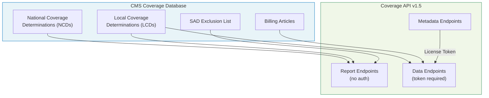
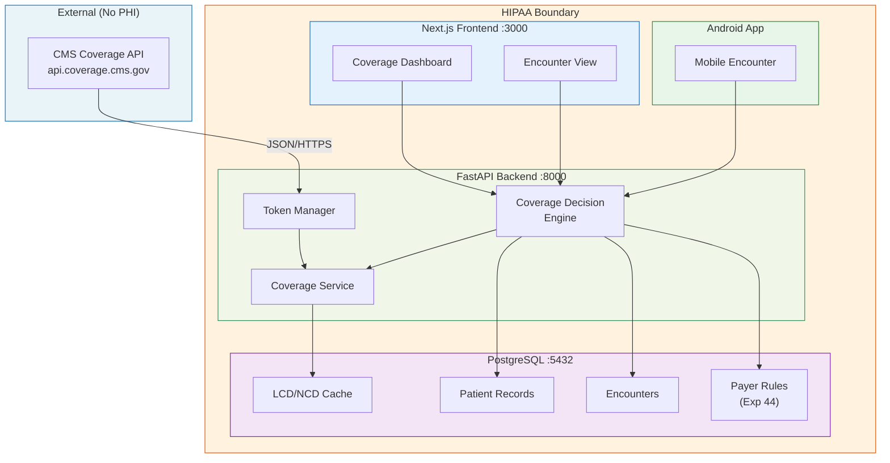

# CMS Coverage API Developer Onboarding Tutorial

**Welcome to the MPS PMS CMS Coverage API Integration Team**

This tutorial will take you from zero to building your first Medicare coverage determination feature using the CMS Coverage API. By the end, you will understand how the API works, have queried real LCD and NCD data, and built a coverage check that tells clinical staff whether a procedure is covered by Medicare for a specific diagnosis — before they submit the claim.

**Document ID:** PMS-EXP-CMSCOVAPI-002
**Version:** 1.0
**Date:** 2026-03-07
**Applies To:** PMS project (all platforms)
**Prerequisite:** [CMS Coverage API Setup Guide](45-CMSCoverageAPI-PMS-Developer-Setup-Guide.md)
**Estimated time:** 2-3 hours
**Difficulty:** Beginner-friendly

---

## What You Will Learn

1. What the CMS Coverage API provides and why it matters for PA workflows
2. The difference between NCDs, LCDs, and Articles — and when each applies
3. How Medicare Administrative Contractors (MACs) create jurisdiction-specific coverage rules
4. How to obtain and manage license agreement tokens
5. How to query LCDs by contractor, state, and LCD ID
6. How to extract covered ICD-10 codes and billing codes from an LCD
7. How to detect coverage policy changes over time
8. How to build a real-time coverage determination check for encounters
9. How this integrates with Experiment 44's commercial payer rules
10. HIPAA considerations when combining coverage data with patient encounters

---

## Part 1: Understanding the CMS Coverage API (15 min read)

### 1.1 What Problem Does This Solve?

Today, when a PA coordinator at Texas Retina Associates needs to check whether Medicare covers an intravitreal injection (CPT 67028) for a patient with wet AMD (H35.31), they:

1. Open the [Medicare Coverage Database](https://www.cms.gov/medicare-coverage-database/search.aspx) website
2. Search for "intravitreal" or "67028"
3. Filter by Novitas Solutions (the MAC for Texas)
4. Find LCD L33346
5. Read the LCD text to confirm the diagnosis is covered
6. Check the billing article for documentation requirements

This takes 5-10 minutes per case. The CMS Coverage API lets the PMS do this automatically in < 500ms.

### 1.2 How the CMS Coverage API Works — The Key Pieces



**Three layers of coverage policy:**

1. **NCDs (National)** — Set by CMS centrally. Apply to all states. Example: NCD 80.11 covers age-related macular degeneration treatments nationally. NCDs override LCDs.

2. **LCDs (Local)** — Set by each MAC (Medicare Administrative Contractor) for their jurisdiction. Texas uses Novitas Solutions (Jurisdiction H). LCD L33346 covers intravitreal injections specifically for Novitas's territory. LCDs define which ICD-10 codes are covered, which billing codes to use, and documentation requirements.

3. **Articles** — Companion documents to LCDs containing billing and coding guidelines. Not coverage decisions themselves, but required reading for correct claim submission.

### 1.3 How the CMS Coverage API Fits with Other PMS Technologies

| Technology | Experiment | What It Provides | CMS API Relationship |
|------------|-----------|-----------------|---------------------|
| CMS Prior Auth Dataset | Exp 43 | ML model predicting PA requirement | CMS API provides the coverage rules that the model's predictions are validated against |
| Payer Policy Download | Exp 44 | Commercial payer PA rules (UHC, Aetna, etc.) | CMS API replaces Exp 44's web scraping for Medicare data; Exp 44 remains for commercial payers |
| FHIR Integration | Exp 16 | Standard healthcare data exchange | CMS API data can be wrapped in FHIR CoverageEligibilityResponse resources |
| CMS Coverage API | Exp 45 (this) | Real-time Medicare coverage data | — |

### 1.4 Key Vocabulary

| Term | Meaning |
|------|---------|
| **NCD** | National Coverage Determination — a CMS-wide policy that applies to all states. Highest authority. |
| **LCD** | Local Coverage Determination — a MAC-specific policy defining what is "reasonable and necessary." |
| **Article** | Billing and coding guidance associated with an LCD. Contains documentation requirements. |
| **MAC** | Medicare Administrative Contractor — the company that processes Medicare claims for a region. Texas = Novitas Solutions. |
| **Jurisdiction** | Geographic area served by a MAC. Texas is in Jurisdiction H (Novitas). |
| **SAD** | Self-Administered Drug — oral drugs typically excluded from Part B coverage (Part B covers injectable/infused drugs). |
| **MCD** | Medicare Coverage Database — the CMS website containing all NCDs, LCDs, and Articles. The API exposes this data programmatically. |
| **License Agreement Token** | A Bearer token obtained by accepting AMA/ADA/AHA terms. Required for LCD/Article data endpoints. Valid 1 hour. Free. |
| **HCPCS** | Healthcare Common Procedure Coding System — includes J-codes for drugs (J0178 = aflibercept) and CPT codes for procedures (67028 = intravitreal injection). |
| **CPT** | Current Procedural Terminology — subset of HCPCS codes describing medical procedures. Owned by the AMA (hence the license agreement). |
| **ICD-10** | International Classification of Diseases, 10th revision — diagnosis codes (H35.31 = wet AMD). |

### 1.5 Our Architecture



**Key boundary**: The CMS Coverage API contains no PHI. But when the PMS combines coverage data with patient encounter data, the result is PHI and must stay inside the HIPAA boundary.

---

## Part 2: Environment Verification (15 min)

### 2.1 Checklist

```bash
# 1. Python 3.11+
python3 --version

# 2. httpx installed
python3 -c "import httpx; print(httpx.__version__)"

# 3. CMS API reachable
curl -s -o /dev/null -w "%{http_code}" "https://api.coverage.cms.gov/v1/reports/national-coverage-ncd/"
# Expected: 200

# 4. Can obtain license token
curl -s -X POST "https://api.coverage.cms.gov/v1/metadata/license-agreement" \
  -H "Content-Type: application/json" \
  -d '{"accept_ama": true, "accept_ada": true, "accept_aha": true}' \
  | python3 -c "import sys,json; d=json.load(sys.stdin); print('Token OK' if 'token' in d else 'FAIL')"
# Expected: Token OK

# 5. PMS backend running (if integrating)
curl -s -o /dev/null -w "%{http_code}" http://localhost:8000/health
# Expected: 200

# 6. PostgreSQL accessible (if caching)
psql -U pms -d pms_db -c "SELECT 1;" 2>/dev/null && echo "DB OK" || echo "DB not available"
```

### 2.2 Quick Test

Run this standalone Python script to verify end-to-end API access:

```python
#!/usr/bin/env python3
"""Quick test: Query CMS Coverage API for Texas intravitreal injection LCD."""

import httpx

BASE = "https://api.coverage.cms.gov"

# 1. Get LCDs for Novitas (Texas MAC)
resp = httpx.get(f"{BASE}/v1/reports/local-coverage-final-lcds",
                 params={"contractor": "Novitas Solutions"})
lcds = resp.json()
print(f"Found {len(lcds)} LCDs for Novitas Solutions")

# 2. Find intravitreal injection LCD
ivt = [l for l in lcds if "intravitreal" in l.get("title", "").lower()]
print(f"Intravitreal LCDs: {[l['lcd_id'] for l in ivt]}")

# 3. Get license token
token_resp = httpx.post(f"{BASE}/v1/metadata/license-agreement",
                        json={"accept_ama": True, "accept_ada": True, "accept_aha": True})
token = token_resp.json()["token"]
print(f"License token obtained (expires in 1 hour)")

# 4. Get LCD detail
if ivt:
    lcd_id = ivt[0]["lcd_id"]
    detail = httpx.get(f"{BASE}/v1/data/lcd/{lcd_id}",
                       headers={"Authorization": f"Bearer {token}"}).json()
    print(f"LCD {lcd_id}: {detail.get('title', 'N/A')}")

    # 5. Get ICD-10 codes
    codes = httpx.get(f"{BASE}/v1/data/lcd/{lcd_id}/icd10-codes",
                      headers={"Authorization": f"Bearer {token}"}).json()
    print(f"Covered ICD-10 codes: {len(codes)}")
    for c in codes[:5]:
        print(f"  {c}")

print("\nAll checks passed!")
```

```bash
python3 quick_test_cms_api.py
```

---

## Part 3: Build Your First Integration (45 min)

### 3.1 What We Are Building

A **coverage check endpoint** that takes a procedure code (CPT/HCPCS) and diagnosis code (ICD-10), finds the relevant LCD for the patient's MAC jurisdiction, and returns whether the combination is covered.

Example request:
```
GET /api/coverage/check?procedure=67028&diagnosis=H35.31&state=TX
```

Example response:
```json
{
  "covered": true,
  "lcd_id": 33346,
  "lcd_title": "Intravitreal Injections",
  "contractor": "Novitas Solutions",
  "diagnosis_covered": true,
  "procedure_covered": true,
  "evidence": "ICD-10 H35.31 is listed as a covered diagnosis in LCD L33346"
}
```

### 3.2 Create the Coverage Check Script

Create `cms_coverage_check.py`:

```python
#!/usr/bin/env python3
"""
Coverage Check: Determine if a procedure + diagnosis is covered by Medicare.

Usage:
    python cms_coverage_check.py --procedure 67028 --diagnosis H35.31 --state TX
    python cms_coverage_check.py --procedure 67028 --diagnosis H35.31 --contractor "Novitas Solutions"
"""

import argparse
import json
import sys

import httpx

BASE = "https://api.coverage.cms.gov"

# MAC jurisdictions by state (simplified — Texas focus)
STATE_TO_MAC = {
    "TX": "Novitas Solutions",
    "PA": "Novitas Solutions",
    "NJ": "Novitas Solutions",
    "DE": "Novitas Solutions",
    "MD": "Novitas Solutions",
    "DC": "Novitas Solutions",
    "CA": "Noridian Healthcare Solutions",
    "NY": "National Government Services",
    "FL": "First Coast Service Options",
    "IL": "Wisconsin Physicians Service",
}


def get_token(client: httpx.Client) -> str:
    """Obtain a CMS license agreement token."""
    resp = client.post(
        f"{BASE}/v1/metadata/license-agreement",
        json={"accept_ama": True, "accept_ada": True, "accept_aha": True},
    )
    resp.raise_for_status()
    return resp.json()["token"]


def find_relevant_lcds(client: httpx.Client, contractor: str, procedure: str) -> list:
    """Find LCDs that might cover the given procedure."""
    resp = client.get(
        f"{BASE}/v1/reports/local-coverage-final-lcds",
        params={"contractor": contractor},
    )
    resp.raise_for_status()
    lcds = resp.json()

    # Filter by keywords related to the procedure
    procedure_keywords = {
        "67028": ["intravitreal", "injection", "vitreous"],
        "67036": ["vitrectomy", "vitreous"],
        "67040": ["vitrectomy", "membrane"],
        "92134": ["retinal", "oct", "scanning"],
    }

    keywords = procedure_keywords.get(procedure, [procedure])
    relevant = []
    for lcd in lcds:
        title = lcd.get("title", "").lower()
        if any(kw in title for kw in keywords):
            relevant.append(lcd)

    return relevant


def check_coverage(
    client: httpx.Client,
    token: str,
    lcd_id: int,
    procedure: str,
    diagnosis: str,
) -> dict:
    """Check if a procedure + diagnosis is covered by a specific LCD."""
    headers = {"Authorization": f"Bearer {token}"}

    # Get LCD detail
    lcd = client.get(f"{BASE}/v1/data/lcd/{lcd_id}", headers=headers).json()

    # Get ICD-10 codes
    icd10_codes = client.get(
        f"{BASE}/v1/data/lcd/{lcd_id}/icd10-codes", headers=headers
    ).json()

    # Get billing codes
    bill_codes = client.get(
        f"{BASE}/v1/data/lcd/{lcd_id}/bill-codes", headers=headers
    ).json()

    # Check diagnosis coverage
    covered_icd10 = []
    for code_entry in icd10_codes:
        code = code_entry if isinstance(code_entry, str) else code_entry.get("code", "")
        covered_icd10.append(code)

    diagnosis_covered = any(
        diagnosis.startswith(c.split(".")[0]) or diagnosis == c
        for c in covered_icd10
    )

    # Check procedure coverage
    covered_procedures = []
    for code_entry in bill_codes:
        code = code_entry if isinstance(code_entry, str) else code_entry.get("code", "")
        covered_procedures.append(code)

    procedure_covered = procedure in covered_procedures or not covered_procedures

    return {
        "covered": diagnosis_covered and procedure_covered,
        "lcd_id": lcd_id,
        "lcd_title": lcd.get("title", "Unknown"),
        "contractor": lcd.get("contractor", "Unknown"),
        "diagnosis_covered": diagnosis_covered,
        "diagnosis_code": diagnosis,
        "procedure_covered": procedure_covered,
        "procedure_code": procedure,
        "covered_icd10_count": len(covered_icd10),
        "covered_bill_code_count": len(covered_procedures),
        "evidence": (
            f"ICD-10 {diagnosis} {'is' if diagnosis_covered else 'is NOT'} listed "
            f"as a covered diagnosis in LCD L{lcd_id}"
        ),
    }


def main():
    parser = argparse.ArgumentParser(description="Check Medicare coverage for a procedure + diagnosis")
    parser.add_argument("--procedure", required=True, help="CPT/HCPCS code (e.g., 67028)")
    parser.add_argument("--diagnosis", required=True, help="ICD-10 code (e.g., H35.31)")
    parser.add_argument("--state", help="Two-letter state code (e.g., TX)")
    parser.add_argument("--contractor", help="MAC name (e.g., 'Novitas Solutions')")
    args = parser.parse_args()

    if not args.contractor and not args.state:
        print("Error: Provide --state or --contractor", file=sys.stderr)
        sys.exit(1)

    contractor = args.contractor or STATE_TO_MAC.get(args.state.upper())
    if not contractor:
        print(f"Error: Unknown state '{args.state}'. Provide --contractor instead.", file=sys.stderr)
        sys.exit(1)

    client = httpx.Client(timeout=30.0)

    print(f"Checking coverage: {args.procedure} + {args.diagnosis} in {contractor}")
    print()

    # Step 1: Find relevant LCDs
    lcds = find_relevant_lcds(client, contractor, args.procedure)
    if not lcds:
        print(f"No LCDs found for procedure {args.procedure} under {contractor}")
        sys.exit(0)

    print(f"Found {len(lcds)} relevant LCD(s):")
    for lcd in lcds:
        print(f"  L{lcd['lcd_id']}: {lcd['title']}")
    print()

    # Step 2: Get token
    token = get_token(client)

    # Step 3: Check coverage for each LCD
    for lcd in lcds:
        result = check_coverage(client, token, lcd["lcd_id"], args.procedure, args.diagnosis)
        print(f"LCD L{result['lcd_id']}: {result['lcd_title']}")
        print(f"  Diagnosis {args.diagnosis}: {'COVERED' if result['diagnosis_covered'] else 'NOT COVERED'}")
        print(f"  Procedure {args.procedure}: {'COVERED' if result['procedure_covered'] else 'NOT COVERED'}")
        print(f"  Overall: {'COVERED' if result['covered'] else 'NOT COVERED'}")
        print(f"  Evidence: {result['evidence']}")
        print(f"  ICD-10 codes in LCD: {result['covered_icd10_count']}")
        print(f"  Bill codes in LCD: {result['covered_bill_code_count']}")
        print()

    # Output JSON
    print("--- JSON Result ---")
    print(json.dumps(result, indent=2))


if __name__ == "__main__":
    main()
```

### 3.3 Run the Coverage Check

```bash
# Check if intravitreal injection (67028) is covered for wet AMD (H35.31) in Texas
python cms_coverage_check.py --procedure 67028 --diagnosis H35.31 --state TX
```

Expected output:
```
Checking coverage: 67028 + H35.31 in Novitas Solutions

Found 1 relevant LCD(s):
  L33346: Intravitreal Injections

LCD L33346: Intravitreal Injections
  Diagnosis H35.31: COVERED
  Procedure 67028: COVERED
  Overall: COVERED
  Evidence: ICD-10 H35.31 is listed as a covered diagnosis in LCD L33346
  ICD-10 codes in LCD: 42
  Bill codes in LCD: 8
```

### 3.4 Try Additional Queries

```bash
# Diabetic macular edema
python cms_coverage_check.py --procedure 67028 --diagnosis E11.311 --state TX

# Retinal vein occlusion
python cms_coverage_check.py --procedure 67028 --diagnosis H34.11 --state TX

# A diagnosis that might NOT be covered
python cms_coverage_check.py --procedure 67028 --diagnosis Z00.00 --state TX
```

### 3.5 Build a Change Detection Script

Create `cms_change_detector.py`:

```python
#!/usr/bin/env python3
"""Detect changes in CMS coverage data since last check."""

import json
from datetime import datetime
from pathlib import Path

import httpx

BASE = "https://api.coverage.cms.gov"
STATE_FILE = Path("cms_last_check.json")


def main():
    client = httpx.Client(timeout=30.0)

    # Get current update period
    resp = client.get(f"{BASE}/v1/metadata/update-period/")
    resp.raise_for_status()
    current = resp.json()

    print(f"Current CMS data period: {json.dumps(current, indent=2)}")

    # Load previous check
    if STATE_FILE.exists():
        previous = json.loads(STATE_FILE.read_text())
        if current != previous:
            print("\n*** CMS DATA HAS BEEN UPDATED ***")
            print(f"Previous: {json.dumps(previous)}")
            print(f"Current:  {json.dumps(current)}")
            print("Action: Re-sync LCD cache and check for policy changes")
        else:
            print("\nNo changes since last check.")
    else:
        print("\nFirst run — saving baseline.")

    # Save current state
    STATE_FILE.write_text(json.dumps(current, indent=2))
    print(f"Saved to {STATE_FILE}")


if __name__ == "__main__":
    main()
```

### 3.6 Verify Your Build

```bash
# Run change detector
python cms_change_detector.py

# Run it again — should show "No changes"
python cms_change_detector.py
```

**Checkpoint**: You have a working coverage check that queries the CMS Coverage API in real time and a change detector that tracks data updates.

---

## Part 4: Evaluating Strengths and Weaknesses (15 min)

### 4.1 Strengths

- **Free and open**: No API key, no registration, no cost. 10,000 req/s rate limit is generous.
- **Structured data**: Returns JSON with ICD-10 codes, billing codes, and modifiers — no PDF parsing needed.
- **Always current**: Data matches the MCD website. Changes are reflected via the update-period endpoint.
- **No PHI**: Coverage policy data is public. No BAA needed for the API itself.
- **Stable versioning**: 5 releases (v1.1-v1.5) with zero deprecations. CMS is adding endpoints, not removing them.
- **Comprehensive**: Covers NCDs, LCDs, Articles, SAD exclusions, and contractor metadata.

### 4.2 Weaknesses

- **Medicare only**: No commercial payer data. UHC, Aetna, BCBS, etc. are not in this API.
- **Part B only**: Does not cover Part A (hospital), Part C (MA plan-specific rules), or Part D (prescription drugs).
- **LCD text is unstructured**: While ICD-10 and billing codes are structured, the LCD narrative text (coverage criteria, documentation requirements) is still free-form text that requires NLP or manual reading.
- **No search by CPT code**: You can list LCDs by contractor/state, but you can't search by procedure code. You have to filter client-side by title keyword.
- **License token friction**: LCD/Article data endpoints require accepting AMA/ADA/AHA terms on every session (token valid 1 hour).
- **No webhook/push**: The API is pull-only. You must poll the update-period endpoint to detect changes.

### 4.3 When to Use CMS Coverage API vs Alternatives

| Scenario | Use CMS Coverage API | Use Alternative |
|----------|---------------------|-----------------|
| Check if Medicare covers a procedure | Yes | — |
| Check if UHC/Aetna requires PA | No | Experiment 44 payer rules |
| Get LCD ICD-10 codes programmatically | Yes | — |
| Get commercial formulary data | No | Payer websites / RxNav |
| Train ML model on PA data | Supplement | Experiment 43 CMS PA Dataset |
| Real-time coverage check in encounter | Yes (Medicare patients) | Experiment 44 (commercial patients) |
| Bulk download all LCDs | Yes (reports + data endpoints) | MCD Downloads page (static files) |

### 4.4 HIPAA / Healthcare Considerations

- **The API itself is safe**: Coverage policy documents are public information. No PHI is sent or received.
- **The PMS context is PHI**: When you query "Is CPT 67028 covered for diagnosis H35.31 for patient John Smith in Texas?", the combination of patient identity + diagnosis + procedure is PHI. This query must stay within the PMS HIPAA boundary.
- **Audit logging**: Log every coverage lookup with the user who triggered it, the encounter ID, and the result. This supports compliance and quality assurance.
- **Cache security**: The PostgreSQL cache of LCD/NCD content is not PHI. But the `cms_change_log` table and any encounter-correlated queries must be treated as PHI if they reference patient records.

---

## Part 5: Debugging Common Issues (15 min read)

### Issue 1: "Token is invalid or expired"

**Symptom**: 401 response from LCD/Article data endpoints.
**Cause**: License agreement token expired (1 hour TTL) or was never obtained.
**Fix**: Re-call `/v1/metadata/license-agreement` to get a fresh token. The `CMSToken` class in the setup guide handles this automatically with a 55-minute refresh cycle.

### Issue 2: "No LCDs found for procedure X"

**Symptom**: The `find_relevant_lcds` function returns empty.
**Cause**: The procedure code isn't in the keyword map, or the LCD title doesn't match expected keywords.
**Fix**: Check the MCD website manually to find the LCD title, then add the keywords. LCD titles are not standardized — "Intravitreal Injections" vs "Vitreous Injections" vs "Anti-VEGF Therapy" vary by MAC.

### Issue 3: "ICD-10 code format mismatch"

**Symptom**: A diagnosis that should be covered shows as "NOT COVERED."
**Cause**: ICD-10 codes in the API may use different precision levels. The LCD might list `H35.31` but your encounter has `H35.3110` (with laterality).
**Fix**: Match by prefix — `H35.3110`.startswith(`H35.31`) = True.

### Issue 4: "Connection timeout to api.coverage.cms.gov"

**Symptom**: httpx.TimeoutException after 30 seconds.
**Cause**: CMS API can be slow during high-traffic periods or maintenance windows.
**Fix**: Increase timeout to 60s. Implement the PostgreSQL cache so cached lookups don't depend on API availability.

### Issue 5: "Empty bill_codes for LCD"

**Symptom**: `/v1/data/lcd/{id}/bill-codes` returns an empty array.
**Cause**: Not all LCDs have billing codes in the structured data. Some LCDs list codes only in the narrative text.
**Fix**: Fall back to text search in the LCD content, or check the associated Article for billing guidance.

---

## Part 6: Practice Exercises (45 min)

### Option A: Build a Contractor Lookup Tool

Build a script that takes a state abbreviation and returns all active LCDs for that state's MAC, grouped by medical specialty (based on LCD title keywords).

**Hints:**
1. Use `/v1/reports/local-coverage-final-lcds?state={state}` to get LCDs
2. Categorize by keywords: "ophthalm", "cardio", "ortho", "derma", etc.
3. Display as a summary table

### Option B: Build an LCD Diff Tool

Build a script that compares two snapshots of LCD data and reports what changed (new LCDs, retired LCDs, modified titles).

**Hints:**
1. Save LCD list to a JSON file on first run
2. On subsequent runs, compare current list vs saved
3. Report additions, removals, and title changes
4. Use the `update-period` endpoint to check if new data is available before comparing

### Option C: Build a Multi-Procedure Coverage Matrix

Build a script that takes a list of procedure codes and a state, then produces a matrix showing which procedures are covered for which diagnoses under that state's MAC.

**Hints:**
1. For each procedure, find relevant LCDs
2. For each LCD, get ICD-10 codes
3. Build a matrix: rows = procedures, columns = diagnosis groups (wet AMD, DME, RVO, GA)
4. Output as a markdown table

---

## Part 7: Development Workflow and Conventions

### 7.1 File Organization

```
pms-backend/
├── app/
│   ├── services/
│   │   └── cms_coverage.py        # CMS Coverage API client
│   ├── routers/
│   │   └── coverage.py            # FastAPI endpoints
│   ├── models/
│   │   └── coverage.py            # SQLAlchemy models for cache tables
│   └── tasks/
│       └── cms_sync.py            # Daily sync / change detection
└── tests/
    └── test_cms_coverage.py       # Unit and integration tests

pms-frontend/
├── components/
│   └── CoverageLookup.tsx         # Coverage lookup UI component
└── app/
    └── coverage/
        └── lcd/
            └── [id]/
                └── page.tsx       # LCD detail page
```

### 7.2 Naming Conventions

| Item | Convention | Example |
|------|-----------|---------|
| API client class | `CMS` prefix + `Client` suffix | `CMSCoverageClient` |
| FastAPI router | Resource name, plural | `coverage.router` |
| DB table | `cms_` prefix | `cms_lcds`, `cms_ncds` |
| Cache key | `cms:{type}:{id}` | `cms:lcd:33346` |
| Config var | `CMS_COVERAGE_` prefix | `CMS_COVERAGE_BASE_URL` |
| Frontend component | PascalCase, descriptive | `CoverageLookup`, `LCDDetail` |

### 7.3 PR Checklist

- [ ] CMS API calls use the `CMSCoverageClient` class (not raw httpx calls)
- [ ] Token management goes through `CMSToken` (no hardcoded tokens)
- [ ] All coverage queries are audit-logged (user ID, encounter ID, LCD IDs)
- [ ] PostgreSQL cache is used for LCD/NCD content (no direct API calls from frontend)
- [ ] No PHI is sent to the CMS API (coverage queries only contain codes, not patient data)
- [ ] Error handling includes fallback to cached data when CMS API is unavailable
- [ ] New LCD/NCD types are added to the cache schema if needed

### 7.4 Security Reminders

- **Never send patient identifiers to the CMS API.** The API accepts only coverage policy queries (LCD IDs, contractor names, state codes). Patient names, MRNs, dates of birth, etc. must never appear in API requests.
- **License tokens are secrets.** Store in memory only (not in logs, not in the database, not in frontend code). Rotate every 55 minutes.
- **Audit every coverage lookup.** Log who queried, when, what encounter it was for, and what LCD/NCD was returned. This is a HIPAA audit requirement when coverage data is used in clinical decision-making.
- **Cache is not PHI** (LCD/NCD content is public). But any table that joins coverage data with patient encounters is PHI and must be encrypted at rest.

---

## Part 8: Quick Reference Card

### Key Endpoints

| Endpoint | Auth | Description |
|----------|------|-------------|
| `GET /v1/reports/local-coverage-final-lcds` | None | List all Final LCDs (filter by contractor/state) |
| `GET /v1/reports/national-coverage-ncd/` | None | List all NCDs |
| `GET /v1/reports/local-coverage-articles` | None | List all Articles |
| `POST /v1/metadata/license-agreement` | None | Get Bearer token (valid 1 hour) |
| `GET /v1/data/lcd/{id}` | Bearer | LCD detail |
| `GET /v1/data/lcd/{id}/icd10-codes` | Bearer | Covered ICD-10 codes |
| `GET /v1/data/lcd/{id}/bill-codes` | Bearer | Billing codes |
| `GET /v1/data/lcd/{id}/modifiers` | Bearer | Modifiers |
| `GET /v1/data/article/{id}` | Bearer | Article detail |
| `GET /v1/metadata/update-period/` | None | Current data capture period |
| `GET /v1/reports/local-coverage-sad-exclusion-list` | None | SAD exclusion list |

### Key LCD for Texas Retina Associates

| LCD ID | Title | MAC | Relevance |
|--------|-------|-----|-----------|
| 33346 | Intravitreal Injections | Novitas Solutions | Covers anti-VEGF drugs (CPT 67028) |

### Quick Commands

```bash
# List Texas LCDs
curl -s "https://api.coverage.cms.gov/v1/reports/local-coverage-final-lcds?contractor=Novitas+Solutions" | jq 'length'

# Get token
TOKEN=$(curl -s -X POST "https://api.coverage.cms.gov/v1/metadata/license-agreement" -H "Content-Type: application/json" -d '{"accept_ama":true,"accept_ada":true,"accept_aha":true}' | jq -r '.token')

# Get LCD detail
curl -s "https://api.coverage.cms.gov/v1/data/lcd/33346" -H "Authorization: Bearer $TOKEN" | jq '.title'

# Check for data updates
curl -s "https://api.coverage.cms.gov/v1/metadata/update-period/" | jq '.'
```

---

## Next Steps

1. **Integrate with Experiment 44**: Build the unified Coverage Decision Engine that combines CMS API data (Medicare) with commercial payer rules (UHC, Aetna, etc.)
2. **Add the daily sync job**: Use `cms_change_detector.py` as a cron task to detect LCD/NCD updates
3. **Build the encounter integration**: Auto-trigger coverage checks when clinicians enter procedure and diagnosis codes
4. **Explore the MCP connector**: The [Deepsense CMS Coverage MCP Connector](https://docs.mcp.deepsense.ai/guides/cms_coverage.html) wraps the same API for use with Claude — useful for AI-assisted coverage determination
5. **Review CMS-0057-F**: The [CMS Interoperability and Prior Authorization Final Rule](https://www.cms.gov/cms-interoperability-and-prior-authorization-final-rule-cms-0057-f) requires payers to implement FHIR-based PA APIs by January 2027 — plan for integration
