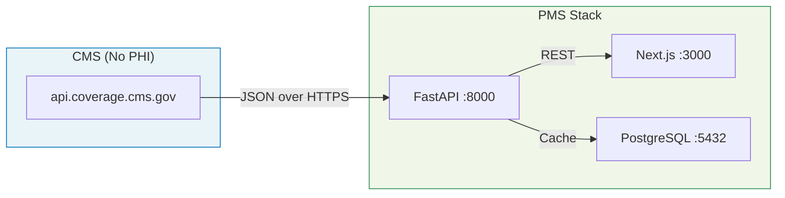

# CMS Coverage API Setup Guide for PMS Integration

**Document ID:** PMS-EXP-CMSCOVAPI-001
**Version:** 1.0
**Date:** 2026-03-07
**Applies To:** PMS project (all platforms)
**Prerequisites Level:** Beginner

---

## Table of Contents

1. [Overview](#1-overview)
2. [Prerequisites](#2-prerequisites)
3. [Part A: Explore the CMS Coverage API](#3-part-a-explore-the-cms-coverage-api)
4. [Part B: Integrate with PMS Backend](#4-part-b-integrate-with-pms-backend)
5. [Part C: Database Schema and Caching](#5-part-c-database-schema-and-caching)
6. [Part D: Integrate with PMS Frontend](#6-part-d-integrate-with-pms-frontend)
7. [Part E: Testing and Verification](#7-part-e-testing-and-verification)
8. [Troubleshooting](#8-troubleshooting)
9. [Reference Commands](#9-reference-commands)

---

## 1. Overview

This guide walks you through integrating the CMS Coverage API into the PMS. By the end, you will have:

- A working Python client that queries CMS for LCDs, NCDs, and billing articles
- A FastAPI service layer with caching in PostgreSQL
- A frontend component that displays coverage determinations inline on encounters
- A daily sync job that detects LCD/NCD changes



**Key facts about the CMS Coverage API:**
- **Base URL**: `https://api.coverage.cms.gov`
- **No API key required** (removed February 2024)
- **Rate limit**: 10,000 requests/second
- **Data format**: JSON
- **License token**: Required for LCD/Article data endpoints (free, obtained via API call, valid 1 hour)
- **No PHI**: Contains only coverage policy documents

---

## 2. Prerequisites

### 2.1 Required Software

| Software | Minimum Version | Check Command |
|----------|----------------|---------------|
| Python | 3.11+ | `python3 --version` |
| Node.js | 18+ | `node --version` |
| PostgreSQL | 14+ | `psql --version` |
| pip | 23+ | `pip --version` |
| curl | any | `curl --version` |

### 2.2 Python Dependencies

```bash
pip install httpx pydantic sqlalchemy alembic asyncpg
```

### 2.3 Verify PMS Services

Confirm the PMS backend, frontend, and database are running:

```bash
# Backend
curl -s http://localhost:8000/health | jq .

# Frontend
curl -s -o /dev/null -w "%{http_code}" http://localhost:3000

# PostgreSQL
psql -U pms -d pms_db -c "SELECT 1;"
```

All three must return successfully before proceeding.

---

## 3. Part A: Explore the CMS Coverage API

Before writing any integration code, explore the API directly to understand its responses.

### Step 1: Test the API (No Auth Required)

The reports endpoints do not require a license token. Start with these:

```bash
# List all NCDs
curl -s "https://api.coverage.cms.gov/v1/reports/national-coverage-ncd/" | jq '.[] | {ncd_id, title}' | head -40

# List Final LCDs for Novitas (Texas MAC, Jurisdiction H)
curl -s "https://api.coverage.cms.gov/v1/reports/local-coverage-final-lcds?contractor=Novitas+Solutions" | jq '.[] | {lcd_id, title, status}' | head -40

# Search for intravitreal injection LCDs
curl -s "https://api.coverage.cms.gov/v1/reports/local-coverage-final-lcds?contractor=Novitas+Solutions" | jq '[.[] | select(.title | test("intravitreal|vitreous|retina"; "i"))]'
```

### Step 2: Obtain a License Agreement Token

LCD and Article data endpoints require a Bearer token:

```bash
# Accept AMA/ADA/AHA license agreements and get token
TOKEN=$(curl -s -X POST "https://api.coverage.cms.gov/v1/metadata/license-agreement" \
  -H "Content-Type: application/json" \
  -d '{"accept_ama": true, "accept_ada": true, "accept_aha": true}' | jq -r '.token')

echo "Token (first 20 chars): ${TOKEN:0:20}..."
echo "Token is valid for 1 hour"
```

### Step 3: Query LCD Detail Data

Use the token to access LCD content:

```bash
# Get LCD L33346 (Intravitreal Injections — Novitas)
curl -s "https://api.coverage.cms.gov/v1/data/lcd/33346" \
  -H "Authorization: Bearer $TOKEN" | jq '{lcd_id, title, contractor, status}'

# Get ICD-10 codes covered by LCD L33346
curl -s "https://api.coverage.cms.gov/v1/data/lcd/33346/icd10-codes" \
  -H "Authorization: Bearer $TOKEN" | jq '.[0:10]'

# Get billing codes for LCD L33346
curl -s "https://api.coverage.cms.gov/v1/data/lcd/33346/bill-codes" \
  -H "Authorization: Bearer $TOKEN" | jq '.'
```

### Step 4: Check the Update Period

```bash
# See when CMS last updated its data
curl -s "https://api.coverage.cms.gov/v1/metadata/update-period/" | jq '.'
```

**Checkpoint**: You can query LCDs, NCDs, and articles from the CMS Coverage API. You have a valid token and understand the endpoint structure.

---

## 4. Part B: Integrate with PMS Backend

### Step 1: Create the CMS Coverage Client

Create `app/services/cms_coverage.py` in the PMS backend:

```python
"""CMS Coverage API client with token management and caching."""

import time
from typing import Optional

import httpx
from pydantic import BaseModel

CMS_BASE_URL = "https://api.coverage.cms.gov"
TOKEN_TTL_SECONDS = 3300  # 55 minutes (token valid for 60)


class CMSToken:
    """Manages the CMS license agreement token lifecycle."""

    def __init__(self):
        self._token: Optional[str] = None
        self._expires_at: float = 0

    async def get_token(self, client: httpx.AsyncClient) -> str:
        if self._token and time.time() < self._expires_at:
            return self._token

        resp = await client.post(
            f"{CMS_BASE_URL}/v1/metadata/license-agreement",
            json={"accept_ama": True, "accept_ada": True, "accept_aha": True},
        )
        resp.raise_for_status()
        self._token = resp.json()["token"]
        self._expires_at = time.time() + TOKEN_TTL_SECONDS
        return self._token


class LCDSummary(BaseModel):
    lcd_id: int
    title: str
    contractor: Optional[str] = None
    status: Optional[str] = None


class CMSCoverageClient:
    """Client for the CMS Coverage API v1.5."""

    def __init__(self):
        self._client = httpx.AsyncClient(timeout=30.0)
        self._token_mgr = CMSToken()

    async def _authed_get(self, path: str, params: dict = None) -> dict | list:
        token = await self._token_mgr.get_token(self._client)
        resp = await self._client.get(
            f"{CMS_BASE_URL}{path}",
            params=params,
            headers={"Authorization": f"Bearer {token}"},
        )
        resp.raise_for_status()
        return resp.json()

    async def _public_get(self, path: str, params: dict = None) -> dict | list:
        resp = await self._client.get(
            f"{CMS_BASE_URL}{path}",
            params=params,
        )
        resp.raise_for_status()
        return resp.json()

    # --- Reports (no token required) ---

    async def list_final_lcds(self, contractor: str = None, state: str = None) -> list:
        params = {}
        if contractor:
            params["contractor"] = contractor
        if state:
            params["state"] = state
        return await self._public_get("/v1/reports/local-coverage-final-lcds", params)

    async def list_ncds(self) -> list:
        return await self._public_get("/v1/reports/national-coverage-ncd/")

    async def list_articles(self, contractor: str = None) -> list:
        params = {}
        if contractor:
            params["contractor"] = contractor
        return await self._public_get("/v1/reports/local-coverage-articles", params)

    # --- LCD Data (token required) ---

    async def get_lcd(self, lcd_id: int) -> dict:
        return await self._authed_get(f"/v1/data/lcd/{lcd_id}")

    async def get_lcd_icd10_codes(self, lcd_id: int) -> list:
        return await self._authed_get(f"/v1/data/lcd/{lcd_id}/icd10-codes")

    async def get_lcd_bill_codes(self, lcd_id: int) -> list:
        return await self._authed_get(f"/v1/data/lcd/{lcd_id}/bill-codes")

    async def get_lcd_modifiers(self, lcd_id: int) -> list:
        return await self._authed_get(f"/v1/data/lcd/{lcd_id}/modifiers")

    # --- Article Data (token required) ---

    async def get_article(self, article_id: int) -> dict:
        return await self._authed_get(f"/v1/data/article/{article_id}")

    async def get_article_icd10_codes(self, article_id: int) -> list:
        return await self._authed_get(f"/v1/data/article/{article_id}/icd10-codes")

    # --- Metadata ---

    async def get_update_period(self) -> dict:
        return await self._public_get("/v1/metadata/update-period/")

    async def get_sad_exclusion_list(self, hcpcs_code: str = None) -> list:
        params = {}
        if hcpcs_code:
            params["hcpcs_code"] = hcpcs_code
        return await self._public_get(
            "/v1/reports/local-coverage-sad-exclusion-list", params
        )

    async def close(self):
        await self._client.aclose()
```

### Step 2: Create the FastAPI Router

Create `app/routers/coverage.py`:

```python
"""CMS Coverage API endpoints for the PMS."""

from fastapi import APIRouter, HTTPException, Query

from app.services.cms_coverage import CMSCoverageClient

router = APIRouter(prefix="/api/coverage", tags=["coverage"])
client = CMSCoverageClient()


@router.get("/lcds")
async def list_lcds(
    contractor: str = Query(None, description="MAC name, e.g. 'Novitas Solutions'"),
    state: str = Query(None, description="Two-letter state code, e.g. 'TX'"),
):
    """List Final LCDs, optionally filtered by contractor or state."""
    return await client.list_final_lcds(contractor=contractor, state=state)


@router.get("/lcds/{lcd_id}")
async def get_lcd(lcd_id: int):
    """Get full LCD content by ID."""
    try:
        return await client.get_lcd(lcd_id)
    except Exception as e:
        raise HTTPException(status_code=502, detail=f"CMS API error: {e}")


@router.get("/lcds/{lcd_id}/icd10-codes")
async def get_lcd_icd10(lcd_id: int):
    """Get ICD-10 codes covered by an LCD."""
    return await client.get_lcd_icd10_codes(lcd_id)


@router.get("/lcds/{lcd_id}/bill-codes")
async def get_lcd_bill_codes(lcd_id: int):
    """Get billing codes for an LCD."""
    return await client.get_lcd_bill_codes(lcd_id)


@router.get("/ncds")
async def list_ncds():
    """List all National Coverage Determinations."""
    return await client.list_ncds()


@router.get("/sad-exclusion")
async def check_sad_exclusion(hcpcs_code: str = Query(..., description="HCPCS J-code")):
    """Check if a drug is on the SAD exclusion list."""
    return await client.get_sad_exclusion_list(hcpcs_code=hcpcs_code)


@router.get("/update-period")
async def get_update_period():
    """Get the current CMS data update period."""
    return await client.get_update_period()
```

### Step 3: Register the Router

In your `app/main.py`:

```python
from app.routers import coverage

app.include_router(coverage.router)
```

**Checkpoint**: The PMS backend now exposes `/api/coverage/lcds`, `/api/coverage/ncds`, and related endpoints that proxy to the CMS Coverage API with automatic token management.

---

## 5. Part C: Database Schema and Caching

### Step 1: Create Migration

Create an Alembic migration for the CMS coverage cache tables:

```sql
-- cms_lcds: Cache of LCD content
CREATE TABLE cms_lcds (
    lcd_id INTEGER PRIMARY KEY,
    title TEXT NOT NULL,
    contractor TEXT,
    status TEXT,
    content JSONB NOT NULL,
    icd10_codes JSONB,
    bill_codes JSONB,
    fetched_at TIMESTAMPTZ NOT NULL DEFAULT NOW(),
    expires_at TIMESTAMPTZ NOT NULL DEFAULT NOW() + INTERVAL '24 hours'
);

-- cms_ncds: Cache of NCD content
CREATE TABLE cms_ncds (
    ncd_id TEXT PRIMARY KEY,
    title TEXT NOT NULL,
    content JSONB NOT NULL,
    fetched_at TIMESTAMPTZ NOT NULL DEFAULT NOW(),
    expires_at TIMESTAMPTZ NOT NULL DEFAULT NOW() + INTERVAL '24 hours'
);

-- cms_articles: Cache of billing articles
CREATE TABLE cms_articles (
    article_id INTEGER PRIMARY KEY,
    title TEXT NOT NULL,
    contractor TEXT,
    content JSONB NOT NULL,
    fetched_at TIMESTAMPTZ NOT NULL DEFAULT NOW(),
    expires_at TIMESTAMPTZ NOT NULL DEFAULT NOW() + INTERVAL '24 hours'
);

-- cms_change_log: Track LCD/NCD changes over time
CREATE TABLE cms_change_log (
    id SERIAL PRIMARY KEY,
    document_type TEXT NOT NULL,  -- 'lcd' or 'ncd'
    document_id TEXT NOT NULL,
    change_type TEXT NOT NULL,    -- 'new', 'updated', 'retired'
    old_content JSONB,
    new_content JSONB,
    detected_at TIMESTAMPTZ NOT NULL DEFAULT NOW()
);

CREATE INDEX idx_change_log_detected ON cms_change_log (detected_at DESC);
CREATE INDEX idx_change_log_doc ON cms_change_log (document_type, document_id);
```

### Step 2: Run the Migration

```bash
cd /path/to/pms-backend
alembic revision --autogenerate -m "Add CMS coverage cache tables"
alembic upgrade head
```

### Step 3: Verify Tables

```bash
psql -U pms -d pms_db -c "\dt cms_*"
```

Expected output:
```
           List of relations
 Schema |      Name       | Type  | Owner
--------+-----------------+-------+-------
 public | cms_articles    | table | pms
 public | cms_change_log  | table | pms
 public | cms_lcds        | table | pms
 public | cms_ncds        | table | pms
```

**Checkpoint**: PostgreSQL has cache tables for LCDs, NCDs, articles, and a change log.

---

## 6. Part D: Integrate with PMS Frontend

### Step 1: Create Coverage Lookup Component

Create `components/CoverageLookup.tsx`:

```tsx
"use client";

import { useState } from "react";

interface LCDResult {
  lcd_id: number;
  title: string;
  contractor: string;
  status: string;
}

export default function CoverageLookup() {
  const [contractor, setContractor] = useState("Novitas Solutions");
  const [results, setResults] = useState<LCDResult[]>([]);
  const [loading, setLoading] = useState(false);

  const searchLCDs = async () => {
    setLoading(true);
    try {
      const params = new URLSearchParams({ contractor });
      const res = await fetch(`/api/coverage/lcds?${params}`);
      const data = await res.json();
      setResults(data);
    } finally {
      setLoading(false);
    }
  };

  return (
    <div>
      <h2>Medicare Coverage Lookup</h2>
      <div>
        <label>MAC Contractor:</label>
        <select value={contractor} onChange={(e) => setContractor(e.target.value)}>
          <option value="Novitas Solutions">Novitas Solutions (TX — Jurisdiction H)</option>
          <option value="Palmetto GBA">Palmetto GBA</option>
          <option value="CGS Administrators">CGS Administrators</option>
          <option value="First Coast Service Options">First Coast</option>
          <option value="National Government Services">NGS</option>
          <option value="WPS Government Health Administrators">WPS</option>
          <option value="Wisconsin Physicians Service">WPS</option>
        </select>
        <button onClick={searchLCDs} disabled={loading}>
          {loading ? "Searching..." : "Search LCDs"}
        </button>
      </div>
      <table>
        <thead>
          <tr><th>LCD ID</th><th>Title</th><th>Status</th></tr>
        </thead>
        <tbody>
          {results.map((lcd) => (
            <tr key={lcd.lcd_id}>
              <td><a href={`/coverage/lcd/${lcd.lcd_id}`}>{lcd.lcd_id}</a></td>
              <td>{lcd.title}</td>
              <td>{lcd.status}</td>
            </tr>
          ))}
        </tbody>
      </table>
    </div>
  );
}
```

### Step 2: Add Environment Variable

In `.env.local`:

```
NEXT_PUBLIC_API_URL=http://localhost:8000
```

**Checkpoint**: The frontend has a Coverage Lookup component that queries the PMS backend, which in turn queries the CMS Coverage API.

---

## 7. Part E: Testing and Verification

### Service Health Checks

```bash
# 1. CMS Coverage API is reachable
curl -s -o /dev/null -w "CMS API: %{http_code}\n" "https://api.coverage.cms.gov/v1/reports/national-coverage-ncd/"

# 2. PMS backend coverage endpoint works
curl -s "http://localhost:8000/api/coverage/lcds?contractor=Novitas+Solutions" | jq 'length'

# 3. LCD detail works (requires token — handled internally)
curl -s "http://localhost:8000/api/coverage/lcds/33346" | jq '.title'

# 4. ICD-10 codes for LCD
curl -s "http://localhost:8000/api/coverage/lcds/33346/icd10-codes" | jq 'length'

# 5. NCD list works
curl -s "http://localhost:8000/api/coverage/ncds" | jq 'length'

# 6. Update period returns dates
curl -s "http://localhost:8000/api/coverage/update-period" | jq '.'
```

### Functional Test: Anti-VEGF Coverage Lookup

```bash
# Find LCDs related to intravitreal injections in Texas
curl -s "http://localhost:8000/api/coverage/lcds?contractor=Novitas+Solutions" \
  | jq '[.[] | select(.title | test("intravitreal|vitreous|injection"; "i"))]'

# Expected: LCD L33346 "Intravitreal Injections" should appear
```

### Integration Test: SAD Exclusion Check

```bash
# Check if aflibercept (J0178) is on SAD exclusion list
curl -s "http://localhost:8000/api/coverage/sad-exclusion?hcpcs_code=J0178" | jq '.'
```

**Checkpoint**: All CMS Coverage API endpoints are accessible through the PMS backend, with automatic token management and proper error handling.

---

## 8. Troubleshooting

### License Token Errors (401/403)

**Symptom**: LCD/Article endpoint returns 401 Unauthorized or 403 Forbidden.

**Fix**: The token expires after 1 hour. The `CMSToken` class auto-refreshes at 55 minutes. If you see this error:
1. Check that the `/v1/metadata/license-agreement` endpoint is reachable
2. Verify the POST body includes all three agreements: `accept_ama`, `accept_ada`, `accept_aha`
3. Check if CMS has changed the license agreement endpoint (review release notes)

### Empty LCD Results

**Symptom**: `/api/coverage/lcds` returns an empty array.

**Fix**: The contractor name must match exactly. Use the CMS spelling:
- `Novitas Solutions` (not "Novitas" or "novitas solutions")
- `Palmetto GBA` (not "Palmetto")

### Timeout on LCD Detail

**Symptom**: `/api/coverage/lcds/{id}` times out after 30 seconds.

**Fix**: The CMS API can be slow for large LCDs. Increase the `httpx` timeout:
```python
self._client = httpx.AsyncClient(timeout=60.0)
```

### Rate Limiting (429)

**Symptom**: HTTP 429 Too Many Requests.

**Fix**: The limit is 10,000 req/s — you're unlikely to hit this in normal usage. If you do (e.g., during bulk sync), add exponential backoff:
```python
import asyncio
await asyncio.sleep(2 ** retry_count)
```

### Database Cache Stale

**Symptom**: LCD content doesn't match the CMS website.

**Fix**: Check the `expires_at` column. Force a refresh:
```sql
DELETE FROM cms_lcds WHERE lcd_id = 33346;
```
Then re-query the endpoint.

---

## 9. Reference Commands

### Daily Development Workflow

```bash
# Start PMS backend
cd /path/to/pms-backend && uvicorn app.main:app --reload --port 8000

# Start PMS frontend
cd /path/to/pms-frontend && npm run dev

# Test CMS API directly
curl -s "https://api.coverage.cms.gov/v1/reports/local-coverage-final-lcds?contractor=Novitas+Solutions" | jq '.[0]'
```

### Useful URLs

| Resource | URL |
|----------|-----|
| CMS Coverage API Home | https://api.coverage.cms.gov/ |
| Swagger Documentation | https://api.coverage.cms.gov/docs/swagger/index.html |
| Release Notes | https://api.coverage.cms.gov/docs/release_notes |
| MCD Website (human) | https://www.cms.gov/medicare-coverage-database/search.aspx |
| CMS Developer Portal | https://developer.cms.gov/ |
| PMS Coverage Endpoints | http://localhost:8000/api/coverage/ |

### Key LCD IDs for Texas Retina Associates

| LCD ID | Title | MAC |
|--------|-------|-----|
| 33346 | Intravitreal Injections | Novitas Solutions |

---

## Next Steps

1. Complete the [CMS Coverage API Developer Tutorial](45-CMSCoverageAPI-Developer-Tutorial.md) to build a coverage determination feature end-to-end
2. Review the [PRD](45-PRD-CMSCoverageAPI-PMS-Integration.md) for the full integration roadmap
3. Integrate with Experiment 44's payer rules for commercial payer coverage

## Resources

- [CMS Coverage API Documentation](https://api.coverage.cms.gov/docs/)
- [CMS Coverage API Swagger](https://api.coverage.cms.gov/docs/swagger/index.html)
- [CMS Coverage MCP Connector (Deepsense)](https://docs.mcp.deepsense.ai/guides/cms_coverage.html)
- [Experiment 43: CMS Prior Auth Dataset PRD](43-PRD-CMSPriorAuthDataset-PMS-Integration.md)
- [Experiment 44: Payer Policy Download PRD](44-PRD-PayerPolicyDownload-PMS-Integration.md)
