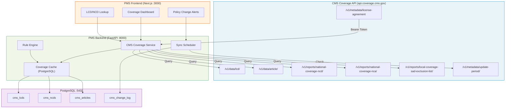

# Product Requirements Document: CMS Coverage API Integration into Patient Management System (PMS)

**Document ID:** PRD-PMS-CMSCOVAPI-001
**Version:** 1.0
**Date:** 2026-03-07
**Author:** Ammar (CEO, MPS Inc.)
**Status:** Draft

---

## 1. Executive Summary

The CMS Coverage API is a free, public REST API that provides programmatic access to Medicare coverage determination data from the Medicare Coverage Database (MCD). It exposes National Coverage Determinations (NCDs), Local Coverage Determinations (LCDs), billing articles, coding analyses, and contractor information — the same data that PA coordinators manually search on the CMS website today.

Integrating the CMS Coverage API into the PMS replaces the manual web scraping and PDF download approach from Experiment 44 (for CMS Medicare specifically) with a structured, real-time API integration. Instead of downloading HTML pages and parsing PDFs to extract coverage rules, the PMS can query CMS directly for LCD/NCD content by procedure code, diagnosis, or contractor — and receive structured JSON responses. This eliminates the fragile scraping pipeline for CMS data and provides a reliable, always-current source of Medicare coverage policies.

Combined with Experiment 43's PA prediction model and Experiment 44's payer policy library (for commercial payers), the CMS Coverage API integration gives the PMS a complete, multi-source coverage determination engine: real-time CMS data via API, plus structured rules extracted from commercial payer PDFs.

## 2. Problem Statement

The current PMS workflow for determining Medicare coverage has several pain points:

- **Manual MCD lookups**: PA coordinators search the Medicare Coverage Database website manually to find relevant LCDs and NCDs for a given procedure/diagnosis combination. This takes 5-10 minutes per lookup.
- **Stale downloaded data**: Experiment 44 downloads CMS pages as static HTML snapshots. These go stale as CMS updates LCDs — the only way to catch updates is to re-run the download pipeline.
- **No structured LCD content**: The CMS website and downloaded HTML pages contain LCD text as free-form HTML. Extracting specific coverage criteria (covered ICD-10 codes, billing codes, documentation requirements) requires manual reading or fragile HTML parsing.
- **Contractor-specific rules are hard to find**: Medicare coverage varies by MAC jurisdiction. Texas falls under Novitas Solutions (Jurisdiction H), but finding the correct LCD for a specific procedure in a specific jurisdiction requires navigating the MCD's complex search interface.
- **No real-time policy change detection**: When CMS updates an LCD or publishes a new NCD, there is no automated way for the PMS to detect the change and alert staff.

## 3. Proposed Solution

### 3.1 Architecture Overview

### 3.2 Deployment Model

- **No self-hosting required**: The CMS Coverage API is a managed government API at `api.coverage.cms.gov`. No infrastructure to deploy.
- **No API key needed**: As of February 2024, no registration or API key is required. Some endpoints require a license agreement token (obtained by accepting AMA/ADA/AHA terms via the API itself — valid for 1 hour).
- **Caching layer**: The PMS caches API responses in PostgreSQL to reduce latency, enable offline access, and support change detection. Cache TTL: 24 hours for LCD/NCD content, 1 hour for metadata.
- **HIPAA consideration**: The CMS Coverage API contains **no PHI** — it serves only coverage policy documents. No BAA is needed. However, when the PMS correlates coverage data with patient encounters, the combined data is PHI and must remain within the HIPAA-compliant PMS boundary.

## 4. PMS Data Sources

The CMS Coverage API integration interacts with the following PMS APIs:

| PMS API | Endpoint | Interaction |
|---------|----------|-------------|
| Patient Records | `/api/patients` | Retrieve patient Medicare status and MAC jurisdiction |
| Encounter Records | `/api/encounters` | Get procedure codes (CPT/HCPCS) and diagnosis codes (ICD-10) to query coverage |
| Prescription API | `/api/prescriptions` | Get drug HCPCS codes (J-codes) for Part B drug coverage lookups |
| Reporting API | `/api/reports` | Surface coverage determination trends and LCD change history |

**Data flow**: When a clinician enters a procedure code and diagnosis on an encounter, the PMS queries the CMS Coverage API for the relevant LCD in the patient's MAC jurisdiction, checks if the procedure/diagnosis combination is covered, and displays the result inline — before the claim is submitted.

## 5. Component/Module Definitions

### 5.1 License Agreement Token Manager

- **Description**: Obtains and caches the Bearer token required for LCD/Article endpoints by calling `/v1/metadata/license-agreement`.
- **Input**: None (token obtained by accepting AMA/ADA/AHA terms programmatically).
- **Output**: Bearer token string, cached with 55-minute TTL (token valid for 60 minutes).
- **PMS APIs used**: None (internal utility).

### 5.2 LCD Lookup Service

- **Description**: Queries `/v1/data/lcd/{id}` and related sub-endpoints (bill-codes, ICD-10 codes, modifiers) to retrieve full LCD content for a given LCD ID.
- **Input**: LCD ID, or search parameters (contractor, state, status).
- **Output**: Structured LCD object with covered diagnoses, billing codes, documentation requirements.
- **PMS APIs used**: `/api/encounters` (to get procedure/diagnosis codes), `/api/patients` (to determine MAC jurisdiction).

### 5.3 NCD Report Service

- **Description**: Queries `/v1/reports/national-coverage-ncd/` for national coverage decisions. NCDs override LCDs and apply to all states.
- **Input**: Search terms, NCD ID.
- **Output**: NCD document with coverage criteria.
- **PMS APIs used**: `/api/encounters`.

### 5.4 Coverage Change Detector

- **Description**: Polls `/v1/metadata/update-period/` on a schedule to detect when CMS publishes new or revised LCDs/NCDs. Compares with cached versions and logs changes.
- **Input**: Scheduled cron trigger (daily).
- **Output**: Change log entries in `cms_change_log` table; alerts to the frontend dashboard.
- **PMS APIs used**: `/api/reports` (to surface change alerts).

### 5.5 SAD Exclusion List Service

- **Description**: Queries the Self-Administered Drug (SAD) exclusion list to determine if a Part B drug is excluded from coverage.
- **Input**: HCPCS code (J-code).
- **Output**: Exclusion status and effective dates.
- **PMS APIs used**: `/api/prescriptions`.

### 5.6 Coverage Decision Engine

- **Description**: Combines LCD/NCD data with encounter context to produce a coverage determination: covered, not covered, or requires documentation. Integrates with Experiment 44's payer rules for commercial payers.
- **Input**: Encounter with procedure codes, diagnosis codes, patient payer, MAC jurisdiction.
- **Output**: Coverage determination result with evidence (LCD/NCD citations, specific coverage criteria matched).
- **PMS APIs used**: `/api/encounters`, `/api/patients`, `/api/prescriptions`.

## 6. Non-Functional Requirements

### 6.1 Security and HIPAA Compliance

- **No PHI in API calls**: The CMS Coverage API serves only policy documents — no patient data is sent to or received from CMS.
- **PHI boundary**: When coverage data is correlated with patient encounters inside the PMS, the combined data is PHI. All storage and transmission must comply with PMS HIPAA controls (encryption at rest, TLS in transit, audit logging).
- **License agreement tokens**: Stored in memory only (not persisted to disk). Rotated every 55 minutes.
- **Audit trail**: All coverage lookups are logged with timestamp, user ID, encounter ID, and LCD/NCD IDs queried.

### 6.2 Performance

| Metric | Target |
|--------|--------|
| LCD lookup latency (cached) | < 50ms |
| LCD lookup latency (API call) | < 500ms |
| Cache hit rate | > 90% (LCDs change infrequently) |
| Daily sync duration | < 5 minutes |
| API rate limit headroom | < 100 req/s (CMS allows 10,000/s) |

### 6.3 Infrastructure

- **No additional infrastructure**: The API is hosted by CMS. The PMS needs only PostgreSQL tables for caching and a scheduled task for sync.
- **Docker**: No new containers. The CMS Coverage Service runs within the existing FastAPI container.
- **Network**: Outbound HTTPS to `api.coverage.cms.gov` (port 443). No inbound connections needed.

## 7. Implementation Phases

### Phase 1: Foundation (Sprint 1 — 2 weeks)

- Implement License Agreement Token Manager
- Build LCD Lookup Service with PostgreSQL caching
- Create `/api/coverage/lcd/{id}` endpoint on PMS backend
- Add database migrations for `cms_lcds`, `cms_articles`, `cms_change_log` tables

### Phase 2: Coverage Engine (Sprint 2 — 2 weeks)

- Build NCD Report Service
- Implement Coverage Decision Engine (LCD + NCD + encounter context)
- Integrate with encounter workflow — auto-lookup on procedure code entry
- Build Coverage Dashboard component on frontend

### Phase 3: Monitoring and Commercial Payer Integration (Sprint 3 — 2 weeks)

- Implement Coverage Change Detector with daily sync
- Build Policy Change Alerts on frontend
- Integrate with Experiment 44 payer rules for unified coverage determination across CMS + commercial payers
- Add SAD Exclusion List Service

## 8. Success Metrics

| Metric | Target | Measurement |
|--------|--------|-------------|
| LCD lookup time (staff) | < 10 seconds (from 5-10 minutes manual) | Time from encounter entry to coverage display |
| Coverage data freshness | < 24 hours behind CMS | Compare cache vs API update-period |
| LCD/NCD cache completeness | 100% of Novitas Jurisdiction H LCDs | Count cached vs total LCDs for Novitas |
| Policy change detection | 100% of LCD changes caught within 24 hours | Compare change log vs MCD website |
| Staff satisfaction | > 80% report faster PA workflow | Survey after 30 days |

## 9. Risks and Mitigations

| Risk | Impact | Mitigation |
|------|--------|------------|
| CMS API downtime | Cannot perform real-time lookups | PostgreSQL cache serves as offline fallback; cache TTL extended during outages |
| License agreement token changes | LCD/Article endpoints become inaccessible | Token manager auto-retries; alert on 3 consecutive failures |
| API rate limiting (10,000 req/s) | Throttled during bulk sync | Bulk sync uses batch endpoints; daily usage is < 100 req/s |
| LCD schema changes | Parsing breaks | Schema validation on API responses; alert on unexpected fields |
| CMS deprecates API versions | Integration breaks | Monitor release notes; API has had no deprecations through v1.5 |

## 10. Dependencies

| Dependency | Type | Notes |
|------------|------|-------|
| CMS Coverage API v1.5 | External API | Free, no API key, 10,000 req/s limit |
| AMA/ADA/AHA License Agreement | Legal | Accepted programmatically via API; required for LCD/Article endpoints |
| PostgreSQL 14+ | Infrastructure | Already deployed in PMS |
| FastAPI | Framework | Already deployed in PMS |
| `httpx` or `requests` | Python library | HTTP client for API calls |
| Experiment 43 | Internal | PA prediction model uses coverage data as features |
| Experiment 44 | Internal | Commercial payer rules complement CMS coverage data |

## 11. Comparison with Existing Experiments

| Aspect | Experiment 43 (CMS PA Dataset) | Experiment 44 (Payer Policy Download) | Experiment 45 (CMS Coverage API) |
|--------|-------------------------------|--------------------------------------|----------------------------------|
| **Data source** | CMS synthetic claims + PA list (static CSV) | Payer websites (HTML/PDF scraping) | CMS Coverage API (structured JSON) |
| **Coverage scope** | All CMS procedures with PA labels | 6 payers × anti-VEGF drugs | All Medicare LCDs/NCDs nationally |
| **Update mechanism** | Manual re-download | Manual re-run of download script | Automated daily sync via API |
| **Data format** | CSV → ML features | PDF/HTML → extracted JSON rules | Native JSON from API |
| **CMS data overlap** | Uses CMS PA Required List | Downloads CMS LCD L33346 as HTML | Queries LCD L33346 content via API — replaces Exp 44's CMS scraping |
| **Commercial payers** | N/A | UHC, Aetna, BCBSTX, Humana, Cigna | N/A — CMS only; complements Exp 44 for commercial |

**Key relationship**: Experiment 45 replaces Experiment 44's CMS-specific web scraping with a proper API integration. Experiment 44 remains necessary for commercial payers (UHC, Aetna, etc.) whose policies are only available as PDFs/HTML. The Coverage Decision Engine (§5.6) combines both sources.

## 12. Research Sources

**Official Documentation:**
- [CMS Coverage API Home](https://api.coverage.cms.gov/) — API overview, access requirements, rate limits
- [CMS Coverage API Documentation](https://api.coverage.cms.gov/docs/) — Endpoint descriptions, authentication, data format
- [CMS Coverage API Swagger](https://api.coverage.cms.gov/docs/swagger/index.html) — Full interactive API specification
- [CMS Coverage API Release Notes](https://api.coverage.cms.gov/docs/release_notes) — Version history (v1.1 through v1.5)

**Ecosystem & Integration:**
- [CMS Developer Tools](https://developer.cms.gov/) — CMS API ecosystem overview and public API catalog
- [CMS Coverage MCP Connector (Deepsense)](https://docs.mcp.deepsense.ai/guides/cms_coverage.html) — MCP server wrapping the Coverage API for Claude integration

**Regulation & Compliance:**
- [CMS Interoperability and Prior Authorization Final Rule (CMS-0057-F)](https://www.cms.gov/cms-interoperability-and-prior-authorization-final-rule-cms-0057-f) — Payer API requirements effective 2026-2027
- [CMS-0057-F Decoded: Must-Have APIs for 2026-2027 (Firely)](https://fire.ly/blog/cms-0057-f-decoded-must-have-apis-vs-nice-to-have-igs-for-2026-2027/) — Technical analysis of required FHIR APIs

## 13. Appendix: Related Documents

- [CMS Coverage API Setup Guide](45-CMSCoverageAPI-PMS-Developer-Setup-Guide.md)
- [CMS Coverage API Developer Tutorial](45-CMSCoverageAPI-Developer-Tutorial.md)
- [Experiment 43 PRD: CMS Prior Auth Dataset](43-PRD-CMSPriorAuthDataset-PMS-Integration.md)
- [Experiment 44 PRD: Payer Policy Download](44-PRD-PayerPolicyDownload-PMS-Integration.md)
