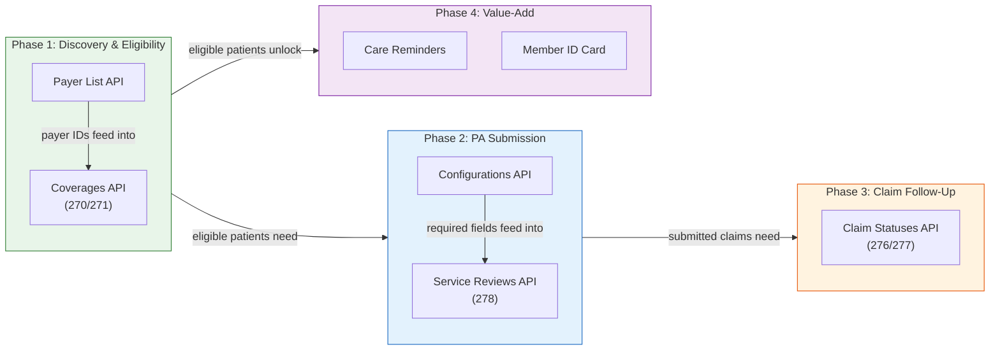
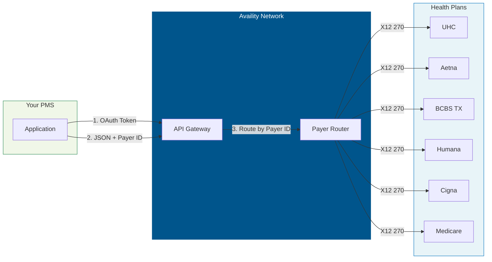
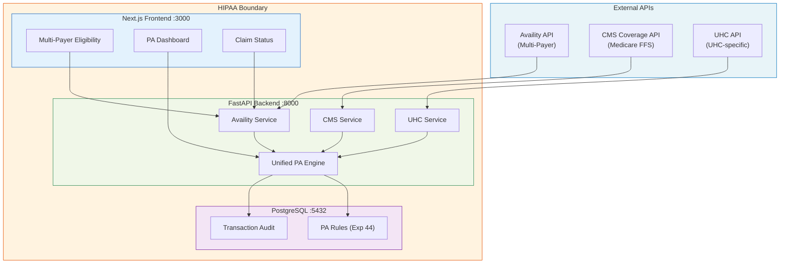

# Availity API Developer Onboarding Tutorial

**Welcome to the MPS PMS Availity API Integration Team**

This tutorial will take you from zero to building your first multi-payer eligibility verification and prior authorization submission using Availity's REST APIs. By the end, you will understand how Availity connects to all major payers, have tested eligibility and PA flows in the sandbox, and built a unified workflow that works for UHC, Aetna, BCBS, Humana, and Cigna through a single API.

**Document ID:** PMS-EXP-AVAILITY-002
**Version:** 2.1
**Date:** 2026-03-10
**Applies To:** PMS project (all platforms)
**Prerequisite:** [Availity API Setup Guide](47-AvailityAPI-PMS-Developer-Setup-Guide.md)
**Estimated time:** 3-4 hours
**Difficulty:** Beginner-friendly

---

## What You Will Learn

1. Why a multi-payer clearinghouse is essential for practice management
2. How Availity routes transactions to the correct payer via payer IDs
3. The X12 transaction lifecycle: submit → poll → complete
4. How to verify eligibility for any payer through one API call
5. **How to retrieve E&B value-add data: Care Reminders and Member ID Cards**
6. How to use the Configurations API for payer-specific field requirements
7. How to submit a prior authorization to any connected payer
8. **How to implement the full PA workflow: eligibility → coverage rules → PA decision → submission → result processing**
9. **How to handle all PA result states: Approved, Denied, and Pended**
10. How to check claim status across all payers from one dashboard
11. How Demo mock scenarios enable comprehensive testing
12. How Availity complements the UHC-specific API (Experiment 46)
13. HIPAA audit requirements for multi-payer clearinghouse data
14. The recommended API exploration order — phased from discovery to advanced value-add

---

## API Exploration Roadmap

Before diving into the tutorial, use this roadmap to understand the **recommended order** for exploring Availity's APIs. Each phase builds on the previous one, following the clinical workflow from payer discovery to claim follow-up.



### Phase 1: Discovery & Eligibility (Start Here)

| Order | API | Reference Doc | Why First |
|-------|-----|---------------|-----------|
| 1 | **Payer List API** | [Payer List API Reference](47-AvailityAPI-PayerList-API-Reference.md) | Discover valid `payerId` values — every other API call requires one |
| 2 | **Coverages API** (X12 270/271) | [Coverages API Reference](47-AvailityAPI-Coverages-API-Reference.md) | Verify patient eligibility — the gate to all downstream transactions |

**Dependency**: Payer List gives you `payerId` values. Coverages uses those IDs to check eligibility. Every clinical workflow starts here.

### Phase 2: Prior Authorization Submission

| Order | API | Reference Doc | Why Next |
|-------|-----|---------------|----------|
| 3 | **Configurations API** | [PRD Section 5](47-PRD-AvailityAPI-PMS-Integration.md) | Fetch payer-specific required fields before building a PA request |
| 4 | **Service Reviews API** (X12 278) | [Service Reviews API Reference](47-AvailityAPI-ServiceReviews-API-Reference.md) | Submit prior authorization — the core revenue-cycle transaction |

**Dependency**: Configurations tells you *what fields each payer requires*. Service Reviews uses those fields to submit the PA. Skipping Configurations leads to Issue 4 (missing required fields).

### Phase 3: Claim Follow-Up

| Order | API | Reference Doc | Why Here |
|-------|-----|---------------|----------|
| 5 | **Claim Statuses API** (X12 276/277) | [Claim Statuses API Reference](47-AvailityAPI-ClaimStatuses-API-Reference.md) | Track claim adjudication after services are rendered |

**Dependency**: Claims follow encounters. You need to have submitted claims (via 837) or PAs (via 278) before tracking their status.

### Phase 4: E&B Value-Add APIs (Advanced)

| Order | API | Reference Doc | Why Last |
|-------|-----|---------------|----------|
| 6 | **Care Reminders** | [E&B Value-Add Guide](47-Availity_EB_ValueAdd_API_Guide.docx) | Surface open care gaps — runs after eligibility confirms |
| 7 | **Member ID Card** | [E&B Value-Add Guide](47-Availity_EB_ValueAdd_API_Guide.docx) | Retrieve digital insurance card — runs after eligibility confirms |

**Dependency**: Both require a confirmed `memberId` from a successful eligibility (270/271) response. They are additive — not required for core workflows but high-value for pre-visit automation.

### Supporting References

| Resource | Link | Use When |
|----------|------|----------|
| **X12 Libraries Reference** | [X12 Libraries Reference](47-AvailityAPI-X12-Libraries-Reference.md) | You need to parse raw X12 segments (835, 837, 270, 271, 276, 277, 278) |
| **Test Data & Sandbox Guide** | [Test Data & Sandbox Guide](47-AvailityAPI-TestData-SandboxGuide.md) | Setting up sandbox credentials, mock scenarios, and test member IDs |
| **Setup Guide** | [Developer Setup Guide](47-AvailityAPI-PMS-Developer-Setup-Guide.md) | Initial environment setup, OAuth configuration, Docker integration |

> **Tip**: Work through Phases 1-2 in a single day. Phase 3 can wait until you have real claims to track. Phase 4 is optional but delivers the highest patient-experience value.

---

## Part 1: Understanding Availity (15 min read)

### 1.1 What Problem Does This Solve?

Texas Retina Associates contracts with 6 payers. Without Availity, the PMS needs 6 separate API integrations:

| Payer | Portal | API Available? | Credential Type |
|-------|--------|---------------|-----------------|
| CMS Medicare FFS | cms.gov | Yes (Exp 45) | License token |
| UnitedHealthcare | uhcprovider.com | Yes (Exp 46) | OAuth |
| Aetna | availity.com | No public API | Portal only |
| BCBS of Texas | availity.com | No public API | Portal only |
| Humana | humana.com | No public API | Portal only |
| Cigna | cigna.com | No public API | Portal only |

With Availity: **one API, one set of credentials, all 6 payers.**

### 1.2 How Availity Works — The Key Pieces



**The key insight**: You send JSON with a `payerId` field. Availity converts it to the appropriate X12 EDI format, routes it to the correct payer, and returns the payer's response as JSON.

### 1.3 How Availity Fits with Other PMS Technologies

| Technology | Experiment | Relationship to Availity |
|------------|-----------|-------------------------|
| Payer Policy Download | Exp 44 | Provides PA rules (what's required). Availity provides transactions (submit the PA). |
| CMS Coverage API | Exp 45 | Provides Medicare FFS coverage rules. Availity can also query Medicare eligibility. |
| UHC API Marketplace | Exp 46 | Deep UHC-specific features (Gold Card, TrackIt). Availity covers UHC eligibility/PA too. |
| Availity API | Exp 47 | **The multi-payer clearinghouse — one API for all payers, plus E&B value-add APIs.** |

**Decision**: Use Availity as the default for all payers. Use Experiment 46 (UHC API) only for UHC-specific features not available through Availity (Gold Card status check).

### 1.4 Key Vocabulary

| Term | Meaning |
|------|---------|
| **Clearinghouse** | An intermediary that routes healthcare transactions between providers and payers |
| **Payer ID** | Availity's identifier for a health plan (e.g., "UHC", "AETNA"). Use Payer List API to find. |
| **X12 270/271** | Eligibility inquiry/response. You ask "Is this patient covered?" and get benefits back. |
| **X12 278** | Prior authorization request/response. You ask "Can I do this procedure?" |
| **X12 276/277** | Claim status request/response. You ask "What happened to my claim?" |
| **X12 837** | Claim submission (professional = 837P, institutional = 837I) |
| **Service Review** | Availity's term for a prior authorization or referral request |
| **Coverage** | Availity's term for an eligibility inquiry |
| **E&B Value-Add APIs** | Extra data layered on top of the 271 response: Care Reminders and Member ID Card |
| **Care Reminders** | Real-time care gap data returned by the payer (flu vaccines, wellness visits, etc.) |
| **Member ID Card** | Digital copy of the patient's insurance card (PDF or PNG), retrieved in two steps |
| **Polling** | Eligibility is asynchronous: POST returns an ID, then poll GET until complete |
| **Demo Plan** | Sandbox with canned responses, 5 req/s, 500 req/day, no PHI |
| **Standard Plan** | Production with real data, 100 req/s, 100K req/day, requires contract |

### 1.5 Our Architecture



---

## Part 2: Environment Verification (15 min)

### 2.1 Checklist

```bash
# 1. Credentials set
source .env
[ -n "$AVAILITY_CLIENT_ID" ] && echo "PASS: Client ID" || echo "FAIL"

# 2. Token works
TOKEN=$(curl -s -X POST "$AVAILITY_TOKEN_URL" \
  -d "grant_type=client_credentials&client_id=$AVAILITY_CLIENT_ID&client_secret=$AVAILITY_CLIENT_SECRET&scope=$AVAILITY_SCOPE" \
  | jq -r '.access_token')
[ -n "$TOKEN" ] && echo "PASS: Token" || echo "FAIL"

# 3. PMS backend running
curl -s -o /dev/null -w "%{http_code}" http://localhost:8000/health

# 4. Payer list accessible
curl -s "http://localhost:8000/api/availity/payers" | jq '.totalCount'
```

### 2.2 Quick Test

```bash
# Check eligibility via PMS (Demo sandbox)
curl -s -X POST "http://localhost:8000/api/availity/eligibility" \
  -H "Content-Type: application/json" \
  -d '{"payer_id":"UHC","member_id":"TEST123","provider_npi":"1234567890","date_of_service":"2026-03-07"}' \
  | jq '.'
```

---

## Part 3: Build Your First Integration (45 min)

### 3.1 What We Are Building

A **multi-payer pre-visit batch** that checks eligibility for all scheduled patients across all payers in one run.

### 3.2 Create the Multi-Payer Eligibility Script

Create `availity_batch_eligibility.py`:

```python
#!/usr/bin/env python3
"""
Multi-Payer Batch Eligibility Check via Availity.

Demonstrates checking eligibility across multiple payers with one API.

Usage:
    python availity_batch_eligibility.py
"""

import json
import os
import httpx

PMS_URL = os.environ.get("PMS_URL", "http://localhost:8000")

# Simulated tomorrow's schedule (would come from /api/encounters in production)
SCHEDULE = [
    {"patient": "Smith, John",    "member_id": "UHC123456",  "payer_id": "UHC",    "payer_name": "UnitedHealthcare", "npi": "1234567890", "dos": "2026-03-08"},
    {"patient": "Jones, Mary",    "member_id": "AET789012",  "payer_id": "AETNA",  "payer_name": "Aetna",            "npi": "1234567890", "dos": "2026-03-08"},
    {"patient": "Garcia, Carlos", "member_id": "BCBS345678", "payer_id": "BCBSTX", "payer_name": "BCBS of Texas",   "npi": "1234567890", "dos": "2026-03-08"},
    {"patient": "Williams, Sue",  "member_id": "HUM901234",  "payer_id": "HUMANA", "payer_name": "Humana",           "npi": "1234567890", "dos": "2026-03-08"},
    {"patient": "Brown, David",   "member_id": "CIG567890",  "payer_id": "CIGNA",  "payer_name": "Cigna",            "npi": "1234567890", "dos": "2026-03-08"},
]


def main():
    client = httpx.Client(timeout=30.0)
    print("=" * 70)
    print("MULTI-PAYER BATCH ELIGIBILITY CHECK")
    print(f"Date: 2026-03-08 | Patients: {len(SCHEDULE)}")
    print("=" * 70)

    results = []
    for appt in SCHEDULE:
        print(f"Checking: {appt['patient']} ({appt['payer_name']})...", end=" ")
        try:
            resp = client.post(f"{PMS_URL}/api/availity/eligibility", json={
                "payer_id": appt["payer_id"],
                "member_id": appt["member_id"],
                "provider_npi": appt["npi"],
                "date_of_service": appt["dos"],
            })
            data = resp.json()
            status = data.get("statusCode", "?")
            eligible = status == "4"
            print("ELIGIBLE" if eligible else f"STATUS {status}")
            results.append({**appt, "eligible": eligible, "status": status})
        except Exception as e:
            print(f"ERROR: {e}")
            results.append({**appt, "eligible": False, "status": "error"})

    print()
    print("-" * 70)
    eligible_count = sum(1 for r in results if r["eligible"])
    print(f"Results: {eligible_count}/{len(results)} eligible\n")
    print(f"{'Patient':<20s} {'Payer':<20s} {'Status':<10s}")
    print(f"{'-'*20} {'-'*20} {'-'*10}")
    for r in results:
        status_str = "Eligible" if r["eligible"] else f"Check ({r['status']})"
        print(f"{r['patient']:<20s} {r['payer_name']:<20s} {status_str:<10s}")


if __name__ == "__main__":
    main()
```

### 3.3 Run the Batch Check

```bash
python availity_batch_eligibility.py
```

### 3.4 Build a Multi-Payer PA Submission Script

Create `availity_submit_pa.py`:

```python
#!/usr/bin/env python3
"""
Submit Prior Authorization via Availity for any payer.

Usage:
    python availity_submit_pa.py --payer UHC --member UHC123 --procedure 67028 --diagnosis H35.31
    python availity_submit_pa.py --payer AETNA --member AET789 --procedure 67028 --diagnosis H35.31
"""

import argparse
import json
import os
import httpx

PMS_URL = os.environ.get("PMS_URL", "http://localhost:8000")
PAYER_NAMES = {
    "UHC": "UnitedHealthcare",
    "AETNA": "Aetna",
    "BCBSTX": "BCBS of Texas",
    "HUMANA": "Humana",
    "CIGNA": "Cigna",
}


def main():
    parser = argparse.ArgumentParser(description="Submit PA via Availity")
    parser.add_argument("--payer", required=True, choices=PAYER_NAMES.keys())
    parser.add_argument("--member", required=True)
    parser.add_argument("--procedure", default="67028")
    parser.add_argument("--diagnosis", default="H35.31")
    parser.add_argument("--npi", default="1234567890")
    parser.add_argument("--dos", default="2026-03-10")
    args = parser.parse_args()

    client = httpx.Client(timeout=30.0)
    payer_name = PAYER_NAMES[args.payer]

    print(f"Submitting PA to {payer_name} via Availity")
    print(f"  Member: {args.member} | Procedure: {args.procedure} | Diagnosis: {args.diagnosis}\n")

    print("1. Getting payer configuration...")
    cfg = client.get(
        f"{PMS_URL}/api/availity/configurations/{args.payer}",
        params={"config_type": "service-reviews"},
    ).json()
    print(f"   Configuration loaded for {args.payer}")

    print("2. Submitting PA request...")
    result = client.post(f"{PMS_URL}/api/availity/prior-auth", json={
        "payer_id": args.payer,
        "member_id": args.member,
        "provider_npi": args.npi,
        "procedure_code": args.procedure,
        "diagnosis_codes": [args.diagnosis],
        "date_of_service": args.dos,
    }).json()

    review_id = result.get("id", "N/A")
    print(f"   Review ID: {review_id} | Status: {result.get('status', 'Unknown')}")

    if review_id != "N/A":
        print("3. Checking PA status...")
        status_result = client.get(f"{PMS_URL}/api/availity/prior-auth/{review_id}").json()
        print(f"   Current status: {status_result.get('status', 'Unknown')}")

    print()
    print(json.dumps(result, indent=2))


if __name__ == "__main__":
    main()
```

### 3.5 Test PA Submission

```bash
python availity_submit_pa.py --payer UHC   --member UHC123  --procedure 67028 --diagnosis H35.31
python availity_submit_pa.py --payer AETNA --member AET789  --procedure 67028 --diagnosis H35.31
python availity_submit_pa.py --payer BCBSTX --member BCBS456 --procedure 67028 --diagnosis H35.31
```

**Checkpoint**: You can submit PAs to any payer through the same Availity API.

---

## Part 4: E&B Value-Add APIs — Care Reminders and Member ID Card (30 min)

The E&B value-add APIs are layered **on top of** the eligibility (270/271) transaction. After confirming a patient is eligible, you can immediately retrieve their open care gaps and a digital copy of their insurance card — all through Availity using the same credentials.

### 4.1 Overview

| API | Endpoint | What It Returns |
|-----|----------|-----------------|
| Care Reminders | `POST /pre-claim/eb-value-adds/care-reminders` | Open care gaps, preventive care due dates, gap closure instructions |
| Member ID Card (initiate) | `POST /pre-claim/eb-value-adds/member-card` | A GTID token for the document |
| Member ID Card (retrieve) | `GET /pre-claim/eb-value-adds/member-card/{GTID}` | PDF or PNG of the patient's insurance card |

> **Important**: Run eligibility (`POST /v1/coverages`) first. The `memberId` you need for value-add calls comes from the 271 response.

### 4.2 Add Value-Add Methods to the Availity Client

Add the following methods to `app/services/availity_api.py`:

```python
    # --- E&B Value-Add: Care Reminders ---

    async def get_care_reminders(self, payload: dict) -> dict:
        """
        Retrieve care gap / care reminder data for a member.

        Always required: payerId, memberId
        Payer-specific optional: stateId, lineOfBusiness, firstName, lastName,
            providerNPI, dateOfBirth, genderCode, controlNumber, groupNumber

        Returns careReminderDetails array with order, headers, and rows.
        Successful responses use HTTP 2xx; failures return HTTP 5xx.
        """
        return await self._post("/pre-claim/eb-value-adds/care-reminders", payload)

    # --- E&B Value-Add: Member ID Card (two-step) ---

    async def initiate_member_id_card(self, payload: dict) -> dict:
        """
        Step 1: POST to initiate member ID card retrieval.
        Returns GTID in data.memberCards.uris[0] — pass to get_member_id_card().

        Always required: payerId, memberId
        Payer-specific: firstName, lastName, dateOfBirth, planType, effectiveDate,
            stateCode, planId, policyNumber, responsePayerId (Aetna BH / Mercy Care AZ),
            routingCode + thirdPartySystemId (Anthem plans)
        """
        return await self._post("/pre-claim/eb-value-adds/member-card", payload)

    async def get_member_id_card(self, gtid: str) -> bytes:
        """
        Step 2: GET to retrieve the actual PDF or PNG document bytes.
        Pass the GTID returned by initiate_member_id_card().
        """
        headers = await self._authed_headers()
        headers["Content-Type"] = "application/x-www-form-urlencoded"
        resp = await self._client.get(
            f"{self._base}/pre-claim/eb-value-adds/member-card/{gtid}",
            headers=headers,
        )
        resp.raise_for_status()
        return resp.content

    async def get_care_reminders_and_id_card(
        self, payer_id: str, member_id: str, extra: dict = None
    ) -> dict:
        """
        Convenience method: run care reminders and member ID card in parallel
        after eligibility is confirmed.

        Returns dict with keys:
          care_reminders   — careReminderDetails payload (or error dict)
          member_card_gtid — GTID string for the GET call (or None)
          member_card_raw  — raw POST response (or None on error)
        """
        import asyncio
        base_payload = {"payerId": payer_id, "memberId": member_id, **(extra or {})}

        care_task = asyncio.create_task(self.get_care_reminders(base_payload))
        card_task = asyncio.create_task(self.initiate_member_id_card(base_payload))
        care_result, card_result = await asyncio.gather(care_task, card_task, return_exceptions=True)

        gtid = None
        if not isinstance(card_result, Exception):
            try:
                gtid = card_result["data"]["memberCards"]["uris"][0]
            except (KeyError, IndexError, TypeError):
                pass

        return {
            "care_reminders": care_result if not isinstance(care_result, Exception) else {"error": str(care_result)},
            "member_card_gtid": gtid,
            "member_card_raw": card_result if not isinstance(card_result, Exception) else None,
        }
```

### 4.3 Add Value-Add Router Endpoints

Add to `app/routers/availity.py`:

```python
from fastapi.responses import Response


class CareRemindersRequest(BaseModel):
    payer_id: str
    member_id: str
    state_id: str = ""
    line_of_business: str = ""   # Required for BCBS MI (BCN/COMMERCIAL/MAPPO)
    first_name: str = ""
    last_name: str = ""
    provider_npi: str = ""
    date_of_birth: str = ""
    gender_code: str = ""        # F, M, or U
    control_number: str = ""
    group_number: str = ""


class MemberCardRequest(BaseModel):
    payer_id: str
    member_id: str
    first_name: str = ""
    last_name: str = ""
    date_of_birth: str = ""
    plan_type: str = ""           # Medical or Dental
    effective_date: str = ""
    state_code: str = ""
    plan_id: str = ""             # Required for BCBS NJ and Molina plans
    policy_number: str = ""
    response_payer_id: str = ""   # Required for Aetna Better Health, Mercy Care AZ
    routing_code: str = ""        # Required for Anthem plans
    third_party_system_id: str = ""  # Required for Anthem plans
    provider_npi: str = ""


@router.post("/care-reminders")
async def get_care_reminders(req: CareRemindersRequest):
    """Retrieve care gap / care reminder data for a member post-eligibility."""
    try:
        payload = {"payerId": req.payer_id, "memberId": req.member_id}
        optional_map = {
            "stateId": req.state_id,
            "lineOfBusiness": req.line_of_business,
            "firstName": req.first_name,
            "lastName": req.last_name,
            "providerNPI": req.provider_npi,
            "dateOfBirth": req.date_of_birth,
            "genderCode": req.gender_code,
            "controlNumber": req.control_number,
            "groupNumber": req.group_number,
        }
        payload.update({k: v for k, v in optional_map.items() if v})
        result = await client.get_care_reminders(payload)
        log.info(f"CareReminders: payer={req.payer_id} member={req.member_id} status={result.get('status')}")
        return result
    except Exception as e:
        raise HTTPException(status_code=502, detail=f"Availity error: {e}")


@router.post("/member-card/initiate")
async def initiate_member_card(req: MemberCardRequest):
    """Step 1: Initiate member ID card retrieval. Returns GTID for the GET call."""
    try:
        payload = {"payerId": req.payer_id, "memberId": req.member_id}
        optional_map = {
            "firstName": req.first_name,
            "lastName": req.last_name,
            "dateOfBirth": req.date_of_birth,
            "planType": req.plan_type,
            "effectiveDate": req.effective_date,
            "stateCode": req.state_code,
            "planId": req.plan_id,
            "policyNumber": req.policy_number,
            "responsePayerId": req.response_payer_id,
            "routingCode": req.routing_code,
            "thirdPartySystemId": req.third_party_system_id,
            "providerNPI": req.provider_npi,
        }
        payload.update({k: v for k, v in optional_map.items() if v})
        result = await client.initiate_member_id_card(payload)
        log.info(f"MemberCard initiated: payer={req.payer_id} member={req.member_id}")
        return result
    except Exception as e:
        raise HTTPException(status_code=502, detail=f"Availity error: {e}")


@router.get("/member-card/{gtid}")
async def get_member_card(gtid: str, format: str = "pdf"):
    """Step 2: Retrieve member ID card document by GTID. Returns PDF or PNG bytes."""
    try:
        doc_bytes = await client.get_member_id_card(gtid)
        media_type = "application/pdf" if format == "pdf" else "image/png"
        return Response(content=doc_bytes, media_type=media_type)
    except Exception as e:
        raise HTTPException(status_code=502, detail=f"Availity error: {e}")


@router.post("/eb-value-adds")
async def get_eb_value_adds(req: CareRemindersRequest):
    """
    Convenience: retrieve both care reminders and member ID card in parallel
    after eligibility is confirmed.
    """
    try:
        extra = {k: v for k, v in {
            "stateId": req.state_id,
            "lineOfBusiness": req.line_of_business,
            "firstName": req.first_name,
            "lastName": req.last_name,
        }.items() if v}
        result = await client.get_care_reminders_and_id_card(req.payer_id, req.member_id, extra)
        return result
    except Exception as e:
        raise HTTPException(status_code=502, detail=f"Availity error: {e}")
```

### 4.4 Test the Value-Add APIs

```bash
# Step 1: Care Reminders (after confirming eligibility)
curl -s -X POST "http://localhost:8000/api/availity/care-reminders" \
  -H "Content-Type: application/json" \
  -d '{
    "payer_id": "00611",
    "member_id": "SUCC123456789",
    "state_id": "TX",
    "first_name": "PATIENTONE",
    "last_name": "TEST",
    "date_of_birth": "1990-01-01",
    "gender_code": "F"
  }' | jq '.data.careReminderDetails[0].rows'

# Step 2a: Initiate Member ID Card
GTID=$(curl -s -X POST "http://localhost:8000/api/availity/member-card/initiate" \
  -H "Content-Type: application/json" \
  -d '{
    "payer_id": "00611",
    "member_id": "SUCC123456789",
    "first_name": "PATIENTONE",
    "last_name": "TEST",
    "plan_type": "Medical"
  }' | jq -r '.data.memberCards.uris[0]')

echo "GTID: $GTID"

# Step 2b: Retrieve PDF
curl -s "http://localhost:8000/api/availity/member-card/$GTID" \
  --output /tmp/member_card.pdf && echo "Saved to /tmp/member_card.pdf"

# Convenience: both in one call
curl -s -X POST "http://localhost:8000/api/availity/eb-value-adds" \
  -H "Content-Type: application/json" \
  -d '{"payer_id":"00611","member_id":"SUCC123456789","first_name":"PATIENTONE","last_name":"TEST"}' \
  | jq '{care_gap_count: (.care_reminders.data.careReminderDetails[0].rows | length), member_card_gtid}'
```

### 4.5 Where Value-Add Data Fits in the Pre-Visit Workflow

```
Patient on Schedule
  └─> Step 1: Eligibility (POST /v1/coverages → poll until status=4)
        └─> Eligible? YES
              ├─> Step 2a: Care Reminders  (POST /pre-claim/eb-value-adds/care-reminders)
              │     └─> Surface open care gaps to clinician before encounter
              ├─> Step 2b: Member ID Card  (POST /pre-claim/eb-value-adds/member-card
              │                            → GET /pre-claim/eb-value-adds/member-card/{GTID})
              │     └─> Attach digital card to patient record / display at check-in
              └─> Step 3: PA Workflow (if procedure requires authorization)
```

Care Reminders and Member ID Card can run **in parallel** after eligibility confirms.
Use the convenience endpoint `POST /api/availity/eb-value-adds` for the concurrent path.

### 4.6 Payer-Specific Notes for Value-Add APIs

| Scenario | Required Extra Fields |
|----------|-----------------------|
| Blue Cross Blue Shield of Michigan (00710) | `lineOfBusiness` (BCN, COMMERCIAL, or MAPPO) — **required for Care Reminders** |
| Molina Healthcare (all states except IL) | `stateId` — required for Care Reminders |
| Aetna Better Health (ABH01) | `responsePayerId` — required for Member ID Card |
| Mercy Care – Arizona (AZM01) | `responsePayerId` — required for Member ID Card |
| Anthem plans | `routingCode` + `thirdPartySystemId` — required for Member ID Card |
| BCBS New Jersey (100046) and all Molina plans | `planId` — required for Member ID Card |

Always call `GET /v1/configurations?type=270&payerId={id}` dynamically to get the current required field list rather than hard-coding these rules.

---

## Part 5: The Full PA Workflow (45 min)

The PA workflow is a 6-step orchestration that pulls data from multiple sources. This section implements the complete flow shown in the PA workflow diagram, including all branches: eligibility failure, Gold Card auto-approval (UHC), and the three PA result states (Approved, Denied, Pended).

### 5.1 Workflow Overview

```
PA Request Initiated (Provider / Staff / Encounter Trigger)
    │
    ├─> [PMS] Collect patient record, encounter data, and prescription info
    │
    ├─> Step 1: Eligibility — Availity Coverages API (X12 270/271)
    │     └─> Eligible? No → notify staff and stop; log to pa_submissions
    │
    ├─> Step 2: Coverage Rule Lookup
    │     ├─> Medicare payer? → CMS Coverage API (Exp 45) LCD/NCD rules for ICD-10 + CPT
    │     └─> All payers     → Payer Policy Rules (Exp 44) payer_rules.json
    │
    ├─> Step 3: PA Decision Engine
    │     └─> PA required? No → log "No PA Required" → proceed to scheduling
    │
    ├─> Step 4: Payer Configuration — Availity Configurations API
    │     └─> Get required fields + validations for this payer + transaction type
    │
    ├─> Step 4a: UHC Gold Card Check (UHC payers only — Exp 46)
    │     └─> Gold Card eligible? Yes → auto-approve, log, skip PA submission
    │
    ├─> Step 5: PA Submission — Availity Service Reviews API (X12 278)
    │     └─> Poll GET /v2/service-reviews/{id} until terminal status
    │
    ├─> Step 6: Result Processing
    │     ├─> Approved → store auth number → proceed to scheduling
    │     ├─> Denied   → store denial reason → alert staff for appeal
    │     └─> Pended   → queue for staff review → attach clinical docs → resubmit
    │
    └─> Audit & Logging — PostgreSQL pa_submissions
          (timestamp, user, patient, payer, status, auth #, response payload)
```

### 5.2 PA Orchestration Service

Create `app/services/pa_orchestrator.py`:

```python
"""
Full PA Workflow Orchestrator.

Implements the 6-step prior authorization workflow:
  1. Eligibility verification       (Availity Coverages API)
  2. Coverage rule lookup           (CMS Coverage API + Payer Policy Rules)
  3. PA decision engine             (Exp 44 rules engine)
  4. Payer-specific configuration   (Availity Configurations API)
  4a. UHC Gold Card check           (UHC API — Exp 46)
  5. PA submission                  (Availity Service Reviews API)
  6. Result processing              (Approved / Denied / Pended)
"""

import logging
from dataclasses import dataclass, field
from enum import Enum
from typing import Optional

from app.services.availity_api import AvailityClient

log = logging.getLogger("pa_orchestrator")


class PAStatus(str, Enum):
    APPROVED          = "approved"
    DENIED            = "denied"
    PENDED            = "pended"
    NO_PA_REQUIRED    = "no_pa_required"
    ELIGIBILITY_FAILED = "eligibility_failed"
    ERROR             = "error"


@dataclass
class PARequest:
    # Patient
    patient_id: int
    member_id: str
    payer_id: str
    patient_first_name: str
    patient_last_name: str
    patient_dob: str

    # Encounter
    encounter_id: int
    procedure_code: str          # CPT / HCPCS
    diagnosis_codes: list[str]   # ICD-10
    date_of_service: str
    quantity: int = 1

    # Provider
    provider_npi: str = ""
    provider_tax_id: str = ""

    # Prescription (Part B drug auth)
    drug_hcpcs_code: Optional[str] = None

    # Set during orchestration
    is_medicare: bool = False


@dataclass
class PAResult:
    status: PAStatus
    review_id: Optional[str] = None
    auth_number: Optional[str] = None
    denial_reason: Optional[str] = None
    pend_reason: Optional[str] = None
    notes: str = ""
    raw_response: dict = field(default_factory=dict)


class PAOrchestrator:
    """Orchestrates the full PA workflow for any payer."""

    MEDICARE_PAYER_IDS = {"CMSMED", "MEDICARE", "00102", "CMS"}
    UHC_PAYER_IDS      = {"UHC", "UHCWB", "87726", "UNET"}

    def __init__(self, availity_client: AvailityClient):
        self.av = availity_client

    # ──────────────────────────────────────────────────────────────────
    # Step 1: Eligibility
    # ──────────────────────────────────────────────────────────────────

    async def check_eligibility(self, req: PARequest) -> tuple[bool, dict]:
        """Verify patient eligibility via Availity Coverages API (X12 270/271)."""
        log.info(f"Step 1: Eligibility — payer={req.payer_id} member={req.member_id}")
        result = await self.av.check_eligibility_with_poll({
            "payerId": req.payer_id,
            "memberId": req.member_id,
            "providerNpi": req.provider_npi,
            "asOfDate": req.date_of_service,
            "patientFirstName": req.patient_first_name,
            "patientLastName": req.patient_last_name,
            "patientBirthDate": req.patient_dob,
        })
        status_code = result.get("statusCode")
        is_eligible = status_code == "4"
        if not is_eligible:
            log.warning(f"Eligibility failed: payer={req.payer_id} statusCode={status_code}")
        return is_eligible, result

    # ──────────────────────────────────────────────────────────────────
    # Step 2: Coverage Rule Lookup
    # ──────────────────────────────────────────────────────────────────

    async def lookup_coverage_rules(self, req: PARequest) -> dict:
        """
        Step 2: Retrieve coverage rules.

        Medicare path  → CMS Coverage API (Exp 45) for LCD/NCD rules.
        All payers     → Payer Policy Rules (Exp 44) payer_rules.json.

        Returns merged rules dict: pa_required, step_therapy,
        diagnosis_requirements, line_of_therapy.
        """
        rules = {}

        if req.is_medicare or req.payer_id.upper() in self.MEDICARE_PAYER_IDS:
            req.is_medicare = True
            log.info(f"Step 2: CMS Coverage API — ICD-10={req.diagnosis_codes} CPT={req.procedure_code}")
            # Integrate Exp 45 CMS Coverage API here:
            # from app.services.cms_coverage import get_lcd_rules
            # rules.update(await get_lcd_rules(req.procedure_code, req.diagnosis_codes))

        log.info(f"Step 2: Payer policy rules — payer={req.payer_id} CPT={req.procedure_code}")
        # Integrate Exp 44 payer policy rules here:
        # from app.services.payer_policy import get_pa_rules
        # rules.update(get_pa_rules(req.payer_id, req.procedure_code, req.diagnosis_codes))

        return rules

    # ──────────────────────────────────────────────────────────────────
    # Step 3: PA Decision Engine
    # ──────────────────────────────────────────────────────────────────

    def pa_required(self, req: PARequest, coverage_rules: dict) -> bool:
        """
        Step 3: Is PA required for this procedure + payer + diagnosis?
        In production, consult the PA decision table built from Exp 44 rules.
        """
        pa_flag = coverage_rules.get("pa_required", True)
        log.info(f"Step 3: PA decision — payer={req.payer_id} CPT={req.procedure_code} required={pa_flag}")
        return pa_flag

    # ──────────────────────────────────────────────────────────────────
    # Step 4: Payer Configuration
    # ──────────────────────────────────────────────────────────────────

    async def get_payer_config(self, req: PARequest) -> dict:
        """Step 4: Retrieve payer-specific field requirements from Availity Configurations API."""
        log.info(f"Step 4: Payer config — payer={req.payer_id}")
        return await self.av.get_configuration("service-reviews", req.payer_id)

    def validate_pa_request(self, req: PARequest, config: dict) -> list[str]:
        """Validate PA request against payer configuration. Returns list of error strings."""
        errors = []
        for field_name in config.get("requiredFields", []):
            if field_name == "diagnosisCodes" and not req.diagnosis_codes:
                errors.append("diagnosisCodes is required")
            elif field_name == "providerNpi" and not req.provider_npi:
                errors.append("providerNpi is required")
        return errors

    # ──────────────────────────────────────────────────────────────────
    # Step 4a: UHC Gold Card Check
    # ──────────────────────────────────────────────────────────────────

    async def check_uhc_gold_card(self, req: PARequest) -> tuple[bool, dict]:
        """
        Step 4a (UHC only): Check Gold Card eligibility via UHC API (Exp 46).

        Gold Card providers have a 92%+ historical PA approval rate with UHC
        and qualify for auto-approval on certain procedures — bypassing the
        full X12 278 submission.

        Returns (is_gold_card_approved, gold_card_response).
        """
        if req.payer_id.upper() not in self.UHC_PAYER_IDS:
            return False, {}

        log.info(f"Step 4a: UHC Gold Card — provider={req.provider_npi} CPT={req.procedure_code}")
        # Connect Exp 46 UHC API Gold Card endpoint here:
        # from app.services.uhc_api import check_gold_card_status
        # result = await check_gold_card_status(req.provider_npi, req.procedure_code)
        # return result.get("goldCardEligible", False), result

        # Placeholder until Exp 46 is wired in
        return False, {"goldCardEligible": False, "note": "Pending Exp 46 UHC integration"}

    # ──────────────────────────────────────────────────────────────────
    # Step 5: PA Submission
    # ──────────────────────────────────────────────────────────────────

    async def submit_pa(self, req: PARequest) -> dict:
        """
        Step 5: Submit PA via Availity Service Reviews API (X12 278).
        Polls until a terminal status code is reached.
        """
        log.info(f"Step 5: PA submission — payer={req.payer_id} CPT={req.procedure_code}")
        submission = await self.av.submit_service_review({
            "payerId": req.payer_id,
            "memberId": req.member_id,
            "providerNpi": req.provider_npi,
            "serviceType": "HS",           # HS=outpatient, AR=inpatient, SC=referral
            "procedureCode": req.procedure_code,
            "diagnosisCodes": req.diagnosis_codes,
            "fromDate": req.date_of_service,
            "quantity": req.quantity,
        })

        review_id = submission.get("id")
        if not review_id:
            return submission

        import asyncio
        # A1/A3=Approved, A4/A6=Denied, WR=Pended, CA=Cancelled
        TERMINAL = {"A1", "A3", "A4", "A6", "WR", "CA"}
        for _ in range(20):
            result = await self.av.get_service_review(review_id)
            if result.get("status") in TERMINAL:
                return result
            await asyncio.sleep(2)

        return submission  # Return last response if max polls reached

    # ──────────────────────────────────────────────────────────────────
    # Step 6: Result Processing
    # ──────────────────────────────────────────────────────────────────

    def process_pa_result(self, raw: dict) -> PAResult:
        """
        Step 6: Map Availity X12 278 status code to structured PAResult.

        Status codes:
          A1 = Approved
          A3 = Approved, modified
          A4 = Not medically necessary (Denied)
          A6 = Denied
          WR = Pended / waiting for additional information
          CA = Cancelled
        """
        status_code = raw.get("status") or raw.get("statusCode", "")
        review_id   = raw.get("id")

        if status_code in ("A1", "A3"):
            return PAResult(
                status=PAStatus.APPROVED,
                review_id=review_id,
                auth_number=raw.get("authorizationNumber") or raw.get("certificationNumber"),
                notes="Approved — proceed to scheduling",
                raw_response=raw,
            )
        elif status_code in ("A4", "A6"):
            denial_reason = (
                raw.get("denialReasons", [{}])[0].get("description", "")
                or raw.get("statusDescription", "Denied by payer")
            )
            return PAResult(
                status=PAStatus.DENIED,
                review_id=review_id,
                denial_reason=denial_reason,
                notes="Denied — staff should review for appeal",
                raw_response=raw,
            )
        elif status_code == "WR":
            return PAResult(
                status=PAStatus.PENDED,
                review_id=review_id,
                pend_reason=raw.get("statusDescription", "Additional information requested"),
                notes="Pended — attach clinical documentation and resubmit",
                raw_response=raw,
            )
        else:
            return PAResult(
                status=PAStatus.ERROR,
                review_id=review_id,
                notes=f"Unexpected status code: {status_code}. Queue for staff review.",
                raw_response=raw,
            )

    # ──────────────────────────────────────────────────────────────────
    # Full Orchestration Entry Point
    # ──────────────────────────────────────────────────────────────────

    async def run(self, req: PARequest) -> PAResult:
        """
        Execute the complete 6-step PA workflow.
        Returns a PAResult with status and relevant detail fields.
        """
        # Step 1: Eligibility
        eligible, elig_response = await self.check_eligibility(req)
        if not eligible:
            return PAResult(
                status=PAStatus.ELIGIBILITY_FAILED,
                notes=f"Patient not eligible: statusCode={elig_response.get('statusCode')}",
                raw_response=elig_response,
            )

        # Step 2: Coverage Rule Lookup
        coverage_rules = await self.lookup_coverage_rules(req)

        # Step 3: PA Decision
        if not self.pa_required(req, coverage_rules):
            log.info("No PA required — proceeding to scheduling")
            return PAResult(status=PAStatus.NO_PA_REQUIRED, notes="No PA required for this procedure and payer")

        # Step 4: Payer Configuration + Validation
        payer_config = await self.get_payer_config(req)
        validation_errors = self.validate_pa_request(req, payer_config)
        if validation_errors:
            return PAResult(status=PAStatus.ERROR, notes=f"Validation errors: {'; '.join(validation_errors)}")

        # Step 4a: UHC Gold Card (UHC payers only)
        if req.payer_id.upper() in self.UHC_PAYER_IDS:
            gold_approved, gold_response = await self.check_uhc_gold_card(req)
            if gold_approved:
                log.info("Gold Card auto-approved — skipping PA submission")
                return PAResult(
                    status=PAStatus.APPROVED,
                    notes="UHC Gold Card auto-approval — no PA submission required",
                    raw_response=gold_response,
                )

        # Step 5: PA Submission
        pa_response = await self.submit_pa(req)

        # Step 6: Result Processing
        result = self.process_pa_result(pa_response)
        log.info(f"PA complete: payer={req.payer_id} status={result.status} auth={result.auth_number}")
        return result
```

### 5.3 Add the Full PA Workflow Endpoint

Add to `app/routers/availity.py`:

```python
from app.services.pa_orchestrator import PAOrchestrator, PARequest as OrchPARequest


class FullPARequest(BaseModel):
    patient_id: int
    member_id: str
    payer_id: str
    patient_first_name: str
    patient_last_name: str
    patient_dob: str
    encounter_id: int
    procedure_code: str
    diagnosis_codes: list[str]
    date_of_service: str
    quantity: int = 1
    provider_npi: str = ""
    drug_hcpcs_code: str = ""


@router.post("/pa-workflow")
async def run_full_pa_workflow(req: FullPARequest):
    """
    Execute the full 6-step PA workflow.

    Steps: eligibility → coverage rules → PA decision →
    payer config → UHC Gold Card (if UHC) → PA submission → result processing.

    Returns: status (approved | denied | pended | no_pa_required |
    eligibility_failed | error) plus auth_number, denial_reason, or pend_reason.
    """
    try:
        orchestrator = PAOrchestrator(availity_client=client)
        orch_req = OrchPARequest(
            patient_id=req.patient_id,
            member_id=req.member_id,
            payer_id=req.payer_id,
            patient_first_name=req.patient_first_name,
            patient_last_name=req.patient_last_name,
            patient_dob=req.patient_dob,
            encounter_id=req.encounter_id,
            procedure_code=req.procedure_code,
            diagnosis_codes=req.diagnosis_codes,
            date_of_service=req.date_of_service,
            quantity=req.quantity,
            provider_npi=req.provider_npi,
            drug_hcpcs_code=req.drug_hcpcs_code or None,
        )
        result = await orchestrator.run(orch_req)
        return {
            "status": result.status,
            "review_id": result.review_id,
            "auth_number": result.auth_number,
            "denial_reason": result.denial_reason,
            "pend_reason": result.pend_reason,
            "notes": result.notes,
        }
    except Exception as e:
        raise HTTPException(status_code=502, detail=f"PA workflow error: {e}")
```

### 5.4 Test the Full PA Workflow

```bash
# UHC patient (includes Gold Card check in Step 4a)
curl -s -X POST "http://localhost:8000/api/availity/pa-workflow" \
  -H "Content-Type: application/json" \
  -d '{
    "patient_id": 101,
    "member_id": "UHC123456",
    "payer_id": "UHC",
    "patient_first_name": "John",
    "patient_last_name": "Smith",
    "patient_dob": "1965-04-15",
    "encounter_id": 5001,
    "procedure_code": "67028",
    "diagnosis_codes": ["H35.31"],
    "date_of_service": "2026-03-10",
    "provider_npi": "1234567890"
  }' | jq '{status, auth_number, denial_reason, pend_reason, notes}'

# Aetna patient (no Gold Card branch)
curl -s -X POST "http://localhost:8000/api/availity/pa-workflow" \
  -H "Content-Type: application/json" \
  -d '{
    "patient_id": 102,
    "member_id": "AET789012",
    "payer_id": "AETNA",
    "patient_first_name": "Mary",
    "patient_last_name": "Jones",
    "patient_dob": "1958-11-22",
    "encounter_id": 5002,
    "procedure_code": "67028",
    "diagnosis_codes": ["H35.31", "H35.33"],
    "date_of_service": "2026-03-10",
    "provider_npi": "1234567890"
  }' | jq '{status, auth_number, denial_reason, notes}'
```

### 5.5 PA Result Handling Summary

| Status | What Happened | PMS Action |
|--------|---------------|------------|
| `approved` | Auth number issued by payer | Store auth number → proceed to scheduling |
| `denied` | Payer rejected the request | Store denial reason → create appeal task for staff |
| `pended` | Payer needs more clinical info | Queue for staff review → attach clinical docs → resubmit |
| `no_pa_required` | Decision engine: PA not needed | Log → proceed directly to scheduling |
| `eligibility_failed` | Patient not active / not covered | Alert staff → do not schedule until resolved |
| `error` | Validation or API failure | Log full raw response → escalate to staff |

---

## Part 6: Evaluating Strengths and Weaknesses (15 min)

### 6.1 Strengths

- **Multi-payer**: One API, one credential set, every major health plan
- **Industry standard**: Largest clearinghouse, 3.4M connected providers
- **Comprehensive**: Eligibility, PA, claims, cost estimation — full revenue cycle
- **E&B value-add**: Care Reminders and Member ID Card surface immediately after eligibility
- **Payer-aware**: Configurations API dynamically provides payer-specific field requirements
- **HIPAA compliant**: Certified clearinghouse with established BAA process

### 6.2 Weaknesses

- **5-minute token TTL**: Frequent OAuth refresh; counts against rate limit
- **Asynchronous eligibility**: POST → poll GET adds latency vs direct payer APIs
- **Demo plan limits**: 5 req/s, 500 req/day tight for active development
- **Standard plan requires contract**: Production access needs Availity sales engagement
- **Payer enrollment**: Some payers require separate enrollment before accepting transactions
- **No payer-specific features**: UHC Gold Card, TrackIt not available through Availity
- **Value-add payer coverage partial**: Not every payer supports Care Reminders or Member ID Card

### 6.3 When to Use Availity vs Alternatives

| Scenario | Use Availity | Use Alternative |
|----------|-------------|-----------------|
| Eligibility for any payer | Yes | — |
| PA for Aetna, BCBS, Humana, Cigna | Yes | No other public option |
| PA for UHC | Either | Exp 46 (Gold Card integration) |
| Medicare FFS coverage rules | No | Exp 45 (CMS Coverage API) |
| UHC Gold Card / TrackIt | No | Exp 46 (UHC API) |
| PA rule lookup (what's required) | No | Exp 44 (payer policy PDFs) |
| Claim status across all payers | Yes | — |
| Care gap / preventive care reminders | Yes (E&B value-add) | — |
| Digital insurance card display | Yes (E&B value-add) | — |

### 6.4 HIPAA / Healthcare Considerations

- **PHI in production**: All production calls contain real patient data. BAA required.
- **Demo is safe**: Canned responses only, no real PHI.
- **Audit everything**: Log every transaction with user, patient, payer, timestamp, and response status.
- **Member ID Card bytes**: The retrieved PDF/PNG contains PHI — treat like any clinical document.
- **Minimum necessary**: Don't cache beyond the date of service.

---

## Part 7: Debugging Common Issues (15 min)

### Issue 1: 429 Rate Limit on Demo Plan
**Cause**: 5 req/s, 500 req/day. OAuth token calls count.
**Fix**: Cache tokens for 4.5 min. Batch eligibility checks.

### Issue 2: Eligibility Never Completes (Status 0)
**Cause**: Demo canned responses may not return status 4 for all scenarios.
**Fix**: Use `X-Api-Mock-Scenario-ID` header to select scenarios that return status 4.

### Issue 3: Payer ID Not Found
**Cause**: Payer IDs differ from common abbreviations.
**Fix**: Query `GET /v1/availity-payer-list` to find exact IDs.

### Issue 4: PA Submission Missing Required Fields
**Cause**: Payer-specific required fields not included.
**Fix**: Call `GET /v1/configurations?type=service-reviews&payerId=X` before building the request.

### Issue 5: Token Refresh Fails
**Cause**: Credentials rotated or subscription lapsed.
**Fix**: Log into developer.availity.com and verify credentials + subscription status.

### Issue 6: Care Reminders Returns Empty Rows
**Cause**: Member has no open gaps — OR a payer-specific required field was omitted (e.g., `lineOfBusiness` for BCBS MI, `stateId` for Molina).
**Fix**: Empty rows is a valid response. Check payer-specific requirements in Section 4.6.

### Issue 7: Member ID Card GTID Not Returned
**Cause**: Payer doesn't support Member ID Card, or payer-specific field missing (e.g., `responsePayerId` for Aetna BH, `routingCode` for Anthem).
**Fix**: Verify payer support. Check Section 4.6 for required payer-specific fields.

### Issue 8: PA Result Status is Unexpected
**Cause**: Availity may return intermediate or payer-specific codes outside the standard set.
**Fix**: Log the full raw response. Treat unknown codes as `pended` — queue for staff review.

---

## Part 8: Practice Exercises (45 min)

### Option A: Build a Payer Capability Matrix
Query the Payer List API for all TRA payers. For each, query Configurations API to determine which transactions are supported (eligibility, PA, claims, Care Reminders, Member ID Card). Output a matrix showing capability gaps.

### Option B: Build a Unified PA Dashboard
Build a frontend page showing all pending PAs across all payers (from `availity_pa_submissions`), with status polling and color-coded badges (green=approved, red=denied, yellow=pended).

### Option C: Build a Cost Estimation Tool
Use the Care Cost Estimator API to estimate out-of-pocket costs before the visit from procedure code + patient payer/member info.

### Option D: Build a Pre-Visit Summary Panel
Combine eligibility, Care Reminders, and Member ID Card into a single pre-visit summary panel. Display coverage details, open care gaps, and a thumbnail of the ID card — all auto-populated when the encounter is opened.

---

## Part 9: Development Workflow and Conventions

### 9.1 File Organization

```
pms-backend/
├── app/
│   ├── services/
│   │   ├── availity_api.py      # Availity client (auth + all endpoints incl. value-add)
│   │   ├── pa_orchestrator.py   # Full 6-step PA workflow
│   │   ├── uhc_api.py           # UHC Gold Card + TrackIt (Exp 46)
│   │   └── cms_coverage.py      # CMS Coverage LCD/NCD rules (Exp 45)
│   ├── routers/
│   │   ├── availity.py          # eligibility, PA, value-add, pa-workflow endpoints
│   │   ├── uhc.py               # UHC-specific endpoints
│   │   └── coverage.py          # CMS Coverage endpoints
│   └── models/
│       └── clearinghouse.py     # Shared audit models
```

### 9.2 Naming Conventions

| Item | Convention | Example |
|------|-----------|---------| 
| API client | Platform name + `Client` | `AvailityClient` |
| Router | Platform name, lowercase | `availity.router` |
| DB table | `availity_` prefix | `availity_pa_submissions` |
| Environment var | `AVAILITY_` prefix | `AVAILITY_CLIENT_ID` |

### 9.3 PR Checklist

- [ ] Credentials loaded from environment (never hardcoded)
- [ ] Token manager handles 5-minute TTL with auto-refresh
- [ ] All API calls audit-logged (user, patient, payer, timestamp, status)
- [ ] Payer-specific configurations fetched via Configurations API
- [ ] E&B value-add calls include payer-specific optional fields where applicable
- [ ] PA workflow handles all three terminal states: approved, denied, pended
- [ ] Unknown PA status codes treated as pended (not silently ignored)
- [ ] Demo mock headers used for sandbox testing
- [ ] PHI encrypted at rest, cached same-day only
- [ ] Rate limit awareness (OAuth calls count against daily limit)

### 9.4 Security Reminders

- **Availity is a BA**: Include in HIPAA compliance documentation
- **5-minute tokens**: Memory only; never persist to database
- **Production isolation**: Sandbox and production credentials in separate environments
- **Member ID Card bytes**: PHI — store and transmit with same controls as clinical documents

---

## Part 10: Quick Reference Card

### Endpoints

| Availity API | Endpoint | X12 | Purpose |
|-------------|----------|-----|---------|
| Token | `POST /v1/token` | — | OAuth 2.0 (5-min TTL) |
| Payer List | `GET /v1/availity-payer-list` | — | Find payer IDs |
| Configurations | `GET /v1/configurations` | — | Payer-specific rules |
| Coverages | `POST /v1/coverages` | 270/271 | Eligibility |
| Coverages (poll) | `GET /v1/coverages/{id}` | 271 | Eligibility result |
| **Care Reminders** | **`POST /pre-claim/eb-value-adds/care-reminders`** | — | **Care gaps (post-eligibility)** |
| **Member ID Card** | **`POST /pre-claim/eb-value-adds/member-card`** | — | **Initiate ID card retrieval** |
| **Member ID Card** | **`GET /pre-claim/eb-value-adds/member-card/{GTID}`** | — | **Download PDF/PNG** |
| Service Reviews | `POST /v2/service-reviews` | 278 | Submit PA |
| Service Reviews | `GET /v2/service-reviews/{id}` | 278 | PA status |
| Claim Statuses | `GET /v1/claim-statuses/{id}` | 276/277 | Claim status |

### Status Codes (Eligibility)

| Code | Meaning |
|------|---------|
| 0 | In Progress |
| 4 | Complete |
| 7 | Communication Error |
| 13 | Unknown Connection |
| 14 | Payer Timeout |
| 15 | Connection Lost |
| 19 | Request Error |

### Status Codes (Service Reviews / PA — X12 278)

| Code | Meaning | PMS Action |
|------|---------|------------|
| A1 | Approved | Store auth number → schedule |
| A3 | Approved, modified | Store auth number → schedule |
| A4 | Not medically necessary | Store denial → alert staff |
| A6 | Denied | Store denial → alert staff |
| WR | Pended / info requested | Queue for staff → attach docs → resubmit |
| CA | Cancelled | Log → no further action |
| *other* | Unexpected | Treat as pended → queue for staff |

---

## Next Steps

1. **Register on Availity**: Create developer account, subscribe to Demo plan — see [Test Data & Sandbox Guide](47-AvailityAPI-TestData-SandboxGuide.md)
2. **Map TRA's payer IDs**: Query Payer List API for all 6 payers — see [Payer List API Reference](47-AvailityAPI-PayerList-API-Reference.md)
3. **Test eligibility**: Run sandbox flows for each payer — see [Coverages API Reference](47-AvailityAPI-Coverages-API-Reference.md)
4. **Test PA submission**: Submit PAs with correct payer-specific fields — see [Service Reviews API Reference](47-AvailityAPI-ServiceReviews-API-Reference.md)
5. **Test claim status tracking**: Query claim adjudication statuses — see [Claim Statuses API Reference](47-AvailityAPI-ClaimStatuses-API-Reference.md)
6. **Test E&B value-add APIs**: Care Reminders + Member ID Card for supported payers
7. **Learn X12 parsing**: If you need to process raw EDI segments — see [X12 Libraries Reference](47-AvailityAPI-X12-Libraries-Reference.md)
8. **Wire up PA orchestrator integration points**:
   - Connect Exp 44 rules engine into `lookup_coverage_rules()` and `pa_required()`
   - Connect Exp 45 CMS Coverage API into the Medicare branch of `lookup_coverage_rules()`
   - Connect Exp 46 UHC API into `check_uhc_gold_card()`
9. **Contact Availity for Standard plan**: partnermanagement@availity.com
10. **Execute BAA** for production PHI access

## Resources

### API Reference Docs (Experiment 47)

| Document | Description |
|----------|-------------|
| [Payer List API Reference](47-AvailityAPI-PayerList-API-Reference.md) | Payer discovery, filtering, and ID lookup |
| [Coverages API Reference](47-AvailityAPI-Coverages-API-Reference.md) | Eligibility verification (X12 270/271) — async POST + poll |
| [Service Reviews API Reference](47-AvailityAPI-ServiceReviews-API-Reference.md) | Prior authorization submission (X12 278) |
| [Claim Statuses API Reference](47-AvailityAPI-ClaimStatuses-API-Reference.md) | Claim status inquiry (X12 276/277) |
| [E&B Value-Add Guide](47-Availity_EB_ValueAdd_API_Guide.docx) | Care Reminders and Member ID Card APIs |
| [X12 Libraries Reference](47-AvailityAPI-X12-Libraries-Reference.md) | Python/JS libraries for parsing X12 EDI segments |
| [Test Data & Sandbox Guide](47-AvailityAPI-TestData-SandboxGuide.md) | Sandbox setup, mock scenarios, test member IDs |

### Related Experiments

| Experiment | Relationship |
|-----------|-------------|
| [Exp 44 — Payer Policy Download](44-PRD-PayerPolicy-PMS-Integration.md) | PA rules: what's required before submitting via Availity |
| [Exp 45 — CMS Coverage API](45-PRD-CMSCoverage-PMS-Integration.md) | Medicare FFS LCD/NCD rules feed into PA decision engine |
| [Exp 46 — UHC API Marketplace](46-PRD-UHCAPI-PMS-Integration.md) | UHC-specific Gold Card + TrackIt not available via Availity |
