# Availity API — Architecture & Workflow Diagrams
**Experiment 47 · PMS Integration · MPS Inc.**  
All diagrams in Mermaid format — render in any Mermaid-compatible viewer  
Last Updated: March 2026

---

## Diagram Index

| # | Diagram | Type | Description |
|---|---|---|---|
| 1 | API Ecosystem Overview | flowchart | All 5 APIs, their roles, and relationships |
| 2 | Pre-Submission Pipeline | flowchart | Full validation gate before any transaction submission |
| 3 | OAuth Token Lifecycle | sequence | Token request, caching strategy, and refresh |
| 4 | Coverages API Lifecycle | sequence | 270/271 async polling from POST to result |
| 5 | Claim Statuses API Lifecycle | sequence | 276/277 POST-as-GET + multi-record polling |
| 6 | Service Reviews State Machine | stateDiagram | All 278 PA status codes and transitions |
| 7 | Service Reviews Full Sequence | sequence | POST → poll → pend/resubmit → approve/deny |
| 8 | Payer List Decision Flow | flowchart | Enrollment, API support, and contract checks |
| 9 | Configurations Field Validation | flowchart | Conditional logic evaluation order per Element |
| 10 | End-to-End Clinical Workflow | flowchart | Scheduling → eligibility → PA → service → AR |
| 11 | API Comparison Matrix | erDiagram | Key properties side-by-side across all 5 APIs |
| 12 | requiredFieldCombinations Logic | flowchart | OR-group member identification validation |

---

## 1 — API Ecosystem Overview

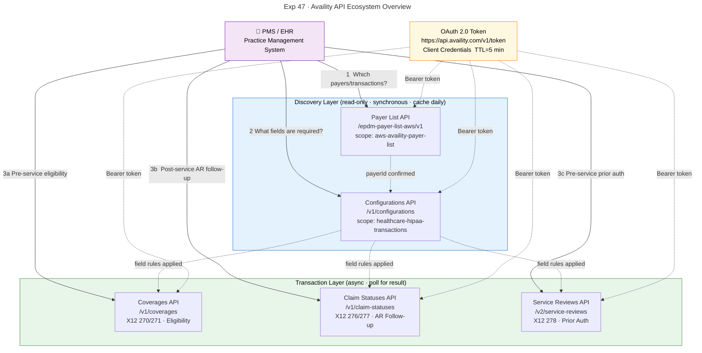

---

## 2 — Pre-Submission Validation Pipeline

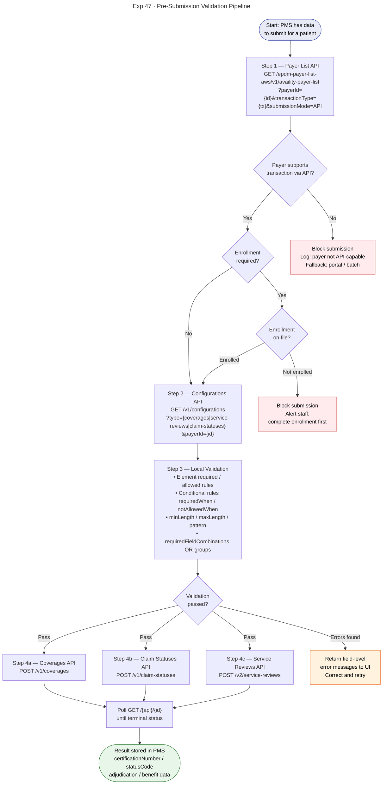

---

## 3 — OAuth 2.0 Token Lifecycle

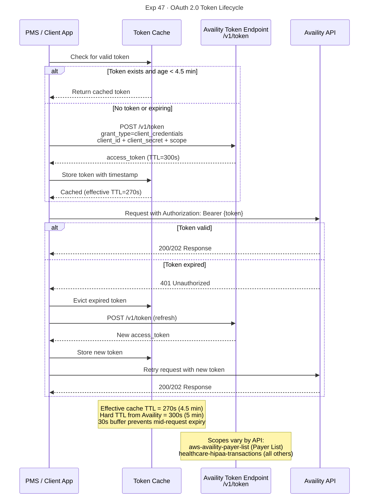

---

## 4 — Coverages API (270/271) Async Polling Lifecycle

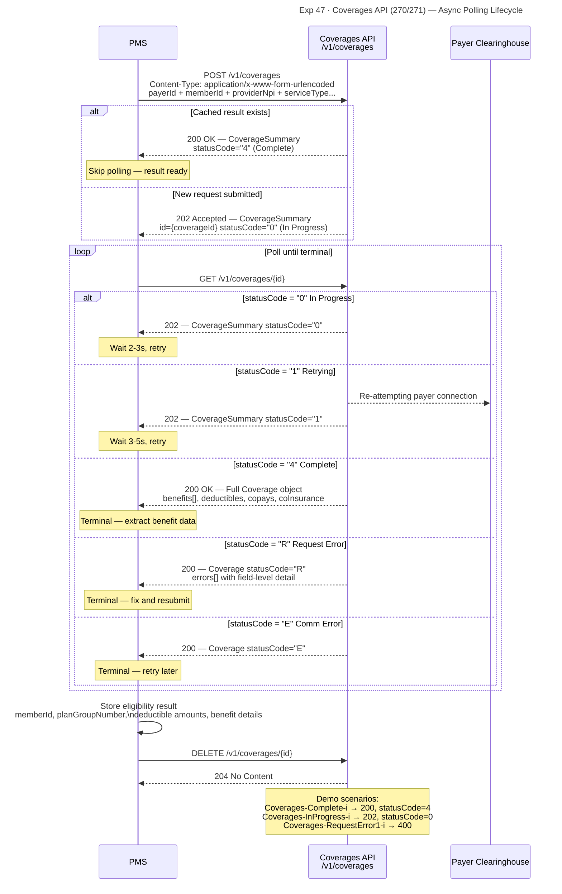

---

## 5 — Claim Statuses API (276/277) Lifecycle

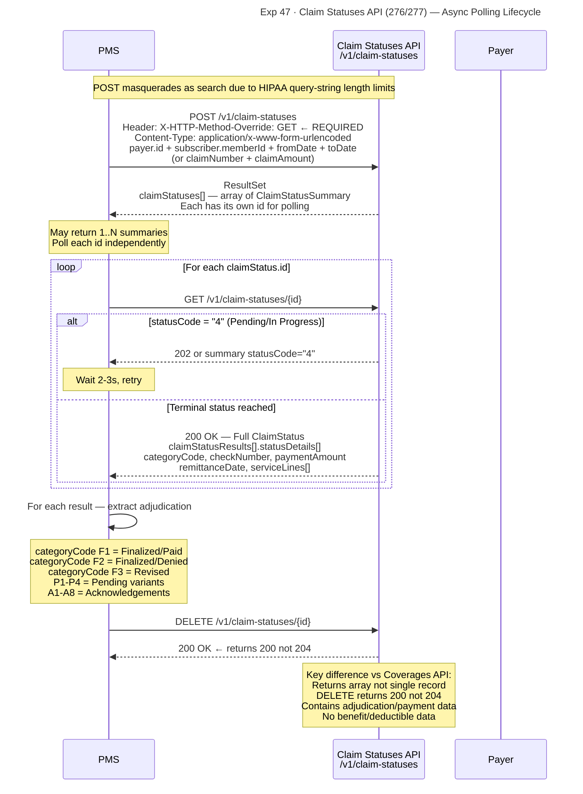

---

## 6 — Service Reviews API (278) State Machine

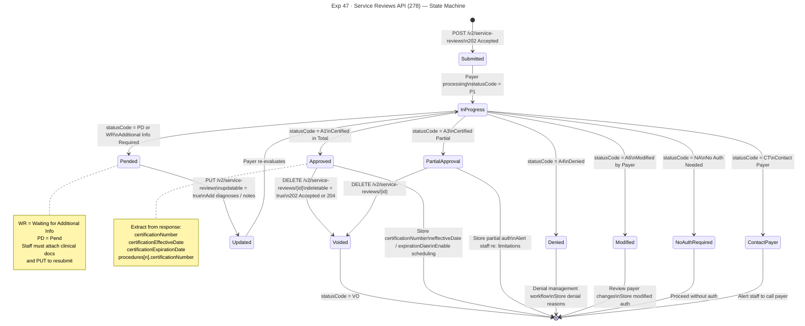

---

## 7 — Service Reviews API — Full PA Workflow with Pend-Resubmit

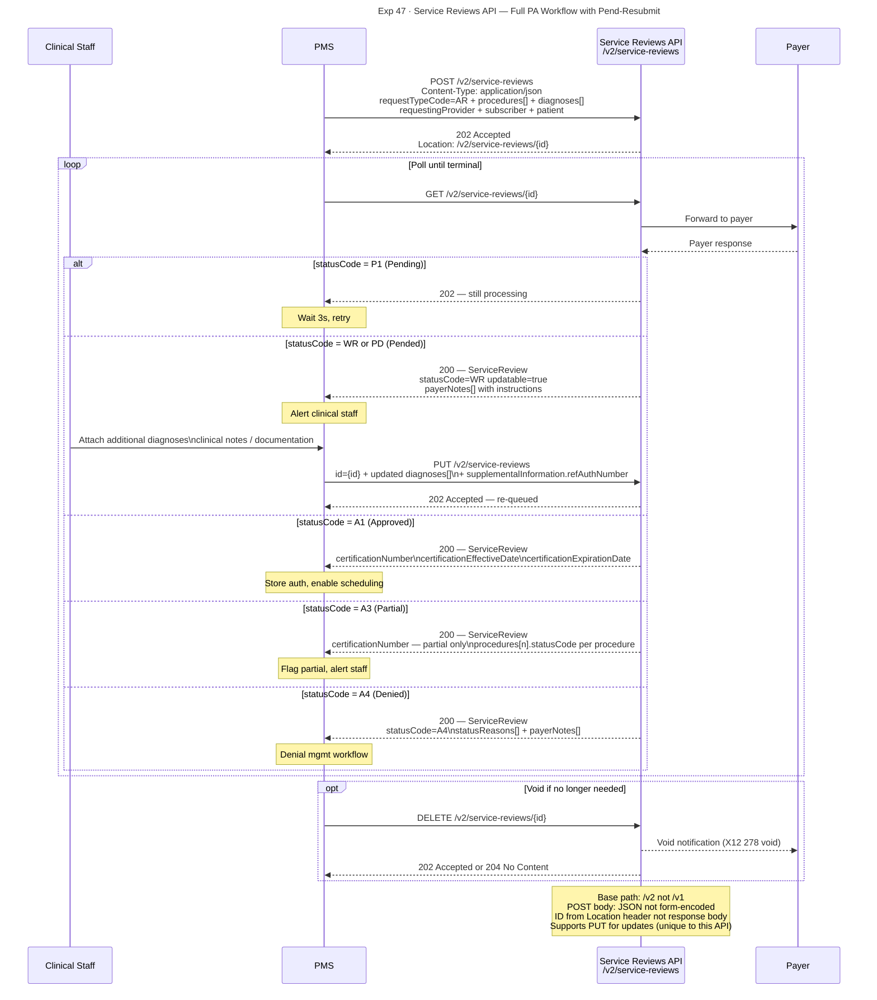

---

## 8 — Payer List API — Payer Validation Decision Flow

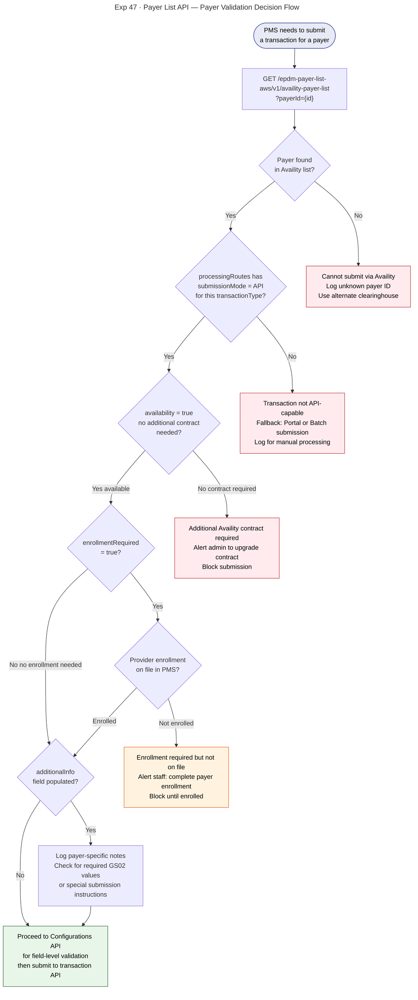

---

## 9 — Configurations API — Field Validation Decision Tree

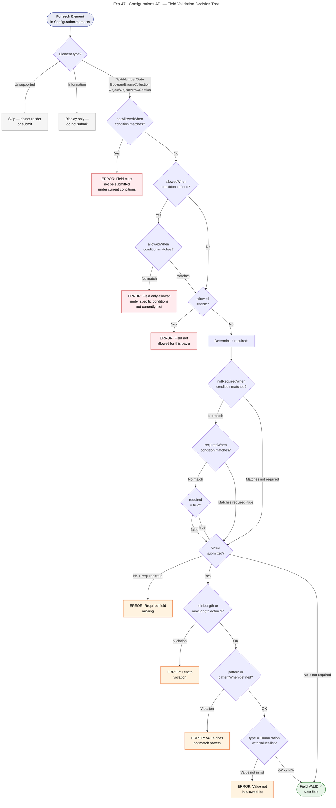

---

## 10 — End-to-End PMS Clinical Workflow

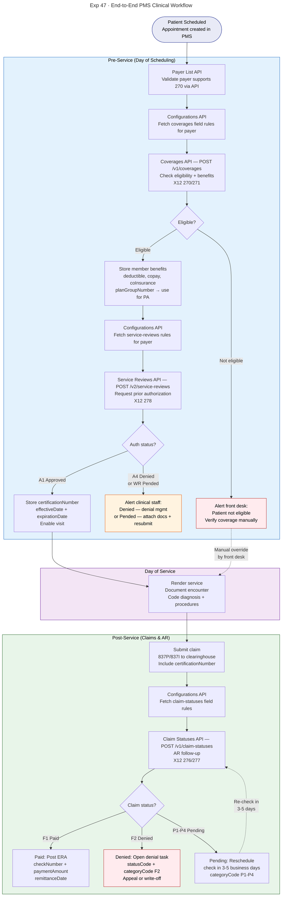

---

## 11 — API Comparison Matrix

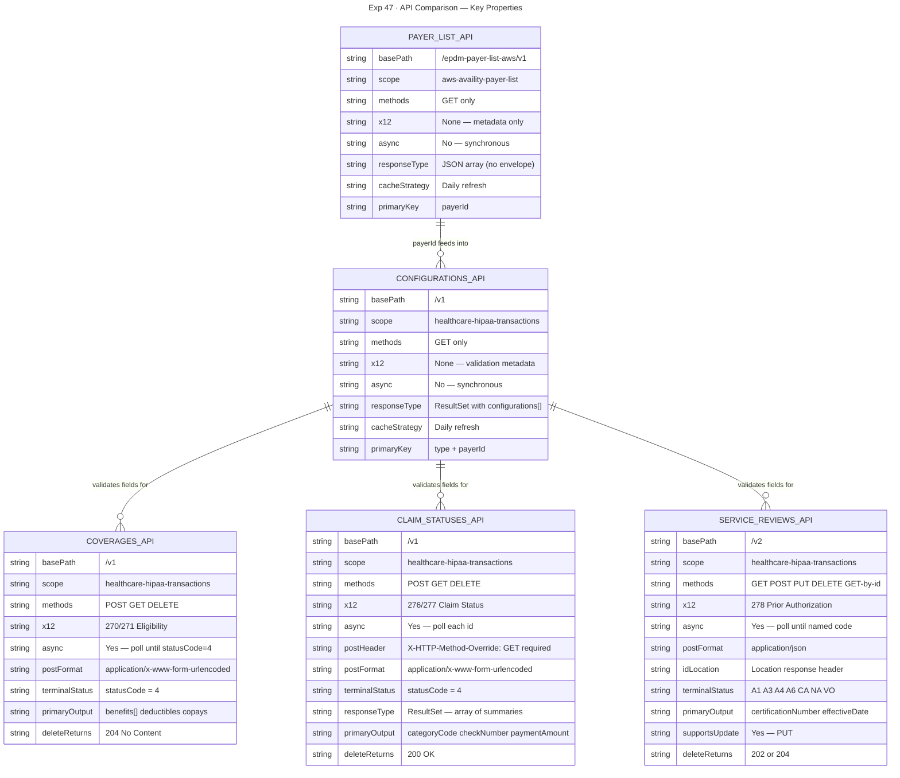

---

## 12 — requiredFieldCombinations Logic

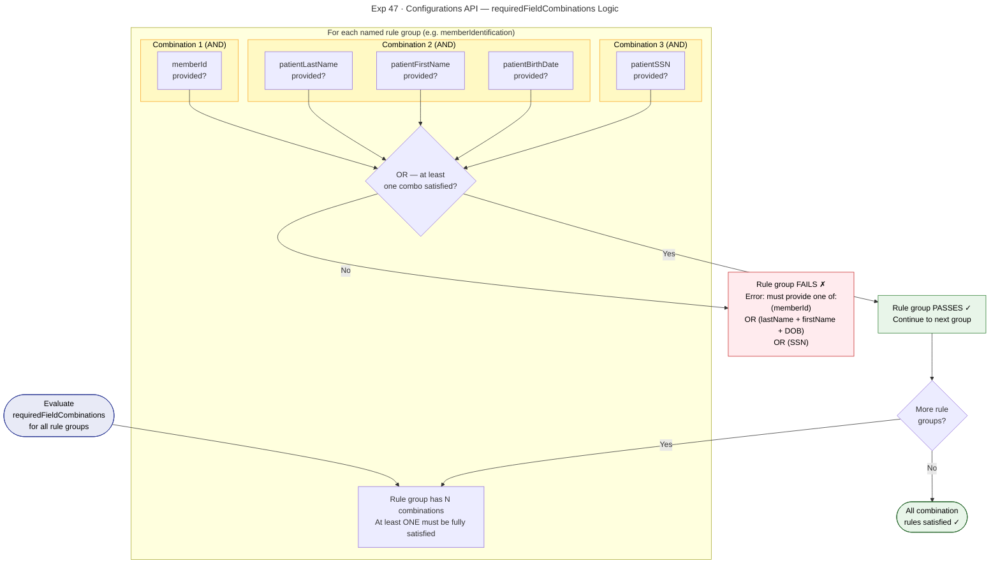

---

*Source: Availity Swagger Specifications — Coverages 1.0.0, Claim Statuses 1.0.0, Service Reviews 2.0.0, AWS Payer List 2.0.0, Configurations 1.0.0*  
*Render with: VS Code Mermaid Preview, Mermaid Live Editor (mermaid.live), GitHub markdown, or any Mermaid-compatible tool*
