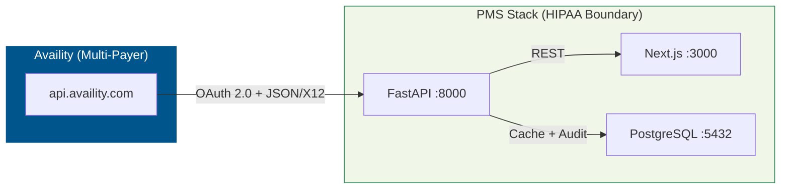

# Availity API Setup Guide for PMS Integration

**Document ID:** PMS-EXP-AVAILITY-001
**Version:** 2.0
**Date:** 2026-03-09
**Applies To:** PMS project (all platforms)
**Prerequisites Level:** Intermediate

---

## Table of Contents

1. [Overview](#1-overview)
2. [Prerequisites](#2-prerequisites)
3. [Part A: Register and Get Sandbox Credentials](#3-part-a-register-and-get-sandbox-credentials)
4. [Part B: Build the Availity API Client](#4-part-b-build-the-availity-api-client)
5. [Part C: Integrate with PMS Backend](#5-part-c-integrate-with-pms-backend)
6. [Part D: Database Schema](#6-part-d-database-schema)
7. [Part E: Integrate with PMS Frontend](#7-part-e-integrate-with-pms-frontend)
8. [Part F: Testing and Verification](#8-part-f-testing-and-verification)
9. [Troubleshooting](#9-troubleshooting)
10. [Reference Commands](#10-reference-commands)

**New in v2.0**: E&B Value-Add APIs (Care Reminders, Member ID Card) — see Parts B, C, D, and F for additions.

---

## 1. Overview

This guide walks you through integrating Availity's multi-payer API into the PMS. By the end, you will have:

- A registered developer account with sandbox credentials
- An OAuth 2.0 client that handles Availity's 5-minute token TTL
- FastAPI endpoints for eligibility, PA, and claim status across all payers
- **FastAPI endpoints for E&B value-add APIs: Care Reminders and Member ID Card**
- A frontend panel for multi-payer eligibility and PA workflows
- HIPAA audit logging for all transactions



**Key facts:**
- **Base URL**: `https://api.availity.com`
- **Authentication**: OAuth 2.0 client credentials (5-minute token TTL)
- **Demo plan**: Free, auto-approved, 5 req/s, 500 req/day, canned responses
- **Standard plan**: Requires Availity contract, 100 req/s, 100K req/day, live data
- **X12 transactions**: 270/271 (eligibility), 278 (PA), 276/277 (claim status), 837 (claims)
- **PHI**: Yes — production calls involve real patient data

---

## 2. Prerequisites

### 2.1 Required Software

| Software | Minimum Version | Check Command |
|----------|----------------|---------------|
| Python | 3.11+ | `python3 --version` |
| Node.js | 18+ | `node --version` |
| PostgreSQL | 14+ | `psql --version` |
| httpx | 0.25+ | `python3 -c "import httpx; print(httpx.__version__)"` |

### 2.2 Verify PMS Services

```bash
curl -s http://localhost:8000/health | jq .
curl -s -o /dev/null -w "%{http_code}" http://localhost:3000
psql -U pms -d pms_db -c "SELECT 1;"
```

---

## 3. Part A: Register and Get Sandbox Credentials

### Step 1: Create a Developer Account

1. Go to [developer.availity.com](https://developer.availity.com/)
2. Click "Create account"
3. Enter email, name, and password
4. Verify email (24-hour code)
5. Set up MFA with an authenticator app

### Step 2: Register an Application

1. Log in → navigate to "My Apps"
2. Click "Create a New App"
3. Enter application name: `PMS-Availity-Integration`
4. Save — you receive a **client_id** (API key) and **client_secret**

### Step 3: Subscribe to Demo Plan

1. Navigate to API Products
2. Subscribe to **Healthcare HIPAA Transactions** → **Demo** plan
3. Demo subscriptions are auto-approved — you can start testing immediately

### Step 4: Store Credentials

```bash
cat >> .env << 'EOF'
AVAILITY_CLIENT_ID=your-api-key
AVAILITY_CLIENT_SECRET=your-client-secret
AVAILITY_BASE_URL=https://api.availity.com
AVAILITY_TOKEN_URL=https://api.availity.com/v1/token
AVAILITY_SCOPE=hipaa
EOF
```

### Step 5: Verify Token Generation

```bash
source .env
curl -s -X POST "$AVAILITY_TOKEN_URL" \
  -H "Content-Type: application/x-www-form-urlencoded" \
  -d "grant_type=client_credentials&client_id=$AVAILITY_CLIENT_ID&client_secret=$AVAILITY_CLIENT_SECRET&scope=$AVAILITY_SCOPE" \
  | jq '{access_token: .access_token[:30], expires_in, token_type}'
```

Expected:
```json
{
  "access_token": "eyJhbGciOiJSUzI1NiIs...",
  "expires_in": 300,
  "token_type": "Bearer"
}
```

**Checkpoint**: You have a developer account, sandbox credentials, and can obtain an OAuth token.

---

## 4. Part B: Build the Availity API Client

Create `app/services/availity_api.py`:

```python
"""Availity multi-payer API client with 5-minute token management."""

import os
import time
from typing import Optional

import httpx


class AvailityToken:
    """Manages OAuth 2.0 tokens with 5-minute TTL."""

    def __init__(self):
        self._token: Optional[str] = None
        self._expires_at: float = 0
        self._client_id = os.environ["AVAILITY_CLIENT_ID"]
        self._client_secret = os.environ["AVAILITY_CLIENT_SECRET"]
        self._token_url = os.environ.get(
            "AVAILITY_TOKEN_URL", "https://api.availity.com/v1/token"
        )
        self._scope = os.environ.get("AVAILITY_SCOPE", "hipaa")

    async def get_token(self, client: httpx.AsyncClient) -> str:
        if self._token and time.time() < self._expires_at:
            return self._token

        resp = await client.post(
            self._token_url,
            data={
                "grant_type": "client_credentials",
                "client_id": self._client_id,
                "client_secret": self._client_secret,
                "scope": self._scope,
            },
            headers={"Content-Type": "application/x-www-form-urlencoded"},
        )
        resp.raise_for_status()
        data = resp.json()
        self._token = data["access_token"]
        self._expires_at = time.time() + data.get("expires_in", 300) - 30
        return self._token


class AvailityClient:
    """Client for Availity REST APIs."""

    def __init__(self):
        self._base = os.environ.get("AVAILITY_BASE_URL", "https://api.availity.com")
        self._client = httpx.AsyncClient(timeout=30.0)
        self._token_mgr = AvailityToken()

    async def _authed_headers(self) -> dict:
        token = await self._token_mgr.get_token(self._client)
        return {
            "Authorization": f"Bearer {token}",
            "Accept": "application/json",
        }

    async def _get(self, path: str, params: dict = None) -> dict:
        headers = await self._authed_headers()
        resp = await self._client.get(f"{self._base}{path}", params=params, headers=headers)
        resp.raise_for_status()
        return resp.json()

    async def _post(self, path: str, payload: dict, extra_headers: dict = None) -> dict:
        headers = await self._authed_headers()
        headers["Content-Type"] = "application/json"
        if extra_headers:
            headers.update(extra_headers)
        resp = await self._client.post(f"{self._base}{path}", json=payload, headers=headers)
        resp.raise_for_status()
        return resp.json()

    # --- Payer List ---

    async def list_payers(self, transaction_type: str = None) -> dict:
        params = {}
        if transaction_type:
            params["transactionType"] = transaction_type
        return await self._get("/v1/availity-payer-list", params)

    # --- Configurations ---

    async def get_configuration(self, config_type: str, payer_id: str) -> dict:
        return await self._get("/v1/configurations", {
            "type": config_type,
            "payerId": payer_id,
        })

    # --- Coverages (Eligibility 270/271) ---

    async def check_eligibility(self, coverage_request: dict) -> dict:
        """Submit eligibility inquiry. Returns id for polling."""
        return await self._post("/v1/coverages", coverage_request)

    async def get_eligibility_result(self, coverage_id: str) -> dict:
        """Poll for eligibility result."""
        return await self._get(f"/v1/coverages/{coverage_id}")

    async def check_eligibility_with_poll(
        self, coverage_request: dict, max_polls: int = 10, poll_interval: float = 0.5
    ) -> dict:
        """Submit and poll until complete."""
        import asyncio
        result = await self.check_eligibility(coverage_request)
        coverage_id = result.get("id")
        if not coverage_id:
            return result

        for _ in range(max_polls):
            result = await self.get_eligibility_result(coverage_id)
            if result.get("statusCode") == "4":  # Complete
                return result
            if result.get("statusCode") in ("19", "7", "13", "14", "15"):  # Error
                return result
            await asyncio.sleep(poll_interval)

        return result

    # --- Service Reviews (PA 278) ---

    async def submit_service_review(self, review_request: dict) -> dict:
        """Submit PA/referral request."""
        return await self._post("/v2/service-reviews", review_request)

    async def get_service_review(self, review_id: str) -> dict:
        """Get PA status."""
        return await self._get(f"/v2/service-reviews/{review_id}")

    async def search_service_reviews(self, params: dict) -> dict:
        """Search existing PAs."""
        return await self._get("/v2/service-reviews", params)

    # --- Claim Statuses (276/277) ---

    async def get_claim_status(self, claim_id: str) -> dict:
        return await self._get(f"/v1/claim-statuses/{claim_id}")

    # --- Demo Mock Scenarios ---

    async def check_eligibility_demo(self, coverage_request: dict, scenario_id: str) -> dict:
        """Submit with demo scenario header for canned responses."""
        return await self._post(
            "/v1/coverages",
            coverage_request,
            extra_headers={
                "X-Api-Mock-Scenario-ID": scenario_id,
                "X-Api-Mock-Response": "true",
            },
        )

    # --- E&B Value-Add: Care Reminders ---

    async def get_care_reminders(self, payload: dict) -> dict:
        """
        Retrieve care gap data for a member (post-eligibility).

        Always required: payerId, memberId
        Payer-specific optional: stateId, lineOfBusiness (required for BCBS MI),
            firstName, lastName, providerNPI, dateOfBirth, genderCode,
            controlNumber, groupNumber
        """
        return await self._post("/pre-claim/eb-value-adds/care-reminders", payload)

    # --- E&B Value-Add: Member ID Card (two-step) ---

    async def initiate_member_id_card(self, payload: dict) -> dict:
        """
        Step 1: POST to initiate member ID card retrieval.
        Returns GTID in data.memberCards.uris[0].

        Always required: payerId, memberId
        Payer-specific: responsePayerId (Aetna BH / Mercy Care AZ),
            routingCode + thirdPartySystemId (Anthem), planId (BCBS NJ / Molina)
        """
        return await self._post("/pre-claim/eb-value-adds/member-card", payload)

    async def get_member_id_card(self, gtid: str) -> bytes:
        """
        Step 2: GET to retrieve the PDF or PNG document bytes.
        Pass the GTID from initiate_member_id_card().
        """
        headers = await self._authed_headers()
        headers["Content-Type"] = "application/x-www-form-urlencoded"
        resp = await self._client.get(
            f"{self._base}/pre-claim/eb-value-adds/member-card/{gtid}",
            headers=headers,
        )
        resp.raise_for_status()
        return resp.content

    async def close(self):
        await self._client.aclose()
```

**Checkpoint**: You have an Availity client with auto-refreshing 5-minute tokens and methods for all HIPAA transactions.

---

## 5. Part C: Integrate with PMS Backend

Create `app/routers/availity.py`:

```python
"""Availity multi-payer API endpoints."""

import logging

from fastapi import APIRouter, HTTPException
from pydantic import BaseModel

from app.services.availity_api import AvailityClient

router = APIRouter(prefix="/api/availity", tags=["availity"])
client = AvailityClient()
log = logging.getLogger("availity")


class EligibilityRequest(BaseModel):
    payer_id: str
    member_id: str
    provider_npi: str
    date_of_service: str
    patient_first_name: str = ""
    patient_last_name: str = ""
    patient_dob: str = ""


class PARequest(BaseModel):
    payer_id: str
    member_id: str
    provider_npi: str
    procedure_code: str
    diagnosis_codes: list[str]
    date_of_service: str
    service_type: str = "HS"  # HS=outpatient, AR=inpatient, SC=referral


@router.get("/payers")
async def list_payers(transaction_type: str = None):
    """List Availity-connected payers."""
    try:
        return await client.list_payers(transaction_type)
    except Exception as e:
        raise HTTPException(status_code=502, detail=f"Availity error: {e}")


@router.post("/eligibility")
async def check_eligibility(req: EligibilityRequest):
    """Check eligibility for any Availity-connected payer."""
    try:
        result = await client.check_eligibility_with_poll({
            "payerId": req.payer_id,
            "memberId": req.member_id,
            "providerNpi": req.provider_npi,
            "asOfDate": req.date_of_service,
            "patientFirstName": req.patient_first_name,
            "patientLastName": req.patient_last_name,
            "patientBirthDate": req.patient_dob,
        })
        log.info(f"Eligibility: payer={req.payer_id} member={req.member_id} status={result.get('statusCode')}")
        return result
    except Exception as e:
        raise HTTPException(status_code=502, detail=f"Availity error: {e}")


@router.post("/prior-auth")
async def submit_pa(req: PARequest):
    """Submit PA to any Availity-connected payer."""
    try:
        result = await client.submit_service_review({
            "payerId": req.payer_id,
            "memberId": req.member_id,
            "providerNpi": req.provider_npi,
            "serviceType": req.service_type,
            "procedureCode": req.procedure_code,
            "diagnosisCodes": req.diagnosis_codes,
            "fromDate": req.date_of_service,
        })
        log.info(f"PA submitted: payer={req.payer_id} member={req.member_id}")
        return result
    except Exception as e:
        raise HTTPException(status_code=502, detail=f"Availity error: {e}")


@router.get("/prior-auth/{review_id}")
async def get_pa_status(review_id: str):
    """Check PA status."""
    try:
        return await client.get_service_review(review_id)
    except Exception as e:
        raise HTTPException(status_code=502, detail=f"Availity error: {e}")


@router.get("/configurations/{payer_id}")
async def get_payer_config(payer_id: str, config_type: str = "270"):
    """Get payer-specific field requirements."""
    try:
        return await client.get_configuration(config_type, payer_id)
    except Exception as e:
        raise HTTPException(status_code=502, detail=f"Availity error: {e}")


# --- E&B Value-Add endpoints ---
# Full implementation: see Tutorial Part 4 (47-AvailityAPI-Developer-Tutorial.md)

@router.post("/care-reminders")
async def get_care_reminders(req: dict):
    """Retrieve care gap / care reminder data for a member post-eligibility."""
    try:
        result = await client.get_care_reminders(req)
        log.info(f"CareReminders: payer={req.get('payer_id')} status={result.get('status')}")
        return result
    except Exception as e:
        raise HTTPException(status_code=502, detail=f"Availity error: {e}")


@router.post("/member-card/initiate")
async def initiate_member_card(req: dict):
    """Step 1: Initiate member ID card retrieval. Returns GTID."""
    try:
        result = await client.initiate_member_id_card(req)
        log.info(f"MemberCard initiated: payer={req.get('payer_id')}")
        return result
    except Exception as e:
        raise HTTPException(status_code=502, detail=f"Availity error: {e}")


@router.get("/member-card/{gtid}")
async def get_member_card(gtid: str):
    """Step 2: Retrieve member ID card PDF or PNG by GTID."""
    from fastapi.responses import Response
    try:
        doc_bytes = await client.get_member_id_card(gtid)
        return Response(content=doc_bytes, media_type="application/pdf")
    except Exception as e:
        raise HTTPException(status_code=502, detail=f"Availity error: {e}")


# --- Full PA Workflow ---
# Full implementation: see Tutorial Part 5 (47-AvailityAPI-Developer-Tutorial.md)

@router.post("/pa-workflow")
async def run_full_pa_workflow(req: dict):
    """
    Execute the full 6-step PA workflow:
    eligibility → coverage rules → PA decision → payer config →
    UHC Gold Card (if UHC) → PA submission → result processing.
    """
    from app.services.pa_orchestrator import PAOrchestrator, PARequest as OrchPARequest
    try:
        orchestrator = PAOrchestrator(availity_client=client)
        orch_req = OrchPARequest(**req)
        result = await orchestrator.run(orch_req)
        return {
            "status": result.status,
            "review_id": result.review_id,
            "auth_number": result.auth_number,
            "denial_reason": result.denial_reason,
            "pend_reason": result.pend_reason,
            "notes": result.notes,
        }
    except Exception as e:
        raise HTTPException(status_code=502, detail=f"PA workflow error: {e}")
```

Register in `app/main.py`:

```python
from app.routers import availity
app.include_router(availity.router)
```

**Checkpoint**: The PMS backend exposes multi-payer `/api/availity/eligibility`, `/api/availity/prior-auth`, and `/api/availity/payers` endpoints.

---

## 6. Part D: Database Schema

```sql
-- availity_eligibility_log
CREATE TABLE availity_eligibility_log (
    id SERIAL PRIMARY KEY,
    patient_id INTEGER,
    payer_id TEXT NOT NULL,
    member_id TEXT NOT NULL,
    date_of_service DATE NOT NULL,
    status_code TEXT,
    response JSONB NOT NULL,
    checked_by INTEGER,
    checked_at TIMESTAMPTZ NOT NULL DEFAULT NOW()
);

-- availity_pa_submissions
CREATE TABLE availity_pa_submissions (
    id SERIAL PRIMARY KEY,
    patient_id INTEGER,
    encounter_id INTEGER,
    payer_id TEXT NOT NULL,
    member_id TEXT NOT NULL,
    procedure_code TEXT NOT NULL,
    diagnosis_codes TEXT[] NOT NULL,
    review_id TEXT,
    status TEXT,                     -- approved | denied | pended | no_pa_required | eligibility_failed | error
    auth_number TEXT,                -- populated on approval
    denial_reason TEXT,              -- populated on denial
    pend_reason TEXT,                -- populated on pend
    response JSONB,
    submitted_by INTEGER,
    submitted_at TIMESTAMPTZ NOT NULL DEFAULT NOW(),
    last_polled_at TIMESTAMPTZ,
    resolved_at TIMESTAMPTZ
);

-- availity_care_reminders_log (E&B value-add)
CREATE TABLE availity_care_reminders_log (
    id SERIAL PRIMARY KEY,
    patient_id INTEGER,
    payer_id TEXT NOT NULL,
    member_id TEXT NOT NULL,
    care_gap_count INTEGER,          -- number of rows in careReminderDetails
    response JSONB NOT NULL,
    retrieved_by INTEGER,
    retrieved_at TIMESTAMPTZ NOT NULL DEFAULT NOW()
);

-- availity_member_id_cards (E&B value-add)
CREATE TABLE availity_member_id_cards (
    id SERIAL PRIMARY KEY,
    patient_id INTEGER,
    payer_id TEXT NOT NULL,
    member_id TEXT NOT NULL,
    gtid TEXT NOT NULL,              -- GTID from POST response; use to GET the document
    document_type TEXT,              -- application/pdf or image/png
    retrieved_by INTEGER,
    retrieved_at TIMESTAMPTZ NOT NULL DEFAULT NOW(),
    UNIQUE(patient_id, payer_id, gtid)
);

CREATE INDEX idx_av_elig_payer ON availity_eligibility_log (payer_id, member_id);
CREATE INDEX idx_av_pa_status ON availity_pa_submissions (status, submitted_at);
CREATE INDEX idx_av_pa_review ON availity_pa_submissions (review_id);
CREATE INDEX idx_av_cr_payer ON availity_care_reminders_log (payer_id, member_id);
CREATE INDEX idx_av_card_patient ON availity_member_id_cards (patient_id, payer_id);
```

**Checkpoint**: Audit tables ready for HIPAA-compliant transaction logging.

---

## 7. Part E: Integrate with PMS Frontend

Create `components/MultiPayerEligibility.tsx`:

```tsx
"use client";

import { useState } from "react";

const PAYERS = [
  { id: "UHC", name: "UnitedHealthcare" },
  { id: "AETNA", name: "Aetna" },
  { id: "BCBSTX", name: "BCBS of Texas" },
  { id: "HUMANA", name: "Humana" },
  { id: "CIGNA", name: "Cigna" },
];

export default function MultiPayerEligibility({
  memberId,
  dateOfService,
  providerNpi,
  payerId,
}: {
  memberId: string;
  dateOfService: string;
  providerNpi: string;
  payerId: string;
}) {
  const [result, setResult] = useState<any>(null);
  const [loading, setLoading] = useState(false);

  const check = async () => {
    setLoading(true);
    try {
      const res = await fetch("/api/availity/eligibility", {
        method: "POST",
        headers: { "Content-Type": "application/json" },
        body: JSON.stringify({
          payer_id: payerId,
          member_id: memberId,
          provider_npi: providerNpi,
          date_of_service: dateOfService,
        }),
      });
      setResult(await res.json());
    } finally {
      setLoading(false);
    }
  };

  return (
    <div className="border rounded-lg p-4">
      <h3 className="font-semibold">
        Eligibility — {PAYERS.find((p) => p.id === payerId)?.name || payerId}
      </h3>
      <button onClick={check} disabled={loading} className="mt-2 px-4 py-2 bg-blue-600 text-white rounded">
        {loading ? "Checking..." : "Verify Eligibility"}
      </button>
      {result && (
        <pre className="mt-4 text-xs bg-gray-50 p-2 rounded overflow-auto max-h-60">
          {JSON.stringify(result, null, 2)}
        </pre>
      )}
    </div>
  );
}
```

**Checkpoint**: Frontend component supports eligibility checks for any Availity-connected payer.

---

## 8. Part F: Testing and Verification

```bash
source .env

# 1. Token works
TOKEN=$(curl -s -X POST "$AVAILITY_TOKEN_URL" \
  -d "grant_type=client_credentials&client_id=$AVAILITY_CLIENT_ID&client_secret=$AVAILITY_CLIENT_SECRET&scope=$AVAILITY_SCOPE" \
  | jq -r '.access_token')
[ -n "$TOKEN" ] && echo "PASS: Token obtained" || echo "FAIL"

# 2. Payer list returns results
curl -s "http://localhost:8000/api/availity/payers" | jq '.totalCount'

# 3. Demo eligibility
curl -s -X POST "http://localhost:8000/api/availity/eligibility" \
  -H "Content-Type: application/json" \
  -d '{"payer_id":"UHC","member_id":"TEST123","provider_npi":"1234567890","date_of_service":"2026-03-07"}' \
  | jq '.statusCode'

# 4. Payer configuration
curl -s "http://localhost:8000/api/availity/configurations/UHC?config_type=270" | jq '.'

# 5. Care Reminders (E&B value-add)
curl -s -X POST "http://localhost:8000/api/availity/care-reminders" \
  -H "Content-Type: application/json" \
  -d '{"payer_id":"00611","member_id":"SUCC123456789","first_name":"PATIENTONE","last_name":"TEST"}' \
  | jq '.status'

# 6. Member ID Card — Step 1: Initiate
GTID=$(curl -s -X POST "http://localhost:8000/api/availity/member-card/initiate" \
  -H "Content-Type: application/json" \
  -d '{"payer_id":"00611","member_id":"SUCC123456789","plan_type":"Medical"}' \
  | jq -r '.data.memberCards.uris[0]')
echo "GTID: $GTID"

# 7. Member ID Card — Step 2: Retrieve
[ -n "$GTID" ] && curl -s "http://localhost:8000/api/availity/member-card/$GTID" \
  --output /tmp/test_card.pdf && echo "PASS: Member ID Card PDF retrieved"

# 8. Full PA workflow
curl -s -X POST "http://localhost:8000/api/availity/pa-workflow" \
  -H "Content-Type: application/json" \
  -d '{
    "patient_id": 101, "member_id": "UHC123456", "payer_id": "UHC",
    "patient_first_name": "John", "patient_last_name": "Smith", "patient_dob": "1965-04-15",
    "encounter_id": 5001, "procedure_code": "67028", "diagnosis_codes": ["H35.31"],
    "date_of_service": "2026-03-10", "provider_npi": "1234567890"
  }' | jq '{status, auth_number, denial_reason, pend_reason}'
```

**Checkpoint**: All Availity endpoints work against the Demo sandbox.

---

## 9. Troubleshooting

### 401 Unauthorized on Every Call

**Cause**: Token expired (5-minute TTL) and auto-refresh failed.
**Fix**: Verify credentials in `.env`. Check that `AVAILITY_SCOPE` matches your subscription. The OAuth token call itself counts against rate limits.

### 429 Rate Limit Exceeded

**Cause**: Demo plan allows only 5 req/s and 500 req/day. OAuth token calls count.
**Fix**: Cache tokens aggressively (4.5-minute TTL). For higher limits, upgrade to Standard plan.

### Eligibility Returns Status 0 (In Progress) Indefinitely

**Cause**: The coverage query is asynchronous. POST returns status 0, and you must poll GET until status 4.
**Fix**: Use `check_eligibility_with_poll()` which handles the polling loop automatically.

### Payer Not Found

**Cause**: Payer ID doesn't match Availity's payer list.
**Fix**: Query `/api/availity/payers` to find the correct payer ID. Availity payer IDs may differ from payer-internal IDs.

### Input Validation Error (400)

**Cause**: Availity rejects unsafe characters or missing required fields.
**Fix**: Use the Configurations API to get payer-specific field requirements. Sanitize all inputs (Availity blocks SQL injection characters).

---

## 10. Reference Commands

### Key URLs

| Resource | URL |
|----------|-----|
| Availity Developer Portal | https://developer.availity.com |
| API Guide | https://developer.availity.com/blog/2025/3/25/availity-api-guide |
| HIPAA Transactions | https://developer.availity.com/blog/2025/3/25/hipaa-transactions |
| Payer List | https://apps.availity.com/public-web/payerlist-ui/payerlist-ui/ |
| Support | https://developer.availity.com/partner/support |
| Availity Essentials (Portal) | https://essentials.availity.com |

### Rate Limits

| Plan | Requests/Second | Requests/Day |
|------|----------------|-------------|
| Demo | 5 | 500 |
| Standard | 100 | 100,000 |

---

## Next Steps

1. Complete the [Availity API Developer Tutorial](47-AvailityAPI-Developer-Tutorial.md)
2. Test eligibility and PA flows against sandbox for all 6 payers
3. Test E&B value-add APIs (Care Reminders, Member ID Card) for supported payers
4. Wire up PA orchestrator integration points (Exp 44, 45, 46)
5. Contact Availity (partnermanagement@availity.com) for Standard plan contract
6. Execute BAA with Availity for production PHI access

## Resources

- [Availity API Guide](https://developer.availity.com/blog/2025/3/25/availity-api-guide)
- [Availity HIPAA Transaction APIs](https://developer.availity.com/blog/2025/3/25/hipaa-transactions)
- [Experiment 44: Payer Policy Download](44-PRD-PayerPolicyDownload-PMS-Integration.md)
- [Experiment 45: CMS Coverage API](45-PRD-CMSCoverageAPI-PMS-Integration.md)
- [Experiment 46: UHC API Marketplace](46-PRD-UHCAPIMarketplace-PMS-Integration.md)
