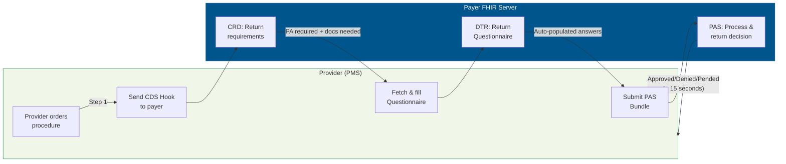
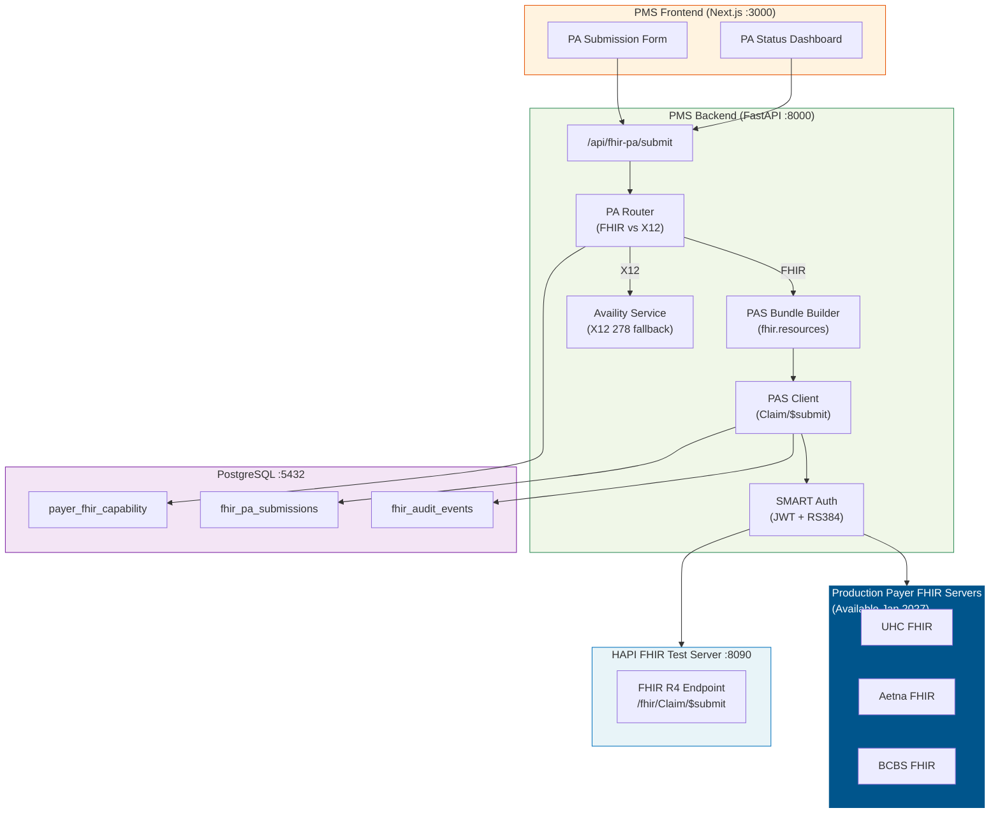

# FHIR Prior Authorization API Developer Onboarding Tutorial

**Welcome to the MPS PMS FHIR Prior Authorization Integration Team**

This tutorial will take you from zero to building your first FHIR-based prior authorization submission with the PMS. By the end, you will understand how the Da Vinci PA workflow (CRD → DTR → PAS) works, have a running local FHIR environment, and have built and tested a complete PA submission end-to-end.

**Document ID:** PMS-EXP-FHIRPA-002
**Version:** 1.0
**Date:** 2026-03-07
**Applies To:** PMS project (all platforms)
**Prerequisite:** [FHIR PA Setup Guide](48-FHIRPriorAuth-PMS-Developer-Setup-Guide.md)
**Estimated time:** 2-3 hours
**Difficulty:** Beginner-friendly

---

## What You Will Learn

1. What FHIR Prior Authorization is and why CMS-0057-F mandates it
2. How the Da Vinci CRD → DTR → PAS workflow replaces fax/phone PA
3. How to build FHIR resources (`Claim`, `Bundle`, `Coverage`) using Python
4. How to construct a Da Vinci PAS-compliant Bundle for PA submission
5. How to submit a PA via `Claim/$submit` and process the `ClaimResponse`
6. How the PA Router decides between FHIR and Availity X12
7. How SMART on FHIR authentication works for backend services
8. How FHIR PA integrates with the existing PMS PA workflow (Experiments 44-47)
9. How to track PA status with `Claim/$inquire` for pended requests
10. How to audit FHIR transactions for HIPAA compliance

---

## Part 1: Understanding FHIR Prior Authorization (15 min read)

### 1.1 What Problem Does FHIR PA Solve?

Today, prior authorization at TRA works like this:

1. Staff checks if PA is required (logs into payer portal or checks Experiment 44 PDF rules)
2. Staff gathers clinical documentation (OCT scans, visual acuity, treatment history)
3. Staff submits PA via fax, phone, payer portal, or Availity (Experiment 47)
4. Payer responds in 1-15 business days (or requests more documentation)
5. Staff tracks PA status by calling the payer or checking the portal

This process takes **15-45 minutes per PA** and involves 3-5 different systems. FHIR PA replaces the entire workflow with a single API call that completes in under 15 seconds.

**CMS-0057-F mandates** that by January 2027, every major payer must:
- Tell providers what requires PA and what documentation is needed (CRD)
- Auto-populate documentation from the EHR (DTR)
- Accept PA submissions via FHIR API and respond in real-time (PAS)
- Respond within 72 hours (expedited) or 7 calendar days (standard)

### 1.2 How FHIR PA Works — The Key Pieces



**Three steps, three Da Vinci IGs:**

| Step | Da Vinci IG | What It Does | FHIR Operation |
|------|------------|--------------|----------------|
| 1 | **CRD** (Coverage Requirements Discovery) | "Does this procedure need PA? What docs do you need?" | CDS Hooks (`order-sign`) |
| 2 | **DTR** (Documentation Templates & Rules) | "Here's a form — auto-fill from EHR data" | `Questionnaire` / `QuestionnaireResponse` |
| 3 | **PAS** (Prior Authorization Support) | "Here's the PA request — approve/deny now" | `Claim/$submit` → `ClaimResponse` |

### 1.3 How FHIR PA Fits with Other PMS Technologies

| Technology | Experiment | Role in PA Workflow | FHIR PA Relationship |
|-----------|-----------|---------------------|---------------------|
| Payer Policy PDFs | Exp 44 | Static PA rules | Replaced by CRD (real-time) |
| CMS Coverage API | Exp 45 | Medicare LCD/NCD rules | Complementary — LCD data can inform CRD |
| UHC API Marketplace | Exp 46 | UHC-specific PA (X12 278) | Replaced by UHC FHIR PAS when available |
| Availity API | Exp 47 | Multi-payer PA (X12 278) | Fallback when payer lacks FHIR endpoint |
| FHIR Facade | Exp 16 | General FHIR interop | Provides resource mappings for PAS Bundles |
| **FHIR PA APIs** | **Exp 48** | **Direct FHIR PA (CRD/DTR/PAS)** | **Primary PA path (Jan 2027+)** |

### 1.4 Key Vocabulary

| Term | Meaning |
|------|---------|
| **PAS** | Prior Authorization Support — Da Vinci IG for FHIR-based PA submission |
| **CRD** | Coverage Requirements Discovery — tells providers if PA is needed |
| **DTR** | Documentation Templates and Rules — auto-populates PA documentation |
| **CDS Hooks** | Clinical Decision Support Hooks — event-driven API for EHR integration |
| **PAS Bundle** | FHIR Bundle containing Claim + supporting resources for PA submission |
| **Claim/$submit** | FHIR operation to submit a PA request |
| **ClaimResponse** | FHIR resource containing the payer's PA decision |
| **$inquire** | FHIR operation to check status of a pended PA request |
| **SMART on FHIR** | OAuth 2.0-based authorization framework for FHIR servers |
| **CMS-0057-F** | Federal rule requiring payers to implement FHIR PA APIs by Jan 2027 |
| **X12 278** | Legacy EDI transaction standard for PA (what Availity uses today) |
| **fhir.resources** | Python library providing Pydantic models for all FHIR resources |

### 1.5 Our Architecture



---

## Part 2: Environment Verification (15 min)

### 2.1 Checklist

Run each command and verify the expected output:

1. **HAPI FHIR Server**
   ```bash
   curl -s http://localhost:8090/fhir/metadata | jq '.fhirVersion'
   # Expected: "4.0.1"
   ```

2. **Test Patient loaded**
   ```bash
   curl -s http://localhost:8090/fhir/Patient/test-patient-001 | jq '.name[0]'
   # Expected: { "family": "Smith", "given": ["John"] }
   ```

3. **Test Coverage loaded**
   ```bash
   curl -s http://localhost:8090/fhir/Coverage/test-coverage-001 | jq '.payor[0].display'
   # Expected: "UnitedHealthcare"
   ```

4. **Python FHIR libraries**
   ```bash
   python -c "from fhir.resources.R4B.claim import Claim; print('OK')"
   # Expected: OK
   ```

5. **PMS Backend running**
   ```bash
   curl -s http://localhost:8000/health | jq .
   # Expected: { "status": "healthy" }
   ```

### 2.2 Quick Test

Submit a test PA request to verify the full pipeline:

```bash
curl -s -X POST http://localhost:8000/api/fhir-pa/submit \
  -H "Content-Type: application/json" \
  -d '{
    "patient_id": "test-patient-001",
    "payer_id": "UHC",
    "procedure_code": "67028",
    "procedure_display": "Intravitreal injection",
    "diagnosis_code": "H35.3211",
    "diagnosis_display": "Exudative AMD right eye",
    "service_date": "2026-03-15",
    "practitioner_npi": "1234567890"
  }' | jq .
```

You should see a response with `submission_path` of either `"FHIR"` or `"X12"` depending on your payer capability configuration.

---

## Part 3: Build Your First FHIR PA Submission (45 min)

### 3.1 What We Are Building

A standalone Python script that:
1. Creates a FHIR Patient, Coverage, and Practitioner
2. Builds a PAS Claim for an Eylea intravitreal injection
3. Wraps everything in a PAS Bundle
4. Submits it to the local HAPI FHIR server
5. Processes the response

### 3.2 Create the Script

Create `scripts/fhir_pa_tutorial.py`:

```python
"""
FHIR PA Tutorial: Build and submit a prior authorization for Eylea injection.

This script demonstrates the complete PAS workflow:
1. Create FHIR resources (Patient, Coverage, Practitioner, Condition)
2. Build a PAS Claim for preauthorization
3. Wrap in a PAS Bundle
4. Submit to FHIR server
5. Process the response
"""
import httpx
import json
from datetime import date, datetime
from uuid import uuid4

FHIR_BASE = "http://localhost:8090/fhir"

# ── Step 1: Define the clinical scenario ──────────────────────────
print("=" * 60)
print("FHIR PA Tutorial: Eylea Intravitreal Injection")
print("=" * 60)
print()
print("Clinical Scenario:")
print("  Patient: John Smith, DOB 1955-03-15")
print("  Payer: UnitedHealthcare PPO")
print("  Procedure: Intravitreal injection (CPT 67028)")
print("  Drug: Eylea (HCPCS J0178)")
print("  Diagnosis: Exudative AMD, right eye (H35.3211)")
print("  Service Date: 2026-03-15")
print()

# ── Step 2: Build the FHIR resources ─────────────────────────────
print("Step 2: Building FHIR resources...")

patient = {
    "resourceType": "Patient",
    "id": "pa-tutorial-patient",
    "identifier": [
        {
            "type": {"coding": [{"system": "http://terminology.hl7.org/CodeSystem/v2-0203", "code": "MB"}]},
            "system": "http://uhc.com/member-id",
            "value": "UHC-999888777"
        }
    ],
    "name": [{"family": "Smith", "given": ["John"]}],
    "gender": "male",
    "birthDate": "1955-03-15",
    "address": [{"state": "TX", "postalCode": "75001"}]
}

coverage = {
    "resourceType": "Coverage",
    "id": "pa-tutorial-coverage",
    "status": "active",
    "type": {"coding": [{"system": "http://terminology.hl7.org/CodeSystem/v3-ActCode", "code": "HIP"}]},
    "subscriber": {"reference": "Patient/pa-tutorial-patient"},
    "beneficiary": {"reference": "Patient/pa-tutorial-patient"},
    "payor": [{"display": "UnitedHealthcare"}],
    "class": [
        {
            "type": {"coding": [{"system": "http://terminology.hl7.org/CodeSystem/coverage-class", "code": "plan"}]},
            "value": "UHC-PPO-2026",
            "name": "UHC PPO"
        },
        {
            "type": {"coding": [{"system": "http://terminology.hl7.org/CodeSystem/coverage-class", "code": "group"}]},
            "value": "TRA-GROUP-001"
        }
    ]
}

practitioner = {
    "resourceType": "Practitioner",
    "id": "pa-tutorial-practitioner",
    "identifier": [
        {"system": "http://hl7.org/fhir/sid/us-npi", "value": "1234567890"}
    ],
    "name": [{"family": "Jones", "given": ["Sarah"], "prefix": ["Dr."]}],
    "qualification": [
        {
            "code": {
                "coding": [{"system": "http://terminology.hl7.org/CodeSystem/v2-0360", "code": "MD"}],
                "text": "Retina Specialist"
            }
        }
    ]
}

condition = {
    "resourceType": "Condition",
    "id": "pa-tutorial-condition",
    "clinicalStatus": {
        "coding": [{"system": "http://terminology.hl7.org/CodeSystem/condition-clinical", "code": "active"}]
    },
    "verificationStatus": {
        "coding": [{"system": "http://terminology.hl7.org/CodeSystem/condition-ver-status", "code": "confirmed"}]
    },
    "code": {
        "coding": [
            {"system": "http://hl7.org/fhir/sid/icd-10-cm", "code": "H35.3211", "display": "Exudative age-related macular degeneration, right eye, stage unspecified"}
        ]
    },
    "subject": {"reference": "Patient/pa-tutorial-patient"},
    "onsetDateTime": "2025-06-01"
}

print(f"  Patient: {patient['name'][0]['family']}, {patient['name'][0]['given'][0]}")
print(f"  Coverage: {coverage['payor'][0]['display']}")
print(f"  Practitioner: Dr. {practitioner['name'][0]['family']}")
print(f"  Condition: {condition['code']['coding'][0]['code']} - {condition['code']['coding'][0]['display']}")
print()

# ── Step 3: Load resources into FHIR server ──────────────────────
print("Step 3: Loading resources into HAPI FHIR server...")

with httpx.Client() as client:
    for resource in [patient, coverage, practitioner, condition]:
        rtype = resource["resourceType"]
        rid = resource["id"]
        resp = client.put(
            f"{FHIR_BASE}/{rtype}/{rid}",
            json=resource,
            headers={"Content-Type": "application/fhir+json"},
        )
        status = "created" if resp.status_code == 201 else "updated" if resp.status_code == 200 else f"error ({resp.status_code})"
        print(f"  {rtype}/{rid}: {status}")

print()

# ── Step 4: Build the PAS Claim ──────────────────────────────────
print("Step 4: Building PAS Claim for preauthorization...")

claim_id = str(uuid4())
claim = {
    "resourceType": "Claim",
    "id": claim_id,
    "status": "active",
    "type": {
        "coding": [{"system": "http://terminology.hl7.org/CodeSystem/claim-type", "code": "professional"}]
    },
    "use": "preauthorization",
    "patient": {"reference": "Patient/pa-tutorial-patient"},
    "created": datetime.now().isoformat(),
    "provider": {"reference": "Practitioner/pa-tutorial-practitioner"},
    "priority": {
        "coding": [{"system": "http://terminology.hl7.org/CodeSystem/processpriority", "code": "normal"}]
    },
    "insurance": [
        {
            "sequence": 1,
            "focal": True,
            "coverage": {"reference": "Coverage/pa-tutorial-coverage"}
        }
    ],
    "diagnosis": [
        {
            "sequence": 1,
            "diagnosisCodeableConcept": {
                "coding": [
                    {"system": "http://hl7.org/fhir/sid/icd-10-cm", "code": "H35.3211", "display": "Exudative AMD, right eye"}
                ]
            }
        }
    ],
    "item": [
        {
            "sequence": 1,
            "productOrService": {
                "coding": [
                    {"system": "http://www.ama-assn.org/go/cpt", "code": "67028", "display": "Intravitreal injection"},
                    {"system": "https://www.cms.gov/Medicare/Coding/HCPCSReleaseCodeSets", "code": "J0178", "display": "Eylea 1mg"}
                ]
            },
            "servicedDate": "2026-03-15",
            "quantity": {"value": 1},
            "diagnosisSequence": [1]
        }
    ]
}

print(f"  Claim ID: {claim_id}")
print(f"  Use: {claim['use']}")
print(f"  Procedure: CPT {claim['item'][0]['productOrService']['coding'][0]['code']} + HCPCS {claim['item'][0]['productOrService']['coding'][1]['code']}")
print(f"  Diagnosis: ICD-10 {claim['diagnosis'][0]['diagnosisCodeableConcept']['coding'][0]['code']}")
print()

# ── Step 5: Submit the Claim to FHIR server ──────────────────────
print("Step 5: Submitting Claim to HAPI FHIR server...")

with httpx.Client() as client:
    # HAPI FHIR doesn't support $submit natively, so we POST the Claim directly
    resp = client.post(
        f"{FHIR_BASE}/Claim",
        json=claim,
        headers={"Content-Type": "application/fhir+json"},
    )

    if resp.status_code == 201:
        created_claim = resp.json()
        server_id = created_claim.get("id", "unknown")
        print(f"  Claim created successfully!")
        print(f"  Server ID: {server_id}")
        print(f"  Status: {created_claim.get('status')}")
        print(f"  Use: {created_claim.get('use')}")
    else:
        print(f"  Error: {resp.status_code}")
        print(f"  {resp.text[:500]}")

print()

# ── Step 6: Simulate a ClaimResponse ─────────────────────────────
print("Step 6: Simulating payer ClaimResponse (approved)...")

claim_response = {
    "resourceType": "ClaimResponse",
    "id": str(uuid4()),
    "status": "active",
    "type": {
        "coding": [{"system": "http://terminology.hl7.org/CodeSystem/claim-type", "code": "professional"}]
    },
    "use": "preauthorization",
    "patient": {"reference": "Patient/pa-tutorial-patient"},
    "created": datetime.now().isoformat(),
    "insurer": {"display": "UnitedHealthcare"},
    "request": {"reference": f"Claim/{server_id}"},
    "outcome": "complete",
    "preAuthRef": "AUTH-2026-EYLEA-78901",
    "preAuthPeriod": {
        "start": "2026-03-15",
        "end": "2026-09-15"
    },
    "item": [
        {
            "itemSequence": 1,
            "adjudication": [
                {
                    "category": {
                        "coding": [{"system": "http://terminology.hl7.org/CodeSystem/adjudication", "code": "submitted"}]
                    }
                }
            ]
        }
    ]
}

with httpx.Client() as client:
    resp = client.post(
        f"{FHIR_BASE}/ClaimResponse",
        json=claim_response,
        headers={"Content-Type": "application/fhir+json"},
    )
    if resp.status_code == 201:
        print(f"  ClaimResponse created!")
        print(f"  Outcome: {claim_response['outcome']}")
        print(f"  Auth Number: {claim_response['preAuthRef']}")
        print(f"  Valid: {claim_response['preAuthPeriod']['start']} to {claim_response['preAuthPeriod']['end']}")
    else:
        print(f"  Error: {resp.status_code}")

print()

# ── Step 7: Verify the resources ─────────────────────────────────
print("Step 7: Verifying resources on FHIR server...")

with httpx.Client() as client:
    # Count claims
    claims = client.get(f"{FHIR_BASE}/Claim?use=preauthorization").json()
    print(f"  Preauthorization Claims: {claims.get('total', 0)}")

    # Count claim responses
    responses = client.get(f"{FHIR_BASE}/ClaimResponse?use=preauthorization").json()
    print(f"  ClaimResponses: {responses.get('total', 0)}")

print()
print("=" * 60)
print("Tutorial complete!")
print()
print("Summary:")
print("  1. Created Patient, Coverage, Practitioner, Condition")
print("  2. Built a PAS Claim for Eylea intravitreal injection PA")
print("  3. Submitted Claim to FHIR server")
print("  4. Simulated payer approval with ClaimResponse")
print(f"  5. Authorization: {claim_response['preAuthRef']}")
print()
print("In production, Step 5-6 would be a single Claim/$submit call")
print("that returns the ClaimResponse synchronously (< 15 seconds).")
print("=" * 60)
```

### 3.3 Run the Tutorial Script

```bash
python scripts/fhir_pa_tutorial.py
```

Expected output:
```
============================================================
FHIR PA Tutorial: Eylea Intravitreal Injection
============================================================

Clinical Scenario:
  Patient: John Smith, DOB 1955-03-15
  Payer: UnitedHealthcare PPO
  Procedure: Intravitreal injection (CPT 67028)
  Drug: Eylea (HCPCS J0178)
  Diagnosis: Exudative AMD, right eye (H35.3211)
  Service Date: 2026-03-15

Step 2: Building FHIR resources...
  Patient: Smith, John
  Coverage: UnitedHealthcare
  Practitioner: Dr. Jones
  Condition: H35.3211 - Exudative age-related macular degeneration...

Step 3: Loading resources into HAPI FHIR server...
  Patient/pa-tutorial-patient: created
  Coverage/pa-tutorial-coverage: created
  Practitioner/pa-tutorial-practitioner: created
  Condition/pa-tutorial-condition: created

Step 4: Building PAS Claim for preauthorization...
  Claim ID: <uuid>
  Use: preauthorization
  Procedure: CPT 67028 + HCPCS J0178
  Diagnosis: ICD-10 H35.3211

Step 5: Submitting Claim to HAPI FHIR server...
  Claim created successfully!
  ...

Step 6: Simulating payer ClaimResponse (approved)...
  ClaimResponse created!
  Outcome: complete
  Auth Number: AUTH-2026-EYLEA-78901
  Valid: 2026-03-15 to 2026-09-15

Step 7: Verifying resources on FHIR server...
  Preauthorization Claims: 1
  ClaimResponses: 1

============================================================
Tutorial complete!
============================================================
```

### 3.4 Inspect the Resources in HAPI FHIR UI

Open http://localhost:8090 in your browser. Navigate to:
- **Claim** → See your preauthorization Claim with CPT 67028 and ICD-10 H35.3211
- **ClaimResponse** → See the simulated approval with auth number AUTH-2026-EYLEA-78901
- **Patient** → See John Smith with UHC member ID

### 3.5 Understanding the Bundle Structure

In a real Da Vinci PAS submission, you would wrap everything in a Bundle:

```json
{
  "resourceType": "Bundle",
  "type": "collection",
  "entry": [
    { "resource": { "resourceType": "Claim", "use": "preauthorization", ... } },
    { "resource": { "resourceType": "Patient", ... } },
    { "resource": { "resourceType": "Coverage", ... } },
    { "resource": { "resourceType": "Practitioner", ... } },
    { "resource": { "resourceType": "Condition", ... } },
    { "resource": { "resourceType": "QuestionnaireResponse", ... } }
  ]
}
```

The payer's `Claim/$submit` endpoint accepts this Bundle and returns a `ClaimResponse` Bundle within 15 seconds.

---

## Part 4: Evaluating Strengths and Weaknesses (15 min)

### 4.1 Strengths

- **Standardized across all payers**: One API format for every payer (vs. payer-specific portals)
- **Real-time decisions**: 15-second response target eliminates days-long PA waits
- **Rich clinical data**: FHIR resources can express complex clinical documentation (images, observations, questionnaire responses) — unlike flat X12 278
- **Auto-documentation**: DTR eliminates manual documentation gathering
- **Requirements discovery**: CRD tells you exactly what each payer needs — no guessing
- **Regulatory backing**: CMS-0057-F makes adoption mandatory, not optional
- **Ecosystem**: Python libraries (`fhir.resources`, `fhirpy`) provide Pydantic validation
- **Backward compatible**: R4 normative content is guaranteed stable

### 4.2 Weaknesses

- **Payer readiness uncertain**: January 2027 deadline, but some payers may delay. Need X12 fallback
- **Complexity**: FHIR resource model is large (150+ resource types). Da Vinci profiles add constraints
- **SMART on FHIR registration**: Each payer has a different app registration process
- **Testing without production endpoints**: HAPI FHIR doesn't implement `$submit`. Need Da Vinci reference implementation
- **Profile variations**: Payers may interpret Da Vinci PAS profiles differently, causing validation errors
- **No FHIR-native support in HAPI for PAS operations**: Must use reference implementations for full testing

### 4.3 When to Use FHIR PA vs Alternatives

| Scenario | Use FHIR PA (Exp 48) | Use Availity X12 (Exp 47) |
|----------|----------------------|--------------------------|
| Payer has FHIR PAS endpoint | Yes | No |
| Payer only supports X12 278 | No | Yes |
| Need real-time PA decision | Yes (< 15 sec) | No (async poll) |
| Need documentation auto-population | Yes (DTR) | No |
| Need requirements discovery | Yes (CRD) | No (use Exp 44 PDFs) |
| Before January 2027 | Test with HAPI | Yes (production) |
| After January 2027 | Yes (primary) | Yes (fallback) |

### 4.4 HIPAA / Healthcare Considerations

- **PHI in FHIR Bundles**: PA Bundles contain full patient demographics, diagnoses, procedures, and clinical documentation. All PHI.
- **BAA required**: Must have BAA with each payer before exchanging FHIR resources containing PHI.
- **Audit trail**: FHIR AuditEvent resources provide a standardized audit format. Store for 7 years.
- **Minimum necessary**: Only include resources required for the PA decision — don't send the entire patient record.
- **Consent**: Track patient consent for data sharing with FHIR Consent resources.
- **Encryption**: TLS 1.2+ in transit. AES-256 at rest for cached FHIR resources.

---

## Part 5: Debugging Common Issues (15 min read)

### Issue 1: FHIR Validation Errors

**Symptom**: `fhir.resources` raises `ValidationError` when creating a Claim.

**Cause**: Missing required fields or incorrect data types.

**Fix**: Check the error message for the field path. Common issues:
```python
# WRONG: focal must be boolean, not string
ClaimInsurance(sequence=1, focal="true", coverage=...)
# RIGHT:
ClaimInsurance(sequence=1, focal=True, coverage=...)

# WRONG: servicedDate must be string, not date object
ClaimItem(servicedDate=date(2026, 3, 15))
# RIGHT:
ClaimItem(servicedDate="2026-03-15")
```

### Issue 2: HAPI FHIR Rejects Resource

**Symptom**: HTTP 422 Unprocessable Entity.

**Cause**: Resource violates FHIR R4 constraints.

**Fix**: Check the OperationOutcome in the response body:
```bash
curl -s -X POST http://localhost:8090/fhir/Claim \
  -H "Content-Type: application/fhir+json" \
  -d @claim.json | jq '.issue'
```

### Issue 3: References Not Resolving

**Symptom**: HAPI FHIR returns warning about unresolvable references.

**Cause**: Referenced resources (Patient, Coverage) don't exist on the server.

**Fix**: Load referenced resources before the Claim:
```bash
# Load patient first
curl -X PUT http://localhost:8090/fhir/Patient/my-patient -d @patient.json
# Then load claim that references Patient/my-patient
curl -X POST http://localhost:8090/fhir/Claim -d @claim.json
```

### Issue 4: SMART Auth Token Expired

**Symptom**: 401 Unauthorized on subsequent requests.

**Cause**: SMART tokens typically expire in 5-15 minutes.

**Fix**: The `SMARTAuthManager` class auto-refreshes tokens. Ensure you're calling `get_token()` before each request, not caching the token yourself.

### Issue 5: ClaimResponse Missing preAuthRef

**Symptom**: PA is approved but `preAuthRef` (authorization number) is null.

**Cause**: Some payers include the auth number in a different location.

**Fix**: Check these alternate locations:
```python
# Primary location
auth = claim_response.preAuthRef

# Alternate: in item adjudication
for item in claim_response.item or []:
    for adj in item.adjudication or []:
        if adj.category.coding[0].code == "preauth":
            auth = adj.value

# Alternate: in extension
for ext in claim_response.extension or []:
    if ext.url == "http://payer.example.com/auth-number":
        auth = ext.valueString
```

---

## Part 6: Practice Exercises (45 min)

### Exercise A: Multi-Drug PA Bundle

Build a PAS Bundle that requests authorization for both Eylea (J0178) and Lucentis (J2778) for the same patient. The Bundle should contain two Claim items with different procedure codes.

**Hints:**
- Add a second entry to `claim["item"]` with `sequence: 2`
- Each item needs its own `diagnosisSequence`
- Both items share the same `insurance` and `patient`

### Exercise B: Denied PA with Appeal

1. Submit a PA Claim
2. Create a ClaimResponse with `outcome: "error"` and a denial reason
3. Build an updated Claim with additional clinical documentation (Observation resources for OCT scan results)
4. Resubmit with `use: "preauthorization"` and link to the original denied Claim

**Hints:**
- Use `ClaimResponse.error` to include denial reason codes
- Link the resubmission with `Claim.related` pointing to the original Claim
- Add Observation resources for clinical measurements

### Exercise C: Payer Capability Discovery

Write a script that:
1. Queries each payer's FHIR capability statement (`GET [base]/metadata`)
2. Checks if the payer supports `Claim/$submit` operation
3. Checks if the payer supports `ClaimResponse` resource type
4. Updates the `payer_fhir_capability` table with findings

**Hints:**
- The capability statement is at `GET /fhir/metadata`
- Look for `rest[0].resource` entries with `type: "Claim"`
- Check for `operation` entries with `name: "submit"`

---

## Part 7: Development Workflow and Conventions

### 7.1 File Organization

```
app/
├── services/
│   └── fhir_pa/
│       ├── __init__.py
│       ├── bundle_builder.py      # PAS Bundle construction
│       ├── pas_client.py          # Claim/$submit client
│       ├── smart_auth.py          # SMART on FHIR auth
│       ├── pa_router.py           # FHIR vs X12 routing
│       ├── crd_client.py          # CDS Hooks for CRD
│       └── dtr_client.py          # Questionnaire handling
├── routers/
│   └── fhir_pa.py                 # FastAPI endpoints
├── models/
│   ├── payer_fhir_capability.py   # SQLAlchemy model
│   └── fhir_pa_submission.py      # SQLAlchemy model
docker/
└── hapi-fhir/
    └── docker-compose.yml         # HAPI FHIR test server
scripts/
├── load_fhir_test_data.py         # Test data loader
└── fhir_pa_tutorial.py            # This tutorial script
```

### 7.2 Naming Conventions

| Item | Convention | Example |
|------|-----------|---------|
| FHIR resource builders | `build_{resource_type}()` | `build_pas_claim()` |
| FHIR client methods | `{operation}()` | `submit()`, `inquire()` |
| Database tables | `fhir_{concept}` | `fhir_pa_submissions` |
| Environment variables | `{PAYER}_FHIR_{SETTING}` | `UHC_FHIR_BASE_URL` |
| Test data IDs | `test-{resource}-{nnn}` | `test-patient-001` |
| Tutorial data IDs | `pa-tutorial-{resource}` | `pa-tutorial-patient` |

### 7.3 PR Checklist

- [ ] All FHIR resources validate with `fhir.resources` Pydantic models
- [ ] No PHI in code or test data (use synthetic data only)
- [ ] FHIR audit events logged for all payer interactions
- [ ] PA Router correctly falls back to Availity when FHIR unavailable
- [ ] SMART auth tokens never logged or persisted to disk
- [ ] Bundle includes only minimum necessary resources for PA decision
- [ ] Error handling for payer timeout (> 15 sec) and network failures
- [ ] Tests pass against HAPI FHIR test server

### 7.4 Security Reminders

- **Never log FHIR Bundles containing PHI** to console or debug logs
- **SMART private keys** must be in environment variables or secrets manager — never in code
- **Rotate SMART keys annually** and update payer registrations
- **TLS 1.2+ only** — reject connections with older TLS versions
- **Validate all incoming ClaimResponses** with `fhir.resources` before processing
- **Rate limit** FHIR submissions to prevent accidental bulk PHI exposure

---

## Part 8: Quick Reference Card

### Key Commands

```bash
# Start HAPI FHIR
docker compose -f docker/hapi-fhir/docker-compose.yml up -d

# Load test data
python scripts/load_fhir_test_data.py

# Run tutorial
python scripts/fhir_pa_tutorial.py

# Check FHIR server
curl -s http://localhost:8090/fhir/metadata | jq '.fhirVersion'

# Submit PA via API
curl -X POST http://localhost:8000/api/fhir-pa/submit -H "Content-Type: application/json" -d '...'

# List payer FHIR capabilities
curl -s http://localhost:8000/api/fhir-pa/payer-capabilities | jq .
```

### Key Files

| File | Purpose |
|------|---------|
| `app/services/fhir_pa/bundle_builder.py` | Build PAS Bundles |
| `app/services/fhir_pa/pas_client.py` | Submit to payer FHIR server |
| `app/services/fhir_pa/smart_auth.py` | SMART on FHIR authentication |
| `app/services/fhir_pa/pa_router.py` | FHIR vs X12 routing |
| `app/routers/fhir_pa.py` | FastAPI endpoints |
| `docker/hapi-fhir/docker-compose.yml` | Test FHIR server |

### Key URLs

| URL | Description |
|-----|-------------|
| http://localhost:8090 | HAPI FHIR UI |
| http://localhost:8090/fhir | FHIR R4 API |
| http://localhost:8000/api/fhir-pa | PMS FHIR PA endpoints |
| http://localhost:8000/docs | FastAPI Swagger UI |
| https://hl7.org/fhir/us/davinci-pas/ | Da Vinci PAS IG |

### Starter Template: PAS Claim

```python
from fhir.resources.R4B.claim import Claim
from fhir.resources.R4B.codeableconcept import CodeableConcept
from fhir.resources.R4B.coding import Coding
from fhir.resources.R4B.reference import Reference

claim = Claim(
    status="active",
    type=CodeableConcept(coding=[Coding(system="http://terminology.hl7.org/CodeSystem/claim-type", code="professional")]),
    use="preauthorization",
    patient=Reference(reference="Patient/YOUR-PATIENT-ID"),
    created="2026-03-15T10:00:00Z",
    provider=Reference(reference="Practitioner/YOUR-NPI"),
    priority=CodeableConcept(coding=[Coding(system="http://terminology.hl7.org/CodeSystem/processpriority", code="normal")]),
    insurance=[{"sequence": 1, "focal": True, "coverage": {"reference": "Coverage/YOUR-COVERAGE-ID"}}],
    diagnosis=[{"sequence": 1, "diagnosisCodeableConcept": {"coding": [{"system": "http://hl7.org/fhir/sid/icd-10-cm", "code": "YOUR-ICD10"}]}}],
    item=[{"sequence": 1, "productOrService": {"coding": [{"system": "http://www.ama-assn.org/go/cpt", "code": "YOUR-CPT"}]}, "servicedDate": "2026-03-15"}],
)
```

---

## Next Steps

1. **Run the tutorial script** (`python scripts/fhir_pa_tutorial.py`) and explore the HAPI FHIR UI
2. **Try the practice exercises** — multi-drug PA, denied PA with appeal, capability discovery
3. **Read the Da Vinci PAS IG** at https://hl7.org/fhir/us/davinci-pas/ for full specification
4. **Review the PRD** at [48-PRD-FHIRPriorAuth-PMS-Integration.md](48-PRD-FHIRPriorAuth-PMS-Integration.md) for the full integration plan
5. **Compare with Experiment 47** (Availity) to understand the FHIR vs X12 dual-path strategy
