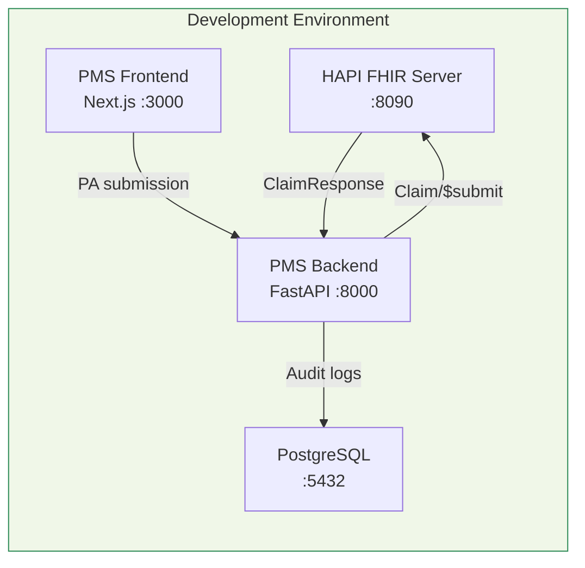

# FHIR Prior Authorization API Setup Guide for PMS Integration

**Document ID:** PMS-EXP-FHIRPA-001
**Version:** 1.0
**Date:** 2026-03-07
**Applies To:** PMS project (all platforms)
**Prerequisites Level:** Intermediate

---

## Table of Contents

1. [Overview](#1-overview)
2. [Prerequisites](#2-prerequisites)
3. [Part A: Deploy HAPI FHIR Test Server](#3-part-a-deploy-hapi-fhir-test-server)
4. [Part B: Install Python FHIR Libraries](#4-part-b-install-python-fhir-libraries)
5. [Part C: Build FHIR PA Client](#5-part-c-build-fhir-pa-client)
6. [Part D: Integrate with PMS Backend](#6-part-d-integrate-with-pms-backend)
7. [Part E: Integrate with PMS Frontend](#7-part-e-integrate-with-pms-frontend)
8. [Part F: Testing and Verification](#8-part-f-testing-and-verification)
9. [Troubleshooting](#9-troubleshooting)
10. [Reference Commands](#10-reference-commands)

---

## 1. Overview

This guide walks you through setting up the FHIR Prior Authorization API integration for the PMS. By the end, you will have:

- A local HAPI FHIR R4 server running in Docker (simulating payer FHIR endpoints)
- Python FHIR libraries (`fhir.resources`, `fhirpy`) installed and configured
- A PAS Bundle Builder that constructs Da Vinci-compliant PA Bundles
- A PAS Submission Client that sends `Claim/$submit` requests
- A SMART on FHIR Auth Manager for payer authentication
- FastAPI endpoints for FHIR PA operations
- A Next.js PA submission panel with FHIR status display



## 2. Prerequisites

### 2.1 Required Software

| Software | Minimum Version | Check Command |
|----------|----------------|---------------|
| Python | 3.11+ | `python --version` |
| Docker | 24.0+ | `docker --version` |
| Docker Compose | 2.20+ | `docker compose version` |
| Node.js | 18+ | `node --version` |
| PostgreSQL | 14+ | `psql --version` |
| pip | 23+ | `pip --version` |
| git | 2.40+ | `git --version` |

### 2.2 Installation of Prerequisites

If you don't have Docker installed:

```bash
# macOS
brew install --cask docker

# Linux (Ubuntu/Debian)
curl -fsSL https://get.docker.com | sh
```

### 2.3 Verify PMS Services

```bash
# Backend
curl -s http://localhost:8000/health | jq .

# Frontend
curl -s http://localhost:3000 -o /dev/null -w "%{http_code}"

# PostgreSQL
psql -h localhost -p 5432 -U pms -c "SELECT 1;"
```

All three should return successful responses.

**Checkpoint**: PMS backend, frontend, and database are running and accessible.

---

## 3. Part A: Deploy HAPI FHIR Test Server

### Step 1: Create Docker Compose File for HAPI FHIR

Create `docker/hapi-fhir/docker-compose.yml`:

```yaml
version: "3.8"
services:
  hapi-fhir:
    image: hapiproject/hapi:latest
    container_name: pms-hapi-fhir
    ports:
      - "8090:8080"
    environment:
      - hapi.fhir.server_address=http://localhost:8090/fhir
      - hapi.fhir.fhir_version=R4
      - hapi.fhir.allow_multiple_delete=true
      - hapi.fhir.allow_external_references=true
      - hapi.fhir.cors.allow_Credentials=true
      - hapi.fhir.cors.allowed_origin=*
    volumes:
      - hapi-data:/data/hapi
    healthcheck:
      test: ["CMD", "curl", "-f", "http://localhost:8080/fhir/metadata"]
      interval: 30s
      timeout: 10s
      retries: 5

volumes:
  hapi-data:
```

### Step 2: Start HAPI FHIR Server

```bash
cd docker/hapi-fhir
docker compose up -d
```

### Step 3: Verify HAPI FHIR Is Running

```bash
# Check capability statement
curl -s http://localhost:8090/fhir/metadata | jq '.fhirVersion'
# Expected: "4.0.1"

# Check server is accepting resources
curl -s http://localhost:8090/fhir/Patient | jq '.total'
# Expected: 0 (empty server)
```

### Step 4: Load Test Data

Create `scripts/load_fhir_test_data.py`:

```python
"""Load test Patient, Coverage, and Practitioner resources into HAPI FHIR."""
import httpx
import json

FHIR_BASE = "http://localhost:8090/fhir"

TEST_PATIENT = {
    "resourceType": "Patient",
    "id": "test-patient-001",
    "identifier": [
        {
            "type": {"coding": [{"system": "http://terminology.hl7.org/CodeSystem/v2-0203", "code": "MR"}]},
            "system": "http://mps-pms.example.com/patient-id",
            "value": "PAT-001"
        }
    ],
    "name": [{"family": "Smith", "given": ["John"]}],
    "gender": "male",
    "birthDate": "1955-03-15"
}

TEST_COVERAGE = {
    "resourceType": "Coverage",
    "id": "test-coverage-001",
    "status": "active",
    "type": {"coding": [{"system": "http://terminology.hl7.org/CodeSystem/v3-ActCode", "code": "HIP"}]},
    "subscriber": {"reference": "Patient/test-patient-001"},
    "beneficiary": {"reference": "Patient/test-patient-001"},
    "payor": [{"display": "UnitedHealthcare"}],
    "class": [
        {
            "type": {"coding": [{"system": "http://terminology.hl7.org/CodeSystem/coverage-class", "code": "plan"}]},
            "value": "UHC-PPO-2026"
        }
    ]
}

TEST_PRACTITIONER = {
    "resourceType": "Practitioner",
    "id": "test-practitioner-001",
    "identifier": [
        {
            "system": "http://hl7.org/fhir/sid/us-npi",
            "value": "1234567890"
        }
    ],
    "name": [{"family": "Jones", "given": ["Sarah"], "prefix": ["Dr."]}],
    "qualification": [
        {
            "code": {"coding": [{"system": "http://terminology.hl7.org/CodeSystem/v2-0360", "code": "MD"}]}
        }
    ]
}

def load_resource(resource: dict) -> None:
    resource_type = resource["resourceType"]
    resource_id = resource["id"]
    url = f"{FHIR_BASE}/{resource_type}/{resource_id}"
    resp = httpx.put(url, json=resource, headers={"Content-Type": "application/fhir+json"})
    print(f"  {resource_type}/{resource_id}: {resp.status_code}")

if __name__ == "__main__":
    print("Loading test data into HAPI FHIR...")
    load_resource(TEST_PATIENT)
    load_resource(TEST_COVERAGE)
    load_resource(TEST_PRACTITIONER)
    print("Done.")
```

```bash
python scripts/load_fhir_test_data.py
# Expected:
#   Patient/test-patient-001: 201
#   Coverage/test-coverage-001: 201
#   Practitioner/test-practitioner-001: 201
```

**Checkpoint**: HAPI FHIR R4 server is running on port 8090 with test Patient, Coverage, and Practitioner resources loaded.

---

## 4. Part B: Install Python FHIR Libraries

### Step 1: Install Dependencies

```bash
pip install fhir.resources fhirpy python-jose[cryptography] httpx
```

### Step 2: Verify Installation

```python
python -c "
from fhir.resources.R4B.claim import Claim
from fhir.resources.R4B.claimresponse import ClaimResponse
from fhir.resources.R4B.bundle import Bundle
from fhir.resources.R4B.patient import Patient
print('fhir.resources OK — Claim, ClaimResponse, Bundle, Patient available')
"
```

### Step 3: Verify FHIR Client

```python
python -c "
import asyncio
from fhirpy import AsyncFHIRClient

async def test():
    client = AsyncFHIRClient('http://localhost:8090/fhir', authorization='')
    patients = await client.resources('Patient').fetch()
    print(f'fhirpy OK — Found {len(patients)} patients')

asyncio.run(test())
"
```

**Checkpoint**: `fhir.resources` and `fhirpy` are installed. Can create FHIR resources and query the HAPI FHIR server.

---

## 5. Part C: Build FHIR PA Client

### Step 1: Create the PAS Bundle Builder

Create `app/services/fhir_pa/bundle_builder.py`:

```python
"""Build Da Vinci PAS-compliant FHIR Bundles for PA submission."""
from datetime import date, datetime
from uuid import uuid4

from fhir.resources.R4B.bundle import Bundle, BundleEntry
from fhir.resources.R4B.claim import Claim, ClaimInsurance, ClaimItem, ClaimDiagnosis
from fhir.resources.R4B.codeableconcept import CodeableConcept
from fhir.resources.R4B.coding import Coding
from fhir.resources.R4B.identifier import Identifier
from fhir.resources.R4B.period import Period
from fhir.resources.R4B.reference import Reference


def build_pas_claim(
    patient_ref: str,
    practitioner_ref: str,
    coverage_ref: str,
    procedure_code: str,
    procedure_display: str,
    diagnosis_code: str,
    diagnosis_display: str,
    service_date: date,
    quantity: int = 1,
) -> Claim:
    """Build a PAS Claim resource for prior authorization."""
    return Claim(
        resourceType="Claim",
        id=str(uuid4()),
        status="active",
        type=CodeableConcept(
            coding=[Coding(system="http://terminology.hl7.org/CodeSystem/claim-type", code="professional")]
        ),
        use="preauthorization",
        patient=Reference(reference=patient_ref),
        created=datetime.now().isoformat(),
        provider=Reference(reference=practitioner_ref),
        priority=CodeableConcept(
            coding=[Coding(system="http://terminology.hl7.org/CodeSystem/processpriority", code="normal")]
        ),
        insurance=[
            ClaimInsurance(
                sequence=1,
                focal=True,
                coverage=Reference(reference=coverage_ref),
            )
        ],
        diagnosis=[
            ClaimDiagnosis(
                sequence=1,
                diagnosisCodeableConcept=CodeableConcept(
                    coding=[Coding(system="http://hl7.org/fhir/sid/icd-10-cm", code=diagnosis_code, display=diagnosis_display)]
                ),
            )
        ],
        item=[
            ClaimItem(
                sequence=1,
                productOrService=CodeableConcept(
                    coding=[Coding(system="http://www.ama-assn.org/go/cpt", code=procedure_code, display=procedure_display)]
                ),
                servicedDate=service_date.isoformat(),
                quantity={"value": quantity},
                diagnosisSequence=[1],
            )
        ],
    )


def build_pas_bundle(
    claim: Claim,
    patient_ref: str,
    practitioner_ref: str,
    coverage_ref: str,
) -> Bundle:
    """Wrap a PAS Claim into a submission Bundle."""
    return Bundle(
        resourceType="Bundle",
        id=str(uuid4()),
        type="collection",
        timestamp=datetime.now().isoformat(),
        entry=[
            BundleEntry(
                fullUrl=f"urn:uuid:{claim.id}",
                resource=claim,
            ),
            BundleEntry(fullUrl=patient_ref, resource=None),
            BundleEntry(fullUrl=practitioner_ref, resource=None),
            BundleEntry(fullUrl=coverage_ref, resource=None),
        ],
    )
```

### Step 2: Create the PAS Submission Client

Create `app/services/fhir_pa/pas_client.py`:

```python
"""Submit PAS Bundles to payer FHIR endpoints and process ClaimResponses."""
import httpx
from fhir.resources.R4B.bundle import Bundle
from fhir.resources.R4B.claimresponse import ClaimResponse


class PASClient:
    """Client for Da Vinci PAS Claim/$submit operations."""

    def __init__(self, fhir_base_url: str, access_token: str | None = None):
        self.fhir_base_url = fhir_base_url.rstrip("/")
        self.access_token = access_token

    def _headers(self) -> dict:
        headers = {
            "Content-Type": "application/fhir+json",
            "Accept": "application/fhir+json",
        }
        if self.access_token:
            headers["Authorization"] = f"Bearer {self.access_token}"
        return headers

    async def submit(self, bundle: Bundle) -> ClaimResponse | dict:
        """Submit a PAS Bundle via Claim/$submit."""
        url = f"{self.fhir_base_url}/Claim/$submit"
        async with httpx.AsyncClient(timeout=30.0) as client:
            resp = await client.post(
                url,
                content=bundle.model_dump_json(),
                headers=self._headers(),
            )
            resp.raise_for_status()
            data = resp.json()

            if data.get("resourceType") == "ClaimResponse":
                return ClaimResponse.model_validate(data)
            if data.get("resourceType") == "Bundle":
                for entry in data.get("entry", []):
                    resource = entry.get("resource", {})
                    if resource.get("resourceType") == "ClaimResponse":
                        return ClaimResponse.model_validate(resource)
            return data

    async def inquire(self, claim_response_id: str) -> ClaimResponse | dict:
        """Poll for PA status via Claim/$inquire (for pended requests)."""
        url = f"{self.fhir_base_url}/Claim/$inquire"
        payload = {
            "resourceType": "Parameters",
            "parameter": [
                {"name": "ClaimResponseId", "valueString": claim_response_id}
            ],
        }
        async with httpx.AsyncClient(timeout=30.0) as client:
            resp = await client.post(url, json=payload, headers=self._headers())
            resp.raise_for_status()
            data = resp.json()
            if data.get("resourceType") == "ClaimResponse":
                return ClaimResponse.model_validate(data)
            return data
```

### Step 3: Create the SMART on FHIR Auth Manager

Create `app/services/fhir_pa/smart_auth.py`:

```python
"""SMART on FHIR backend service authorization (JWT assertion flow)."""
import time

import httpx
from jose import jwt


class SMARTAuthManager:
    """Manages SMART on FHIR backend service authentication."""

    def __init__(self, token_url: str, client_id: str, private_key: str, key_id: str):
        self.token_url = token_url
        self.client_id = client_id
        self.private_key = private_key
        self.key_id = key_id
        self._token: str | None = None
        self._expires_at: float = 0

    def _build_assertion(self) -> str:
        now = int(time.time())
        claims = {
            "iss": self.client_id,
            "sub": self.client_id,
            "aud": self.token_url,
            "exp": now + 300,
            "jti": f"{self.client_id}-{now}",
        }
        return jwt.encode(claims, self.private_key, algorithm="RS384", headers={"kid": self.key_id})

    async def get_token(self) -> str:
        """Get a valid access token, refreshing if expired."""
        if self._token and time.time() < self._expires_at:
            return self._token

        assertion = self._build_assertion()
        async with httpx.AsyncClient() as client:
            resp = await client.post(
                self.token_url,
                data={
                    "grant_type": "client_credentials",
                    "scope": "system/Claim.write system/ClaimResponse.read system/Coverage.read",
                    "client_assertion_type": "urn:ietf:params:oauth:client-assertion-type:jwt-bearer",
                    "client_assertion": assertion,
                },
            )
            resp.raise_for_status()
            data = resp.json()

        self._token = data["access_token"]
        self._expires_at = time.time() + data.get("expires_in", 300) - 30
        return self._token
```

**Checkpoint**: PAS Bundle Builder, Submission Client, and SMART Auth Manager are created and ready for integration.

---

## 6. Part D: Integrate with PMS Backend

### Step 1: Create PostgreSQL Tables

```sql
-- Payer FHIR capability tracking
CREATE TABLE payer_fhir_capability (
    id SERIAL PRIMARY KEY,
    payer_id VARCHAR(50) NOT NULL UNIQUE,
    payer_name VARCHAR(200) NOT NULL,
    fhir_base_url VARCHAR(500),
    token_url VARCHAR(500),
    smart_client_id VARCHAR(200),
    supports_pas BOOLEAN DEFAULT FALSE,
    supports_crd BOOLEAN DEFAULT FALSE,
    supports_dtr BOOLEAN DEFAULT FALSE,
    last_verified_at TIMESTAMPTZ,
    created_at TIMESTAMPTZ DEFAULT NOW(),
    updated_at TIMESTAMPTZ DEFAULT NOW()
);

-- FHIR PA submission audit log
CREATE TABLE fhir_pa_submissions (
    id SERIAL PRIMARY KEY,
    submission_id UUID NOT NULL UNIQUE,
    patient_id VARCHAR(50) NOT NULL,
    payer_id VARCHAR(50) NOT NULL,
    procedure_code VARCHAR(20) NOT NULL,
    diagnosis_code VARCHAR(20) NOT NULL,
    submission_path VARCHAR(10) NOT NULL CHECK (submission_path IN ('FHIR', 'X12')),
    request_bundle JSONB NOT NULL,
    response_payload JSONB,
    status VARCHAR(30),
    auth_number VARCHAR(100),
    submitted_at TIMESTAMPTZ DEFAULT NOW(),
    responded_at TIMESTAMPTZ,
    submitted_by VARCHAR(100) NOT NULL
);

-- FHIR AuditEvent log
CREATE TABLE fhir_audit_events (
    id SERIAL PRIMARY KEY,
    event_type VARCHAR(50) NOT NULL,
    action VARCHAR(10) NOT NULL,
    recorded_at TIMESTAMPTZ DEFAULT NOW(),
    user_id VARCHAR(100),
    patient_id VARCHAR(50),
    payer_id VARCHAR(50),
    fhir_resource_type VARCHAR(50),
    fhir_operation VARCHAR(50),
    outcome VARCHAR(10) NOT NULL,
    outcome_desc TEXT,
    request_url VARCHAR(500),
    audit_event_json JSONB
);

-- Indexes
CREATE INDEX idx_fhir_pa_patient ON fhir_pa_submissions(patient_id);
CREATE INDEX idx_fhir_pa_payer ON fhir_pa_submissions(payer_id);
CREATE INDEX idx_fhir_pa_status ON fhir_pa_submissions(status);
CREATE INDEX idx_fhir_audit_patient ON fhir_audit_events(patient_id);
CREATE INDEX idx_fhir_audit_recorded ON fhir_audit_events(recorded_at);
```

### Step 2: Create the PA Router

Create `app/services/fhir_pa/pa_router.py`:

```python
"""Routes PA requests to FHIR PAS or Availity X12 based on payer capability."""
from sqlalchemy import select
from sqlalchemy.ext.asyncio import AsyncSession

from app.models.payer_fhir_capability import PayerFHIRCapability


class PARouter:
    """Determine whether to use FHIR PAS or Availity X12 for a payer."""

    def __init__(self, db: AsyncSession):
        self.db = db

    async def get_submission_path(self, payer_id: str) -> str:
        """Returns 'FHIR' or 'X12' based on payer capability."""
        result = await self.db.execute(
            select(PayerFHIRCapability).where(PayerFHIRCapability.payer_id == payer_id)
        )
        capability = result.scalar_one_or_none()

        if capability and capability.supports_pas and capability.fhir_base_url:
            return "FHIR"
        return "X12"

    async def get_fhir_config(self, payer_id: str) -> dict | None:
        """Get FHIR connection details for a payer."""
        result = await self.db.execute(
            select(PayerFHIRCapability).where(PayerFHIRCapability.payer_id == payer_id)
        )
        capability = result.scalar_one_or_none()
        if not capability:
            return None
        return {
            "fhir_base_url": capability.fhir_base_url,
            "token_url": capability.token_url,
            "client_id": capability.smart_client_id,
            "supports_crd": capability.supports_crd,
            "supports_dtr": capability.supports_dtr,
        }
```

### Step 3: Create FastAPI Endpoints

Create `app/routers/fhir_pa.py`:

```python
"""FastAPI router for FHIR Prior Authorization operations."""
from datetime import date
from uuid import uuid4

from fastapi import APIRouter, Depends, HTTPException
from pydantic import BaseModel
from sqlalchemy.ext.asyncio import AsyncSession

from app.database import get_db
from app.services.fhir_pa.bundle_builder import build_pas_claim, build_pas_bundle
from app.services.fhir_pa.pa_router import PARouter
from app.services.fhir_pa.pas_client import PASClient

router = APIRouter(prefix="/api/fhir-pa", tags=["FHIR Prior Authorization"])


class PASubmissionRequest(BaseModel):
    patient_id: str
    payer_id: str
    procedure_code: str
    procedure_display: str
    diagnosis_code: str
    diagnosis_display: str
    service_date: date
    quantity: int = 1
    practitioner_npi: str


class PASubmissionResponse(BaseModel):
    submission_id: str
    submission_path: str  # "FHIR" or "X12"
    status: str
    auth_number: str | None = None
    message: str


@router.post("/submit", response_model=PASubmissionResponse)
async def submit_pa(
    request: PASubmissionRequest,
    db: AsyncSession = Depends(get_db),
):
    """Submit a prior authorization request via FHIR PAS or Availity X12."""
    pa_router = PARouter(db)
    path = await pa_router.get_submission_path(request.payer_id)

    submission_id = str(uuid4())

    if path == "FHIR":
        config = await pa_router.get_fhir_config(request.payer_id)
        if not config:
            raise HTTPException(status_code=500, detail="FHIR config not found for payer")

        claim = build_pas_claim(
            patient_ref=f"Patient/{request.patient_id}",
            practitioner_ref=f"Practitioner/{request.practitioner_npi}",
            coverage_ref=f"Coverage/{request.payer_id}-{request.patient_id}",
            procedure_code=request.procedure_code,
            procedure_display=request.procedure_display,
            diagnosis_code=request.diagnosis_code,
            diagnosis_display=request.diagnosis_display,
            service_date=request.service_date,
            quantity=request.quantity,
        )
        bundle = build_pas_bundle(
            claim=claim,
            patient_ref=f"Patient/{request.patient_id}",
            practitioner_ref=f"Practitioner/{request.practitioner_npi}",
            coverage_ref=f"Coverage/{request.payer_id}-{request.patient_id}",
        )

        pas_client = PASClient(config["fhir_base_url"])
        response = await pas_client.submit(bundle)

        status = "unknown"
        auth_number = None
        if hasattr(response, "outcome"):
            status = response.outcome
        if hasattr(response, "preAuthRef"):
            auth_number = response.preAuthRef

        return PASubmissionResponse(
            submission_id=submission_id,
            submission_path="FHIR",
            status=status,
            auth_number=auth_number,
            message="PA submitted via FHIR PAS Claim/$submit",
        )
    else:
        # Fallback to Availity X12 (Experiment 47)
        return PASubmissionResponse(
            submission_id=submission_id,
            submission_path="X12",
            status="routed_to_availity",
            message="Payer does not support FHIR PAS. Routed to Availity X12 278.",
        )


@router.get("/payer-capabilities")
async def list_payer_capabilities(db: AsyncSession = Depends(get_db)):
    """List all payers and their FHIR PA capability status."""
    from sqlalchemy import select
    from app.models.payer_fhir_capability import PayerFHIRCapability

    result = await db.execute(select(PayerFHIRCapability))
    capabilities = result.scalars().all()
    return [
        {
            "payer_id": c.payer_id,
            "payer_name": c.payer_name,
            "supports_pas": c.supports_pas,
            "supports_crd": c.supports_crd,
            "supports_dtr": c.supports_dtr,
            "fhir_base_url": c.fhir_base_url,
            "last_verified": c.last_verified_at,
        }
        for c in capabilities
    ]


@router.get("/submission/{submission_id}")
async def get_submission_status(submission_id: str, db: AsyncSession = Depends(get_db)):
    """Get the status of a PA submission."""
    from sqlalchemy import select
    from app.models.fhir_pa_submission import FHIRPASubmission

    result = await db.execute(
        select(FHIRPASubmission).where(FHIRPASubmission.submission_id == submission_id)
    )
    submission = result.scalar_one_or_none()
    if not submission:
        raise HTTPException(status_code=404, detail="Submission not found")
    return {
        "submission_id": str(submission.submission_id),
        "status": submission.status,
        "auth_number": submission.auth_number,
        "submission_path": submission.submission_path,
        "submitted_at": submission.submitted_at,
        "responded_at": submission.responded_at,
    }
```

### Step 4: Register the Router

Add to `app/main.py`:

```python
from app.routers.fhir_pa import router as fhir_pa_router

app.include_router(fhir_pa_router)
```

### Step 5: Add Environment Variables

Add to `.env`:

```bash
# FHIR PA Configuration
HAPI_FHIR_BASE_URL=http://localhost:8090/fhir
FHIR_PA_ENABLED=true

# SMART on FHIR (per-payer, example for UHC)
# UHC_FHIR_BASE_URL=https://fhir.uhc.com/r4
# UHC_FHIR_TOKEN_URL=https://fhir.uhc.com/oauth2/token
# UHC_SMART_CLIENT_ID=pms-backend-001
# UHC_SMART_PRIVATE_KEY_PATH=/secrets/uhc-smart-key.pem
```

**Checkpoint**: FastAPI endpoints created for PA submission, payer capability listing, and submission status. PA Router determines FHIR vs X12 path.

---

## 7. Part E: Integrate with PMS Frontend

### Step 1: Create the PA Submission Component

Create `components/fhir-pa/PASubmissionPanel.tsx`:

```tsx
"use client";

import { useState } from "react";

interface PASubmission {
  submission_id: string;
  submission_path: "FHIR" | "X12";
  status: string;
  auth_number: string | null;
  message: string;
}

export function PASubmissionPanel() {
  const [loading, setLoading] = useState(false);
  const [result, setResult] = useState<PASubmission | null>(null);
  const [error, setError] = useState<string | null>(null);

  async function handleSubmit(e: React.FormEvent<HTMLFormElement>) {
    e.preventDefault();
    setLoading(true);
    setError(null);

    const formData = new FormData(e.currentTarget);
    const payload = {
      patient_id: formData.get("patient_id"),
      payer_id: formData.get("payer_id"),
      procedure_code: formData.get("procedure_code"),
      procedure_display: formData.get("procedure_display"),
      diagnosis_code: formData.get("diagnosis_code"),
      diagnosis_display: formData.get("diagnosis_display"),
      service_date: formData.get("service_date"),
      quantity: Number(formData.get("quantity")) || 1,
      practitioner_npi: formData.get("practitioner_npi"),
    };

    try {
      const resp = await fetch("/api/fhir-pa/submit", {
        method: "POST",
        headers: { "Content-Type": "application/json" },
        body: JSON.stringify(payload),
      });
      if (!resp.ok) throw new Error(`HTTP ${resp.status}`);
      const data: PASubmission = await resp.json();
      setResult(data);
    } catch (err) {
      setError(err instanceof Error ? err.message : "Unknown error");
    } finally {
      setLoading(false);
    }
  }

  return (
    <div className="max-w-2xl mx-auto p-6">
      <h2 className="text-2xl font-bold mb-4">Prior Authorization Submission</h2>

      <form onSubmit={handleSubmit} className="space-y-4">
        <div className="grid grid-cols-2 gap-4">
          <input name="patient_id" placeholder="Patient ID" required className="border p-2 rounded" />
          <input name="payer_id" placeholder="Payer ID" required className="border p-2 rounded" />
          <input name="procedure_code" placeholder="CPT Code (e.g., 67028)" required className="border p-2 rounded" />
          <input name="procedure_display" placeholder="Procedure Name" required className="border p-2 rounded" />
          <input name="diagnosis_code" placeholder="ICD-10 (e.g., H35.3211)" required className="border p-2 rounded" />
          <input name="diagnosis_display" placeholder="Diagnosis Name" required className="border p-2 rounded" />
          <input name="service_date" type="date" required className="border p-2 rounded" />
          <input name="quantity" type="number" defaultValue={1} min={1} className="border p-2 rounded" />
          <input name="practitioner_npi" placeholder="Provider NPI" required className="border p-2 rounded" />
        </div>
        <button
          type="submit"
          disabled={loading}
          className="bg-blue-600 text-white px-6 py-2 rounded hover:bg-blue-700 disabled:opacity-50"
        >
          {loading ? "Submitting..." : "Submit PA"}
        </button>
      </form>

      {result && (
        <div className={`mt-6 p-4 rounded border ${result.submission_path === "FHIR" ? "border-green-500 bg-green-50" : "border-orange-500 bg-orange-50"}`}>
          <div className="flex items-center gap-2 mb-2">
            <span className={`px-2 py-0.5 text-xs font-semibold rounded ${result.submission_path === "FHIR" ? "bg-green-200 text-green-800" : "bg-orange-200 text-orange-800"}`}>
              {result.submission_path}
            </span>
            <span className="font-semibold">{result.status}</span>
          </div>
          {result.auth_number && <p>Auth #: <code>{result.auth_number}</code></p>}
          <p className="text-sm text-gray-600 mt-1">{result.message}</p>
          <p className="text-xs text-gray-400 mt-1">ID: {result.submission_id}</p>
        </div>
      )}

      {error && <div className="mt-4 p-4 bg-red-50 border border-red-500 rounded text-red-700">{error}</div>}
    </div>
  );
}
```

**Checkpoint**: Frontend PA submission panel created with FHIR/X12 path indicator and status display.

---

## 8. Part F: Testing and Verification

### Test 1: HAPI FHIR Health Check

```bash
curl -s http://localhost:8090/fhir/metadata | jq '{fhirVersion, status: .status}'
# Expected: { "fhirVersion": "4.0.1", "status": "active" }
```

### Test 2: PAS Bundle Construction

```bash
python -c "
from datetime import date
from app.services.fhir_pa.bundle_builder import build_pas_claim, build_pas_bundle

claim = build_pas_claim(
    patient_ref='Patient/test-patient-001',
    practitioner_ref='Practitioner/test-practitioner-001',
    coverage_ref='Coverage/test-coverage-001',
    procedure_code='67028',
    procedure_display='Intravitreal injection',
    diagnosis_code='H35.3211',
    diagnosis_display='Exudative AMD, right eye',
    service_date=date(2026, 3, 15),
)
bundle = build_pas_bundle(claim, 'Patient/test-patient-001', 'Practitioner/test-practitioner-001', 'Coverage/test-coverage-001')
print(f'Bundle type: {bundle.type}')
print(f'Entries: {len(bundle.entry)}')
print(f'Claim use: {claim.use}')
print(f'Procedure: {claim.item[0].productOrService.coding[0].code}')
"
# Expected:
# Bundle type: collection
# Entries: 4
# Claim use: preauthorization
# Procedure: 67028
```

### Test 3: FastAPI Endpoint

```bash
curl -s -X POST http://localhost:8000/api/fhir-pa/submit \
  -H "Content-Type: application/json" \
  -d '{
    "patient_id": "test-patient-001",
    "payer_id": "UHC",
    "procedure_code": "67028",
    "procedure_display": "Intravitreal injection",
    "diagnosis_code": "H35.3211",
    "diagnosis_display": "Exudative AMD right eye",
    "service_date": "2026-03-15",
    "quantity": 1,
    "practitioner_npi": "1234567890"
  }' | jq .
```

### Test 4: Payer Capabilities

```bash
curl -s http://localhost:8000/api/fhir-pa/payer-capabilities | jq .
```

**Checkpoint**: All tests pass. FHIR PA pipeline is functional from Bundle construction through FastAPI endpoint.

---

## 9. Troubleshooting

### HAPI FHIR Server Won't Start

**Symptom**: `docker compose up` exits immediately or container keeps restarting.

**Fix**:
```bash
docker logs pms-hapi-fhir
# Check for port conflicts
lsof -i :8090
# If port is in use, change the port in docker-compose.yml
```

### fhir.resources Import Error

**Symptom**: `ModuleNotFoundError: No module named 'fhir.resources.R4B'`

**Fix**:
```bash
pip install --upgrade fhir.resources
# For R4-specific imports, use:
from fhir.resources.R4B.claim import Claim
# NOT: from fhir.resources.claim import Claim (defaults to R5)
```

### Claim/$submit Returns 404

**Symptom**: HAPI FHIR returns 404 for `POST /fhir/Claim/$submit`.

**Fix**: HAPI FHIR JPA Server does not implement the `$submit` operation by default. For testing, POST the Claim resource directly:
```bash
curl -X POST http://localhost:8090/fhir/Claim \
  -H "Content-Type: application/fhir+json" \
  -d @claim.json
```

For full PAS workflow testing, use the [Da Vinci Reference Implementation](https://github.com/HL7-DaVinci/prior-auth).

### SMART Auth JWT Rejected

**Symptom**: 401 Unauthorized when authenticating with payer FHIR server.

**Fix**:
- Verify the `kid` in JWT header matches the key ID registered with the payer
- Check that the private key is RS384 (not RS256)
- Ensure `aud` claim matches the payer's token endpoint URL exactly
- Check clock skew: `exp` must be in the future relative to the payer's server time

### Bundle Validation Errors

**Symptom**: `fhir.resources` raises `ValidationError` when building Bundle.

**Fix**: Check that all required fields are populated. Common missing fields:
- `Claim.insurance[0].focal` must be `True`
- `Claim.priority` is required
- `Claim.created` must be ISO 8601 datetime
- `Claim.type` requires valid coding from `http://terminology.hl7.org/CodeSystem/claim-type`

---

## 10. Reference Commands

### Daily Development

```bash
# Start HAPI FHIR
docker compose -f docker/hapi-fhir/docker-compose.yml up -d

# Stop HAPI FHIR
docker compose -f docker/hapi-fhir/docker-compose.yml down

# View HAPI FHIR logs
docker logs -f pms-hapi-fhir

# Reset HAPI FHIR data
docker compose -f docker/hapi-fhir/docker-compose.yml down -v
docker compose -f docker/hapi-fhir/docker-compose.yml up -d

# Reload test data
python scripts/load_fhir_test_data.py
```

### FHIR Server Queries

```bash
# List all patients
curl -s http://localhost:8090/fhir/Patient | jq '.entry[].resource.name'

# Get capability statement
curl -s http://localhost:8090/fhir/metadata | jq '.rest[0].resource[] | select(.type=="Claim")'

# Search claims by patient
curl -s "http://localhost:8090/fhir/Claim?patient=test-patient-001" | jq .
```

### Useful URLs

| Service | URL |
|---------|-----|
| HAPI FHIR UI | http://localhost:8090 |
| HAPI FHIR API | http://localhost:8090/fhir |
| PMS Backend | http://localhost:8000 |
| PMS FHIR PA endpoints | http://localhost:8000/api/fhir-pa |
| FastAPI Swagger | http://localhost:8000/docs |

---

## Next Steps

After completing setup, proceed to the [FHIR PA Developer Tutorial](48-FHIRPriorAuth-Developer-Tutorial.md) for a hands-on walkthrough of building an end-to-end FHIR PA submission.

## Resources

- [Da Vinci PAS IG v2.1.0](https://hl7.org/fhir/us/davinci-pas/) — Official PA Support specification
- [Da Vinci CRD IG v2.1.0](https://hl7.org/fhir/us/davinci-crd/) — Coverage Requirements Discovery
- [Da Vinci DTR IG v2.1.0](https://hl7.org/fhir/us/davinci-dtr/) — Documentation Templates and Rules
- [HAPI FHIR JPA Server](https://github.com/hapifhir/hapi-fhir-jpaserver-starter) — Docker-deployable test server
- [fhir.resources on PyPI](https://pypi.org/project/fhir.resources/) — Python FHIR Pydantic models
- [Da Vinci Prior Auth Reference](https://github.com/HL7-DaVinci/prior-auth) — Reference implementation
- [SMART App Launch v2.2.0](https://www.hl7.org/fhir/smart-app-launch/) — FHIR authorization framework
- [Experiment 47: Availity API PRD](47-PRD-AvailityAPI-PMS-Integration.md) — X12 fallback path
