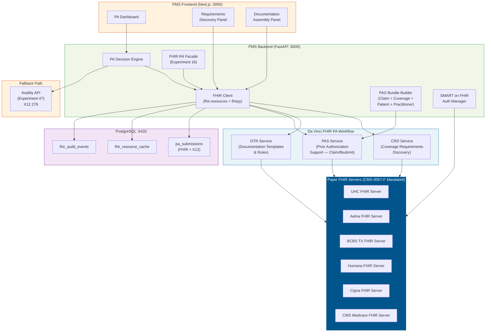
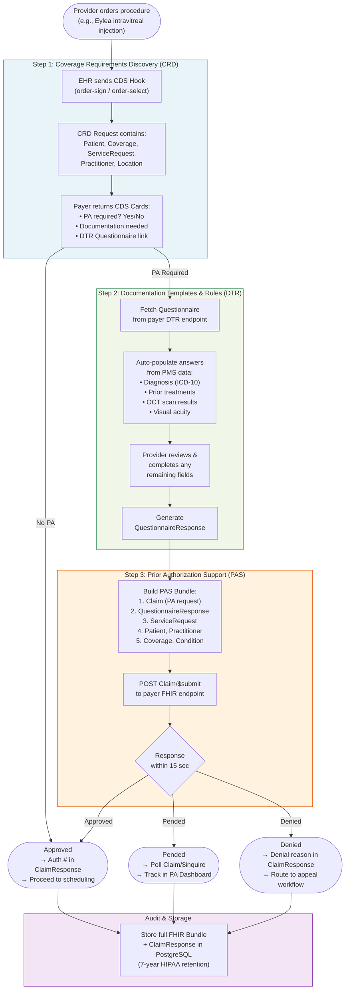

# Product Requirements Document: FHIR Prior Authorization API Integration into Patient Management System (PMS)

**Document ID:** PRD-PMS-FHIRPA-001
**Version:** 1.0
**Date:** 2026-03-07
**Author:** Ammar (CEO, MPS Inc.)
**Status:** Draft

---

## 1. Executive Summary

The CMS Interoperability and Prior Authorization Final Rule (CMS-0057-F) mandates that all Medicare Advantage organizations, Medicaid managed care plans, CHIP entities, and Qualified Health Plan issuers implement FHIR-based Prior Authorization APIs by January 1, 2027. This means every major payer that Texas Retina Associates (TRA) contracts with — UHC, Aetna, BCBS of Texas, Humana, Cigna, and CMS Medicare — will be required to expose standardized FHIR endpoints for prior authorization submission, status inquiry, and documentation requirements discovery.

The HL7 Da Vinci Implementation Guides define the three-step FHIR PA workflow: **Coverage Requirements Discovery (CRD)** tells the provider whether PA is needed and what documentation is required; **Documentation Templates and Rules (DTR)** auto-populates the required documentation from the EHR; and **Prior Authorization Support (PAS)** submits the PA request as a FHIR Bundle via the `Claim/$submit` operation and returns a real-time `ClaimResponse` within 15 seconds. Together, these replace fax, phone, and portal-based PA workflows with a single, standards-based API exchange.

For the PMS, FHIR PA APIs represent the next evolution beyond Experiment 47 (Availity). While Availity wraps X12 278 transactions in JSON REST calls through a clearinghouse intermediary, FHIR PA APIs enable **direct payer-to-provider** communication using native FHIR resources (`Claim`, `ClaimResponse`, `Coverage`, `CoverageEligibilityRequest`). CMS has explicitly stated that payers using an all-FHIR-based PA API will not be enforced against under HIPAA Administrative Simplification for X12 278 — signaling that FHIR will eventually replace X12 for PA transactions. Building FHIR PA support now positions the PMS to consume these payer APIs as they come online in 2027, while maintaining Availity as a fallback for payers that are slow to comply.

## 2. Problem Statement

Even with Availity (Experiment 47) providing multi-payer PA submission today, the PMS faces forward-looking challenges:

- **X12 278 is a 25-year-old standard**: Availity's Service Reviews API wraps X12 278 transactions. These are flat, positional data formats that cannot express complex clinical documentation (imaging results, lab values, clinical notes) needed for PA decisions. Payers frequently request additional documentation via fax or portal upload — outside the X12 workflow.
- **No documentation requirements discovery**: The PMS currently relies on static payer policy PDFs (Experiment 44) to determine what documentation a payer needs. There is no real-time API to ask a payer "what do you need for this PA?" CRD solves this.
- **No automated documentation assembly**: When a payer requires supporting documentation (e.g., OCT scan results, visual acuity, prior treatment history), staff manually compile and attach documents. DTR automates this by pulling data directly from the EHR into payer-defined templates.
- **No real-time PA decisions**: X12 278 responses are often asynchronous (pend, then poll). The Da Vinci PAS specification targets synchronous responses within 15 seconds, enabling point-of-care PA decisions.
- **Regulatory mandate**: By January 2027, all impacted payers must expose FHIR PA APIs. The PMS needs to be ready to consume them. Faster PA turnaround requirements already took effect January 1, 2026 (72 hours expedited, 7 calendar days standard).
- **No FHIR-native PA path**: Experiment 16 built a FHIR R4 Facade for general interoperability but did not implement the Da Vinci PA-specific profiles (`PASClaim`, `PASClaimResponse`, `PASBundle`).

## 3. Proposed Solution

### 3.1 Architecture Overview

### 3.2 FHIR PA Workflow (Da Vinci CRD → DTR → PAS)

### 3.3 Deployment Model

- **No new infrastructure for payer FHIR endpoints**: Payers host their own FHIR servers (mandated by CMS-0057-F). The PMS is a FHIR client.
- **HAPI FHIR Test Server**: For development and testing, deploy a local HAPI FHIR R4 server via Docker (`hapiproject/hapi:latest` on port 8090) to simulate payer endpoints.
- **Da Vinci Reference Implementation**: The [HL7-DaVinci/prior-auth](https://github.com/HL7-DaVinci/prior-auth) GitHub repo provides a reference server for testing PAS workflows.
- **SMART on FHIR Authentication**: Each payer's FHIR server requires SMART on FHIR (OAuth 2.0) authentication. The PMS must register as a SMART backend service with each payer.
- **Dual-path routing**: The PA Decision Engine routes PA requests to FHIR PAS when the payer supports it, falling back to Availity X12 278 (Experiment 47) when the payer does not yet have a FHIR endpoint.
- **HIPAA**: All FHIR exchanges contain PHI. TLS 1.2+ required. FHIR AuditEvent resources logged for every transaction. BAA required with each payer.

## 4. PMS Data Sources

| PMS API | Endpoint | FHIR Resource Mapping | Interaction |
|---------|----------|----------------------|-------------|
| Patient Records | `/api/patients` | `Patient`, `Coverage` | Map patient demographics and insurance to FHIR Patient and Coverage resources for PA Bundles |
| Encounter Records | `/api/encounters` | `Encounter`, `Condition`, `ServiceRequest` | Map procedures (CPT/HCPCS), diagnoses (ICD-10), and service requests to FHIR resources |
| Prescription API | `/api/prescriptions` | `MedicationRequest` | Map drug HCPCS codes to FHIR MedicationRequest for Part B drug PA |
| Reporting API | `/api/reports` | `AuditEvent`, `Bundle` | Track FHIR PA metrics: submission count, approval rate, turnaround time by payer |
| FHIR Facade | `/fhir/r4/*` | All mapped resources | Experiment 16 facade provides FHIR-native access to PMS data for Bundle construction |

## 5. Component/Module Definitions

### 5.1 SMART on FHIR Auth Manager

- **Description**: Manages OAuth 2.0 backend service authentication with each payer's FHIR server using SMART on FHIR scopes. Supports asymmetric key authentication (JWT assertion with RS384).
- **Input**: Payer FHIR base URL, client_id, private key (RS384).
- **Output**: Bearer access token with FHIR scopes (e.g., `system/Claim.write`, `system/ClaimResponse.read`).
- **Token storage**: In-memory with TTL-based refresh. Private keys stored in environment variables, never persisted to disk.

### 5.2 CRD Client (Coverage Requirements Discovery)

- **Description**: Sends CDS Hooks to payer CRD endpoints to discover whether PA is required for a given order and what documentation the payer needs.
- **Input**: Patient, Coverage, ServiceRequest (procedure + diagnosis), Practitioner, Location.
- **Output**: CDS Cards indicating: PA required (yes/no), documentation requirements, link to DTR Questionnaire.
- **Endpoint**: Payer-specific CRD endpoint (discovered via payer FHIR capability statement).
- **PMS APIs used**: `/api/patients` (demographics, insurance), `/api/encounters` (procedure, diagnosis).

### 5.3 DTR Client (Documentation Templates & Rules)

- **Description**: Fetches payer-defined Questionnaires and auto-populates answers from PMS clinical data. Generates a QuestionnaireResponse for inclusion in the PAS Bundle.
- **Input**: Questionnaire URL (from CRD response), patient context.
- **Output**: Completed QuestionnaireResponse with auto-populated clinical data and provider-reviewed answers.
- **Auto-population sources**: OCT scan results, visual acuity measurements, prior injection history, diagnosis dates, treatment history — all from PMS encounter records.
- **PMS APIs used**: `/api/encounters` (clinical data), `/api/prescriptions` (medication history).

### 5.4 PAS Bundle Builder

- **Description**: Constructs a Da Vinci PAS-compliant FHIR Bundle for PA submission. The Bundle includes a PAS Claim, QuestionnaireResponse, ServiceRequest, Patient, Practitioner, Coverage, and supporting Condition/Observation resources.
- **Input**: Patient record, encounter data, Coverage, QuestionnaireResponse (from DTR), procedure details.
- **Output**: FHIR Bundle (JSON) conforming to Da Vinci PAS IG v2.1.0 profiles.
- **Validation**: Uses `fhir.resources` Pydantic models to validate all resources before submission.

### 5.5 PAS Submission Client

- **Description**: Submits the PAS Bundle to the payer's FHIR endpoint via `POST [base]/Claim/$submit` and processes the ClaimResponse.
- **Input**: PAS Bundle (from Bundle Builder).
- **Output**: ClaimResponse containing: authorization number, approval/denial/pend status, denial reasons, review action codes.
- **Timing**: Synchronous response expected within 15 seconds per Da Vinci PAS spec.
- **Polling**: If response is pended, poll via `POST [base]/Claim/$inquire` at configurable intervals.

### 5.6 PA Router (FHIR vs Availity)

- **Description**: Routes PA requests to the appropriate submission path based on payer FHIR readiness.
- **Input**: Payer ID, PA request data.
- **Output**: Routes to PAS (FHIR) or Availity (X12 278).
- **Logic**: Maintains a `payer_fhir_capability` table in PostgreSQL that tracks which payers have active FHIR PAS endpoints. Updated quarterly or when payer announces FHIR availability.

### 5.7 FHIR Audit Logger

- **Description**: Creates FHIR AuditEvent resources for every PA transaction (CRD query, DTR fetch, PAS submission, status inquiry). Stores in PostgreSQL with 7-year retention.
- **Input**: Transaction type, user, patient, payer, timestamp, outcome.
- **Output**: FHIR AuditEvent resource persisted to `fhir_audit_events` table.

## 6. Non-Functional Requirements

### 6.1 Security and HIPAA Compliance

- **SMART on FHIR**: All payer FHIR connections use SMART backend service authorization (OAuth 2.0 + JWT assertion). No username/password authentication.
- **TLS 1.2+**: All FHIR API calls over HTTPS. Certificate pinning for production payer endpoints.
- **PHI in FHIR Bundles**: PA Bundles contain full patient demographics, diagnoses, procedures, and clinical documentation. Encrypt at rest (AES-256) in PostgreSQL. Encrypt in transit (TLS).
- **Audit logging**: Every FHIR transaction logged as AuditEvent. Include: who (user), what (resource type + operation), when (timestamp), where (payer endpoint), why (PA submission), outcome (success/failure).
- **Key management**: SMART on FHIR private keys (RS384) stored in environment variables or secrets manager. Rotated annually. Never committed to source control.
- **Consent**: Patient consent tracked via FHIR Consent resource before sharing clinical data with payers.

### 6.2 Performance

| Metric | Target |
|--------|--------|
| CRD hook response | < 3 seconds |
| DTR Questionnaire fetch + auto-populate | < 5 seconds |
| PAS Bundle construction | < 2 seconds |
| PAS $submit round-trip | < 15 seconds (per Da Vinci spec) |
| End-to-end PA submission (CRD → DTR → PAS) | < 30 seconds |
| FHIR resource validation (fhir.resources) | < 500ms per Bundle |

### 6.3 Infrastructure

- **HAPI FHIR Test Server**: Docker container (`hapiproject/hapi:latest`) on port 8090 for local development.
- **PostgreSQL**: Existing instance. New tables: `payer_fhir_capability`, `fhir_resource_cache`, `fhir_audit_events`.
- **Python dependencies**: `fhir.resources` (Pydantic FHIR models), `fhirpy` (FHIR client), `python-jose` (JWT for SMART auth), `httpx` (async HTTP).
- **No additional infrastructure**: PMS is a FHIR client; payers host FHIR servers.

## 7. Implementation Phases

### Phase 1: FHIR PA Client Foundation (Sprint 1 — 2 weeks)

- Deploy HAPI FHIR test server via Docker
- Implement SMART on FHIR Auth Manager (JWT assertion flow)
- Build PAS Bundle Builder with `fhir.resources` Pydantic models
- Build PAS Submission Client (`Claim/$submit` + `Claim/$inquire`)
- Create `payer_fhir_capability` table and PA Router
- Test against Da Vinci reference implementation

### Phase 2: CRD + DTR Integration (Sprint 2 — 2 weeks)

- Implement CRD Client (CDS Hooks integration)
- Implement DTR Client (Questionnaire fetch + auto-population)
- Build Requirements Discovery Panel on frontend
- Build Documentation Assembly Panel on frontend
- Integrate CRD → DTR → PAS end-to-end workflow
- Map PMS clinical data to DTR auto-population sources

### Phase 3: Production Payer Onboarding (Sprint 3 — 2 weeks)

- Register as SMART backend service with first payer (likely UHC or Aetna)
- Validate PAS Bundle against production payer FHIR server
- Implement dual-path routing (FHIR PAS vs Availity X12)
- Build unified PA Dashboard showing both FHIR and X12 submissions
- FHIR AuditEvent logging with 7-year retention
- Production readiness review and BAA verification

## 8. Success Metrics

| Metric | Target | Measurement |
|--------|--------|-------------|
| FHIR PAS submission success rate | > 95% | ClaimResponse outcome tracking |
| End-to-end PA time (CRD → PAS) | < 30 seconds | Timestamp delta logging |
| Auto-population rate (DTR) | > 80% of fields | QuestionnaireResponse field completion tracking |
| Payer FHIR adoption coverage | 6 payers by Q2 2027 | `payer_fhir_capability` table |
| X12 278 fallback rate | < 20% by Q4 2027 | PA Router routing logs |
| Additional documentation requests | -60% vs X12 path | Pend rate comparison |

## 9. Risks and Mitigations

| Risk | Impact | Mitigation |
|------|--------|------------|
| Payers miss January 2027 FHIR deadline | Cannot use FHIR PA for non-compliant payers | Maintain Availity X12 278 fallback (Experiment 47). PA Router handles dual-path |
| SMART on FHIR registration complexity | Each payer has different registration process | Build reusable SMART auth module. Track payer onboarding status in database |
| Da Vinci PAS profile variations between payers | Bundle validation failures | Use Configurations API (Availity) or payer capability statements to detect variations |
| PAS $submit timeout (> 15 seconds) | Degrades provider experience | Implement async fallback: submit, show pending, poll with `$inquire` |
| DTR Questionnaire complexity | Some payers may require extensive manual input | Maximize auto-population from PMS data. Track coverage rate per payer |
| FHIR R6 migration | R4 profiles may become deprecated | Da Vinci PAS v2.1.0 is based on R4. R6 expected late 2026 but R4 support guaranteed |
| Testing without production payer endpoints | Cannot validate real payer behavior | Use HAPI FHIR + Da Vinci reference implementation. ONC provides test tools |

## 10. Dependencies

| Dependency | Type | Notes |
|------------|------|-------|
| CMS-0057-F compliance by payers | Regulatory | Payers must implement FHIR PA APIs by January 2027 |
| Da Vinci PAS IG v2.1.0 | Standard | Published by HL7. Defines PAS profiles and operations |
| Da Vinci CRD IG v2.1.0 | Standard | Defines CDS Hooks for coverage requirements discovery |
| Da Vinci DTR IG v2.1.0 | Standard | Defines Questionnaire-based documentation templates |
| `fhir.resources` | Python library | Pydantic models for FHIR R4 resources (PyPI) |
| `fhirpy` | Python library | Async FHIR client for Python |
| `python-jose` | Python library | JWT creation for SMART on FHIR auth |
| HAPI FHIR Server | Docker | Test server for local development (`hapiproject/hapi:latest`) |
| Da Vinci Reference Implementation | GitHub | [HL7-DaVinci/prior-auth](https://github.com/HL7-DaVinci/prior-auth) |
| Experiment 16 (FHIR Facade) | Internal | Provides FHIR R4 resource mappings for PMS data |
| Experiment 47 (Availity) | Internal | X12 278 fallback path for non-FHIR payers |
| Experiment 44 (Payer Policy PDFs) | Internal | Static PA rules as fallback when CRD is unavailable |
| PostgreSQL 14+ | Infrastructure | Already deployed in PMS |
| FastAPI | Framework | Already deployed in PMS |

## 11. Comparison with Existing Experiments

| Aspect | Exp 16 (FHIR Facade) | Exp 44 (Payer PDFs) | Exp 47 (Availity) | Exp 48 (FHIR PA APIs) |
|--------|----------------------|--------------------|--------------------|----------------------|
| **Focus** | General interoperability | Static PA rules | Multi-payer clearinghouse | **FHIR PA workflow (CRD/DTR/PAS)** |
| **Standard** | FHIR R4 (generic) | None (PDF scraping) | X12 278 over REST | **Da Vinci PAS/CRD/DTR** |
| **PA submission** | No | No | Yes (X12 278) | **Yes (FHIR Claim/$submit)** |
| **Documentation discovery** | No | Manual PDF review | No | **Yes (CRD CDS Hooks)** |
| **Auto-documentation** | No | No | No | **Yes (DTR Questionnaire)** |
| **Real-time decisions** | No | No | Async (poll) | **Sync (< 15 sec)** |
| **Payer connection** | Via intermediary | None | Via Availity clearinghouse | **Direct payer FHIR server** |
| **Regulatory driver** | General interop | None | Industry practice | **CMS-0057-F mandate** |
| **Timeline** | Available now | Available now | Available now | **Payers required by Jan 2027** |

**Key relationship**: Experiment 48 is the forward-looking replacement for Experiment 47's PA submission path. As payers implement FHIR PA APIs (mandated by CMS-0057-F), the PMS will route PA requests through FHIR PAS instead of Availity X12 278. Experiment 47 remains as the fallback for payers that haven't yet deployed FHIR endpoints. Experiment 16's FHIR Facade provides the resource mappings that Experiment 48 uses to build PAS Bundles from PMS data.

## 12. Research Sources

**Official Standards:**
- [Da Vinci PAS IG v2.1.0](https://hl7.org/fhir/us/davinci-pas/) — Prior Authorization Support FHIR Implementation Guide
- [Da Vinci CRD IG v2.1.0](https://hl7.org/fhir/us/davinci-crd/) — Coverage Requirements Discovery specification
- [Da Vinci DTR IG v2.1.0](https://hl7.org/fhir/us/davinci-dtr/) — Documentation Templates and Rules specification
- [FHIR R4 Claim/$submit Operation](https://hl7.org/fhir/R4/operation-claim-submit.html) — FHIR base operation definition

**Regulatory:**
- [CMS-0057-F Fact Sheet](https://www.cms.gov/newsroom/fact-sheets/cms-interoperability-and-prior-authorization-final-rule-cms-0057-f) — Final rule overview and compliance dates
- [CMS-0057-F Decoded: Must-have APIs for 2026-2027](https://fire.ly/blog/cms-0057-f-decoded-must-have-apis-vs-nice-to-have-igs-for-2026-2027/) — Practical compliance guidance

**Implementation:**
- [fhir.resources on PyPI](https://pypi.org/project/fhir.resources/) — Pydantic FHIR models for Python
- [HAPI FHIR JPA Server Starter](https://github.com/hapifhir/hapi-fhir-jpaserver-starter) — Docker-deployable FHIR test server
- [Da Vinci Prior Auth Reference Implementation](https://github.com/HL7-DaVinci/prior-auth) — Reference server for testing PAS workflows
- [FHIR Integration with FastAPI](https://dev.to/wellallytech/fhir-integration-build-modern-healthcare-apps-using-python-and-fastapi-5cdf) — Python/FastAPI FHIR integration patterns

**Ecosystem:**
- [Availity End-to-End PA Using FHIR APIs](https://www.availity.com/case-studies/end-to-end-prior-authorizations-using-fhir-apis/) — Availity's FHIR PA case study
- [SMART App Launch v2.2.0](https://www.hl7.org/fhir/smart-app-launch/) — OAuth 2.0 authorization framework for FHIR

## 13. Appendix: Related Documents

- [FHIR PA Setup Guide](48-FHIRPriorAuth-PMS-Developer-Setup-Guide.md)
- [FHIR PA Developer Tutorial](48-FHIRPriorAuth-Developer-Tutorial.md)
- [Experiment 16: FHIR Facade PRD](16-PRD-FHIR-PMS-Integration.md)
- [Experiment 47: Availity API PRD](47-PRD-AvailityAPI-PMS-Integration.md)
- [Experiment 44: Payer Policy Download PRD](44-PRD-PayerPolicyDownload-PMS-Integration.md)
- [Experiment 45: CMS Coverage API PRD](45-PRD-CMSCoverageAPI-PMS-Integration.md)
- [Experiment 46: UHC API Marketplace PRD](46-PRD-UHCAPIMarketplace-PMS-Integration.md)
