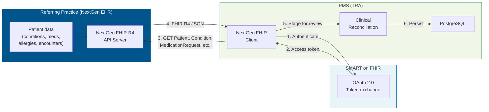
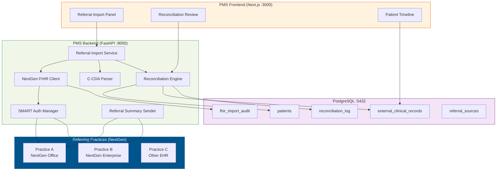

# NextGen FHIR API Developer Onboarding Tutorial

**Welcome to the MPS PMS NextGen FHIR Integration Team**

This tutorial will take you from zero to importing your first referral patient record from a NextGen-based practice into the PMS. By the end, you will understand how NextGen's FHIR API works, have imported clinical data (conditions, medications, allergies, encounters), and built a clinical reconciliation workflow.

**Document ID:** PMS-EXP-NEXTGENFHIR-002
**Version:** 1.0
**Date:** 2026-03-07
**Applies To:** PMS project (all platforms)
**Prerequisite:** [NextGen FHIR Setup Guide](49-NextGenFHIRAPI-PMS-Developer-Setup-Guide.md)
**Estimated time:** 2-3 hours
**Difficulty:** Beginner-friendly

---

## What You Will Learn

1. Why NextGen FHIR integration matters for TRA (50%+ ophthalmology EHR market share)
2. How SMART on FHIR authentication works for backend service access
3. How to query NextGen's FHIR R4 Patient Access API
4. How to pull a patient's complete clinical record (7 resource types)
5. How to parse FHIR resources into PMS-compatible data models
6. How to detect and resolve clinical data conflicts during reconciliation
7. How to build a merged patient timeline from PMS + external records
8. How to audit FHIR imports for HIPAA compliance
9. How this integrates with Experiments 16, 48 (FHIR outbound + PA)
10. How to send encounter summaries back to the referring provider

---

## Part 1: Understanding NextGen FHIR API (15 min read)

### 1.1 What Problem Does NextGen FHIR Solve?

When TRA receives a new patient referral from an ophthalmologist or optometrist, the clinical history arrives as:
- Faxed paper records (most common)
- PDF attachments via secure email
- Verbal summaries over the phone

Staff manually re-enters this data: diagnoses, medications, allergies, prior treatments, imaging history. This takes **10-20 minutes per referral** and introduces transcription errors. The retina specialist may start the first visit without knowing about:
- Prior anti-VEGF treatments at another practice
- Glaucoma medications that affect IOP during intravitreal injections
- Drug allergies that contraindicate certain agents
- Systemic conditions (diabetes, hypertension) affecting treatment decisions

**NextGen has 50%+ market share in ophthalmology.** This means a large portion of TRA's referrals come from NextGen practices. By integrating with NextGen's FHIR R4 API, the PMS can electronically pull the patient's complete record from the referring provider — instantly, accurately, and without manual data entry.

### 1.2 How NextGen FHIR Works — The Key Pieces



**Three concepts:**

1. **SMART on FHIR Auth**: OAuth 2.0-based authorization. The PMS registers as a SMART backend service with the referring practice's NextGen system. No patient interaction required for provider-initiated imports.

2. **FHIR R4 Resources**: Standardized data models. `Patient` = demographics, `Condition` = diagnoses, `MedicationRequest` = prescriptions, `AllergyIntolerance` = allergies, `Encounter` = visits, `Observation` = vitals/labs.

3. **Clinical Reconciliation**: Imported data must be compared with existing PMS records. Auto-merge when no conflicts; queue for provider review when conflicts exist (e.g., different active medication lists).

### 1.3 How NextGen FHIR Fits with Other PMS Technologies

| Technology | Experiment | Data Direction | Role |
|-----------|-----------|---------------|------|
| FHIR Facade | Exp 16 | PMS → External | Expose PMS data to external systems |
| Availity API | Exp 47 | PMS → Payers | PA submission via X12 clearinghouse |
| FHIR PA APIs | Exp 48 | PMS → Payers | PA submission via FHIR (CRD/DTR/PAS) |
| **NextGen FHIR** | **Exp 49** | **External → PMS** | **Import referral data from referring providers** |

### 1.4 Key Vocabulary

| Term | Meaning |
|------|---------|
| **NextGen Enterprise** | Server-based EHR product (larger practices) |
| **NextGen Office** | Cloud-based EHR product (smaller practices) |
| **USCDI** | US Core Data for Interoperability — minimum dataset all EHRs must share |
| **Patient Access API** | FHIR R4 API for reading patient clinical data (free, no contract required) |
| **Bulk FHIR API** | API for exporting data for multiple patients at once ($export operation) |
| **SMART App Launch** | OAuth 2.0 authorization framework for FHIR servers |
| **C-CDA** | Consolidated Clinical Document Architecture — XML document format for clinical summaries |
| **Clinical Reconciliation** | Process of merging imported data with existing records, resolving conflicts |
| **Referring Provider** | The ophthalmologist/optometrist who sends the patient to TRA |
| **fhir.resources** | Python library providing Pydantic models for all FHIR R4 resources |
| **Mirth Connect** | NextGen's integration engine for HL7/FHIR message routing |
| **MRN** | Medical Record Number — patient identifier within a specific practice |

### 1.5 Our Architecture



---

## Part 2: Environment Verification (15 min)

### 2.1 Checklist

1. **Python FHIR libraries installed**
   ```bash
   python -c "from fhir.resources.R4B.patient import Patient; print('OK')"
   ```

2. **HAPI FHIR test server running** (simulates NextGen)
   ```bash
   curl -s http://localhost:8090/fhir/metadata | jq '.fhirVersion'
   # Expected: "4.0.1"
   ```

3. **Test data loaded**
   ```bash
   curl -s http://localhost:8090/fhir/Patient/test-patient-001 | jq '.name[0]'
   # Expected: { "family": "Smith", "given": ["John"] }
   ```

4. **PMS backend running**
   ```bash
   curl -s http://localhost:8000/health | jq .
   ```

### 2.2 Quick Test

```bash
curl -s -X POST http://localhost:8000/api/nextgen/import-referral \
  -H "Content-Type: application/json" \
  -d '{
    "patient_id": "test-patient-001",
    "referring_practice": "Smith Eye Care Associates",
    "fhir_base_url": "http://localhost:8090/fhir"
  }' | jq .
```

---

## Part 3: Build Your First Referral Import (45 min)

### 3.1 What We Are Building

A standalone Python script that simulates a complete referral import:
1. Creates realistic ophthalmology patient data in the FHIR server
2. Pulls the full clinical record
3. Displays the imported data in a clinical summary format
4. Demonstrates the reconciliation process

### 3.2 Create the Tutorial Script

Create `scripts/nextgen_referral_tutorial.py`:

```python
"""
NextGen FHIR Referral Import Tutorial

Simulates importing a referral patient's clinical record from a
NextGen-based ophthalmology practice into the PMS.
"""
import httpx
import json
from datetime import date

FHIR_BASE = "http://localhost:8090/fhir"

# ── Step 1: Create a realistic ophthalmology referral ─────────────
print("=" * 60)
print("NextGen FHIR Referral Import Tutorial")
print("=" * 60)
print()
print("Scenario: Dr. Miller at Smith Eye Care (NextGen Office)")
print("is referring patient Maria Garcia to TRA for retina evaluation.")
print()

# Patient
patient = {
    "resourceType": "Patient",
    "id": "ref-patient-garcia",
    "identifier": [
        {"system": "http://smitheyecare.example.com/mrn", "value": "SEC-2024-4521"},
        {"system": "http://uhc.com/member-id", "value": "UHC-555123456"}
    ],
    "name": [{"family": "Garcia", "given": ["Maria", "Elena"]}],
    "gender": "female",
    "birthDate": "1962-08-22",
    "address": [{"city": "Dallas", "state": "TX", "postalCode": "75201"}],
    "telecom": [{"system": "phone", "value": "214-555-0199"}]
}

# Conditions (referring provider's problem list)
conditions = [
    {
        "resourceType": "Condition",
        "id": "ref-cond-amd",
        "clinicalStatus": {"coding": [{"system": "http://terminology.hl7.org/CodeSystem/condition-clinical", "code": "active"}]},
        "verificationStatus": {"coding": [{"system": "http://terminology.hl7.org/CodeSystem/condition-ver-status", "code": "confirmed"}]},
        "code": {"coding": [{"system": "http://hl7.org/fhir/sid/icd-10-cm", "code": "H35.3211", "display": "Exudative age-related macular degeneration, right eye"}]},
        "subject": {"reference": "Patient/ref-patient-garcia"},
        "onsetDateTime": "2025-11-15"
    },
    {
        "resourceType": "Condition",
        "id": "ref-cond-diabetes",
        "clinicalStatus": {"coding": [{"system": "http://terminology.hl7.org/CodeSystem/condition-clinical", "code": "active"}]},
        "verificationStatus": {"coding": [{"system": "http://terminology.hl7.org/CodeSystem/condition-ver-status", "code": "confirmed"}]},
        "code": {"coding": [{"system": "http://hl7.org/fhir/sid/icd-10-cm", "code": "E11.9", "display": "Type 2 diabetes mellitus without complications"}]},
        "subject": {"reference": "Patient/ref-patient-garcia"},
        "onsetDateTime": "2018-03-01"
    },
    {
        "resourceType": "Condition",
        "id": "ref-cond-htn",
        "clinicalStatus": {"coding": [{"system": "http://terminology.hl7.org/CodeSystem/condition-clinical", "code": "active"}]},
        "verificationStatus": {"coding": [{"system": "http://terminology.hl7.org/CodeSystem/condition-ver-status", "code": "confirmed"}]},
        "code": {"coding": [{"system": "http://hl7.org/fhir/sid/icd-10-cm", "code": "I10", "display": "Essential (primary) hypertension"}]},
        "subject": {"reference": "Patient/ref-patient-garcia"},
        "onsetDateTime": "2019-06-15"
    },
]

# Medications
medications = [
    {
        "resourceType": "MedicationRequest",
        "id": "ref-med-metformin",
        "status": "active",
        "intent": "order",
        "medicationCodeableConcept": {"coding": [{"system": "http://www.nlm.nih.gov/research/umls/rxnorm", "code": "860975", "display": "Metformin 500mg tablet"}]},
        "subject": {"reference": "Patient/ref-patient-garcia"},
        "dosageInstruction": [{"text": "500mg twice daily with meals"}]
    },
    {
        "resourceType": "MedicationRequest",
        "id": "ref-med-lisinopril",
        "status": "active",
        "intent": "order",
        "medicationCodeableConcept": {"coding": [{"system": "http://www.nlm.nih.gov/research/umls/rxnorm", "code": "314076", "display": "Lisinopril 10mg tablet"}]},
        "subject": {"reference": "Patient/ref-patient-garcia"},
        "dosageInstruction": [{"text": "10mg once daily"}]
    },
    {
        "resourceType": "MedicationRequest",
        "id": "ref-med-areds",
        "status": "active",
        "intent": "order",
        "medicationCodeableConcept": {"coding": [{"system": "http://www.nlm.nih.gov/research/umls/rxnorm", "code": "1049630", "display": "AREDS 2 supplement"}]},
        "subject": {"reference": "Patient/ref-patient-garcia"},
        "dosageInstruction": [{"text": "1 tablet daily"}]
    },
]

# Allergies
allergies = [
    {
        "resourceType": "AllergyIntolerance",
        "id": "ref-allergy-sulfa",
        "clinicalStatus": {"coding": [{"system": "http://terminology.hl7.org/CodeSystem/allergyintolerance-clinical", "code": "active"}]},
        "type": "allergy",
        "category": ["medication"],
        "code": {"coding": [{"system": "http://www.nlm.nih.gov/research/umls/rxnorm", "code": "10831", "display": "Sulfonamide antibiotics"}]},
        "patient": {"reference": "Patient/ref-patient-garcia"},
        "reaction": [{"manifestation": [{"coding": [{"display": "Skin rash"}]}]}]
    },
]

# Observations (visual acuity from referring provider)
observations = [
    {
        "resourceType": "Observation",
        "id": "ref-obs-va-od",
        "status": "final",
        "category": [{"coding": [{"system": "http://terminology.hl7.org/CodeSystem/observation-category", "code": "exam"}]}],
        "code": {"coding": [{"system": "http://loinc.org", "code": "79880-1", "display": "Visual acuity best corrected Right eye"}]},
        "subject": {"reference": "Patient/ref-patient-garcia"},
        "valueString": "20/60",
        "effectiveDateTime": "2026-02-28"
    },
    {
        "resourceType": "Observation",
        "id": "ref-obs-va-os",
        "status": "final",
        "category": [{"coding": [{"system": "http://terminology.hl7.org/CodeSystem/observation-category", "code": "exam"}]}],
        "code": {"coding": [{"system": "http://loinc.org", "code": "79881-9", "display": "Visual acuity best corrected Left eye"}]},
        "subject": {"reference": "Patient/ref-patient-garcia"},
        "valueString": "20/25",
        "effectiveDateTime": "2026-02-28"
    },
]

# ── Step 2: Load data into FHIR server ───────────────────────────
print("Step 1: Loading referral data into FHIR server...")
print(f"  (Simulating NextGen Office at Smith Eye Care)")
print()

all_resources = [patient] + conditions + medications + allergies + observations
with httpx.Client() as client:
    for r in all_resources:
        resp = client.put(
            f"{FHIR_BASE}/{r['resourceType']}/{r['id']}",
            json=r,
            headers={"Content-Type": "application/fhir+json"},
        )
        status = "loaded" if resp.status_code in (200, 201) else f"error ({resp.status_code})"
        display = r.get("code", {}).get("coding", [{}])[0].get("display", "") or r.get("medicationCodeableConcept", {}).get("coding", [{}])[0].get("display", "") or r.get("name", [{}])[0].get("family", "")
        print(f"  {r['resourceType']}/{r['id']}: {status} — {display}")

print()

# ── Step 3: Pull the clinical record (simulating PMS import) ─────
print("Step 2: Pulling clinical record from NextGen FHIR API...")
print()

with httpx.Client() as client:
    # Patient
    pat = client.get(f"{FHIR_BASE}/Patient/ref-patient-garcia").json()
    print(f"  Patient: {pat['name'][0]['given'][0]} {pat['name'][0]['family']}")
    print(f"  DOB: {pat['birthDate']}")
    print(f"  MRN: {pat['identifier'][0]['value']}")
    print(f"  Member ID: {pat['identifier'][1]['value']}")
    print()

    # Conditions
    conds = client.get(f"{FHIR_BASE}/Condition?patient=ref-patient-garcia").json()
    print(f"  Conditions ({conds.get('total', 0)}):")
    for entry in conds.get("entry", []):
        r = entry["resource"]
        code = r["code"]["coding"][0]
        print(f"    • {code['code']} — {code['display']}")
    print()

    # Medications
    meds = client.get(f"{FHIR_BASE}/MedicationRequest?patient=ref-patient-garcia&status=active").json()
    print(f"  Active Medications ({meds.get('total', 0)}):")
    for entry in meds.get("entry", []):
        r = entry["resource"]
        med = r["medicationCodeableConcept"]["coding"][0]
        dosage = r.get("dosageInstruction", [{}])[0].get("text", "")
        print(f"    • {med['display']} — {dosage}")
    print()

    # Allergies
    allerg = client.get(f"{FHIR_BASE}/AllergyIntolerance?patient=ref-patient-garcia").json()
    print(f"  Allergies ({allerg.get('total', 0)}):")
    for entry in allerg.get("entry", []):
        r = entry["resource"]
        code = r["code"]["coding"][0]
        reaction = r.get("reaction", [{}])[0].get("manifestation", [{}])[0].get("coding", [{}])[0].get("display", "unknown")
        print(f"    • {code['display']} → {reaction}")
    print()

    # Observations
    obs = client.get(f"{FHIR_BASE}/Observation?patient=ref-patient-garcia").json()
    print(f"  Observations ({obs.get('total', 0)}):")
    for entry in obs.get("entry", []):
        r = entry["resource"]
        code = r["code"]["coding"][0]
        value = r.get("valueString", "N/A")
        print(f"    • {code['display']}: {value}")

print()

# ── Step 4: Clinical Summary ─────────────────────────────────────
print("=" * 60)
print("REFERRAL CLINICAL SUMMARY")
print("=" * 60)
print()
print(f"  Patient:    Maria Elena Garcia (DOB: 1962-08-22)")
print(f"  Referring:  Dr. Miller, Smith Eye Care Associates")
print(f"  Payer:      UnitedHealthcare (UHC-555123456)")
print(f"  Reason:     Exudative AMD, right eye (H35.3211)")
print()
print("  Key Findings:")
print("    • VA OD: 20/60 (reduced — consistent with wet AMD)")
print("    • VA OS: 20/25 (normal)")
print("    • Active diabetes (E11.9) — monitor for diabetic retinopathy")
print("    • Hypertension (I10) — cardiovascular risk factor")
print("    • Sulfa allergy — note for any ophthalmic prescribing")
print("    • Already on AREDS 2 supplements")
print()
print("  Recommended: OCT macula OD, fluorescein angiography")
print("  Consider: Eylea (aflibercept) intravitreal injection OD")
print()
print("  Import Status: STAGED FOR RECONCILIATION")
print("  → Provider must review before merging into PMS record")
print("=" * 60)
```

### 3.3 Run the Tutorial

```bash
python scripts/nextgen_referral_tutorial.py
```

### 3.4 Explore the Data in HAPI FHIR UI

Open http://localhost:8090 and browse:
- **Patient** → Maria Garcia with UHC member ID
- **Condition** → AMD, diabetes, hypertension
- **MedicationRequest** → Metformin, Lisinopril, AREDS 2
- **AllergyIntolerance** → Sulfa allergy
- **Observation** → Visual acuity 20/60 OD, 20/25 OS

---

## Part 4: Evaluating Strengths and Weaknesses (15 min)

### 4.1 Strengths

- **50%+ ophthalmology market share**: Covers the largest segment of TRA's referring providers
- **Free Patient Access API**: No contract or fees for USCDI read routes
- **FHIR R4 standard**: Same resource models used across all EHR vendors
- **SMART on FHIR**: Industry-standard OAuth 2.0 authorization
- **800+ Enterprise API routes**: Deep access beyond FHIR for advanced use cases
- **Mirth Connect**: Industry-standard integration engine for complex scenarios
- **Bulk FHIR API**: Efficient batch imports for practice transitions

### 4.2 Weaknesses

- **Write access limited**: Patient Access API is read-only. Sending data back requires Enterprise API access
- **Practice-specific setup**: Each referring practice requires SMART registration
- **Sandbox limitations**: Sandbox may not fully represent production data
- **Rate limits undocumented**: No published rate limits — must test empirically
- **FHIR resource coverage varies**: Not all clinical data may be available via FHIR (some only via Enterprise API or C-CDA)
- **Mirth Connect licensing**: v4.6+ is commercial. OSS fork available but less maintained

### 4.3 When to Use NextGen FHIR vs Alternatives

| Scenario | Use NextGen FHIR (Exp 49) | Use Direct/Fax |
|----------|---------------------------|----------------|
| Referring practice uses NextGen | Yes | No |
| Referring practice uses Epic/Cerner | No (use their FHIR API) | Fallback |
| Referring practice has no FHIR | No | Yes |
| Need full clinical record import | Yes | Partial (fax) |
| Need real-time data | Yes | No |
| Practice transition (bulk) | Yes (Bulk FHIR) | Too slow |

### 4.4 HIPAA / Healthcare Considerations

- **PHI in every response**: All FHIR resources contain PHI. Encrypt in transit (TLS) and at rest (AES-256)
- **BAA required**: With NextGen and with each referring practice sharing data
- **Patient consent**: May be required depending on state law. Track consent in PMS
- **Audit everything**: Log every FHIR query, resource fetched, and reconciliation action
- **Minimum necessary**: Only pull resources needed for clinical care
- **Data provenance**: Always store the source practice and import timestamp with external records

---

## Part 5: Debugging Common Issues (15 min read)

### Issue 1: Patient Search Returns Empty

**Symptom**: `GET /Patient?name=Garcia` returns zero results.
**Cause**: Patient may use a different identifier system or name format.
**Fix**: Try multiple search strategies:
```bash
# By identifier
curl "http://localhost:8090/fhir/Patient?identifier=SEC-2024-4521"
# By name + birthdate
curl "http://localhost:8090/fhir/Patient?family=Garcia&birthdate=1962-08-22"
```

### Issue 2: MedicationRequest Missing Drug Name

**Symptom**: `medicationCodeableConcept` is null.
**Cause**: NextGen may use `medicationReference` instead, pointing to a Medication resource.
**Fix**: Check both fields and follow references if needed.

### Issue 3: Observation Values in Different Formats

**Symptom**: `valueString` is null for some observations.
**Cause**: FHIR supports multiple value types: `valueString`, `valueQuantity`, `valueCodeableConcept`.
**Fix**: Check all value fields.

### Issue 4: C-CDA Not Available

**Symptom**: `DocumentReference` search returns empty.
**Cause**: Not all practices generate C-CDA documents for every encounter.
**Fix**: Fall back to discrete FHIR resources (Condition, MedicationRequest, etc.).

### Issue 5: Token Expired Mid-Import

**Symptom**: 401 error partway through pulling multiple resources.
**Cause**: Access token expired during a long import.
**Fix**: The `NextGenSMARTAuth` class auto-refreshes. Ensure `get_token()` is called before each HTTP request.

---

## Part 6: Practice Exercises (45 min)

### Exercise A: Multi-Practice Import

Write a script that imports the same patient from two different FHIR servers (simulating two referring practices) and compares the medication lists from each. Identify:
- Medications present in both
- Medications only in Practice A
- Medications only in Practice B

### Exercise B: Clinical Reconciliation Engine

Build a reconciliation function that:
1. Accepts imported Conditions and existing PMS conditions
2. Matches by ICD-10 code
3. Auto-merges new conditions not in PMS
4. Flags conflicts (same ICD-10 but different clinical status)
5. Returns a reconciliation report

### Exercise C: Referral Summary Generator

After importing a referral, generate a formatted FHIR `DiagnosticReport` resource containing TRA's encounter findings, suitable for sending back to the referring provider.

---

## Part 7: Development Workflow and Conventions

### 7.1 File Organization

```
app/
├── services/
│   └── nextgen/
│       ├── __init__.py
│       ├── smart_auth.py           # SMART on FHIR authentication
│       ├── fhir_client.py          # NextGen FHIR R4 client
│       ├── referral_import.py      # Referral import orchestrator
│       ├── ccda_parser.py          # C-CDA document parser
│       └── reconciliation.py       # Clinical data reconciliation
├── routers/
│   └── nextgen.py                  # FastAPI endpoints
├── models/
│   ├── external_clinical_record.py # SQLAlchemy model
│   └── referral_source.py          # SQLAlchemy model
scripts/
├── nextgen_referral_tutorial.py    # This tutorial
└── load_fhir_test_data.py          # Test data (from Exp 48)
```

### 7.2 Naming Conventions

| Item | Convention | Example |
|------|-----------|---------|
| FHIR client methods | `get_{resource_type}s()` | `get_conditions()` |
| Import methods | `import_{workflow}()` | `import_referral()` |
| Database tables | `{domain}_{concept}` | `external_clinical_records` |
| Environment variables | `NEXTGEN_{SETTING}` | `NEXTGEN_FHIR_BASE_URL` |
| Test data IDs | `ref-{resource}-{name}` | `ref-patient-garcia` |

### 7.3 PR Checklist

- [ ] All imported FHIR resources validated with `fhir.resources` Pydantic models
- [ ] No PHI in logs (patient names, MRNs, member IDs must not appear in log output)
- [ ] FHIR import audit events logged for every API call
- [ ] Clinical reconciliation tested with both new and conflicting data
- [ ] SMART auth tokens never logged or persisted
- [ ] External records stored with source attribution (practice name, import timestamp)
- [ ] Error handling for FHIR server timeouts and 4xx/5xx responses

### 7.4 Security Reminders

- **Never log FHIR responses containing PHI** to console or files
- **SMART credentials** in environment variables only — never in code
- **Encrypt at rest**: All imported clinical data must be in encrypted PostgreSQL columns
- **Rate limit imports**: Prevent accidental bulk downloads that could trigger NextGen rate limits
- **Source tracking**: Every imported record must have `source_system` and `source_practice` metadata

---

## Part 8: Quick Reference Card

### Key Commands

```bash
# Run tutorial
python scripts/nextgen_referral_tutorial.py

# Import via API
curl -X POST http://localhost:8000/api/nextgen/import-referral \
  -H "Content-Type: application/json" \
  -d '{"patient_id":"ref-patient-garcia","referring_practice":"Smith Eye Care","fhir_base_url":"http://localhost:8090/fhir"}'

# Query conditions
curl http://localhost:8000/api/nextgen/patient/ref-patient-garcia/conditions

# Query medications
curl http://localhost:8000/api/nextgen/patient/ref-patient-garcia/medications
```

### Key Files

| File | Purpose |
|------|---------|
| `app/services/nextgen/fhir_client.py` | NextGen FHIR R4 client |
| `app/services/nextgen/smart_auth.py` | SMART on FHIR auth |
| `app/services/nextgen/referral_import.py` | Import orchestrator |
| `app/routers/nextgen.py` | FastAPI endpoints |

### Key URLs

| URL | Description |
|-----|-------------|
| https://www.nextgen.com/api | NextGen API portal |
| https://www.nextgen.com/developer-program | Developer registration |
| https://fhir.nextgen.com/nge/prod/fhir-api-r4/fhir/r4/ | Enterprise FHIR R4 |
| https://fhir.meditouchehr.com/api/fhir/r4 | Office FHIR R4 |
| http://localhost:8090/fhir | Local HAPI FHIR test server |
| http://localhost:8000/api/nextgen | PMS NextGen endpoints |

---

## Next Steps

1. **Run the tutorial** and explore the imported data in HAPI FHIR UI
2. **Try the practice exercises** — multi-practice import, reconciliation engine, referral summary
3. **Read the PRD** at [49-PRD-NextGenFHIRAPI-PMS-Integration.md](49-PRD-NextGenFHIRAPI-PMS-Integration.md)
4. **Review Experiment 48** (FHIR PA APIs) for the outbound FHIR workflow
5. **Register** for the NextGen Developer Program to access the real sandbox
