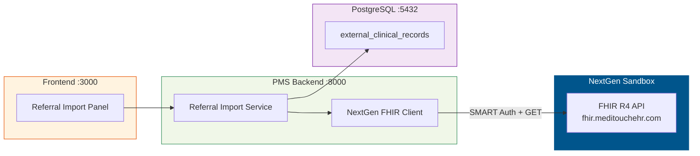

# NextGen FHIR API Setup Guide for PMS Integration

**Document ID:** PMS-EXP-NEXTGENFHIR-001
**Version:** 1.0
**Date:** 2026-03-07
**Applies To:** PMS project (all platforms)
**Prerequisites Level:** Intermediate

---

## Table of Contents

1. [Overview](#1-overview)
2. [Prerequisites](#2-prerequisites)
3. [Part A: Register with NextGen Developer Program](#3-part-a-register-with-nextgen-developer-program)
4. [Part B: Configure SMART on FHIR Authentication](#4-part-b-configure-smart-on-fhir-authentication)
5. [Part C: Build the NextGen FHIR Client](#5-part-c-build-the-nextgen-fhir-client)
6. [Part D: Integrate with PMS Backend](#6-part-d-integrate-with-pms-backend)
7. [Part E: Integrate with PMS Frontend](#7-part-e-integrate-with-pms-frontend)
8. [Part F: Testing and Verification](#8-part-f-testing-and-verification)
9. [Troubleshooting](#9-troubleshooting)
10. [Reference Commands](#10-reference-commands)

---

## 1. Overview

This guide walks you through setting up the NextGen FHIR API integration for importing referral clinical data into the PMS. By the end, you will have:

- A registered NextGen Developer Program account with sandbox credentials
- SMART on FHIR authentication configured for NextGen FHIR servers
- A NextGen FHIR Client that can pull Patient, Condition, MedicationRequest, AllergyIntolerance, Encounter, and Observation resources
- A Referral Import Service with clinical reconciliation
- FastAPI endpoints for triggering referral imports
- A Next.js Referral Import Panel



## 2. Prerequisites

### 2.1 Required Software

| Software | Minimum Version | Check Command |
|----------|----------------|---------------|
| Python | 3.11+ | `python --version` |
| Node.js | 18+ | `node --version` |
| PostgreSQL | 14+ | `psql --version` |
| pip | 23+ | `pip --version` |
| git | 2.40+ | `git --version` |
| httpx | 0.25+ | `python -c "import httpx; print(httpx.__version__)"` |

### 2.2 Installation of Prerequisites

```bash
pip install fhir.resources fhirpy httpx python-jose[cryptography] lxml
```

### 2.3 Verify PMS Services

```bash
# Backend
curl -s http://localhost:8000/health | jq .

# Frontend
curl -s http://localhost:3000 -o /dev/null -w "%{http_code}"

# PostgreSQL
psql -h localhost -p 5432 -U pms -c "SELECT 1;"
```

**Checkpoint**: PMS services running. Python FHIR libraries installed.

---

## 3. Part A: Register with NextGen Developer Program

### Test Environment Access Summary

Before diving in, here's what's available at each stage:

| Environment | Access | Cost | What You Get | Customer Needed? |
|-------------|--------|------|-------------|-----------------|
| **Local HAPI FHIR** | Self-hosted Docker | Free | Simulated FHIR R4 server with synthetic data | No |
| **NextGen Sandbox** | Developer Program registration | Free | Synthetic patient data, full FHIR R4 API, same endpoints as production | No |
| **NextGen Patient Access API (read)** | Developer Program + app approval | Free | USCDI v1 read routes on real production data | **Yes** — referring practice must authorize your SMART app |
| **NextGen Enterprise APIs (800+ routes)** | Contract with NextGen | May have fees | Full clinical/administrative API access | **Yes** — requires NextGen contract |
| **Write access (send summaries back)** | Enterprise API access | May have fees | Push encounter data to referring provider | **Yes** — requires Enterprise API contract |

**For development and testing, start with the NextGen Sandbox (free) + local HAPI FHIR (free).** No customer or referring practice access is needed until you are ready to test with real patient data in production. At that point, you would ask a friendly referring practice (one of TRA's existing referral sources running NextGen) to authorize your SMART app on their system.

### Step 1: Create Developer Account

1. Navigate to [https://www.nextgen.com/developer-program](https://www.nextgen.com/developer-program)
2. Click "Join the Developer Program"
3. Complete registration form (organization name, contact info, use case description)
4. Wait for approval email (typically 1-3 business days)

### Step 2: Register an Application

1. Log into the NextGen API Developer Portal
2. Create a new application:
   - **App Name**: `MPS PMS Referral Import`
   - **App Type**: Backend Service (for server-to-server FHIR access)
   - **Redirect URI**: `http://localhost:8000/api/nextgen/callback` (for patient-mediated flow)
   - **Scopes**: `patient/Patient.read`, `patient/Condition.read`, `patient/MedicationRequest.read`, `patient/AllergyIntolerance.read`, `patient/Encounter.read`, `patient/Observation.read`, `patient/DocumentReference.read`
3. Save your credentials:
   - `client_id`
   - `client_secret` (or upload your public key for JWT assertion)

### Step 3: Access Sandbox

Once approved, your app credentials are active for the sandbox environment:

- **NextGen Office FHIR R4**: `https://fhir.meditouchehr.com/api/fhir/r4`
- **NextGen Enterprise FHIR R4**: `https://fhir.nextgen.com/nge/prod/fhir-api-r4/fhir/r4/`

### Step 4: Verify Sandbox Access

```bash
# Test capability statement (no auth needed for metadata)
curl -s https://fhir.nextgen.com/nge/prod/fhir-api-r4/fhir/r4/metadata | jq '.fhirVersion'
# Expected: "4.0.1"
```

**Checkpoint**: Developer account registered, app created, sandbox credentials obtained, capability statement verified.

---

## 4. Part B: Configure SMART on FHIR Authentication

### Step 1: Create the SMART Auth Module

Create `app/services/nextgen/smart_auth.py`:

```python
"""SMART on FHIR authentication for NextGen FHIR servers."""
import time
from urllib.parse import urljoin

import httpx


class NextGenSMARTAuth:
    """Handles SMART on FHIR OAuth 2.0 for NextGen APIs."""

    def __init__(
        self,
        fhir_base_url: str,
        client_id: str,
        client_secret: str,
        token_url: str | None = None,
    ):
        self.fhir_base_url = fhir_base_url.rstrip("/")
        self.client_id = client_id
        self.client_secret = client_secret
        self._token_url = token_url
        self._token: str | None = None
        self._expires_at: float = 0

    async def _discover_token_url(self) -> str:
        """Discover token endpoint from FHIR server's SMART configuration."""
        if self._token_url:
            return self._token_url

        # Try .well-known/smart-configuration first
        smart_url = f"{self.fhir_base_url}/.well-known/smart-configuration"
        async with httpx.AsyncClient() as client:
            resp = await client.get(smart_url)
            if resp.status_code == 200:
                self._token_url = resp.json()["token_endpoint"]
                return self._token_url

        # Fall back to CapabilityStatement
        metadata_url = f"{self.fhir_base_url}/metadata"
        async with httpx.AsyncClient() as client:
            resp = await client.get(metadata_url)
            data = resp.json()
            for ext in data.get("rest", [{}])[0].get("security", {}).get("extension", []):
                if ext.get("url") == "http://fhir-registry.smarthealthit.org/StructureDefinition/oauth-uris":
                    for sub_ext in ext.get("extension", []):
                        if sub_ext.get("url") == "token":
                            self._token_url = sub_ext["valueUri"]
                            return self._token_url

        raise ValueError("Could not discover token URL from FHIR server")

    async def get_token(self) -> str:
        """Get a valid access token, refreshing if expired."""
        if self._token and time.time() < self._expires_at:
            return self._token

        token_url = await self._discover_token_url()

        async with httpx.AsyncClient() as client:
            resp = await client.post(
                token_url,
                data={
                    "grant_type": "client_credentials",
                    "client_id": self.client_id,
                    "client_secret": self.client_secret,
                    "scope": "system/Patient.read system/Condition.read system/MedicationRequest.read system/AllergyIntolerance.read system/Encounter.read system/Observation.read system/DocumentReference.read",
                },
            )
            resp.raise_for_status()
            data = resp.json()

        self._token = data["access_token"]
        self._expires_at = time.time() + data.get("expires_in", 300) - 30
        return self._token
```

### Step 2: Add Environment Variables

Add to `.env`:

```bash
# NextGen FHIR Configuration
NEXTGEN_FHIR_BASE_URL=https://fhir.nextgen.com/nge/prod/fhir-api-r4/fhir/r4
NEXTGEN_CLIENT_ID=your-client-id-here
NEXTGEN_CLIENT_SECRET=your-client-secret-here
# Optional: override token URL discovery
# NEXTGEN_TOKEN_URL=https://fhir.nextgen.com/nge/prod/fhir-api-r4/oauth2/token
```

**Checkpoint**: SMART on FHIR auth module created with automatic token URL discovery from FHIR server metadata.

---

## 5. Part C: Build the NextGen FHIR Client

### Step 1: Create the FHIR Client

Create `app/services/nextgen/fhir_client.py`:

```python
"""NextGen FHIR R4 Client for pulling clinical data."""
from typing import Any

import httpx
from fhir.resources.R4B.patient import Patient
from fhir.resources.R4B.condition import Condition
from fhir.resources.R4B.medicationrequest import MedicationRequest
from fhir.resources.R4B.allergyintolerance import AllergyIntolerance
from fhir.resources.R4B.encounter import Encounter
from fhir.resources.R4B.observation import Observation

from app.services.nextgen.smart_auth import NextGenSMARTAuth


class NextGenFHIRClient:
    """Client for reading clinical data from NextGen FHIR R4 endpoints."""

    RESOURCE_MODELS = {
        "Patient": Patient,
        "Condition": Condition,
        "MedicationRequest": MedicationRequest,
        "AllergyIntolerance": AllergyIntolerance,
        "Encounter": Encounter,
        "Observation": Observation,
    }

    def __init__(self, auth: NextGenSMARTAuth):
        self.auth = auth
        self.base_url = auth.fhir_base_url

    async def _get(self, path: str, params: dict | None = None) -> dict:
        token = await self.auth.get_token()
        async with httpx.AsyncClient(timeout=30.0) as client:
            resp = await client.get(
                f"{self.base_url}/{path}",
                params=params,
                headers={
                    "Authorization": f"Bearer {token}",
                    "Accept": "application/fhir+json",
                },
            )
            resp.raise_for_status()
            return resp.json()

    async def get_patient(self, patient_id: str) -> Patient:
        """Fetch a single Patient resource by ID."""
        data = await self._get(f"Patient/{patient_id}")
        return Patient.model_validate(data)

    async def search_patient(self, **params) -> list[Patient]:
        """Search for patients by parameters (name, birthdate, identifier)."""
        data = await self._get("Patient", params)
        return [Patient.model_validate(e["resource"]) for e in data.get("entry", [])]

    async def get_conditions(self, patient_id: str) -> list[Condition]:
        """Fetch all Conditions (problem list) for a patient."""
        data = await self._get("Condition", {"patient": patient_id, "_count": "100"})
        return [Condition.model_validate(e["resource"]) for e in data.get("entry", [])]

    async def get_medications(self, patient_id: str) -> list[MedicationRequest]:
        """Fetch all active MedicationRequests for a patient."""
        data = await self._get("MedicationRequest", {"patient": patient_id, "status": "active", "_count": "100"})
        return [MedicationRequest.model_validate(e["resource"]) for e in data.get("entry", [])]

    async def get_allergies(self, patient_id: str) -> list[AllergyIntolerance]:
        """Fetch all AllergyIntolerances for a patient."""
        data = await self._get("AllergyIntolerance", {"patient": patient_id, "_count": "100"})
        return [AllergyIntolerance.model_validate(e["resource"]) for e in data.get("entry", [])]

    async def get_encounters(self, patient_id: str, count: int = 20) -> list[Encounter]:
        """Fetch recent Encounters for a patient."""
        data = await self._get("Encounter", {"patient": patient_id, "_sort": "-date", "_count": str(count)})
        return [Encounter.model_validate(e["resource"]) for e in data.get("entry", [])]

    async def get_observations(self, patient_id: str, category: str | None = None) -> list[Observation]:
        """Fetch Observations (vitals, labs) for a patient."""
        params: dict[str, str] = {"patient": patient_id, "_count": "100"}
        if category:
            params["category"] = category
        data = await self._get("Observation", params)
        return [Observation.model_validate(e["resource"]) for e in data.get("entry", [])]

    async def pull_full_record(self, patient_id: str) -> dict[str, list]:
        """Pull complete clinical record for a patient."""
        return {
            "conditions": await self.get_conditions(patient_id),
            "medications": await self.get_medications(patient_id),
            "allergies": await self.get_allergies(patient_id),
            "encounters": await self.get_encounters(patient_id),
            "observations": await self.get_observations(patient_id),
        }
```

### Step 2: Create the Referral Import Service

Create `app/services/nextgen/referral_import.py`:

```python
"""Referral Import Service — orchestrates pulling data from NextGen and reconciling."""
from datetime import datetime
from uuid import uuid4

from app.services.nextgen.fhir_client import NextGenFHIRClient


class ReferralImportService:
    """Import and stage clinical data from a referring NextGen practice."""

    def __init__(self, fhir_client: NextGenFHIRClient):
        self.client = fhir_client

    async def import_referral(self, patient_id: str, referring_practice: str) -> dict:
        """Import a patient's clinical record from a NextGen practice."""
        import_id = str(uuid4())
        started_at = datetime.now()

        # Pull patient demographics
        patient = await self.client.get_patient(patient_id)

        # Pull full clinical record
        clinical_data = await self.client.pull_full_record(patient_id)

        completed_at = datetime.now()
        duration_sec = (completed_at - started_at).total_seconds()

        return {
            "import_id": import_id,
            "referring_practice": referring_practice,
            "patient": {
                "id": patient.id,
                "name": f"{patient.name[0].family}, {patient.name[0].given[0]}" if patient.name else "Unknown",
                "birth_date": str(patient.birthDate) if patient.birthDate else None,
                "gender": patient.gender,
            },
            "imported_resources": {
                "conditions": len(clinical_data["conditions"]),
                "medications": len(clinical_data["medications"]),
                "allergies": len(clinical_data["allergies"]),
                "encounters": len(clinical_data["encounters"]),
                "observations": len(clinical_data["observations"]),
            },
            "duration_seconds": round(duration_sec, 2),
            "status": "staged_for_reconciliation",
        }
```

**Checkpoint**: NextGen FHIR Client and Referral Import Service created. Can pull Patient, Condition, MedicationRequest, AllergyIntolerance, Encounter, and Observation resources.

---

## 6. Part D: Integrate with PMS Backend

### Step 1: Create PostgreSQL Tables

```sql
-- External clinical records from referring providers
CREATE TABLE external_clinical_records (
    id SERIAL PRIMARY KEY,
    import_id UUID NOT NULL,
    patient_id VARCHAR(50) NOT NULL,
    source_system VARCHAR(100) NOT NULL,
    source_practice VARCHAR(200) NOT NULL,
    resource_type VARCHAR(50) NOT NULL,
    resource_id VARCHAR(200),
    resource_json JSONB NOT NULL,
    reconciliation_status VARCHAR(30) DEFAULT 'pending'
        CHECK (reconciliation_status IN ('pending', 'auto_merged', 'conflict', 'reviewed', 'rejected')),
    reviewed_by VARCHAR(100),
    reviewed_at TIMESTAMPTZ,
    imported_at TIMESTAMPTZ DEFAULT NOW()
);

-- Reconciliation log
CREATE TABLE reconciliation_log (
    id SERIAL PRIMARY KEY,
    import_id UUID NOT NULL,
    patient_id VARCHAR(50) NOT NULL,
    resource_type VARCHAR(50) NOT NULL,
    action VARCHAR(20) NOT NULL CHECK (action IN ('auto_merge', 'conflict_detected', 'manual_merge', 'rejected')),
    details JSONB,
    performed_by VARCHAR(100),
    performed_at TIMESTAMPTZ DEFAULT NOW()
);

-- FHIR import audit
CREATE TABLE fhir_import_audit (
    id SERIAL PRIMARY KEY,
    import_id UUID NOT NULL,
    user_id VARCHAR(100) NOT NULL,
    patient_id VARCHAR(50) NOT NULL,
    source_system VARCHAR(100) NOT NULL,
    source_practice VARCHAR(200) NOT NULL,
    resources_requested TEXT[] NOT NULL,
    resources_received JSONB NOT NULL,
    duration_ms INTEGER,
    outcome VARCHAR(20) NOT NULL,
    error_message TEXT,
    created_at TIMESTAMPTZ DEFAULT NOW()
);

-- Referral source registry
CREATE TABLE referral_sources (
    id SERIAL PRIMARY KEY,
    practice_name VARCHAR(200) NOT NULL,
    fhir_base_url VARCHAR(500) NOT NULL,
    ehr_system VARCHAR(100) DEFAULT 'NextGen',
    smart_client_id VARCHAR(200),
    is_active BOOLEAN DEFAULT TRUE,
    last_import_at TIMESTAMPTZ,
    created_at TIMESTAMPTZ DEFAULT NOW()
);

-- Indexes
CREATE INDEX idx_ext_records_patient ON external_clinical_records(patient_id);
CREATE INDEX idx_ext_records_import ON external_clinical_records(import_id);
CREATE INDEX idx_ext_records_status ON external_clinical_records(reconciliation_status);
CREATE INDEX idx_import_audit_patient ON fhir_import_audit(patient_id);
```

### Step 2: Create FastAPI Endpoints

Create `app/routers/nextgen.py`:

```python
"""FastAPI router for NextGen FHIR referral import operations."""
import os

from fastapi import APIRouter, HTTPException
from pydantic import BaseModel

from app.services.nextgen.smart_auth import NextGenSMARTAuth
from app.services.nextgen.fhir_client import NextGenFHIRClient
from app.services.nextgen.referral_import import ReferralImportService

router = APIRouter(prefix="/api/nextgen", tags=["NextGen FHIR"])


def _get_fhir_client(fhir_base_url: str | None = None) -> NextGenFHIRClient:
    base_url = fhir_base_url or os.getenv("NEXTGEN_FHIR_BASE_URL")
    client_id = os.getenv("NEXTGEN_CLIENT_ID", "")
    client_secret = os.getenv("NEXTGEN_CLIENT_SECRET", "")
    auth = NextGenSMARTAuth(base_url, client_id, client_secret)
    return NextGenFHIRClient(auth)


class ImportRequest(BaseModel):
    patient_id: str
    referring_practice: str
    fhir_base_url: str | None = None


class ImportResponse(BaseModel):
    import_id: str
    patient_name: str
    conditions: int
    medications: int
    allergies: int
    encounters: int
    observations: int
    duration_seconds: float
    status: str


@router.post("/import-referral", response_model=ImportResponse)
async def import_referral(request: ImportRequest):
    """Import a patient's clinical record from a referring NextGen practice."""
    client = _get_fhir_client(request.fhir_base_url)
    service = ReferralImportService(client)

    try:
        result = await service.import_referral(request.patient_id, request.referring_practice)
    except Exception as e:
        raise HTTPException(status_code=502, detail=f"NextGen FHIR import failed: {str(e)}")

    resources = result["imported_resources"]
    return ImportResponse(
        import_id=result["import_id"],
        patient_name=result["patient"]["name"],
        conditions=resources["conditions"],
        medications=resources["medications"],
        allergies=resources["allergies"],
        encounters=resources["encounters"],
        observations=resources["observations"],
        duration_seconds=result["duration_seconds"],
        status=result["status"],
    )


@router.get("/patient/{patient_id}/conditions")
async def get_patient_conditions(patient_id: str, fhir_base_url: str | None = None):
    """Fetch conditions from a NextGen practice for a specific patient."""
    client = _get_fhir_client(fhir_base_url)
    conditions = await client.get_conditions(patient_id)
    return [
        {
            "id": c.id,
            "code": c.code.coding[0].code if c.code and c.code.coding else None,
            "display": c.code.coding[0].display if c.code and c.code.coding else None,
            "status": c.clinicalStatus.coding[0].code if c.clinicalStatus and c.clinicalStatus.coding else None,
        }
        for c in conditions
    ]


@router.get("/patient/{patient_id}/medications")
async def get_patient_medications(patient_id: str, fhir_base_url: str | None = None):
    """Fetch active medications from a NextGen practice for a specific patient."""
    client = _get_fhir_client(fhir_base_url)
    meds = await client.get_medications(patient_id)
    return [
        {
            "id": m.id,
            "medication": m.medicationCodeableConcept.coding[0].display if m.medicationCodeableConcept and m.medicationCodeableConcept.coding else None,
            "status": m.status,
        }
        for m in meds
    ]
```

### Step 3: Register the Router

Add to `app/main.py`:

```python
from app.routers.nextgen import router as nextgen_router

app.include_router(nextgen_router)
```

**Checkpoint**: PostgreSQL schema created. FastAPI endpoints for referral import, conditions, and medications.

---

## 7. Part E: Integrate with PMS Frontend

### Step 1: Create the Referral Import Panel

Create `components/nextgen/ReferralImportPanel.tsx`:

```tsx
"use client";

import { useState } from "react";

interface ImportResult {
  import_id: string;
  patient_name: string;
  conditions: number;
  medications: number;
  allergies: number;
  encounters: number;
  observations: number;
  duration_seconds: number;
  status: string;
}

export function ReferralImportPanel() {
  const [loading, setLoading] = useState(false);
  const [result, setResult] = useState<ImportResult | null>(null);
  const [error, setError] = useState<string | null>(null);

  async function handleImport(e: React.FormEvent<HTMLFormElement>) {
    e.preventDefault();
    setLoading(true);
    setError(null);

    const form = new FormData(e.currentTarget);
    try {
      const resp = await fetch("/api/nextgen/import-referral", {
        method: "POST",
        headers: { "Content-Type": "application/json" },
        body: JSON.stringify({
          patient_id: form.get("patient_id"),
          referring_practice: form.get("practice_name"),
          fhir_base_url: form.get("fhir_base_url") || undefined,
        }),
      });
      if (!resp.ok) throw new Error(`Import failed: ${resp.status}`);
      setResult(await resp.json());
    } catch (err) {
      setError(err instanceof Error ? err.message : "Unknown error");
    } finally {
      setLoading(false);
    }
  }

  return (
    <div className="max-w-2xl mx-auto p-6">
      <h2 className="text-2xl font-bold mb-4">Import Referral from NextGen</h2>

      <form onSubmit={handleImport} className="space-y-4">
        <input name="patient_id" placeholder="Patient ID at referring practice" required className="w-full border p-2 rounded" />
        <input name="practice_name" placeholder="Referring practice name" required className="w-full border p-2 rounded" />
        <input name="fhir_base_url" placeholder="FHIR Base URL (optional, uses default)" className="w-full border p-2 rounded text-sm" />
        <button type="submit" disabled={loading} className="bg-blue-600 text-white px-6 py-2 rounded hover:bg-blue-700 disabled:opacity-50">
          {loading ? "Importing..." : "Import Clinical Record"}
        </button>
      </form>

      {result && (
        <div className="mt-6 p-4 rounded border border-green-500 bg-green-50">
          <h3 className="font-bold text-lg mb-2">{result.patient_name}</h3>
          <div className="grid grid-cols-2 gap-2 text-sm">
            <div>Conditions: <strong>{result.conditions}</strong></div>
            <div>Medications: <strong>{result.medications}</strong></div>
            <div>Allergies: <strong>{result.allergies}</strong></div>
            <div>Encounters: <strong>{result.encounters}</strong></div>
            <div>Observations: <strong>{result.observations}</strong></div>
            <div>Import time: <strong>{result.duration_seconds}s</strong></div>
          </div>
          <p className="text-xs text-gray-500 mt-2">Status: {result.status} | ID: {result.import_id}</p>
        </div>
      )}

      {error && <div className="mt-4 p-4 bg-red-50 border border-red-500 rounded text-red-700">{error}</div>}
    </div>
  );
}
```

**Checkpoint**: Frontend Referral Import Panel created with resource count display.

---

## 8. Part F: Testing and Verification

### Test 1: SMART Auth Discovery

```bash
# Check FHIR server's SMART configuration
curl -s https://fhir.nextgen.com/nge/prod/fhir-api-r4/fhir/r4/.well-known/smart-configuration | jq '.token_endpoint'
```

### Test 2: Capability Statement

```bash
curl -s https://fhir.nextgen.com/nge/prod/fhir-api-r4/fhir/r4/metadata | jq '.rest[0].resource | map(.type)'
```

### Test 3: Local HAPI FHIR Fallback (Sandbox Simulation)

If NextGen sandbox is not yet available, test against the local HAPI FHIR server from Experiment 48:

```bash
# Load test data
python scripts/load_fhir_test_data.py

# Test the import endpoint against local HAPI
curl -s -X POST http://localhost:8000/api/nextgen/import-referral \
  -H "Content-Type: application/json" \
  -d '{
    "patient_id": "test-patient-001",
    "referring_practice": "Smith Eye Care",
    "fhir_base_url": "http://localhost:8090/fhir"
  }' | jq .
```

### Test 4: Individual Resource Queries

```bash
# Conditions
curl -s http://localhost:8000/api/nextgen/patient/test-patient-001/conditions | jq .

# Medications
curl -s http://localhost:8000/api/nextgen/patient/test-patient-001/medications | jq .
```

**Checkpoint**: All tests pass. FHIR import pipeline functional end-to-end.

---

## 9. Troubleshooting

### SMART Auth Fails (401 Unauthorized)

**Symptom**: Token request returns 401.

**Fix**:
- Verify `client_id` and `client_secret` in `.env`
- Check that your app is approved in the NextGen Developer Portal
- Verify the token URL: try `/.well-known/smart-configuration` manually
- Ensure scopes match what was registered in the app configuration

### FHIR Server Returns 403 (Forbidden)

**Symptom**: Token obtained but resource requests return 403.

**Fix**:
- The access token may not have the required scopes
- Check the token's scopes: decode the JWT at jwt.io (non-production only)
- Ensure your app is registered for the scopes you're requesting

### Patient Not Found (404)

**Symptom**: `GET /Patient/{id}` returns 404.

**Fix**:
- Patient IDs are practice-specific. Verify the ID format with the referring practice
- Try searching by identifier instead: `GET /Patient?identifier=<MRN>`
- Try searching by name + birthdate: `GET /Patient?name=Smith&birthdate=1955-03-15`

### Slow Response Times

**Symptom**: FHIR queries take > 10 seconds.

**Fix**:
- Use `_count` parameter to limit results
- Avoid requesting all resource types in parallel if rate-limited
- Use `_lastUpdated` parameter to filter to recent records
- Consider Bulk FHIR API for large data sets

### C-CDA Parse Errors

**Symptom**: `lxml` raises parse errors on DocumentReference content.

**Fix**:
- Some C-CDA documents have encoding issues. Try:
  ```python
  from lxml import etree
  tree = etree.fromstring(content.encode('utf-8'), parser=etree.XMLParser(recover=True))
  ```
- Check that the DocumentReference actually contains C-CDA (some may be PDF or plain text)

---

## 10. Reference Commands

### Daily Development

```bash
# Start PMS backend with NextGen integration
uvicorn app.main:app --reload --port 8000

# Test against local HAPI FHIR (if NextGen sandbox unavailable)
docker compose -f docker/hapi-fhir/docker-compose.yml up -d

# Check NextGen FHIR server
curl -s $NEXTGEN_FHIR_BASE_URL/metadata | jq '.fhirVersion'
```

### Useful URLs

| Service | URL |
|---------|-----|
| NextGen Developer Portal | https://www.nextgen.com/developer-program |
| NextGen Office FHIR R4 | https://fhir.meditouchehr.com/api/fhir/r4 |
| NextGen Enterprise FHIR R4 | https://fhir.nextgen.com/nge/prod/fhir-api-r4/fhir/r4/ |
| NextGen API Swagger | https://petstore.swagger.io/?url=https://hfstatic.s3.amazonaws.com/swagger/swaggerR4.yaml |
| NextGen Public API Docs | https://dev-cd.nextgen.com/api |
| PMS Backend | http://localhost:8000 |
| PMS NextGen endpoints | http://localhost:8000/api/nextgen |
| HAPI FHIR (local test) | http://localhost:8090/fhir |

---

## Next Steps

After completing setup, proceed to the [NextGen FHIR Developer Tutorial](49-NextGenFHIRAPI-Developer-Tutorial.md) for a hands-on walkthrough of importing a complete referral record and reconciling it with PMS data.

## Resources

- [NextGen API Portal](https://www.nextgen.com/api) — Central API documentation
- [NextGen Developer Program](https://www.nextgen.com/developer-program) — Registration and sandbox access
- [NextGen FHIR R4 Swagger](https://petstore.swagger.io/?url=https://hfstatic.s3.amazonaws.com/swagger/swaggerR4.yaml) — Route-level API docs
- [SMART App Launch v2.2.0](https://www.hl7.org/fhir/smart-app-launch/) — FHIR authorization framework
- [fhir.resources on PyPI](https://pypi.org/project/fhir.resources/) — Python FHIR Pydantic models
- [Experiment 48: FHIR PA Setup Guide](48-FHIRPriorAuth-PMS-Developer-Setup-Guide.md) — Shared SMART auth module
- [Experiment 16: FHIR Facade PRD](16-PRD-FHIR-PMS-Integration.md) — PMS FHIR outbound
