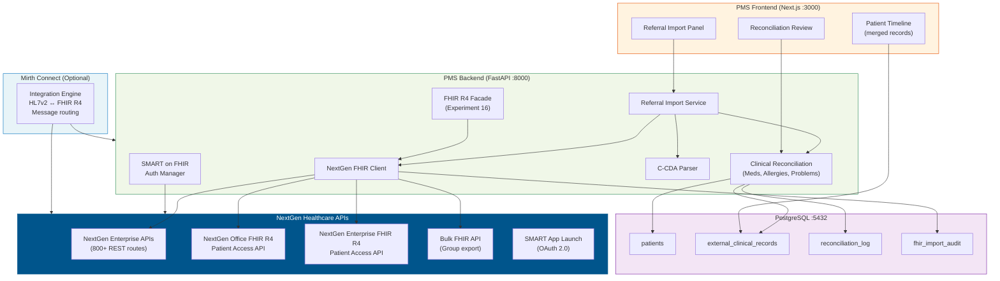
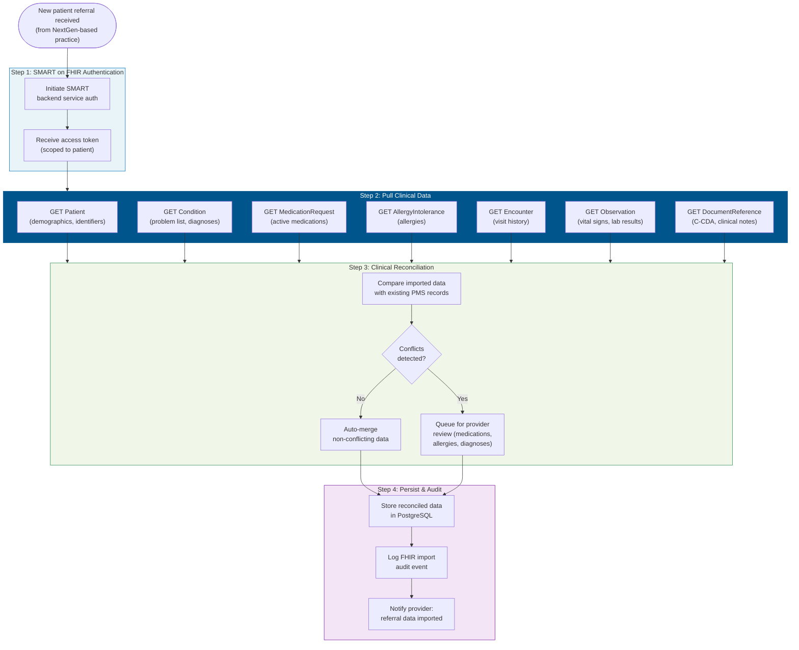

# Product Requirements Document: NextGen FHIR API Integration into Patient Management System (PMS)

**Document ID:** PRD-PMS-NEXTGENFHIR-001
**Version:** 1.0
**Date:** 2026-03-07
**Author:** Ammar (CEO, MPS Inc.)
**Status:** Draft

---

## 1. Executive Summary

NextGen Healthcare is the dominant EHR vendor in ophthalmology, with an estimated **50%+ market share** among eye care practices and over 500 ophthalmology client practices. NextGen Enterprise and NextGen Office provide specialty-specific EHR and practice management systems used by retina practices nationwide — including systems similar to what Texas Retina Associates (TRA) uses for clinical documentation, scheduling, and billing. NextGen exposes its clinical data through two API platforms: **800+ JSON-based RESTful Enterprise APIs** for administrative and clinical operations, and **FHIR R4 APIs** (Patient Access, Bulk FHIR, and SMART App Launch) compliant with the 21st Century Cures Act and US Core Data for Interoperability (USCDI).

For the PMS, integrating with NextGen's FHIR API solves the **referring provider data exchange problem**. When TRA receives a referral from an ophthalmologist or optometrist using NextGen (which is statistically likely given NextGen's market dominance in eye care), the PMS can pull the patient's complete clinical record — diagnoses, medications, allergies, prior encounters, imaging reports — directly from the referring provider's NextGen system via FHIR R4. This eliminates manual re-entry of patient history, reduces transcription errors, and gives the retina specialist a complete picture before the first visit.

Combined with Experiment 16 (FHIR Facade for exposing PMS data) and Experiment 48 (FHIR PA APIs for payer transactions), NextGen FHIR integration completes the **three-way FHIR interoperability** picture: the PMS can pull data from referring providers (NextGen FHIR API → PMS), expose data to external systems (PMS FHIR Facade → external), and transact with payers (PMS → Da Vinci PAS). Additionally, NextGen's Mirth Connect integration engine (used in 1/3 of all public Health Information Exchanges) is the industry-standard middleware for HL7/FHIR message routing, making it a natural bridge for complex multi-system integrations.

## 2. Problem Statement

The PMS currently has no mechanism to import clinical data from referring providers' EHR systems:

- **No referral data import**: When TRA receives a new patient referral from an optometrist or general ophthalmologist, clinical history (prior diagnoses, medications, allergies, imaging, treatment notes) is received as faxed paper records or PDF attachments. Staff manually re-enters this data into the PMS, taking 10-20 minutes per referral.
- **Incomplete clinical picture**: Without the referring provider's full record, the retina specialist may not know about relevant conditions (e.g., glaucoma medication that affects IOP during intravitreal injections, prior anti-VEGF treatments at another practice, systemic medications).
- **No CCDA/FHIR ingest pipeline**: The PMS cannot consume Consolidated Clinical Document Architecture (C-CDA) documents or FHIR resources from external EHR systems. Even when referring providers send electronic records, the PMS has no way to parse and integrate them.
- **NextGen is the dominant referral source**: Given NextGen's 50%+ ophthalmology market share, a large portion of TRA's referrals come from practices running NextGen. A targeted integration with NextGen's FHIR API covers the largest segment of referring providers with a single integration.
- **No bi-directional communication**: After TRA treats the patient, there is no automated way to send encounter summaries back to the referring provider's NextGen system. Communication is via faxed letters.

## 3. Proposed Solution

### 3.1 Architecture Overview

### 3.2 Referral Data Import Workflow

### 3.3 Deployment Model

- **Cloud API**: NextGen FHIR APIs are cloud-hosted. No self-hosting required.
- **Developer Program**: Register at [nextgen.com/developer-program](https://www.nextgen.com/developer-program). No charge for Patient Access API read routes (USCDI v1).
- **Sandbox**: Free sandbox environment provided after developer program registration.
- **SMART on FHIR**: OAuth 2.0 authorization via SMART App Launch framework. Patient-mediated access (patient authorizes data sharing) or backend service access (practice-level authorization).
- **Two platforms**:
  - **NextGen Office** (cloud-based): FHIR R4 at `https://fhir.meditouchehr.com/api/fhir/r4`
  - **NextGen Enterprise** (server-based): FHIR R4 at `https://fhir.nextgen.com/nge/prod/fhir-api-r4/fhir/r4/`
- **Mirth Connect** (optional): For complex integration scenarios requiring message transformation (HL7v2 ↔ FHIR), deploy Mirth Connect as middleware. Open-source versions available; commercial versions (4.6+) require license.
- **HIPAA**: All data exchanges contain PHI. BAA with NextGen required for production access. TLS 1.2+ enforced.

## 4. PMS Data Sources

| PMS API | Endpoint | NextGen FHIR Mapping | Interaction |
|---------|----------|---------------------|-------------|
| Patient Records | `/api/patients` | `Patient`, `Coverage` | Import demographics, identifiers, insurance from referring provider |
| Encounter Records | `/api/encounters` | `Encounter`, `Condition`, `Observation` | Import visit history, diagnoses, clinical observations |
| Prescription API | `/api/prescriptions` | `MedicationRequest`, `MedicationStatement` | Import active medications from referring provider for drug interaction checking |
| Reporting API | `/api/reports` | `AuditEvent` | Track referral import metrics (volume, source, reconciliation rate) |

## 5. Component/Module Definitions

### 5.1 NextGen FHIR Client

- **Description**: Async HTTP client for querying NextGen FHIR R4 endpoints. Handles pagination, search parameters, and `_include`/`_revinclude` for related resources.
- **Input**: Patient identifier (MRN or member ID), FHIR resource type, search parameters.
- **Output**: Parsed FHIR resources via `fhir.resources` Pydantic models.
- **Endpoints**: `GET /Patient`, `GET /Condition`, `GET /MedicationRequest`, `GET /AllergyIntolerance`, `GET /Encounter`, `GET /Observation`, `GET /DocumentReference`.

### 5.2 SMART on FHIR Auth Manager

- **Description**: Manages SMART App Launch authorization for connecting to NextGen FHIR servers. Supports both patient-mediated (authorization code) and backend service (client credentials with JWT assertion) flows.
- **Input**: NextGen FHIR server URL, client_id, private key (or client_secret for patient-mediated flow).
- **Output**: Bearer access token with FHIR read scopes.
- **Note**: Shared module with Experiment 48 (FHIR PA APIs) — same SMART auth pattern.

### 5.3 Referral Import Service

- **Description**: Orchestrates the referral data import workflow. Given a patient identifier at a NextGen practice, pulls all relevant FHIR resources and stages them for reconciliation.
- **Input**: Referring practice FHIR base URL, patient identifier.
- **Output**: Staged clinical data (conditions, medications, allergies, encounters, observations) ready for reconciliation.
- **PMS APIs used**: `/api/patients` (match to existing patient or create new).

### 5.4 C-CDA Parser

- **Description**: Parses Consolidated Clinical Document Architecture (C-CDA) documents retrieved via NextGen's `DocumentReference` resource. Extracts structured sections: medications, allergies, problems, encounters, vital signs.
- **Input**: C-CDA XML document (retrieved from NextGen FHIR `DocumentReference`).
- **Output**: Structured data mapped to PMS internal models.
- **Library**: `python-ccda` or custom XML parser with `lxml`.

### 5.5 Clinical Reconciliation Engine

- **Description**: Compares imported clinical data with existing PMS patient records and identifies conflicts (e.g., different active medication lists, unrecognized allergies, new diagnoses). Auto-merges non-conflicting data; queues conflicts for provider review.
- **Input**: Imported FHIR resources + existing PMS patient record.
- **Output**: Reconciled patient record with merge log.
- **PMS APIs used**: `/api/patients`, `/api/encounters`, `/api/prescriptions`.

### 5.6 Referral Summary Sender

- **Description**: After TRA treats the patient, generates a FHIR-compliant encounter summary and sends it back to the referring provider's NextGen system (if write access is available) or exports as C-CDA for fax/email delivery.
- **Input**: PMS encounter record.
- **Output**: FHIR `DiagnosticReport` or C-CDA document.
- **PMS APIs used**: `/api/encounters`, `/api/patients`.

### 5.7 Bulk FHIR Import Service

- **Description**: For batch scenarios (e.g., importing all patients from a practice group that transitions to TRA), uses NextGen's Bulk FHIR API to export patient groups via FHIR Bulk Data Access (`$export` operation).
- **Input**: Group ID or practice identifier.
- **Output**: NDJSON files containing all patient FHIR resources.
- **Endpoint**: `GET /Group/{id}/$export` at NextGen Bulk FHIR base URL.

## 6. Non-Functional Requirements

### 6.1 Security and HIPAA Compliance

- **SMART on FHIR**: All connections use OAuth 2.0 with SMART scopes. No static API keys.
- **Patient consent**: For patient-mediated flows, patient must authorize data sharing via NextGen's consent screen. Consent logged in PMS.
- **TLS 1.2+**: All FHIR API calls over HTTPS.
- **PHI encryption**: Imported clinical data encrypted at rest (AES-256) in PostgreSQL.
- **Audit logging**: Every FHIR import operation logged with: timestamp, user, patient, source practice, resources imported, reconciliation outcome.
- **Minimum necessary**: Only request FHIR resources needed for clinical care — do not bulk-download entire patient records.
- **Data retention**: Imported external records stored with source attribution. 7-year HIPAA retention.
- **BAA**: Required with NextGen Healthcare and any referring practice sharing data.

### 6.2 Performance

| Metric | Target |
|--------|--------|
| Single patient FHIR import (7 resource types) | < 10 seconds |
| C-CDA parse time | < 2 seconds per document |
| Clinical reconciliation | < 3 seconds per patient |
| Bulk FHIR export (100 patients) | < 5 minutes |
| SMART auth token acquisition | < 2 seconds |

### 6.3 Infrastructure

- **No new infrastructure for API access**: NextGen APIs are cloud-hosted.
- **Mirth Connect (optional)**: Docker container if HL7v2 ↔ FHIR translation needed.
- **PostgreSQL**: Existing instance. New tables: `external_clinical_records`, `reconciliation_log`, `fhir_import_audit`, `referral_sources`.
- **Python dependencies**: `fhir.resources`, `fhirpy`, `python-jose`, `httpx`, `lxml` (C-CDA parsing).

## 7. Implementation Phases

### Phase 1: NextGen FHIR Client & Import Pipeline (Sprint 1 — 2 weeks)

- Register in NextGen Developer Program
- Set up sandbox environment
- Implement SMART on FHIR Auth Manager (shared with Experiment 48)
- Build NextGen FHIR Client (Patient, Condition, MedicationRequest, AllergyIntolerance)
- Build Referral Import Service (single patient)
- Create PostgreSQL schema for external records
- Test against NextGen sandbox

### Phase 2: Reconciliation & Frontend (Sprint 2 — 2 weeks)

- Build Clinical Reconciliation Engine (auto-merge + conflict detection)
- Build C-CDA Parser for DocumentReference resources
- Create Referral Import Panel on frontend
- Create Reconciliation Review panel for provider conflict resolution
- Build Patient Timeline view (merged PMS + external records)
- Integrate with existing patient workflow

### Phase 3: Bi-directional & Bulk (Sprint 3 — 2 weeks)

- Build Referral Summary Sender (encounter summaries back to referring provider)
- Build Bulk FHIR Import Service for practice group transitions
- Connect to production NextGen instances (requires practice-level authorization)
- Implement Mirth Connect bridge for HL7v2 referring practices
- Performance optimization and audit log verification

## 8. Success Metrics

| Metric | Target | Measurement |
|--------|--------|-------------|
| Referral data import time | < 2 minutes (vs 10-20 min manual) | Timestamp delta from referral receipt to data available |
| Manual data re-entry reduction | -80% | Staff time tracking per referral |
| Clinical data completeness at first visit | > 90% of prior diagnoses, meds, allergies | Provider completeness assessment |
| Reconciliation accuracy | > 95% auto-merge success rate | Conflict rate tracking |
| Referring practices connected | 10+ NextGen practices in Year 1 | Connected practice count |
| Encounter summary return rate | > 80% of referrals | Referral summary sent count |

## 9. Risks and Mitigations

| Risk | Impact | Mitigation |
|------|--------|------------|
| Referring practice won't share FHIR access | Cannot import data | Use patient-mediated SMART flow (patient authorizes). Or fall back to C-CDA via Direct messaging |
| NextGen API rate limits | Throttled during bulk imports | Use Bulk FHIR API for large data sets. Implement exponential backoff |
| FHIR resource variations across NextGen versions | Parse errors | Validate all resources with `fhir.resources` Pydantic models. Handle gracefully |
| C-CDA documents incomplete or poorly structured | Missing data | Fall back to FHIR discrete resources. Log coverage gaps |
| SMART on FHIR registration per practice | Onboarding overhead | Build reusable SMART auth module. Automate registration where possible |
| Mirth Connect license cost (v4.6+) | Budget impact | Use open-source fork or older version. Evaluate if Mirth is needed |
| Data reconciliation conflicts | Provider review bottleneck | Maximize auto-merge for non-conflicting data. Only queue true conflicts |

## 10. Dependencies

| Dependency | Type | Notes |
|------------|------|-------|
| NextGen Developer Program | External | [nextgen.com/developer-program](https://www.nextgen.com/developer-program) — free registration |
| NextGen FHIR R4 API | External | Patient Access API, Bulk FHIR API, SMART App Launch |
| NextGen Enterprise APIs | External | 800+ REST routes for administrative/clinical operations |
| SMART on FHIR credentials | Secret | Per-practice client_id + private key or client_secret |
| `fhir.resources` | Python library | Pydantic FHIR R4 models (PyPI) |
| `fhirpy` | Python library | Async FHIR client |
| `lxml` | Python library | C-CDA XML parsing |
| Mirth Connect (optional) | Docker/License | HL7v2 ↔ FHIR bridge. OSS or commercial |
| Experiment 16 (FHIR Facade) | Internal | Provides FHIR resource mappings for PMS data |
| Experiment 48 (FHIR PA APIs) | Internal | Shares SMART on FHIR auth module |
| PostgreSQL 14+ | Infrastructure | Already deployed |
| FastAPI | Framework | Already deployed |

## 11. Comparison with Existing Experiments

| Aspect | Exp 16 (FHIR Facade) | Exp 47 (Availity) | Exp 48 (FHIR PA) | Exp 49 (NextGen FHIR) |
|--------|----------------------|-------------------|-------------------|----------------------|
| **Direction** | PMS → External | PMS → Payers | PMS → Payers | **External → PMS** |
| **Data type** | PMS clinical data out | PA/claims transactions | PA via FHIR | **Clinical data import** |
| **Source** | PMS internal data | Payer responses | Payer FHIR servers | **Referring provider EHR** |
| **Target system** | External EHRs, HIEs | Availity clearinghouse | Payer FHIR PA endpoints | **NextGen EHR (50%+ ophthalmology)** |
| **FHIR resources** | All mapped PMS resources | None (X12) | Claim, ClaimResponse | **Patient, Condition, MedicationRequest, AllergyIntolerance, Encounter, Observation** |
| **Use case** | Data sharing | PA submission, claims | PA submission (FHIR) | **Referral data import, clinical reconciliation** |
| **Auth** | SMART on FHIR (server) | OAuth 2.0 (Availity) | SMART on FHIR (client) | **SMART on FHIR (client)** |

**Key relationship**: Experiment 49 fills the **inbound data** gap. Experiments 16, 47, and 48 handle outbound data (sharing PMS data with external systems and payers). Experiment 49 handles inbound data (importing referring provider records into PMS). Together, they form a complete interoperability strategy: data in (Exp 49), data out (Exp 16), PA transactions (Exp 47/48).

## 12. Research Sources

**Official Documentation:**
- [NextGen API Portal](https://www.nextgen.com/api) — Central hub for all NextGen API documentation
- [NextGen FHIR & APIs](https://www.nextgen.com/solutions/interoperability/api-fhir) — FHIR R4 API overview and capabilities
- [NextGen Developer Program](https://www.nextgen.com/developer-program) — Developer registration and sandbox access
- [NextGen API Onboarding](https://www.nextgen.com/api-on-boarding) — Step-by-step onboarding process

**Technical References:**
- [NextGen Office FHIR R4 Swagger](https://petstore.swagger.io/?url=https://hfstatic.s3.amazonaws.com/swagger/swaggerR4.yaml) — Route-level API documentation
- [NextGen Enterprise FHIR R4 Base URL](https://fhir.nextgen.com/nge/prod/fhir-api-r4/fhir/r4/) — Production FHIR endpoint
- [NextGen Public API Docs](https://dev-cd.nextgen.com/api) — Enterprise API documentation portal

**Ecosystem:**
- [Mirth Connect Integration Engine](https://www.nextgen.com/solutions/interoperability/mirth-integration-engine) — HL7/FHIR integration middleware
- [Mirth Connect GitHub (OSS)](https://github.com/nextgenhealthcare/connect) — Open-source integration engine
- [NextGen Ophthalmology EHR](https://www.nextgen.com/markets/specialties/ophthalmology) — Specialty EHR with 50%+ ophthalmology market share

**Standards:**
- [HL7 FHIR Ophthalmology IG](https://build.fhir.org/ig/HL7/fhir-eyecare-ig/) — FHIR Implementation Guide for eye care
- [SMART App Launch v2.2.0](https://www.hl7.org/fhir/smart-app-launch/) — FHIR authorization framework

## 13. Appendix: Related Documents

- [NextGen FHIR Setup Guide](49-NextGenFHIRAPI-PMS-Developer-Setup-Guide.md)
- [NextGen FHIR Developer Tutorial](49-NextGenFHIRAPI-Developer-Tutorial.md)
- [Experiment 16: FHIR Facade PRD](16-PRD-FHIR-PMS-Integration.md)
- [Experiment 48: FHIR PA APIs PRD](48-PRD-FHIRPriorAuth-PMS-Integration.md)
- [Experiment 47: Availity API PRD](47-PRD-AvailityAPI-PMS-Integration.md)
