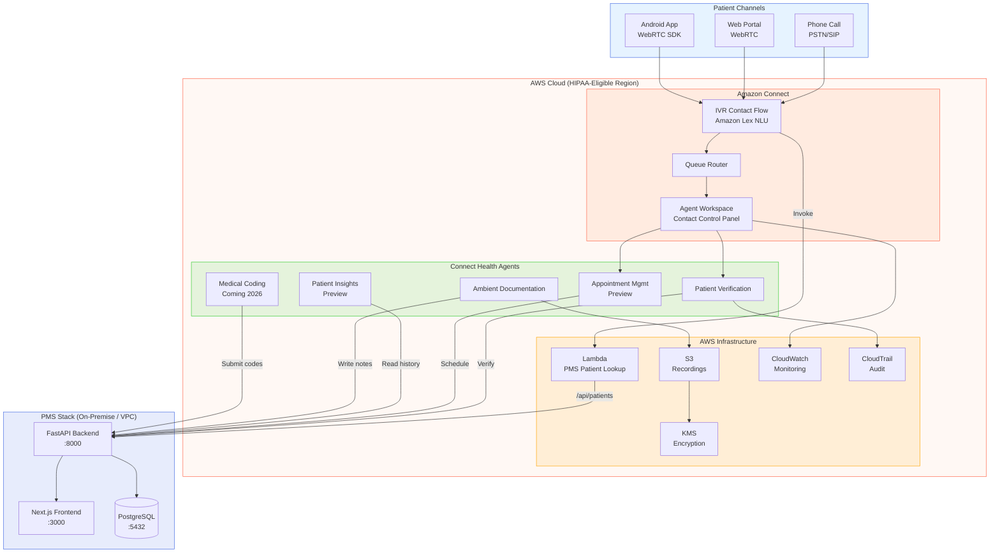

# Amazon Connect Health Developer Onboarding Tutorial

**Welcome to the MPS PMS Amazon Connect Health Integration Team**

This tutorial will take you from zero to building your first Amazon Connect Health integration with the PMS. By the end, you will understand how Amazon Connect Health's five AI agents work, have verified patient identity through a simulated call flow, captured ambient clinical documentation from an ophthalmology encounter, and reviewed auto-generated ICD-10/CPT codes — all integrated with PMS data.

**Document ID:** PMS-EXP-AMAZONCONNECTHEALTH-002
**Version:** 1.0
**Date:** 2026-03-07
**Applies To:** PMS project (all platforms)
**Prerequisite:** [Amazon Connect Health Setup Guide](51-AmazonConnectHealth-PMS-Developer-Setup-Guide.md)
**Estimated time:** 2-3 hours
**Difficulty:** Beginner-friendly

---

## What You Will Learn

1. What Amazon Connect Health is and why it matters for ophthalmology practice management
2. How the five AI agents (verification, scheduling, insights, ambient docs, coding) work together
3. How Amazon Connect contact flows route patient calls through IVR to agents
4. How to integrate patient verification with PMS patient records via Lambda
5. How to capture ambient clinical documentation during an encounter
6. How to review and accept AI-generated clinical notes with ICD-10/CPT codes
7. How to monitor call center metrics in real time from the PMS dashboard
8. How to evaluate Amazon Connect Health against self-hosted alternatives (Experiments 10, 21, 33)
9. How HIPAA compliance is maintained across the full call-to-billing workflow
10. How to extend the integration with custom contact flows and specialty templates

---

## Part 1: Understanding Amazon Connect Health (15 min read)

### 1.1 What Problem Does Amazon Connect Health Solve?

Consider the daily workflow at Texas Retina Associates (TRA):

**Morning at the front desk:** The phone rings 200+ times per day. Each call starts with "What's your name? Date of birth? Insurance ID?" Staff toggle between the phone, PMS patient lookup, the scheduling system, and the insurance portal. Average call takes 6 minutes — 2-3 minutes just on verification. Patients wait on hold, abandon calls at 20% rates, and show up without confirmed appointments.

**In the exam room:** Dr. Patel sees a patient with wet age-related macular degeneration. She spends 15 minutes on the encounter but 25 minutes afterward documenting it — typing SOAP notes, looking up ICD-10 codes (H35.3211 for wet AMD right eye), selecting CPT codes (67028 for intravitreal injection), and submitting the prior authorization. She sees 25 patients per day and spends more time on paperwork than on patient care.

**Amazon Connect Health solves both problems with five AI agents** that handle verification, scheduling, pre-visit prep, documentation, and coding — keeping clinicians in control while eliminating the manual overhead.

### 1.2 How Amazon Connect Health Works — The Five Agents

```mermaid
flowchart LR
    subgraph PreVisit["Pre-Visit"]
        A1[Patient Calls<br/>Phone/Web/App]
        A2[Patient Verification<br/>Agent]
        A3[Appointment<br/>Management Agent]
        A4[Patient Insights<br/>Agent]
    end

    subgraph DuringVisit["During Visit"]
        B1[Ambient Documentation<br/>Agent]
    end

    subgraph PostVisit["Post-Visit"]
        C1[Medical Coding<br/>Agent]
    end

    A1 -->|IVR + NLU| A2
    A2 -->|Identity confirmed| A3
    A3 -->|Appointment booked| A4
    A4 -->|Pre-visit summary<br/>ready for clinician| B1
    B1 -->|Clinical note<br/>generated| C1
    C1 -->|ICD-10/CPT codes<br/>ready for billing| D1[Revenue Cycle]

    style PreVisit fill:#e6f3ff,stroke:#4169e1
    style DuringVisit fill:#e6ffe6,stroke:#32cd32
    style PostVisit fill:#fff3e6,stroke:#ffa500
```



**Agent 1 — Patient Verification (GA):** When a patient calls, this agent conversationally verifies identity by asking for name and DOB, then cross-references against PMS records in real time. Eliminates the 2-3 minute manual lookup. UC San Diego Health saved 630 hours/week.

**Agent 2 — Appointment Management (Preview):** Natural language voice scheduling — patients say "I need to see Dr. Patel next Tuesday afternoon" and the agent checks provider availability, room capacity, and insurance eligibility before booking. Available 24/7.

**Agent 3 — Patient Insights (Preview):** Generates pre-visit summaries by pulling medical history, active medications, recent encounters, and care gaps from FHIR data stores. Ready on the clinician's screen before they enter the exam room.

**Agent 4 — Ambient Documentation (GA):** Listens to the patient-clinician conversation, generates structured clinical notes (SOAP, H&P, procedure notes) formatted to existing EHR templates. Supports 22+ specialties including ophthalmology. Traceability from notes to transcript.

**Agent 5 — Medical Coding (Coming 2026):** Takes the clinical note and generates ICD-10 diagnosis codes and CPT procedure codes with confidence scores and source traceability. Codes are staged for clinician review before submission.

### 1.3 How Amazon Connect Health Fits with Other PMS Technologies

| Experiment | What It Does | Relationship to Connect Health |
|-----------|-------------|-------------------------------|
| Exp 10: Speechmatics | Real-time ASR (cloud) | **Replaced by** ambient documentation agent |
| Exp 21: Voxtral | Self-hosted ASR (GPU) | **Complementary** — offline/edge fallback |
| Exp 07: MedASR | Medical speech recognition | **Replaced by** ambient documentation agent |
| Exp 30: ElevenLabs | TTS + STT + voice agents | **Complementary** — outbound voice (patient reminders) |
| Exp 33: Speechmatics Flow | Conversational voice agents | **Partially replaced** — Connect Health covers scheduling; Flow covers custom agents |
| Exp 47: Availity | Multi-payer eligibility/PA | **Complementary** — Connect Health triggers Availity checks during scheduling |
| Exp 48: FHIR PA | Prior auth via FHIR PAS | **Complementary** — ambient docs generate clinical justification for PA |
| Exp 05: OpenClaw | Agentic workflow automation | **Complementary** — orchestrate Connect Health + PMS workflows |

### 1.4 Key Vocabulary

| Term | Meaning |
|------|---------|
| **Contact Flow** | Visual workflow defining what happens when a patient calls — IVR prompts, routing, Lambda invocations |
| **Queue** | Waiting pool for contacts before they reach an agent (e.g., PatientAccess, ClinicalSupport) |
| **Routing Profile** | Maps agents to queues with priority and channel allocation |
| **Contact** | A single interaction (call, chat, or task) from a patient |
| **Ambient Session** | Active recording period during a clinical encounter for note generation |
| **Patient Verification** | AI-driven identity confirmation using spoken name/DOB against EHR records |
| **Unified SDK** | Amazon Connect Health's single SDK for embedding all five agents into applications |
| **Agent Workspace** | Web-based interface for call center staff with step-by-step guides |
| **Contact Lens** | Amazon Connect's analytics engine for call transcription and sentiment analysis |
| **BAA** | Business Associate Agreement — required contract with AWS for HIPAA-eligible PHI processing |
| **IVR** | Interactive Voice Response — automated phone menu system |
| **DID** | Direct Inward Dialing — phone number claimed for inbound calls |

### 1.5 Our Architecture



---

## Part 2: Environment Verification (15 min)

### 2.1 Checklist

```bash
# 1. AWS CLI configured
aws sts get-caller-identity | jq .Account
# Expected: Your AWS account ID

# 2. boto3 installed
python3 -c "import boto3; print(boto3.__version__)"
# Expected: 1.35+

# 3. Amazon Connect instance active
aws connect describe-instance \
  --instance-id $CONNECT_INSTANCE_ID \
  --region us-east-1 | jq '.Instance.InstanceStatus'
# Expected: "ACTIVE"

# 4. Connect Health domain and subscription active
aws connecthealth get-domain \
  --domain-id $CONNECT_HEALTH_DOMAIN_ID \
  --region us-east-1 | jq '.status'
# Expected: "ACTIVE"

aws connecthealth list-subscriptions \
  --domain-id $CONNECT_HEALTH_DOMAIN_ID \
  --region us-east-1
# Expected: at least one subscription with status "ACTIVE"

# 5. PMS backend running
curl -s http://localhost:8000/api/health | jq .status
# Expected: "healthy"

# 6. PMS frontend running
curl -s http://localhost:3000 -o /dev/null -w "%{http_code}"
# Expected: 200
```

### 2.2 Quick Test

```bash
# Test call center metrics endpoint
curl -s http://localhost:8000/api/connect-health/metrics | jq .
# Expected: { "agents_online": 0, "contacts_in_queue": 0, ... }
```

If metrics return, your integration is working.

---

## Part 3: Build Your First Integration (45 min)

### 3.1 What We Are Building

We'll build an **ophthalmology encounter documentation flow** — a complete workflow where:

1. A patient calls and is verified via the Patient Verification Agent
2. A pre-visit summary is generated by the Patient Insights Agent
3. During the encounter, ambient documentation captures the conversation
4. After the encounter, the clinician reviews the generated SOAP note and ICD-10/CPT codes
5. Accepted notes and codes are saved to the PMS encounter record

### 3.2 Create a Synthetic Test Patient

```python
# scripts/create_test_patient.py
"""Create a synthetic patient for Connect Health testing."""
import httpx

PATIENT_DATA = {
    "first_name": "Maria",
    "last_name": "Garcia",
    "date_of_birth": "1958-04-15",
    "phone": "5125551234",
    "insurance_id": "UHC-987654321",
    "insurance_payer": "UnitedHealthcare",
    "conditions": [
        {"code": "H35.3211", "description": "Wet AMD, right eye"},
        {"code": "E11.9", "description": "Type 2 diabetes mellitus"},
        {"code": "I10", "description": "Essential hypertension"},
    ],
    "medications": [
        {"name": "Eylea (aflibercept)", "dose": "2mg intravitreal", "frequency": "every 8 weeks"},
        {"name": "Metformin", "dose": "1000mg", "frequency": "twice daily"},
        {"name": "Lisinopril", "dose": "10mg", "frequency": "once daily"},
    ],
    "allergies": ["sulfa"],
}


def create_patient():
    with httpx.Client(base_url="http://localhost:8000") as client:
        response = client.post("/api/patients", json=PATIENT_DATA)
        response.raise_for_status()
        patient = response.json()
        print(f"Created patient: {patient['id']}")
        print(f"Name: {patient['first_name']} {patient['last_name']}")
        print(f"Phone: {patient['phone']}")
        return patient


if __name__ == "__main__":
    create_patient()
```

```bash
python scripts/create_test_patient.py
# Save the patient_id for next steps
export TEST_PATIENT_ID="returned-patient-id"
```

### 3.3 Simulate Patient Verification

```python
# scripts/test_verification.py
"""Simulate a patient call and verification through Connect Health."""
import httpx
import json

PMS_URL = "http://localhost:8000"


def simulate_verification():
    """
    Simulates what happens when Maria Garcia calls the practice.
    In production, Amazon Connect captures the phone number automatically
    and the Patient Verification Agent handles the conversation.
    """
    print("=" * 60)
    print("SIMULATING PATIENT CALL — VERIFICATION FLOW")
    print("=" * 60)

    # Step 1: Lambda identifies patient by phone number
    print("\n[1] Patient calls from +1-512-555-1234")
    print("    Lambda invoked by contact flow...")

    with httpx.Client(base_url=PMS_URL) as client:
        # Simulate Lambda patient lookup
        response = client.get(
            "/api/patients",
            params={"phone": "5125551234"},
        )
        patients = response.json()

        if patients:
            patient = patients[0]
            print(f"    Found: {patient['first_name']} {patient['last_name']}")
            print(f"    DOB: {patient['date_of_birth']}")
        else:
            print("    No patient found for this phone number.")
            return

    # Step 2: Patient Verification Agent confirms identity
    print("\n[2] Patient Verification Agent asks: 'Can you confirm your date of birth?'")
    print("    Patient says: 'April 15th, 1958'")

    with httpx.Client(base_url=PMS_URL) as client:
        response = client.post(
            "/api/connect-health/verify-patient",
            json={
                "contact_id": "test-contact-001",
                "spoken_name": "Maria Garcia",
                "spoken_dob": "1958-04-15",
                "caller_phone": "+15125551234",
            },
        )
        result = response.json()

    print(f"\n[3] Verification Result:")
    print(f"    Verified: {result.get('verified', 'N/A')}")
    print(f"    Confidence: {result.get('confidence', 'N/A')}")
    print(f"    Patient ID: {result.get('patient_id', 'N/A')}")
    print(f"    Method: {result.get('verification_method', 'N/A')}")

    if result.get("verified"):
        print("\n    Patient verified! Routing to PatientAccess queue...")
    else:
        print("\n    Verification failed. Transferring to agent for manual verification.")


if __name__ == "__main__":
    simulate_verification()
```

```bash
python scripts/test_verification.py
```

### 3.4 Retrieve Patient Insights (Pre-Visit Summary)

```python
# scripts/test_insights.py
"""Retrieve pre-visit summary from Connect Health Patient Insights Agent."""
import httpx
import json
import os

PMS_URL = "http://localhost:8000"
PATIENT_ID = os.environ.get("TEST_PATIENT_ID", "test-patient-001")


def get_pre_visit_summary():
    print("=" * 60)
    print("PRE-VISIT SUMMARY — PATIENT INSIGHTS AGENT")
    print("=" * 60)

    with httpx.Client(base_url=PMS_URL) as client:
        response = client.get(f"/api/connect-health/insights/{PATIENT_ID}")
        insights = response.json()

    print(f"\nPatient: {PATIENT_ID}")
    print(f"Generated: {insights.get('generated_at', 'N/A')}")

    if insights.get("summary"):
        print(f"\n--- Summary ---")
        print(insights["summary"])

    if insights.get("active_medications"):
        print(f"\n--- Active Medications ---")
        for med in insights["active_medications"]:
            print(f"  - {med.get('name', 'N/A')}: {med.get('dose', '')} {med.get('frequency', '')}")

    if insights.get("care_gaps"):
        print(f"\n--- Care Gaps ---")
        for gap in insights["care_gaps"]:
            print(f"  - {gap}")

    print(f"\nThis summary is displayed to Dr. Patel before she enters the exam room.")


if __name__ == "__main__":
    get_pre_visit_summary()
```

### 3.5 Capture Ambient Documentation

```python
# scripts/test_ambient.py
"""Simulate ambient documentation during an ophthalmology encounter."""
import httpx
import json
import time
import os

PMS_URL = "http://localhost:8000"
PATIENT_ID = os.environ.get("TEST_PATIENT_ID", "test-patient-001")

# Simulated encounter transcript (what the ambient agent would capture)
SIMULATED_TRANSCRIPT = """
Dr. Patel: Good morning, Maria. How have your eyes been since your last injection?

Maria Garcia: Good morning, doctor. My right eye has been a little blurry this week,
especially when reading. The left eye seems fine.

Dr. Patel: Let me take a look. I'm going to do an OCT scan of both eyes today.
[Performs OCT scan]
The OCT shows some subretinal fluid in the right eye. The left eye looks stable.
Your visual acuity today is 20/40 in the right eye and 20/25 in the left.

Maria Garcia: Is that worse than last time?

Dr. Patel: The right eye was 20/30 last visit, so yes, slightly decreased.
Given the fluid and the decreased vision, I'd recommend we do another
Eylea injection in the right eye today. We'll keep the left eye on monitoring.

Maria Garcia: Okay, let's do it.

Dr. Patel: I'll numb the eye first with topical anesthesia, then prep with
betadine, and administer the 2mg Eylea injection. You'll feel some pressure
but it shouldn't be painful.
[Performs intravitreal injection]
All done. The injection went smoothly. I'd like to see you back in 4 weeks
for another OCT and we'll decide on the next injection timing then.

Maria Garcia: Thank you, doctor.
"""


def simulate_ambient_documentation():
    print("=" * 60)
    print("AMBIENT DOCUMENTATION — OPHTHALMOLOGY ENCOUNTER")
    print("=" * 60)

    with httpx.Client(base_url=PMS_URL, timeout=60) as client:
        # Step 1: Start ambient session
        print("\n[1] Starting ambient session...")
        response = client.post(
            "/api/connect-health/ambient/start",
            json={
                "encounter_id": "test-encounter-001",
                "patient_id": PATIENT_ID,
                "specialty": "ophthalmology",
                "note_template": "SOAP",
            },
        )
        session = response.json()
        session_id = session.get("session_id", "test-session-001")
        print(f"    Session ID: {session_id}")
        print(f"    Status: {session.get('status', 'active')}")

        # Step 2: Simulate encounter duration
        print("\n[2] Encounter in progress (simulating 5-second recording)...")
        print(f"    Transcript preview:")
        for line in SIMULATED_TRANSCRIPT.strip().split("\n")[:6]:
            print(f"    {line.strip()}")
        print("    ...")
        time.sleep(5)

        # Step 3: Stop session and get generated note
        print("\n[3] Stopping ambient session and generating note...")
        response = client.post(
            "/api/connect-health/ambient/stop",
            json={
                "session_id": session_id,
                "encounter_id": "test-encounter-001",
            },
        )
        result = response.json()

    # Display results
    if result.get("clinical_note"):
        print(f"\n{'─' * 60}")
        print("GENERATED CLINICAL NOTE (SOAP)")
        print(f"{'─' * 60}")
        print(result["clinical_note"])
    else:
        # Show what the note would look like
        print(f"\n{'─' * 60}")
        print("EXPECTED CLINICAL NOTE (SOAP)")
        print(f"{'─' * 60}")
        expected_note = """
S: Patient reports blurry vision in right eye this week, especially
   when reading. Left eye vision unchanged. No pain, no new floaters.

O: VA: OD 20/40 (decreased from 20/30 last visit), OS 20/25 (stable)
   OCT: Subretinal fluid present OD, stable OS
   IOP: Not measured this visit

A: 1. Wet age-related macular degeneration, right eye (H35.3211)
      - Active disease with subretinal fluid and decreased VA
   2. Type 2 diabetes mellitus (E11.9) - stable
   3. Essential hypertension (I10) - stable

P: 1. Intravitreal Eylea (aflibercept) 2mg injection OD performed today
   2. Continue current systemic medications
   3. Follow-up in 4 weeks with OCT bilateral
   4. Monitor left eye; defer injection
"""
        print(expected_note)

    # Display suggested codes
    print(f"\n{'─' * 60}")
    print("SUGGESTED ICD-10 CODES")
    print(f"{'─' * 60}")
    icd10_codes = result.get("icd10_suggestions", [
        {"code": "H35.3211", "description": "Wet AMD, right eye", "confidence": 0.97},
        {"code": "E11.9", "description": "Type 2 diabetes mellitus", "confidence": 0.92},
        {"code": "I10", "description": "Essential hypertension", "confidence": 0.88},
    ])
    for code in icd10_codes:
        conf = code.get("confidence", 0) * 100
        print(f"  [{conf:.0f}%] {code['code']} — {code['description']}")

    print(f"\n{'─' * 60}")
    print("SUGGESTED CPT CODES")
    print(f"{'─' * 60}")
    cpt_codes = result.get("cpt_suggestions", [
        {"code": "67028", "description": "Intravitreal injection", "confidence": 0.98},
        {"code": "92134", "description": "OCT retina, bilateral", "confidence": 0.95},
        {"code": "92014", "description": "Ophthalmological exam, comprehensive", "confidence": 0.90},
    ])
    for code in cpt_codes:
        conf = code.get("confidence", 0) * 100
        print(f"  [{conf:.0f}%] {code['code']} — {code['description']}")

    print(f"\n{'─' * 60}")
    print("CLINICIAN ACTION REQUIRED")
    print(f"{'─' * 60}")
    print("  Review the generated note and codes above.")
    print("  Accept → saves to encounter record and queues for billing.")
    print("  Edit → modify note in PMS editor before saving.")
    print("  Discard → delete generated note; document manually.")


if __name__ == "__main__":
    simulate_ambient_documentation()
```

```bash
python scripts/test_ambient.py
```

### 3.6 Review the Complete Workflow

At this point you've walked through the full Connect Health workflow:

1. **Patient called** → Lambda identified Maria Garcia by phone number
2. **Verification Agent** confirmed identity (name + DOB match)
3. **Patient Insights Agent** generated pre-visit summary (AMD history, Eylea schedule, medications)
4. **Ambient Documentation Agent** listened to the encounter and generated a SOAP note
5. **Medical Coding** suggested ICD-10 (H35.3211, E11.9, I10) and CPT (67028, 92134, 92014) codes
6. **Clinician reviewed** and accepted the note → saved to PMS encounter record

**Checkpoint:** You've built and tested the complete patient-call-to-billing workflow with Amazon Connect Health integrated into PMS.

---

## Part 4: Evaluating Strengths and Weaknesses (15 min)

### 4.1 Strengths

- **End-to-end coverage**: Only solution that spans from phone call IVR through ambient documentation to medical coding in a single platform
- **Managed service**: No GPU infrastructure, no model hosting, no ASR pipeline — AWS manages everything
- **22+ specialty support**: Ophthalmology, optometry, and many more specialties supported out of the box
- **Proven scale**: Amazon One Medical has processed 1M+ ambient visits; UC San Diego Health handles 3.2M interactions/year
- **Native EHR integration**: Epic integration built-in; FHIR R4 for others
- **Unified SDK**: Single SDK for all five agents — incremental adoption without new integration projects
- **HIPAA eligible**: AWS BAA covers all Connect Health services; KMS encryption; CloudTrail audit

### 4.2 Weaknesses

- **Cloud-only**: No self-hosted option — all PHI transits through AWS; cannot run on-premise or on Jetson Thor
- **Vendor lock-in**: Deep dependency on AWS ecosystem; migration would require rebuilding all five agents
- **$99/user/month**: For 15 clinicians = $1,485/month ($17,820/year); significant cost vs self-hosted ASR
- **Limited customization**: Note templates and coding models are managed by AWS; limited ability to fine-tune for specific ophthalmology sub-specialty workflows
- **Preview features**: Appointment management and patient insights are still in preview; medical coding not yet available
- **No offline capability**: Requires internet connectivity; cannot function during AWS outages
- **Voice ID discontinuation**: AWS is discontinuing Voice ID (May 2026), suggesting possible feature churn

### 4.3 When to Use Amazon Connect Health vs Alternatives

| Scenario | Best Choice | Why |
|----------|-------------|-----|
| New practice with no contact center | **Connect Health** | Full turnkey solution |
| Existing Speechmatics/Voxtral deployment | **Keep existing + evaluate** | Avoid migration cost; evaluate ambient docs separately |
| Edge/offline clinical documentation | **Voxtral (Exp 21)** | Self-hosted, no internet required |
| Outbound patient reminders/TTS | **ElevenLabs (Exp 30)** | Better TTS quality; Connect Health is inbound-focused |
| Custom voice agent workflows | **Speechmatics Flow (Exp 33)** | More flexible agent builder |
| Budget-constrained practice | **Self-hosted stack** | Exps 07/10/21 + custom coding pipeline |
| Multi-location enterprise | **Connect Health** | Scales with AWS; no per-location infrastructure |

### 4.4 HIPAA / Healthcare Considerations

- **BAA is mandatory**: Do not process any PHI without an executed AWS BAA
- **Call recording consent**: IVR must announce recording; comply with state two-party consent laws (Texas is one-party, but other states vary)
- **PHI in transcripts**: Ambient documentation transcripts contain full PHI — stored encrypted in S3 with KMS CMK
- **Access control**: IAM roles with least-privilege; MFA required for admin access
- **Audit trail**: CloudTrail logs all API calls; CloudWatch logs contact flow events; PMS audit table for all PHI access
- **Data retention**: Configure S3 lifecycle policies for 7-year retention (HIPAA requirement for clinical records)
- **Incident response**: AWS shared responsibility — AWS handles infrastructure incidents; PMS team handles application-level incidents

---

## Part 5: Debugging Common Issues (15 min read)

### Issue 1: Contact flow doesn't invoke Lambda

**Symptom:** Patient calls but Lambda is never triggered; call goes to default queue.

**Cause:** Lambda function not associated with Connect instance, or contact flow not linked to phone number.

**Fix:**
```bash
# Associate Lambda with Connect instance
aws connect associate-lambda-function \
  --instance-id $CONNECT_INSTANCE_ID \
  --function-arn arn:aws:lambda:us-east-1:ACCOUNT:function:PmsPatientLookup \
  --region us-east-1

# Verify phone number association with contact flow
aws connect list-phone-numbers-v2 \
  --target-arn $CONNECT_INSTANCE_ARN \
  --region us-east-1
```

### Issue 2: Ambient documentation generates notes for wrong specialty

**Symptom:** Generated notes use primary care templates instead of ophthalmology.

**Cause:** Specialty not specified in session configuration.

**Fix:** Always pass `specialty: "ophthalmology"` in the `start_ambient_session` call. Verify your domain configuration:
```bash
aws connecthealth get-domain \
  --domain-id $CONNECT_HEALTH_DOMAIN_ID \
  --region us-east-1
```

### Issue 3: Patient verification fails despite correct data

**Symptom:** Verification returns `verified: false` even with matching name and DOB.

**Cause:** Phone number format mismatch between caller ID and PMS record.

**Fix:** Normalize phone numbers in both the Lambda function and PMS database:
```python
# Strip country code and formatting
phone = caller_phone.lstrip("+1").replace("-", "").replace("(", "").replace(")", "").replace(" ", "")
```

### Issue 4: High latency on ambient note generation

**Symptom:** `stop_ambient_session` takes > 30 seconds to return.

**Cause:** Long encounter recordings require more processing time.

**Fix:** This is expected for encounters over 20 minutes. Implement async processing:
```python
# Use polling instead of blocking wait
response = await service.stop_ambient_session(session_id)
while response["status"] == "processing":
    await asyncio.sleep(2)
    response = await service.get_ambient_session_status(session_id)
```

### Issue 5: CloudTrail missing Connect Health events

**Symptom:** Audit log queries return no Connect Health API calls.

**Cause:** CloudTrail may not be enabled for the `connecthealth` service in the trail configuration.

**Fix:**
```bash
# Verify trail is logging all management events
aws cloudtrail get-trail-status --name default --region us-east-1
# Ensure data events include connecthealth
```

---

## Part 6: Practice Exercises (45 min)

### Option A: Build a Callback Queue System

Build a contact flow that offers patients a callback instead of waiting on hold when queue wait time exceeds 3 minutes.

**Hints:**
1. Use `GetCurrentMetricData` to check queue wait time
2. Add a "Get customer input" block offering callback option
3. Store callback request in PMS database with patient ID and phone
4. Lambda triggers outbound call when agent becomes available

### Option B: Create an Ophthalmology Note Template Validator

Build a validator that checks ambient-generated notes against ophthalmology-specific requirements.

**Hints:**
1. Define required SOAP sections for ophthalmology (VA, IOP, OCT findings, assessment, plan)
2. Parse the generated note for required sections
3. Flag missing sections before clinician review
4. Score completeness (e.g., "8/10 required fields present")

### Option C: Build a Billing Code Accuracy Dashboard

Build a dashboard that tracks medical coding accuracy over time by comparing auto-generated codes against clinician-reviewed final codes.

**Hints:**
1. Store both suggested and accepted codes in PostgreSQL
2. Calculate agreement rate per code category (ICD-10 vs CPT)
3. Track accuracy trends over weeks/months
4. Identify frequently overridden codes for model feedback

---

## Part 7: Development Workflow and Conventions

### 7.1 File Organization

```
pms-backend/
├── services/
│   └── connect_health.py         # Connect Health service class
├── routers/
│   └── connect_health.py         # FastAPI endpoints
└── lambda/
    └── pms_patient_lookup.py     # Contact flow Lambda

pms-frontend/
├── components/
│   └── connect-health/
│       ├── AmbientDocumentation.tsx  # Ambient recording UI
│       ├── CallCenterDashboard.tsx    # Real-time metrics
│       ├── PatientInsightsCard.tsx    # Pre-visit summary
│       └── VerificationStatus.tsx    # Verification badge

scripts/
├── create_test_patient.py
├── test_verification.py
├── test_insights.py
└── test_ambient.py
```

### 7.2 Naming Conventions

| Item | Convention | Example |
|------|-----------|---------|
| Service class | `ConnectHealth{Feature}Service` | `ConnectHealthService` |
| API endpoint | `/api/connect-health/{feature}` | `/api/connect-health/ambient/start` |
| Lambda function | `pms_{purpose}` | `pms_patient_lookup` |
| DB table | `connect_health_{entity}` | `connect_health_ambient_sessions` |
| React component | `{Feature}.tsx` | `AmbientDocumentation.tsx` |
| Environment variable | `CONNECT_HEALTH_{KEY}` | `CONNECT_HEALTH_ENDPOINT` |

### 7.3 PR Checklist

- [ ] AWS BAA is executed (first-time setup only)
- [ ] No AWS credentials committed to code (use environment variables or IAM roles)
- [ ] All PHI access logged to PMS audit table
- [ ] KMS encryption configured for any new S3 buckets
- [ ] CloudTrail capturing new API calls
- [ ] Lambda function tested with SAM CLI locally
- [ ] Contact flow changes tested in Amazon Connect test environment
- [ ] Ambient documentation tested with synthetic encounter (never real patient data in dev)
- [ ] Frontend components handle loading, error, and empty states

### 7.4 Security Reminders

- **Never hardcode AWS credentials** — use IAM roles, environment variables, or AWS Secrets Manager
- **Always use KMS CMK** for PHI encryption — never use default S3 encryption for clinical data
- **Audit every PHI access** — PMS audit table + CloudTrail for compliance
- **Call recording consent** — IVR must announce recording before capturing audio
- **Minimum data principle** — Lambda functions should request only necessary patient fields
- **Session cleanup** — Ambient sessions must be explicitly stopped; implement timeout to prevent orphaned sessions
- **Two-factor verification** — Phone number alone is insufficient for identity; always require name + DOB confirmation

---

## Part 8: Quick Reference Card

### Key Commands

```bash
# Check instance status
aws connect describe-instance --instance-id $CONNECT_INSTANCE_ID --region us-east-1

# Verify Connect Health domain and subscriptions
aws connecthealth get-domain --domain-id $CONNECT_HEALTH_DOMAIN_ID --region us-east-1
aws connecthealth list-subscriptions --domain-id $CONNECT_HEALTH_DOMAIN_ID --region us-east-1

# Get real-time metrics
curl -s http://localhost:8000/api/connect-health/metrics | jq .

# Start ambient session
curl -s -X POST http://localhost:8000/api/connect-health/ambient/start \
  -H "Content-Type: application/json" \
  -d '{"encounter_id":"ENC-001","patient_id":"PAT-001","specialty":"ophthalmology"}'

# View CloudTrail events
aws cloudtrail lookup-events --lookup-attributes AttributeKey=EventSource,AttributeValue=connecthealth.amazonaws.com --max-results 5 --region us-east-1
```

### Key Files

| File | Purpose |
|------|---------|
| `services/connect_health.py` | Core service class for all Connect Health operations |
| `routers/connect_health.py` | FastAPI endpoints |
| `lambda/pms_patient_lookup.py` | Contact flow patient lookup |
| `AmbientDocumentation.tsx` | Ambient recording UI component |
| `CallCenterDashboard.tsx` | Real-time call center metrics |

### Key URLs

| Resource | URL |
|----------|-----|
| Amazon Connect Admin | `https://pms-health-contact-center.my.connect.aws` |
| Connect Health Docs | https://docs.aws.amazon.com/connecthealth/latest/userguide/ |
| Connect Health FAQs | https://aws.amazon.com/health/connect-health/faqs/ |
| Connect Health Pricing | https://aws.amazon.com/health/connect-health/pricing/ |
| boto3 Connect | https://boto3.amazonaws.com/v1/documentation/api/latest/reference/services/connect.html |
| PMS Backend | http://localhost:8000/api/health |

### Starter Template

```python
# Quick-start: Connect Health ambient documentation
from services.connect_health import ConnectHealthService

service = ConnectHealthService(
    instance_id="your-instance-id",
    region="us-east-1",
)

# Start ambient session
session = await service.start_ambient_session(
    encounter_id="ENC-001",
    patient_id="PAT-001",
    specialty="ophthalmology",
    note_template="SOAP",
)

# ... encounter happens ...

# Stop and get note
result = await service.stop_ambient_session(session["session_id"])
print(result["clinical_note"])
print(result["icd10_suggestions"])
print(result["cpt_suggestions"])
```

---

## Next Steps

1. Review the [PRD](51-PRD-AmazonConnectHealth-PMS-Integration.md) for full component definitions and implementation phases
2. Configure ophthalmology-specific note templates (SOAP, procedure notes for intravitreal injections, laser procedures)
3. Set up the Amazon Connect agent workspace with PMS patient context panels for front-desk staff
4. Integrate with [Experiment 47 (Availity)](47-PRD-AvailityAPI-PMS-Integration.md) for real-time eligibility checks during call verification
5. Evaluate the Appointment Management Agent when it reaches GA for 24/7 self-service scheduling
